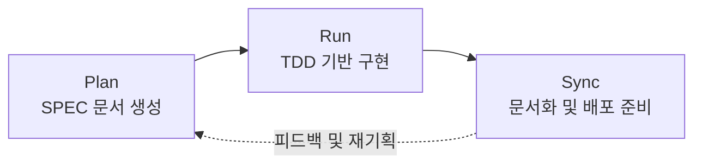

> 
> 다들 왜 이 시기 Fable로 밤샘 야근 하는 지 알겠다.
> 
> 기획, 설계로만 일단 Fable 불태울 예정!(구현은 나중에 opus 나 Sonnet으로)
> 
> - 평소 생각했던 서비스 기획, 설계를 Fable로 작업 진행 - Claude Cowork
> - UI/UX 설계 및 프로토타입 생성 - Claude Design
> - 위의 기획설계 문서와 Design 생성 파일을 가져다가 SPEC 작업 및 구현(이건 Opus와 Sonnet) - Claude Code
> 
> Claude CoWork - Claude Design - Claude Code 로 연결하는 하나의 싸이클을 적용해 보고 있다. 
> 
> 무엇보다 Moai -ADK 를 활용해서  Plan - Run - Sync로 지난 번 수업에서 잠깐 들었던 내용을 적용해 보고 있다. 엄청 좋네! 나만 알고 싶음ᄒ
> 
> 곧 재미있는 서비스 하나 런칭해 볼께요!
> 
> 아내들이 좋아하는 남편을 위한 서비스가 될 것 같은데
> 
> #moai #Claude
> 
> https://www.threads.com/@jerry_jy.kim/post/DaWTokdEtwD
> 

## 들어가며

Threads에 올라온 게시물(@jerry_jy.kim, `DaWTokdEtwD`)은 한 가지 흐름을 소개하고 있다. 평소 머릿속에만 있던 서비스 아이디어를 Claude Fable로 기획하고, Claude Design으로 화면을 설계한 뒤, 그렇게 만들어진 기획 문서와 디자인 산출물을 Claude Code로 넘겨 실제 구현까지 이어가는 하나의 순환 구조다. 여기에 더해 MoAI-ADK라는 오픈소스 프레임워크의 Plan–Run–Sync 방식론을 적용해 보고 있다는 내용도 함께 담겨 있다. 첨부된 화면 네 장은 "가는 김에 뭐 할까요?"라는 문구로 시작하는 위치 기반 할 일 알림 서비스의 초기 설계 화면으로, 사용자가 이동 동선에 맞춰 근처에서 처리할 심부름(원두 구매, 우유·두부 구매 등)을 추천받고 장소를 고르는 흐름을 보여준다. 게시물 본문에서 "아내들이 좋아하는 남편을 위한 서비스가 될 것 같다"고 언급한 것도 이 화면 구성과 맞닿아 있다.

이 글에서는 게시물에 등장하는 각 도구가 실제로 무엇이고 현재 어떤 상태인지를 공식 발표와 언론 보도를 바탕으로 하나씩 짚어보고, 이 도구들이 어떻게 하나의 파이프라인으로 연결되는지, 그리고 MoAI-ADK의 Plan–Run–Sync 순환 구조가 그 안에서 어떤 역할을 하는지를 정리한다.

---

## 1. Claude Fable 5란 무엇인가

Claude Fable 5는 Anthropic이 2026년 6월 9일에 공개한 모델로, 회사가 처음으로 만든 "Mythos급(Mythos-class)" 모델 계열 중 일반에 공개된 버전이다. Anthropic은 Fable 5가 소프트웨어 엔지니어링, 지식 노동, 비전, 과학 연구 등 거의 모든 벤치마크에서 이전까지 공개했던 어떤 모델보다도 앞선 성능을 보이며, 특히 작업이 길고 복잡할수록 기존 모델과의 격차가 더 커진다고 설명했다. 같은 날 공개된 Claude Mythos 5는 Fable 5와 동일한 가중치를 공유하지만 사이버보안 등 일부 영역의 안전장치가 걷어내진 버전으로, Project Glasswing이라는 미국 정부 협력 프로그램을 통해 소수의 검증된 조직에만 제공되고 있다.

Fable 5는 코딩과 지식 작업을 사람의 개입 없이 장시간 지속할 수 있고, 파일·PDF에 중첩된 도표나 표를 이해하는 고급 비전 능력을 갖췄으며, 스스로 작업 결과를 검증하는 자기 검토 기능을 특징으로 내세운다. 다만 사이버보안, 생물학, 화학처럼 오용 위험이 큰 영역의 질문은 별도의 안전 분류기가 감지해 자동으로 Claude Opus 4.8의 응답으로 전환되도록 설계되어 있다. 가격은 입력 토큰 100만 개당 10달러, 출력 토큰 100만 개당 50달러로, Opus 4.8 대비 약 두 배 수준이다.

이 모델은 출시 직후인 2026년 6월 12일, 미국 상무부의 수출 통제 지침을 준수하기 위해 Anthropic이 접근을 일시 중단시킨 바 있다. 이후 해당 통제가 6월 30일 해제되면서 Anthropic은 7월 1일부로 Fable 5와 Mythos 5 접근을 복구했다고 공식 발표했다. 즉 이번 게시물이 올라온 시점은 접근이 다시 열린 지 며칠 지나지 않은 시기로, 그동안 눌러왔던 장시간 작업 수요가 한꺼번에 몰리면서 "이 시기 다들 Fable로 밤새운다"는 표현이 나올 만한 배경이 만들어진 셈이다.

Fable 5는 현재 Claude Pro, Max, Team, Enterprise 요금제의 채팅 환경뿐 아니라 Claude Code, Claude Platform, Amazon Bedrock, Google Cloud, Microsoft Foundry 등에서 두루 이용할 수 있다. 게시물에서 언급한 "기획·설계는 Fable로, 구현은 Opus나 Sonnet으로"라는 역할 분담은 Fable이 장시간 추론과 폭넓은 맥락 처리에 강점을 보이는 반면, 실제 코드 작성 단계에서는 상대적으로 비용이 낮은 Opus 4.8이나 Sonnet 5로도 충분한 결과를 낼 수 있다는 실무적 판단에서 비롯된 것으로 보인다.

---

## 2. 하나로 이어지는 세 개의 도구: Cowork → Design → Code

게시물이 소개한 작업 순서는 서비스 기획, 화면 설계, 실제 구현이라는 세 단계를 각각 다른 Claude 제품에 맡기는 방식이다. 세 제품은 이름은 다르지만 모두 Claude Code를 구동하는 것과 같은 에이전트 아키텍처 위에서 동작하며, 사용량 한도도 채팅·Cowork·Design·Code가 하나의 공유 풀을 사용하도록 통합되어 있다.

### 2.1 기획 단계 — Claude Cowork

Claude Cowork는 Anthropic이 2026년 1월에 공개한 데스크톱 기반 에이전트 기능으로, 터미널 지식이 없는 사용자도 자연어로 목표를 설명하면 Claude가 로컬 파일과 폴더, 여러 애플리케이션을 넘나들며 결과물을 완성해 돌려주는 방식으로 동작한다. Anthropic은 이를 "Claude Code의 에이전트 능력을 코딩이 아닌 지식 노동으로 가져온 것"이라고 설명한다. 사용자가 하나하나 프롬프트를 입력하는 대신 원하는 결과와 작업 주기를 설명하면, Claude가 작업을 하위 작업으로 분해하고 병렬로 처리한 뒤 서식이 갖춰진 문서나 스프레드시트, 종합된 리서치 자료 같은 완성된 산출물을 제공한다. 다만 중요한 결정은 사람에게 남겨두도록 설계되어 있어, 작업 전 계획을 보여주고 승인을 받는 절차가 포함되어 있다. Claude Cowork는 Pro 이상 유료 요금제에서 Claude 데스크톱 앱을 통해 이용할 수 있다.

### 2.2 설계 단계 — Claude Design

Claude Design은 Anthropic Labs가 2026년 4월 17일 공개한 제품으로, 당시 가장 강력한 비전 모델이었던 Claude Opus 4.7을 기반으로 대화만으로 디자인, 프로토타입, 슬라이드, 원페이저 등의 시각 결과물을 만들 수 있게 해준다. 정적인 목업 이미지가 아니라 버튼 클릭이나 화면 전환, 입력 폼 처리 같은 실제 상호작용이 가능한 결과물을 만들어내는 것이 특징이며, 필요하면 음성 인터페이스나 3D 그래픽까지 포함할 수 있다. 팀의 코드 저장소나 기존 디자인 파일을 연결하면 Claude가 색상 팔레트, 타이포그래피, 재사용 가능한 컴포넌트를 추출해 조직 전용 디자인 시스템을 만들고, 이후 모든 프로젝트가 이 시스템을 자동으로 상속받는다. 완성된 디자인은 Canva, PDF, PPTX, 독립형 HTML 파일 등으로 내보낼 수 있고, 무엇보다 구현 단계로 넘어갈 준비가 되면 하나의 명령으로 "핸드오프 번들"을 만들어 Claude Code에 그대로 전달할 수 있다. Claude Design은 현재 Pro, Max, Team, Enterprise 플랜에서 베타로 제공되며, `claude mcp add`로 MCP 서버를 연결하면 Claude Code의 `/design-sync`, `/design-login` 같은 명령으로도 연동할 수 있다.

### 2.3 구현 단계 — Claude Code(Opus / Sonnet)

Design에서 넘어온 핸드오프 번들과 Cowork에서 정리된 기획 문서는 최종적으로 Claude Code로 전달되어 실제 코드로 구현된다. 게시물에서 "구현은 Opus나 Sonnet으로"라고 밝힌 것처럼, 이 단계에서는 반드시 Fable처럼 가장 비싼 모델을 쓸 필요 없이 Opus 4.8이나 Sonnet 5로도 충분한 경우가 많다는 실무적 선택이 반영되어 있다.

세 도구의 역할을 정리하면 다음과 같다.

| 도구 | 담당 단계 | 핵심 특징 |
|---|---|---|
| Claude Cowork | 서비스 기획, 자료 정리 | 데스크톱에서 로컬 파일·앱에 직접 접근, 다단계 작업을 자동으로 완료해 완성된 문서를 반환 |
| Claude Design | UI/UX 설계, 대화형 프로토타입 | 실행 가능한 코드 기반 결과물 생성, 조직 디자인 시스템 자동 상속, Claude Code로 핸드오프 번들 전달 |
| Claude Code (Opus/Sonnet) | 실제 코드 구현 | SPEC·디자인 산출물을 바탕으로 터미널·IDE 환경에서 프로덕션 코드 작성 |

이 흐름을 도식으로 정리하면 다음과 같다.

---

## 3. MoAI-ADK와 Plan–Run–Sync 순환 구조

게시물은 이 파이프라인에 "MoAI-ADK를 활용한 Plan–Run–Sync" 방식론을 함께 적용하고 있다고 밝히고 있다. MoAI-ADK는 `modu-ai` 팀이 만들어 GitHub에 공개한 오픈소스 프로젝트로, Claude Code 위에서 동작하는 "SPEC 우선(SPEC-First) 에이전틱 개발 키트"를 표방한다. Python으로 시작했던 프로젝트는 이후 의존성이 없는 Go 바이너리로 완전히 재작성되었으며, 다수의 전문화된 에이전트와 스킬을 갖추고 TDD·DDD 품질 게이트, 다국어 프로젝트 지원 등을 제공한다.

MoAI-ADK의 개발 방법론은 정확히 세 단계로 구성된다.

- **Plan**: `/moai plan "기능 설명"` 명령으로 요구사항을 분석해 성공 기준과 테스트 시나리오가 포함된 SPEC 문서를 만든다. 규모가 큰 기능이라면 리서처, 분석가, 아키텍트 역할의 에이전트가 병렬로 투입된다.
- **Run**: `/moai run SPEC-XXX` 명령으로 해당 SPEC을 기반으로 한 TDD 구현이 진행된다. 백엔드·프런트엔드·테스터 역할의 에이전트가 병렬로 작업하며, 품질 게이트를 통과하지 못하면 경고가 기록되되 작업 자체가 멈추지는 않는 완화된 검증 방식을 쓴다.
- **Sync**: `/moai sync SPEC-XXX` 명령으로 문서 업데이트를 자동화하고 배포를 준비한다. 과거에는 별도의 "Mx 단계"가 존재했지만 이후 버전에서는 이 검증 절차가 Sync 단계의 부가 작업으로 통합되었다.

MoAI-ADK는 스스로를 "하니스 엔지니어링(Harness Engineering)" 패러다임의 구현체라고 설명한다. 즉 엔지니어가 코드를 직접 작성하기보다 AI 에이전트가 일할 환경, 다시 말해 SPEC 문서와 품질 게이트, 피드백 루프를 설계하는 역할로 옮겨간다는 철학이다. 이 프레임워크는 필요에 따라 Claude API 기반의 리더 에이전트와 GLM 계열 모델 기반의 작업자 에이전트를 혼합해 구현 비용을 절감하는 하이브리드 모드도 지원한다.

Plan–Run–Sync의 순환 구조를 도식으로 표현하면 다음과 같다.

게시물에서 언급한 것처럼 이 순환 구조를 Cowork–Design–Code 파이프라인과 함께 적용하면, Fable로 만든 기획서와 Design으로 만든 프로토타입이 각각 MoAI-ADK의 Plan 단계에 입력되는 소재가 되고, 이후 Run 단계에서 Opus나 Sonnet 기반의 구현 작업으로 이어지는 그림이 완성된다.

---

## 4. 게시물에 첨부된 프로토타입 화면이 보여주는 것

첨부된 네 개의 화면은 Claude Design으로 만든 것으로 추정되는 서비스 프로토타입으로, "가는 김에 뭐 할까요?"라는 문구를 중심으로 한 위치 기반 심부름 알림 서비스를 보여준다. 첫 화면은 현재 위치(성수동)를 기준으로 "지금 근처"에서 처리할 수 있는 심부름을 카드 형태로 보여주고, 등록된 니즈 목록과 각 심부름까지의 도보 거리를 함께 표시한다. 두 번째와 세 번째 화면은 새로운 니즈를 등록하는 과정으로, 사용자가 "원두 떨어졌으니 사 오기"처럼 자연어로 할 일을 적으면 서비스가 우유·두부, 약국, 택배 보내기 같은 관련 추천을 제시하고, 이어서 근처의 후보 장소(카페, 마트 등) 중 도보 거리가 짧은 순으로 골라 저장할 수 있도록 안내한다. 이 흐름은 게시물 본문에서 "아내들이 좋아하는 남편을 위한 서비스"라고 표현한 것과 자연스럽게 연결되는데, 퇴근길이나 이동 중에 배우자가 부탁한 심부름을 잊지 않고 동선에 맞춰 처리하도록 돕는 용도로 읽힌다.

---

## 5. 정리

이번 게시물은 한 명의 개인 개발자가 Anthropic의 여러 제품을 역할별로 나누어 쓰는 구체적인 작업 방식을 보여준다는 점에서 의미가 있다. 정리하면, 접근이 막 복구된 고성능 모델(Fable 5)을 활용해 기획과 설계라는, 상대적으로 탐색과 반복이 많이 필요한 단계에 시간을 투자하고, 구현이라는 비교적 정형화된 단계는 비용 효율이 더 좋은 모델로 넘기는 방식이다. 여기에 Cowork(기획)–Design(설계)–Code(구현)라는 제품 간 파이프라인과, MoAI-ADK가 제공하는 Plan–Run–Sync라는 프로세스 방법론을 결합해, 아이디어에서 실제 서비스까지 이어지는 흐름을 하나의 반복 가능한 절차로 만들려는 시도로 볼 수 있다.

---

## 출처

- Anthropic, "Claude Fable 5 and Claude Mythos 5"(2026년 6월 9일) — anthropic.com/news/claude-fable-5-mythos-5
- Anthropic, "Claude Fable"(제품 페이지, 접근 복구 공지 포함) — anthropic.com/claude/fable
- Claude Platform Docs, "Introducing Claude Fable 5 and Claude Mythos 5"
- CNBC(2026년 6월 9일), TechCrunch(2026년 6월 9일), Yahoo Finance(2026년 6월 9일) Claude Fable 5 출시 보도
- AWS 한국 블로그, "Anthropic Claude Fable 5 모델 공개"(수출 통제로 인한 접근 중단·재개 공지 포함)
- Anthropic, "Introducing Claude Design by Anthropic Labs"(2026년 4월 17일) — anthropic.com/news/claude-design-anthropic-labs
- Anthropic 지원 센터, "Claude Design 시작하기", "Claude Design에서 디자인 시스템 설정하기"
- Anthropic, "Claude Cowork" 제품 페이지 및 지원 센터 "Claude Cowork 시작하기"
- GitHub, modu-ai/moai-adk README 및 공식 문서(adk.mo.ai.kr)
- Threads, @jerry_jy.kim 게시물(post ID: DaWTokdEtwD)

---

작성일: 2026년 7월 4일
