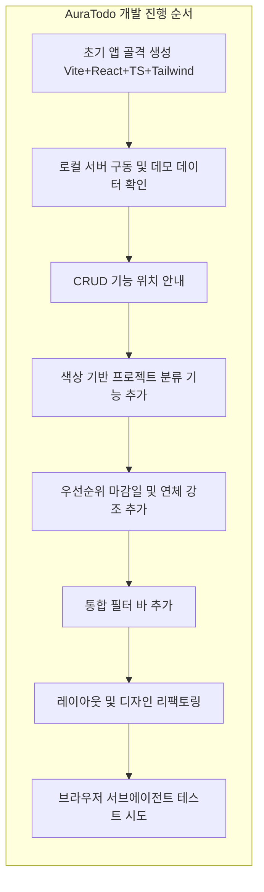
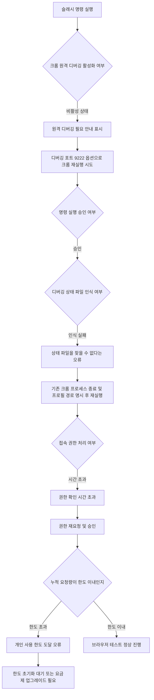
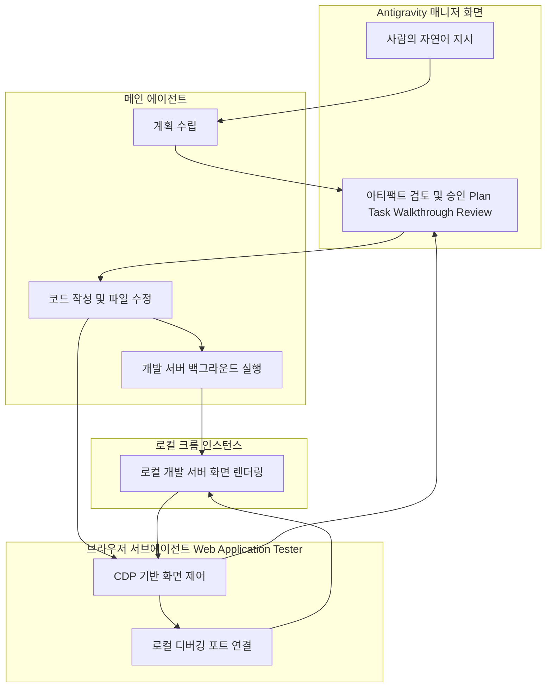

## 1. 들어가며

공유해 주신 대화록과 화면 구성은 구글이 만든 에이전트 우선(Agent-First) 개발 플랫폼인 **Google Antigravity**를 사용해서, "AuraTodo"라는 이름의 프리미엄 Todo 대시보드 애플리케이션을 만들어 나가는 과정을 담고 있습니다. Vite, React, TypeScript를 뼈대로 하고 Tailwind CSS로 디자인을, Recharts로 통계 시각화를, Lucide React로 아이콘을 구성한 웹 애플리케이션을 사람이 직접 코드를 타이핑하지 않고 자연어 지시만으로 에이전트에게 위임하여 완성해 나가는 흐름입니다. 그리고 후반부에는 완성된 화면을 실제 브라우저에서 자동으로 눌러보고 검증하는 "브라우저 서브에이전트" 기능을 호출했다가, 크롬 원격 디버깅 연결이 계속 실패하고 결국 사용량 한도(할당량)에 도달하면서 검증이 끝내 완료되지 못하는 과정까지 함께 기록되어 있습니다.

아래에서는 (1) Google Antigravity라는 플랫폼 자체가 무엇이고 어떤 구조로 되어 있는지, (2) 이 대화록에서 AuraTodo 앱이 어떤 순서로 어떻게 만들어졌는지, (3) 화면에 등장하는 각 구성 요소(탭, 아티팩트, 서브에이전트 등)가 각각 무엇을 의미하는지, (4) 브라우저 테스트 과정에서 왜 그렇게 여러 번 오류가 반복되었는지, (5) 이 사례가 에이전트 하네스(harness) 설계 관점에서 어떤 의미를 갖는지를 차례로 서술형으로 풀어 설명드립니다. 모든 사실 관계는 구글의 공식 발표 자료와 개발자 문서, 그리고 관련 기술 매체의 최신 보도를 확인한 뒤 작성했으며, 확인되지 않은 수치나 추측성 내용은 포함하지 않았습니다.

---

## 2. Google Antigravity란 무엇인가

### 2.1 탄생 배경

Google Antigravity는 구글이 2025년 11월 18일, 최신 모델인 Gemini 3의 공개와 함께 처음 선보인 에이전트 우선(Agent-First) 소프트웨어 개발 플랫폼입니다. 기존의 AI 코딩 도구들이 "자동완성을 더 똑똑하게 만든 것"에 가까웠다면, Antigravity는 개발자가 세세한 지시를 하나하나 내리는 대신 "무엇을 만들어라"라는 목표 수준의 지시만 내리면 에이전트가 스스로 계획을 세우고, 코드를 작성하고, 터미널에서 실행해 보고, 브라우저로 직접 결과를 확인한 뒤 수정까지 마치는 것을 지향하는 제품으로 소개되었습니다. 이후 2026년 5월 19일 구글의 연례 개발자 행사인 I/O 2026에서 대규모로 개편된 **Antigravity 2.0**이 정식 공개되었는데, 대화록 좌측 상단에 표시된 "Version 2.0.6"이라는 표기는 바로 이 2.0 계열의 배포판임을 보여줍니다.

### 2.2 제품군 구성

Antigravity는 하나의 프로그램이 아니라 몇 가지 구성 요소로 이루어진 하나의 생태계에 가깝습니다.

먼저 **Antigravity 2.0**은 IDE 없이도 독립적으로 실행되는 데스크톱 애플리케이션으로, 여러 에이전트를 동시에 띄우고 관리하는 일종의 관제탑(미션 컨트롤) 역할을 합니다. 대화록에 보이는 좌측의 "New Conversation", "Conversation History", "Scheduled Tasks", "Projects" 메뉴 구성이 바로 이 매니저 화면의 전형적인 모습입니다. 그다음으로 **Antigravity IDE**가 있는데, 이는 비주얼 스튜디오 코드(VS Code)를 기반으로 깊게 수정하여 만든 코드 편집기로, 화면 상단의 "Open IDE" 버튼을 누르면 실제 코드 파일들을 열람하고 직접 편집할 수 있는 전통적인 편집기 화면으로 전환됩니다. 이 밖에 터미널 환경에서 에이전트를 호출하는 **Antigravity CLI**(agy라는 실행 명령을 사용하며, 기존 Gemini CLI를 대체하는 위치에 있습니다)와, 이러한 에이전트 기능을 개발자가 자신의 애플리케이션에 직접 통합할 수 있도록 제공하는 **Antigravity SDK**가 존재합니다. 대화록의 사례는 이 가운데 매니저 화면과 IDE를 오가며 하나의 프로젝트("Developing a Premium Todo App")를 진행한 경우에 해당합니다.

### 2.3 에이전트 우선(Agent-First) 철학과 두 개의 화면

Antigravity의 가장 큰 특징은 화면을 크게 두 가지 성격으로 나누어 설계했다는 점입니다. 하나는 사람이 실시간으로 지시를 주고받는 **매니저(Manager) 뷰**이고, 다른 하나는 실제 코드가 존재하는 **에디터(Editor) 뷰**입니다. 기존의 AI 코딩 도구들이 에디터 안에 채팅창을 곁들이는 방식이었다면, Antigravity는 반대로 에이전트와의 대화가 중심이 되는 화면 안에 에디터나 브라우저, 터미널 같은 도구들이 필요할 때마다 결합되는 구조를 취합니다. 구글은 이를 두고 "표면(surface) 안에 에이전트가 들어가 있는 것이 아니라, 에이전트 안에 표면들이 들어가 있는 형태"라고 설명한 바 있습니다.

### 2.4 아티팩트(Artifacts)라는 신뢰 장치

에이전트가 사람의 감독 없이 여러 단계를 자율적으로 처리하다 보면, 정작 사람 입장에서는 "지금 무슨 일이 일어났는지"를 파악하기가 어려워질 수 있습니다. Antigravity는 이 문제를 해결하기 위해 에이전트가 작업의 각 단계마다 **아티팩트**라는 검증 가능한 산출물을 만들어내도록 설계되어 있습니다. 대화록 우측 패널에 등장하는 다음 네 가지가 대표적인 아티팩트입니다.

- **Implementation Plan(구현 계획서)**: 실제 코드를 건드리기 전에 에이전트가 무엇을 어떻게 바꿀 것인지 정리한 문서로, 사람이 이를 읽고 "승인" 버튼을 눌러야 다음 단계로 넘어가는 구조로 되어 있습니다. 대화록에서 "승인합니다"라는 짧은 답변이 반복해서 등장하는 이유가 바로 이 절차 때문입니다.
- **Task(작업 목록)**: 계획을 실제로 실행해 나가는 과정에서 어떤 하위 작업이 완료되었고 어떤 작업이 남아 있는지를 체크리스트 형태로 보여주는 문서입니다.
- **Walkthrough(완료 보고서)**: 작업이 모두 끝난 뒤 무엇을 바꾸었는지, 어떤 파일이 어떻게 수정되었는지를 사람이 읽기 좋은 설명형 보고서로 정리한 문서입니다.
- **Review(변경 사항 검토)**: 실제로 수정된 파일들의 변경 전후 코드를 나란히 비교해서 보여주는 화면으로, 일반적인 코드 리뷰 도구의 diff 화면과 유사한 형태입니다.

이 네 가지 탭이 화면 상단에 "Overview / Review / Implementation Plan / Walkthrough"라는 이름으로 나란히 배치되어 있는 것을 확인하실 수 있는데, 이는 하나의 작업 요청에 대해 에이전트가 만들어낸 산출물들을 사람이 각각의 관점에서 검증할 수 있도록 구성한 것입니다.

### 2.5 프로젝트, 서브에이전트, 백그라운드 작업

Antigravity는 작업의 범위를 **프로젝트** 단위로 관리합니다. 프로젝트란 에이전트가 접근할 수 있는 폴더와 권한의 경계를 정의한 것으로, 대화록에서는 "Developing a Premium Todo App"이라는 이름의 프로젝트 하나가 계속 사용되고 있습니다. 그리고 하나의 메인 에이전트가 작업을 진행하다가 별도의 전문화된 역할이 필요할 경우, **서브에이전트(Subagent)** 를 호출하여 일감을 위임할 수 있습니다. 대화록 후반부에 등장하는 "Web Application Tester"라는 이름의 서브에이전트가 바로 그 사례로, 이는 브라우저를 직접 조작해서 화면을 눌러보고 기능이 정상 동작하는지 검증하는 역할에 특화된 하위 에이전트입니다. 우측 패널의 "Background Tasks" 항목에 표시된 "npm run dev"는 에이전트가 백그라운드에서 계속 띄워 둔 로컬 개발 서버 프로세스를 의미합니다.

---

## 3. AuraTodo 프로젝트가 만들어진 전체 과정

대화록 전체를 시간 순서대로 정리하면, 하나의 Todo 애플리케이션이 요청 하나하나에 따라 점진적으로 살이 붙어가는 과정을 볼 수 있습니다.

가장 처음의 요청은 "Vite, React, TypeScript로 Todo 앱을 만들고 Tailwind CSS, Recharts, Lucide React를 포함해 달라"는 것이었습니다. 이에 대해 에이전트는 곧바로 코드를 작성하는 대신, 먼저 "AuraTodo"라는 이름의 프리미엄 Todo 대시보드에 대한 구현 계획서를 작성해서 승인을 요청했고, 승인을 받은 뒤에야 실제 프로젝트 생성과 개발에 착수했습니다. 개발이 끝난 뒤에는 walkthrough 문서와 task 체크리스트가 함께 만들어졌고, 로컬 실행 명령인 `npm run dev`로 개발 서버를 구동하는 방법이 안내되었습니다.

이어서 로컬 서버를 직접 구동하고 테스트해 달라는 요청이 들어오자, 에이전트는 `http://localhost:5173/`에서 개발 서버를 띄우고 곧바로 사용해 볼 수 있는 데모 데이터 네 건(우선순위별, 카테고리별, 마감 임박 및 경과, 하위 서브태스크 포함 항목)을 로컬 스토리지에 자동으로 넣어 두어, 사람이 빈 화면이 아니라 실제로 동작하는 상태의 화면을 바로 확인할 수 있도록 준비했습니다.

그다음 순서로 "할 일 추가, 완료 체크, 수정, 삭제 기능을 만들어 달라"는 요청이 있었는데, 흥미롭게도 이 기능들은 이미 앞선 개발 단계에서 구현이 끝나 있는 상태였습니다. 에이전트는 이를 새로 만드는 대신, 이미 구현되어 있는 각 기능이 어느 파일의 어느 부분(TodoInput.tsx, TodoItem.tsx, App.tsx의 각 핸들러 함수)에 들어있고 화면에서 어떻게 조작하면 되는지를 구체적으로 안내하는 방식으로 응답했습니다. 이는 에이전트가 매번 새 코드를 찍어내는 것이 아니라, 기존 코드베이스의 상태를 스스로 파악하고 그에 맞추어 응답을 조정한다는 점을 보여주는 대목입니다.

이후 요청은 기능 확장 쪽으로 이어졌습니다. 색상을 직접 선택해서 프로젝트(카테고리)를 만들고 할 일 항목을 그 프로젝트에 연결하는 기능이 추가되었고, 이 작업 역시 구현 계획서 작성과 승인 절차를 거쳐 진행되었습니다. 완료된 뒤에는 사이드바에서 새 프로젝트를 만들고 색상을 지정하는 방법, 할 일 카드에 프로젝트가 색상 배지로 표시되는 방식, 그리고 상단 대시보드의 원형 그래프(파이 차트)에서 프로젝트별 분포가 실제 프로젝트 색상과 맞물려 표시되는 부분까지 상세히 안내되었습니다.

다음으로는 우선순위(높음/보통/낮음)와 마감일 필드가 추가되었고, 마감일이 지난 미완료 항목을 시각적으로 강조하는 기능이 구현되었습니다. 처음에는 진한 빨간색 테두리로 강하게 표시되었으나, 이후 진행된 리팩토링 단계에서 사람의 눈에 덜 피로한 부드러운 로즈색 계열의 옅은 배경과 은은한 테두리로 다시 다듬어졌습니다.

이어서 상태(전체/진행/완료), 우선순위, 프로젝트별 필터링과 텍스트 검색 기능을 하나로 묶은 상단 통합 필터 바가 추가되었습니다. 그런데 이 시점에서 사용자가 "UI가 정리된 것 같지 않다. 제대로 만들어 달라"는 다소 직접적인 품질 피드백을 주었고, 이에 대해 에이전트는 다시 한 번 구현 계획서를 작성하여 전체적인 레이아웃 비례와 필터 바의 2단 배치, 글래스모피즘(반투명 유리 질감) 밀도를 조정하는 리팩토링 작업을 진행했습니다. 이 리팩토링에서는 필터 요소들을 상단의 큰 검색창과 하단의 4열 필터 그리드로 나누어 배치하고, 드롭다운 선택 상자의 기본 화살표 아이콘을 감추고 별도의 아이콘으로 교체했으며, 화면 최대 너비를 넓히고 좌측 프로젝트 목록과 우측 작업 목록의 비율을 3대9로 재조정하는 등, 시각적 완성도를 끌어올리는 세부 조정이 다수 이루어졌습니다.

실제로 완성된 화면을 보면, 상단에는 오늘 날짜와 진행률 막대가 있는 요약 영역이 있고, 그 아래로 진척도 요약 카드, 최근 7일간의 완료 추이를 보여주는 꺾은선 그래프, 프로젝트별 분포를 보여주는 도넛 형태의 원형 그래프가 배치되어 있으며, 그 아래로 좌측에는 프로젝트 분류 목록이, 우측에는 검색창과 필터, 그리고 실제 할 일 카드 목록이 자리잡은 대시보드 형태로 정리되어 있습니다.



---

## 4. 화면 오른쪽 패널이 보여주는 것들 자세히 뜯어보기

화면 우측의 보조 패널(Auxiliary Pane)에는 매 작업마다 다음과 같은 항목들이 정리되어 나타납니다.

**Subagents(서브에이전트)** 항목은 현재 이 작업에 몇 개의 하위 에이전트가 동원되었는지를 보여줍니다. 초반 개발 작업에서는 0개였다가, 브라우저 테스트를 요청한 시점부터 "Web Application Tester"라는 서브에이전트 1개가 나타나고, 그 상태(작업 중, 작업 완료 등)가 함께 표시됩니다.

**Files Changed(변경된 파일)** 항목은 이번 작업으로 실제 수정되거나 새로 생성된 파일 목록을 보여줍니다. tailwind.config.js, postcss.config.js, index.html, index.css, todo.ts 같은 파일들이 나열되어 있고, 각 파일 옆에는 실제 저장 경로까지 함께 표시되어 어느 프로젝트 폴더에서 작업이 이루어지고 있는지 바로 알 수 있게 되어 있습니다.

**Artifacts(산출물)** 항목은 앞서 설명한 Walkthrough, Task, Implementation Plan 문서들의 목록이며, 클릭하면 우측 패널의 내용이 해당 문서로 전환됩니다.

**Background Tasks(백그라운드 작업)** 항목은 에이전트가 사용자 몰래 뒤에서 실행해 둔 프로세스, 즉 개발 서버(`npm run dev`)가 계속 살아있는 상태임을 보여줍니다. 이 덕분에 사람이 별도로 터미널을 열어 서버를 켤 필요 없이, 에이전트가 만든 화면을 곧바로 브라우저에서 확인할 수 있습니다.

이 밖에 화면 하단의 입력창에는 "Worktree"라는 표시와 함께 사용할 모델을 고르는 선택 상자가 있는데, 이 부분은 5절에서 모델 관련 내용과 함께 자세히 다루겠습니다.

---

## 5. 브라우저 서브에이전트 테스트가 계속 실패한 이유

대화록의 후반부는 `/browser 테스트`라는 슬래시 명령으로 시작됩니다. Antigravity에서 `/browser` 명령은 에이전트에게 명시적으로 "브라우저를 열어서 실제로 확인해 보라"고 지시하는 기능입니다. 구글이 공개한 문서에 따르면, 초기에는 에이전트가 스스로 판단해서 브라우저를 켤지 말지를 결정하도록 했으나, 이 판단이 충분히 정교하지 않다는 피드백을 반영하여 현재는 사람이 `/browser`라는 슬래시 명령으로 명시적으로 지시할 때만 브라우저 조작이 이루어지도록 바뀌었습니다.

### 5.1 브라우저 서브에이전트의 동작 원리

Antigravity에 내장된 브라우저 서브에이전트는 별도의 확장 프로그램이나 플레이라이트(Playwright) 같은 외부 도구를 설치하지 않고도, **크롬 개발자 도구 프로토콜(Chrome DevTools Protocol, 이하 CDP)** 을 통해 곧바로 브라우저를 제어하도록 설계되어 있습니다. 이 방식은 크롬을 "원격 디버깅" 모드로 실행한 뒤, 로컬의 특정 포트(대화록에서는 9222번 포트)를 통해 웹소켓으로 연결하여, 에이전트가 내리는 높은 수준의 지시("검색창에 텍스트를 입력해라", "필터 버튼을 눌러라" 등)를 화면의 요소를 클릭하고 값을 입력하는 낮은 수준의 CDP 명령으로 변환해서 실행하는 구조입니다. 동시에 에이전트는 화면을 시각적으로 분석하는 멀티모달 능력을 함께 사용해서, 어느 요소를 눌러야 할지 스스로 판단합니다.

### 5.2 실제로 벌어진 오류들의 순서

대화록에 나타난 오류들은 우연히 여러 문제가 겹친 것이 아니라, 브라우저 원격 제어 환경을 처음 구성할 때 흔히 겪는 전형적인 단계별 장애물이 순서대로 나타난 경우에 가깝습니다.

먼저 처음 `/browser` 명령을 실행하자 "Remote Debugging Required(원격 디버깅이 필요합니다)"라는 안내가 떴습니다. 이는 사용자가 평소 쓰던 크롬이 원격 디버깅 기능이 켜지지 않은 일반 모드로 실행되고 있었기 때문입니다. 이 안내에는 `chrome://inspect/#remote-debugging` 페이지로 이동해서 원격 디버깅을 허용해야 한다는 안내와 함께, 이를 무시하고 진행할지(Proceed Anyways) 다시 확인할지(Check again)를 선택하는 버튼이 함께 제공되었습니다.

이 문제를 넘기기 위해 에이전트는 스스로 `Start-Process`라는 파워셸 명령을 사용해서, `--remote-debugging-port=9222` 옵션과 임시 사용자 데이터 폴더 경로를 지정한 새 크롬 인스턴스를 직접 실행하려고 시도했습니다. 이 명령은 시스템에 실질적인 변경을 가하는 행위이기 때문에 Antigravity는 이를 곧바로 실행하지 않고, "이 명령을 실행하도록 허용하시겠습니까?"라는 확인 절차를 사람에게 요청했습니다. 이는 Antigravity가 채택하고 있는 "터미널 정책(Terminal Policy)" 및 승인 절차의 한 사례로, 위험도가 있는 명령 실행 앞에서는 자동 진행을 멈추고 사람의 승인을 받도록 설계되어 있음을 보여줍니다.

승인 이후에도 곧바로 문제가 풀리지는 않았습니다. 이번에는 "Could not find DevToolsActivePort(디버깅 포트 파일을 찾을 수 없습니다)"라는 오류가 발생했는데, 이는 크롬이 디버깅 모드로 켜질 때 만들어내는 내부 상태 파일을 시스템이 인식하지 못한 경우에 흔히 나타나는 증상입니다. 원인으로는 이미 실행 중이던 다른 크롬 프로세스와의 충돌, 혹은 사용자 데이터 폴더 경로가 명확하게 지정되지 않은 점이 지목되었고, 에이전트는 기존 크롬 프로세스를 모두 종료한 뒤 `--user-data-dir` 옵션으로 사용자의 실제 크롬 프로필 경로를 명시적으로 지정하여 다시 실행하는 방식으로 대응했습니다.

이 단계를 넘기자 이번에는 로컬호스트 주소로 접속하는 것 자체에 대한 권한 확인 절차에서 시간 초과(타임아웃)가 발생했습니다. Antigravity는 에이전트가 임의의 URL을 실행하는 행위 역시 사람의 승인을 받아야 하는 항목으로 분류해 두고 있는데, 이 승인 요청이 제때 처리되지 못해 시간 초과로 이어진 것으로 보입니다. 이후 권한이 정상적으로 승인되면서 서브에이전트는 다시 접속을 시도했습니다.

그런데 이 모든 재시도 과정이 여러 차례 반복되면서, 결국 "Individual quota reached. Please upgrade your subscription to increase your limits(개인 사용 한도에 도달했습니다. 한도를 늘리려면 구독을 업그레이드하십시오)"라는 오류가 발생했고, 화면 하단에는 "Model quota reached"라는 안내와 함께 현재 요금제의 기본 사용 한도가 특정 일시에 초기화된다는 문구, 그리고 "무료 사용자와 구글 AI Plus 사용자는 Antigravity에서 최소 기본 한도를 받습니다. Google AI Pro 이상으로 업그레이드하면 더 높은 요청 한도를 받을 수 있습니다"라는 안내 문구가 표시되었습니다. 이는 Antigravity가 무료 공개 프리뷰 기간에도 모델 호출량에 대한 사용 한도를 두고 있으며, 반복적인 재시도나 여러 단계의 에이전트 작업이 누적되면 이 한도에 도달할 수 있음을 보여주는 사례입니다.

마지막으로 첨부된 화면 중 하나에는 "Further action is required to use Antigravity. Please verify your account, then sign in again to continue(Antigravity를 사용하려면 추가 조치가 필요합니다. 계정을 인증한 뒤 다시 로그인해 주세요)"라는 안내와 함께 계정 인증(Verify) 또는 재로그인(Sign in again)을 요구하는 화면도 포함되어 있었습니다. 이는 실제로 다른 사용자들에게서도 보고된 바 있는 로그인 관련 안내로, 웹 브라우저에서는 이미 계정 인증이 끝났음에도 데스크톱 클라이언트 쪽에서 별도로 인증을 다시 요구하는 사례가 커뮤니티에 보고되어 있습니다. 계정 인증과 할당량 초과는 서로 다른 성격의 문제이지만, 두 가지 모두 결과적으로는 "지금 이 순간에는 에이전트가 요청한 작업을 완수할 수 없다"는 동일한 결과로 이어진다는 공통점이 있습니다.



---

## 6. 화면 하단의 모델 선택 목록이 의미하는 것

대화록에 첨부된 모델 선택 목록에는 Gemini 3.5 Flash(Medium/High/Low 세 가지 성능 단계), Gemini 3.1 Pro(Low/High), Claude Sonnet 4.6(Thinking), Claude Opus 4.6(Thinking), GPT-OSS 120B(Medium)가 함께 나열되어 있었습니다. 이는 Antigravity가 특정 모델 하나에만 종속되지 않고, 구글 자사의 제미나이 계열 모델뿐 아니라 앤스로픽의 클로드 계열 모델, 그리고 오픈AI가 공개한 오픈소스 계열 모델(GPT-OSS)까지 함께 선택할 수 있도록 "모델 옵션성(model optionality)"을 제품의 핵심 특징으로 내세우고 있기 때문입니다. 실제로 구글은 공식 발표에서 Antigravity가 제미나이 3 계열을 기본으로 사용하면서도 앤스로픽의 클로드 소네트, 오픈AI의 GPT-OSS까지 같은 세션 안에서 작업 단위로 골라 쓸 수 있다는 점을 여러 차례 강조한 바 있습니다. 다만 화면에 표시된 "Free users and Google AI Plus users receive the minimum base limits on Antigravity(무료 사용자와 Google AI Plus 사용자는 최소 기본 한도를 받는다)"는 안내에서 볼 수 있듯이, 이러한 모델 선택의 폭과는 별개로 실제 호출 가능한 총량은 가입한 요금제 등급에 따라 차등적으로 제한되고 있습니다.

또한 입력창 좌측에 표시된 "Worktree"라는 항목은, 2.0 버전에서 강화된 다중 저장소·다중 작업 공간 관리 기능과 관련된 표시로, 하나의 프로젝트 안에서 에이전트가 작업 중인 코드 브랜치 혹은 작업 트리의 상태를 가리키는 용도로 사용됩니다. 그 옆의 "Add Context" 메뉴에서 볼 수 있는 Media, Mentions, Actions, Browser 항목들은 에이전트에게 추가로 참고 맥락을 붙여줄 때 사용하는 통로로, 특정 파일이나 앞선 대화, 실행 가능한 액션, 혹은 지금 열려 있는 브라우저 상태를 대화 맥락에 끌어와 활용할 수 있게 해줍니다.

---

## 7. 하네스 엔지니어링 관점에서 본 이번 사례의 의미

이번 대화록은 표면적으로는 하나의 Todo 앱을 완성해 나가는 평범한 개발 과정처럼 보이지만, 에이전트 하네스 설계의 관점에서 살펴보면 몇 가지 되짚어볼 만한 지점을 담고 있습니다.

첫째, Implementation Plan(계획)과 Walkthrough(보고서)라는 아티팩트를 매 작업 단계마다 강제로 생성하도록 설계한 점은, 모델의 자율성을 높이면서도 사람이 신뢰를 유지할 수 있도록 만드는 전형적인 "신뢰-자율성 균형" 장치에 해당합니다. 모델의 코딩 능력 자체보다, 사람이 그 결과를 얼마나 빠르고 정확하게 검증할 수 있는가가 실제 생산성을 좌우한다는 점을 감안하면, 이러한 아티팩트 구조는 하네스 설계에서 상당히 중요한 요소로 볼 수 있습니다.

둘째, 브라우저 서브에이전트가 겪은 일련의 오류들은 결국 모델의 추론 능력 문제가 아니라 **실행 환경(로컬 크롬 프로세스, 디버깅 포트, 사용자 데이터 폴더, 권한 승인 체계)과의 통합 문제**였습니다. 이는 곧 "에이전트 = 모델 + 하네스"라는 공식에서, 아무리 모델이 뛰어나더라도 주변 실행 환경과의 결합이 매끄럽지 않으면 실제 작업 완수율이 떨어질 수밖에 없다는 점을 실증적으로 보여주는 사례입니다. 특히 디버깅 포트 충돌이나 프로필 경로 미지정과 같은 문제는 로컬 데스크톱 환경 특유의 변수이며, 동일한 브라우저 자동화 로직이라도 실행되는 운영체제나 기존 프로세스 상태에 따라 성공 여부가 갈릴 수 있다는 점에서, 엔터프라이즈 환경에 이러한 에이전트 도구를 도입할 때는 실행 환경의 표준화가 선행되어야 함을 시사합니다.

셋째, 여러 차례의 재시도가 누적되면서 결국 사용량 한도에 도달해 작업이 중단된 부분은, 자율 에이전트를 운영할 때 재시도 로직 자체가 비용(토큰, 호출 횟수, 시간)으로 직결된다는 점을 잘 보여줍니다. 사람이 개입해서 매번 승인 여부를 결정해야 하는 구조는 안전성 측면에서는 바람직하지만, 승인 지연이나 반복된 실패가 쌓이면 오히려 전체 세션의 가용 자원을 소모시켜 정작 완수해야 할 작업을 끝맺지 못하게 만드는 역설적인 상황으로 이어질 수 있습니다.



---

## 8. 정리하며

지금까지 살펴본 대화록은 Google Antigravity라는 에이전트 우선 개발 플랫폼 위에서, 자연어 지시만으로 React 기반의 프리미엄 Todo 애플리케이션을 점진적으로 완성해 나가는 전체 과정과, 완성된 화면을 자동으로 검증하려던 브라우저 서브에이전트가 로컬 환경의 여러 제약과 사용량 한도로 인해 끝내 검증을 마치지 못하는 과정을 함께 담고 있었습니다. 앱 개발 자체는 계획서 승인, 기능 구현, 완료 보고서라는 일관된 절차 속에서 비교적 매끄럽게 진행되었지만, 실제 브라우저 자동화 단계에서는 원격 디버깅 설정, 프로세스 충돌, 권한 승인, 사용량 한도라는 네 가지 서로 다른 층위의 문제가 연쇄적으로 발생했습니다. 이는 에이전트 기반 개발 도구를 실무에 도입할 때, 모델의 코딩 실력 못지않게 로컬 실행 환경의 표준화와 승인 절차의 설계, 그리고 사용량 관리가 함께 다루어져야 한다는 점을 잘 보여주는 사례라 할 수 있습니다.

---

## 참고 자료

- Google Developers Blog, "Build with Google Antigravity, our new agentic development platform" (2025.11)
- Google Antigravity 공식 블로그, "Introducing Google Antigravity, a New Era in AI-Assisted Software Development"
- Google Codelabs, "Getting Started with Google Antigravity"
- Google Codelabs, "Automated UI Testing with Antigravity (AGY) CLI, BrowserMCP, Playwright, and the Browser Agent"
- Google Antigravity 공식 문서, Browser Subagent 안내 페이지 (antigravity.google/docs)
- Wikipedia, "Google Antigravity" 항목
- Google AI Developers Forum, "Please verify your account - Google Antigravity" 게시글 (2026.2)
- 그 외 Antigravity 2.0 관련 최신 기술 매체 보도(2026년 5월 I/O 2026 발표 관련 다수)

---

작성일자: 2026-07-04

---

# AuraTodo UI/UX 프리미엄 리팩토링 계획서

이 계획은 AuraTodo의 전체 레이아웃 비례감, 글래스모피즘 밀도, 필터 바 배치 방식 및 할 일 카드의 시각 힌트를 리팩토링하여 state-of-the-art 수준의 프리미엄 대시보드 UI를 완성하기 위한 세부 디자인 설계안입니다.

## User Review Required

> [!IMPORTANT]
> - **복합 필터 바 2단 구조화**: 기존에 가로로 비좁게 나열되었던 복합 필터들을 **상단 텍스트 검색 바**와 **하단 복합 속성 필터 행(상태, 우선순위, 프로젝트, 정렬)** 으로 명확하게 2단 배치하여 여백과 정돈된 비례를 확보합니다.
> - **레이아웃 비율 최적화**: 화면이 넓어질 때 조화로운 배치를 위해 `12컬럼 그리드` 시스템을 적용합니다 (사이드바 3칸 / 메인 영역 9칸).
> - **오버듀(마감 경과) 시각적 완화**: 너무 강렬해 피로감을 유발했던 원색의 빨간색 테두리를 차분하고 정돈된 프리미엄 로즈 틴트 및 부드러운 스트로크 효과로 격상합니다.

## Proposed Changes

### 1. 스타일 및 레이아웃 개선

#### [MODIFY] [src/index.css](file:///d:/Users/KTDS/Documents/01.강의/20260803-AI바이브코딩기초클래스-원본/Antigravity/src/index.css)
- 글래스모피즘 효과(`glass` 클래스)의 블러 강도 및 내부 섀도우 밀도를 한층 강화하여 공중에 떠 있는 듯한 고급 레이어 느낌을 강화합니다.
- HSL 변수의 라이트/다크 색 대비율을 높여 다크 모드에서의 눈 피로도를 최소화합니다.

### 2. 컴포넌트 UI 정교화

#### [MODIFY] [src/components/TodoList.tsx](file:///d:/Users/KTDS/Documents/01.강의/20260803-AI바이브코딩기초클래스-원본/Antigravity/src/components/TodoList.tsx)
- 검색 바 영역을 완전히 독립시키고 검색 아이콘 위치 및 그림자를 고도화합니다.
- 필터 라벨과 드롭다운 셀렉트박스를 일반적인 네이티브 스타일 대신, 둥근 곡률과 세련된 패딩, 호버 시 백그라운드가 섀도우 처리되는 프리미엄 커스텀 인풋 스타일로 전면 교체합니다.

#### [MODIFY] [src/components/TodoItem.tsx](file:///d:/Users/KTDS/Documents/01.강의/20260803-AI바이브코딩기초클래스-원본/Antigravity/src/components/TodoItem.tsx)
- 마감일 경과 시(`isOverdue`)의 스타일을 소프트 로즈 색상(`bg-rose-500/5 dark:bg-rose-950/15 border-rose-500/20 text-rose-600 dark:text-rose-400`)으로 다듬습니다.
- 체크박스 클릭 및 카드 호버 애니메이션이 어색하게 튕기지 않도록 `cubic-bezier` 트랜지션을 조율하여 매끄러운 움직임을 제공합니다.

#### [MODIFY] [src/components/ProjectManager.tsx](file:///d:/Users/KTDS/Documents/01.강의/20260803-AI바이브코딩기초클래스-원본/Antigravity/src/components/ProjectManager.tsx)
- 사이드바 내 각 프로젝트 아이템의 마우스 호버 효과(Hover glow) 및 잔여 태스크 수 표시 배지 디자인의 비례를 다듬어 세련미를 돋보이게 합니다.

#### [MODIFY] [src/App.tsx](file:///d:/Users/KTDS/Documents/01.강의/20260803-AI바이브코딩기초클래스-원본/Antigravity/src/App.tsx)
- 전체 레이아웃을 `max-w-7xl`로 넓히고 `grid-cols-12` 비례를 적용하여 데스크톱 환경에서 완벽한 비례감을 줍니다.

## Verification Plan

### Automated Tests
- TypeScript 무오류 빌드 테스트 (`npm run build` 확인)

### Manual Verification
- 브라우저를 켜고 각 모드(다크/라이트)에서 전체적인 레이아웃 정돈 및 2단 복합 필터 바의 반응형 비례감이 미려하게 정렬되는지 직접 눈으로 검증합니다.

---

# UI/UX 프리미엄 리팩토링 작업 리스트

- `[x]` src/index.css 테마 대비 및 블러 밀도 강화
- `[x]` src/components/TodoList.tsx (검색창 독립 및 2단 복합 필터 바 리팩토링) 수정
- `[x]` src/components/TodoItem.tsx (D-Day 초과 붉은색 틴트 완화 및 cubic-bezier 트랜지션 튜닝) 수정
- `[x]` src/components/ProjectManager.tsx (사이드바 호버 섀도우 및 배지 비례 교정) 수정
- `[x]` src/App.tsx (max-w-7xl 및 12컬럼 그리드 비율 적용) 수정
- `[x]` 빌드 검증 및 최종 JSDoc 확인


---

# AuraTodo UI/UX 프리미엄 리팩토링 완료 보고서 (Walkthrough)

애플리케이션의 공간 비례감, 글래스모피즘 밀도, 컨트롤러의 정돈감 및 컴포넌트 간 인터랙션을 전면적으로 다듬어 **최고 사양의 대시보드 UI/UX 리팩토링**을 완료했습니다.

## 주요 리팩토링 사항

1. **정돈된 2단 복합 필터 바 리팩토링 (`TodoList.tsx`):**
   - **1단 (대형 검색 바)**: 검색어를 여유롭고 명확히 타이핑할 수 있도록 대형 인풋 구조로 분할하고 안쪽 섀도우를 깊게 튜닝했습니다.
   - **2단 (4열 복합 필터 그리드)**: 상태 분류, 우선순위, 프로젝트, 정렬 기준 드롭다운을 4열 반응형 그리드(`grid-cols-4`)로 완벽히 정렬하여 가로로 비좁게 나열되었던 혼잡함을 지웠습니다.
   - **커스텀 인풋 디자인**: 브라우저 고유의 투박한 셀렉트박스를 가리고(`appearance-none`), 둥근 라운딩 패딩 처리와 함께 우측에 `ChevronDown` 화살표 아이콘을 절대좌표 배치하여 현대적인 커스텀 입력 컴포넌트 룩을 선사했습니다.

2. **D-Day 마감 경과 카드 스타일 최적화 (`TodoItem.tsx`):**
   - 기존의 강렬하고 눈에 피로를 주던 빨간색 테두리와 원색 채우기를 걷어내고, 부드럽고 차분한 **파스텔 톤의 로즈 배경 틴트(`bg-rose-500/[0.03]`)** 와 **은은한 스트로크 보더(`border-rose-500/30`)** 로 변경했습니다.
   - 마감일 경고 배지 역시 부드러운 투명 붉은색(`bg-rose-500/10 text-rose-600 dark:text-rose-400 border-rose-500/20`)으로 다듬어 심미적 일관성을 확보했습니다.

3. **사이드바 컴포넌트 정교화 (`ProjectManager.tsx`):**
   - 사이드바 전체 카드 영역의 높이 비례와 바깥 그림자 밀도(`shadow-xl`)를 한층 끌어올려 메인 영역과의 입체감을 동기화했습니다.
   - 프로젝트 목록 아이템들에 호버 시 자연스럽게 살짝 커지는 모션(`hover-scale-sm`)을 심어 사용자 선택 피드백을 부드럽게 개선했습니다.

4. **12컬럼 데스크톱 그리드 레이아웃 적용 (`App.tsx`):**
   - 대시보드의 최대 너비를 `max-w-7xl`로 여유롭게 확장하여 쾌적한 화면 영역을 선사합니다.
   - 화면 레이아웃을 `12컬럼 시스템`으로 쪼개어 좌측 프로젝트 매니저(3/12 칸)와 우측 태스크 메인보드(9/12 칸) 간의 비율을 황금비율에 맞추어 레이아웃 안정감을 달성했습니다.

## 파일 변경 이력

- [src/index.css](file:///d:/Users/KTDS/Documents/01.강의/20260803-AI바이브코딩기초클래스-원본/Antigravity/src/index.css): 글래스모피즘 투명도 대비, 블러 수치(`blur(20px)`), 인셋 보더 및 내부 입체 그림자 스타일 조율
- [src/components/TodoList.tsx](file:///d:/Users/KTDS/Documents/01.강의/20260803-AI바이브코딩기초클래스-원본/Antigravity/src/components/TodoList.tsx): 대형 검색창 분리 및 4열 드롭다운 커스텀 화살표 2단 그리드 구조로 개편
- [src/components/TodoItem.tsx](file:///d:/Users/KTDS/Documents/01.강의/20260803-AI바이브코딩기초클래스-원본/Antigravity/src/components/TodoItem.tsx): 경과 할 일에 대한 로즈 틴티드 보더 완화 및 디데이 배지 디자인 마이너 튜닝
- [src/components/ProjectManager.tsx](file:///d:/Users/KTDS/Documents/01.강의/20260803-AI바이브코딩기초클래스-원본/Antigravity/src/components/ProjectManager.tsx): 사이드바 전체 입체감 향상 및 호버 트랜지션 클래스 바인딩
- [src/App.tsx](file:///d:/Users/KTDS/Documents/01.강의/20260803-AI바이브코딩기초클래스-원본/Antigravity/src/App.tsx): 메인 가로 스팬 확대 및 3:9 그리드 컬럼 배분율 통합

## 검증 결과 (Verification Results)

### 빌드 테스트 성공
Vite 및 TypeScript 컴파일 에러 없이 빌드(`npm run build`)를 최종 통과하였습니다.

```bash
> tsc -b && vite build

vite v8.1.3 building client environment for production...
transforming...✓ 2340 modules transformed.
rendering chunks...
computing gzip size...
dist/index.html                   1.37 kB │ gzip:   0.82 kB
dist/assets/index-DbPKZ6UV.css   43.96 kB │ gzip:   7.92 kB
dist/assets/index-CsF4iN8x.js   605.90 kB │ gzip: 177.44 kB

✓ built in 1.19s
```
