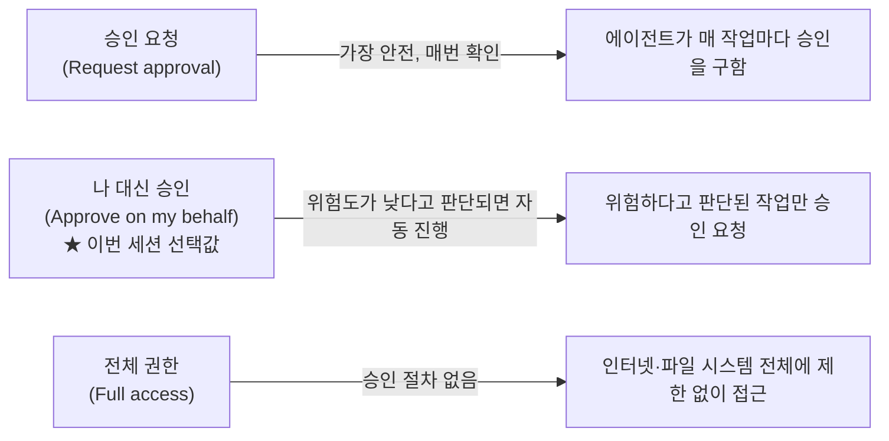
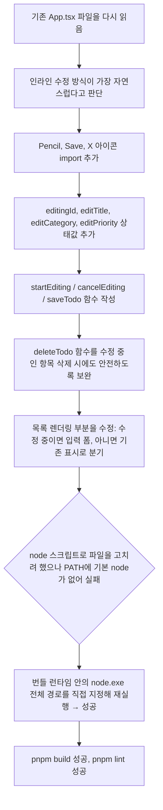

> 이 문서는 OpenAI의 에이전트형 코딩 도구인 **Codex 데스크톱 앱**을 이용해 진행된 하나의 실습 세션을 근거로, 그 세션에서 실제로 무슨 일이 있었는지를 순서대로 풀어서 설명하는 자료다. 대화 기록과 실행 결과 화면 구성을 함께 근거로 삼았으며, 실습자가 원래 세웠던 전체 계획과 실제로 진행된 범위를 분명히 구분해서 정리했다. 확인되지 않은 부분은 추측하지 않고 "확인되지 않음"으로 남겨두었다.

---

## 1. 이 자료가 다루는 것

실습자는 Codex 데스크톱 앱을 열어 두 차례에 걸쳐 프롬프트를 입력했고, Codex는 각각 11분 21초, 5분 33초 동안 작업을 수행했다. 작업 대상은 Windows PC였고, Codex는 그 PC 안에서 파일을 만들고, 명령을 실행하고, 문제가 생기면 스스로 원인을 추정해 다른 방법을 시도하는 과정을 반복했다. 그 결과로 "Todo Studio"라는 이름이 붙은 할 일 관리 대시보드 웹 앱이 만들어졌고, 개발 서버가 `localhost:5173`에서 실행되는 상태까지 도달했다.

세션 화면 구성을 보면 계정은 무료(Free) 요금제로 로그인되어 있었고, 월 단위로 초기화되는 사용량 중 9%가 남아 있는 상태였다. 채팅 목록에는 이번에 다룰 "Todo 앱 만들기" 대화 외에 "Obsidian 메모리 문제 분석"이라는 별개의 대화도 하나 더 있었는데, 이는 Codex 앱이 여러 작업 스레드를 프로젝트별로 나란히 유지할 수 있다는 것을 보여주는 부분이고, 그 대화의 구체적인 내용은 이 자료에는 포함되어 있지 않으므로 다루지 않는다.

### 1-1. 실습자가 원래 계획했던 전체 시나리오

실습자가 미리 적어둔 전체 프롬프트 목록은 아래 7단계였다. 이 중 **① ② 두 단계만 실제로 실행된 기록이 이 자료에 남아 있고, ③~⑦은 계획 단계에 머물러 있다.**

| 순서 | 프롬프트 내용 | 실행 여부 |
|---|---|---|
| ① | Vite + React + TypeScript Todo 앱, Tailwind CSS·Recharts·Lucide React 포함해서 만들어줘 | 실행됨 (11분 21초) |
| ② | 할 일 추가, 완료 체크, 수정, 삭제 기능 만들어줘 | 실행됨 (5분 33초) |
| ③ | 프로젝트 분류 기능 추가 — 색상 선택해서 프로젝트를 만들고 Todo에 연결 | 계획만 있음 |
| ④ | 우선순위(높음/보통/낮음)와 마감일 필드 추가 | 계획만 있음 (단, ①번 단계에서 이미 유사한 형태로 선반영된 부분이 있음 — 8장에서 별도로 설명) |
| ⑤ | 마감일이 지난 항목은 빨간색으로 표시 | 계획만 있음 |
| ⑥ | 상단에 필터 바 추가 — 상태(전체/진행중/완료), 우선순위, 프로젝트별 + 텍스트 검색 | 계획만 있음 (텍스트 검색창 자체는 ①번 단계에서 이미 만들어짐) |
| ⑦ | "UI가 정리된 것 같지 않음. 제대로 만들어줘" | 계획만 있음 |

이 표는 실습 전체의 뼈대를 이해하는 데 중요하다. 지금부터 설명할 내용은 ①, ②번 단계에서 실제로 벌어진 일이며, ③~⑦번은 "앞으로 할 계획"이지 "이미 실행된 결과"가 아니라는 점을 계속 염두에 두고 읽어야 한다.

---

## 2. 사용된 도구: OpenAI Codex 앱과 GPT-5.5 모델

이 실습에서 쓰인 도구를 정확히 짚고 넘어갈 필요가 있다. 화면에 표시된 모델 선택 메뉴에는 "GPT-5.5"와 "GPT-5.4-Mini" 두 가지가 있었고, 그중 GPT-5.5가 선택된 상태였다. 추론 수준(추론에 얼마나 공을 들일지 정하는 옵션)은 낮음/중간/높음/매우 높음 네 단계 중 "중간"이 선택되어 있었다.

### 2-1. Codex 앱의 출시 흐름

Codex는 원래 터미널에서 실행하는 CLI(명령줄) 도구와 IDE 확장 형태로 먼저 자리를 잡았고, 이후 별도의 데스크톱 앱 형태로 확장되었다. 공개된 발표 자료를 기준으로 정리하면 다음과 같다.

- macOS용 Codex 데스크톱 앱이 2026년 2월 2일 공개되었다.
- Windows용 지원은 2026년 3월 4일에 추가되었다. 이번 실습이 Windows 환경에서 진행된 것을 감안하면, 실습 시점(2026년 7월)은 Windows 지원이 시작된 지 넉 달 정도 지난 시점이다.
- 2026년 4월 16일에는 "Codex for (almost) everything"이라는 이름의 대규모 업데이트가 있었다. 이 업데이트로 Codex는 코드 작성을 넘어 화면을 보고 마우스를 움직이고 키보드를 입력하는 방식의 컴퓨터 사용(Computer Use), 이미지 생성, 선호도 기억, 반복 작업 자동화 등을 지원하게 되었다.
- Codex 앱은 ChatGPT Plus, Pro, Business, Edu, Enterprise 요금제에 포함되며, 한때 무료(Free)와 Go 요금제에도 한시적으로 열린 적이 있다. 이번 실습 계정이 무료 요금제로 표시된 것은 이런 배경과 맞닿아 있을 가능성이 있으나, 실습 시점 기준으로 무료 요금제에 정확히 어떤 조건으로 열려 있었는지는 이 자료만으로 확정할 수 없다.

### 2-2. GPT-5.5 모델

GPT-5.5는 2026년 4월 23일 ChatGPT와 Codex 두 곳에 동시에 공개된 모델이다. OpenAI는 이 모델을 발표하면서 에이전트형 코딩, 컴퓨터 사용, 지식 노동, 초기 단계의 과학 연구 등에서 특히 향상된 성능을 보인다고 설명했다. 눈에 띄는 특징 중 하나는 이전 모델(GPT-5.4)과 토큰당 응답 속도는 비슷하게 유지하면서도 지능 수준을 끌어올렸고, 같은 Codex 작업을 처리하는 데 필요한 토큰 수 자체도 크게 줄였다는 점이다. API 공개는 하루 늦은 4월 24일에 이루어졌다.

발표 당시 공개된 벤치마크 몇 가지를 옮기면 다음과 같다.

| 벤치마크 | GPT-5.5 | 비교 대상 |
|---|---|---|
| Terminal-Bench 2.0 | 82.7% | Claude Opus 4.7: 69.4% / Gemini 3.1 Pro: 68.5% |
| SWE-Bench Pro | 58.6% | Claude Opus 4.7: 64.3% (이 항목은 Opus가 여전히 앞섬) |
| OpenAI 내부 Expert-SWE (평균 완료 소요 20시간 규모 과제) | 73.1% | 이전 모델 GPT-5.4: 68.5% |
| GDPval (44개 직종 실무 과제) | 84.9% | Claude Opus 4.7: 80.3% / Gemini 3.1 Pro: 67.3% |
| OSWorld-Verified (데스크톱 컴퓨터 사용) | 78.7% | Claude Opus 4.7: 78.0% |

GPT-5.5 발표 이후, 2026년 5월 5일에는 무료 사용자 대상 기본 모델이 "GPT-5.5 Instant"로 교체되었고, 5월 7일에는 사이버보안 전문 인력을 위한 제한적 프리뷰 모델 "GPT-5.5-Cyber"가 공개되는 등 GPT-5.5를 기반으로 한 파생 모델들이 이어졌다. 이번 실습에서 쓰인 것은 이런 파생형이 아니라 Codex 안에서 "가장 복잡한 작업에 권장"되는 기본 GPT-5.5였다.

### 2-3. 승인 모드 설정

Codex는 에이전트가 파일을 고치거나 명령을 실행하기 전에 사람에게 얼마나 자주 확인을 구할지를 세 가지 방식 중 하나로 설정하게 되어 있다. 이번 세션의 설정 화면에는 다음 세 가지 선택지가 있었고, 그중 "나 대신 승인"이 선택되어 있었다.



- **승인 요청**: 외부 파일 수정이나 인터넷 사용이 필요할 때마다 항상 사람의 확인을 받는다. 가장 보수적인 설정이다.
- **나 대신 승인** (이번 세션에서 선택된 값): Codex가 스스로 위험도를 판단해서, 잠재적으로 위험하다고 감지된 작업에 대해서만 승인을 요청한다. 속도와 안전성 사이의 중간 지점에 해당한다.
- **전체 권한**: 인터넷과 컴퓨터의 모든 파일에 제한 없이 접근한다. 승인 절차 자체가 없다.

이 설정은 Codex CLI 쪽에서 흔히 쓰이는 `workspace-write`(작업 폴더 안에서만 읽기·쓰기 허용, 기본값에 가까움)나 `danger-full-access`(샌드박스 제한 해제) 같은 개념과 큰 틀에서 대응하는 앱 화면의 표현이다. 이번 세션은 "나 대신 승인" 상태였기 때문에, 아래에서 설명할 여러 차례의 명령 실행 실패와 재시도가 사람의 개입 없이도 상당 부분 자동으로 진행될 수 있었다.

---

## 3. 1단계 — 프로젝트 뼈대 만들기 (11분 21초)

첫 프롬프트는 "Vite + React + TypeScript Todo 앱 만들어줘. Tailwind CSS랑 Recharts, Lucide React도 포함해줘"였다. Codex가 이 작업을 처리하며 거쳐 간 과정은 순탄하지 않았고, 그 과정 자체가 이 자료에서 가장 자세히 들여다볼 만한 부분이다.

### 3-1. 진행 흐름 전체 그림

```mermaid
flowchart TD
    S1[현재 폴더 구조 확인 시도] --> S2{실행기가 로컬에서 바로 실패}
    S2 --> S3[승인 모드로 같은 읽기 작업 재시도]
    S3 --> S4[outputs, work 폴더만 있고 앱 소스는 없음을 확인]
    S4 --> S5[시스템 PATH에 node가 없음을 발견]
    S5 --> S6[Codex 데스크톱 번들 런타임 안의 Node 실행 파일을 대신 사용]
    S6 --> S7[package.json, vite.config.ts 등 파일 12개를 스캐폴딩]
    S7 --> S8{pnpm.cmd를 bash에서 직접 실행 시도 → 실패}
    S8 --> S9[cmd.exe를 통해 pnpm.cmd install 실행]
    S9 --> S10{경로에 백슬래시가 있어 명령이 깨짐}
    S10 --> S11[경로를 따옴표로 감싸서 재시도 → 설치 진행됨]
    S11 --> S12{pnpm이 esbuild의 설치 스크립트를 보안상 차단}
    S12 --> S13[package.json에 pnpm.onlyBuiltDependencies 필드 추가 시도]
    S13 --> S14{이 pnpm 버전은 package.json 필드를 더 이상 읽지 않음}
    S14 --> S15[pnpm-workspace.yaml 파일 새로 생성]
    S15 --> S16{워크스페이스 루트 선언이 빠져 적용 안 됨}
    S16 --> S17[현재 앱을 워크스페이스 패키지로 명시]
    S17 --> S18{여전히 차단됨 → pnpm config list로 현재 설정 확인}
    S18 --> S19[allowBuilds.esbuild 값을 명시적으로 true로 지정]
    S19 --> S20[설치 완료]
    S20 --> S21[pnpm build 성공 — 번들 용량 경고 1건]
    S21 --> S22[pnpm lint 통과]
    S22 --> S23[개발 서버를 localhost:5173에 백그라운드로 실행]
```



### 3-2. 각 단계에서 실제로 일어난 일

**폴더 확인과 초기 실패.** Codex는 작업을 시작하기 전에 먼저 현재 폴더에 이미 만들어진 것이 있는지부터 확인하려 했다. 첫 시도에서는 "샌드박스 실행기가 로컬에서 바로 실패"했는데, 이는 앞서 설명한 승인 모드나 샌드박스 경계와 관련이 있는 것으로 보이며, Codex는 같은 읽기 작업을 승인이 필요한 경로로 다시 실행해서 확인을 마쳤다. 확인 결과 해당 폴더에는 `outputs`와 `work` 폴더만 있었고 앱 소스 코드는 아직 없는 상태였다.

**Node 실행 파일 찾기.** Vite 프로젝트를 만들려면 Node.js가 필요한데, 시스템에 등록된 PATH 환경변수에는 node가 잡혀 있지 않았다. Codex는 이 문제를 마주치자 Codex 데스크톱 앱 자체에 번들로 포함되어 있던 런타임(`C:\Users\KTDS\.cache\codex-runtimes\codex-primary-runtime\dependencies` 아래)에서 node와 pnpm 실행 파일을 찾아내 그것을 대신 사용하는 방식으로 우회했다. 이는 Codex 개발 문서에서 설명하는 것처럼, Windows 환경에서 Codex가 PowerShell 기반의 네이티브 Windows 샌드박스와 WSL2 기반의 Linux 샌드박스 중 하나를 상황에 맞게 쓴다는 사실과 맞닿아 있는 대목이다. 실제로 이 세션에서는 `/mnt/c/Users/...`처럼 WSL 방식의 경로 표기와 `cmd.exe /c "..."`처럼 Windows 배치 파일을 직접 호출하는 방식이 뒤섞여 사용되었고, 이 두 체계가 만나는 지점에서 여러 차례 사소한 오류가 발생했다.

**파일 스캐폴딩.** 이후 Codex는 `package.json`, Vite 설정 파일, Tailwind 설정 파일, React 컴포넌트 등 총 12개 파일을 한 번에 생성했다. 이때 Codex는 단순한 할 일 목록에 그치지 않고 "대시보드처럼 할 일 목록과 통계 차트를 함께 볼 수 있는 형태"로 설계 방향을 스스로 정했다. 사용자가 프롬프트에서 요청한 것은 Todo 앱, Tailwind, Recharts, Lucide React였을 뿐이고 대시보드 형태나 통계 차트, 우선순위·마감일·카테고리 필드까지 요청한 것은 아니었지만, Codex는 Recharts가 포함된다는 점에서 통계 시각화를 자연스럽게 확장해 넣은 것으로 보인다.

**pnpm 배치 파일 문제.** pnpm은 Windows에서 `pnpm.cmd`라는 배치 파일 형태로 존재하는데, 이는 bash 셸에서 곧바로 실행할 수 있는 형식이 아니다. Codex는 이를 인지하고 `cmd.exe /c`를 통해 우회 호출하는 방식으로 전환했다. 처음에는 경로에 포함된 백슬래시가 명령 문자열에서 깨지는 문제가 있었는데, 전체 경로를 따옴표로 감싸는 방식으로 해결했다.

**esbuild 빌드 스크립트 차단과 그 해결 과정.** 설치 자체는 대부분 끝났지만, `pnpm build`를 시도하는 과정에서 막혔다. 원인은 pnpm의 보안 기능 때문이었다. pnpm은 v10 버전대부터 의존성 패키지들이 설치 과정에서 자동으로 실행하는 `preinstall`/`postinstall` 같은 빌드(설치) 스크립트를, 사전에 명시적으로 허용하지 않으면 기본적으로 차단하도록 바뀌었다. 이는 공급망 공격(패키지가 탈취되어 악성 스크립트를 심는 방식)을 막기 위한 조치로, esbuild처럼 네이티브 바이너리를 설치 과정에서 내려받는 패키지가 대표적으로 이 차단의 대상이 된다.

Codex는 이 문제를 풀기 위해 세 번의 시도를 거쳤다.

1. 먼저 `package.json`에 `pnpm.onlyBuiltDependencies` 필드를 추가해서 esbuild를 허용 목록에 넣으려 했다. 그러나 이 방식은 pnpm이 v11로 넘어오면서 사라진 옛 방식이었고, 이 세션에서 쓰이던 pnpm 버전은 더 이상 `package.json`의 이 필드를 읽지 않았다.
2. 다음으로 `pnpm-workspace.yaml`이라는 별도 파일을 새로 만들어 같은 설정(`onlyBuiltDependencies: [esbuild]`)을 옮겼다. 이 파일 자체는 읽혔지만, 현재 폴더가 워크스페이스의 루트로 명시적으로 선언되어 있지 않아 설정이 실제로 적용되지 않았다.
3. 마지막으로 `pnpm config list`로 현재 인식되고 있는 설정을 직접 확인한 뒤, pnpm v11에서 새로 도입된 `allowBuilds`라는 항목(패키지 이름과 참/거짓 값을 짝지어 허용 여부를 정하는 맵 구조)에 `esbuild: true`를 명시적으로 지정했다. 이 시도에서 비로소 설치가 완전히 끝났다.

이 세 번의 시행착오는 우연이 아니라, pnpm이 실제로 v10에서 v11로 넘어오면서 빌드 스크립트 허용 방식을 `onlyBuiltDependencies`(package.json 또는 워크스페이스 설정 파일에 기록) 방식에서 `allowBuilds`(패키지별 참/거짓 맵) 방식으로 통째로 바꾼 이력과 정확히 들어맞는다. Codex가 겪은 혼선은 이 도구가 낡은 지식으로 문제를 풀려다 실제 pnpm 버전의 최신 스키마와 충돌한 뒤, 스스로 설정을 조회해서 맞는 스키마를 찾아낸 과정이라고 이해하면 된다.

**빌드와 검증.** 설치가 끝난 뒤 `pnpm build`는 정상적으로 통과했다. 다만 Recharts를 포함한 번들 크기가 500KB를 넘어선다는 경고가 하나 있었는데, 이는 오류가 아니라 참고용 경고였다. 이어서 `pnpm lint`도 별다른 문제 없이 통과했고, 마지막으로 `pnpm dev --host 0.0.0.0` 명령을 백그라운드 터미널에서 실행해 개발 서버를 `localhost:5173`에 띄우는 것으로 1단계 작업이 마무리되었다.

---

## 4. 2단계 — 수정(edit) 기능 추가하기 (5분 33초)

두 번째 프롬프트는 "할 일 추가, 완료 체크, 수정, 삭제 기능 만들어줘"였다. 1단계에서 이미 추가·완료 체크·삭제는 기본으로 구현되어 있었기 때문에, Codex는 이 요청을 사실상 "수정(edit) 기능을 새로 추가하고, 기존 기능들을 더 명확하게 다듬어 달라"는 의미로 해석했다.



구체적으로 살펴보면, Codex는 각 할 일 항목에 연필 모양 아이콘을 추가해서 이를 누르면 해당 항목이 입력 가능한 형태로 바뀌도록 만들었다. 수정 중인 상태에서는 제목을 입력하는 텍스트 상자, 카테고리를 고르는 드롭다운(개발/디자인/분석/제품/개인), 우선순위를 고르는 드롭다운(낮음/보통/높음)이 한 줄에 배치되고, 오른쪽에는 저장(디스크 모양 아이콘) 버튼과 취소(X 아이콘) 버튼이 놓인다. 저장을 누르면 입력값이 실제 목록에 반영되고 수정 모드가 종료되며, 취소를 누르면 원래 값 그대로 되돌아간다. 또한 수정 중인 항목을 삭제 버튼으로 지울 경우에도 수정 상태가 꼬이지 않도록 `deleteTodo` 함수 안에 예외 처리를 넣어두었다.

이 단계에서도 1단계와 비슷한 기술적 걸림돌이 반복되었다. Codex는 코드를 고치기 위해 작성한 스크립트를 기본 `node` 명령으로 실행하려 했지만, 여전히 시스템 PATH에는 node가 등록되어 있지 않아 실패했다. 이번에는 곧바로 번들 런타임 안에 있는 `node.exe`의 전체 경로를 지정해 실행하는 방식으로 우회했고, 이후 빌드와 린트가 모두 정상적으로 통과하는 것을 확인한 뒤 작업을 마쳤다.

---

## 5. 완성된 화면 구성 상세 설명

여기서는 개발 서버가 띄워진 뒤 실제로 확인할 수 있었던 앱의 구성을 차례대로 설명한다.

### 5-1. 상단 요약 영역

앱 제목은 "Todo Studio"이고, 그 아래에는 "오늘 할 일을 한 화면에서 관리하세요"라는 안내 문구가 큼직하게 자리잡고 있다. 바로 아래에는 세 개의 요약 카드가 가로로 배치되어 있다.

- **완료**: 1건
- **진행 중**: 3건
- **달성률**: 25%

이 수치는 뒤에서 설명할 네 개의 예시 할 일 데이터를 기준으로 계산된 값이다.

### 5-2. 새 할 일 입력 영역

요약 카드 아래에는 새 할 일을 등록하는 한 줄짜리 입력 영역이 있다. 왼쪽부터 제목을 적는 텍스트 상자, 카테고리를 고르는 드롭다운(기본값 "개발"), 우선순위를 고르는 드롭다운(기본값 "보통"), 그리고 초록색의 "추가" 버튼이 순서대로 배치되어 있다.

### 5-3. 할 일 목록

목록 영역 오른쪽 위에는 돋보기 아이콘이 붙은 검색창이 있어 텍스트로 항목을 걸러볼 수 있다. 목록에 담긴 네 개의 항목은 다음과 같다.

| 제목 | 완료 여부 | 마감일 | 카테고리 | 우선순위 |
|---|---|---|---|---|
| Vite 프로젝트 구조 정리 | 완료 (체크 표시) | 오늘 | 개발 | 높음 |
| Tailwind 컴포넌트 스타일 점검 | 진행 중 | (수정 모드로 표시된 상태였음) | 디자인 | 보통 |
| Recharts로 진행률 시각화 | 진행 중 | 이번 주 | 분석 | 높음 |
| 할 일 필터 UX 다듬기 | 진행 중 | 금요일 | 제품 | 낮음 |

흥미로운 지점은 이 네 개의 항목이 실습자가 실제로 입력한 할 일이 아니라 Codex가 앱을 만들면서 예시 데이터로 직접 채워 넣은 것이라는 점이다. 항목 이름 자체가 "Vite 프로젝트 구조 정리", "Recharts로 진행률 시각화"처럼 지금 이 앱을 만드는 과정 그 자체를 가리키고 있어서, 결과적으로 이 Todo 앱은 "자기 자신을 만드는 일"을 예시 할 일 목록으로 보여주는 형태가 되었다.

완료된 항목은 제목에 취소선이 그어지고 글자색이 옅어지며, 왼쪽의 원형 버튼이 청록색으로 채워진 채 체크 표시가 들어간다. 미완료 항목은 테두리만 있는 빈 원으로 표시된다. 각 항목 오른쪽에는 연필(수정) 아이콘과 휴지통(삭제) 아이콘이 나란히 놓여 있다.

### 5-4. 하단 통계 영역

목록 아래에는 두 가지 시각화 자료가 배치되어 있다.

**주간 흐름.** "추가와 완료 추이"라는 설명이 붙은 꺾은선 형태의 면적 그래프로, 월요일부터 금요일까지 5일 구간에 걸쳐 0에서 4 사이의 값을 갖는 두 개의 곡선(주황색 계열과 청록색 계열)이 서로 교차하며 흐르는 형태로 그려져 있다. 다만 이 그래프에는 별도의 범례가 붙어 있지 않아서, 어느 색이 "추가"를 나타내고 어느 색이 "완료"를 나타내는지는 화면 구성만으로는 확정할 수 없다.

**우선순위 분포.** "작업 부담을 빠르게 확인"이라는 설명이 붙은 도넛(원형) 그래프로, 낮음·보통·높음 세 구간으로 나뉘어 있다. 그래프 아래에는 색상별 범례와 함께 정확한 개수가 표시되어 있다.

- 낮음: 1건
- 보통: 1건
- 높음: 2건

이 수치는 앞서 표로 정리한 네 개 예시 항목의 우선순위 분포와 정확히 일치한다.

---

## 6. 코드 구조로 확인한 실제 구현 내용

작업이 끝난 뒤 실제 소스 코드를 열람할 수 있었는데, 여기서 확인한 파일 구조와 타입 정의는 다음과 같다.

### 6-1. 프로젝트 폴더 구조

```
vite-react-typescript-todo-tailwind-css/
├── dist/                    (빌드 결과물)
├── node_modules/
├── outputs/
├── src/
│   ├── App.tsx              (핵심 로직과 화면 구성이 담긴 파일)
│   ├── main.tsx
│   └── styles.css
├── work/
├── eslint.config.js
├── index.html
├── package.json
├── pnpm-lock.yaml
├── pnpm-workspace.yaml       (esbuild 빌드 스크립트 허용 설정을 위해 새로 생성된 파일)
├── postcss.config.js
├── tailwind.config.js
├── tsconfig.app.json
├── tsconfig.json
├── tsconfig.node.json
└── vite.config.ts
```

### 6-2. 데이터 타입

`App.tsx`에는 다음과 같은 타입 정의가 있었다.

```typescript
type Priority = '낮음' | '보통' | '높음';

type Todo = {
  id: number;
  title: string;
  category: string;
  due: string;
  priority: Priority;
  completed: boolean;
};
```

주목할 점은 `priority`와 `due`(마감일) 필드가 **1단계(초기 스캐폴딩)에서 이미 만들어졌다**는 것이다. 앞서 2장의 계획 표에서 ④번 항목("우선순위와 마감일 필드 추가")은 아직 실행되지 않은 계획으로 분류했는데, 실제로는 그 계획을 실행하기도 전에 1단계에서 Codex가 대시보드 형태로 앱을 설계하면서 이 필드들을 선제적으로 넣어둔 상태다. 다만 `category`는 문자열(`string`) 타입으로만 되어 있어서, ③번 계획이 요구하는 "색상을 지정할 수 있는 별도의 프로젝트 개체"와는 다르다. 지금 구현은 프로젝트를 색상이 있는 독립된 개체로 다루는 것이 아니라, 단순한 분류용 텍스트 값(개발/디자인/분석/제품/개인)을 드롭다운으로 고르는 수준에 머물러 있다.

### 6-3. 사용된 라이브러리 구성 요소

`App.tsx`의 import 구문을 기준으로 실제로 사용된 구성 요소는 다음과 같다.

- **Recharts**: `Area`, `AreaChart`, `CartesianGrid`, `Cell`, `Pie`, `PieChart`, `ResponsiveContainer`, `Tooltip`, `XAxis`, `YAxis` — 이 조합으로 5장에서 설명한 면적 그래프(주간 흐름)와 도넛 그래프(우선순위 분포)를 각각 구현했다.
- **Lucide React**: `BarChart3`, `CalendarDays`, `Check`, `Circle`, `ClipboardList`, `Flag`, `Pencil`, `Plus`, `Save`, `Search`, `Trash2`, `X` — 완료 체크, 마감일, 카테고리 표시, 수정·저장·취소·삭제 버튼 등 화면 곳곳의 아이콘에 쓰였다.

---

## 7. 계획 대비 실제 구현 현황 정리

2장에서 소개한 7단계 계획과 실제로 확인 가능한 구현 상태를 다시 한 번 짝지어 정리하면 다음과 같다.

| 계획 | 실제 상태 | 근거 |
|---|---|---|
| ① Vite+React+TS, Tailwind·Recharts·Lucide | 완료 | 1단계 실행 기록과 빌드·린트 통과 확인 |
| ② 추가·완료체크·수정·삭제 | 완료 | 2단계 실행 기록, 화면에서 연필/저장/취소/휴지통 아이콘 확인 |
| ③ 색상 기반 프로젝트 분류 | 미실행 | `category`가 단순 문자열이며 색상 지정 기능이나 별도 프로젝트 개체가 코드에 없음 |
| ④ 우선순위·마감일 필드 | 부분적으로 선반영됨 | `Priority` 타입과 `due` 필드가 1단계에서 이미 존재하지만, 이는 ④번 프롬프트가 실행되어 생긴 것이 아니라 Codex가 대시보드를 설계하며 자체적으로 포함시킨 것 |
| ⑤ 마감일 지난 항목 빨간색 표시 | 확인되지 않음 | 화면에 표시된 예시 항목들의 마감일(오늘/이번 주/금요일)이 실습 시점 기준으로 지났는지 알 수 없고, 빨간색 강조 스타일이 코드나 화면에서 확인되지 않음 |
| ⑥ 상단 필터 바(상태/우선순위/프로젝트/검색) | 텍스트 검색만 부분 구현 | 목록 영역에 돋보기 아이콘의 검색창은 있으나, 상태·우선순위·프로젝트별로 거르는 별도의 필터 바는 화면에서 확인되지 않음 |
| ⑦ UI 재정리 요청 | 실행 전 | 아직 프롬프트로 입력되지 않음 |

---

## 8. 실습 과정이 보여주는 기술적 시사점

이번 세션은 단순히 "Todo 앱이 만들어졌다"는 결과보다, 그 과정에서 에이전트가 마주친 환경적 장벽과 그것을 풀어가는 방식이 더 눈여겨볼 만하다.

**Windows·WSL 혼재 환경에서의 경로 문제.** Codex는 Windows 위에서 동작하면서도 `/mnt/c/Users/...` 같은 WSL(리눅스 서브시스템) 방식의 경로와 `C:\Users\...` 같은 네이티브 Windows 경로를 함께 다뤄야 했다. Codex의 공식 문서에 따르면 Windows 환경에서는 PowerShell로 실행할 때는 네이티브 Windows 샌드박스를, WSL2로 실행할 때는 리눅스 샌드박스를 쓰도록 되어 있는데, 이번 세션에서 관찰된 경로 표기 혼용과 `pnpm.cmd`(배치 파일)를 bash에서 직접 실행하지 못해 `cmd.exe`를 경유해야 했던 상황은 이 두 체계가 만나는 지점에서 생기는 전형적인 마찰로 볼 수 있다.

**pnpm의 공급망 보안 정책.** pnpm은 v10대부터 의존성 패키지의 설치 스크립트(`postinstall` 등)를 기본적으로 차단하고, 이를 실행하려면 사람이 명시적으로 허용 목록에 올리도록 요구한다. 이는 특정 패키지가 탈취되어 악성 스크립트를 심는 공급망 공격을 막기 위한 장치다. 이번 세션에서 Codex가 겪은 세 차례의 우회 시도(`package.json`의 옛 필드 → `pnpm-workspace.yaml`의 `onlyBuiltDependencies` → 최신 `allowBuilds` 맵)는 pnpm이 v10에서 v11로 넘어오며 이 설정 방식 자체를 통째로 바꾼 이력과 정확히 맞아떨어진다. 즉 Codex는 오래된 지식으로 문제를 풀려다 실패하고, 실제 설정 상태를 다시 조회해서 최신 방식에 맞는 해법을 찾아낸 것이다.

**승인 모드가 만든 작업 흐름.** "나 대신 승인" 모드였기 때문에, 위에서 설명한 여러 차례의 명령 실패와 재시도가 매번 사람의 확인을 거치지 않고도 상당 부분 자동으로 이어질 수 있었다. 만약 "승인 요청" 모드였다면 같은 과정에서 훨씬 더 많은 확인 요청이 실습자에게 전달되었을 것이다.

---

## 9. 용어 정리

| 용어 | 설명 |
|---|---|
| Codex | OpenAI가 만든 에이전트형 코딩 도구. 터미널용 CLI, IDE 확장, 데스크톱 앱, 클라우드(Codex Web) 형태로 제공된다. |
| GPT-5.5 | 2026년 4월 23일 공개된 OpenAI의 프런티어 모델. Codex와 ChatGPT에서 함께 쓰인다. |
| 승인 모드 | Codex가 파일 수정이나 명령 실행 전에 사람의 확인을 구하는 빈도를 정하는 설정. 승인 요청/나 대신 승인/전체 권한 세 단계가 있다. |
| 샌드박스 | 에이전트가 시스템에 접근할 수 있는 범위를 제한하는 격리 환경. Windows에서는 네이티브 샌드박스와 WSL2 기반 샌드박스가 상황에 따라 쓰인다. |
| pnpm | Node.js 패키지 매니저 중 하나. 디스크 공간을 아끼는 저장 방식과, 의존성의 설치 스크립트를 기본 차단하는 보안 정책으로 알려져 있다. |
| onlyBuiltDependencies / allowBuilds | pnpm에서 특정 패키지의 설치 스크립트 실행을 허용하는 설정 항목. v10대까지는 `onlyBuiltDependencies`, v11부터는 `allowBuilds`라는 참/거짓 맵 구조로 통합되었다. |
| esbuild | 자바스크립트·타입스크립트를 빠르게 번들링하는 도구. Vite 내부에서 쓰이며, 설치 과정에서 네이티브 바이너리를 받기 위한 스크립트를 실행한다. |
| Recharts | React용 차트 라이브러리. 이번 실습에서는 면적 그래프와 도넛 그래프를 그리는 데 쓰였다. |
| Lucide React | React용 아이콘 라이브러리. 이번 실습에서는 체크, 연필, 저장, 삭제 등 다양한 아이콘에 쓰였다. |
| 워크스페이스(pnpm-workspace.yaml) | 하나의 저장소 안에 여러 패키지를 함께 관리하거나, pnpm의 전역 설정을 담아두는 파일. |

---

## 10. 참고자료

- OpenAI, "App – Codex" (Codex 앱 소개 문서) — https://developers.openai.com/codex/app
- OpenAI, "Introducing the Codex app" (2026년 2월, macOS 출시 및 3월 Windows 지원 업데이트 포함) — https://openai.com/index/introducing-the-codex-app/
- OpenAI, "Codex for (almost) everything" (2026년 4월 16일 업데이트) — https://openai.com/index/codex-for-almost-everything/
- OpenAI, "Introducing GPT-5.5" — https://openai.com/index/introducing-gpt-5-5/
- OpenAI Developers, "Changelog – Codex" — https://developers.openai.com/codex/changelog
- OpenAI Developers, "Agent approvals & security" — https://developers.openai.com/codex/agent-approvals-security
- OpenAI Developers, "Sandbox – Codex" — https://developers.openai.com/codex/concepts/sandboxing
- OpenAI Developers, "Computer Use – Codex app" — https://developers.openai.com/codex/app/computer-use
- pnpm 공식 문서, "Settings (pnpm-workspace.yaml)" — https://pnpm.io/settings
- pnpm 공식 문서, "pnpm approve-builds" — https://pnpm.io/cli/approve-builds
- pnpm 공식 블로그, "pnpm 11.0" (onlyBuiltDependencies에서 allowBuilds로의 전환 공지) — https://pnpm.io/blog/releases/11.0
- Wikipedia, "GPT-5.5" — https://en.wikipedia.org/wiki/GPT-5.5
- れん学長, "「承認」と「フルアクセス」って何？Codexアプリの初心者向けガイド" (Codex 앱의 승인 모드 설명) — https://note.com/renkon40/n/n55ceec3b62a4?hl=en

---

*이 문서는 실제 세션 기록과 화면 구성, 그리고 위 참고자료를 근거로 작성되었으며, 근거를 확인할 수 없는 부분은 "확인되지 않음"으로 명시했다.*
