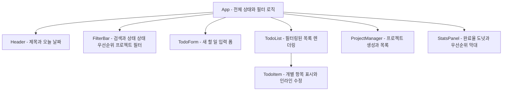
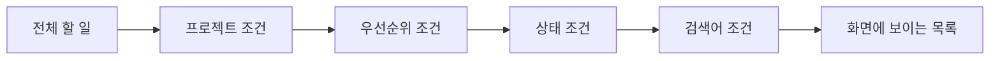

## 목차

1. [들어가며 — 이 문서는 무엇을 기록하는가](#1-들어가며--이-문서는-무엇을-기록하는가)
2. [바이브 코딩이란 무엇이며, 왜 지금 짚어야 하는가](#2-바이브-코딩이란-무엇이며-왜-지금-짚어야-하는가)
3. [1턴 — 요구사항과 스캐폴딩](#3-1턴--요구사항과-스캐폴딩)
4. [스타일링 기반 — Tailwind CSS v4와 CSS 우선 설계](#4-스타일링-기반--tailwind-css-v4와-css-우선-설계)
5. [디자인 방향 — "장부(Ledger)" 컨셉과 색상 팔레트](#5-디자인-방향--장부ledger-컨셉과-색상-팔레트)
6. [컴포넌트 구조와 상태 관리](#6-컴포넌트-구조와-상태-관리)
7. [2턴 — 이미 있던 기능을 확인해달라는 요청](#7-2턴--이미-있던-기능을-확인해달라는-요청)
8. [3턴 — 프로젝트 분류 기능 추가](#8-3턴--프로젝트-분류-기능-추가)
9. [4턴 — 마감일 필드와 지연 표시](#9-4턴--마감일-필드와-지연-표시)
10. [5턴 — 통합 필터 바](#10-5턴--통합-필터-바)
11. [6턴 — UI 정리 피드백과 재설계](#11-6턴--ui-정리-피드백과-재설계)
12. [7턴 — 아티팩트 미리보기로 화면 확인하기](#12-7턴--아티팩트-미리보기로-화면-확인하기)
13. [세션 전체에서 드러난 패턴](#13-세션-전체에서-드러난-패턴)
14. [마치며 — 다음 클래스를 위한 메모](#14-마치며--다음-클래스를-위한-메모)
15. [참고 자료 및 출처](#15-참고-자료-및-출처)

---

## 1. 들어가며 — 이 문서는 무엇을 기록하는가

이 문서는 하나의 대화 세션 안에서 실제로 진행된 바이브 코딩 과정을 처음부터 끝까지 그대로 서술한 기록이다. "Vite와 React, TypeScript로 할 일 관리 앱을 만들어 달라"는 한 줄짜리 요청에서 시작해, 프로젝트 분류 기능과 마감일 필드, 통합 필터 바가 차례로 붙었고, 중간에 UI가 정리되지 않았다는 피드백을 받아 레이아웃을 다시 짰으며, 마지막에는 실제 코드와 별개로 채팅창 안에서 바로 눌러볼 수 있는 미리보기까지 만들었다. 각 단계에서 어떤 요청이 있었고, 어떤 판단으로 어떤 코드를 썼으며, 왜 그런 선택을 했는지를 순서대로 풀어썼다.

이 기록의 목적은 두 가지다. 하나는 바이브 코딩 수업에서 쓸 수 있는 실제 사례 하나를 남기는 것이고, 다른 하나는 "AI에게 시켜서 앱을 만들었다"는 한 문장 뒤에 실제로는 얼마나 많은 작은 판단과 검증이 쌓여 있는지를 보여주는 것이다. 결과물만 보면 매끈해 보이지만, 그 매끈함은 스캐폴딩 직후의 타입 검사, 기능을 추가할 때마다 다시 돌린 빌드, 그리고 UI 피드백을 받고 나서야 드러난 설계상의 착오를 고치는 과정을 거쳐 만들어졌다. 이 문서에서는 그 과정을 생략하지 않고 그대로 옮긴다.

내용을 뒷받침하는 기술적 사실—Tailwind CSS의 버전 변화, Vite의 최근 메이저 업데이트, 사용한 라이브러리들의 현재 상태—은 모두 별도로 검색해 확인한 내용이며, 근거는 마지막 장에 출처와 함께 정리해두었다.

---

## 2. 바이브 코딩이란 무엇이며, 왜 지금 짚어야 하는가

"바이브 코딩(vibe coding)"이라는 말은 2025년 2월 2일, OpenAI 공동창업자이자 전 테슬라 AI 총괄이었던 안드레이 카패시(Andrej Karpathy)가 자신의 X(옛 트위터) 계정에 올린 글에서 시작됐다. 그는 이 새로운 코딩 방식을 "바이브에 완전히 몸을 맡기고, 지수적으로 발전하는 흐름을 그대로 받아들이며, 코드가 존재한다는 사실 자체를 잊어버리는 것"이라고 표현했다. 그가 묘사한 실제 작업 방식은 이랬다. 음성 인식 도구로 말하듯 요청하고, AI가 만든 변경 사항을 거의 다 검토 없이 받아들이고("Accept All"), 에러 메시지가 뜨면 별다른 설명 없이 그대로 복사해서 다시 붙여넣는 식이었다. 카패시 스스로도 이 방식을 "진짜 코딩이라고 보기는 어렵다"고 인정하면서, 자신이 겪어본 결과를 이렇게 요약했다. "그냥 뭔가를 보고, 뭔가를 말하고, 뭔가를 실행하고, 뭔가를 복사해서 붙여넣는데, 대체로 잘 돌아간다."

이 표현은 예상보다 훨씬 빠르게 퍼졌다. 한 달 만에 뉴욕타임스, 아스테크니카, 가디언 같은 매체가 이 현상을 다뤘고, 2025년 3월에는 메리엄웹스터 사전이 "속어 및 트렌드 표현"으로 이 단어를 등재했다. 그리고 2025년 말에는 콜린스 영어사전이 이 단어를 그해의 단어로 선정했다. 다만 카패시 본인이 처음 강조했던 전제—"주말에 만들고 버릴 프로젝트"에 한해 어울리는 방식이라는 단서—는 이 단어가 퍼지는 과정에서 종종 생략됐다. 업계 전반에서는 이 단어가 점점 더 넓은 의미로, 심지어 실제 서비스에 들어가는 코드를 AI에게 맡기는 상황까지 포괄하는 말로 쓰이기 시작했고, 그만큼 품질과 책임 소재에 대한 우려도 함께 커졌다. 개발자 시몬 윌리슨은 이런 우려를 두고 "프로덕션 코드베이스를 향해 바이브 코딩하는 것은 명백히 위험하다"고 지적한 바 있는데, 소프트웨어 엔지니어링의 실제 업무 대부분이 새로 짜는 것이 아니라 기존 시스템을 조금씩 고쳐나가는 일이고, 그 일에는 코드의 품질과 이해 가능성이 핵심이기 때문이라는 이유였다.

이 문서가 기록하는 세션은 카패시가 처음 그렸던 "diff를 보지 않고 다 받아들이는" 극단적인 형태와는 결이 다르다. 매 단계마다 타입 검사와 빌드를 돌려 검증했고, 기능이 이미 있는지 없는지를 코드로 직접 확인한 뒤 설명했으며, UI가 정리되지 않았다는 피드백을 받았을 때는 왜 그렇게 보였는지 원인을 짚고 나서야 다시 설계했다. 그런 의미에서 이 기록은 "vibe"에 전부를 맡기기보다, 자연어 요청과 코드 검증을 오가는 조금 더 절제된 형태의 AI 협업 코딩에 가깝다. 그럼에도 이 단어를 그대로 쓰는 이유는, 실제로 이 세션 전체에서 사람이 직접 타이핑한 코드는 단 한 줄도 없었고, 모든 구현이 자연어 요청과 그에 대한 응답으로만 이루어졌기 때문이다.

---

## 3. 1턴 — 요구사항과 스캐폴딩

세션의 시작은 짧았다. **"Vite + React + TypeScript Todo 앱 만들어줘. Tailwind CSS랑 Recharts, Lucide React도 포함해줘."** 네 가지 기술 스택이 지정된 것 말고는 앱의 구체적인 모습—어떤 기능이 있어야 하는지, 어떤 느낌이어야 하는지—에 대한 지시는 전혀 없었다. 이런 경우에는 사용자에게 세부 사항을 되묻기보다, 가장 합리적인 기본값을 정하고 그 기준을 명시한 뒤 완결된 결과물을 내놓는 쪽이 낫다고 판단했다. 그래서 곧바로 실제 프로젝트 스캐폴딩에 들어갔다.

터미널 환경에서 `npm create vite@latest`로 `react-ts` 템플릿을 내려받았고, 이어서 `recharts`와 `lucide-react`, 그리고 `tailwindcss`와 `@tailwindcss/vite`를 설치했다. 이 시점에서 설치된 버전을 그대로 확인해보면, Tailwind CSS는 4.3.2, React는 19.2.7이 설치됐다. 특별히 특정 버전을 지정하지 않고 최신 안정 버전을 그대로 받았기 때문에, 이 세션이 진행된 시점의 각 라이브러리 최신 상태가 고스란히 반영된 셈이다. 흥미로운 점은 이 라이브러리들 각각이 최근 반년 사이에 굵직한 변화를 겪었다는 것이다.

Vite는 2026년 3월 12일에 메이저 버전 8을 정식 출시했다. 이번 업데이트는 Vite 2 이후 가장 큰 구조 변화로 꼽히는데, 그동안 개발 서버에서는 esbuild를, 프로덕션 빌드에서는 Rollup을 따로 썼던 이중 번들러 구조를 걷어내고 Rolldown이라는 러스트 기반 단일 번들러로 통합했다. 이 통합 덕분에 빌드 속도가 최대 10배에서 30배까지 빨라졌다는 보고가 나왔고, 실제로 협업 툴 Linear는 프로덕션 빌드 시간이 46초에서 6초로 줄었다고 밝혔다. 이 세션에서 스캐폴딩한 프로젝트도 정확히 이 버전대인 8.1.x를 사용했으며, 실제로 빌드를 돌릴 때마다 1초 안팎으로 끝나는 걸 여러 차례 확인할 수 있었다.

React 역시 19.2 버전이었는데, 이 마이너 버전은 2025년 10월에 나온 뒤로 몇 차례 패치를 거쳐 이 세션 시점에는 19.2.7까지 올라와 있었다. 19.2에서 새로 들어온 기능 중에는 화면에 보이지 않는 부분을 미리 렌더링해두고 나중에 다시 그 상태로 되돌릴 수 있게 하는 `Activity` 컴포넌트, 그리고 effect 안에서 최신 값을 참조하면서도 불필요한 재실행을 막아주는 `useEffectEvent` 훅이 있다. 이번 할 일 관리 앱은 규모가 크지 않아 이런 기능까지 직접 쓰지는 않았지만, 프로젝트가 이 시점의 React 최신 버전 위에 서 있다는 점은 짚어둘 만하다.

아이콘 라이브러리인 Lucide 쪽에서는 더 눈에 띄는 변화가 있었다. `lucide-react`가 이 세션 며칠 전 즈음 첫 정식 메이저 버전인 1.0을 냈는데, 그동안 유지해온 상표권이 있는 브랜드 아이콘들을 전부 제거하고, 오래된 UMD 빌드 방식을 걷어내면서 패키지 용량을 11.4메가바이트에서 1메가바이트 수준으로, 그러니까 약 32퍼센트를 줄였다. 이 프로젝트에서는 Plus, Check, Pencil, Trash2 같은 기본적인 아이콘만 썼기 때문에 이번 메이저 업데이트의 영향을 직접 받지는 않았지만, 매주 수천만 번 내려받히는 라이브러리가 이런 큰 폭의 정리를 했다는 사실 자체가 최근 프론트엔드 생태계가 얼마나 빠르게 움직이는지를 보여준다.

차트 라이브러리인 Recharts도 비슷하다. 2025년 중반에 내부 상태 관리 구조를 통째로 다시 짠 3.0 버전이 나왔고, 이 세션 시점에는 3.9대까지 올라와 있었다. 이번 프로젝트에서는 완료율을 보여주는 도넛 차트와 우선순위별 잔여 항목을 보여주는 막대 차트, 이렇게 두 종류의 시각화에 Recharts를 썼다.

스캐폴딩이 끝난 뒤에는 곧바로 `npx tsc -b --noEmit`으로 타입 검사를, `npm run build`로 실제 프로덕션 빌드를 돌려 문제가 없는지 확인했다. 이 검증 절차는 이후 모든 기능을 추가할 때마다 예외 없이 반복됐는데, 이 부분은 13장에서 따로 짚는다.

---

## 4. 스타일링 기반 — Tailwind CSS v4와 CSS 우선 설계

이번 프로젝트에서 사용한 Tailwind CSS v4는 이전 버전과 설정 방식이 근본적으로 다르다. v3까지는 `tailwind.config.js`라는 자바스크립트 파일에 색상, 폰트, 간격 같은 디자인 토큰을 전부 정의해야 했지만, v4부터는 이 설정 파일 자체가 필요 없어졌다. 대신 CSS 파일 안에 `@theme` 블록을 두고, 그 안에서 디자인 토큰을 CSS 변수 형태로 바로 선언하면 Tailwind가 이를 읽어서 `bg-pine-600`이나 `text-ink` 같은 유틸리티 클래스를 자동으로 만들어준다. Tailwind 팀은 이를 두고 "CSS 우선 설정(CSS-first configuration)"이라 부르는데, 별도 설정 파일과 실제 스타일을 쓰는 CSS 파일을 오가며 작업할 필요가 없어졌다는 점이 실질적인 이점으로 꼽힌다.

Vite와의 통합 방식도 달라졌다. 예전에는 PostCSS 플러그인 형태로 Tailwind를 끼워 넣었지만, v4부터는 `@tailwindcss/vite`라는 전용 플러그인이 나와서 `vite.config.ts`에 한 줄만 추가하면 된다. 이번 프로젝트의 설정은 정확히 이 형태를 따랐다.

```ts
import { defineConfig } from "vite";
import react from "@vitejs/plugin-react";
import tailwindcss from "@tailwindcss/vite";

export default defineConfig({
  plugins: [react(), tailwindcss()],
});
```

그리고 `src/index.css` 맨 위에는 예전의 `@tailwind base; @tailwind components; @tailwind utilities;` 세 줄 대신 단 한 줄, `@import "tailwindcss";`만 남는다. `postcss.config.js`나 `autoprefixer` 같은 부수적인 설정 파일도 필요 없다. Tailwind 공식 발표에 따르면 v4는 내부적으로 Lightning CSS라는 러스트 기반 엔진을 쓰면서 전체 빌드가 최대 5배, 증분 빌드는 100배 넘게 빨라졌다고 하는데, 실제로 이 프로젝트에서 파일을 하나 고치고 다시 빌드를 돌릴 때마다 체감되는 속도가 상당히 빨랐다.

이 프로젝트의 `@theme` 블록에는 다음 장에서 설명할 색상 팔레트와 함께, 제목용 세리프 폰트와 본문용 산세리프 폰트, 숫자 표시용 모노스페이스 폰트를 각각 `--font-display`, `--font-sans`, `--font-mono` 변수로 정의해두었다. 이렇게 정의해두면 컴포넌트 코드에서는 `font-display`, `font-mono` 같은 클래스만 붙이면 되고, 실제 폰트를 바꾸고 싶을 때는 이 CSS 파일 한 곳만 고치면 프로젝트 전체에 반영된다.

---

## 5. 디자인 방향 — "장부(Ledger)" 컨셉과 색상 팔레트

기술 스택 다음으로 정한 것은 이 앱이 어떤 느낌을 가져야 하는가였다. 요청에는 디자인 방향에 대한 언급이 전혀 없었기 때문에, 여기서도 임의로 방향을 정하고 그 근거를 밝히는 방식을 택했다. AI가 만드는 화면에서 자주 반복되는 몇 가지 뻔한 패턴—예를 들면 남색과 보라색이 섞인 그라데이션 배경, 혹은 크림색 바탕에 테라코타색 포인트를 주는 조합—을 피하고 싶었다. 그래서 이번 앱에는 "장부(帳簿, ledger)"라는 은유를 붙였다. 종이 장부에 할 일을 적어 내려가는 느낌을 주기 위해, 항목마다 번호를 매기고 얇은 구분선으로 줄을 나누는 방식을 썼다.

색상은 네 갈래로 나눴다. 우선 브랜드 색으로 짙은 소나무색 계열(pine)을 골라 추가 버튼이나 완료 체크 표시처럼 핵심 동작에 썼다. 그리고 우선순위를 나타내는 데는 벽돌색(brick, 높음), 금색(gold, 보통), 강청색 계열의 강철색(steel, 낮음)을 배정했다. 이 네 가지 색은 모두 채도를 낮춰 차분한 톤으로 맞췄는데, 화면 전체가 알록달록해지는 것을 막기 위해서였다. 프로젝트 분류 기능에서는 이 네 가지와 겹치지 않도록 로즈우드, 클레이, 세이지, 오션, 플럼, 슬레이트, 머스터드, 잉크라는 여덟 가지 색을 별도로 준비해서, 사용자가 프로젝트를 만들 때 고를 수 있게 했다.

타이포그래피에서는 제목에 Fraunces라는 세리프 서체를, 본문과 버튼 같은 실제 조작 요소에는 Inter라는 산세리프 서체를 썼다. 그리고 숫자를 보여주는 자리—항목 번호, 통계 패널의 합계, 마감일 표기—에는 JetBrains Mono라는 모노스페이스 서체를 따로 지정했다. 이렇게 숫자에만 별도의 서체를 쓰면 자릿수가 바뀌어도 흔들리지 않고 가지런히 정렬되어 보이는 효과가 있다.

---

## 6. 컴포넌트 구조와 상태 관리

파일 구조는 기능별로 나눴다. `src/components` 아래에 화면을 구성하는 컴포넌트들을 두고, `src/hooks` 아래에 상태 관리 로직을 분리했으며, `src/types.ts`에는 데이터 모양을, `src/utils.ts`에는 날짜 계산 같은 순수 함수를 모아뒀다. 전체 구조를 그림으로 나타내면 다음과 같다.



상태를 다루는 로직은 두 개의 커스텀 훅으로 나눴다. `useTodos`는 할 일 배열을 들고 있으면서 추가, 토글, 삭제, 수정, 그리고 나중에 추가된 여러 개를 한 번에 지우는 함수까지 제공하고, 변경이 생길 때마다 `localStorage`에 자동으로 저장한다. `useProjects`도 같은 방식으로 프로젝트 배열을 관리한다. 이렇게 로직을 훅으로 분리해두면, 화면을 담당하는 컴포넌트들은 데이터가 어떻게 저장되는지 신경 쓸 필요 없이 훅이 내려주는 함수만 호출하면 된다.

---

## 7. 2턴 — 이미 있던 기능을 확인해달라는 요청

두 번째 요청은 **"할 일 추가, 완료 체크, 수정, 삭제 기능 만들어줘"** 였다. 그런데 이 네 가지는 이미 1턴에서 스캐폴딩할 때 전부 구현되어 있었다. 이런 상황에서 택할 수 있는 방법은 두 가지였다. 하나는 아무 설명 없이 다시 같은 코드를 덮어쓰는 것이고, 다른 하나는 이미 구현되어 있다는 사실을 알리고 어디에 어떻게 들어가 있는지 짚어주는 것이었다. 후자를 택했는데, 요청이 이미 충족된 상태에서 똑같은 코드를 다시 작성하는 것은 낭비일뿐더러, 사용자가 다운로드한 파일 안에서 실제로 무엇이 어떻게 동작하는지 이해하지 못한 채 넘어가는 것보다는, 코드 위치와 동작 방식을 정확히 알려주는 편이 더 도움이 된다고 판단했기 때문이다.

그래서 `useTodos.ts`에 있는 네 개 함수—`addTodo`, `toggleTodo`, `editTodo`, `deleteTodo`—가 각각 어떤 컴포넌트의 어떤 조작에 연결되어 있는지를 표로 정리해서 보여줬다. 예를 들어 수정 기능은 `TodoItem` 컴포넌트에서 항목 텍스트를 더블클릭하거나 마우스를 올렸을 때 나타나는 연필 아이콘을 눌러야 활성화되고, 그 자리에서 바로 입력창으로 바뀌어 Enter 키나 포커스 아웃으로 저장하는 식으로 동작한다는 점을 설명했다. 이 턴은 새로운 코드를 쓰지 않았지만, 이후 세션에서 계속 참조하게 될 함수 이름과 위치를 다시 확인하는 역할을 했다.

---

## 8. 3턴 — 프로젝트 분류 기능 추가

세 번째 요청은 조금 더 구체적이었다. **"프로젝트 분류 기능 추가해줘. 색상 선택해서 프로젝트 만들고, Todo에 연결할 수 있게."** 이 요청을 구현하기 위해 데이터 모델부터 손을 댔다. 기존 `Todo` 타입에 `projectId: string | null` 필드를 추가했고, 별도로 `Project` 타입을 만들어 `id`, `name`, `color` 세 값을 갖도록 했다.

프로젝트 상태를 관리하는 `useProjects` 훅을 새로 만들었는데, 이 훅은 앞서 만든 `useTodos`와 거의 같은 모양—추가, 삭제, `localStorage` 저장—을 갖는다. 색상은 앞서 5장에서 언급한 여덟 가지 색을 `PROJECT_COLORS`라는 배열로 미리 정의해두고, 사용자가 프로젝트를 만들 때 이 중 하나를 눌러서 고르도록 했다.

화면 쪽에는 `ProjectManager`라는 컴포넌트를 새로 만들어 오른쪽 사이드바에 배치했다. 이 컴포넌트는 세 가지 역할을 한다. 첫째, 프로젝트 목록을 보여주면서 각 프로젝트에 속한 미완료 항목 수를 함께 표시한다. 둘째, 프로젝트를 클릭하면 그 프로젝트에 속한 할 일만 걸러서 보여준다. 셋째, 이름을 입력하고 색을 고른 뒤 추가 버튼을 누르면 새 프로젝트를 만든다.

여기서 한 가지 설계 판단이 필요했다. 프로젝트를 삭제했을 때, 그 프로젝트에 연결된 할 일들은 어떻게 되어야 하는가. 할 일까지 함께 지우는 방법도 있었지만, 그렇게 하면 프로젝트 이름을 잘못 눌러 삭제했을 때 되돌릴 수 없는 데이터 손실이 생긴다. 그래서 프로젝트를 지우면 할 일 자체는 남기고 `projectId`만 `null`로 되돌리는 `unassignProject` 함수를 만들었다. 프로젝트라는 분류표만 떼어내고 내용물은 보존하는 방식이다.

새 할 일을 만드는 `TodoForm`에도 프로젝트를 고르는 칩 형태의 선택지를 우선순위 선택 아래에 추가했고, 목록에 표시되는 `TodoItem`에는 프로젝트가 지정된 경우 그 프로젝트의 색을 흐리게 tint한 배경에 이름을 적은 작은 배지를 붙였다.

---

## 9. 4턴 — 마감일 필드와 지연 표시

네 번째 요청은 **"우선순위(높음/보통/낮음)랑 마감일 필드 추가해줘. 마감일 지난 항목은 빨간색으로 표시해줘"** 였다. 그런데 우선순위는 1턴에서 스캐폴딩할 때 이미 세 단계로 구현되어 있었기 때문에, 이번에는 마감일 필드만 새로 추가하면 되는 상황이었다. 이런 경우에도 이미 있는 부분을 다시 만들지 않고, 요청에서 실제로 빠져 있는 부분—마감일—에만 집중했다.

날짜는 `<input type="date">`가 기본으로 내려주는 `YYYY-MM-DD` 형식의 문자열로 저장하기로 했다. 이 형식은 문자열끼리 비교해도 날짜 순서와 정확히 일치한다는 성질이 있어서, 별도의 날짜 라이브러리 없이도 `dueDate < todayISO()` 같은 단순 비교로 지연 여부를 판단할 수 있다. 이를 위해 `src/utils.ts`에 `todayISO`, `isOverdue`, `formatDueDate` 세 함수를 만들었다.

지연 여부를 판단하는 로직에서 중요한 조건 하나를 넣었다. 마감일이 지났더라도 이미 완료 처리된 항목이라면 지연으로 표시하지 않는다는 조건이다.

```ts
export function isOverdue(dueDate: string | null, completed: boolean): boolean {
  if (!dueDate || completed) return false;
  return dueDate < todayISO();
}
```

이미 끝낸 일을 두고 계속 빨간색으로 경고하는 것은 사용자에게 불필요한 압박만 줄 뿐 실질적인 정보가 없기 때문이다. 화면에서는 지연된 항목의 마감일 배지에 벽돌색 배경과 굵은 글씨를 적용해 눈에 띄게 했고, 나머지 항목은 옅은 회색 텍스트로 마감일만 조용히 표시했다.

수정 기능도 함께 확장했다. 기존에는 제목만 인라인으로 고칠 수 있었는데, 이제는 같은 편집 모드에서 마감일 입력창도 함께 나타나도록 해서 제목과 마감일을 한 번에 바꿀 수 있게 했다.

---

## 10. 5턴 — 통합 필터 바

다섯 번째 요청은 **"상단에 필터 바 추가해줘. 상태(전체/진행중/완료), 우선순위, 프로젝트별 + 텍스트 검색"** 이었다. 이 시점까지 상태 필터는 목록 카드 안쪽 상단에 작은 탭 형태로 들어가 있었는데, 이번 요청은 이걸 포함해 네 가지 축—상태, 우선순위, 프로젝트, 검색어—을 한곳에 모아 화면 맨 위에 두라는 것이었다.

우선 기존 `TodoList` 안에 있던 상태 탭을 걷어내고, `FilterBar`라는 새 컴포넌트를 만들어 헤더 바로 아래, 본문 그리드 위에 배치했다. 이 컴포넌트는 검색창 하나와 세 종류의 필터 조작을 담는다. `App.tsx`에는 `status`, `priorityFilter`, `activeProjectId`, `search` 이렇게 네 개의 상태를 두고, 화면에 보여줄 목록을 계산하는 로직에서 이 네 조건을 순서대로 적용했다.



이 과정에서 눈에 잘 띄지 않는 버그 하나를 미리 잡았다. 목록 위쪽에 있던 "완료 항목 지우기" 버튼은 원래 완료된 항목을 전부 지우는 함수를 그대로 호출하고 있었다. 그런데 필터 기능이 생기고 나면, 사용자가 특정 프로젝트만 걸러서 보는 중에 이 버튼을 누르면 화면에는 두세 개만 보이는데 실제로는 다른 프로젝트에 속한 완료 항목까지 전부 사라지는 상황이 생길 수 있었다. 이를 막기 위해 `deleteMany`라는 함수를 새로 만들어, 현재 화면에 보이는 목록 안에서 완료된 항목의 id만 추려 지우도록 범위를 좁혔다. 필터가 걸려 있을 때 "보이는 것"과 "실제로 처리되는 것"이 어긋나지 않도록 맞춘 것이다.

---

## 11. 6턴 — UI 정리 피드백과 재설계

여섯 번째 요청은 그 전까지와는 성격이 달랐다. **"UI가 정리된 것 같지 않음. 제대로 만들어줘"** 라는, 구체적인 기능 요청이 아니라 결과물에 대한 품질 피드백이었다. 이런 피드백을 받았을 때 가장 먼저 해야 할 일은 무작정 코드를 고치는 게 아니라, 왜 그렇게 보이는지 원인을 짚는 것이다.

돌이켜보면 원인은 명확했다. 5턴에서 만든 `FilterBar`와 그 아래 있는 `TodoForm`이 거의 똑같은 시각 언어—둥근 알약 모양 칩, 같은 회색 배경, 같은 테두리—를 그대로 재사용하고 있었다. 하나는 "이 화면에서 무엇을 걸러서 볼지" 고르는 필터였고 다른 하나는 "새로 만드는 항목에 어떤 값을 넣을지" 고르는 입력 폼이었는데, 둘의 생김새가 똑같으니 사용자 입장에서는 이게 입력창인지 필터인지 한눈에 구분하기 어려웠던 것이다. 게다가 마감일 선택 칩이 우선순위 줄 끝에 `ml-auto`로 떠밀려 들어가 있어서, 그 줄만 보면 우선순위와 마감일이 왜 한 줄에 같이 있는지 맥락이 없었다.

이 문제를 풀기 위해 두 컴포넌트에 서로 다른 시각 언어를 부여했다. `FilterBar`는 흰색 카드 테두리를 걷어내고, 상태(전체/진행 중/완료)는 회색 트랙 위에 흰 배경이 슬라이드하는 세그먼트 컨트롤로, 우선순위와 프로젝트는 화살표가 붙은 드롭다운 선택창으로 바꿨다. 카드 테두리를 없앤 것은 이 영역이 "내용을 담는 상자"가 아니라 "탐색을 위한 도구모음"이라는 것을 시각적으로 알리기 위해서였다.

```jsx
<div className="inline-flex shrink-0 rounded-lg bg-paper-dim p-0.5">
  {STATUSES.map((s) => (
    <button
      key={s.value}
      className={status === s.value ? "bg-white text-ink shadow-sm" : "text-ink-faint"}
    >
      {s.label}
    </button>
  ))}
</div>
```

반대로 `TodoForm`은 흰 카드와 칩 스타일을 그대로 유지하되, 우선순위·마감일·프로젝트 세 줄의 맨 앞 라벨에 고정 너비(`w-14`)를 줘서 세 줄이 왼쪽 기준선을 딱 맞춰 정렬되도록 했다. 그리고 마감일 선택을 우선순위 줄에서 완전히 떼어내 자기 줄을 갖도록 만들었다. 결과적으로 `TodoForm`은 라벨이 나란히 정렬된 "입력 폼"으로, `FilterBar`는 카드 테두리 없이 세그먼트와 드롭다운으로 구성된 "도구모음"으로 명확히 나뉘게 됐다. 데이터로는 같은 우선순위 값과 같은 프로젝트 목록을 다루지만, 조작 방식과 생김새를 다르게 가져가서 역할의 차이를 드러낸 것이다.

---

## 12. 7턴 — 아티팩트 미리보기로 화면 확인하기


일곱 번째 요청은 **"아티팩트에 UI 보여줄 수 있나요?"** 였다. 지금까지의 결과물은 전부 내려받아서 `npm install`과 `npm run dev`를 거쳐야 눈으로 볼 수 있는 압축 파일이었는데, 이 요청은 그 과정 없이 채팅창 안에서 바로 눌러볼 수 있는 형태로 보여달라는 뜻이었다.

이 요청을 처리하려면 실제 프로젝트와는 다른 제약을 고려해야 했다. 채팅창 안에서 바로 렌더링되는 React 형태의 결과물은 Tailwind 클래스를 실시간으로 컴파일하는 방식이 아니라, 미리 만들어진 표준 Tailwind 클래스 목록만 인식한다. 그런데 지금까지 만든 실제 프로젝트는 4장에서 설명한 것처럼 `@theme`에서 `pine-600`, `brick-500`, `ink`, `paper` 같은 이름의 색상 토큰을 직접 정의해서 썼기 때문에, 그 클래스 이름들은 채팅창 미리보기 환경에는 애초에 존재하지 않는 이름이었다. 그대로 가져다 쓰면 클래스는 붙어 있지만 아무 스타일도 적용되지 않는 상태가 된다.

이 문제는 색상 이름 대신 실제 색상값을 각 요소에 직접 지정하는 방식으로 풀었다. 여덟 개 남짓한 색상값을 `PALETTE`라는 자바스크립트 객체 하나로 옮겨두고, `className`에는 레이아웃과 여백, 폰트 크기 같은 표준 Tailwind 클래스만 남긴 뒤, 색과 관련된 부분은 전부 `style={{ backgroundColor: PALETTE.pine600 }}` 같은 인라인 스타일로 바꿔 적용했다. 이렇게 하면 어떤 환경에서 실행되든 상관없이 같은 색이 그대로 나온다.

또 하나 고려할 점은 데이터 저장 방식이었다. 실제 프로젝트는 `localStorage`에 할 일과 프로젝트를 저장해서 새로고침해도 남아 있도록 했는데, 채팅창 안에서 바로 실행되는 미리보기 환경에서는 브라우저 저장소를 쓰는 것이 애초에 허용되지 않는다. 그래서 미리보기 버전은 몇 개의 예시 할 일과 예시 프로젝트를 코드 안에 미리 넣어두고, 이후 모든 변경은 오직 그 화면이 열려 있는 동안의 메모리 상태로만 유지되도록 만들었다. 새로고침하면 처음 상태로 돌아가지만, 추가·완료 체크·수정·삭제·필터·검색·프로젝트 생성까지 모든 기능을 실제로 눌러서 확인할 수 있다는 점은 그대로 유지했다.

[**`미리보기 결과 아티팩트`**](https://claude.ai/public/artifacts/03e709ca-1bd0-4d20-b692-b14da1ea89ab)


---

## 13. 세션 전체에서 드러난 패턴

일곱 번의 턴을 다시 훑어보면 몇 가지 되풀이되는 패턴이 보인다.

첫째는 검증 루프다. 스캐폴딩 직후부터 마지막 재설계까지, 코드를 고칠 때마다 예외 없이 `npx tsc -b --noEmit`으로 타입 오류를 확인하고 `npm run build`로 실제 빌드가 되는지 확인했다. 이 검증이 없었다면, 예를 들어 4턴에서 `Todo` 타입에 `dueDate`를 추가하면서 `TodoList`나 `App.tsx`에 남아 있던 옛 함수 시그니처와 어긋나는 부분을 놓쳤을 수도 있다. 실제로 매번 타입 검사를 통과한 뒤에야 다음 턴으로 넘어갔다.

둘째는 "이미 있는 것을 다시 만들지 않는다"는 판단이다. 2턴과 4턴 모두 요청의 일부(또는 전부)가 이전 턴에서 이미 구현되어 있었다. 이런 상황에서 무비판적으로 요청을 그대로 다시 수행했다면 불필요한 코드 중복이나 기존 로직 파괴로 이어질 수 있었다. 대신 코드베이스를 먼저 확인하고, 실제로 빠진 부분이 무엇인지 가려낸 뒤 그 부분에만 힘을 쏟았다.

셋째는 5턴에서 드러난 "필터 범위" 문제다. 새 기능(필터)이 기존 기능(완료 항목 지우기)의 암묵적인 전제—"화면에 보이는 것이 곧 처리 대상"—를 깨뜨릴 수 있다는 점을 미리 감지하고 고친 사례다. 기능을 하나씩 따로 볼 때는 각각 멀쩡해 보여도, 여러 기능이 겹치는 지점에서 예상 밖의 부작용이 생길 수 있다는 것을 보여준다.

넷째는 6턴에서 드러난, 코드가 정상 동작해도 결과물이 "정리되어 보이지 않을" 수 있다는 사실이다. 필터 바와 입력 폼은 각각 버그 없이 잘 작동하고 있었지만, 두 영역이 똑같은 시각 언어를 쓰다 보니 사용자는 그 둘의 역할 차이를 즉각적으로 읽어내지 못했다. 기능이 옳다는 것과 그 기능이 조직화되어 보인다는 것은 서로 다른 층위의 문제이며, 후자는 코드의 정확성만으로는 해결되지 않는다는 점을 보여준 사례다.

다섯째는 7턴에서 확인된, 실행 환경마다 다른 제약이 있다는 사실이다. 같은 React 컴포넌트라 해도 어디서 실행되느냐에 따라 쓸 수 있는 스타일링 방식과 데이터 저장 방식이 달라진다. 실제 배포용 프로젝트에서 쓴 방식을 그대로 다른 환경에 옮기면 조용히 깨질 수 있다는 것을, 색상이 하나도 적용되지 않는 상황을 통해 확인할 수 있었다.

---

## 14. 마치며 — 다음 클래스를 위한 메모

이 세션은 총 일곱 번의 요청으로 하나의 할 일 관리 앱을 완성했다. 결과물은 두 가지 형태로 남았다. 하나는 `npm install`과 `npm run dev`로 직접 실행할 수 있는 압축 파일이고, 다른 하나는 채팅창 안에서 바로 눌러볼 수 있는 미리보기다. 전자는 실제로 계속 사용하고 코드를 이어서 고쳐나갈 수 있는 버전이고, 후자는 화면과 동작을 빠르게 확인하기 위한 용도로, 두 버전은 서로 다른 목적을 위해 별도로 관리된다는 점을 다시 한번 짚어둘 만하다.

수업에서 이 기록을 활용한다면, 각 턴에서 "무엇을 요청했는가"와 "왜 그렇게 구현했는가"를 나란히 놓고 보는 방식을 추천한다. 특히 6턴의 UI 재설계 사례는 좋은 논의거리가 될 수 있다. 똑같은 프롬프트로 재현해보면서, 처음부터 필터와 입력 폼의 시각 언어를 구분해달라고 요청했을 때와, 일단 만들고 나서 정리해달라는 피드백을 거쳐 두 번에 나눠 다듬었을 때 결과물에 차이가 있는지 비교해보는 것도 흥미로운 실습이 될 것이다.

---

## 15. 참고 자료 및 출처

- Wikipedia, "Vibe coding" — 카패시의 원문 트윗과 용어 확산 경위
- Andrej Karpathy, X(트위터) 게시글, 2025년 2월 2일
- CodeRabbit Blog, "A semantic history of vibe coding: Tweet, meme and workflow"
- Tailwind CSS 공식 블로그, "Tailwind CSS v4.0" 발표 글
- GitHub, awesome-copilot 저장소 내 Tailwind v4 + Vite 설정 가이드
- Vite 공식 블로그, "Vite 8.0 is out!" 및 "Vite 8.1 is out!"
- Vite 공식 GitHub, vitejs/vite 릴리스 노트
- React 공식 블로그, "React 19.2" 발표 글 및 react.dev/versions
- Lucide 공식 사이트, "Version 1" 발표 글 및 npm 패키지 페이지
- InfoQ, "Lucide Releases Version 1.0" 기사
- Recharts 공식 GitHub, 3.0 마이그레이션 가이드 및 릴리스 노트
- npm 레지스트리, recharts / lucide-react / tailwindcss / @tailwindcss/vite 각 패키지 페이지

이 문서에 담긴 세션 진행 과정 자체(요청 내용, 구현 판단, 코드 구조)는 별도의 외부 출처 없이 실제 대화 기록을 그대로 정리한 것이며, 위 목록은 그 안에서 언급된 기술적 사실—라이브러리 버전, 릴리스 시점, 용어의 유래—을 뒷받침하기 위해 확인한 자료다.
