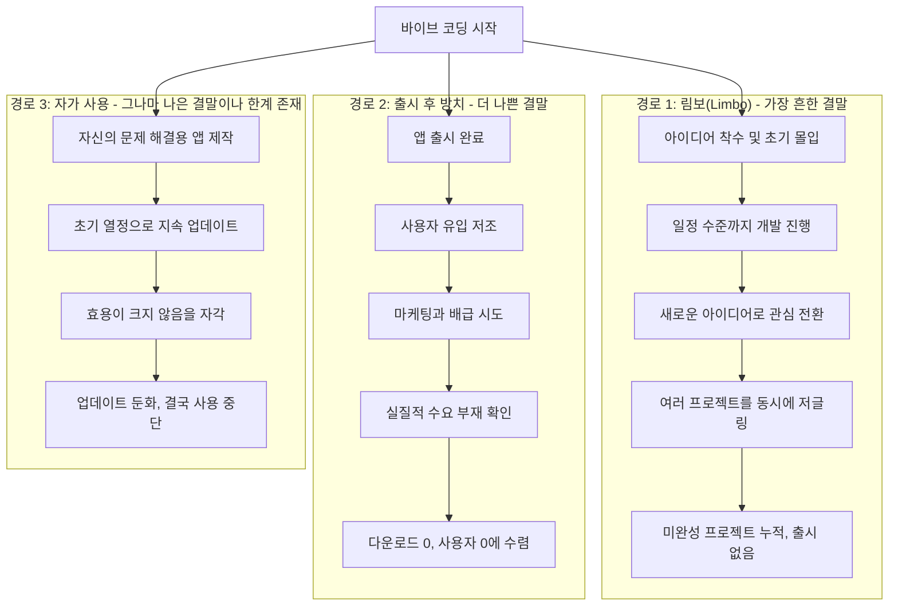
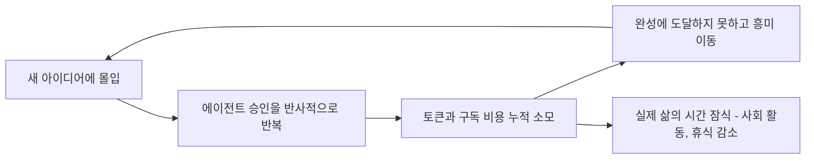

## 목차

1. 들어가며 — 이 글이 던지는 질문
2. 바이브 코딩이란 무엇이었나
3. 저자는 누구인가
4. 바이브 코더들의 두 가지 결말 — "바이브 무덤(Vibe Cemetery)"
5. 진짜 비용의 실체 — 돈과 시간
6. 세 번째 길 — 나를 위한 앱, 그러나 그 한계
7. "나는 쿵푸를 안다" — 바이브 코더의 심리와 그 붕괴
8. 왜 아무도 당신의 앱을 원하지 않는가 — 배급과 경제 환경의 변화
9. 저자가 던지는 마지막 경고 — AI 가격 상승과 오픈소스 모델의 부상
10. 사실 검증(Fact-check) — 원문 주장 대 실제 데이터
11. 종합 정리 및 시사점

---

## 1. 들어가며 — 이 글이 던지는 질문

이 글은 2026년 6월 말 Medium에 게재된 디자이너 Michal Malewicz의 에세이 [**"You only have weeks left to vibe code(바이브 코딩할 시간이 몇 주밖에 남지 않았다)"**](https://medium.com/@michalmalewicz/you-only-have-weeks-left-to-vibe-code-09a89c3d3f9b)를 원문으로 삼아 그 내용을 처음부터 끝까지 풀어서 설명한 것이다. 제목만 보면 "서둘러 바이브 코딩을 하라"는 독려처럼 읽히지만, 실제 내용은 정반대에 가깝다. 저자는 지난 1~2년간 이어진 바이브 코딩(Vibe Coding) 열풍의 실상을 냉정하게 해부하면서, 그 열풍이 구조적으로 지속 불가능하며 조만간 저렴했던 AI 사용 비용마저 사라질 것이라고 경고한다. 즉 "지금이 아니면 늦는다"는 절박함을 표면적인 어조로 취하면서도, 그 이면에서는 "애초에 이걸 할 필요가 있었는가"라는 근본적인 회의를 던지는 이중적 구조의 글이다.

바이브 코딩이라는 용어에 익숙하지 않은 독자를 위해 먼저 개념을 정리하고, 이후 저자가 제시하는 논거를 순서대로 따라가 보겠다. 아울러 저자가 본문에서 제시한 구체적인 수치나 비교 주장(예: Claude 구독료, GLM 5.2의 가격 경쟁력 등)에 대해서는 별도로 최신 자료를 검색해 사실관계를 점검했으며, 그 결과를 문서 후반부의 "사실 검증" 섹션에 정리했다.

## 2. 바이브 코딩이란 무엇이었나

바이브 코딩(Vibe Coding)은 코딩 지식이 부족하거나 전무한 사람도 자연어로 원하는 결과물을 설명하면 Claude Code, Cursor, GLM 계열 코딩 에이전트 같은 AI 코딩 도구가 대신 앱이나 서비스를 만들어주는 개발 방식을 가리키는 최근 유행어다. 이 흐름의 핵심 서사는 "코딩은 더 이상 병목이 아니다. 이제 중요한 것은 아이디어다"라는 것이었다. 저자의 표현을 빌리면, 그동안 "지루한 개발자" 취급을 받던 사람들 대신 "아이디어를 가진 사람들(idea people)"이 스스로를 스티브 잡스처럼 여기며 제품을 쏟아내기 시작한 시기였다. 저자 스스로도 이 흐름에 유머러스하게 동참했음을 인정하는데, 검은 터틀넥을 입고 턱을 괴는 스티브 잡스풍 포즈를 장난스럽게 따라 한 사례를 언급하며 이 유행의 자기도취적 성격을 자조적으로 풍자한다.

저자는 이 흐름을 단순히 비웃기 위해 글을 쓴 것이 아니다. 그는 2001년부터 디자이너로 일해왔고, 당시에는 디자인과 프론트엔드 코딩이 분리되지 않았던 시절이었기에 코드에 대한 기본적인 이해가 있다. 그래서 AI가 생성한 결과물을 손으로 다듬어 "AI 특유의 티가 나지 않게" 만들 수 있었고, 실제로 5천~6천 명 규모의 사용자를 확보한 애플리케이션도 만들어냈다. 즉 그는 바이브 코딩을 냉소적으로 비판하는 외부인이 아니라, 그 안에서 실제로 성과를 낸 당사자로서 이야기를 시작한다는 점이 이 글의 설득력을 높이는 지점이다.

## 3. 저자는 누구인가

Michal Malewicz는 디자인 스튜디오 Squareblack의 대표이며, Deliberately Defiant라는 조직의 CEO이기도 하다. 그는 Squareblack Blueprint라는 채널을 통해 자신의 디자인·창업 노하우를 커뮤니티와 공유하고 있고, 개인적으로는 Longevity Deck(건강·장수 관리 애플리케이션)과 Bars(단식 트래커 애플리케이션)라는 두 개의 자체 개발 앱을 운영하고 있다. 본문에서 그는 Longevity Deck이 여전히 하루 약 1천 명 수준의 활성 사용자를 유지하고 있다고 밝히는데, 이는 저자 본인이 직접 공개한 수치로, 외부 지표로 독립적으로 검증하기는 어려우나 그가 자신의 주장을 뒷받침하기 위해 실명과 실제 서비스를 걸고 이야기하는 인물이라는 점은 분명하다. 그는 또한 2012년 아이폰 퍼즐 게임을 출시해 60만 다운로드를 넘긴 경험이 있는, 모바일 앱 시장의 여러 국면을 몸소 겪어온 실무자다.

## 4. 바이브 코더들의 두 가지 결말 — "바이브 무덤(Vibe Cemetery)"

저자는 거의 모든 바이브 코딩 프로젝트가 결국 두 가지 운명 중 하나로 귀결된다고 진단한다. 이 구조를 정리하면 다음과 같다.

첫 번째이자 가장 흔한 결말은 "림보(limbo)" 상태다. 아이디어를 가진 사람이 어느 정도 수준까지 앱을 만들다가 곧 다른 아이디어에 눈을 돌리고, 여러 프로젝트를 동시에 저글링하다가 결국 1년이 넘도록 아무것도 출시하지 못한 채 미완성 프로젝트만 쌓아가는 패턴이다. 저자는 이런 사람들이 "빌드 인 퍼블릭(build in public)"이라는 명목 아래 자신의(혹은 사실상 Claude의) "여정"을 SNS에 공유하며 마치 세상의 정점에 서 있는 듯한 착각에 빠진다고 지적한다. 저자 본인도 완성 직전 단계에서 멈춘 미출시 프로젝트가 세 개 있다고 고백하며, 이 문제에서 자유롭지 않음을 인정한다.

두 번째 결말은 실제로 앱을 출시했지만 사용자가 전혀 없는 경우다. 저자는 이를 설명하기 위해 Reddit 커뮤니티(r/ClaudeAI)에서 크게 화제가 된 한 게시물을 인용한다. 이 게시물의 작성자는 Claude를 이용해 아이폰용 앱 4개를 실제로 출시했고 5개를 추가로 개발 중이지만, 전체 수익은 0달러이며 사용자도 사실상 본인의 배우자와 우연히 다운로드한 것으로 추정되는 핀란드의 한 사용자 정도뿐이라고 밝혔다. 이 게시물이 던지는 통찰은 상당히 날카로운데, "AI가 제거한 것은 빌드(building)의 장벽이지 배급(distribution)의 장벽이 아니었다"는 것이다. 즉 예전에는 앱을 만드는 것 자체가 너무 어려워서 배급의 어려움을 미처 체감할 겨를이 없었지만, 이제는 만드는 것이 쉬워지면서 그동안 가려져 있던 배급이라는 훨씬 더 큰 장벽이 고스란히 드러났다는 뜻이다. 저자는 이 통찰이 옳지만 동시에 "이제 와서는 별 의미가 없다"고 잘라 말한다. 배급이 문제라는 진단은 맞지만, 애초에 더 근본적인 문제, 즉 "사람들이 당신의 앱을 필요로 하지 않는다"는 사실 자체가 해결되지 않기 때문이다.

## 5. 진짜 비용의 실체 — 돈과 시간

저자가 가장 강조하는 지점 중 하나는 바이브 코딩이 "공짜 놀이"가 아니라는 사실이다. 그는 이를 "꽤 비싼 취미"라고 표현한다. 진지하게 바이브 코딩을 하는 사람들 대부분은 최소 월 100달러 상당의 구독 플랜을 사용하고 있으며, 이는 실제 토큰 비용으로 환산하면 약 4천 달러에 달하는 가치라고 주장한다. 더 심한 경우, 즉 여러 개의 200달러짜리 구독을 동시에 결제하고 병렬로 에이전트 루프를 돌리는 이른바 "중증 바이버(psychotic viber)"들은 토큰을 태우고 코드를 계속 생성하지만 정작 아무것도 결실을 맺지 못하는 상황에 빠진다. 저자의 계산에 따르면 가장 낮은 수준으로 잡아도 연간 1,200달러를 쓰고도 아무것도 만들어내지 못하는 사람들이 존재한다는 것이다.

그러나 저자가 더 심각하게 여기는 비용은 돈이 아니라 시간이다. 그는 바이브 코딩이 넷플릭스 시청이나 사회적 만남보다 더 중독적이라고 느끼는 사람들이 있다고 전한다. 이 현상을 상징적으로 보여주는 장면이 있는데, 터미널 화면에 "실수하지 마라(Make no mistakes)"는 지시와 함께 에이전트가 19만 8천 토큰을 소모하며 "돌아다니는(frolicking)" 모습이 표시되고, 그 아래 "그냥 멈춰라(Just STOP)"라는 문구가 함께 등장하는 장면이다. 저자는 일부 바이버들이 Claude Code 터미널에서 반사적으로 숫자 "1"을 눌러 확인(승인)하는 행동이 손가락 틱처럼 굳어져 버렸고, 심지어 이 확인 버튼을 누르는 타이밍을 마치 게임처럼 즐기는 사람들, 즉 AI가 "돌아다니는" 것이 멈추기 직전에 정확히 맞춰 응답을 승인하는 데서 쾌감을 느끼는 사람들까지 나타났다고 지적한다.

이러한 시간과 비용을 도식화한 그래프도 본문에 등장하는데, AI가 도입된 시점을 기준으로 "일한 시간(hours worked)"은 급격히 치솟는 반면 "생산성 향상(productivity gains)"은 그에 비례해 늘지 않고 완만하게만 증가하는 모습을 보여준다. 저자는 이를 두고 "체감 생산성은 폭발적으로 증가했지만 실제 측정 가능한 성과는 반올림 오차 수준이며, 우리는 그저 더 많이 일하고 있을 뿐"이라고 요약한다. 결국 사람들은 프로젝트가 완성되지 않은 채 1년이 훌쩍 지나가는 것을 경험하게 되고, 그 시간 동안 잔디밭을 밟을 일도, 사람들과 어울릴 일도 줄어드는 삶을 살게 된다는 것이 저자의 우려다.

이러한 무의미한 소모의 순환 구조를 정리하면 다음과 같다.

## 6. 세 번째 길 — 나를 위한 앱, 그러나 그 한계

저자는 앞서 언급한 두 가지 실패 경로 외에 세 번째 대안이 있다고 말한다. 바로 "나 자신을 위한 앱을 만드는 것", 즉 자기 자신의 문제를 해결하기 위한 도구를 만드는 접근이다. 절반의 타협 없이 정확히 자신에게 필요한 기능만 구현할 수 있다는 것이 이 방식의 장점이다. 저자 본인이 만든 Bars 단식 트래커 앱이 바로 이런 사례로, 그는 이 앱을 직접 자신의 문제를 풀기 위해 만들었고 지금도 계속 업데이트하고 있다고 밝힌다. 앱 화면에는 하루 동안의 단식 진행 상황이 시각적으로 표현되어 있고, 그 옆에는 저자가 손으로 그린 온보딩 흐름과 화면 설계 스케치가 함께 놓여 있는데, 이는 AI에게 모든 것을 맡기지 않고 여전히 사람이 직접 기획하고 손으로 다듬는 과정이 필요함을 은연중에 보여주는 장면이다.

다만 저자는 이 세 번째 길조차 일반적인 해법으로 삼기는 어렵다고 선을 긋는다. 냉정하게 말해 대부분 사람들이 겪는 "문제"는 그다지 심각한 문제가 아니라는 것이다. 정말로 크고 진짜인 문제를 해결한다면 그것은 훌륭한 일이지만, 그런 경우는 극히 드물다. 저자는 최근 여러 AI 도입 성과 발표(keynote)들을 지켜본 결과, 대부분이 "전사적으로 업무를 Claude에 아웃소싱해서 워크플로우가 17% 빨라졌다"는 식의 한 자릿수에서 낮은 두 자릿수 수준의 개선을 자랑하는 데 그친다고 꼬집는다. 이 정도의 개선 폭으로는, 어떤 앱이나 프로세스를 유지하고 개선하는 일이 오로지 "의지력"에 의존하는 소모전이 되어버린다. 초기에는 열정으로 업데이트를 이어가지만 곧 그 속도가 느려지고, 결국 앱이 어느 순간 고장 나면 그냥 사용을 멈추게 된다는 것이 저자의 관찰이다. 이 패턴을 보여주는 그래프에서는 시간이 흐르면서 "업데이트(updates)"와 "관심(interest over time)"이 우하향하는 붉은 선으로 표현되고, 그와 대비되는 "최적화로 얻는 이득(your optimization benefit)"은 애초에 크게 상승하지 않는 검은 선으로 그려져, 결국 두 선이 "작동 중단(stopped working)" 지점으로 수렴하는 모습을 보여준다. 저자는 이 함정에서 벗어나는 유일한 예외는 "돈을 받지 않아도 평생 그 일을 계속할 만큼 진짜로 좋아서 하는 경우"뿐이라고 못박는다.

## 7. "나는 쿵푸를 안다" — 바이브 코더의 심리와 그 붕괴

이 글에서 가장 신랄한 대목은 바이브 코딩 열풍에 휩쓸린 사람들의 심리를 묘사하는 부분이다. 저자는 많은 바이브 코딩 애호가들에게서 일종의 정신적 도취와 신 콤플렉스가 뒤섞인 독특한 태도가 느껴진다고 말한다. 이들은 "기술을 배우는 데 시간을 낭비하지 않았다"는 사실 자체를 자랑스러워하는데, 프롬프트만으로 그 기술을 곧바로 흡수할 수 있다고 믿기 때문이다. 저자는 이 심리를 영화 <매트릭스>에서 네오가 두뇌에 쿵푸 지식을 다운로드한 뒤 "나는 쿵푸를 안다(I know kung fu)"고 말하는 유명한 장면에 빗대면서, 동시에 심슨 가족의 "나 빼고 다 멍청하다(Everyone's stupid except me)"는 대사를 겹쳐놓는다. 실제로 본문에는 네오가 "나는 앱 만드는 법을 안다(I know how to build apps)"고 말하고, 그 앞에서 모피어스가 "제발 나에게 보여주지 마라(Please don't show me)"고 응수하는 식으로 패러디된 장면이 등장하는데, 이는 자신감과 실제 결과물 사이의 간극을 풍자한 것이다.

그러나 저자는 결국 현실이 이런 자기 확신을 무자비하게 검증한다고 말한다. 실제 수치, 즉 다운로드 수와 사용자 수, 매출은 거짓말을 하지 않는다. 지금까지 진정으로 가치 있는 것을 바이브 코딩으로 만들어낸 사람은 거의 없으며, 사용자들 사이에는 이미 "바이브 피로(vibe-fatigue)"가 상당히 누적되어 있다는 것이다. "슬롭(slop, 저품질 AI 생성물을 가리키는 속어)"이라는 단어가 이제 일반 대중적인 용어로 자리 잡았을 정도로 사람들은 AI가 대충 만든 결과물을 구별해내는 능력이 좋아졌고, 낮은 완성도가 느껴지는 제품에서는 자연스럽게 등을 돌린다고 저자는 지적한다.

## 8. 왜 아무도 당신의 앱을 원하지 않는가 — 배급과 경제 환경의 변화

저자는 문제의 원인을 마케팅이나 배급 전략의 부족으로 돌리는 흔한 해석에 대해서도 비판적이다. 물론 "AI 빌더" 계정들이 성공 사례로 언급하는 유명한 "테크 브로(tech bro)"들이 존재하지만, 이들 대부분은 애초에 실제 개발자 출신이었고 처음부터 많은 팔로워를 보유하고 있었다는 점에서 업계를 대표하는 사례가 아니라고 지적한다. 심지어 이들의 제품에 돈을 지불하는 고객 상당수도 결국 초기 단계의 다른 바이브 빌더들인 경우가 많다는 것이다. 즉 성공한 소수의 사례를 보고 "나도 저렇게 될 수 있다"고 생각하는 것 자체가 착각이라는 뜻이다.

여기에 더해 저자는 거시경제적 요인도 언급한다. 현재의 경제 환경에서 사람들은 새로운 서비스에 월 구독료를 내는 것을 점점 꺼리며, 평생 라이선스나 아예 무료인 제품을 선호하는 경향이 강해지고 있다고 말한다. 바이브 코딩으로 만들어진 앱에 매달 구독료를 낸다는 발상 자체가 소비자들에게는 거부감을 준다는 것이다. 결국 억만장자가 될 수 있는 제품을 만들 수도 있었겠지만, 실제로는 거의 아무도 그렇게 하지 못했다. 그런 규모의 성공은 이미 인터넷 시장을 오래전에 장악한 거대 기업들과 그 파생 조직들에게만 허락된 영역이라는 것이 저자의 결론이다. 평범한 개인 개발자가 기대할 수 있는 최선은 운이 좋아야 수천 명 수준의 사용자를 확보하는 정도라고 그는 잘라 말한다.

저자는 이 모든 현상의 근본 원인이 코딩 능력도, 마케팅도, 배급도 아니었다고 강조한다. 오히려 결정적인 요인은 언제나 "적절한 시점에 적절한 위치에 있었는가"였다는 것이다. 그가 2012년 자신의 첫 아이폰 게임을 출시했을 때는 시장이 아직 신선했고, 그 게임은 60만 다운로드를 넘기며 이후 회사의 디자인 사업에도 많은 문을 열어주었다. 하지만 지금 같은 시기에 똑같은 방식으로 아이폰 게임을 만든다면 전혀 통하지 않을 것이라고 그는 단언한다. 누구나 "코딩"할 수 있게 된 지금, 역설적으로 아무도 새로운 앱을 원하지 않게 되었다는 것이 그의 진단이다.

## 9. 저자가 던지는 마지막 경고 — AI 가격 상승과 오픈소스 모델의 부상

이 글의 마지막 부분에서 저자는 논조를 바꿔, 지금이 바이브 코딩을 하기에 오히려 마지막 기회일 수도 있다는 경고성 메시지를 던진다. 그의 논리는 다음과 같다. 지금 사용자가 지불하는 월 20~200달러 수준의 구독료는 실제로는 약 8천 달러 상당의 컴퓨팅 자원을 보조받고 있는 것이며, 프론티어 AI 기업들이 사용자의 연산 비용을 대신 부담해주는 이러한 구조는 곧 끝날 것이라는 주장이다. 그는 AI 모델 자체가 GUI나 네트워크 프로토콜처럼 결국 "상품화(commodity)"될 것이며, 특히 중국 기업들이 공개하는 오픈소스/오픈웨이트 모델들이 이러한 상품화를 가속하고 있다고 본다. 실제 사례로 그는 GLM 5.2를 언급하며 "지금은 절반 가격 수준이지만 그 회사(Z.ai) 역시 손실을 보고 있다"고 지적한다.

저자는 프론티어 AI 기업들의 사업 모델이 지속 가능하지 않다고 주장한다. 그는 AI 기업들이 실제 손익분기점에 도달할 명확한 경로 없이 그저 FOMO(고립 공포감)와 하입 사이클을 조성해 추가 투자를 유치하는 데 몰두하고 있으며, 그렇게 유치한 투자금을 실질적 진전 없이 소진하고 있다고 본다. 이러한 상황에서 중국 기업들이 저비용으로 오픈소스/오픈웨이트 모델을 내놓는 것이 프론티어 기업들의 입지를 더욱 위축시키는 요인이라는 것이다. 저자는 이러한 흐름이 이어진다면 로컬에서 구동 가능한 모델의 성능이 2년, 길어야 18개월 전 프론티어 AI 수준까지 후퇴(사실은 상향 평준화)하는 시점이 올 것이라고 전망하며, 그때가 되면 AI가 모든 작업을 대신 해주던 시대는 "일단 뒤로 미뤄질 것"이라고 말한다. 결국 그는 사람들이 조만간 좋은 품질의 AI 사용에서 가격 장벽에 부딪히게 될 것이라 경고하며, 앞으로는 랜딩페이지 제작이나 코드 작성 보조 정도의 활용은 가능하지만, 모델이 모든 것을 대신 해주는 시대는 당분간 유예될 것이라고 내다본다.

마지막으로 그는 다소 이상주의적인 소망을 덧붙인다. AI가 인류의 진짜 문제, 즉 질병 치료나 혁신 같은 영역에 집중하는 것이 세상에 더 이롭지, 곧 버려질 파란색과 보라색 투두리스트 앱을 끝없이 찍어내는 데 쓰이는 것은 바람직하지 않다는 것이다. 그는 "아직 멋진 아이디어를 바이브 코딩하지 않았다면 서두르거나, 아니면 그냥 포기하라"는 다소 냉소적인 문장으로 글을 마무리한다.

## 10. 사실 검증(Fact-check) — 원문 주장 대 실제 데이터

이 문서는 원문의 주장을 그대로 옮기는 데 그치지 않고, 본문에 등장한 구체적인 수치와 비교 주장들을 최신 자료로 직접 대조했다. 그 결과는 다음과 같다.

| 원문의 주장 | 검증 결과 |
|---|---|
| 진지한 바이버는 최소 월 100달러 플랜, 심한 경우 월 200달러 플랜을 여러 개 사용 | 사실과 부합한다. Anthropic 공식 요금제 기준으로 Claude Max는 Max 5x가 월 100달러, Max 20x가 월 200달러로 확인되며, 이는 Claude Pro(월 20달러, 연간 결제 시 월 17달러)보다 훨씬 높은 상위 티어다. |
| "$100/월 플랜이 실제 토큰 비용으로는 약 4,000달러 상당" | 정확한 배율까지 공식적으로 확인되지는 않으나, 여러 업계 분석에 따르면 Max 20x(월 200달러) 플랜이 API 종량제 대비 최대 20배 이상의 가치를 제공한다는 추산이 존재하며, 실제로 한 개발자가 8개월간 100억 토큰을 사용했을 때 API 종량 요금으로는 1만 5천 달러 이상이 나왔을 사용량을 Max 플랜으로는 약 800달러에 소화했다는 사례도 보고된 바 있다. 원문의 "8,000달러 상당" 수치 자체를 1:1로 검증할 공식 자료는 없지만, 방향성(정액제가 실사용 가치 대비 크게 할인되어 있다는 점)은 여러 자료에서 일관되게 뒷받침된다. |
| GLM 5.2가 Claude보다 "절반 가격(half as expensive)" | 이 부분은 원문의 표현이 실제보다 격차를 과소평가한 것으로 확인된다. 2026년 6월 공개된 GLM 5.2의 API 가격은 입력 토큰 기준 100만 토큰당 1.40달러, 출력 토큰 기준 4.40달러이며, 이에 대응하는 Claude Opus 4.8은 입력 5달러, 출력 25달러다. 즉 입력 기준 약 3.6배, 출력 기준 약 5.7배 더 저렴한 수준으로, "절반"이라는 표현보다 실제 격차가 훨씬 크다. 다만 성능 면에서는 Claude Opus 4.8이 대부분의 장기·복합 에이전트 코딩 벤치마크에서 여전히 우위를 지키고 있어, 저자가 언급한 "가격 경쟁력은 있지만 만능은 아니다"라는 취지 자체는 유효하다. |
| "그 회사(Z.ai)도 손실을 보고 있다" | 이 부분은 공개된 재무제표 등으로 명확히 확인할 수 있는 자료를 찾지 못했다. 업계 전반적으로 오픈소스 모델을 제공하는 중국계 AI 기업들의 수익성에 대한 우려가 자주 제기되고는 있으나, 특정 시점의 손익 수치를 근거로 이 주장을 단정하기는 어렵다. 이는 저자의 추정에 가까운 서술로 이해하는 것이 정확하다. |
| "바이브 코딩 피로(vibe-fatigue)"와 백래시(backlash) 현상 | 사실에 부합한다. 2026년 초부터 바이브 코딩에 대한 실망감이 확산되며 일부 빌더들이 유지보수의 벽에 부딪혀 노코드(no-code) 플랫폼으로 회귀하는 흐름이 다수 보고되었다. |
| Reddit에 인용된 "Claude로 아이폰 앱 4개 출시, 매출 0달러" 게시물 | 원문 저자가 직접 인용한 게시물로, 외부에서 이 특정 게시물 원문을 독립적으로 재검색해 확인하지는 못했다. 다만 유사한 취지의 "만들기는 쉬워졌지만 배급은 여전히 어렵다"는 서사는 바이브 코딩 커뮤니티 전반에서 반복적으로 나타나는 담론이며, 저자가 이를 인용한 맥락 자체는 해당 커뮤니티의 일반적 정서와 일치한다. |
| Anthropic 등 프론티어 AI 기업의 사업이 "지속 불가능하다"는 주장 | 이는 검증 가능한 사실이라기보다 저자의 견해다. 실제로 업계에서는 프론티어 모델 기업들의 높은 인프라 투자 비용과 가격 경쟁 심화에 대한 우려가 존재하지만, 특정 기업이 몇 년 안에 사업을 지속할 수 없다고 단정할 만한 공개된 근거는 없다. 이 부분은 사실 서술이 아니라 저자의 전망(opinion)으로 구분해서 읽는 것이 바람직하다. |

## 11. 종합 정리 및 시사점

이 글을 관통하는 하나의 메시지는 "AI가 만드는 장벽 제거는 절반의 해법에 불과하다"는 것이다. 코드를 작성하는 능력이라는 병목은 확실히 낮아졌지만, 그로 인해 드러난 것은 애초에 존재했던 훨씬 더 근본적인 병목, 즉 진짜 수요와 배급, 그리고 지속적인 관리 역량이라는 병목이다. 이는 흥미롭게도 엔터프라이즈 AX(AI Transformation) 현장에서 자주 언급되는 "AX 시어터(AX Theater)" 문제, 즉 데모나 시제품을 만드는 것은 바이브 코딩으로도 극도로 쉬워졌지만 그것을 실제로 "작동하는" 수준까지 운영하는 것은 완전히 다른 차원의 과제라는 논의와 본질적으로 같은 구조를 공유한다. 개인 개발자의 세계에서 벌어지는 "바이브 무덤" 현상과, 기업 조직 내부에서 벌어지는 "PoC는 성공했지만 실제 운영에는 실패하는" 현상은 결국 같은 원인, 즉 하네스(Harness)와 운영 역량의 부재에서 비롯된다고 볼 수 있다.

또한 저자가 제기하는 AI 비용 상승 전망은 아직 확정된 사실이라기보다는 하나의 시나리오에 가깝지만, 실제로 GLM 5.2와 같은 오픈웨이트 모델이 Claude, GPT 계열 모델 대비 3.6배에서 5.7배 수준의 가격 우위를 확보하며 빠르게 추격하고 있다는 사실 자체는 명확히 확인된다. 이는 향후 모델 선택 전략에서 "모든 작업을 하나의 프론티어 모델에만 의존하지 않고, 작업의 성격에 따라 모델을 라우팅하는 접근"이 더욱 중요해질 것이라는 시사점을 준다. 결국 이 글이 전하는 핵심은 기술 도구 자체에 대한 비관론이 아니라, "도구가 쉬워질수록 그 도구를 제대로 활용할 수 있는 사람과 조직의 역량 차이가 오히려 더 크게 벌어진다"는 역설이라고 요약할 수 있다.

---

작성일자: 2026-07-04
