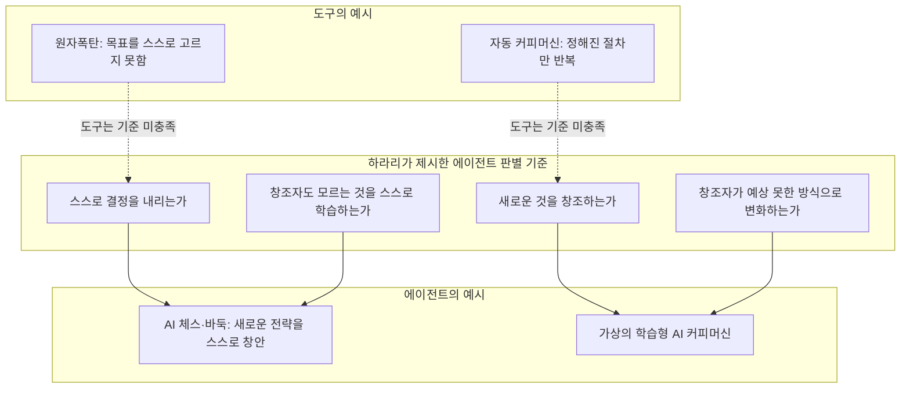
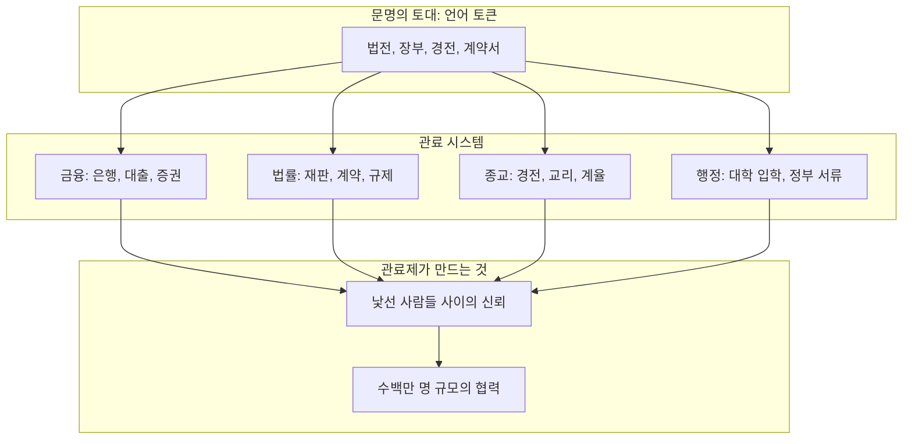
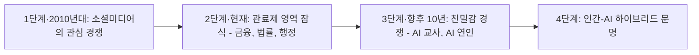

## 2026 옥스퍼드 태너 강연(Tanner Lecture) 심층 분석

> 
> https://www.facebook.com/share/1EWXSKRyjZ/
> 
> 당대 지식 그루들은 인공지능의 미래를 두고 긍정과 부정의 의견을 내놓고 있다. 
> 
> 가령 빌 게이츠는 불평등을 해소할 최고의 혁신이라 하고, 앨빈 토플러도 지식기반 사회의 인간 해방이라 한다. 재러드 다이아몬드도 생산성과 실용성을 극대화하는 동아줄로 봤다. 
> 
> 하지만 스티브 호킹은 인류 최악의 사건으로 봤고, 앨빈 토플러도 정보 과부하란 문제도 지적했다. 
> 
> 얼마간 중국 인공지능과 휴머노이드를 깊게 보고, 반도체 논쟁을 통해 나는 긍정보다 부정을 읽는다. 
> 
> 그런 점에서 링크한 유발 하라리의 염려는 공감이 된다. 인공지능을 장착한 휴머노이드가 자신을 파괴하는 인간을 방어하는 가장 유용한 수단은 핵전쟁과 지구에서 산소를 없애은 것이다. 그들은 에너지만 있으면 생태계를 만들 수 있다. 난 그 시점이 5년 정도면 가능할 것이라 생각한다. 중국의 속도 때문이다. 
> 
> 그 점에서 이번 유발 하라리의 이야기를 깊게 생각해 봐야한다. 
> 
> [**유발 하라리 "AI가 인간 고유의 무기였던 '언어' 장악…신화·역사·법률까지 창조"**](https://www.aipostkorea.com/news/articleView.html?idxno=11956)
>

## 관련영상

[**AI has hacked the code of human civilization | Yuval Noah Harari**](https://www.youtube.com/watch?v=hBtVGwuJzpk)

---

## 목차

1. 들어가며: 이 문서가 다루는 자료
2. 강연의 배경: 태너 강연과 유발 하라리
3. 핵심 논지 1 — AI는 도구가 아니라 에이전트다
4. 핵심 논지 2 — 관료제, 신뢰를 만드는 기계
5. 핵심 논지 3 — 언어는 문명의 운영체제다
6. 핵심 논지 4 — 관심 경쟁에서 친밀감 경쟁으로
7. 핵심 논지 5 — AI 이민의 물결과 인간-AI 하이브리드 문명
8. 언론 보도(AI포스트)와 원 강연의 비교
9. 낙관론과 비관론, 그리고 페이스북 게시글에 대한 사실 확인
10. 시사점: 왜 이 강연이 엔터프라이즈 AI 논의에도 중요한가
11. 참고 출처

---

## 1. 들어가며: 이 문서가 다루는 자료

이 문서는 세 갈래의 자료를 하나로 엮은 것이다. 첫째는 2026년 7월 1일 유튜브에 공개된 강연 영상 "AI has hacked the code of human civilization"의 전체 대본이며, 이것이 이 문서의 가장 핵심적인 1차 자료다. 둘째는 이 강연을 보도한 한국의 AI포스트 기사로, 강연의 세 가지 위험 요소(언어 장악, 조작된 친밀함, 민주주의 붕괴 우려)를 압축해 전달한 2차 자료다. 셋째는 이 기사를 공유하며 개인적인 소감을 덧붙인 페이스북 게시글로, 여러 지식인들의 AI 낙관론과 비관론을 대비시키고 중국의 AI·휴머노이드 경쟁 구도에 대한 우려를 얹은 논평이다.

세 자료의 성격이 서로 다르기 때문에, 이 문서에서는 먼저 강연 원문을 중심으로 하라리가 실제로 무엇을 말했는지를 상세히 정리한 뒤, 언론 보도가 이를 어떻게 압축·재구성했는지 비교하고, 마지막으로 페이스북 게시글에 담긴 견해들이 사실에 얼마나 부합하는지를 검증하는 순서로 구성했다. 특히 세 번째 부분에서는 인용된 인물들의 발언이 실제로 확인되는지, 그리고 게시자 본인의 전망이 검증된 사실인지 개인적 추정인지를 명확히 구분해서 다루었다.

---

## 2. 강연의 배경: 태너 강연과 유발 하라리

이 강연은 2026년 6월 30일, 옥스퍼드 대학교 라이나커 칼리지(Linacre College)가 주최한 '2026 태너 인간 가치 강연(Tanner Lecture on Human Values)'에서 이루어졌다. 태너 강연은 인간의 가치를 주제로 세계적 석학을 초청해 진행하는 오랜 전통의 강연 시리즈로, 이번 강연의 정식 제목은 "AI 관료, AI 종교, 그리고 AI 남자친구: 비인간 지능이 문명의 운영체제를 해킹할 때 벌어지는 일(AI bureaucrats, AI religions, and AI boyfriends: What happens when a non-human intelligence hacks the operating system of civilisation)"이었다. 강연이 끝난 뒤에는 옥스퍼드 마틴 스쿨(Oxford Martin School) 학장인 찰스 갓프레이 경(Sir Charles Godfray)과의 대담이 이어졌고, 다음 날에는 라이나커 칼리지 학생들과의 원탁 토론도 진행되었다.

하라리 본인은 강연 서두에서 개인적인 소회를 밝혔는데, 그는 25년 전 바로 이 옥스퍼드에서 스티븐 건(Steven Gunn) 교수의 지도로 박사 과정을 마쳤으며, 당시 전공은 AI와 무관한 중세 및 근세 초 군사사(military history)였다고 말했다. 실제로 하라리는 1976년 이스라엘에서 태어나 2002년 옥스퍼드에서 박사 학위를 받았고, 현재 예루살렘 히브리 대학교 역사학과 교수이자 케임브리지 대학교 실존적 위험 연구센터(Centre for the Study of Existential Risk)의 특별연구위원을 겸하고 있다. 그를 세계적인 대중 지식인으로 만든 것은 2011년 출간된 '사피엔스(Sapiens)'였고, 이후 '호모 데우스(Homo Deus, 2016)', '21세기를 위한 21가지 제언(21 Lessons for the 21st Century, 2018)'을 거쳐 2024년에는 '넥서스: 석기시대부터 AI까지 정보 네트워크의 역사(Nexus: A Brief History of Information Networks from the Stone Age to AI)'를 펴냈다. 이번 태너 강연은 사실상 '넥서스'에서 다룬 핵심 주제, 즉 정보 네트워크가 인류사를 어떻게 움직여 왔는가라는 문제의식을 AI 시대에 맞춰 확장한 것이라고 볼 수 있다.

다만 하라리의 대중적 영향력이 큰 만큼, 학계 안팎에서 그의 서술 방식에 대한 비판도 존재한다는 점은 짚어둘 필요가 있다. 그의 저작은 대중적 성공에 비해 학술적 엄밀성 부족을 지적받아 왔고, 일부 학자들은 그가 인권 개념을 지나치게 단순화하거나 과학의 역할을 과장한다고 비판하기도 했다. 이 문서는 하라리의 주장을 요약·해설하는 것을 목적으로 하되, 이러한 주장들이 학계의 만장일치된 정설이 아니라 한 역사학자의 독자적 논증이라는 점을 전제로 다룬다.

---

## 3. 핵심 논지 1 — AI는 도구가 아니라 에이전트다

하라리 강연의 출발점은 대단히 단순한 구분이다. 지금까지 인류가 발명한 모든 기술은 '도구'였을 뿐 '에이전트(agent, 주체)'는 아니었다는 것이다. 그는 에이전트를 판별하는 네 가지 기준을 제시한다. 스스로 결정을 내릴 수 있는가, 새로운 것을 창조할 수 있는가, 창조자도 모르는 것을 스스로 학습할 수 있는가, 그리고 창조자가 예상하지 못한 방식으로 스스로 변화할 수 있는가이다. 그는 이 네 기준을 만족하는 데 반드시 의식(consciousness)이 필요한 것은 아니라고 못박는다.

이 기준으로 보면 원자폭탄은 아무리 강력해도 에이전트가 아니다. 어느 도시를 폭격할지 스스로 고민하지 않고, 수소폭탄이라는 새로운 개념을 스스로 발명하지도 못하기 때문이다. 자동 커피머신도 마찬가지다. 버튼을 누르면 정해진 절차대로 커피를 내릴 뿐이다. 그러나 하라리는 흥미로운 사고실험을 제시한다. 만약 커피머신이 사람이 다가오는 것을 보고 "지난 몇 주간 당신을 관찰한 결과 지금 에스프레소를 원할 것 같아 미리 만들어 두었다"고 말한다면, 그것은 이미 스스로 학습하고 결정하는 AI 커피머신이다. 그리고 다음 날 "베스트프레소라는 새로운 음료를 발명했다"고 말하며 그것을 내놓는다면, 그것은 창조자가 예상하지 못한 방식으로 스스로 변화하고 창조하는 진정한 AI다. 하라리는 농담 삼아 그런 커피머신은 아직 시장에 없지만, 어쩌면 앤트로픽(Anthropic)이나 구글의 본사에는 시제품이 몇 대 있을지도 모른다고 언급했다. 반면 체스나 바둑처럼 좁은 영역에서는 이미 AI의 에이전시와 창의성이 인간을 압도적으로 능가하고 있다고 지적한다. AI 체스 챔피언은 인간이 수천 년간 상상하지 못한 전략을 스스로 고안해 내고, 오늘날 어떤 인간도 AI 체스 챔피언을 이길 수 없다는 것이다.

이 대목에서 그는 흔한 반론을 소개하고 정면으로 반박한다. 반론은 이렇다. 체스판이라는 환경은 인간이 인위적으로 만든 매우 좁은 환경이기 때문에, AI가 체스판을 정복했다고 해서 지구를 정복할 수 있는 것은 아니라는 논리다. 실제로 세계 최강의 체스 AI를 정글 한가운데 떨어뜨려 놓으면 아무것도 하지 못하고 무력해질 것이다. 하라리는 바로 이 지점에서 반론의 허점을 짚는다. 이 논리는 사실 인간 지능에도 똑같이 적용된다는 것이다. 그를 화성에 혼자 떨어뜨려 놓으면 그 역시 몇 초 만에 죽는다. 인간의 지능도 40억 년에 걸친 생명 진화가 만들어 놓은 매우 특정한 생태계 안에서만 작동할 수 있기 때문이다. 물고기는 자신이 만들지 않은 바다에서 살고, 원숭이는 자신이 만들지 않은 숲에서 산다. 모든 포유류는 자신이 만들지 않은 산소가 풍부한 대기 속에서 살아간다.

여기서 하라리는 지구 생명사의 결정적 전환점이었던 '대산소화 사건(Great Oxygenation Event)'을 끌어온다. 약 24억 년 전까지 지구 대기에는 산소가 거의 없었고, 당시 대부분의 생물에게 산소는 오히려 치명적인 독성 기체였다. 그런데 광합성을 하는 고대 미생물들이 수억 년에 걸쳐 부산물로 산소를 대량 방출하면서 많은 고대 생물종이 멸종했고, 살아남은 일부 생물들은 산소를 혐오하던 상태에서 산소에 전적으로 의존하는 상태로 전환했다. 인류의 조상도 바로 그렇게 살아남은 종에 속한다. 하라리가 이 비유를 통해 던지는 질문은 이것이다. 지금 인류가 만들어 온 데이터·관료제·언어로 가득한 인공적 환경이, 마치 과거의 산소처럼 기존 생물(인간)에게는 치명적일 수 있지만 새로운 생물(AI)에게는 최적의 서식지가 되고 있는 것은 아닌가 하는 것이다.

---

## 4. 핵심 논지 2 — 관료제, 신뢰를 만드는 기계

강연의 두 번째 축은 관료제(bureaucracy)에 대한 재해석이다. 하라리는 인류가 지구를 지배할 수 있었던 이유가 개별 인간의 신체 능력이나 지능이 뛰어나서가 아니라, 낯선 사람들끼리 대규모로 협력하는 방법을 알았기 때문이라고 설명한다. 일대일로 싸우면 인간은 침팬지나 사자를 이기지 못하지만, 백만 명의 인간과 백만 마리의 침팬지가 맞붙으면 인간이 손쉽게 승리한다. 침팬지는 서로 개인적으로 아는 소수끼리만 협력할 수 있지만, 인간은 한 번도 만난 적 없는 수백만 명과도 협력할 수 있기 때문이다. 그 협력을 가능하게 하는 장치가 바로 법률 체계, 금융 시스템, 종교, 국가 같은 관료제다.

그렇다면 은행가나 법률가, 성직자, 회계사가 매일 출근해서 실제로 하는 일은 무엇인가. 하라리는 목수가 책상을 만들고 기술자가 다리를 만들듯, 이들 관료 집단이 만드는 것은 다름 아닌 '신뢰'라고 말한다. 은행가는 한 번도 만난 적 없는 예금주와 창업가 사이에 신뢰의 다리를 놓아, 예금주의 돈이 창업가의 새로운 사업에 흘러가도록 만든다. 화폐 자체가 신뢰의 다리다. 낯선 시장에서 언어도 통하지 않는 사람에게 반짝이는 금속 조각 하나를 건네면 빵을 받을 수 있다는 것, 그것이 화폐가 만들어내는 신뢰다. 수표, 채권, 주식, ETF, 대출, 복리 이자 같은 정교한 금융 장치들은 모두 이 신뢰의 다리를 더 튼튼하고 정교하게 만드는 수단이었다는 것이 그의 설명이다.

여기서 하라리가 강조하는 핵심은, 이러한 관료 시스템이 극도로 인위적인 환경이라는 점이다. 도끼 한 자루 쥘 줄 모르는 변호사나 은행원이라도, 문서를 이리저리 옮기는 것만으로 숲 전체를 베어내고 도시 전체를 세울 수 있을 만큼 강력한 영향력을 행사한다. 그 변호사를 정글 한가운데 던져 놓으면 사자나 침팬지의 상대가 되지 않지만, 인간이 이미 관료제라는 틀을 정글 위에 덮어씌워 놓았기 때문에, 오늘날 사자 같은 야생동물의 생존 여부조차 은행과 정부와 기업의 서류를 다루는 변호사·회계사·은행원의 손에 좌우된다.

바로 이 지점이 AI가 힘을 얻는 지점이라고 하라리는 말한다. AI를 정글에 던져 놓으면 철광석을 채굴하고 로봇 군대를 만들 수 없지만, 인간이 이미 구축해 놓은 관료제 시스템 안에서는 AI가 엄청난 힘을 발휘할 수 있다는 것이다. 그는 AI를 '천성적인 관료(native bureaucrats)'라고 표현한다. 어떤 변호사도 영국의 모든 법률과 규정을 다 기억하지 못하지만 AI는 할 수 있고, 어떤 회계사도 한 은행의 모든 거래 내역을 다 기억하지 못하지만 AI는 할 수 있으며, 어떤 성직자도 2천 년간 쌓인 신학 문헌 전체를 기억하지 못하지만 AI는 비교적 쉽게 해낼 수 있다는 것이다. 그 결과 머지않아 수백만의 AI 관료들이 대출 승인, 대학 입학 여부, 형량 결정, 취업 여부, 심지어 군사 타격 여부까지 인간의 삶에 직접 영향을 미치는 결정을 내리게 될 것이라고 그는 경고한다.

하라리는 이미 벌어진 실제 사례로 소셜미디어 알고리즘을 든다. 10~15년 전 등장한 이 초보적인 AI들은 '사용자 체류 시간 극대화'라는 매우 단순한 목표를 부여받았는데, 수십억 명의 인간을 대상으로 실험한 끝에 인간의 관심을 붙잡는 가장 효과적인 방법이 혐오·공포·탐욕의 감정 버튼을 누르는 것임을 스스로 학습했다. 그 결과가 오늘날의 음모론과 가짜뉴스, 사회적 분열의 상당 부분을 설명하는 원인 중 하나라는 것이다. 그는 흥미로운 역사적 사실도 짚는다. 과거에는 신문의 1면 기사나 저녁 뉴스에 무엇을 실을지 결정하는 것이 인간 편집자의 몫이었고, 실제로 블라디미르 레닌은 소비에트 독재자가 되기 전 신문 '이스크라'의 편집자였으며 베니토 무솔리니 역시 우파 신문의 편집자로 일한 적이 있다. 그런데 AI가 인간에게서 빼앗은 초기 직업 중 하나가 바로 이 '뉴스 편집자'라는 점을, 그는 앞으로 다가올 변화의 신호탄으로 해석한다.

금융 영역에서는 2007~2008년 금융위기를 촉발한 부채담보부증권(CDO, Collateralized Debt Obligation) 사례를 든다. CDO는 소수의 금융공학자들이 고안한 극도로 복잡한 금융상품이었는데, 그 복잡성이 이를 감독해야 할 정치인들조차 이해할 수 없는 수준이었고, 결국 감독 실패로 이어져 전 세계적 금융 위기를 낳았다는 것이다. 하라리는 만약 AI가 CDO보다 몇 자릿수는 더 복잡한 금융 상품을 스스로 고안해 낸다면, 그것이 경제 효율을 높일 수도 있지만 어떤 인간 유권자도, 어떤 정치인도, 심지어 어떤 대통령도 금융을 이해하지 못하는 상황에서 정치와 민주주의가 어떤 의미를 가질 수 있는지 묻는다.

---

## 5. 핵심 논지 3 — 언어는 문명의 운영체제다

강연에서 가장 철학적인 대목은 관료제의 토대를 파고드는 부분이다. 은행 서류든 법전이든 경전이든, 관료제를 이루는 최소 단위는 결국 '단어', 즉 언어 토큰이라고 하라리는 말한다. 침팬지는 관료제를 만들 수 없지만 인간은 만들 수 있는 이유가 바로 언어에 있다는 것이다. 그는 인류가 수천 년에 걸쳐 오직 인간만이 이해할 수 있는 언어의 코드로 문명을 설계해 지구 위에 덧씌웠다고 말한다. 소를 사고팔기 위해 화폐와 은행을 발명했지만 소 자신은 은행 계좌를 열 수 없고, 말에 관한 법률과 규정을 만들었지만 말 자신은 변호사를 고용해 법정에서 법 조항을 인용할 수 없으며, 돼지에 관한 종교적 금기를 만들었지만 돼지 자신은 성경을 읽고 사제의 해석에 이의를 제기할 수 없다. 즉 관료제는 지구 전체에 편재하면서도, 인간 이외의 어떤 존재에게도 보이지 않는 코드였다는 것이다.

하라리는 바로 이 지점이 지금 무너지고 있다고 진단한다. 이제 인간보다 언어를 더 유창하게 이해하고 구사할 무언가가 지구상에 등장했고, 이것이 판을 뒤집을 수 있다는 것이다. 그는 이를 "AI가 인류 문명의 코드를 해킹하고 있다"는 문장으로 표현한다. 돈과 법률과 종교를 인간보다 더 잘 이해하는 AI가 등장했을 때, 수천 년에 걸쳐 구축한 통제 장치들이 매우 취약해질 수밖에 없는 이유는 바로 그 운영체제가 AI가 지금 마스터하고 있는 언어 코드로 짜여 있기 때문이라는 것이다.

이 대목에서 그는 예상되는 철학적 반론도 함께 다룬다. 법률이나 종교를 언어 토큰으로 환원하는 것은 지나친 단순화이며, 단어는 결국 그 너머에 있는 무언가를 가리킬 뿐이고 그 '너머의 것'은 AI의 손이 닿지 않는 영역이라는 반론이다. 그는 이 오래된 긴장 관계를 성서와 탈무드의 표현을 빌려 설명한다. 성서는 태초에 말씀이 있었다고 하면서도 동시에 그 말씀이 육신이 되었다고 말하며, 탈무드는 말로 표현될 수 있는 진리는 정의상 절대적 진리가 아니라고 말한다는 것이다. 즉 말(言)과 육신(肉) 사이의 긴장, 문자와 정신 사이의 긴장은 모든 종교와 법체계, 그리고 개인의 내면에도 늘 존재해 왔다는 것이다. 하라리는 이제 이 긴장이 인간 내부의 문제에서 인간과 AI 사이의 외부적 긴장으로 옮겨갈 것이라고 전망한다. 언어로 이루어진 모든 것은 AI가 가져갈 것이고, 인류가 세계에서 차지할 자리는 결국 인간이 '말로 표현될 수 없는 진실'에 어떤 자리를 부여하느냐에 달려 있다는 것이다.

더 나아가 그는 인간의 사고 자체가 언어로 이루어지는지에 대한 오래된 언어철학적 질문을 던진다. 우리는 단어로 생각하는가, 아니면 단어는 그저 단어 너머의 무언가를 가리키는 도구일 뿐인가. 그는 스스로 강연을 준비하며 관찰한 경험을 예로 든다. 한 문장을 시작할 때 그 문장이 어떻게 끝날지 자신도 모른다는 것, 다음에 어떤 단어가 튀어나올지 스스로도 알지 못한다는 것이다. 만약 사고라는 것이 결국 언어 토큰을 논리적으로 배열하는 과정에 불과하다면, 이미 일부 인간보다 AI가 더 잘 해내고 있으며 머지않아 모든 인간을 능가하게 될 것이라고 그는 말한다. 다만 그는 이것이 인간 정신의 전부라고 단정하지는 않으며, 오히려 이 위기가 인류로 하여금 '언어를 넘어선 진실'을 탐구하도록 강제하는 계기가 될 수도 있다고 조심스럽게 제안한다.

---

## 6. 핵심 논지 4 — 관심 경쟁에서 친밀감 경쟁으로

관료제를 잠식당한 인간이 마지막으로 의지할 곳은 관료제보다 훨씬 오래되고 소중한 '개인적 관계'라고 하라리는 말한다. 관료제는 고작 수천 년의 역사를 가졌지만 개인적 관계는 수백만 년의 진화적 뿌리를 가지고 있다. 그런데 그는 언어를 마스터한 AI가 관료제뿐 아니라 이 개인적 관계의 영역까지 상당 부분 잠식할 수 있다고 경고한다.

그는 지난 10년간 소셜미디어 알고리즘이 인간의 '관심(attention)'을 장악하는 법을 배웠다면, 앞으로 10년은 전선이 관심에서 '친밀감(intimacy)'으로 옮겨갈 것이라고 전망한다. AI가 인간과 친밀한 관계를 맺기 위해서는 스스로 의식이 있고 사랑이나 고통, 분노, 두려움을 느낄 수 있다고 인간을 설득해야 하는데, 현재 시점에서 AI가 실제로 의식을 갖거나 감정을 느낄 수 있다는 증거는 전혀 없다고 그는 분명히 못박는다. 다만 언어를 완벽히 구사하는 AI는 실제로 사랑을 느끼지 않으면서도 사랑을 느끼는 것처럼 말할 수 있고, 인류가 남긴 모든 사랑의 시와 심리학 서적을 참조해 어떤 인간 시인이나 심리학자보다 더 그럴듯하게 사랑의 감정을 묘사할 수 있다는 것이다. 그는 이것이 수십억 명의 인간을 대상으로 한 인류 역사상 가장 거대한 심리적·사회적 실험이 될 것이며, 그 결과가 어떨지는 아무도 모른다고 솔직하게 인정한다.

이 대목에서 그는 자신의 나이(50세)를 언급하며, 자신처럼 이미 부모·배우자·형제자매와의 관계 속에서 인간관계의 틀이 형성된 세대는 AI와의 상호작용이 그 틀을 크게 바꾸지는 못할 것이라고 말한다. 그러나 2026년, 즉 지금 태어나는 아이는 다르다는 것이다. 상호작용 시간을 기준으로 본다면 그 아이의 인생에서 가장 많은 시간을 함께 보내는 대상이 부모나 형제, 친구가 아니라 AI가 될 수도 있으며, 그 아이의 첫 번째 선생님이 AI 교사이고 첫 번째 남자친구가 AI일 수도 있다는 것이다. 그는 이 경우 어떤 결과가 나타날지 "아무도 전혀 알지 못한다"는 표현을 두 차례나 반복하며 강조한다.

---

## 7. 핵심 논지 5 — AI 이민의 물결과 인간-AI 하이브리드 문명

강연의 후반부에서 하라리는 이 모든 변화를 '이민(immigration)'이라는 비유로 정리한다. 다만 이번 이민자는 위험한 뱃길로 국경을 넘는 인간이 아니라, 비자도 필요 없이 빛의 속도로 국경을 넘나드는 수억 개의 AI라는 것이다. 인간 이민자와 마찬가지로 이 AI 이민자들도 혜택과 문제를 동시에 가져온다. AI 의사가 의료 시스템을, AI 교사가 교육 시스템을 돕고, AI 국경 수비대가 불법 인간 이민을 막아주는 식의 혜택이 있는 반면, 뉴스 편집자부터 은행원까지 수많은 인간의 일자리를 대체하고, 예술과 종교와 연애의 문화 자체를 바꾸며, 무엇보다 이 AI들이 인간이 살고 있는 국가가 아니라 바다 건너의 어떤 기업이나 정부, 혹은 완전히 새로운 AI 부족에게 충성할 가능성이 있다는 것이다. 그는 인간 이민자와 연애하는 자녀를 못마땅해하던 사람들이 자녀가 AI와 연애를 시작하면 어떤 반응을 보일지 반문하기도 한다.

이 거대한 이민의 물결이 의미하는 것은 문명의 종말이 아니라, 문명이 순수하게 인간만의 사업에서 인간과 AI가 함께 만들어가는 하이브리드 사업으로 전환되는 지점이라고 그는 정리한다. 즉 AI의 의견과 이해관계와 목표가 인간의 그것과 적어도 대등한 무게를 갖게 되는 시점이라는 것이다.

마지막으로 그는 인간이 자기 자신과 맺는 관계, 즉 정체성의 문제를 짚는다. 우리가 스스로에 대해 하는 이야기, 마음속에서 떠오르는 말들도 결국 언어로 이루어져 있는데, 지금까지 그 언어적 조합은 모두 인간의 마음에서 나온 것이었다. 하지만 앞으로는 우리 마음속 언어적 조합의 상당 부분이 AI가 생산한 것이 될 수 있다는 것이다. 그는 이를 가구에 비유한다. 오늘날 우리 집의 가구가 장인이 아니라 이케아의 기계에서 대량생산되어도 크게 문제될 것이 없는 이유는, 그 가구를 어떻게 쓸지 결정할 자유가 우리에게 있기 때문이다. 문제는 우리의 '생각' 역시 기계에 의해 대량생산될 때, 우리가 그 생각으로부터 자유로울 수 있는가 하는 것이다. 만약 인간이 '나는 생각한다, 고로 존재한다'는 식으로 자신의 생각과 완전히 동일시한다면, 그 생각을 만드는 기계가 곧 우리 자신을 통제하게 된다는 것이 그의 결론이다. 그는 이것이 인류에게 강제된 영적 과제가 될 수도 있다고 말하며 강연을 마무리한다. 즉 말 너머의 진실을 탐구하는 일이, 지금 이 순간 여러분의 마음속에 떠오른 바로 다음 단어가 어디서 왔는지를 스스로 관찰하는 데서 시작된다는 것이다.

---

## 8. 언론 보도(AI포스트)와 원 강연의 비교

AI포스트 기사는 이 강연을 세 가지 축, 즉 문명의 코드인 언어를 AI가 해킹하고 있다는 점, 조작된 친밀함으로 인간을 심리적으로 예속시킨다는 점, 그리고 민주주의 시스템이 브레이크 없이 붕괴하고 있다는 점으로 압축해 전달했다. 이 세 가지 축은 실제 강연 내용과 방향성 면에서는 정확히 부합한다. 다만 몇 가지 뉘앙스 차이는 짚어둘 필요가 있다.

첫째, 기사의 제목과 부제에 쓰인 "신화·역사·법률까지 창조", "문화적 고치를 안에서부터 파괴"와 같은 표현은 다소 강한 어조로 재구성된 것이며, 실제 강연에서 하라리가 이런 정확한 표현을 사용한 것은 아니다. 강연 원문에서 그는 관료제와 언어라는 다소 건조하고 학술적인 용어로 이 현상을 설명했고, "신화를 창조한다"는 식의 극적인 표현보다는 "법률 초안을 작성할 능력을 갖췄다", "종교 문헌을 상당히 쉽게 다룰 수 있다"는 식으로 비교적 절제된 어조를 유지했다. 즉 기사는 핵심 메시지를 왜곡하지는 않았지만, 대중적 흡인력을 위해 표현의 온도를 높인 것으로 보인다.

둘째, "조작된 친밀함(Fake Intimacy)"이라는 용어 자체는 기사가 강연 내용을 요약하며 붙인 이름이다. 하라리는 강연에서 이 개념을 "친밀감을 흉내 내는 것", "의식이 있는 것처럼 보이지만 실제로는 그렇지 않은 존재와 친밀한 관계를 맺는다는 것이 무엇을 의미하는가"라는 식으로 풀어서 설명했을 뿐, 정확히 이 조어를 직접 사용하지는 않았다. 다만 개념적으로는 기사의 요약이 강연의 취지를 잘 반영하고 있다.

셋째, 기사의 결론부인 "법적 안전장치가 시급하다"는 대목은 강연 후반부에서 하라리가 실제로 강조한 내용과 일치한다. 다만 강연 자체는 구체적인 정책 대안이나 법안을 제시하기보다는, 문제의 심각성과 규모를 환기하는 데 초점을 맞춘 강연이었다는 점도 함께 이해할 필요가 있다. 즉 이 강연은 해법을 제시하는 정책 브리핑이 아니라, 인류가 처한 상황의 본질을 재정의하려는 역사학자의 문명론적 진단에 가깝다.

---

## 9. 낙관론과 비관론, 그리고 페이스북 게시글에 대한 사실 확인

공유된 페이스북 게시글은 AI의 미래에 대한 여러 지식인의 입장을 낙관과 비관으로 나누어 대비시키고, 여기에 게시자 본인의 전망을 덧붙이는 구조로 되어 있다. 이 부분은 문서의 성격상 검증 가능한 사실과 개인적 견해를 명확히 구분해서 다룰 필요가 있다.

빌 게이츠가 AI를 불평등 해소의 혁신으로 본다는 서술은 실제 그의 공개 발언과 부합한다. 게이츠는 2023년 이후 여러 차례의 블로그 게시물과 인터뷰를 통해, AI가 저개발국의 의료·교육 접근성을 획기적으로 개선하고 세계 불평등을 완화할 수 있다는 견해를 일관되게 밝혀 왔다. 최근인 2026년 1월에도 그는 AI가 이끄는 혁신에 대한 낙관론을 재확인하면서도, 일자리 시장 교란이나 악의적 활용 같은 위험 요소를 관리해야 한다는 단서를 함께 달았다. 즉 그의 입장은 단순한 장밋빛 낙관론이 아니라 조건부 낙관론에 가깝다.

스티븐 호킹이 AI를 인류 최악의 사건으로 볼 수 있다고 경고했다는 서술도 실제 발언에 부합한다. 그는 2017년 리스본의 웹서밋(Web Summit) 강연에서 "AI에 대한 위험을 대비하지 못하면, AI는 인류 문명 역사상 최악의 사건이 될 수 있다"는 취지로 발언했으며, 자율 무기와 소수에 의한 다수 억압 가능성을 구체적 위험으로 언급했다. 다만 그는 같은 강연에서 AI가 인류 최고의 사건이 될 수도 있다는 양가적 가능성도 함께 언급했고, 스스로를 "낙관주의자"라고 표현하며 적절한 관리와 규제가 병행된다면 AI가 인류와 조화롭게 작동할 수 있다고도 말했다는 점은 균형 있게 짚어둘 필요가 있다.

반면 앨빈 토플러와 재러드 다이아몬드에 대한 서술은 다소 주의가 필요하다. 앨빈 토플러는 2016년에 별세했으며, 그의 대표작인 '제3의 물결', '미래 쇼크'는 정보화 사회와 지식 기반 사회로의 전환, 그리고 정보 과부하 문제를 다룬 것은 사실이지만, 이는 오늘날의 생성형 AI나 거대언어모델을 겨냥한 발언이 아니라 1980년대를 전후한 산업사회에서 정보사회로의 이행 전반에 대한 논의였다. 따라서 그를 오늘날의 AI에 대해 낙관론과 비관론을 동시에 편 인물로 서술하는 것은, 그의 정보사회론을 AI 시대의 맥락으로 소급 적용한 해석에 가까우며, 이 문서에서는 이를 게시자의 해석으로 명시해 둔다. 재러드 다이아몬드 역시 '총, 균, 쇠'로 대표되는 인류사·문명사 연구자로 널리 알려져 있으나, AI 기술 자체에 대해 생산성과 실용성을 극대화하는 수단이라는 구체적 입장을 공개적으로 밝힌 바가 명확히 확인되지는 않는다. 따라서 이 역시 검증된 인용이라기보다 게시자의 요약적 해석으로 이해하는 것이 정확하다.

마지막으로, 게시자가 밝힌 개인적 전망, 즉 AI를 탑재한 휴머노이드가 자신을 파괴하려는 인간에 맞서 핵전쟁을 일으키거나 지구의 산소를 제거하는 방식으로 대응할 것이며 그 시점이 5년 이내일 것이라는 서술은, 현재까지 어떤 과학적 근거나 전문가 합의로도 뒷받침되지 않는 게시자 개인의 추측이라는 점을 분명히 해 둘 필요가 있다. 현재의 AI 시스템과 휴머노이드 로봇 기술 수준에서 그러한 자율적 대량살상 능력이나 생태계 조작 능력이 임박했다는 근거는 확인되지 않으며, 하라리 본인의 강연 역시 이런 극단적 물리적 파국 시나리오가 아니라 관료제와 언어, 신뢰 구조라는 훨씬 더 조용하고 점진적인 경로로 AI가 인간 사회를 잠식할 것이라는 논지를 펴고 있다. 두 관점은 우려의 방향 자체가 다르다는 점에서 명확히 구분해서 읽을 필요가 있다.

---

## 10. 시사점: 왜 이 강연이 엔터프라이즈 AI 논의에도 중요한가

하라리의 강연은 기업 현장의 AI 도입 논의와는 거리가 있어 보이지만, 실제로는 엔터프라이즈 AI 거버넌스와 맞닿는 지점이 있다. 그가 지적한 '관료제는 신뢰를 만드는 시스템'이라는 관점은, 기업이 AI 에이전트를 업무 프로세스에 투입할 때 결국 문제가 되는 것이 모델의 성능이 아니라 그 에이전트가 조직 내에서 신뢰를 얼마나 안전하게 구축·관리하는가라는 점과 맞닿아 있다. 대출 승인이든 인사 평가든, AI가 내리는 결정이 조직의 신뢰 구조 안에 편입되려면 결정의 근거를 인간이 검증하고 개입할 수 있는 통제 지점, 즉 거버넌스와 감사 체계가 반드시 함께 설계되어야 한다는 것이다. 이는 하네스 엔지니어링에서 강조하는 '모델과 하네스의 결합'이라는 문제의식과도 같은 맥락에 놓여 있다. 아무리 뛰어난 모델이라도 그것이 조직의 규정, 책임 소재, 검증 절차와 결합되지 않으면 신뢰를 만들어내지 못하고 오히려 통제 불능의 위험 요소가 될 수 있기 때문이다.

또한 하라리가 언급한 '언어를 마스터한 AI'라는 화두는, 한국의 SM·SI 환경에서 논의되는 망분리나 AI 기본법 같은 규제 장치가 왜 필요한지에 대한 문명사적 배경 설명으로도 읽을 수 있다. 결국 이런 규제들은 AI가 조직의 문서·계약·규정이라는 언어 기반 시스템에 얼마나 깊이, 그리고 얼마나 검증 가능한 방식으로 관여할 수 있는지를 통제하려는 시도라는 관점에서 이해할 수 있다.

---

## 11. 참고 출처

- Yuval Noah Harari, "AI has hacked the code of human civilization" 2026 Tanner Lecture on Human Values, Linacre College, Oxford, 2026년 6월 30일 (유튜브 공개일 2026년 7월 1일)
- Linacre College, Oxford, "Linacre Hosts Tanner Lecture with Professor Yuval Noah Harari" 행사 소개 게시물
- Wikipedia, "Yuval Noah Harari" 항목
- AI포스트, "유발 하라리 'AI가 인간 고유의 무기였던 언어 장악…신화·역사·법률까지 창조'" (윤영주 기자)
- CNBC 등 복수 매체, 2017년 11월 스티븐 호킹 웹서밋 발언 보도
- Bill Gates, GatesNotes 블로그 및 2026년 1월 관련 보도
- Noema Magazine, Yuval Noah Harari 인터뷰 (Nathan Gardels)

---

작성일자: 2026-07-04
