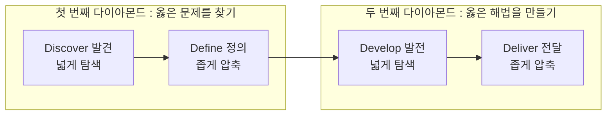
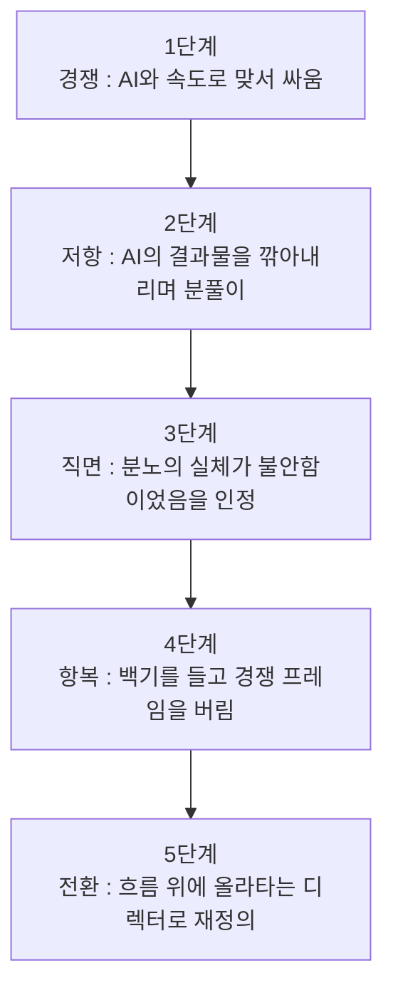

- 원문: 페퍼킴, 「프롤로그. AI 항복 선언 — 손발의 노동을 아웃소싱하고 디렉터로 진화하는 주도적인 삶」, 브런치스토리, 2026년 6월 30일 발행
- 원문 주소: https://brunch.co.kr/@helloworldsoo/14

---

## 목차

1. 이 글의 좌표 찍기 — 누가, 언제, 무엇을 썼는가
2. '더블 다이아몬드'라는 이름의 종교 — 붕괴 선언의 대상을 먼저 이해하기
3. 붕괴의 증거 — 저자가 목격한 균열의 실체
4. 분노에서 백기까지 — 한 기획자의 심리적 투쟁 기록
5. 패러다임의 전환 — 명사의 죽음과 동사의 탄생
6. 위임률이라는 숫자의 해부 — 90%, 80%, 40%가 말해주는 것
7. '디렉터'라는 새로운 좌표 — 생산성 격차라는 무기
8. 이 글이 놓인 더 큰 지도 — 시리즈의 맥락
9. 균형 잡힌 시각 — 이 선언에 걸어볼 수 있는 질문들
10. 정리하며

---

## 1. 이 글의 좌표 찍기 — 누가, 언제, 무엇을 썼는가

이 글은 브런치스토리에서 활동하는 필자 페퍼킴이 2026년 6월 30일에 발행한 프롤로그 성격의 포스팅이다. 페퍼킴은 브런치 프로필에서 스스로를 대형 금융 백본과 핵심 시스템을 설계하는 현업 UI/UX 플래너이자, AI의 금융권 이식을 치열하게 고민하는 AI 기획자로 소개하고 있다. 다시 말해 이 글을 쓴 사람은 AI를 관찰자의 입장에서 논평하는 평론가가 아니라, 실제로 금융권이라는 보수적이고 규제가 엄격한 산업 현장에서 매일 기획 업무를 수행하며 AI 도구를 실무에 접목하려 씨름하는 현직자다. 이 지점은 글의 신뢰도를 가늠할 때 중요한 배경이 된다. 이 글은 이론가의 관찰이 아니라 현장 실무자의 1인칭 체험담에 가깝다.

이 포스팅은 독립된 글이 아니라 하나의 매거진(연재물)의 서두, 즉 프롤로그다. 실제로 브런치 원문 하단에는 같은 매거진의 다음 글로 「옆자리에 연봉 2억 기획자 두 명과 일하는 법」이라는 제목의 후속 포스팅이 예고되어 있다. 이는 이 프롤로그가 앞으로 이어질 여러 편의 실전 경험담과 방법론을 위한 문제의식의 출발점, 즉 왜 이 연재를 시작하는지에 대한 선언문 역할을 하고 있다는 뜻이다. 프롤로그라는 형식적 특성상 이 글 자체는 구체적인 실행 노하우나 프롬프트 기법을 담고 있지 않다. 대신 저자가 왜 기존의 일하는 방식을 버리고 AI와 함께 일하는 방식으로 전환했는지, 그 전환의 이유와 심리적 과정, 그리고 앞으로 전개될 연재의 문제의식을 설명하는 데 집중한다.

---

## 2. '더블 다이아몬드'라는 이름의 종교 — 붕괴 선언의 대상을 먼저 이해하기

글의 도입부는 더블 다이아몬드(Double Diamond) 프로세스에 대한 비유로 시작된다. 저자는 이를 두고 오랫동안 UX 디자인 세계를 지배해 온 거대한 종교라고 표현하는데, 이 비유를 온전히 이해하려면 먼저 더블 다이아몬드가 실제로 무엇인지 짚고 넘어갈 필요가 있다.

더블 다이아몬드는 영국 디자인 카운슬(British Design Council)이 2004년에 제안한 디자인 프로세스 모델이다. 디자이너와 기획자가 문제를 해결해 나가는 방식을 두 개의 다이아몬드 형태로 시각화한 것으로, 오늘날까지도 UX 디자인, 서비스 디자인, 제품 기획 분야에서 가장 널리 쓰이는 방법론 가운데 하나로 꼽힌다. 이 모델의 핵심은 발산적 사고와 수렴적 사고가 두 차례 반복된다는 점이다. 첫 번째 다이아몬드에서는 발견(Discover) 단계를 통해 문제를 최대한 넓게 탐색하고, 정의(Define) 단계를 통해 그 탐색 결과를 하나의 핵심 문제로 좁혀나간다. 두 번째 다이아몬드에서는 발전(Develop) 단계를 통해 다양한 해결책의 가능성을 다시 넓게 펼쳐본 뒤, 전달(Deliver) 단계를 통해 그 가운데 실제로 구현하고 검증할 하나의 해법으로 수렴시킨다. 참고로 디자인 카운슬은 2019년에 이 모델을 확장한 '혁신을 위한 프레임워크(Framework for Innovation)'를 발표하며 반복성과 사람 중심성을 강조하는 방향으로 모델을 한 차례 더 발전시킨 바 있다.

아래는 이 네 단계의 구조를 도식화한 것이다.

저자가 이 프레임워크를 종교라고 부르는 이유는 단순히 이 모델이 유명해서가 아니다. 이 프로세스가 오랫동안 실무자들 사이에서 이 절차만 충실히 따르면 반드시 좋은 결과물이 나온다는 거의 신앙에 가까운 믿음의 대상이 되어 왔다는 점을 지적하기 위해서다. 실제로 이 방법론을 따르기 위해 실무 기획자들은 수십 개의 경쟁 서비스를 하나하나 역기획하고, 수천 건에 달하는 사용자 목소리(VOC)를 엑셀 시트에 옮겨 담아 밤새 카테고리별로 분류하며 페인포인트를 추려내고, 퍼소나를 정의하고 사용자 여정 지도를 그리는 데만 몇 주를 쏟아붓는 식의 방대한 수작업을 감내해야 했다. 저자는 바로 이 지난한 수공업적 노동의 총량이 곧 기획자의 실력이자 몸값으로 환산되던 시절이 있었다고 회고한다.

---

## 3. 붕괴의 증거 — 저자가 목격한 균열의 실체

프롤로그의 핵심 주장은 이 견고했던 프로세스가 지금 허망하게 붕괴하고 있다는 진단이다. 저자가 제시하는 근거는 생성형 AI의 등장으로 인한 압도적인 속도 격차다. 과거에는 며칠 밤을 새워야 겨우 완성할 수 있었던 논리의 뼈대, 즉 리서치 자료의 구조화나 정성 데이터의 분류 작업이 생성형 AI 채팅창에 명확한 맥락과 원칙을 입력하는 순간 단 몇 초 만에 쏟아져 나온다는 것이다. 인간이 밤을 새워 벼려내던 결과물을 AI가 눈 깜짝할 사이에 추월해 버리는 이 역전 현상 앞에서, 특히 아직 자신만의 전문성을 충분히 축적하지 못한 주니어 실무자들이 본능적인 공포를 느낀다고 저자는 짚는다. 그 공포의 실체는 결국 하나의 질문으로 수렴된다. 내 일자리는 어떻게 되는가, 그리고 내가 그동안 쌓아온 숙련의 가치는 어디로 사라지는가 하는 근원적인 불안이다.

---

## 4. 분노에서 백기까지 — 한 기획자의 심리적 투쟁 기록

이 글에서 가장 인간적이고 솔직한 대목은 저자 자신이 이 변화 앞에서 결코 초연하지 못했다고 고백하는 부분이다. 저자는 처음에는 감정도 없는 AI를 상대로 채팅창 너머에서 일종의 신경전을 벌였다고 털어놓는다. AI가 내놓는 높은 품질의 답변을 애써 깎아내리며 분풀이를 하기도 했다는 것이다. 그러나 저자는 그 분노의 실체를 스스로 해부해보니 결국 그것은 철저한 불안함이었다고 인정한다. 오랜 시간 쌓아온 자신의 숙련도가 기술 하나로 인해 너무도 쉽게 무력화될 수 있다는 사실을 받아들이기 어려웠기 때문이라는 것이다.

이 심리적 여정은 결국 백기 선언, 즉 항복으로 이어진다. 다만 저자는 이 항복을 패배로 규정하지 않는다. 속도와 물량의 전장에서 AI와 맞붙어 싸우려는 무모함을 버리고, 오히려 이 거대한 흐름의 위에 올라타기로 한 전략적 전환(피벗)이라고 재정의한다. 아래는 이 심리적 흐름을 단계별로 정리한 것이다.

---

## 5. 패러다임의 전환 — 명사의 죽음과 동사의 탄생

프롤로그의 이론적 핵심은 정체성을 재정의하는 문법 자체를 바꿔야 한다는 주장에 있다. 저자는 그동안 사람들이 기획자, 디자이너, 개발자와 같은 명사로 스스로를 정의해 왔다고 짚는다. 그런데 명사는 본질적으로 고정된 직무와 닫힌 시스템을 전제로 하는 개념이며, AI가 가장 먼저 파괴하는 지점이 바로 이 명사가 규정하는 경계라는 것이다. 직무의 경계 자체가 무너지는 시대에는 명사라는 직함 뒤에 안주해 있던 노동자가 가장 먼저 대체 위험에 노출된다는 논리다.

이에 대한 저자의 대안은 명사가 아니라 동사로 자신을 재정의하는 것이다. 직함이 아니라 매일 뇌를 쓰고 손발을 움직여 만들어내는 구체적인 행위들의 집합으로 스스로를 쪼개어 바라봐야 한다는 제안이다. 저자는 실제로 자신의 하루 업무를 명사가 아닌 동사 단위의 타임라인으로 낱낱이 분해해 보았고, 그렇게 하고 나서야 비로소 AI와 자신이 맺어야 할 역할 분담의 역학 관계가 선명하게 드러났다고 밝힌다. 이 부분은 다음 장에서 구체적인 수치와 함께 다룬다.

---

## 6. 위임률이라는 숫자의 해부 — 90%, 80%, 40%가 말해주는 것

저자는 자신의 업무를 세 가지 동사 단위 행위로 쪼개고, 각각에 대해 AI에게 얼마나 위임하는지를 구체적인 비율로 제시한다. 이 수치는 어떤 공인된 통계나 외부 조사 결과가 아니라 저자 본인이 실무 경험을 통해 체감한 자기 기록임을 먼저 밝혀둘 필요가 있다. 그럼에도 이 수치가 흥미로운 이유는 위임의 비율이 균일하지 않고, 업무의 성격에 따라 뚜렷한 단계적 차이를 보인다는 점이다.

첫 번째는 시장 조사 및 경쟁사 UI 벤치마킹으로, 여기서는 위임률을 90퍼센트로 제시한다. 인간은 어떤 관점으로 조사할지와 어떤 가설을 세울지만 정하고, 실제 데이터 수집과 1차 분석은 AI에게 맡긴다는 것이다. 두 번째는 VOC, 즉 사용자 목소리에 대한 정성 분석과 페인포인트 추출로, 위임률은 80퍼센트다. 방대한 텍스트를 카테고리별로 분류하는 작업은 AI가 담당하고, 인간은 그 분류 결과가 실제로 어떤 맥락적 의미를 갖는지 해석하는 역할을 맡는다. 세 번째는 전략 방향성 도출 및 임팩트 매트릭스 정의로, 이 영역만은 협업률이라는 다른 용어를 써서 40퍼센트로 낮춘다. AI가 제안하는 여러 대안들을 실제 비즈니스 환경의 제약 조건과 결합해 최종 의사결정을 내리는 것은 여전히 인간의 몫으로 남겨둔다는 뜻이다.

아래 표는 이 세 영역의 위임 비율과 그 안에서 인간과 AI가 각각 맡는 역할을 정리한 것이다.

| 업무 영역 | AI 위임(협업)률 | 인간의 역할 | AI의 역할 |
|---|---|---|---|
| 시장 조사 · 경쟁사 UI 벤치마킹 | 90% | 관점과 가설 설정 | 데이터 수집, 1차 분석 |
| VOC 정성 분석 · 페인포인트 추출 | 80% | 맥락적 의미 해석 | 텍스트 카테고리화 |
| 전략 방향성 도출 · 임팩트 매트릭스 정의 | 40% | 비즈니스 현실 결합, 최종 의사결정 | 대안 제시 |

이 세 수치를 나란히 놓고 보면 하나의 원칙이 드러난다. 정보를 모으고 분류하는 수공업적 실행 작업일수록 AI에게 거의 전권을 위임하고, 반대로 최종적인 판단과 책임이 걸린 의사결결정에 가까워질수록 인간이 관여하는 비중이 급격히 늘어난다는 것이다. 저자는 이 지점에서 하나의 결론을 내린다. 수공업적인 실행의 영역은 이제 온전히 AI의 몫이며, 이는 기획자가 게으르거나 요령을 피우려는 것이 아니라 한정된 인간의 에너지를 반복 작업에 낭비하지 않겠다는 지극히 전략적인 선택이라는 것이다.

---

## 7. '디렉터'라는 새로운 좌표 — 생산성 격차라는 무기

저자는 이렇게 확보한 시간과 에너지를 단순히 여유를 즐기는 데 쓰자는 이야기를 하지 않는다. 오히려 저자는 이 생산성의 격차를 매우 현실적이고 다소 방어적인 무기로 규정한다. 직장 생활에서 흔히 마주치는 불합리한 무한 루프나 상사의 비이성적인 요구로부터 자신의 영혼과 시간을 지켜낼 수 있는 유일한 방법은 역설적으로 압도적인 생산성의 격차를 만들어내는 것이라는 주장이다. 기계적인 반복 노동을 AI에게 통째로 아웃소싱함으로써 확보한 그 귀한 시간을, 더 큰 본질적인 문제를 고민하는 데 쓰자는 것이 이 글이 제시하는 실천적 지향점이다.

이 지향점 위에서 저자가 제안하는 새로운 정체성이 바로 디렉터다. 여기서 디렉터는 AI라는 강력한 조력자를 거느리고, 실행이 아니라 방향을 설계하는 사람을 의미한다. 저자는 이 변화가 여전히 초입 단계에 불과하며, 앞으로 오랜 세월 AI는 공기처럼 일상 곁에 존재하게 될 것이라 내다본다. 그리고 자신이 앞으로 써 내려갈 연재는 단순한 프롬프트 사용법 안내서가 아니라, 기술의 거대한 붕괴 속에서 도망치지 않고 대체 불가능한 자신만의 영토를 어떻게 쌓아올릴 것인가에 대한 현실적인 생존 기록이 될 것이라 선언하며 프롤로그를 마무리한다.

---

## 8. 이 글이 놓인 더 큰 지도 — 시리즈의 맥락

이 프롤로그는 페퍼킴이라는 필자의 브런치 계정에 게재된 아홉 편의 글 가운데 하나이며, 하나의 매거진 연재의 서두에 해당한다. 브런치 원문 페이지 하단에는 같은 매거진의 다음 글로 「옆자리에 연봉 2억 기획자 두 명과 일하는 법」이라는 제목이 링크되어 있다. 제목만 놓고 보면 이는 AI를 활용해 소수의 인원으로 고연봉 기획자 여러 명 몫의 성과를 내는 실전 사례를 다루는 후속편으로 추정되며, 이 프롤로그에서 선언한 디렉터로의 전환이라는 문제의식이 실제 업무 현장에서 어떻게 구현되는지를 다룰 것으로 보인다. 다만 이는 제목에서 합리적으로 유추할 수 있는 방향성일 뿐, 후속편의 구체적인 내용까지 이 프롤로그 안에서 확인되는 것은 아니라는 점은 분명히 해둘 필요가 있다.

---

## 9. 균형 잡힌 시각 — 이 선언에 걸어볼 수 있는 질문들

이 글은 한 실무자의 진솔한 체험과 통찰을 담고 있지만, 몇 가지 지점에서는 비판적으로 짚어볼 여지도 있다.

첫째, 더블 다이아몬드 프로세스 자체가 완전히 붕괴했다고 보기는 아직 이르다. 여러 UX·서비스 디자인 실무 자료들을 살펴보면 이 프레임워크는 2026년 현재에도 여전히 업계에서 공통 언어이자 기본 구조로 폭넓게 활용되고 있으며, 디자인 카운슬 역시 2019년의 개정을 통해 이 모델을 계속 진화시켜 왔다. 따라서 저자가 말하는 붕괴는 프로세스라는 틀 자체가 사라진다는 의미라기보다, 그 틀 안에서 인간이 직접 수행하던 수작업의 비중이 AI로 빠르게 이전되고 있다는 의미로 읽는 것이 더 정확할 것이다.

둘째, 90퍼센트, 80퍼센트, 40퍼센트라는 위임률 수치는 저자 개인의 주관적 체감을 정리한 것이며, 표준화된 측정 방법이나 외부 검증을 거친 통계는 아니다. 조직의 성격, 산업 도메인, 개인의 숙련도에 따라 이 비율은 크게 달라질 수 있다. 특히 저자가 몸담고 있는 금융권은 규제와 보안이 엄격한 산업이라는 특수성이 있어, 이 수치를 다른 산업이나 다른 직무에 그대로 일반화하기는 어렵다.

셋째, 명사에서 동사로 자신을 재정의하자는 제안은 매력적인 은유이지만, 실제로 이 재정의가 조직 내에서의 평가 체계, 채용 기준, 연봉 협상 같은 구조적인 문제까지 해결해주는 것은 아니다. 개인이 스스로의 정체성을 동사로 재구성하더라도, 그 조직이 여전히 명사 중심의 직무 기술서와 평가 체계를 유지하고 있다면 이 전환은 개인의 마인드셋 차원에 머무를 위험이 있다. 이 지점은 아마도 후속 연재에서 더 구체적으로 다뤄질 것으로 보인다.

---

## 10. 정리하며

결국 이 프롤로그가 전하고자 하는 메시지는 하나의 문장으로 요약할 수 있다. AI와 속도로 경쟁하는 것을 포기하고, 대신 AI를 손발로 부리는 디렉터의 자리로 스스로를 이동시키라는 것이다. 저자는 이 전환을 패배가 아니라 게임의 룰을 먼저 이해한 자의 영리한 피벗이라 부른다. 더블 다이아몬드라는 오래된 신앙, 수공업적 노동으로 몸값을 증명하던 시절, 그리고 그 붕괴 앞에서 느낀 개인적인 불안과 분노까지 솔직하게 드러낸 뒤, 저자는 명사가 아닌 동사로 스스로를 재정의하고 실행의 영역을 통째로 AI에게 위임함으로써 확보한 시간을 더 본질적인 문제에 쓰자는 실천적 결론에 도달한다. 이 프롤로그는 앞으로 이어질 연재의 문제의식을 예고하는 선언문이며, 구체적인 실행 방법과 사례는 이후 편들에서 다뤄질 것으로 예상된다.

---

### 참고 자료
- 페퍼킴, 「프롤로그. AI 항복 선언」, 브런치스토리, 2026.6.30 — https://brunch.co.kr/@helloworldsoo/14
- 페퍼킴 작가 프로필, 브런치스토리 — https://brunch.co.kr/@helloworldsoo
- 더블 다이아몬드 프로세스 개요 — 디자인베이스, 웹액추얼리(Webactually), 템킷 칼럼 등 국내 UX/서비스디자인 자료 종합
