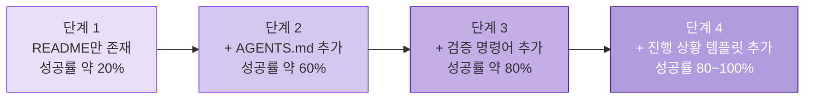
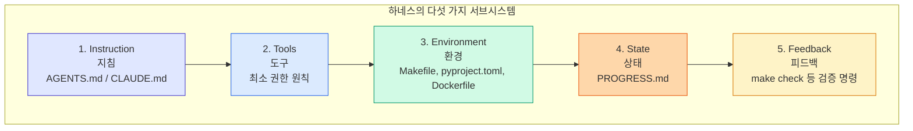
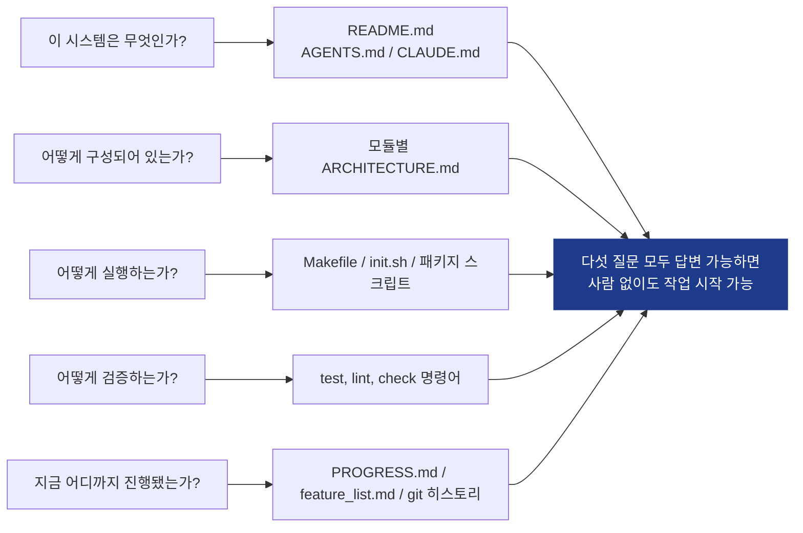
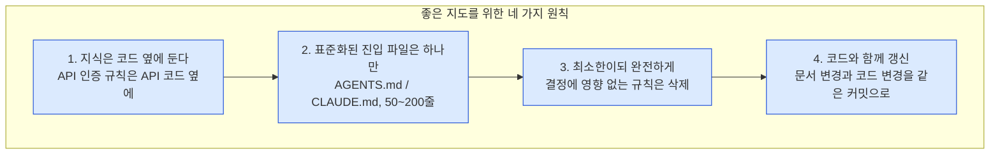
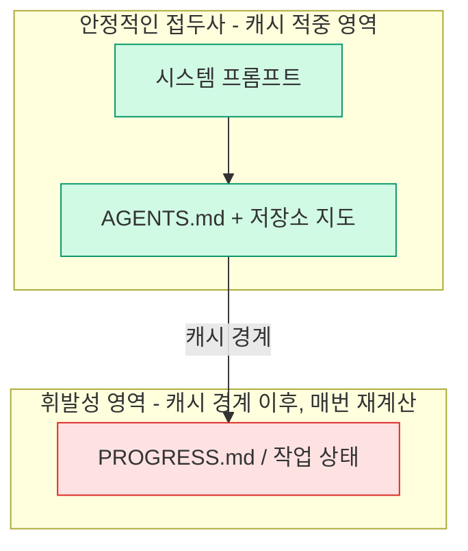
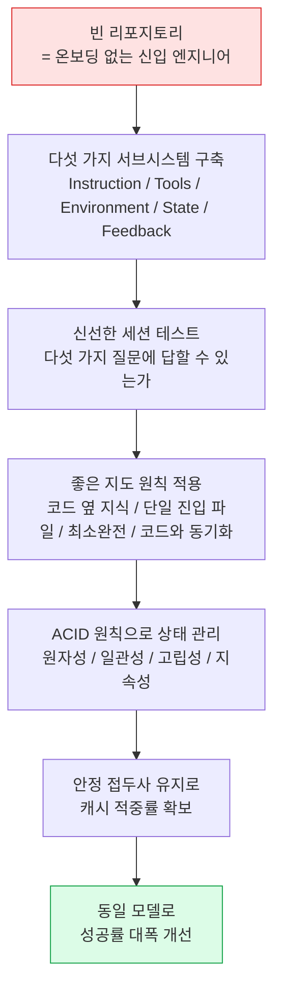

- 원문: Nick T. (Ph.D.), "Harness Engineering: A deep dive into the buildable harness, via Markdown files", Medium(ai-advances), 2026-06-18
- 원문 링크: https://medium.com/ai-advances/harness-engieering-a-deep-dive-into-the-buildable-harness-via-markdown-files-6aafd8b63669

## 관련글

[**하네스 엔지니어링 개념편 심층 해설: 왜 당신의 AI 에이전트는 계속 실패하는가**](https://k82022603.github.io/posts/%ED%95%98%EB%84%A4%EC%8A%A4-%EC%97%94%EC%A7%80%EB%8B%88%EC%96%B4%EB%A7%81-%EA%B0%9C%EB%85%90%ED%8E%B8-%EC%8B%AC%EC%B8%B5-%ED%95%B4%EC%84%A4-%EC%99%9C-%EB%8B%B9%EC%8B%A0%EC%9D%98-ai-%EC%97%90%EC%9D%B4%EC%A0%84%ED%8A%B8%EB%8A%94-%EA%B3%84%EC%86%8D-%EC%8B%A4%ED%8C%A8%ED%95%98%EB%8A%94%EA%B0%80/)

---

## 이 글의 목적과 읽는 법

이 문서는 위 원문 아티클(전체 시리즈 중 Part 1)의 내용을 한국어로 상세하게 풀어 정리한 것입니다. 원문은 두 부분으로 구성된 연재물의 첫 번째 편으로, "에이전트 = 모델 + 하네스(Harness)"라는 저자의 전작 논지를 이어받아, 그 하네스를 실제로 어떻게 저장소(repository) 안에 마크다운 파일만으로 구현할 수 있는지를 다룹니다. 코드 레벨의 오케스트레이션이나 프레임워크 포크 없이, 순수하게 리포지토리 구조와 문서 배치만으로 에이전트의 작업 성공률을 끌어올리는 방법론이 핵심입니다.

원문에 등장하는 수치(성공률 20%→100%, 인간 개입률 70% 등)는 저자 개인이 자신의 프로젝트에서 관찰했다고 밝힌 경험적 관찰치이며, 공인된 벤치마크나 제3자 검증 데이터는 아닙니다. 이 문서에서는 이러한 수치를 "저자가 보고한 관찰 결과"로 명확히 구분하여 서술하며, 별도로 검증 가능한 사실(예: Anthropic과 OpenAI의 공식 입장, 프롬프트 캐싱의 실제 작동 방식)은 최신 자료를 검색하여 교차 확인한 뒤 반영했습니다.

---

## 1. 출발점: "에이전트 = 모델 + 하네스"라는 재프레이밍

저자는 전작에서 하나의 명제를 던졌습니다. 에이전트의 성능은 모델의 지능만으로 결정되지 않으며, 일정 수준을 넘어서면 모델을 둘러싼 모든 것 — 즉 하네스 — 이 실제 병목이 된다는 것입니다. 전작이 개념적인 층위(왜 유능한 에이전트도 궤도를 이탈하는가, 계층적 아키텍처는 무엇인가)에 머물렀다면, 이번 Part 1은 그 개념을 실제로 "빌드"하는 방법에 집중합니다.

저자가 강조하는 이 시리즈의 전제는 다음과 같습니다.

- 여기서 다루는 모든 기법은 순수한 마크다운 파일로 리포지토리에 커밋되는 것들이다.
- 코딩 에이전트 프레임워크를 포크하거나, 코드 레벨에서 오케스트레이션을 직접 짜거나, Claude나 Codex 내부 동작을 건드리는 방식은 다루지 않는다.
- 목표는 "하네스가 반드시 고난도 엔지니어링일 필요는 없다"는 것을 증명하는 데 있으며, 오늘 당장 리포지토리에 파일 몇 개를 추가하는 것만으로도 체감 가능한 차이를 만들 수 있다는 점을 보여주려 한다.

이번 Part 1은 "에이전트가 실제로 읽을 수 있는 저장소를 어떻게 만드는가"라는 절반의 문제를 다루고, 세션이 시작된 이후 에이전트를 계속 정직하게 유지하는 방법(작업 검증, 세션 간 지속성 등)은 다음 편인 Part 2에서 다룬다고 예고합니다.

---

## 2. 저자의 도그푸딩 경험

저자는 Python으로 Claude Code의 단순화된 버전을 직접 재구현하는 과정에서, 장기 실행형(long-running)이면서 신뢰할 수 있는 에이전트 애플리케이션을 만드는 방법을 조사했다고 밝힙니다. 그리고 그 결과로 얻은 개념들을 자신이 만들고 있는 도구 자체에 적용하는 이른바 "도그푸딩(자체 제품을 스스로 사용해 검증하는 방식)"을 수행했습니다.

저자가 공유한 관찰 결과는 다음과 같은 4단계 실험으로 요약됩니다. 이는 약 2만 라인 규모의 TypeScript + React 애플리케이션을, 모델은 전혀 바꾸지 않고(Claude Code 상의 특정 모델을 고정) 오직 하네스만 단계적으로 보강하며 성공률 변화를 관찰한 내용입니다.



단계별 관찰 내용을 조금 더 구체적으로 풀면 다음과 같습니다.

- **단계 1 (README만 존재, 약 20%)**: 이 단계에서는 패키지 매니저를 잘못 선택하거나(npm과 yarn 혼동 등), 프로젝트의 네이밍 컨벤션을 어기거나, 테스트를 아예 실행하지 못하는 실패가 반복되었습니다.
- **단계 2 (AGENTS.md 추가, 약 60%)**: 기술 스택 버전 정보, 네이밍 컨벤션, 핵심 아키텍처 결정 사항을 명시적으로 기록하자 실패율이 크게 줄었습니다.
- **단계 3 (검증 명령어 추가, 약 80%)**: `yarn test`, `yarn lint`, `yarn build` 같은 구체적인 검증 명령어를 문서에 나열하자, 에이전트가 스스로 자신의 작업을 점검할 수 있게 되었습니다.
- **단계 4 (진행 상황 템플릿 추가, 80~100%)**: 매 실행마다 완료/미완료 작업을 기록하는 진행 상황 파일을 추가하자 성공률이 안정적으로 최고 수준에 도달했습니다.

저자가 이 실험에서 강조하는 결론은, 모델을 더 좋은 것으로 교체한 적이 없다는 점입니다. 바뀐 것은 오직 하네스뿐이었습니다.

---

## 3. 하네스를 구성하는 다섯 가지 서브시스템


저자는 여러 프로젝트를 거치며 하네스를 다섯 개의 상호 연결된 서브시스템으로 정리했다고 설명합니다. 이 중 하나라도 빠지면 에이전트는 마치 계기판이나 브레이크가 없는 자동차처럼 다루기 어색해진다는 비유를 사용합니다.



각 서브시스템의 역할은 다음과 같이 설명됩니다.

**Instruction(지침)**: 프로젝트 개요, 기술 스택과 버전, 처음 실행해야 할 명령어, 그리고 절대 어겨서는 안 되는 몇 가지 핵심 규칙을 담은 하나의 랜딩 페이지입니다. AGENTS.md나 CLAUDE.md가 이 역할을 맡습니다.

**Tools(도구)**: 실제로 작업을 완수할 수 있을 만큼의 접근 권한을 의미합니다. 저자는 "안전을 위해" 셸 접근을 차단해 에이전트가 `pip install`조차 실행하지 못하게 만드는 것을, 엔지니어를 채용해 놓고 키보드를 압수하는 것에 비유합니다. 원칙은 무권한(no privilege)이 아니라 최소 권한(least privilege)이어야 한다는 것입니다.

**Environment(환경)**: 스스로를 설명하는 환경 설정을 의미합니다. 의존성 버전이 고정되어 있고, 런타임 버전이 명시되어 있으며, 재현 가능한 컨테이너가 준비되어 있어야 합니다. 환경이 깨져 있으면 에이전트는 본래 해야 할 작업이 아니라 엉뚱한 문제와 씨름하는 데 주의력을 소진하게 됩니다.

**State(상태)**: 무엇이 완료되었고, 무엇이 진행 중이며, 무엇이 막혀 있는지를 기록하는 장소입니다. 이를 통해 작업 내용이 세션을 넘어 지속될 수 있습니다.

**Feedback(피드백)**: 에이전트의 작업이 실제로 올바른지 알려주는 명시적인 명령어입니다. 저자는 이 다섯 가지 중 단 하나만 리포지토리에 추가할 수 있다면 언제나 피드백을 선택하겠다고 말합니다. 투입 대비 효과가 가장 크기 때문이며, 이것이 있어야 에이전트가 "다 됐다고 짐작하는 상태"와 "실제로 확인하고 아는 상태"의 차이를 만들어낼 수 있다는 것입니다.

### 3-1. 업계의 수렴: OpenAI와 Anthropic의 시각

저자는 이 다섯 가지 서브시스템 모델이 단순히 개인적 취향이 아니라는 근거로, 두 주요 AI 연구소의 입장을 인용합니다.

- OpenAI는 엔지니어의 핵심 업무를 환경 설계, 의도 표현, 피드백 루프 구축이라는 세 가지로 압축해 설명한다고 알려져 있습니다.
- Anthropic은 자사의 Claude Agent SDK를 공식적으로 "범용 에이전트 하네스(general-purpose agent harness)"라고 명명하고 있습니다.

실제로 Anthropic 엔지니어링 블로그의 "장기 실행 에이전트를 위한 효과적인 하네스(Effective harnesses for long-running agents)" 자료를 확인해 보면, Claude Agent SDK를 코딩을 포함해 도구를 사용해 맥락을 수집하고 계획하고 실행하는 다양한 작업에 적합한 범용 에이전트 하네스로 소개하고 있으며, 컨텍스트 압축(compaction) 같은 컨텍스트 관리 기능을 통해 이론적으로는 에이전트가 임의로 긴 시간 동안 유용한 작업을 계속할 수 있어야 한다고 설명합니다. 다만 압축 기능만으로는 충분하지 않으며, 고수준 프롬프트 하나만 주어졌을 때 프런티어 모델조차 프로덕션 수준의 결과물을 만들지 못하는 실패 양상(한 번에 너무 많은 것을 시도하려는 경향 등)이 관찰되었다고 밝히고 있습니다. 이는 저자가 강조하는 "모델이 아니라 하네스가 병목"이라는 주장과 방향이 일치합니다.

Instruction, Tools, Environment, State, Feedback이라는 다섯 가지 서브시스템 구분과, 새로 투입된 엔지니어가 아무 문서도 없는 프로젝트에 던져지는 상황에 대한 비유는, 하네스 엔지니어링을 다루는 다른 교육 자료에서도 유사한 형태로 등장하는 것으로 확인되어, 이 프레임이 특정 개인의 독창적 주장이라기보다는 현재 실무자들 사이에서 공유되고 있는 개념 체계에 가깝다고 볼 수 있습니다.

**참고**: 이 프레임에서 말하는 "피드백 루프"는 강화학습에서의 보상 신호와는 다른 개념입니다. 여기서는 사람이 미리 정의해 둔 테스트, 린트, 타입 체크 같은 결정론적 검증 명령을 에이전트가 스스로 실행해 자신의 작업 결과를 확인하는 것을 의미합니다.

---

## 4. "저장소가 곧 명세다"라는 핵심 주장

저자가 이 글 전체를 한 문장으로 압축한다면 다음과 같다고 말합니다.

> 리포지토리에 없다면, 그것은 에이전트에게 존재하지 않는 것이다.

체계가 없는 리포지토리에 놓인 AI 에이전트는, 온보딩을 전혀 받지 못한 채 투입된 신입 엔지니어와 같습니다. 자신의 방향을 찾는 데만 에너지를 소진하게 됩니다. 반면 명확한 지도 — 진입점 라우터, 코드 옆에 배치된 문서, 정확한 검증 명령어 — 가 주어지면, 동일한 모델이 20%대의 성공률에서 거의 완벽에 가까운 수준으로 도약한다는 것이 저자의 관찰입니다.

여기서 저자가 던지는 메시지는 명확합니다. 더 나은 모델을 쫓거나 프롬프트를 과도하게 최적화하기보다, 작업 환경(workspace) 자체를 고치라는 것입니다.

### 4-1. 리포지토리 바깥에 숨어 있는 지식의 문제

실제 프로젝트의 지식 중 상당 부분은 리포지토리 바깥에 존재합니다. Slack 대화 스레드, 두 분기 전에 업데이트가 멈춘 Confluence 페이지, 여기저기 흩어진 코드 주석, 그리고 무엇보다 두세 명의 시니어 엔지니어의 머릿속에 있는 암묵지가 대표적입니다. 이런 정보들은 모두 에이전트 입장에서는 보이지 않는 것이며, 정보가 빠져 있을 때마다 에이전트는 추측을 강요받게 됩니다.

저자가 지적하는 함정은, 에이전트가 자신이 무엇을 모르는지조차 알 방법이 없다는 점입니다. "이 길은 폐쇄되었다"는 정보가 오직 특정 팀원의 머릿속에만 있다는 사실을 에이전트는 감지할 수 없습니다. 그래서 자신이 이해한 바에 따라 자신 있게 행동하다가 그대로 함정에 빠지게 됩니다. 저자는 자신이 접한 한 사례에서 에이전트 작업의 70%가 사람의 구조를 필요로 했고, 거의 모든 실패가 모두가 알고 있지만 아무도 문서화하지 않은 암묵적 규칙을 에이전트가 위반한 데서 비롯되었다고 언급합니다. (이 70%라는 수치 역시 저자가 언급한 사례에서 나온 관찰치로, 공식 통계는 아닙니다.)

### 4-2. 신선한 세션 테스트(Fresh-Session Test)


저자가 모든 프로젝트에 실제로 적용한다는 검증 방법은 매우 단순합니다. 완전히 새로운 에이전트 세션을 열고, 오직 리포지토리만 제공한 뒤 다음 다섯 가지 질문에 답할 수 있는지 확인하는 것입니다.



다섯 번째 질문("지금 어디까지 진행됐는가")에 관한 구체적인 실천 방법은 이 시리즈의 Part 2에서 다룬다고 저자는 안내합니다.

만약 에이전트가 다섯 가지 질문 중 하나라도 파일만으로 답하지 못한다면, 그것은 지도 위의 빈 공간을 의미합니다. 지도가 비어 있는 곳에서 에이전트는 추측하고, 잘못된 추측은 버그가 되며, 과도한 추측은 에이전트가 가진 한정된 주의력(attention)을 소모시킵니다. 더 잔인한 것은, 새 세션이 열릴 때마다 동일한 추측을 처음부터 다시 반복해야 한다는 점입니다. 저자는 지도를 제대로 한 번 그려두는 비용이, 매번 추측하는 비용보다 언제나 더 저렴하다고 강조합니다.

정보가 더 깊이 숨어 있을수록 탐색 비용(discovery cost)이 커지고, 실제 작업에 쓸 수 있는 컨텍스트 예산이 줄어들며, 그 결과 결과물의 품질이 낮아진다는 것이 저자가 제시하는 인과 구조입니다.

---

## 5. 좋은 지도를 그리는 네 가지 원칙

신선한 세션 테스트를 통과하는 것은 단순히 문서를 많이 쓰는 문제가 아니라, 올바른 문서를 올바른 위치에 쓰는 문제라고 저자는 말합니다. 이를 위해 두 가지 핵심 개념과 네 가지 원칙을 제시합니다.

### 5-1. 두 가지 핵심 개념

- **탐색 비용(Discovery Cost)**: 에이전트가 핵심 정보 하나를 찾기 위해 소비하는 주의력 예산의 몫입니다. 어떤 정보가 디렉토리 열 단계 아래 묻혀 있다면, 에이전트는 매 세션마다 그 비용을 컨텍스트로 지불하게 됩니다. 정보를 가장 먼저 눈에 띄는 곳에 배치하면 이 비용은 크게 줄어듭니다.
- **지식 부패율(Knowledge Decay)**: 시간이 지남에 따라 문서 중 낡아버리는 비율을 뜻합니다. 저자는 이것을 "조용한 살인자"라고 표현하며, 뒤늦게 깨달은 교훈이라고 언급합니다.

### 5-2. 네 가지 원칙



**원칙 1. 지식은 코드 옆에 산다.** API 인증에 관한 규칙은 4천 줄짜리 전역 문서 어딘가에 묻혀 있는 것이 아니라, 실제 API 코드 바로 옆에 있어야 합니다. 그렇게 하면 디렉토리 구조 자체가 색인 역할을 하게 되어, 에이전트가 코드에 도달하는 순간 관련 제약 조건에도 자연스럽게 도달하게 되고, 별도로 검색할 필요가 없어집니다.

**원칙 2. 표준화된 진입 파일은 단 하나.** AGENTS.md나 CLAUDE.md는 백과사전이 아니라 랜딩 페이지여야 합니다. 저자는 50~100줄이면 충분하고, 200줄을 넘기지 말라고 권고합니다. 이 파일의 유일한 역할은 "이것은 무엇인가", "어떻게 실행하는가", "어떻게 검증하는가"라는 질문에 답하고, 나머지는 다른 곳을 가리켜 주는 것입니다.

**원칙 3. 최소한이되 완전하게.** 어떤 규칙을 제거해도 에이전트의 판단이 전혀 바뀌지 않는다면, 그 규칙은 애초에 존재할 이유가 없습니다. 반대로 신선한 세션 테스트의 다섯 질문에는 반드시 답이 있어야 합니다. 이 균형은 계속 조정해 나가야 하는 것이며, 타입 정의나 인터페이스 주석, 설정 설명을 지침 파일 안에 중복으로 넣지 말라고 저자는 조언합니다.

**원칙 4. 코드와 함께 업데이트한다.** 문서 변경을 코드 변경과 동일한 커밋에 묶어야 합니다. 그렇지 않으면 저자가 말하는 "느린 독"이 시작됩니다.

### 5-3. 구체적인 리포지토리 레이아웃 예시

저자가 제시하는 실무 지향적인 리포지토리 구조는 다음과 같은 형태입니다.

```
project/
├── AGENTS.md              # 개요 + 지도 역할
├── src/module_A/
│   ├── api/ARCHITECTURE.md
│   └── db/CONSTRAINTS.md   # 반드시 지켜야 할 것 / 하지 말아야 할 것
├── PROGRESS.md             # 4단계 상태 관리
└── Makefile
```

핵심은, 각 모듈 디렉토리 안에 그 모듈에 국한된 아키텍처 설명과 제약 조건을 배치하고, 최상위에는 전체를 조망하고 안내하는 AGENTS.md 한 장만 두는 구조입니다.

### 5-4. 에이전트 상태를 데이터베이스 트랜잭션처럼 다루기 (ACID)

저자가 별도로 강조하는 원칙 하나는, 에이전트의 상태 관리를 데이터베이스 트랜잭션의 ACID 원칙에 빗대어 운영하는 것입니다.

- **원자성(Atomicity)**: 하나의 논리적 변경은 하나의 커밋으로 묶습니다. 작업이 중간에 깨지면 `git stash`로 되돌리고, 절반만 완료된 상태를 남기지 않습니다.
- **일관성(Consistency)**: 모든 작업 이후에 검증을 실행하며, 깨진 중간 상태를 절대 커밋하지 않습니다.
- **고립성(Isolation)**: 동시에 작업하는 여러 에이전트는 서로 다른 브랜치나 별도의 진행 상황 파일을 사용해 서로를 방해하지 않도록 합니다. 저자는 기능별 개발 시 `git worktree`를 활용해 각 기능을 독립적으로 개발하고, 충분히 테스트를 마친 뒤에만 작업 브랜치나 메인 브랜치로 병합할 것을 제안합니다.
- **지속성(Durability)**: 세션을 넘어 반드시 살아남아야 하는 정보는 반드시 git으로 추적되는 파일에 기록해야 합니다. 채팅 히스토리에 남아 있는 내용은 지속성이 없다고 간주하며, 오직 파일로 기록된 것만 유효하다고 봅니다. 계획, 할 일 목록, 사고 과정 등을 로컬 마크다운 파일로 내보내도록 에이전트에게 지시하라는 것이 저자의 조언입니다.

저자는 문서가 최신 상태가 아닌 것이, 아예 문서가 없는 것보다 더 나쁘다고 강조합니다. 문서가 없으면 에이전트는 최소한 질문이라도 하지만, 문서가 낡아 있으면 에이전트는 자신 있게 잘못된 방향으로 걸어가기 때문입니다.

---

## 6. 하나의 거대한 지침 파일이 실패하는 이유

저자는 처음에 "모든 것을 하나의 단일 진실 소스(single source of truth)에 담자"는 접근을 시도했다가 실패한 경험을 공유합니다. 배포 런북, 예외 상황 히스토리, 떠오르는 모든 규칙을 AGENTS.md 하나에 밀어 넣었더니 파일이 천 줄을 넘어섰고, 오히려 에이전트의 성능이 나빠졌다는 것입니다.

저자가 지목하는 근본 원인은, AGENTS.md나 CLAUDE.md를 백과사전처럼 다루는 것이 아니라 라우터(router)로 다루어야 한다는 점을 놓친 데 있습니다. 이 실패가 발생하는 이유를 세 가지로 나누어 설명합니다.

**신호 대 잡음비(Signal-to-Noise)의 붕괴.** 한 줄짜리 버그 수정을 하는 상황에서도 에이전트가 배포 관련 잡다한 내용 50줄을 함께 읽어야 한다면, 정작 필요한 지침이 잡음 속에 묻혀버립니다. 저자는 낮은 신호 대 잡음비가 정보 누락만큼이나 치명적이라고 지적합니다.

**중간에 묻히는 효과("lost in the middle").** 언어 모델은 긴 문서에서 시작과 끝 부분에 가장 많은 주의를 기울이고, 중간 부분은 건너뛰는 경향이 있다고 알려져 있습니다. 절대 어겨서는 안 되는 제약 조건이 문서의 40번째 문단쯤에 묻혀 있다면, 사실상 존재하지 않는 것과 마찬가지가 됩니다. 따라서 정말로 중요한 규칙이라면 문서의 맨 처음이나 맨 끝에 배치해야 하며, 절대로 중간에 두어서는 안 됩니다.

**중요도를 구분하지 못하는 문제.** 반드시 지켜야 할 강한 제약과 참고만 하면 되는 부드러운 제안이 같은 형식, 같은 위치에 뒤섞여 있으면, 에이전트는 "반드시 하지 말아야 할 것"과 "고려해 볼 만한 것"을 구분하지 못하게 됩니다.

이에 대한 해법으로 저자는 AGENTS.md와 CLAUDE.md를 매뉴얼이 아니라 라우터로 취급하라고 제안합니다. 이는 좋은 UI 설계에서 말하는 "필요할 때만 드러낸다(reveal on demand)"는 원칙과 동일합니다. 개요는 앞쪽에 배치하고, 세부 사항은 한 번의 클릭 거리 안에 두어 필요할 때만 읽도록 구성하는 것입니다.

실무적으로는, AGENTS.md를 50~200줄 이내로 유지하고, 도메인에 특화된 세부 내용은 한 줄짜리 링크 뒤로 밀어내는 방식을 권장합니다. 예를 들어 다음과 같은 형태입니다.

```
# AGENTS.md 예시 구조

## 실행 방법
- make setup && make test 순서로 실행

## 반드시 지켜야 할 제약 (협상 불가)
- DB 접근 시 항상 파라미터화된 쿼리를 사용할 것
- 컴포넌트 파일명은 PascalCase로 통일할 것

## 필요할 때 참조 (온디맨드)
- API 요청/응답 패턴       → docs/api-patterns.md
- 데이터베이스 규칙과 마이그레이션 → docs/database-rules.md
- 인증 및 세션 모델         → src/auth/ARCHITECTURE.md
```

저자는 여기서 한 가지를 더 덧붙입니다. 바로 "지침 부채(instruction debt)"를 기술 부채처럼 다루라는 것입니다. 새로 추가하는 규칙마다 그 규칙이 왜 존재하는지, 그리고 언제 삭제해도 되는지를 함께 기록해야 하며, 만료 조건이 없는 규칙은 영구적인 잡음이 되어버린다고 경고합니다. 타입 정의나 설정 설명을 문서에 중복으로 넣지 말고, 에이전트가 원본 소스 코드에서 직접 읽도록 두라는 조언도 동일한 맥락입니다.

궁극적으로 저자가 추구하는 목표는 "가장 많은 컨텍스트"가 아니라 "신선한 세션의 모든 질문에 답할 수 있는 가장 적은 컨텍스트"입니다. 불변식(invariant)은 강제하되, 구현 방법까지 세세하게 지시하지 말고 에이전트가 스스로 찾아내도록 하라는 것이 원칙입니다.

---

## 7. 실용적인 곁다리 이야기: 지도는 비용도 절감한다

저자는 이 섹션이 하네스 관련 필드 노트에서 나온 것이 아니라, 대형 모델의 과금과 캐싱에 관한 일반적인 실무 지식에서 가져온 내용임을 스스로 명시하고 있습니다.

### 7-1. 프롬프트 캐싱의 기본 원리

대형 언어 모델은 대화의 안정적인 접두사(prefix) — 시스템 프롬프트, 프로젝트 지도, 초반에 읽은 파일들 — 를 매번 다시 계산하는 대신 캐시에서 불러와 재사용합니다. 동일한 정경 파일을 읽는 새로운 세션은 이 이미 데워진(warm) 접두사를 그대로 재사용하게 되고, 그 효과는 두 가지 방향으로 나타납니다. 매 턴마다 지연 시간이 줄어들고, 비용도 함께 줄어듭니다.

이와 관련해 실제로 확인 가능한 최신 정보를 검색해 보면, Claude Code 팀의 엔지니어인 Thariq Shihipar가 프롬프트 캐싱을 "제품 전체가 설계된 아키텍처적 제약 조건"이라고 표현했다는 내용이 확인됩니다. Anthropic 엔지니어링 팀 역시 Claude Code를 설계할 때 프롬프트 캐싱이 매우 높은 적중률로 작동해야 하며, 그렇지 않으면 장기 실행형 에이전트 워크플로우가 경제적으로도 운영적으로도 성립하지 않는다는 점을 핵심 아키텍처 제약으로 삼았다고 밝히고 있습니다. 이는 원문 저자가 말하는 "캐시 적중이 곧 성능이자 비용"이라는 주장과 방향이 일치하는 실제 사례입니다.



### 7-2. 캐시를 깨뜨리는 습관

저자가 지적하는 함정은, 캐시가 그 접두사가 변경되지 않는다는 전제하에 키(key)로 작동한다는 점입니다. 시스템 프롬프트, 진입 파일, 심지어 파일을 읽는 순서까지 초반부의 어떤 것이든 편집하는 순간 그 이후의 모든 캐시가 무효화되고, 전체를 다시 계산하는 비용을 그대로 지불하게 됩니다.

이와 관련해 확인한 최신 실무 정보에 따르면, Claude Code의 실제 설계에서도 이러한 원칙이 그대로 적용되고 있습니다. 정적인 내용을 앞에, 동적인 내용을 뒤에 배치하는 구조를 취하고 있으며, 날짜가 바뀌거나 파일이 수정되는 등 정보가 낡았을 때는 시스템 프롬프트 자체를 갱신하는 대신, 다음 사용자 메시지에 별도의 시스템 리마인더 태그로 최신 정보를 삽입하는 방식을 사용해 캐시를 깨뜨리지 않으려 한다고 합니다. 이는 저자가 이 글에서 제안하는 "안정적인 지도는 앞쪽에 고정하고, 휘발성 있는 것(진행 상황 파일, 살아있는 작업 상태)은 맨 뒤에 두라"는 습관과 정확히 같은 방향의 실무 관행입니다.

즉, 정돈되고 안정적인 저장소 지도는 단순히 좋은 엔지니어링일 뿐 아니라, 조용히 스스로 비용을 회수하는 투자이기도 합니다.

---

## 8. 결론: 필요했던 것은 더 똑똑한 모델이 아니었다

저자가 이 글 전체에서 얻은 가장 해방감 있는 깨달음은, 지금까지 다룬 어떤 것도 더 똑똑한 모델을 필요로 하지 않았다는 점입니다. 필요했던 것은 주변 환경 — 파일, 명령어, 기록, 검증 — 을 실제 제품처럼 취급하는 태도였습니다.

빈 리포지토리에 놓인 유능한 에이전트는, 온보딩을 전혀 받지 못한 신입 엔지니어와 똑같이 행동합니다. 일을 하는 대신 사물이 어디에 있는지 알아내는 데 에너지를 씁니다. 지도를 그려주면 — 라우팅 역할을 하는 짧은 진입 파일 하나, 코드를 설명하는 지식이 코드 옆에 있는 구조, 작업이 실제로 증명되었음을 확인해 주는 정확한 명령어들 — 이미 가지고 있던 동일한 모델이 다섯 번에 한 번 성공하던 수준에서 거의 매번 성공하는 수준으로 조용히 올라선다는 것이 저자의 결론입니다.

작업 환경을 고치십시오. 리포지토리가 곧 명세입니다. 리포지토리에 없다면, 그것은 존재하지 않는 것입니다.

다만 저자는 작업 공간을 만드는 것은 절반의 일일 뿐이라고 못 박습니다. 스스로를 설명하는 리포지토리는 에이전트를 출발시킬 뿐, 세션 사이에 모든 것을 잊어버리거나, 깨진 코드를 두고도 스스로 성공했다고 선언하거나, 시간이 지나며 코드베이스가 조용히 부패하는 것을 막아주지는 못합니다. 그것이 더 어렵고 더 흥미로운 나머지 절반이며, 이 부분은 시리즈의 Part 2("에이전트가 스스로 자신의 숙제를 채점하게 두지 마라")에서 다룬다고 예고하고 있습니다. Part 2에서는 세션 간 지속성, 명확한 작업 경계, 외부화된 검증, 깔끔한 인계(handoff) 등 잊어버리기 쉽고 과신하는 에이전트를 정직하게 유지하는 운영 원칙을 다룰 예정이라고 소개합니다.

저자는 또한 Part 1과 Part 2에서 논의된 템플릿들이 다음 편(Part 2) 말미에 제공될 예정이며, 이를 그대로 리포지토리에 가져다 쓸 수 있다고 안내하고 있습니다.

---

## 9. 전체 구조를 한눈에 보기



---

## 10. 참고 및 출처

- 원문: Nick T. (Ph.D.), "Harness Engineering: A deep dive into the buildable harness, via Markdown files", Medium (ai-advances), 2026-06-18. https://medium.com/ai-advances/harness-engieering-a-deep-dive-into-the-buildable-harness-via-markdown-files-6aafd8b63669
- Anthropic Engineering, "Effective harnesses for long-running agents". https://www.anthropic.com/engineering/effective-harnesses-for-long-running-agents (Claude Agent SDK를 "범용 에이전트 하네스"로 소개하는 공식 자료)
- 프롬프트 캐싱이 Claude Code의 핵심 아키텍처 제약이라는 내용은 Claude Code 팀 엔지니어 Thariq Shihipar의 설명 및 이를 다룬 다수의 기술 해설 자료를 통해 교차 확인함.
- 원문에서 제시된 성공률(20%→60%→80%→80~100%) 및 인간 개입률(70%) 수치는 저자 개인이 자신의 프로젝트에서 관찰했다고 밝힌 비공식 경험치이며, 별도의 공인 벤치마크로 검증된 수치가 아님을 밝힙니다.

---

작성일자: 2026-07-04
