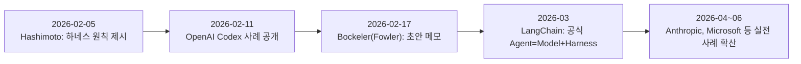
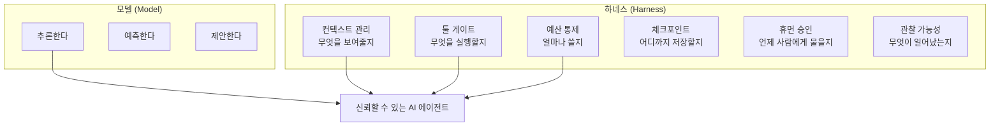
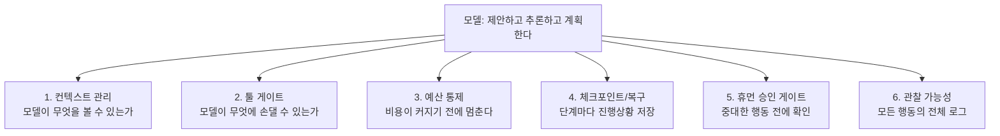
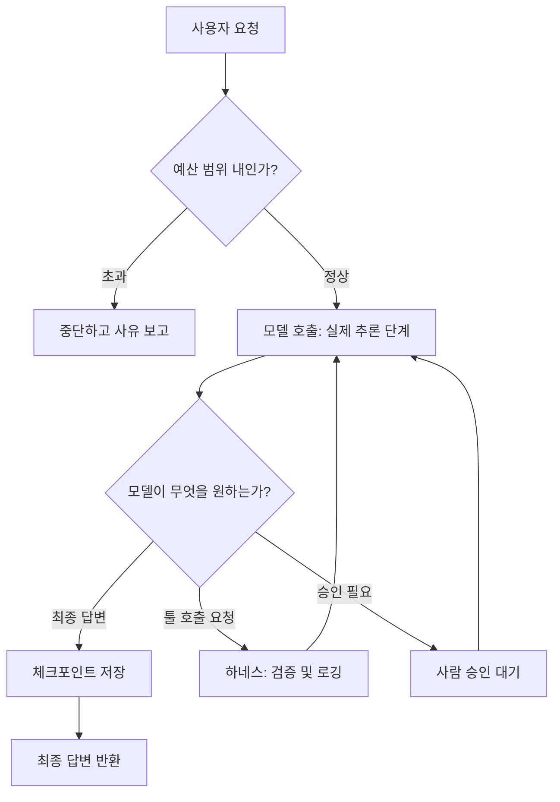

## 1. 들어가며 — 이 문서의 출처와 검증 원칙

이 문서는 2026년 6월 24일 Medium에 게재된 Divy Yadav의 글 [**「Harness Engineering Explained: The One Layer Behind Every AI Agent That Actually Works」**](https://medium.com/towards-artificial-intelligence/harness-engineering-explained-the-one-layer-behind-every-ai-agent-that-actually-works-471e82030049)를 원본 출처로 삼되, 그 안에 등장하는 핵심 주장들을 하나하나 웹 검색으로 재검증하고, 여기에 2026년 3월부터 7월 초까지 추가로 발표된 관련 자료들을 더해 서술형으로 재구성한 것이다. 원본 글은 일부 수치를 특정 출처 표기 없이 인용하고 있어서, 아래 본문에서는 각 주장이 (1) 수학적으로 직접 검증 가능한 것인지, (2) 업계에서 널리 인용되지만 단일 기관의 확정 통계는 아닌 추정치인지, (3) 특정 기업·연구자가 공개적으로 발표한 사례인지를 구분해서 표기했다. 확인이 되지 않는 부분은 추측으로 채우지 않고 "원문의 예시" 또는 "검증되지 않음"이라고 명시했다.

## 2. "Agent = Model + Harness" 공식은 어디서 왔는가

2026년 2월 초, HashiCorp의 공동창업자이자 Terraform과 Ghostty의 개발자인 Mitchell Hashimoto가 자신의 블로그(개인 메모 형태)에 하나의 작업 원칙을 정리해 올렸다. 그의 표현을 풀어서 설명하면, "에이전트가 실수를 저지를 때마다, 그 실수를 다시는 반복할 수 없도록 환경 자체에 영구적인 해결책을 엔지니어링한다"는 것이었다. 그는 이것을 "하스 엔지니어링(Harness Engineering)"이라 불렀고, 이 원칙을 압축한 공식이 바로 다음과 같다.

**Agent = Model + Harness**

흥미로운 점은, 이 개념이 널리 퍼진 계기가 Hashimoto의 글 하나만은 아니었다는 것이다. 그로부터 불과 며칠 뒤인 2026년 2월 11일, OpenAI의 엔지니어 Ryan Lopopolo가 자사 블로그에 「Harness engineering: leveraging Codex in an agent-first world」라는 사례 보고서를 공개했다. 이 글에서 OpenAI의 소규모 팀은 Codex 에이전트를 이용해 사람이 직접 작성한 코드 없이(zero manually-written code) 약 100만 줄 규모의 프로덕션급 코드베이스를 만들어낸 과정을 설명했다. 핵심은 "에이전트가 무엇을 할 수 있느냐"가 아니라 "에이전트가 스스로 판단할 수 있도록 저장소 구조, 규칙 문서, 검증 절차를 어떻게 설계했느냐"에 있었다. 이 보고서 이후 LangChain 쪽에서 두 아이디어를 하나의 슬로건으로 압축한 것이 지금 널리 쓰이는 "Agent = Model + Harness" 공식이며, Thoughtworks의 Distinguished Engineer인 Birgitta Böckeler 역시 2026년 2월 17일 초안 메모를, 4월 2일에는 "가이드(guide)"와 "센서(sensor)"라는 개념으로 하스를 체계화한 정식 글을 Martin Fowler의 블로그에 발표하며 이론적 뼈대를 보강했다. 즉 이 용어는 한 사람의 발명이라기보다, 비슷한 시기에 여러 실무자가 같은 문제(모델은 똑똑한데 왜 실제 서비스에서는 자꾸 사고가 나는가)에 부딪히면서 거의 동시에 같은 결론에 도달해 만들어진 개념이라고 보는 것이 정확하다.

다만 한 가지는 정직하게 밝혀둘 필요가 있다. Hashimoto가 처음 작성했다는 원문 블로그 글의 URL은 여러 후속 자료에서도 정확히 재확인되지 않고 있으며, 대부분의 2차 자료는 그의 발언을 인용하는 형태로만 존재한다. 따라서 "그가 정확히 어떤 문장으로 이 개념을 처음 소개했는가"보다는 "2026년 2월, 이 개념이 거의 동시다발적으로 등장해 업계 표준 용어로 정착했다"는 사실관계에 무게를 두는 것이 안전하다.



## 3. 왜 지금 이 개념이 중요한가 — 엔터프라이즈 AI 에이전트의 실패율

원본 글은 "엔터프라이즈 AI 에이전트 프로젝트의 88%가 프로덕션에 도달하지 못한다"는 수치를 근거로 하네스의 필요성을 설명한다. 이 88%라는 숫자를 검색으로 추적해보면, 흥미로운 사실이 드러난다. 이 수치는 하나의 확정된 학술 연구가 아니라, 2026년 상반기에 여러 리서치·컨설팅 기관(OneReach AI, Digital Applied, Hypersense Software, IDC 계열 분석 등)이 각자의 방법론으로 조사한 결과가 공교롭게 비슷한 구간에 수렴하면서 업계의 "합의된 체감치"처럼 굳어진 숫자다. 예를 들어 IDC 계열 분석은 "AI 에이전트 PoC의 88%가 프로덕션으로 전환되지 못한다"고 보고했고, S&P Global Market Intelligence의 실태조사는 "실제로 프로덕션에서 AI 에이전트를 운영 중인 기업은 11% 수준"이라고 보고했으며, MIT의 NANDA 이니셔티브는 이와는 결이 다른 각도에서 "생성형 AI 파일럿의 95%가 측정 가능한 재무적 성과를 내지 못한다"고 발표했다. 즉 "88%"와 "95%"는 서로 다른 것을 측정한 숫자(전자는 프로덕션 도달 여부, 후자는 도달 이후의 ROI 실현 여부)이며, 이 둘이 상호 모순되는 것이 아니라 서로 다른 단계의 실패를 보여준다는 점이 중요하다.

더 흥미로운 것은 실패의 원인 분석이다. 여러 조사에서 공통적으로 지목하는 실패 원인은 모델의 성능 부족이 아니라 다음과 같은 것들이었다: 레거시 시스템과의 통합 복잡성, 대량 처리 시 일관성 없는 출력 품질, 관측 가능성(observability) 도구의 부재, 명확하지 않은 운영 책임 소재, 그리고 불충분한 도메인 데이터. 한 조사는 이 다섯 가지 원인이 전체 실패의 89%를 설명한다고 밝히기도 했다. 이 목록에서 "모델이 부족해서"라는 항목이 빠져 있다는 점이 원본 글의 핵심 주장, 즉 문제는 모델이 아니라 그 주변 인프라라는 주장을 뒷받침한다.

## 4. 신뢰성의 수학 — 단계가 늘어날수록 실패가 누적되는 이유

원본 글에서 제시한 수치는 실제로 계산해보면 정확하다. 만약 에이전트가 각 단계를 95%의 확률로 성공적으로 수행한다고 가정하면, 여러 단계를 연속으로 거쳐야 하는 작업의 전체 성공 확률은 다음과 같이 급격히 떨어진다.

| 작업 단계 수 | 계산식 | 전체 성공률 |
|---|---|---|
| 5단계 | 0.95⁵ | 약 77% |
| 10단계 | 0.95¹⁰ | 약 60% |
| 20단계 | 0.95²⁰ | 약 36% |
| 30단계 | 0.95³⁰ | 약 21% |

이 계산은 확률론의 기본 원리(독립 사건의 곱)를 그대로 적용한 것이라 별도의 출처 없이도 수학적으로 검증 가능하다. 즉 "95%의 신뢰도"라는 말은 단일 응답 하나를 두고 하면 인상적으로 들리지만, 20단계짜리 업무 프로세스에 그대로 적용하면 셋 중 둘은 실패한다는 뜻이 된다. 실무에서 "우리 에이전트는 95% 정확한데 왜 실제로는 자꾸 틀리지?"라는 불만이 나오는 이유가 바로 여기에 있다. 모델의 정확도가 나빠진 것이 아니라, 여러 단계를 거치면서 오차가 곱셈으로 누적되는 구조적 현상일 뿐이다. 하네스는 바로 이 지점, 즉 단계와 단계 사이에 검증(verification)을 끼워 넣고, 실패한 단계만 재시도(retry)하며, 18번째 단계에서 죽으면 1번째부터 다시 시작하는 것이 아니라 18번째 단계부터 재개할 수 있게 하는 체크포인트(checkpoint)를 제공함으로써 이 누적 실패를 막는 장치다.

## 5. 하네스란 정확히 무엇인가 — 병원의 비유

원본 글이 사용한 비유를 그대로 가져와 설명하면 이렇다. 외과의사는 개인적으로 매우 뛰어난 실력을 가지고 있을 수 있다. 그러나 어떤 병원도 "뛰어난 외과의사 한 명의 실력"만으로 운영되지 않는다. 병원에는 약물 처방 승인 절차, 투약 한도, 환자 모니터링 시스템, 근무 교대 시 인수인계 절차, 사고 발생 시 기록 절차, 상황이 악화될 때의 에스컬레이션 절차가 존재한다. 이런 시스템들은 외과의사의 판단력을 대체하는 것이 아니라, 그 판단력이 수천 명의 환자에게 일관되게, 그리고 실수가 발생했을 때 복구 가능한 형태로 적용되도록 만드는 장치다.

AI 모델에 대해서도 하네스는 정확히 같은 역할을 한다. 모델은 뇌(brain)이고, 하네스는 그 뇌를 둘러싼 신경계이자 안전 규정이자 보호 장치라고 할 수 있다. 실제로 여러 실무자들이 이 비유를 조금씩 다르게 표현하는데, 어떤 이는 "모델은 두뇌, 하네스는 손과 롤케이지(rollcage)"라고 표현했고, 또 다른 이는 "모델은 CPU, 컨텍스트 윈도우는 RAM, 외부 데이터베이스는 디스크, 툴 연동은 디바이스 드라이버"라는 컴퓨터 아키텍처 비유를 들기도 했다. 표현은 다르지만 공통된 결론은 하나다 — 모델 자체는 상품화(commodity)되어 가고 있으며, 실제 경쟁력과 신뢰성을 만드는 것은 그 주변을 감싸는 인프라라는 것이다.



## 6. 하네스를 구성하는 6가지 요소


원본 글은 하네스를 여섯 가지 구성 요소로 분해해서 설명하는데, 각 요소는 모델 혼자서는 절대 할 수 없는 일을 하나씩 맡는다.

첫째는 **컨텍스트 관리(context management)** 다. 모델은 오직 현재 자신에게 주어진 "컨텍스트 윈도우" 안에 있는 정보만을 근거로 추론할 수 있다. 이것은 모델의 작업 기억(working memory)이라고 이해하면 된다. 하네스는 이 안에 무엇을 채워 넣을지 — 관련된 과거 대화, 필요한 문서, 그 이상은 넣지 않는 것 — 를 결정한다. 이 관리가 없으면 모델은 중요한 맥락을 잊어버리거나, 반대로 불필요한 정보에 파묻혀 판단력이 흐려진다.

둘째는 **툴 게이트(tool gates)** 다. 요즘의 에이전트는 웹을 탐색하고, 코드를 실행하고, 이메일을 보내고, 데이터베이스를 조회하고, 주문을 넣을 수 있다. 하네스는 이 모든 행동이 실제로 실행되기 전에 반드시 거쳐야 하는 문지기 역할을 한다. 이것이 없으면, 이메일 발송 권한을 가진 모델은 사용자가 요청하지도 않은 메일을 실제로 보내버릴 수 있다.

셋째는 **예산 통제(budget enforcement)** 다. 모델을 한 번 호출할 때마다 비용이 발생한다. 만약 에이전트가 같은 작업을 반복하는 루프에 빠지면, 단 몇 분 만에 수천 달러가 소진될 수 있다. 하네스는 최대 단계 수, 최대 비용, 최대 시간이라는 상한선을 설정하고, 이 상한선에 도달하면 에이전트를 강제로 멈춘다.

넷째는 **체크포인팅(checkpointing)** 이다. 20단계짜리 작업 중 18번째 단계에서 시스템이 죽었다면, 하네스는 18번째 단계부터 재개할 수 있게 해준다. 이 기능이 없으면 모든 실패는 처음부터 다시 시작해야 한다는 것을 의미한다.

다섯째는 **휴먼 승인 게이트(human approval gates)** 다. 데이터를 삭제하는 일, 외부로 커뮤니케이션을 발송하는 일, 일정 금액 이상을 지출하는 일처럼 되돌리기 어려운 고위험 행동 앞에서는, 에이전트가 실행을 멈추고 사람의 승인을 기다린다. 이것이 없으면 사람이 개입해야 마땅한 자율적 의사결정을 아무도 막을 수 없다.

여섯째는 **관찰 가능성(observability)** 이다. 모든 행동, 모든 툴 호출, 모든 판단 근거를 기록한다. 문제가 발생했을 때 정확히 무슨 일이 있었는지 추적할 수 있게 해주는 것이 이 기능이다. 로그가 없으면 실패를 디버깅하는 일은 순전히 추측에 의존하게 된다.



## 7. 런타임에서 하네스는 어떻게 작동하는가


실제 서비스가 동작하는 순간을 시간 순서로 풀어보면 다음과 같다. 사용자가 요청을 보내면, 하네스는 먼저 이 요청이 정해진 예산 안에 있는지를 확인한다. 예산을 초과했다면 즉시 멈추고 그 이유를 보고한다. 예산 안에 있다면 비로소 모델을 호출해서 실제 추론을 수행하게 한다. 모델이 응답을 내놓으면, 하네스는 그 응답이 최종 답변인지, 툴 호출을 요청하는 것인지, 아니면 사람의 승인이 필요한 고위험 행동인지를 판별한다. 최종 답변이라면 체크포인트를 저장하고 답을 반환한다. 툴 호출이라면 하네스가 그 호출을 검증하고 로그를 남긴 뒤 실행하고, 그 결과를 다시 모델에게 넘겨 다음 판단을 요청한다. 승인이 필요한 행동이라면 사람의 응답을 기다렸다가 그 결과를 다시 모델에게 전달한다. 이 모든 과정에서 모델은 단 한 번도 시스템에 직접 손을 대지 않는다. 모델이 제안한 모든 행동은 반드시 하네스를 거친 뒤에야 실제로 실행되거나 차단된다.



## 8. 실패와 성공의 차이를 보여주는 사례 — 환불 에이전트 (예시)

원본 글은 실제 사건을 특정 기업명 없이 예시로 제시한다. 어떤 회사가 AI 고객 서비스 에이전트를 만들어 테스트에서는 모든 시나리오를 완벽하게 처리했지만, 실제 사용자에게 배포한 지 일주일 만에 8달러짜리 단순 환불 건에 800달러를 청구했고, 다른 고객에게는 잘못된 계좌 잔액을 알려줬으며, 같은 질문에 47번 반복 응답하는 무한 루프에 빠져 결국 누군가 수동으로 시스템을 꺼야 했다는 사례다. 이 사례에 특정 회사명이나 통계적 검증 자료가 붙어 있지 않으므로, 이는 실제 사건에 대한 보도라기보다 하네스 부재의 위험성을 보여주기 위한 예시적 시나리오로 이해하는 것이 정확하다. 다만 그 구조 자체는 매우 현실적이다.

하네스가 없을 때 이 시스템의 흐름은 다음과 같았을 것이다. 고객이 "4892번 주문을 환불해달라"고 요청하면, AI는 곧바로 결제 시스템에 접근해 환불을 처리한다. 이 과정에서 금액이 정확한지 검증하는 절차도, 해당 주문이 환불 대상인지 확인하는 절차도, 지출 한도도, 무엇이 일어났는지 기록하는 절차도 전혀 없다. 그 결과 8달러가 아니라 800달러가 청구되었고, 사흘 동안 아무도 이를 알아차리지 못했다.

반대로 하네스가 있었다면 같은 요청에 대해 다음과 같이 진행되었을 것이다. AI는 4892번 주문에 대해 8달러 환불을 "제안"한다. 하네스는 이 주문이 실제로 이 고객의 것인지, 요청 금액이 주문 총액과 일치하는지, 이 금액이 자동승인 한도(예: 50달러) 이내인지를 확인하고, "14시 32분에 4892번 주문에 대해 8달러 환불"이라는 로그를 남긴다. 그 결과 정확한 금액이 지급되고, 완전한 감사 추적 기록이 남으며, 관리자는 어떤 거래든 나중에 검토할 수 있다. 두 시나리오에서 모델의 추론 능력 자체는 동일했다. 차이를 만든 것은 순전히 모델을 둘러싼 시스템이었다.

## 9. 하네스를 코드로 표현하면 — 세 가지 조각

실제로 작동하는 하네스의 뼈대는 생각보다 단순하다. 다음은 원본 글에서 제시한 파이썬 예시를 그대로 옮긴 것으로, 세 개의 작은 조각이 각각 하나의 역할만 담당한다.

첫 번째 조각은 예산 추적기다. 모델을 호출하기 전마다 에이전트가 아직 허용된 예산 안에 있는지 확인하고, 그렇지 않으면 멈춘다.

```python
class BudgetTracker:
    def __init__(self, max_steps: int, max_cost_usd: float):
        self.max_steps = max_steps      # 예: 최대 25 스텝
        self.max_cost = max_cost_usd    # 예: 최대 2.00달러
        self.steps = 0
        self.cost = 0.0

    def record(self, cost: float) -> None:
        """모델 응답이 올 때마다 사용량을 기록한다."""
        self.steps += 1
        self.cost += cost

    def should_stop(self) -> tuple[bool, str]:
        """에이전트를 멈춰야 하면 (True, 사유)를 반환한다."""
        if self.steps >= self.max_steps:
            return True, f"스텝 한도 도달 ({self.steps}/{self.max_steps})"
        if self.cost >= self.max_cost:
            return True, f"비용 한도 도달 (${self.cost:.2f} / ${self.max_cost:.2f})"
        return False, ""
```

두 번째 조각은 툴 게이트다. 모델이 사용하고자 하는 모든 툴은 이 검사를 먼저 통과해야 하며, 허용 목록에 없는 툴은 아무 일도 일어나기 전에 차단된다.

```python
# 이 목록에 있는 툴만 허용한다. 그 외에는 모두 차단.
ALLOWED_TOOLS = {"read_order", "issue_refund", "send_notification"}

def execute_tool(tool_name: str, args: dict) -> dict:
    # 1단계: 승인된 툴인가?
    if tool_name not in ALLOWED_TOOLS:
        return {
            "status": "blocked",
            "reason": f"'{tool_name}'은(는) 이 에이전트에서 허용되지 않음"
        }
    # 2단계: 감사 추적을 위해 항상 로그를 남긴다
    print(f"[LOG] Tool: {tool_name} | Args: {args}")
    # 3단계: 실행하고 결과를 반환한다
    result = run_actual_tool(tool_name, args)
    return {"status": "success", "result": result}
```

세 번째 조각은 이 둘을 연결하는 에이전트 루프다. 예산 확인이 먼저, 그 다음 모델 호출, 필요하면 툴 게이트, 그리고 반복이다.

```python
def run_agent(task: str, budget: BudgetTracker) -> str:
    messages = [{"role": "user", "content": task}]
    while True:
        # 1. 모델을 호출하기 전 항상 예산을 확인한다
        stop, reason = budget.should_stop()
        if stop:
            return f"중단됨: {reason}"

        # 2. 모델을 호출한다 (실제 AI 추론 단계)
        response = call_model(messages)
        budget.record(cost=response.cost)

        # 3. 모델이 최종 답변을 냈다면 종료
        if response.is_final_answer:
            return response.content

        # 4. 모델이 툴을 원한다면 하네스를 거친다
        tool_result = execute_tool(
            tool_name=response.tool_name,
            args=response.tool_args
        )

        # 5. 결과를 컨텍스트에 추가하고 다시 반복한다
        messages.append({"role": "tool", "content": str(tool_result)})
```

세 조각 모두 개별적으로는 작지만, 합쳐지면 무한정 실행되며 무엇이든 건드릴 수 있었던 모델을, 예산 안에서만 멈추고, 승인된 툴만 쓰며, 자신이 한 모든 일을 기록하는 모델로 바꿔놓는다.

## 10. 비용에 미치는 영향 — 모델을 바꾸지 않고 비용을 줄이는 법

원본 글은 "잘 설계된 하네스는 모델을 바꾸지 않고도 AI 비용을 최대 90%까지 줄일 수 있다"고 주장하며, 3.00달러/백만 토큰에서 0.30달러/백만 토큰으로, 그러면서도 응답 속도는 4배 빨라졌다는 구체적인 수치를 제시한다. 이 정확한 수치 조합(3.00→0.30달러, 동시에 4배 속도 향상)은 검색으로 별도의 독립된 출처를 확인하지는 못했다. 따라서 이 특정 숫자는 원본 글이 제시한 사례로만 소개하며, 사실로 단정하지는 않는다.

다만 이 주장의 근본 원리, 즉 "프롬프트 캐싱(prompt caching)을 통한 대규모 비용 절감"은 실제로 검증 가능한 사실이다. Anthropic과 OpenAI 모두 반복되는 시스템 프롬프트나 툴 정의처럼 매번 똑같이 들어가는 컨텍스트를 캐싱하면, 캐시된 입력 토큰에 대해 최대 90% 수준의 비용 절감이 발생한다고 공식적으로 밝히고 있다. Claude Code나 Cursor처럼 세션당 수십 차례의 툴 호출이 발생하는 에이전트형 작업에서는 이 캐싱 효과가 특히 크게 나타난다. 즉 "하네스 설계만으로 비용을 크게 줄일 수 있다"는 원본 글의 큰 방향성은 사실에 부합하지만, "3.00달러에서 0.30달러로, 동시에 4배 빠르게"라는 구체적 조합 수치는 원문의 예시로 취급하는 것이 정확하다.

하네스가 비용에 영향을 미치는 경로는 대체로 다음 세 가지로 요약할 수 있다. 첫째는 같은 컨텍스트를 매번 새로 읽어들이는지, 아니면 캐싱해서 재사용하는지의 차이다. 둘째는 쉬운 질문을 빠르고 저렴한 모델로, 어려운 질문만 더 뛰어난(그리고 비싼) 모델로 라우팅하는지의 여부다. 셋째는 에이전트가 이미 했던 작업을 다시 반복하는지, 아니면 저장된 결과를 그대로 가져다 쓰는지의 차이다. 결국 AI 비용 문제는 모델 자체의 문제가 아니라 인프라 설계의 문제라는 결론은, 캐싱 관련 사실만 놓고 봐도 상당히 타당하다.

## 11. 모든 에이전트에 풀 하네스가 필요한 것은 아니다

원본 글은 에이전트가 실제 세계에서 할 수 있는 일의 범위가 넓어질수록, 그에 비례해서 필요한 하네스의 수준도 높아진다는 실용적인 원칙을 제시한다. 이는 학술적으로 검증된 프레임워크라기보다 실무 경험에서 도출된 합리적인 휴리스틱으로 이해하는 것이 정확하며, 다음과 같이 정리할 수 있다.

| 에이전트가 하는 일 | 필요한 하네스 수준 |
|---|---|
| 고정된 지식베이스에서 질문에 답한다 | 최소한의 수준 — 기본적인 컨텍스트와 로그 정도 |
| 문서를 요약한다 | 경량 — 예산 통제와 로그 |
| 데이터베이스를 조회하고 리포트를 생성한다 | 툴 게이트 + 예산 통제 + 로깅 |
| 코드를 작성하고 파일을 수정한다 | 풀 하네스 — 체크포인트까지 포함 |
| 외부와 커뮤니케이션을 주고받는다 | 휴먼 승인 게이트 + 풀 하네스 |
| 돈을 다루거나 규제 대상 데이터를 처리한다 | 타협 불가 — 완전한 구축 필요 |

단순한 FAQ 챗봇에는 거의 아무런 하네스가 필요하지 않지만, 프로덕션 코드를 작성하고 배포까지 하는 에이전트에는 위에서 설명한 여섯 가지 요소가 모두 필요하다는 것이 이 프레임워크의 핵심 메시지다.

## 12. 2026년 상반기 이후 최근 동향 — 원본 글 이후에 추가로 확인된 사실들

이 주제는 원본 글이 작성된 2026년 6월 24일 이후로도 계속 발전하고 있다. 검색을 통해 추가로 확인한 신뢰할 수 있는 사례들은 다음과 같다.

**LangChain의 Terminal-Bench 2.0 사례**: 2026년 3월경, LangChain 엔지니어링 팀은 자사 코딩 에이전트의 기반 모델을 전혀 바꾸지 않은 채, 오직 하네스(에이전트를 둘러싼 인프라와 실행 로직)만을 개선해서 Terminal-Bench 2.0 벤치마크 순위를 30위권 밖에서 5위권 안으로 끌어올렸다고 보고했다. 이는 "모델보다 하네스가 성능을 좌우한다"는 주장을 뒷받침하는 대표적인 실증 사례로 업계에서 반복적으로 인용되고 있다.

**Microsoft의 Azure SRE 에이전트**: Microsoft는 자사 블로그를 통해 Azure SRE(Site Reliability Engineering) 에이전트가 3만 5천 건 이상의 실제 프로덕션 인시던트를 자율적으로 처리했으며, Azure App Service의 사고 대응 시간(time-to-mitigation)을 평균 40.5시간에서 3분으로 단축시켰다고 발표했다. 이 사례에서 특히 흥미로운 점은, 처음에는 100개 이상의 개별 맞춤형 툴과 정교하게 짜인 프롬프트로 시스템을 만들었지만, 오히려 소스코드·런북·쿼리 스키마·과거 조사 기록을 모두 파일 형태로 노출시키고 에이전트가 `read_file`, `grep`, `find`, `shell` 같은 범용 명령어로 직접 탐색하게 만드는 쪽으로 구조를 바꾸자 "의도한 결과에 도달한 비율(Intent Met Score)"이 45%에서 75%로 크게 상승했다는 것이다. 이는 하네스 설계에서 "더 많은 전용 도구를 주는 것"보다 "에이전트가 스스로 탐색할 수 있는 투명한 환경을 주는 것"이 오히려 더 효과적일 수 있음을 보여주는 사례로 평가된다.

**소프트웨어 유지보수성에 대한 정량 연구**: Software Improvement Group(SIG)의 조사에 따르면, 사람의 개입 없이 에이전트만으로 작성된 코드는 유지보수성 평가에서 5점 만점에 1.1점을 받은 반면, 인간이 검토에 참여하고 거버넌스 인프라가 갖춰진 환경에서 작성된 코드는 3.1점을 받았다. 이 차이는 사용된 모델의 종류와 무관했고, 설계 경계(design boundary), 테스트 전략, 의존성 관리, 범위 통제라는 네 가지 하네스 속성에서 비롯된 것으로 분석되었다.

**Anthropic이 정리한 모델 고유의 실패 패턴**: Anthropic의 연구는 하네스로 해결 가능한 몇 가지 전형적인 실패 양상을 짚어낸다. 하나는 "승리 선언 편향(victory declaration bias)"으로, 에이전트가 결과를 제대로 검증하지 않은 채 작업이 끝났다고 스스로 판단해버리는 현상이다. 또 하나는 "컨텍스트 불안(context anxiety)"으로, 컨텍스트 윈도우가 가득 차 갈수록 모델이 서둘러 마무리 지으려다 결과물의 질을 떨어뜨리는 현상이다. 마지막은 "원샷 과잉(one-shotting overreach)"으로, 문제 전체를 한 번에 해결하려다 정리되지 않은 변경 사항 뭉치를 만들어내는 경향을 말한다. 이 세 가지 모두 모델을 바꾼다고 사라지는 문제가 아니라, 검증 절차와 단계별 확인을 강제하는 하네스 설계로 다뤄야 하는 문제로 분류되고 있다.

**개념적 정의의 정교화**: 2026년 6월경에는 "무엇이 하네스를 하네스답게 만드는가"에 대한 보다 엄밀한 정의도 등장했다. 이 정의에 따르면 에이전트 하네스는 최소한 에이전트 루프(agent loop), 툴 인터페이스(tool interface), 그리고 몇 가지 추가 요소를 필수 구성요소로 갖춰야 하는 런타임 계층으로 규정된다. 이는 하네스라는 용어가 유행어 수준을 넘어 학술적·공학적으로 표준화되어 가는 과정을 보여준다.

**"환경 엔지니어링(Environment Engineering)"이라는 다음 단계 논의**: 일부 논자들은 하네스 오케스트레이션 자체가 점차 클라우드 표준 인프라로 상품화되고 있으며, 다음 경쟁 지점은 오히려 반대 방향, 즉 기업의 내부 API·코드베이스·데이터베이스 구조 자체를 에이전트가 이해하기 쉬운 형태로 재설계하는 "환경 엔지니어링"이 될 것이라는 전망을 내놓고 있다. 이는 아직 업계에서 폭넓은 합의가 이루어진 개념은 아니며, 앞으로 몇 개월간 더 검증이 필요한 전망 성격의 논의로 이해하는 것이 적절하다.

## 13. SM/SI 및 엔터프라이즈 AX 관점에서의 시사점

이 개념은 한국의 SM/SI 환경, 특히 망분리 규제와 계약 구조(MMD/T&M)가 존재하는 텔코 BSS/OSS ITO 운영 현장에 그대로 적용해볼 수 있는 여지가 크다. 88%라는 수치의 진짜 의미는 "모델 선택"이 아니라 "운영 인프라 설계"가 AI 전환 프로젝트의 성패를 가른다는 것인데, 이는 곧 데모(PoC) 단계에서 잘 작동하는 것과 실제 SM 조직의 운영 체계 안에서 안정적으로 돌아가는 것 사이의 간극, 다시 말해 "AX 극장(AX theater)"과 "실제 AX"의 차이와 정확히 겹치는 문제의식이다. 특히 예산 통제, 툴 게이트, 휴먼 승인 게이트, 관찰 가능성이라는 네 가지 요소는 한국 엔터프라이즈의 보안 심의·감사 추적 요구사항과 직접 맞닿아 있어서, "하네스 엔지니어"라는 역할이 곧 기존에 정의했던 레벨 2(Last Mile Engineer) 인재상의 실무적 정의로 구체화될 수 있는 지점이라고 볼 수 있다. 또한 Microsoft Azure SRE 에이전트 사례처럼 "전용 툴을 늘리기보다 기존 시스템을 그대로 노출시켜 에이전트가 직접 탐색하게 하는 편이 더 나은 결과를 낼 수 있다"는 발견은, 레거시 텔코 시스템을 무리하게 AI 전용으로 재구축하기보다 기존 자산의 가시성과 접근성을 높이는 쪽이 더 현실적인 접근일 수 있다는 시사점을 준다.

## 14. 핵심 요약

Agent는 Model과 Harness의 합이다. 모델은 추론하고, 하네스는 그 추론을 신뢰할 수 있고 안전하며 비용 통제가 가능한 형태로 만든다. 업계에서 널리 인용되는 추정치에 따르면 엔터프라이즈 AI 에이전트 프로젝트의 상당수(여러 조사에서 공통적으로 언급되는 수치는 88% 안팎)가 프로덕션에 도달하지 못하는데, 그 실패 원인은 대부분 모델의 한계가 아니라 주변 인프라의 부재에 있다. 신뢰성의 수학은 이 문제를 냉정하게 보여준다 — 단계별 95%의 신뢰도는 20단계짜리 작업에서 36%까지 떨어진다. 하네스는 컨텍스트 관리, 툴 게이트, 예산 통제, 체크포인팅, 휴먼 승인 게이트, 관찰 가능성이라는 여섯 가지 요소로 구성되며, 각각 모델 스스로는 해결할 수 없는 하나의 실패 유형을 담당한다. 프롬프트 캐싱처럼 실제로 검증된 기법을 통해 하네스 설계는 모델 교체 없이도 비용을 상당 폭 절감할 수 있다. 그리고 필요한 하네스의 수준은 에이전트가 실제 세계에서 할 수 있는 일의 범위에 비례한다 — 단순 챗봇은 거의 필요 없지만, 돈이나 규제 대상 데이터를 다루는 에이전트에게는 완전한 하네스 구축이 선택이 아니라 필수다.

AI 업계는 지난 몇 년간 "어떻게 하면 모델을 더 똑똑하게 만들까"를 물었다. 그런데 더 어려운 질문은 따로 있었다 — "어떻게 하면 그 모델을 신뢰할 수 있게 만들까." 8달러짜리 환불을 800달러로 청구하는 똑똑한 모델은 제품이 아니라 부채다. 모델은 스스로 자신의 예산을 정하지 않고, 스스로 자신의 행동을 기록하지 않으며, 되돌릴 수 없는 결정 앞에서 스스로 멈춰 서서 "이것이 정말 당신이 원하는 것이 맞습니까"라고 묻지 않는다. 그 일을 하는 것이 하네스이고, 모델은 그 일을 할 수 없다. 다음에 어떤 AI 제품이 "오작동했다"는 이야기를 듣게 된다면, 유용한 질문은 "모델이 나빴는가"가 아니라 "하네스는 어디에 있었는가"다.

## 참고 자료 (References)

- Divy Yadav, "Harness Engineering Explained: The One Layer Behind Every AI Agent That Actually Works", Medium, 2026-06-24 (원본 출처) — https://medium.com/towards-artificial-intelligence/harness-engineering-explained-the-one-layer-behind-every-ai-agent-that-actually-works-471e82030049
- OpenAI, "Harness engineering: leveraging Codex in an agent-first world", 2026-02-11 — https://openai.com/index/harness-engineering/
- Birgitta Böckeler (Thoughtworks), "Harness engineering for coding agent users", martinfowler.com, 2026-04-02(개정), 최초 메모 2026-02-17 — https://martinfowler.com/articles/harness-engineering.html
- Software Improvement Group, "What is harness engineering?" — https://www.softwareimprovementgroup.com/blog/what-is-harness-engineering/
- ikangai, "The Agent Harness: Everything Except the Model", 2026-04-15 — https://www.ikangai.com/the-agent-harness-everything-except-the-model/
- Faros AI, "Harness Engineering: Making AI Coding Agents Work in 2026", 2026-05-22 — https://www.faros.ai/blog/harness-engineering
- Atlan, "What Is Harness Engineering AI? The Definitive 2026 Guide" — https://atlan.com/know/what-is-harness-engineering/
- Augment Code, "Harness Engineering for AI Coding Agents" — https://www.augmentcode.com/guides/harness-engineering-ai-coding-agents
- amux, "Harness Engineering: The Complete Guide to Building AI Agent Harnesses (2026)" — https://amux.io/guides/harness-engineering/
- XMPro, "Your AI Agent Needs a Harness — Here's What That Means for Industrial Operations" — https://xmpro.com/your-ai-agent-needs-a-harness-heres-what-that-means-for-industrial-operations/
- GitHub, ai-boost/awesome-harness-engineering (최신 사례 큐레이션) — https://github.com/ai-boost/awesome-harness-engineering
- GitHub, mahonzhan/awesome-agent-harness (타임라인 정리) — https://github.com/mahonzhan/awesome-agent-harness
- NxCode, "What Is Harness Engineering? Complete Guide for AI Agent Development (2026)" — https://www.nxcode.io/resources/news/what-is-harness-engineering-complete-guide-2026
- Exceeds AI, "AI Model Token Pricing Breakdown: 2026 Engineering Guide" (프롬프트 캐싱 비용 절감 관련) — https://blog.exceeds.ai/ai-model-token-pricing-breakdown/
- Digital Applied, "Why 88% of AI Agents Fail Production: Analysis Guide" — https://www.digitalapplied.com/blog/88-percent-ai-agents-never-reach-production-failure-framework
- SoftwareSeni, "Why 88 to 95 Percent of Enterprise AI Pilots Never Reach Production" (88% vs 95% 수치 출처 구분 설명) — https://www.softwareseni.com/why-88-to-95-percent-of-enterprise-ai-pilots-never-reach-production/

---
작성일자: 2026-07-04
