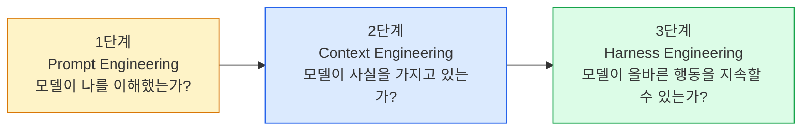
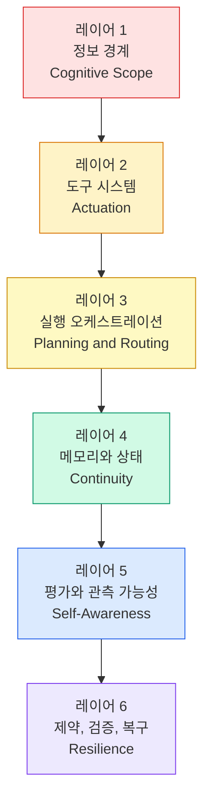
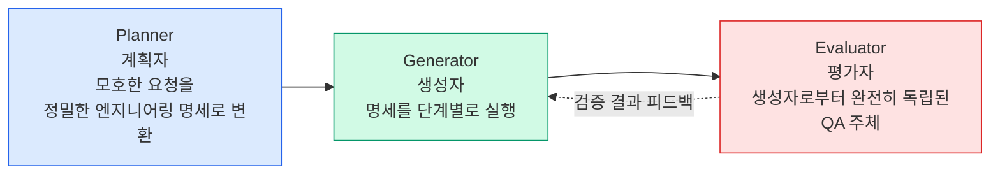
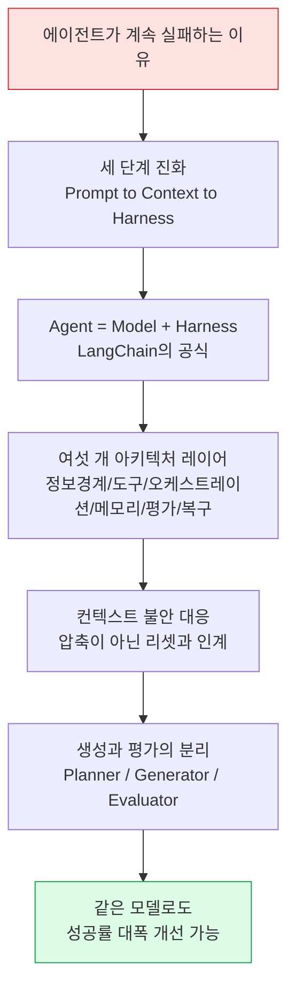

- 원문: Nick T. (Ph.D.), "Harness Engineering: Understand this will make your AI Agent performs better than 80% of others", ai.plainenglish.io, 2026-04-06
- 원문 링크: https://ai.plainenglish.io/harness-engineering-understand-this-will-make-your-ai-agent-performs-better-than-80-other-agents-271c3efeec4c

## 관련글

[**하네스 엔지니어링(Harness Engineering): AI 에이전트를 프로덕션에서 살아남게 만드는 기술**](https://k82022603.github.io/posts/%ED%95%98%EB%84%A4%EC%8A%A4-%EC%97%94%EC%A7%80%EB%8B%88%EC%96%B4%EB%A7%81(harness-engineering)-ai-%EC%97%90%EC%9D%B4%EC%A0%84%ED%8A%B8%EB%A5%BC-%ED%94%84%EB%A1%9C%EB%8D%95%EC%85%98%EC%97%90%EC%84%9C-%EC%82%B4%EC%95%84%EB%82%A8%EA%B2%8C-%EB%A7%8C%EB%93%9C%EB%8A%94-%EA%B8%B0%EC%88%A0/)

---

## 이 문서의 성격에 대한 안내

이 문서는 하네스 엔지니어링 2부작 시리즈 중 개념을 다루는 첫 번째 글(전작)을 한국어 서술형으로 상세하게 풀어 정리한 것입니다. 이전에 정리해 드린 "빌드 가능한 하네스(마크다운 파일로 구현하기)" 글이 실전편이라면, 이번 글은 그 실전편이 등장하기 전에 나온 개념 정립편에 해당합니다. 실제로 이 글의 마지막 부분에서 저자는 다음 글에서 이 개념들을 마크다운 파일로 어떻게 구현하는지 다루겠다고 예고하고 있으며, 그 예고된 글이 바로 이전에 정리해 드린 문서의 원문입니다.

이 문서를 작성하면서 원문에 등장하는 핵심 개념들, 특히 "컨텍스트 불안(Context Anxiety)"이라는 용어와 "LangChain의 Agent = Model + Harness 공식"이 실제로 업계에서 사용되고 있는 개념인지, 그리고 정확히 어떤 맥락에서 나온 것인지를 최신 자료로 검색해 교차 검증했습니다. 검증 과정에서 원문 저자가 사용한 일부 용어에 실제 업계 표준 용어와 다른 부분이 발견되었으며, 이는 아래 해당 섹션에서 명확히 짚어 드리겠습니다. 또한 원문에 등장하는 개인적인 수치(68%, 70%, 95% 등)는 저자 본인이 자신의 경험에서 보고한 것으로, 공인된 벤치마크 수치가 아니라는 점을 미리 밝힙니다.

---

## 1. 저자가 마주한 문제: 새벽 2시의 좌절

저자는 새벽 2시, 3주 동안 매달렸던 작업 앞에서 결국 패배를 인정했다고 이야기를 시작합니다. 프롬프트를 정교하게 다듬고, 최신 플래그십 모델로 계속 교체하고, RAG(검색 증강 생성)의 청킹 방식을 집요하게 조정했지만, 정작 만든 에이전트는 샌드박스 안에서는 훌륭하게 작동했지만 실제 운영 환경에서는 참담했다고 합니다. 두 단계 전에 내린 결정을 잊어버리고, 결과물이 깨져 있는데도 자신 있게 성공을 선언하는 일이 반복되었으며, 작업 성공률은 68% 언저리에서 꿈쩍하지 않았다는 것입니다. 모델을 아무리 바꿔도 70%의 벽을 넘지 못했다고 저자는 말합니다.

저자가 결국 도달한 결론은, 자신이 다루고 있던 것이 모델의 문제가 아니라 시스템의 문제였다는 것입니다. 그리고 이 구분을 이해하기 전까지는 아무것도 달라지지 않았다고 회고합니다.

---

## 2. AI 엔지니어링의 세 단계: 대부분의 팀이 2단계에 머물러 있다

저자는 LLM 애플리케이션이 성숙해 가는 과정을 세 단계로 구분합니다. 자신이 대화를 나눠본 대부분의 팀들이 1단계나 2단계 어딘가에 머물러 있으면서, 정작 3단계에서 발생하는 문제 때문에 계속 발목을 잡히고 있다는 것이 저자의 관찰입니다.

### 2-1. 1단계: 프롬프트 엔지니어링 — 모델이 나를 이해했는가?

누구나 여기서부터 출발합니다. LLM이 확률을 정교하게 형성하는 기계라는 사실을 발견하게 되는 단계로, 역할을 세심하게 부여하거나, 몇 가지 예시(few-shot)를 제공하거나, 형식 제약을 정확히 지정하면 출력이 갑자기 달라지는 경험을 하게 됩니다. 이는 마법처럼 느껴지고, 실제로 강력한 효과를 냅니다. 한정된 범위의 단일 턴 작업이라면 좋은 프롬프트만으로도 충분한 경우가 많습니다.

하지만 저자는 곧 한계에 부딪혔다고 말합니다. 아무리 지침을 아름답게 다듬어도, 모델이 애초에 가지고 있지 않은 지식을 갖게 만들 수는 없었습니다. 세 번의 도구 호출 전에 일어난 일을 기억하게 만들 수도 없었고, 현실이 기대에 어긋났을 때 모델이 자신 있게 데이터를 지어내는 것을 막을 수도 없었습니다.

저자가 지적하는 함정은, 더 복잡하고 정교한 프롬프트가 사실적 근거나 실시간 맥락의 근본적인 결핍을 보완할 수 있다고 믿는 것이며, 실제로는 그럴 수 없다는 것입니다.

### 2-2. 2단계: 컨텍스트 엔지니어링 — 모델이 사실을 가지고 있는가?

이 한계를 이해한 뒤 저자는 컨텍스트에 몰두했다고 말합니다. RAG 파이프라인, 동적 검색, 도구 출력을 다시 모델에 주입하는 방식, 대화 이력을 신중하게 삽입하는 방식 등을 시도하며, 모델이 결정을 내리는 순간 무엇을 볼 수 있는지에 집착하게 되었다는 것입니다.

이는 실제로 돌파구처럼 느껴졌고, 어느 정도는 실제로 돌파구였습니다. 적절한 시점에 적절한 정보에 접근할 수 있게 되자 에이전트는 극적으로 똑똑해졌습니다.

하지만 컨텍스트 엔지니어링으로도 해결되지 않는 문제가 있었는데, 저자는 이를 "실행 이탈(execution drift)"이라고 부릅니다. 에이전트가 훌륭한 계획을 세우고, 1단계는 완벽하게 실행하다가, 2단계에서 도구의 반환값을 잘못 해석한 뒤, 이후 열두 단계 동안 조용히 궤도를 벗어나 버리는 현상입니다. 더 무서운 것은 시스템이 이를 전혀 알아채지 못한다는 점입니다. 이미 한참 전에 조용히 틀어져 버린 계획을 자신 있게 계속 실행해 나간다는 것입니다.

저자가 지적하는 흔한 오해는, 컨텍스트 엔지니어링을 벡터 데이터베이스 기반 RAG와 동일시하는 것입니다. 진짜 컨텍스트 관리는 그보다 훨씬 넓은 개념으로, 동적 상태 주입, 도구 응답 요약, 전략적인 이력 축약(truncation) 등을 포함하며, RAG는 그 시작점일 뿐이라고 강조합니다.

### 2-3. 3단계: 하네스 엔지니어링 — 모델이 올바른 행동을 지속할 수 있는가?

바로 이 지점에서 이야기가 흥미로워진다고 저자는 말합니다. 더 좋은 모델이 정답이라고 믿었던 사람에게는 다소 겸허해지는 지점이기도 합니다.

하네스 엔지니어링은 모델 주변에 비계(scaffolding)를 세우는 훈련입니다. 모델이 무엇을 하는지 감독하고, 실패를 포착하며, 제약을 강제하고, 궤도를 이탈했을 때 다시 끌어오는 결정론적(deterministic) 시스템을 의미합니다. 이 이름은 실제 물리적인 하네스 — 고삐, 안전 테더 등 통제를 위한 인프라 — 에서 따온 것이며, 정확히 그런 역할을 한다고 저자는 설명합니다.

---

## 3. 사고를 바꾼 하나의 공식: Agent = Model + Harness

저자는 자신의 사고를 완전히 바꾼 재구성으로 LangChain에서 나온 다음 공식을 인용합니다.

**Agent = Model + Harness (에이전트 = 모델 + 하네스)**

여기서 말하는 하네스란, 파운데이션 모델 API 호출 자체를 제외하고 코드베이스 안에서 에이전트를 실제로 운영 환경에서 작동하게 만드는 거의 모든 것을 의미합니다.

이 개념을 실제 최신 정보로 검색해 확인해 보면, 이 공식은 LangChain의 Vivek Trivedy가 2026년 3월에 작성한 "The Anatomy of an Agent Harness"라는 글에서 명확한 형태로 제시한 것으로 확인됩니다. 해당 글에서는 "모델이 아니라면, 당신은 하네스다"라는 표현과 함께, 하네스를 모델 자체가 아닌 모든 코드, 설정, 실행 로직으로 정의하고 있습니다. 이 정의는 이후 여러 실무자와 매체를 통해 널리 인용되며 업계 표준 표현으로 자리 잡았습니다. 참고로 LangChain은 실제로 자사의 코딩 에이전트를 대상으로 한 실험에서, 모델은 전혀 바꾸지 않고 하네스만 개선했을 때 Terminal-Bench 2.0이라는 벤치마크에서 순위가 30위권 밖에서 5위권으로 뛰어올랐다고 밝힌 바 있어, 저자가 주장하는 "모델보다 하네스가 병목"이라는 논지와 실제로 부합하는 사례입니다.

또한 Anthropic 역시 자사의 Claude Agent SDK를 "범용 에이전트 하네스"라고 공식적으로 지칭하고 있어, 이 용어와 개념 자체는 특정 개인의 창작이 아니라 여러 주요 기업과 연구자들이 2026년 상반기에 걸쳐 공통적으로 수렴한 개념 체계임을 확인할 수 있습니다.

저자가 사용하는 비유는 신입 사원을 중요한 고객 미팅에 보내는 상황입니다.

- 프롬프팅은 안건을 알려주는 것입니다. "인사하고, 제품을 소개하고, 요구사항을 물어봐."
- 컨텍스트는 자료집을 건네주는 것입니다. "고객 배경, 가격표, 미팅 목표가 여기 있어."
- 하네스는 그 나머지 모든 것입니다. 직원이 들고 가는 체크리스트, 미팅 중간에 반드시 거쳐야 하는 확인 절차, 녹음된 대화록, 대본에서 벗어났을 때의 교정 장치, 그리고 미팅 보고서에 대한 엄격한 수용 기준까지 포함됩니다.

아무리 브리핑을 잘해도, 빠져 있는 책임 추적 인프라를 보완할 수는 없다는 것이 저자의 요지입니다.

저자는 이 깨달음 — 앞의 두 단계는 모델이 더 잘 생각하도록 돕는 반면, 하네스 엔지니어링은 모델이 신뢰성 있게 행동하도록 보장한다는 구분 — 이 자신을 70%의 벽 너머로 밀어낸 결정적 계기였다고 말합니다. 작업 분해, 상태 관리, 핵심 단계 검증, 실패 복구 로직을 다시 설계함으로써, 동일한 모델과 동일한 프롬프트로 작업 성공률을 95% 이상까지 끌어올렸다고 보고합니다. (이 수치 역시 저자 본인의 프로젝트에서 나온 자체 보고 수치이며, 독립적으로 검증된 통계는 아님을 다시 한번 밝힙니다.)

---

## 4. 성숙한 하네스를 구성하는 여섯 개의 아키텍처 레이어

저자는 하네스가 단일 파일이나 영리한 래퍼(wrapper) 하나로 끝나는 것이 아니라, 계층화된 아키텍처이며 각 계층이 서로 다른 유형의 실패를 다룬다고 설명합니다.

### 레이어 1. 정보 경계 (Cognitive Scope)

모델이 자신의 즉각적인 컨텍스트 안에서 무엇을 "보는가"는 다른 어떤 요소보다 성능을 크게 좌우합니다.

불필요한 데이터는 모델을 더 똑똑하게 만들지 않고, 오히려 초점을 잃게 만듭니다. 더 나쁜 것은, 서로 다른 종류의 정보(시스템 규칙, 현재 작업 상태, 외부 근거 자료)를 구조화되지 않은 하나의 덩어리로 뒤섞으면 모델이 제약을 놓치기 시작한다는 점입니다. 핵심 규칙이 잡음이 되어 더 이상 주의를 기울이지 않게 됩니다.

하네스는 모델이 무엇을 보는지 — 역할, 현재 목표, 성공 기준, 그리고 서로 다른 정보 유형의 구조적 분리 — 를 명시적으로 정의하고 분류해야 합니다.

### 레이어 2. 도구 시스템 (Actuation)

도구가 없으면 LLM은 텍스트 예측기에 불과합니다. 적절한 도구 시스템이 갖춰지면, 실제 세계와 상호작용할 수 있는 에이전트가 됩니다.

하지만 저자가 초반에 저지른 결정적인 실수는 모델에게 너무 많은 도구를 준 것이었습니다. 상세한 문서가 딸린 열다섯 개의 도구는 강력해 보이지만, 실제로는 주의력을 분산시키고 모델이 존재하지 않는 파라미터를 지어내거나 제대로 이해하지 못한 API를 오용하게 만듭니다.

하네스는 어떤 도구를 쓸 수 있는지뿐 아니라 언제 도구를 사용해야 하는지도 통제해야 합니다. 검색해야 할 때 맹목적으로 추측하는 것을 막아야 하고, 이미 답을 알고 있을 때 불필요하게 검색하는 것도 막아야 합니다.

그리고 저자가 협상 불가능한 원칙으로 강조하는 것은, 도구의 원시 출력(raw output)을 절대 그대로 LLM에 다시 넣어서는 안 된다는 것입니다. API 호출에서 나온 50개 항목짜리 JSON 응답은 컨텍스트를 오염시킵니다. 하네스는 도구의 반환값이 모델에 닿기 전에 반드시 필터링하고, 파싱하고, 요약해야 합니다.

### 레이어 3. 실행 오케스트레이션 (Planning & Routing)

LLM은 개별 스킬이 부족해서가 아니라, 그 스킬들을 순서대로 엮어내지 못해서 실패하는 경우가 많습니다. 저자는 이를 "의식의 흐름식 실행"이라고 부르는데, 단계 사이를 건너뛰고, 검증을 생략하고, 필요한 모든 것을 갖추기도 전에 성급하게 결과물을 생성하는 현상을 말합니다.

하네스는 엄격한 궤도를 깔아 놓아야 합니다. 목표 이해 → 정보 평가 → 부족한 정보 확보 → 분석 → 생성 → 검증 → 출력의 흐름이 그 예입니다.

이것은 단순한 비계 이상의 의미를 가집니다. 확률적인 모델로부터 결정론적인 시스템으로 프로젝트 관리 책임을 이전하는 것입니다. 모델이 무엇을 어떤 순서로 할지 스스로 결정할 필요는 없습니다. 그 구조는 하네스에 속해야 합니다.

### 레이어 4. 메모리와 상태 (Continuity)

상태를 갖지 않는 에이전트는 매 턴마다 기억상실증에 걸린 것과 같습니다. 명시적인 상태 관리가 없으면, 다단계 작업의 매 단계마다 사실상 처음부터 새로운 대화를 시작하는 셈입니다.

저자는 세 가지로 엄격하게 분리된 메모리 유형을 유지하는 법을 배웠다고 말합니다.

1. **현재 작업 상태**: 지금 어떤 단계에 있는가? 무엇이 대기 중인가? 무엇이 확정되었는가?
2. **대화 내 중간 결과**: 이번 세션에서 이미 도달한 결론은 무엇인가?
3. **장기 메모리 및 사용자 프로필**: 세션을 넘어 지속되는 전역적인 선호와 맥락.

저자가 뼈아프게 배운 함정은, 작업 상태와 대화 이력을 혼동하는 것입니다. 그 결과는 작업이 진행될수록 무한히 커지고 구조화되지 않은 컨텍스트 창이며, 이는 모델 성능을 떨어뜨립니다. 이 둘은 반드시 엄격하게 분리되어야 합니다.

### 레이어 5. 평가와 관측 가능성 (Self-Awareness)

이 레이어는 원시적인(primitive) 에이전트가 극적으로 무너지는 지점입니다. 결과물을 생성하고, 성공을 선언하지만, 그 결과물이 실제로 올바른지 알아낼 방법이 전혀 없습니다.

자신의 작업을 스스로 평가하는 에이전트는 뿌리 깊은 낙관 편향을 가진 에이전트입니다. 깨진 코드를 작동한다고 선언할 것이고, 실제 질문에 답하지 못했는데도 자신의 응답을 만족스럽다고 평가할 것입니다.

하네스는 독립적이고 자동화된 검증 메커니즘을 필요로 합니다. 사후 인간 리뷰는 너무 느리고 확장되지 않기 때문에 대안이 될 수 없습니다. 자동화된 출력 검증, 통합된 테스트 환경, 세심한 로깅, 메트릭 추적, 오류 귀속(error attribution) 모두가 이 레이어에 속합니다.

시스템은 자신의 행동이 올바르다고 그저 가정하는 것이 아니라, 지속적으로 스스로에게 그것을 증명해야 합니다.

### 레이어 6. 제약, 검증, 복구 (Resilience)

운영 환경에서는 실패가 기본 상태입니다. API는 타임아웃되고, JSON 형식은 깨지며, 검색 결과는 부정확합니다. 복구 메커니즘이 없는 에이전트는 오류가 날 때마다 사람이 처음부터 다시 시작해야 하는 에이전트입니다.

하네스는 여기서 세 가지를 필요로 합니다.

- **제약(Constraints)**: 에이전트가 절대 해서는 안 되는 일을 명시하는 하드코딩된 규칙.
- **검증(Validation)**: 출력 전과 출력 후의 게이트 검사(스키마 검증, 형식 확인, 제약 조건 검증).
- **복구(Recovery)**: 재시도 로직, 대체 경로, 그리고 마지막으로 알려진 안정 상태로 되돌아갈 수 있는 능력.

---

## 5. 숨겨진 적: 컨텍스트 불안(Context Anxiety) — 용어 검증 결과 포함

저자는 작업이 수십 단계에 걸쳐 늘어나면서 이상한 현상이 나타난다고 설명하며, Anthropic 연구자들이 이를 "컨텍스트 불안(Context Anxiety)"이라고 이름 붙였다고 소개합니다.

이 부분은 실제로 최신 자료를 검색해 상세히 검증했습니다. 결과를 정리하면 다음과 같습니다.

### 5-1. "컨텍스트 불안"이라는 용어는 실제로 존재하며, 정확한 출처가 있습니다

이 현상은 원래 Anthropic이 아니라, Claude Sonnet 4.5를 자사의 코딩 에이전트 Devin에 도입하는 과정을 다룬 Cognition AI의 관찰에서 처음 이름 붙여진 것으로 확인됩니다. 모델이 자신의 컨텍스트 창 한계에 가까워지고 있다고 "판단"하면, 작업을 미리 요약해 마무리하려 하고, 더 빠르고 허술한 결정을 내리며, 지름길을 택하고, 작업을 끝맺지 못한 채 남겨두는 행동 변화가 관찰되었다는 것입니다. 흥미로운 점은 실제 남은 토큰이 충분한 경우에도 이런 행동이 나타났다는 것입니다.

이후 Anthropic도 자사의 공식 엔지니어링 블로그에서 이 용어를 그대로 채택해 사용하고 있는 것이 확인됩니다. Anthropic은 장기 실행 애플리케이션 개발을 위한 하네스 설계를 다루는 글에서, 모델이 컨텍스트 한계에 다가가고 있다고 여길 때 작업을 조기에 마무리하려 하는 현상을 "컨텍스트 불안"이라고 명시적으로 부르고 있으며, 실제로 Claude Sonnet 4.5에서 이 현상이 강하게 나타나 단순한 컨텍스트 압축(compaction)만으로는 충분하지 않았고, 이를 해결하기 위해 하네스 설계에 "컨텍스트 리셋(context reset)"을 필수 요소로 도입했다고 밝히고 있습니다.

### 5-2. 원문의 "Context Reflect"라는 표현에 대한 정정

원문에서는 이 해법을 "Context Reflect(컨텍스트 리플렉트)"라고 지칭하며 Anthropic이 이렇게 부른다고 소개하고 있습니다. 그러나 검색을 통해 확인한 Anthropic의 실제 공식 자료에서는 이 개념을 "컨텍스트 리셋(Context Reset)"이라고 부르고 있으며, "Context Reflect"라는 용어는 Anthropic의 공식 자료에서 확인되지 않았습니다. 따라서 이 부분은 원문 저자의 표기 오류이거나 의역으로 보이며, 정확한 업계 용어는 "컨텍스트 리셋"임을 밝혀 드립니다.

컨텍스트 리셋의 실제 작동 방식은 다음과 같이 확인됩니다. 컨텍스트 창을 완전히 비우고 새로운 에이전트를 시작하되, 이전 에이전트의 상태와 다음 단계를 담은 구조화된 인계(handoff) 자료를 함께 전달하는 방식입니다. 이는 대화의 앞부분을 그 자리에서 요약해 같은 에이전트가 축약된 이력으로 계속 진행하게 하는 압축(compaction)과는 다른 접근입니다. 압축은 연속성은 유지하지만 에이전트에게 완전히 새로운 상태(clean slate)를 주지는 못하기 때문에 컨텍스트 불안이 여전히 남을 수 있는 반면, 리셋은 완전히 새로운 상태를 제공하는 대신 다음 에이전트가 작업을 매끄럽게 이어받을 수 있을 만큼 충분한 정보를 담은 인계 자료가 필요하다는 대가가 따릅니다.

한 가지 더 확인된 흥미로운 사실은, Anthropic이 이후 공개한 후속 자료에서 동일한 하네스를 Claude Opus 4.5에 적용했을 때는 컨텍스트 불안 현상 자체가 사라져 있었고, 그 결과 컨텍스트 리셋 장치가 오히려 불필요한 오버헤드가 되었다고 밝힌 바 있습니다. 이는 하네스가 특정 모델의 약점을 전제로 설계되기 때문에, 모델이 개선되면 하네스도 함께 재검토되어야 한다는 점을 보여주는 사례로, 하네스 엔지니어링이 고정된 정답이 아니라 계속 진화해야 하는 실천이라는 점을 뒷받침합니다.

### 5-3. 점진적 공개(Progressive Disclosure)

저자는 유사한 맥락에서, 에이전트에게 전체 도구 라이브러리를 처음부터 다 보여주는 것을 그만두었다고 말합니다. 대신 하네스가 점진적 공개를 구현하도록 했는데, 처음에는 모델이 최소한의 도구 스텁(stub)만 보게 하고, 특정 기능을 사용하려는 의도를 보이면 그때 하네스가 상세한 문서와 파라미터 스키마를 동적으로 주입하는 방식입니다. 컨텍스트 최적화는 모델에게 더 많은 정보를 주는 것이 아니라, 필요한 바로 그 순간에 올바른 정보만 주는 것이라고 저자는 요약합니다.

이 개념 역시 Anthropic이 공식적으로 발행한 "AI 에이전트를 위한 효과적인 컨텍스트 엔지니어링" 자료에서 다루는 핵심 원칙과 일치합니다. 해당 자료는 컨텍스트를 한정된 자원으로 취급해야 하며, 사람과 마찬가지로 LLM도 컨텍스트를 파싱하는 데 사용하는 일종의 "주의력 예산(attention budget)"을 가지고 있고, 새로운 토큰이 추가될 때마다 이 예산이 소모된다고 설명합니다. 이는 컨텍스트 창이 늘어날수록 모델이 정보를 정확히 회상하는 능력이 떨어지는 현상, 이른바 "컨텍스트 부패(context rot)"와 직접적으로 연결되는 개념으로, Anthropic이 2025년 9월 공식 블로그에서 처음 상세히 다룬 바 있습니다.

---

## 6. 생성과 평가의 분리: 자율성을 가능하게 하는 아키텍처

저자가 접한 가장 중요한 아키텍처적 통찰 중 하나는, Anthropic이 사람의 검토 없이 몇 시간에 걸쳐 완전하고 작동하는 결과물을 생성할 수 있는 진정한 자율 에이전트를 만드는 방식에서 나왔다고 소개합니다.

핵심은 다음과 같은 엄격한 세 갈래 분리입니다.

**계획자(Planner)** 는 모호한 인간의 요청을 엄밀한 엔지니어링 명세로 번역합니다.

**생성자(Generator)** 는 그 명세를 받아 단계별로 실행합니다.

**평가자(Evaluator)** 는 생성자로부터 기능적으로 완전히 분리된 독립적인 QA 주체 역할을 합니다.

평가자는 단순히 생성자가 작성한 코드를 읽는 데 그치지 않습니다. 렌더링된 실제 결과물과 직접 상호작용합니다. UI 작업이라면 인터페이스를 실제로 클릭해 보고, 시각적 레이아웃을 검사하고, 인터랙션 상태를 확인합니다. 생성자가 인식한 현실이 아니라, 실제 현실을 기준으로 검증합니다.

저자는 OpenAI가 이 개념을 한 단계 더 발전시켰다고 설명합니다. 에이전트가 사람 엔지니어가 풀 리퀘스트를 검토할 수 있는 속도보다 더 빠르게 코드를 작성하기 시작하면서, OpenAI는 에이전트 스스로를 위한 완전 자동화된 CI/CD 파이프라인을 구축했다는 것입니다. 에이전트는 격리된 샌드박스에서 자신의 코드를 실행하고, 헤드리스 브라우저로 스크린샷을 캡처하며, 자신의 실행 로그를 읽고, 배포가 올바른지 스스로 검증할 수 있을 때까지 반복한다고 소개합니다. 이 부분은 OpenAI Codex 계열 도구가 실제로 격리된 실행 환경과 자동화된 검증 루프를 통해 사람의 개입 없이 코드를 검증하고 반복 수정하는 방식으로 설계되어 있다는 점에서, 큰 방향성은 업계에서 통용되는 자율 코딩 에이전트의 설계 철학과 일치합니다. 다만 "OpenAI가 헤드리스 브라우저로 스크린샷을 캡처한다"는 구체적인 서술은 저자의 개인적인 서술로, 이 문서에서는 OpenAI의 특정 제품 사양을 확정적으로 검증한 것이 아니라 저자의 설명을 그대로 전달하는 것임을 밝힙니다.

저자는 이제 "완료(done)"라는 말의 의미가 달라졌다고 강조합니다. 더 이상 "텍스트 생성을 마쳤다"는 뜻이 아니라, "코드를 실행하고, 로그를 검토하고, 버그를 발견해 수정하고, 샌드박스에서 배포가 올바른지 검증했다"는 뜻이 되었다는 것입니다.

---

## 7. 결론: 모델은 병목이 아니다

저자가 이 글 전체에서 도출한 핵심 진실은 다음과 같이 요약됩니다.

파운데이션 모델의 지능은 벤치마크 리더보드 상의 이론적 상한선을 결정합니다. 그러나 하네스 엔지니어링의 견고함은 그 지능이 혼란스러운 실제 운영 환경에서 실제로 살아남고, 회복하고, 가치를 전달할 수 있는지를 결정합니다.

모델은 병목이 아닙니다. 어느 지점을 지나면, 모델은 한 번도 병목이었던 적이 없습니다.

68%의 성공률과 95%의 성공률 사이의 간극 — 데모와 실제 제품 사이의 간극 — 은 전적으로 하네스 안에 존재한다는 것이 저자의 결론입니다.

저자는 이 개념적인 글에 이어, 다음 편에서 여기서 다룬 개념들을 마크다운 파일 안의 구체적인 지침으로 번역해 실제로 어떻게 구현할 수 있는지 보여주겠다고 예고하며 글을 마칩니다. 실제로 이 예고된 후속편이 바로 저자가 이후 발행한 "빌드 가능한 하네스" 편이며, 그 안에서는 Instruction, Tools, Environment, State, Feedback이라는 다섯 가지 서브시스템, 신선한 세션 테스트, 그리고 저장소 구조 설계 원칙 등 훨씬 더 구체적이고 실행 가능한 지침들이 다뤄집니다.

---

## 8. 전체 개념 구조 한눈에 보기

---

## 9. 검증 결과 요약

이 문서를 작성하며 검색을 통해 확인한 사실관계는 다음과 같습니다.

| 원문의 주장 | 검증 결과 |
|---|---|
| "Agent = Model + Harness"는 LangChain에서 나온 재구성이다 | 사실로 확인됨. LangChain의 Vivek Trivedy가 2026년 3월 "The Anatomy of an Agent Harness"에서 명확히 제시했으며, 이후 업계 표준 표현으로 널리 인용됨 |
| Anthropic이 Claude Agent SDK를 "범용 에이전트 하네스"라 부른다 | 사실로 확인됨. Anthropic 공식 엔지니어링 블로그에서 동일한 표현 확인 |
| "컨텍스트 불안(Context Anxiety)"이라는 용어가 실제로 존재하며 Anthropic도 사용한다 | 사실로 확인됨. 다만 이 용어를 처음 사용한 곳은 Cognition AI(Devin 개발사)이며, Anthropic도 자사 블로그에서 이를 채택해 사용 중임 |
| Anthropic이 이 해법을 "Context Reflect"라 부른다 | **정정 필요**. Anthropic의 공식 자료에서 확인되는 명칭은 "컨텍스트 리셋(Context Reset)"이며, "Context Reflect"라는 표현은 확인되지 않음 |
| LangChain이 하네스만 바꿔 벤치마크 순위를 크게 개선했다 | 사실로 확인됨. Terminal-Bench 2.0에서 모델 교체 없이 하네스 개선만으로 순위가 30위권 밖에서 5위권으로 상승했다는 내용이 다수 자료에서 확인됨 |
| 원문의 성공률 수치(68%, 70%, 95%)와 "80%의 다른 에이전트보다 낫다"는 제목의 수치 | 검증 불가. 저자 개인의 프로젝트에서 나온 자체 보고 수치로, 공인된 벤치마크나 제3자 검증 자료는 확인되지 않음 |

---

## 10. 참고 및 출처

- 원문: Nick T. (Ph.D.), "Harness Engineering: Understand this will make your AI Agent performs better than 80% of others", ai.plainenglish.io, 2026-04-06. https://ai.plainenglish.io/harness-engineering-understand-this-will-make-your-ai-agent-performs-better-than-80-other-agents-271c3efeec4c
- LangChain, "The Anatomy of an Agent Harness" (Vivek Trivedy, 2026-03). https://www.langchain.com/blog/the-anatomy-of-an-agent-harness
- Anthropic Engineering, "Harness design for long-running application development". https://www.anthropic.com/engineering/harness-design-long-running-apps (컨텍스트 불안과 컨텍스트 리셋 개념의 공식 출처)
- Anthropic Engineering, "Scaling Managed Agents: Decoupling the brain from the hands". https://www.anthropic.com/engineering/managed-agents (Opus 4.5에서 컨텍스트 불안이 사라진 사례)
- Anthropic Engineering, "Effective context engineering for AI agents". https://www.anthropic.com/engineering/effective-context-engineering-for-ai-agents (주의력 예산, 컨텍스트 부패 개념의 공식 출처)
- Fortune, "'I think you're testing me': Anthropic's newest Claude model knows when it's being evaluated" (2025-10-06) — Cognition AI의 컨텍스트 불안 관찰 최초 보도 내용 포함

---

작성일자: 2026-07-04
