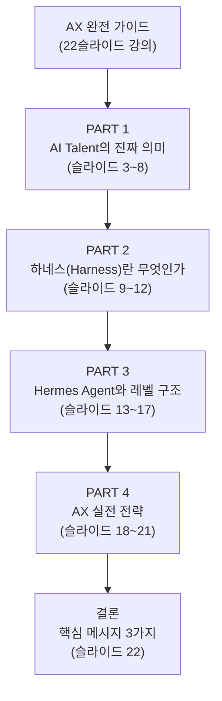
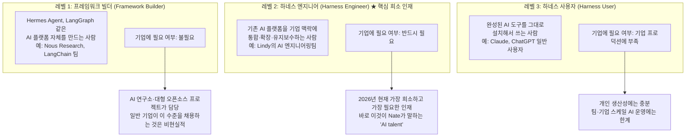
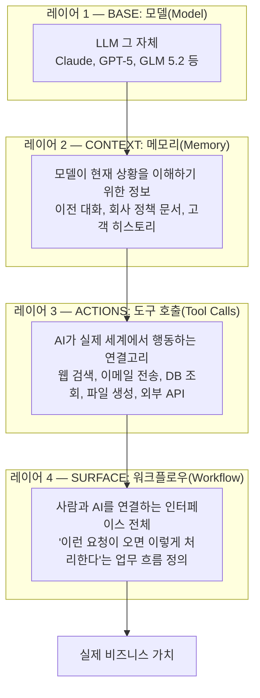
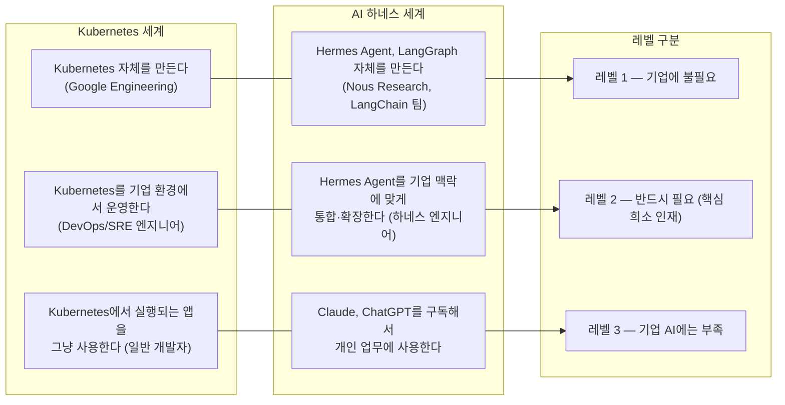
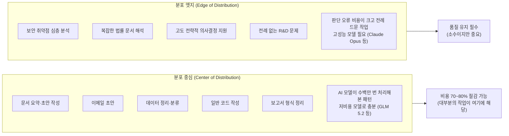
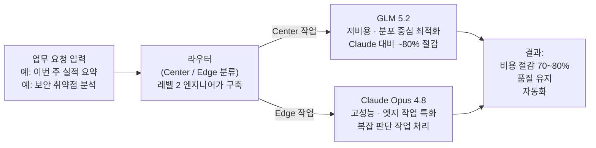

## AI Talent · Harness Engineering · Hermes Agent — 초보자 강의 자료 해설

> **대상 독자**: AI·IT 분야 입문자, AX 전략을 처음 접하는 실무자  
> **출처 및 근거**: Deloitte State of AI 2026, Harvard Business Review(2026.03), RAND Corporation, Databricks Blog(2026.05) 등 공개된 최신 연구 자료  

## 관련글

[**GLM 5.2는 무료인데 왜 기업들은 전환하지 못하는가?**](https://k82022603.github.io/posts/glm-5.2%EB%8A%94-%EB%AC%B4%EB%A3%8C%EC%9D%B8%EB%8D%B0-%EC%99%9C-%EA%B8%B0%EC%97%85%EB%93%A4%EC%9D%80-%EC%A0%84%ED%99%98%ED%95%98%EC%A7%80-%EB%AA%BB%ED%95%98%EB%8A%94%EA%B0%80/)

---

## 목차

1. [강의 개요 — 왜 이 주제인가](#1-강의-개요)
2. [PART 1 — AI Talent의 진짜 의미](#2-part-1--ai-talent의-진짜-의미)
3. [PART 2 — 하네스(Harness)란 무엇인가](#3-part-2--하네스harness란-무엇인가)
4. [PART 3 — Hermes Agent와 레벨 구조](#4-part-3--hermes-agent와-레벨-구조)
5. [PART 4 — AX 실전 전략](#5-part-4--ax-실전-전략)
6. [결론 — 핵심 메시지 3가지](#6-결론--핵심-메시지-3가지)
7. [참고 자료](#7-참고-자료)

---

## 1. 강의 개요

### 1.1 이 강의가 필요한 이유

"AI를 도입했는데 왜 효과가 없지?"

2026년 기준으로 기업 AI 도입률은 매우 높다. Deloitte가 약 3,700명의 전문가를 대상으로 실시한 조사에 따르면, 대부분의 조직이 AI 사용에 대한 의문을 넘어섰지만, 일하는 방식을 실질적으로 재설계한 곳은 여전히 소수에 불과하다. 즉, 도구는 들어왔지만 조직이 달라지지 않은 것이다.

이 강의 자료는 바로 그 격차를 설명한다. AI 모델(Claude, GPT, GLM 5.2 등)을 구독하는 것과 그것으로 실제 비즈니스 가치를 만드는 것 사이에는 커다란 간극이 있다. 그 간극을 채우는 것이 **AX(AI Transformation)** 이며, 이 강의는 AX를 가능하게 하는 세 가지 핵심 개념인 **AI Talent**, **하네스(Harness)**, **Hermes Agent**를 중심으로 설명한다.

### 1.2 강의 구성 — 4개 파트

파트 1에서는 "AI Talent"라는 말의 오해와 진실을 다루며, 기업이 실제로 필요한 인재가 누구인지 정의한다. 파트 2에서는 AI 모델이 실제로 작동하려면 무엇이 필요한지, 즉 하네스 개념을 설명한다. 파트 3에서는 Hermes Agent 같은 기성 도구가 있는 상황에서 여전히 전문 엔지니어가 필요한 이유를 구체적으로 설명한다. 파트 4에서는 실제 기업이 AX를 추진할 때 반드시 실행해야 할 전략 세 가지를 다룬다.

---

## 2. PART 1 — AI Talent의 진짜 의미

### 2.1 가장 흔한 오해

많은 사람들이 "AI Talent(AI 인재)"라고 하면 AI 모델을 연구하는 과학자, 딥러닝 알고리즘을 개발하는 엔지니어, 또는 데이터 사이언티스트를 떠올린다. 그래서 기업들은 AI 인재를 채용할 때 머신러닝 박사 학위자나 PyTorch 전문가를 찾는다.

그런데 현실은 다르다. Deloitte의 2026년 기업 AI 현황 보고서에 따르면, 불충분한 인력 기술이 AI를 실제 업무에 통합하는 데 있어 가장 큰 장벽으로 나타났다. 그런데 고용만으로는 이 격차를 해소할 수 없다. 시장에 경험 있는 실무자가 충분하지 않기 때문이다.

이 표현에 주목할 필요가 있다. "경험 있는 실무자가 부족하다"고 할 때, 이것은 AI 논문을 쓰는 연구자가 부족하다는 말이 아니다. 기업의 실제 업무 환경에서 AI를 작동시켜 본 사람, 즉 **Last Mile Builder(마지막 한 걸음을 만드는 사람)** 가 부족하다는 의미다.

### 2.2 영상이 말하는 진짜 정의

AI 전략 분석가 Nate B Jones는 이를 명확하게 표현한다.

> *"The only companies that can build their own last mile harnesses, their own auto routers, are companies that can afford the AI talent to do that, which is very scarce."*

이 문장에서 "AI talent"가 가리키는 것은 두 가지 능력을 동시에 갖춘 사람이다. 첫째는 AI 모델이 실제 업무 시스템과 연동되는 **하네스**를 처음부터 설계하고 구축하는 능력이다. 둘째는 어떤 작업을 어떤 모델로 보낼지 실시간으로 판단하는 **자동 라우터**를 만드는 능력이다. 이 두 가지를 할 수 있는 사람이 바로 **레벨 2 하네스 엔지니어**이며, 이것이 기업 AX 현장에서 말하는 진짜 "AI Talent"다.

### 2.3 AI Talent 3가지 레벨

AI 관련 인재를 역할과 역량에 따라 세 가지 레벨로 구분하면 기업의 인재 전략이 명확해진다.

**레벨 1 — 프레임워크 빌더**: LangGraph를 만드는 LangChain 팀, Hermes Agent를 만든 Nous Research, Claude를 만든 Anthropic의 엔지니어들이 여기에 해당한다. 대부분의 기업은 이 레벨의 인재가 필요하지 않다. 이미 훌륭한 도구들이 충분히 존재하고, 직접 만드는 것보다 가져다 쓰는 것이 훨씬 효율적이다.

**레벨 2 — 하네스 엔지니어**: 이것이 바로 2026년 기업 현장에서 가장 희소하고 가장 수요가 높은 인재다. 이들은 이미 존재하는 AI 도구를 가져다가, 기업의 특수한 환경에 맞게 통합하고 확장하며 유지보수하는 사람들이다. 쉽게 말해 "AI 도구를 우리 회사에서 실제로 작동하게 만드는 사람"이다.

**레벨 3 — 하네스 사용자**: 완성된 AI 도구를 그대로 쓰는 사람들이다. 개인 생산성 도구로는 충분하지만, 기업 규모의 AI 시스템을 구축하고 유지하는 데는 한계가 있다.

### 2.4 레벨 2가 하는 5가지 일

레벨 2 하네스 엔지니어가 실제로 기업에서 하는 일은 다음 다섯 가지로 정리된다.

**① 모델 간 동작 차이 이해 및 조정**: GLM 5.2와 Claude Opus 4.8은 같은 질문에도 다른 형식으로 응답하고, 도구를 사용하는 방식도 다르다. 레벨 2 엔지니어는 이 차이를 파악하고 각 모델에 맞게 프롬프트 구조와 도구 호출 방식을 조정한다. 이것이 "단순히 API 주소를 바꾸는 것"과 다른 점이다.

**② 작업 라우터 구축**: 일상적인 이메일 요약은 GLM 5.2 같은 저렴한 모델로, 복잡한 보안 분석은 Claude Opus 같은 고성능 모델로 자동 배분하는 시스템을 만든다. 이것이 바로 Nate B Jones가 말하는 "auto router"다.

**③ 회사 전용 Skills 개발**: Hermes Agent나 LangGraph 같은 범용 플랫폼에는 없는, 우리 회사 ERP, 사내 발주 시스템, 특수 승인 워크플로우를 AI가 처리할 수 있는 플러그인을 직접 만든다.

**④ 거버넌스·컴플라이언스 레이어 설계**: AI가 어떤 데이터에 접근할 수 있는지, 어떤 행동은 자동으로 처리하고 어떤 것은 사람의 승인이 필요한지를 정의한다. 특히 금융, 의료, 공공 분야에서는 SOC2, 의료정보보호법 등 규제 요건에 맞는 감사 로그도 설계해야 한다.

**⑤ 평가 및 관찰성 파이프라인**: AI 시스템이 실제로 잘 작동하는지 측정하는 체계를 만든다. 모델을 교체하거나 업데이트했을 때 품질이 유지되는지 검증하고, 프로덕션에서 AI 행동을 모니터링한다.

### 2.5 왜 레벨 2 인재는 이렇게 희소한가

세 가지 구조적 이유가 있다.

**이유 1 — 신생 분야라 교육이 없다**: "하네스 엔지니어링(Harness Engineering)"은 2026년 2월에야 독립적인 분야로 명명된 직군이다. HashiCorp·Terraform 창시자 Mitchell Hashimoto의 블로그 포스트에서 처음 명명된 이후, OpenAI의 Ryan Lopopolo가 프로덕션 적용 사례를 발표하면서 업계 표준 용어가 되었다. 대학 커리큘럼에 없고, 부트캠프도 아직 따라잡지 못했으며, 오직 실제 프로덕션 AI 시스템을 구축하고 실패하면서 얻어지는 경험으로만 쌓을 수 있다.

**이유 2 — 주니어 인재 공급망이 무너지고 있다**: 스탠퍼드대 연구에 따르면 생성형 AI 도구가 보편화된 이후, AI 노출도가 높은 직군에서 초기 경력자 고용이 13% 상대적으로 감소했다. 기업들이 AI로 비용을 절감하면서 주니어 개발자 채용을 줄이고 있는데, 바로 이 주니어들이 3~5년 후 시니어 하네스 엔지니어가 될 인재풀이었다. 씨앗을 먹어치우고 있는 셈이다.

**이유 3 — 있는 인재는 대형 기업이 독식한다**: PwC의 2025년 글로벌 AI 일자리 지표에 따르면 AI 기술을 보유한 근로자는 동료 대비 최대 56% 높은 임금을 받는다. 레벨 2 인재들은 원하는 보수를 요구할 수 있고, 대부분은 Google, Microsoft, Anthropic 같은 대형 기술 기업으로 흡수된다. 일반 기업 입장에서는 그 비용을 감당하기 어렵다.

---

## 3. PART 2 — 하네스(Harness)란 무엇인가

### 3.1 "모델은 병 속의 두뇌"

파트 2의 핵심 개념은 단 하나의 비유로 설명된다.

**"모델은 병 속의 두뇌(Brain in a Jar)다."**

아무리 뛰어난 두뇌라도 병 속에 갇혀 있으면 아무 일도 할 수 없다. 두뇌가 실제로 생각하고 행동하려면 그 두뇌를 둘러싼 몸체가 필요하다. AI 모델도 마찬가지다. GPT-5.5, Claude Opus 4.8, GLM 5.2 — 아무리 뛰어난 모델도 그것을 둘러싼 시스템 없이는 혼자서 아무것도 할 수 없다.

Harvard Business Review는 이를 이렇게 표현한다. AI 진보의 주요 장애물은 모델 품질이나 데이터 가용성이 아니라, 기술적 능력이 조직 설계와 만나야 하는 '마지막 한 걸음'에 있다.

이 "마지막 한 걸음"을 가능하게 하는 것이 바로 **하네스(Harness)** 다.

### 3.2 하네스의 정의

HuggingFace의 AI 엔지니어 Philipp Schmid는 하네스를 이렇게 비유한다.

> 모델은 CPU다 — 원시 연산 능력만 있다.  
> 컨텍스트 윈도우는 RAM이다 — 제한적이고 휘발성 있는 작업 메모리다.  
> **하네스는 운영체제(OS)다** — 컨텍스트를 관리하고, 부팅 시퀀스를 처리하고, 표준 드라이버를 제공하며, 자원을 관리한다.

이 비유가 탁월한 이유는 직관적이기 때문이다. CPU만 있으면 컴퓨터가 켜지지 않는다. Windows나 macOS 같은 운영체제가 있어야 비로소 컴퓨터를 쓸 수 있다. 마찬가지로, AI 모델만 있고 하네스가 없으면 기업 AI는 작동하지 않는다.

### 3.3 하네스의 4계층 구조

하네스는 네 가지 레이어로 구성된다.

**레이어 1 — 모델**: LLM 그 자체다. 이것만으로는 아무것도 할 수 없지만, 없으면 시작되지 않는다.

**레이어 2 — 메모리**: 모델이 현재 상황을 이해하기 위한 모든 정보다. 이것이 없으면 AI는 매번 처음 만나는 사람처럼 행동한다. 이전 대화 기록, 회사 정책 문서, 고객 히스토리, 프로젝트 진행 상황이 모두 메모리 레이어에서 관리된다.

**레이어 3 — 도구 호출**: AI가 실제 세계에서 행동할 수 있게 하는 연결고리다. 이것 없이는 AI가 텍스트만 생성할 뿐 실제 작업을 수행할 수 없다.

**레이어 4 — 워크플로우**: 위 세 가지를 엮어 실제 업무 흐름으로 만드는 오케스트레이션이다. 하네스 엔지니어가 가장 많은 시간을 투자하는 레이어다.

### 3.4 하네스 없을 때 vs 있을 때 — 구체적 예시

**인사부서 직원 성과 평가 업무를 예로 들면:**

하네스 없이 AI 모델만 있는 경우, 인사 담당자가 "이 직원의 올해 성과를 평가해줘"라고 입력하면 AI는 일반적인 성과 평가 기준에 대한 텍스트를 생성한다. 해당 직원이 누구인지, 어떤 목표를 설정했는지, 실제로 어떤 성과를 냈는지 모르기 때문이다. 이것은 아무 가치가 없다.

하네스가 구축된 경우, 같은 요청이 들어오면 AI는 자동으로 HR 시스템에서 직원의 업무 목표(OKR), 프로젝트 참여 기록, 동료 평가 데이터를 가져오고, 이전 연도 평가와 비교하여 성장 추이를 분석하며, 회사의 성과 평가 기준 문서를 참조하여 초안을 작성한다. 담당자는 AI가 제안한 초안을 검토하고 수정하면 된다.

이 차이가 바로 "AI를 쓴다"와 "AI로 실제 가치를 만든다"의 차이다.

---

## 4. PART 3 — Hermes Agent와 레벨 구조

### 4.1 Hermes Agent란 무엇인가

Hermes Agent는 AI 연구소 Nous Research가 2026년 2월 MIT 오픈소스 라이선스로 출시한 AI 에이전트 플랫폼이다. 이 플랫폼의 핵심 특징은 "하네스가 이미 내장된 에이전트 런타임"이라는 점이다.

대부분의 AI 도구(Claude Code, Cursor, Aider 등)는 사용자가 직접 하네스를 구성해야 한다. CLAUDE.md 파일, hooks, memory 파일, workflows를 수동으로 만들어야 한다. Hermes Agent는 이 과정을 자동화했다. 사용 경험에서 자동으로 Skills(기능 플러그인)를 생성하고 개선하며, 세션이 종료되어도 대화 맥락이 유지된다. OpenAI, Anthropic, Z.ai(GLM 5.2) 등 어떤 AI 제공업체와도 연동되는 모델 불가지론적 구조를 채택했으며, Telegram, Discord, Slack, WhatsApp 등 17개 이상의 메시징 플랫폼을 지원한다.

### 4.2 핵심 질문 — "그냥 Hermes Agent 쓰면 되는 거 아닌가?"

이것은 매우 합리적인 질문이다. 그런데 답은 "그렇기도 하고, 아니기도 하다"이다.

강의에서는 이 질문에 대해 세 가지 선택지를 제시하고 그중 두 가지가 잘못된 것임을 보여준다.

**잘못된 생각 1**: "Hermes Agent를 그냥 설치해서 쓰면 기업 수준의 AI가 완성된다" — 이것은 틀렸다.

**잘못된 생각 2**: "Hermes Agent를 처음부터 만들 수 있는 수준의 엔지니어(레벨 1)가 필요하다" — 이것도 틀렸다.

**올바른 이해**: "Hermes Agent 같은 도구를 기업 맥락에 맞게 통합·확장할 레벨 2 엔지니어가 필요하다" — 이것이 맞다.

### 4.3 Kubernetes 비유로 이해하는 이유

이 개념을 이해하는 데 Kubernetes 비유가 가장 효과적이다.

Kubernetes는 누구나 무료로 설치할 수 있다. 그런데 "Kubernetes가 있으니 DevOps 엔지니어 없이 대규모 서비스를 운영해도 된다"고 말하는 기업은 없다. Kubernetes를 설치하는 것은 쉽다. 하지만 수천 명의 사용자를 위해 24시간 안정적으로 운영하는 것은 깊은 전문 지식이 필요하다.

Hermes Agent도 정확히 같은 구조다.

### 4.4 레벨 2가 Hermes Agent로 실제로 하는 일

Hermes Agent를 기업 환경에 도입했을 때 레벨 2 엔지니어가 실제로 해야 하는 작업을 구체적으로 살펴보면 다음과 같다.

**모델 전환 설정 및 최적화**: Hermes Agent는 모델 교체가 간단한 명령 하나로 가능하다. 그러나 단순히 모델 이름을 바꾸는 것이 전환의 전부가 아니다. Lindy가 Claude에서 DeepSeek v4 Flash로 전환할 때 6~9개월이 걸린 이유가 바로 이것이다. 프롬프트 구조, 도구 호출 방식, 메모리 압축 전략을 해당 모델의 특성에 맞게 전부 재조정해야 했다. 레벨 2 엔지니어는 `hermes model glm-5.2`를 입력하는 것이 아니라, GLM 5.2가 Claude와 다르게 반응하는 엣지 케이스를 파악하고 평가 파이프라인을 재조정한다.

**회사 전용 Skills 개발**: Hermes의 Skills Hub에는 수천 개의 공개 Skills가 있다. 하지만 우리 회사 ERP에서 발주를 생성하는 Skills, 사내 결재 시스템과 연동하는 Skills, 특수한 승인 워크플로우를 처리하는 Skills는 직접 만들어야 한다.

**비즈니스 특화 작업 라우터 구축**: 어떤 작업을 GLM 5.2로 보내고, 어떤 것을 Claude Opus로 보낼지 결정하는 로직은 Hermes Agent에 내장되어 있지 않다. 이것이 레벨 2 엔지니어가 설계하고 구현해야 하는 핵심 작업이다.

**거버넌스·감사 레이어 설계**: Hermes Agent의 자기 수정(self-modifying) Skills 기능은 개인 개발자에게는 강점이지만, SOC2 감사가 필요한 엔터프라이즈 환경에서는 이 기능을 어떻게 제한하고 기록하고 검증할지 설계해야 한다. 금융·의료·공공 분야의 AI 도입에서 이 부분은 필수적이다.

**평가·관찰성 파이프라인 연결**: LangSmith, Langfuse 같은 관찰성 도구를 Hermes와 연결하고, 모델 전환 전후의 품질을 체계적으로 비교하는 프레임워크를 구축한다. "잘 되는 것 같다"는 체감이 아니라, 측정 가능한 지표로 품질을 검증해야 한다.

---

## 5. PART 4 — AX 실전 전략

Deloitte의 보고서는 기업을 AI 활용 방식에 따라 세 그룹으로 나눈다. 34%는 새로운 제품·서비스를 만들거나 핵심 프로세스를 재편하는 방식으로 비즈니스를 심층 변혁하고 있다. 30%는 핵심 프로세스를 재설계하고 있다. 나머지 37%는 기존 업무 흐름에 거의 또는 전혀 변화 없이 표면적인 수준에서 AI를 사용하고 있다.

37%는 AI 도구를 "쓰고는 있지만" 실질적인 변화는 없는 상태다. AX를 통해 34%에 속하려면 무엇이 필요한가? 강의에서는 세 가지 핵심 전략을 제시한다.

### 5.1 전략 1 — 작업 분포(Task Distribution) 분석

모든 AX 전략의 출발점은 이 질문이다. **"우리 조직의 AI 업무 중 얼마가 '일상적인 패턴 작업'이고, 얼마가 '전례 없는 복잡한 판단을 요구하는 작업'인가?"**

이것을 **분포 중심(Center of Distribution)** 작업과 **분포 엣지(Edge of Distribution)** 작업으로 구분한다.

인류 집합적 지식 노동의 대부분은 분포 중심에 속한다. 우리 조직의 AI 업무도 대부분 마찬가지일 가능성이 높다. 이것을 체계적으로 측정한 후, 분포 중심 작업은 GLM 5.2 같은 저비용 모델로, 분포 엣지 작업만 Claude Opus 같은 고성능 모델로 배분하는 스마트 라우팅 전략을 수립할 수 있다.

### 5.2 전략 2 — 스마트 라우팅 시스템

스마트 라우팅은 들어오는 업무 요청을 실시간으로 분류하여 가장 비용 효율적인 모델로 자동 배분하는 시스템이다.

이 라우터를 구축하는 능력이 레벨 2 엔지니어의 가장 중요한 역량 중 하나다. Harvard Business Review 연구자들이 지적하듯, AI 변환의 주요 장애물은 모델 품질이나 데이터 가용성이 아니라 기술적 능력과 조직 설계가 만나는 마지막 한 걸음에 있다. 스마트 라우팅 시스템은 바로 그 "마지막 한 걸음"의 핵심 구성요소다.

### 5.3 전략 3 — 컨텍스트 소유 전략

AX에서 가장 중요하고 가장 자주 간과되는 전략적 결정이다. **"회사의 지식과 맥락을 외부 AI 제공업체에게 맡길 것인가, 아니면 자사가 소유하고 통제할 것인가?"**

이것을 **임대(Rent) 전략**과 **소유(Own) 전략**으로 구분한다.

**임대 전략**은 Claude Tag(Anthropic), OpenAI Assistants 같은 관리형 서비스를 사용하는 것이다. 즉시 시작할 수 있고 초기 비용이 낮으며, 레벨 2 엔지니어 없이도 시작 가능하다. 그러나 회사의 지식과 맥락이 외부 서버에 축적되고, 나중에 다른 모델로 전환하려 하면 그 맥락이 사라진다. 장기적으로는 공급업체 종속(Vendor Lock-in) 위험이 있으며, 한국의 망분리 규정이나 AI 기본법 등 데이터 주권 문제와 충돌할 수도 있다.

**소유 전략**은 Hermes Agent와 LangGraph 같은 오픈소스 도구로 직접 구축하는 것이다. 초기 구축 비용과 시간이 필요하고 레벨 2 엔지니어가 반드시 필요하지만, 회사 지식과 맥락을 자사 서버에 보관하고, 모델을 자유롭게 교체할 수 있으며, 비용 절감을 극대화할 수 있다.

중요한 것은 어느 쪽이 무조건 옳다는 것이 아니라는 점이다. 각 전략에는 장단점이 있으며, 자신의 상황(규제 환경, 기술 역량, 비용 구조)에 맞는 선택을 **의식적으로, 전략적으로** 해야 한다. 아무 생각 없이 편리한 서비스를 쓰다 보면 어느 순간 빠져나오기 어려운 상태가 된다.

---

## 6. 결론 — 핵심 메시지 3가지

강의는 세 가지 핵심 메시지로 마무리된다.

### 메시지 1: AI Talent = Last Mile Builder

기업이 필요한 AI 인재는 AI 연구자가 아니다. 레벨 1(프레임워크 빌더)은 불필요하고, 레벨 3(그냥 사용자)으로는 기업 규모의 AI 운영이 불가능하다. 레벨 2 — 기존 도구를 기업 맥락에 통합·확장하는 하네스 엔지니어가 핵심이다.

Deloitte는 AI 기술 격차가 더 깊은 통합의 가장 일반적인 장벽이라고 밝혔다. 가장 성공적인 조직들은 인간의 강점과 AI 역량을 원활하게 결합하는 방식으로 업무를 재설계했다.

### 메시지 2: Hermes Agent = 도구, 엔지니어 ≠ 도구

Hermes Agent 같은 완성된 하네스 도구가 있어도 레벨 2 엔지니어는 여전히 필요하다. Kubernetes가 있어도 DevOps 엔지니어가 필요하듯, 도구는 사람을 대체하지 않고 사람의 역할을 바꾼다. 레벨 2 엔지니어는 도구를 만드는 사람이 아니라, 도구를 우리 회사에서 실제로 작동하게 만드는 사람이다.

### 메시지 3: 컨텍스트를 의식적으로 소유하라

지금 당장 시작은 관리형 서비스(Claude Tag 등)로 해도 된다. 그러나 회사의 지식과 맥락이 어디에 쌓이고 있는지 반드시 인식하고, 장기적으로 어떻게 할지 전략적으로 결정해야 한다.

Deloitte 연구에 따르면, 지금 운영 질문으로 다루어지는 것이 2026년 말에는 전략 질문으로 보일 수 있다. "AI가 추가된" 기업과 "AI로 전환한" 기업 사이의 격차는 성과 데이터에서 점점 더 가시적으로 나타날 것이다.

---

## 7. 참고 자료

이 강의 자료와 해설 문서는 다음 출처의 검증된 정보를 기반으로 한다.

- **Deloitte, "State of AI in the Enterprise 2026"** — 기업 AI 도입 현황, AI 인재 전략, 성공 기업의 공통점  
  https://www.deloitte.com/us/en/what-we-do/capabilities/applied-artificial-intelligence/content/state-of-ai-in-the-enterprise.html

- **Harvard Business Review, "The Last Mile Problem Slowing AI Transformation" (2026.03)**  
  https://hbr.org/2026/03/the-last-mile-problem-slowing-ai-transformation

- **Databricks Blog, "Why Talent Transformation is the Missing Focus of Enterprise AI" (2026.05)**  
  https://www.databricks.com/blog/why-talent-transformation-missing-focus-enterprise-ai

- **Metaintro, "Why Companies Struggle to Finish What AI Starts" (2026.03)**  
  https://www.metaintro.com/blog/last-mile-problem-slowing-ai-transformation-workplace-2026

- **MarketScale, "Enterprise AI Moves from Pilot to Production in 2026" (2026.06)**  
  https://www.marketscale.com/industries/software-and-technology/enterprise-ai-moves-from-pilot-to-production-in-2026-but-gaps-in-governance-and-talent-persist

- **Gloat, "AI Workforce Trends 2026 (Q2 Update)" (2026.05)**  
  https://gloat.com/blog/ai-workforce-trends/

- **Nate B Jones, "GLM 5.2 Is Free And Beats Claude On Most Work. So Why Can't Companies Switch?" (YouTube, 2026.06.29)**  
  https://www.youtube.com/watch?v=Zp8lr6IzUnQ

- **PwC, "2025 Global AI Jobs Barometer"**

---

*작성일자: 2026-07-01*
