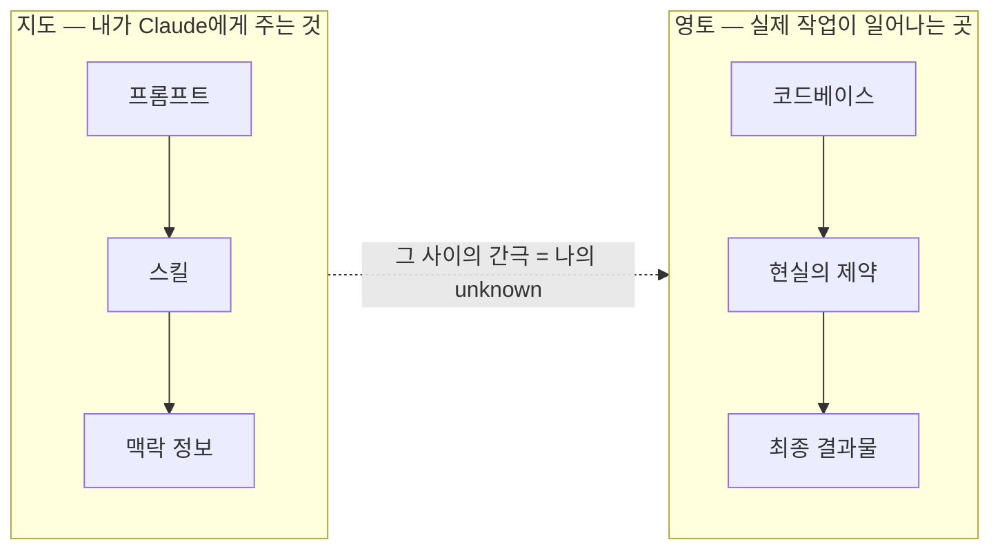
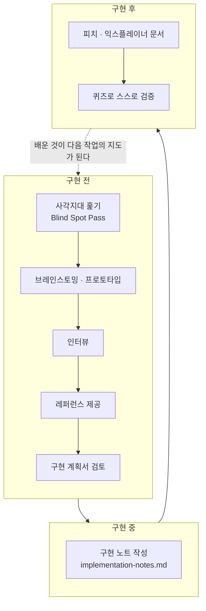
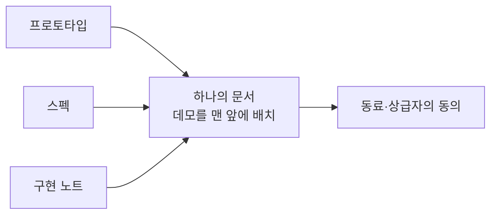

*Claude Code를 만든 Thariq([@trq212](https://x.com/trq212/status/2073100352921215386))의 아티클 **"A Field Guide to Fable: Finding Your Unknowns"**(2026년 7월 3일 게시)와, 이를 정리한 Threads 게시물([@choi.openai](https://www.threads.com/@choi.openai/post/DaXNultjy9x), 2026년 7월 4일)을 바탕으로, 관련 사실관계를 웹 검색으로 재확인하여 작성한 해설 문서입니다.*

---

## 목차

1. 이 문서는 무엇을 다루는가
2. Claude Fable 5, 지금 어떤 모델인가 — 사실관계 정리
3. 지도는 영토가 아니다 — Thariq가 던진 질문
4. 네 개의 방: unknown을 나누는 법
5. 구현 전에 쓰는 다섯 가지 기법
6. 구현 중에 쓰는 기법: 구현 노트
7. 구현 후에 쓰는 기법: 피치·익스플레이너, 그리고 퀴즈
8. 실전 사례: Fable 런칭 영상은 어떻게 만들어졌나
9. 같은 문제를 다르게 말한 사람들
10. 조하리의 창, 그리고 unknown
11. 정리하며

---

## 1. 이 문서는 무엇을 다루는가

2026년 7월 3일, Anthropic의 Claude Code 팀에서 일하는 Thariq라는 인물이 X(옛 트위터)에 긴 아티클 하나를 올렸습니다. 제목은 "A Field Guide to Fable: Finding Your Unknowns", 우리말로 옮기면 "Fable 야전 가이드: 나의 미지수를 찾아서" 정도가 됩니다. 이 글은 게시 하루 만에 수만 회의 조회수를 기록했고, 다음 날인 7월 4일에는 한국의 AI 커뮤니티 계정인 @choi.openai가 이 내용을 스레드 형태로 요약해 소개했습니다. 이 문서는 그 두 게시물의 내용을 뼈대로 삼되, Fable 5라는 모델 자체에 대한 사실관계와 글에서 언급된 여러 배경 정보를 실제로 검색해 확인한 뒤 다시 정리한 것입니다.

이 글의 핵심 주장은 한 문장으로 요약됩니다. 모델이 아무리 강력해져도, 결과물의 질을 가르는 마지막 병목은 모델의 능력치가 아니라 "내가 무엇을 모르는지를 내가 얼마나 잘 알고 있는가"라는 것입니다. Thariq는 Fable 5를 두고 이렇게 적었습니다. 자신이 지금까지 다뤄본 모델 중, 작업 결과물의 품질이 모델 성능이 아니라 자신이 스스로의 모호함(unknown)을 얼마나 명확히 해뒀는지에 의해 막히는 첫 번째 모델이라는 것입니다. 다르게 말하면, 모델의 실력이 사람의 실력을 추월해버린 지점에서는, 이제 잘 쓰는 사람과 그렇지 않은 사람을 가르는 기준이 "얼마나 정교하게 지시했는가"가 아니라 "자기 자신이 무엇을 모르는지 얼마나 자각하고 있는가"로 옮겨간다는 뜻입니다.

## 2. Claude Fable 5, 지금 어떤 모델인가 — 사실관계 정리

본론에 들어가기 전에, Fable 5라는 모델 자체에 대해 최신 정보를 검색해 확인한 사실관계를 먼저 정리해 둡니다. 이 글이 다루는 방법론은 결국 이 모델과 함께 일하는 법에 관한 것이기 때문에, 모델의 현재 상태를 정확히 아는 것이 먼저입니다.

Anthropic은 2026년 6월 9일, Claude Fable 5와 Claude Mythos 5라는 두 모델을 동시에 공개했습니다. 두 모델은 근본적으로 같은 가중치를 공유하는 하나의 모델이며, 차이는 안전장치의 유무에 있습니다. Anthropic은 이 새로운 등급을 "Mythos급"이라 부르는데, 이는 기존의 Opus급보다 한 단계 위에 있는 새로운 성능 티어입니다. Mythos급 모델이 처음 등장한 것은 2026년 4월, Project Glasswing이라는 프로그램을 통해 미국 정부와 협력하는 소수의 사이버 방어 조직에게만 제한적으로 공개된 Claude Mythos Preview였습니다. Fable 5와 Mythos 5는 이 계열의 두 번째 세대이며, Fable 5는 그중 처음으로 일반 대중에게 공개된 버전입니다.

Anthropic이 밝힌 벤치마크에 따르면 Fable 5는 소프트웨어 엔지니어링, 지식노동, 시각 이해, 과학 연구 등 거의 모든 항목에서 이전 최고 모델이었던 Opus 4.8을 앞섭니다. 구체적으로는 SWE-bench Verified에서 95.0%, 더 어려운 실전형 벤치마크인 SWE-bench Pro에서 80.3%를 기록했는데, 이는 Opus 4.8의 69.2%나 경쟁 모델인 GPT-5.5의 58.6%보다 상당히 높은 수치입니다. 결제 서비스 기업 Stripe는 초기 테스트에서 5천만 줄 규모의 루비 코드베이스 전체를 다시 짜는 마이그레이션 작업을, 팀 전체가 수작업으로 하면 두 달 넘게 걸릴 일을 Fable 5가 하루 만에 해냈다고 보고했습니다. 데이터 분석 기업 Hex(또는 이를 인용한 Sigma 등 파트너사)는 자사의 복잡한 장기 분석 과제 벤치마크에서 Fable 5가 처음으로 90%를 돌파했으며, 이는 Opus 대비 10점포인트나 뛴 결과라고 밝혔습니다. 물리학 연구 기업 Kensho의 Matthew Pines는 GPT-5.5가 나흘 걸려 도달한 지점에 Fable 5는 36시간 만에 거의 도달했다고 전했습니다.

다만 여기에는 중요한 단서가 붙습니다. Fable 5는 사이버보안, 생물학·화학, 모델 증류(distillation)와 관련된 요청을 감지하는 별도의 분류기(classifier)를 얹은 채로 출시됐습니다. 이 분류기가 작동하면 사용자의 요청은 조용히 Opus 4.8로 넘어가 처리되며, Anthropic은 이 사실을 사용자에게 알려주고 해당 요청에 대해서는 Fable 5 요금을 청구하지 않습니다. Anthropic은 이 안전장치가 전체 세션의 5% 미만에서 작동한다고 밝혔는데, 바꿔 말하면 95% 이상의 대화에서는 사용자가 실질적으로 안전장치가 풀린 버전인 Mythos 5와 동등한 성능을 체감하게 된다는 뜻이기도 합니다. 가격은 백만 토큰당 입력 10달러, 출력 50달러로, Opus 4.8의 두 배 수준이며 이전 세대인 Mythos Preview보다는 절반 이하로 낮아졌습니다.

이 모델은 출시 직후 순탄치 않은 시기를 겪었습니다. 출시 사흘 뒤인 2026년 6월 12일, 미국 정부의 수출통제 조치로 인해 Anthropic은 구독 서비스와 API를 가리지 않고 Fable 5와 Mythos 5에 대한 접근을 전면 중단해야 했습니다. 이 조치는 6월 30일 백악관이 해당 수출통제를 해제하면서 풀렸고, Anthropic은 7월 1일 전 세계적으로 Fable 5 접근을 복구했습니다. 이 문서를 작성하는 시점(2026년 7월 5일) 기준으로 Fable 5는 다시 정상적으로 이용 가능한 상태입니다. 다만 구독 요금제(Pro·Max·Team·좌석 기반 Enterprise) 안에서 추가 비용 없이 포함되던 기간은 6월 9일부터 22일까지였고, 그 이후로는 사용량 크레딧을 통해 이용해야 하며, Anthropic은 용량이 허락하는 대로 다시 요금제에 기본 포함시키겠다는 방침을 밝힌 상태입니다.

한 가지 더 짚어둘 점이 있습니다. Thariq의 아티클이 게시되기 이틀 전인 7월 2일, Anthropic은 Claude Code에 Artifacts 기능을 가져오는 업데이트를 발표했습니다. 이는 Claude Code 세션에서 진행 중인 작업을 실시간으로 갱신되는 웹페이지 형태로 만들어, PR 설명이나 대시보드, 체크리스트처럼 공유 가능한 산출물로 바로 게시할 수 있게 하는 기능이며, Pro와 Max 요금제 사용자에게도 열렸습니다. (참고로 채팅 화면에서 쓰는 일반적인 Artifacts 기능 자체는 이미 오래전부터 무료 요금제를 포함한 대부분의 플랜에서 사용 가능했으며, 이번에 새로 확장된 것은 "Claude Code 안에서의 Artifacts"라는 보다 구체적인 기능입니다.) Thariq의 글에서 반복적으로 등장하는 "HTML로 시각화해서 보여달라"는 요청 패턴이 실제로 이 기능과 맞닿아 있다는 점에서, 이 업데이트는 그의 방법론이 왜 지금 특히 힘을 받는지를 보여주는 배경이기도 합니다.

## 3. 지도는 영토가 아니다 — Thariq가 던진 질문

Thariq는 이 글을 폴란드 출신 학자 알프레드 코집스키가 남긴 오래된 문장 하나로 시작합니다. "지도는 영토가 아니다." 그는 이 비유를 자신의 작업 방식에 그대로 옮겨 씁니다. 그가 말하는 지도란 자신이 Claude에게 건네는 것, 즉 프롬프트와 스킬과 그 밖의 맥락 정보 전부를 뜻합니다. 반면 영토는 실제로 일이 벌어지는 공간, 다시 말해 방대한 코드베이스와 현실 세계, 그리고 그 안에 존재하는 온갖 제약 조건입니다.

지도와 영토 사이에는 필연적으로 간극이 생깁니다. 아무리 상세한 지도라도 영토의 모든 굴곡과 표지판, 갈림길을 담아낼 수는 없습니다. Thariq는 바로 이 간극을 "unknown(미지수)"이라 부릅니다. Claude가 작업을 수행하다가 이 간극, 즉 unknown에 부딪히면, 사용자가 정말로 무엇을 원하는지 스스로 추론해서 결정을 내려야 하는 상황에 놓입니다. 그리고 맡기는 작업의 규모가 커지고 복잡해질수록, 이런 추론과 판단이 필요한 지점의 숫자도 함께 늘어납니다.

아래는 이 관계를 도식으로 정리한 것입니다.

Thariq는 Claude를 지시하는 일을 일종의 아슬아슬한 균형잡기라고 표현합니다. 지시가 지나치게 구체적이면, 상황을 봐서 방향을 트는 편이 더 나을 때조차 Claude는 시킨 그대로만 따라갑니다. 반대로 지시가 지나치게 모호하면, Claude는 업계의 일반적인 관행을 기준 삼아 판단하는데, 그 판단이 사용자의 실제 상황에는 맞지 않는 경우가 많습니다. 문제는 사용자가 자신의 unknown을 미리 계산해두지 않으면 이 양쪽 실패를 모두 피할 방법이 없다는 데 있습니다. 길이 막혀 있어서 신중하게 가야 할 때인지, 아니면 뻥 뚫려 있어서 Claude가 알아서 방향을 틀어도 괜찮은 때인지조차 스스로 알지 못하기 때문입니다.

## 4. 네 개의 방: unknown을 나누는 법

Thariq는 자신이 문제를 마주할 때 무의식적으로 네 칸으로 나눠 생각한다고 설명합니다. 이 네 칸의 틀은 원래 심리학이나 정보 이론, 군사 전략 분야에서 오래전부터 쓰여온 "아는 것과 모르는 것"의 분류법과 맥이 닿아 있는데, Thariq는 이를 에이전트에게 일을 맡길 때의 프레임으로 재구성합니다.

첫 번째 칸은 "아는 것을 아는 것(Known Knowns)"입니다. 이것은 말 그대로 사용자가 프롬프트에 적어 넣은 내용, 즉 Claude에게 명시적으로 원한다고 밝힌 것들입니다. 두 번째 칸은 "모르는 것을 아는 것(Known Unknowns)"입니다. 아직 결정하지 못했지만, 적어도 자신이 결정하지 못했다는 사실만큼은 스스로 인지하고 있는 영역입니다. 여기까지는 비교적 다루기 쉽습니다. 프롬프트에 적어 넣거나, 스스로 결정을 내리거나, 혹은 Claude에게 물어보면 되기 때문입니다.

어려운 쪽은 나머지 두 칸입니다. 세 번째 칸인 "아는 것을 모르는 것(Unknown Knowns)"은 너무나 당연해서 굳이 말로 적어두지 않는 것들, 하지만 막상 눈앞에 나타나면 "이건 아니지"라고 즉각 알아차리게 되는 것들입니다. 예를 들어 디자인 감각처럼 말로는 설명하기 어렵지만 보면 바로 판단할 수 있는 영역이 여기에 해당합니다. 네 번째 칸인 "모르는 것을 모르는 것(Unknown Unknowns)"이 가장 다루기 까다롭습니다. 아예 고려조차 하지 못한 영역, 무엇을 물어야 할지도 모르고, 결과가 좋다는 것이 어떤 모습인지조차 가늠하지 못하는 영역입니다.

Thariq는 실력이 뛰어난 사람일수록 이 네 번째 칸이 좁다고 말합니다. 자신의 동료인 Boris(Claude Code의 창시자 Boris Cherny로 추정됩니다)나 또 다른 동료 Jarred 같은 이들이 프롬프트를 쓰는 모습을 보면, 이들은 자신이 무엇을 원하는지 아주 구체적으로 알고 있으며, 코드베이스와 모델의 습성 양쪽 모두와 깊이 동기화되어 있다는 것이 눈에 보인다고 합니다. 그런데 이들 역시 unknown이 아예 없는 것은 아니며, 다만 그것을 가정하고 넘어가는 데 능숙할 뿐이라는 것이 그의 관찰입니다. 그리고 중요한 점은, 이것이 타고나는 재능이 아니라 Claude와 함께 일하며 후천적으로 길러지는 기술이라는 것입니다.

## 5. 구현 전에 쓰는 다섯 가지 기법

Thariq는 실제 작업 과정을 구현 전, 구현 중, 구현 후 세 국면으로 나누고, 각 국면마다 unknown을 찾아내는 구체적인 기법을 배치합니다. 아래 도식은 이 전체 흐름을 정리한 것입니다.

### 사각지대 훑기(Blind Spot Pass)

낯선 영역에 처음 발을 들일 때, 예컨대 처음 다뤄보는 코드베이스에 새 기능을 붙이거나, 영상 색보정처럼 아예 익숙하지 않은 작업을 할 때는 네 번째 칸, 즉 모르는 것을 모르는 영역이 압도적으로 큽니다. 이럴 때는 무엇을 물어야 할지, 어떤 결과가 좋은 결과인지, 과거에 어떤 시도들이 있었고 어떤 함정이 있었는지조차 알지 못합니다.

Thariq는 이런 상황에서 Claude에게 아예 대놓고 "사각지대를 찾아 설명해달라"고 요청합니다. 그는 "blindspot pass"와 "unknown unknowns"라는 표현을 문자 그대로 사용해서 요청하는 편을 선호한다고 밝히는데, 이때 자신이 누구이고 무엇을 알고 있는지에 대한 맥락을 함께 제공하는 것이 중요하다고 강조합니다. 예를 들어 그는 이런 식으로 요청합니다. "이 코드베이스의 인증 모듈에 대해서는 아무것도 모르는 상태에서 새로운 인증 제공자를 추가하려 한다. 사각지대 훑기를 해서 내가 무엇을 더 물어야 할지 알려달라." Claude는 코드베이스와 웹을 사람보다 훨씬 빠르게 뒤질 수 있고, 평균적인 주제에 대해서는 사람보다 아는 것이 많기 때문에, 이 탐색 작업 자체의 비용이 매우 저렴하다는 것이 그의 설명입니다.

### 브레인스토밍과 프로토타입

세 번째 칸, 즉 눈으로 보면 바로 판단할 수 있는 영역의 unknown을 다룰 때, Thariq는 Claude와 함께 브레인스토밍을 하고 프로토타입을 만들어봅니다. 이런 종류의 기준을 구현 단계에서 처음 발견하면 비용이 상대적으로 커집니다. 스펙의 아주 작은 변화가 코드의 구조를 크게 뒤바꿀 수 있고, 에이전트가 이미 해놓은 작업을 되돌리는 일은 생각보다 까다롭기 때문입니다.

그래서 그는 백엔드 로직을 하나도 연결하지 않은 채로 버튼 하나만 얹은 화면을 순수 HTML 파일로 먼저 만들어보고, 그 화면에 대한 반응부터 확인하는 방식을 씁니다. 시각 디자인처럼 말로는 설명하기 어렵지만 보면 바로 아는 영역에 대해서는, 서로 완전히 다른 네 가지 디자인 방향을 한꺼번에 뽑아달라고 요청해 그중에서 고르는 방식을 취합니다. 이런 방식이 최근 개인 사용자 전반에 더 널리 열린 계기도 있습니다. 앞서 정리했듯, Claude Code 안에서 세션 결과물을 즉시 실행 가능한 웹페이지 형태로 게시하는 기능이 2026년 7월 2일 Pro와 Max 요금제까지 확대되었기 때문입니다.

### 인터뷰

브레인스토밍을 거치고 나서도 여전히 unknown이 남을 때, Thariq는 Claude에게 자신을 인터뷰해달라고 요청합니다. 이때 중요한 점은 자신의 문제 상황에 대한 맥락을 미리 제공해 Claude의 질문이 엉뚱한 방향으로 새지 않도록 하는 것입니다. 그가 예시로 든 프롬프트는 이렇습니다. "애매한 부분에 대해 한 번에 한 질문씩 나를 인터뷰해달라. 특히 내 답변이 아키텍처 결정을 바꿀 만한 질문을 먼저 물어봐달라." 이렇게 하면 Claude가 먼저 되물어오는 형태로 대화가 진행되며, 사용자의 머릿속에 있지만 아직 말로 꺼내지 않은 결정들을 밖으로 끌어낼 수 있습니다.

### 레퍼런스

때로는 원하는 것을 말로 표현하는 일 자체가 불가능할 때가 있습니다. 표현할 언어가 마땅치 않거나, 설명하는 데만 지나치게 오랜 시간이 걸리는 경우입니다. Thariq는 이럴 때 가장 좋은 방법이 레퍼런스를 제시하는 것이라고 말합니다. 다이어그램이나 문서, 이미지 자료도 물론 도움이 되지만, 그가 꼽는 최고의 레퍼런스는 소스 코드 그 자체입니다. 원하는 동작을 이미 구현해놓은 라이브러리가 있다면, 설령 언어가 다르더라도 그 폴더를 가리키며 "이 동작을 그대로 우리 클라이언트에 재구현해달라"고 요청하면 된다는 것입니다.

이는 Claude Design이라는 도구가 작동하는 방식과도 닮아 있습니다. Claude Design은 마음에 드는 웹 컴포넌트를 발견했을 때, 화면에 보이는 겉모습만이 아니라 그 밑에 깔린 실제 코드를 읽어 들입니다. 그 결과 화면만 보고 흉내 낼 때보다 마크업 구조나 조립 방식까지 훨씬 정밀하게 가져올 수 있습니다. 참고로 Claude Design은 현재 Pro, Max, Team, Enterprise 요금제에서 베타 형태로 제공되고 있습니다.

### 구현 계획서

작업에 들어갈 준비가 되었다고 느껴질 때, Thariq는 Claude에게 구현 계획서를 먼저 작성해 검토를 받도록 합니다. 이때 그가 강조하는 것은, 나중에 바뀔 가능성이 가장 큰 부분, 예컨대 데이터 모델의 변경이나 새로운 타입 인터페이스, 사용자에게 직접 노출되는 흐름 같은 것들을 계획서의 맨 앞에 배치해달라고 요청하는 것입니다. 반대로 기계적인 리팩터링처럼 크게 재고할 필요가 없는 부분은 맨 뒤로 미뤄달라고 합니다. 바뀔 가능성이 큰 부분이 앞에 나와 있어야 사용자가 그 부분을 빠르게 점검하고 수정할 수 있기 때문입니다.

## 6. 구현 중에 쓰는 기법: 구현 노트

계획을 아무리 꼼꼼히 세워도, 실제 구현 과정에서는 예상하지 못한 변수, 즉 모르는 것을 모르는 영역이 반드시 튀어나옵니다. 코드를 짜다가 계획에는 없던 예외 상황(edge case)을 만나 방향을 틀어야 하는 순간이 생기는 것입니다. Thariq는 이런 순간을 그냥 흘려보내지 않기 위해, Claude Code에게 임시 파일 하나를 계속 유지하도록 지시합니다. 이름은 보통 "implementation-notes.md"이며, 계획에서 벗어나야 할 때는 가급적 보수적인 선택지를 택하고 그 사실을 "이탈 사항(Deviations)" 항목 아래에 기록한 뒤 작업을 계속 진행하라고 요청합니다.

이 방식의 진짜 가치는 다음 시도에서 드러납니다. 세션이 끝나면 그 순간의 맥락은 사라지지만, 파일에 남긴 기록은 남기 때문에, 다음번 비슷한 작업을 할 때 같은 실수를 반복하지 않을 수 있습니다.

## 7. 구현 후에 쓰는 기법: 피치·익스플레이너, 그리고 퀴즈

작업이 끝난 뒤에도 unknown을 다루는 절차가 하나 더 남아 있습니다. 무언가를 실제로 배포하는 과정에서 가장 중요한 일 중 하나는 동료나 상급자로부터 승인과 동의를 얻는 일입니다. Thariq는 프로토타입과 스펙 문서, 구현 노트를 하나의 문서로 묶어서 슬랙 같은 곳에 바로 공유할 수 있는 형태로 만들어달라고 요청합니다. 이때 데모 영상이나 움직이는 예시를 문서의 맨 앞에 배치해달라고 부탁하는데, 이렇게 하면 검토자가 자신과 똑같은 지점에서 이해를 시작할 수 있기 때문에 승인 과정이 훨씬 빨라진다는 것이 그의 설명입니다.

두 번째는 조금 더 독특한 기법인데, 바로 퀴즈입니다. 오랜 작업 세션이 끝나고 나면, Claude가 자신이 생각했던 것보다 훨씬 많은 일을 처리해놓은 경우가 흔합니다. 코드 변경분(diff)만 읽어서는 실제로 무슨 일이 일어났는지 온전히 파악하기 어려운데, 왜냐하면 그 동작의 상당 부분이 기존 코드 경로에 의존하기 때문입니다. Thariq는 이럴 때 Claude에게 자신을 시험 보게 합니다. 변경 내용에 대한 맥락과 배경을 담은 보고서를 만들게 하고, 그 문서 맨 아래에 자신이 반드시 통과해야 하는 퀴즈를 붙이게 한 뒤, 그 퀴즈를 완벽하게 맞히기 전까지는 코드를 병합하지 않는다는 원칙을 세워둔 것입니다.

## 8. 실전 사례: Fable 런칭 영상은 어떻게 만들어졌나

이 모든 방법론이 실제로 어떻게 맞물려 돌아가는지, Thariq는 Fable 5의 공식 런칭 영상을 예로 듭니다. 이 영상은 처음부터 끝까지 Claude Code로 편집되었는데, Thariq 본인은 영상 편집에 대해 잘 알지 못하는 사람이었습니다.

그는 자신이 확실히 아는 것부터 출발했습니다. Claude가 코드를 이용해 영상을 자르고 자막을 딸 수 있다는 사실은 알고 있었지만, 그 정확도가 실제로 쓸 만한 수준인지는 확신이 없었습니다. 그래서 Whisper 같은 음성 전사 기술이 어떻게 작동하는지, 그리고 ffmpeg를 이용해 "음..." 같은 말버릇이나 지나치게 긴 침묵을 정확히 잘라낼 수 있는지를 Claude에게 직접 물어 설명을 들었습니다. 말하는 단어에 맞춰 화면 위에 자막 같은 요소가 나타나는 연출을 원했지만 이것이 실제로 구현 가능한지 확신이 없었기 때문에, Remotion이라는 도구와 실제 전사 데이터를 이용해 프로토타입 영상을 먼저 만들어 검증했습니다.

마지막 관문은 색이었습니다. 완성된 영상의 색감이 다소 탁하게 느껴졌는데, 이것이 색보정(color grading)이라는 작업의 영역이라는 것은 알았지만, 정작 색보정이 무엇인지 자체를 제대로 알지 못했습니다. 처음에는 몇 가지 변형본을 뽑아달라고 해서 그중 하나를 고르려 했지만, 이내 자신이 "잘된 색보정"이 어떤 모습인지조차 판단할 기준이 없다는 사실을 깨달았습니다. 그래서 그는 방향을 바꿔, Claude에게 색보정이라는 개념 자체를 가르쳐달라고 요청했습니다. 결과를 먼저 고르려 하기보다, 자신의 unknown을 먼저 없애는 쪽을 택한 것입니다. 이 일화는 이 글 전체가 말하고자 하는 방법론을 그대로 압축해서 보여주는 사례라 할 수 있습니다.

## 9. 같은 문제를 다르게 말한 사람들

Threads 게시물을 정리한 @choi.openai는 Thariq의 글이 자신이 이전에 소개했던 다른 이야기들과 여러 지점에서 겹친다고 짚습니다. 이 부분은 원 게시물 작성자 본인의 이전 게시물을 근거로 든 주장이라, 별도로 독립 검증이 어려운 세부 수치(조회수 등)는 이 문서에서 다루지 않되, 그 취지 자체는 실제로 공개된 자료들과 맥이 닿아 있어 정리해 둡니다.

하나는 이른바 "에이전트 엔지니어링" 원칙입니다. "인증 기능을 만들어달라"처럼 모호하게 요청하는 대신, "bcrypt로 해시하고 7일 만료 리프레시 토큰을 쓰는 JWT 인증을 구현해달라"는 식으로 모호성을 제거해서 지시하라는 것, 그리고 "버그를 찾아달라"고 요청하면 에이전트가 사용자를 만족시키기 위해 존재하지 않는 문제까지 지어낼 수 있으니, "코드를 훑어보고 발견한 것을 객관적으로 보고해달라"는 식의 중립적인 프롬프트를 쓰라는 조언입니다. 이는 Thariq가 말하는 "너무 구체적이지도, 너무 모호하지도 않은 지시"라는 균형점과 같은 문제를 다른 방향에서 짚은 것이라 볼 수 있습니다.

다른 하나는 Claude Code의 창시자인 Boris Cherny가 2026년 들어 여러 차례 X에 공개한 실전 팁 스레드입니다. 실제로 검색해보면 Boris Cherny는 2026년 1월 2일, 1월 31일, 2월 11일, 4월 16일 등 여러 차례에 걸쳐 자신과 팀의 Claude Code 사용법을 스레드로 공개했으며, 이 팁들은 이후 별도로 정리되어 하나의 스킬 형태로 재구성되기도 했습니다. 그 팁들 가운데 자주 인용되는 것이 CLAUDE.md 파일을 팀 전체가 함께 쓰는 하나의 문서로 관리하며, Claude가 무언가를 잘못 처리할 때마다 그 내용을 이 파일에 추가해 같은 실수를 반복하지 않도록 하라는 것입니다. 이는 Thariq가 구현 노트를 통해 "이탈 사항"을 기록해두는 습관과 본질적으로 같은 동작입니다. 세션이 끝나면 그 순간의 기억은 사라지지만, 파일에 적어둔 규칙은 남아서 다음 작업의 지도를 조금씩 더 정교하게 만들어준다는 것입니다.

Boris Cherny의 스레드에는 복잡한 작업일수록 반드시 계획(Plan) 모드부터 시작하라는 조언, 그리고 하나의 Claude 인스턴스가 계획을 세우면 또 다른 인스턴스가 마치 시니어 엔지니어처럼 그 계획을 검토하게 하라는 조언도 담겨 있습니다. 이는 Thariq가 강조하는 "바뀔 가능성이 큰 부분을 앞세운 구현 계획서" 원칙과 같은 맥락에 있습니다. 계획 단계에 에너지를 집중해두면, 실제 구현이 한 번에 끝날 확률이 높아진다는 생각입니다. 그리고 "이게 실제로 동작한다는 것을 증명해달라"거나 "내가 통과하기 전에는 PR을 만들지 말라"는 식의 검증 원칙 역시, Thariq가 말하는 퀴즈 기법과 같은 규율을 공유합니다. 즉 사람이 검증을 통과해야 비로소 작업이 끝난 것으로 친다는 원칙입니다.

## 10. 조하리의 창, 그리고 unknown

Thariq가 제시하는 네 칸의 틀은 심리학에서 오래전부터 쓰여온 "조하리의 창(Johari Window)"이라는 개념과 구조가 매우 닮아 있습니다. 조하리의 창은 사람의 자기 인식을 네 칸으로 나누는 심리학적 도구로, 나도 알고 남도 아는 "열린 창", 나는 알지만 남은 모르는 "숨겨진 창", 나도 남도 모르는 "미지의 창", 그리고 나는 모르지만 남은 아는 "맹점(blind spot)"으로 구성됩니다.

이 오래된 이론이 흥미로운 지점은, 조하리의 창에서 맹점은 원래 정의상 "타인"이 짚어줘야만 줄어드는 영역이라는 데 있습니다. 혼자서는 절대로 알아챌 수 없는 것이 맹점의 본질이기 때문입니다. Thariq가 Fable을 다루는 방식에서 이 타인의 역할을 맡는 것이 바로 Claude입니다. 그가 사용하는 기법의 이름이 다름 아닌 "blindspot pass(사각지대 훑기)"라는 점에서, 이 연결은 우연이 아니라 의도적인 것으로 보입니다. 사람이 미처 보지 못하는 코드베이스와 주제 영역을, 사람보다 훨씬 빠르게 훑어서 그 사각지대를 열어주는 존재로 Claude를 활용하는 것입니다.

AI가 사람의 작업 능력을 빠르게 추월해가는 시기일수록, 이 오래된 이론이 오히려 더 선명하게 다시 조명받는다고 볼 수 있습니다. 스스로 무엇을 알고 무엇을 모르는지 판단하는 능력, 그리고 그것을 대신 열어줄 존재를 곁에 두는 습관. 예전에는 이 역할을 동료나 멘토, 혹은 오랜 경험이 대신해줬다면, 이제는 언제나 대기하고 있는 모델이 그 역할을 맡을 수 있게 되었다는 것입니다.

## 11. 정리하며

이 글 전체를 관통하는 결론은 비교적 단순합니다. 모델이 좋아질수록, 접근 방식만 맞으면 훨씬 많은 일을 해낼 수 있게 됩니다. 그런데 오래 걸린 작업이 결국 틀린 결과로 돌아온다면, 그 원인은 대개 모델의 부족함이 아니라, 사용자가 자신의 unknown을 충분히 정의하지 않았거나, Claude가 그 사이의 빈틈을 알아서 메울 수 있도록 여지를 준 계획을 마련해두지 않았기 때문일 가능성이 큽니다.

Thariq가 제안하는 실천은 결국 이렇습니다. 새로운 프로젝트를 시작할 때, 곧바로 지시를 내리기 전에 먼저 Claude에게 자신의 unknown을 함께 찾아달라고 요청하는 것. 사각지대를 훑고, 프로토타입으로 눈에 보이는 기준을 끌어내고, 서로 되묻는 인터뷰를 진행하고, 말로 표현하기 힘든 것은 레퍼런스로 대신하고, 바뀔 가능성이 큰 부분을 앞세운 계획서를 받고, 구현 중에는 이탈 사항을 기록해두고, 마지막에는 피치 문서와 퀴즈로 스스로를 검증하는 것. 이 절차 하나하나는 결국 값비싼 실수를 값싼 단계에서 미리 발견해두는 절차라 할 수 있습니다.

이 문서에서 함께 확인했듯, Fable 5는 출시 이후 수출통제로 인한 접근 중단과 복구, 그리고 그와 맞물린 여러 기능 업데이트를 겪으며 지금 이 순간에도 계속 상황이 바뀌고 있는 모델입니다. 그런 만큼 이 글에서 소개한 방법론 역시 고정된 정답이라기보다는, 모델이 계속 발전해가는 과정에서 함께 갱신해가야 할 하나의 작업 습관으로 이해하는 편이 맞을 것입니다.

---

### 참고한 주요 출처

- Thariq(@trq212), "A Field Guide to Fable: Finding Your Unknowns", X, 2026년 7월 3일
- Threads(@choi.openai), Fable 필드 가이드 요약 스레드, 2026년 7월 4일
- Anthropic, "Claude Fable 5 and Claude Mythos 5" 공식 발표문, 2026년 6월 9일
- Anthropic, Claude Fable 제품 페이지 및 플랫폼 문서
- Washington Post, "White House drops export controls on Anthropic's Mythos and Fable AI models", 2026년 6월 30일
- Anthropic, "Higher usage limits for Claude and a compute deal with SpaceX" (Fable 5 전 세계 복구 관련 언급 포함)
- Boris Cherny(@bcherny), Claude Code 사용 팁 스레드 모음, 2026년 1~4월
- Claude Help Center, Artifacts 관련 문서
