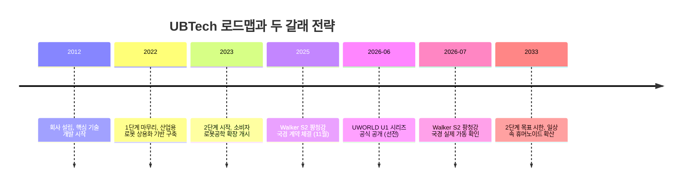
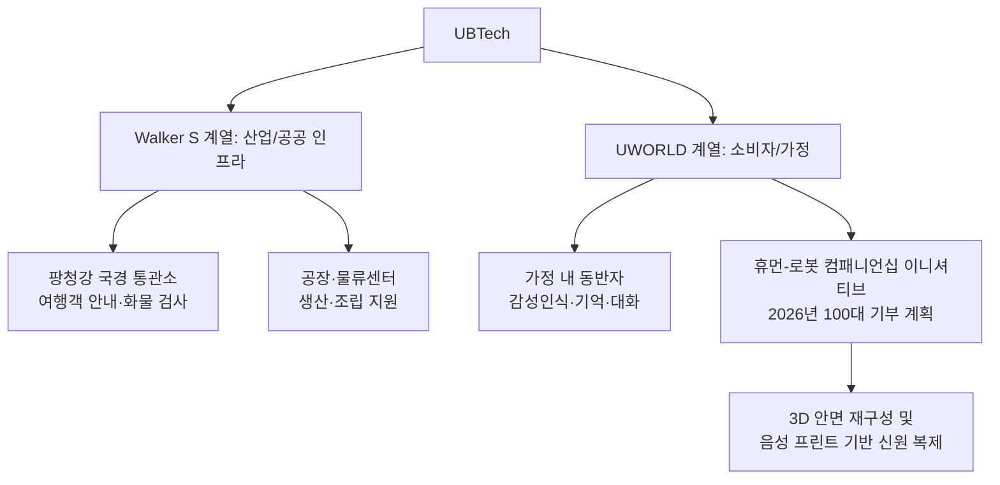

## 관련영상

[**China Just Dropped An Ultra-Bionic AI Human Replica Robot**](https://www.youtube.com/@airevolutionx))

중국 로봇 기업 UBTech(유비테크)가 같은 시기에 서로 완전히 다른 성격의 휴머노이드 로봇 두 가지를 세상에 내놓았다. 하나는 사람의 감정을 읽고 기억하며, 필요하다면 특정인의 얼굴과 목소리까지 재현하도록 설계된 가정용 동반자 로봇 UWORLD U1이고, 다른 하나는 이미 중국-베트남 국경 통관 현장에 투입되어 여행객을 안내하고 화물을 검사하는 산업용 로봇 Walker S2다. 두 로봇은 겉모습도, 목적도, 배치되는 공간도 다르지만 한 회사의 전략 아래 놓여 있다는 점에서 함께 살펴볼 필요가 있다. 이 문서는 두 로봇에 관해 공식 발표 자료와 언론 보도를 바탕으로 확인된 내용만을 정리한 것이다.

---

## 1. 두 발표가 겹친 시점

UBTech는 2026년 6월 30일 중국 선전(深圳)에서 '2026 글로벌 런칭 이벤트'를 열고 UWORLD U1 시리즈를 공식 공개했다. 이 자리에서 UBTech 창립자이자 이사회 의장, CEO인 제임스 저우(James Zhou)는 회사가 그리는 인간-로봇 공존의 장기 비전을 밝혔는데, 위험하고 반복적인 노동을 로봇이 대신하는 1단계, 동반자·서비스 형태로 일상에 파고드는 2단계, 그리고 최종적으로 인간과 로봇이 매끄럽게 상호작용하는 3단계로 구성된 구상이었다. 이 발표와 거의 같은 시기에, UBTech의 산업용 로봇 Walker S2는 광시(廣西) 좡족자치구의 팡청강(防城港) 국경 통관소에서 실제 운용에 들어갔다는 소식이 나왔다. 즉 한 회사가 한쪽에서는 사람의 마음을 위로하는 로봇을, 다른 한쪽에서는 국가 기반시설에서 일하는 로봇을 동시에 밀어붙이고 있는 셈이다.

---

## 2. UWORLD U1: 가정으로 들어가는 휴머노이드

### 2.1 라인업과 가격

UWORLD U1 시리즈는 세 가지 모델로 구성된다. 반신(半身) 토르소 형태인 U1 라이트(U1 Lite), 고성능 전신 모델인 U1 프로(U1 Pro), 그리고 고역동성 전신 모델인 U1 울트라(U1 Ultra)다. 가격은 11만 9,800위안부터 시작하는데, 이는 언론 보도 기준으로 미화 약 1만 6,500달러 안팎에 해당한다(환율에 따라 다소 유동적이다). UBTech는 런칭 행사 당일까지 UWORLD U1 시리즈의 누적 주문량이 1만 3,361대를 넘었다고 밝혔다. 이는 시제품 시연이 아니라 실제 양산과 구체적 가격, 대규모 사전 주문이 동시에 제시된 사례라는 점에서 업계의 주목을 받았다.

| 모델 | 형태 | 특징 |
|---|---|---|
| U1 Lite | 반신 토르소 | 입문형, 상반신 중심 상호작용 |
| U1 Pro | 전신 | 고성능 풀바디 모델 |
| U1 Ultra | 전신 | 고역동성 풀바디, 발표 무대 시연에 사용 |

### 2.2 신체 사양과 움직임

UWORLD U1은 88개의 자유도(degrees of freedom)를 가지고 있으며, 독자 개발한 '이중 피벗 생체모방 경추(dual-pivot biomimetic cervical spine)' 구조를 적용해 목 부위의 움직임을 사람에 가깝게 만들었다. 이 구조를 통해 로봇은 기본적인 인간 동작의 최대 90%까지 재현할 수 있다고 회사는 설명한다. 로봇의 피부는 생체모방 실리콘 소재로 만들어졌고, 눈은 사람을 따라 움직이며 눈꺼풀도 깜빡인다. 런칭 행사에서는 여러 대의 U1 울트라가 실제 사람들과 나란히 무대를 걸었고, 턱시도를 입은 남성과 함께 춤을 추는 장면도 포함됐다. 다만 이 시연을 다룬 매체들은 로봇의 움직임이 매끄럽지만은 않았고 다소 뻣뻣한 부분이 남아 있었다고 지적했다.

### 2.3 감성인식 AI와 두뇌 구조

UWORLD의 핵심은 몸이 아니라 그 안에 들어간 소프트웨어다. UBTech는 이 시스템을 '장기적 동반자 관계를 위한 세계 최초의 감성인식 대형언어모델(emotion-aware LLM)'이라고 표현했다. 이 모델은 20가지 이상의 세분화된 감정 상태를 90%를 넘는 정확도로 인식할 수 있다고 회사는 밝혔다.

이 감성 인식을 뒷받침하는 것이 '생체모방 패스트-슬로우 브레인 구조(biomimetic fast-and-slow brain architecture)'다. 인지신경과학의 이중 처리 이론에서 착안한 이 구조는 두 개의 층으로 나뉜다. 하나는 즉각적인 반응을 담당하는 '빠른' 층으로, 약 500밀리초 안에 직관적인 응답을 만들어낸다. 다른 하나는 수백억 개 파라미터 규모의 모델이 담당하는 '느린' 층으로, 더 복잡한 사고와 긴 대화의 맥락을 처리한다. 여기에 더해, 회사가 독자 개발한 컨트롤러가 구동하는 생체모방 표정 액추에이션 시스템은 음성과 입술 움직임 사이의 지연시간을 20밀리초 이내로 줄였다고 밝혔다. 표정과 입 모양이 조금이라도 어긋나면 로봇의 존재감이 순식간에 어색해지기 때문에, 이 수치는 로봇이 '살아있는 느낌'을 주는 데 핵심적인 요소로 제시되고 있다.

UWORLD 시스템에는 '에이전트 메모리 OS'라 불리는 기능도 포함돼 있다. 이는 시간의 흐름을 가로지르는 기억 체계로, 로봇이 매 대화를 완전히 새로운 상호작용으로 취급하지 않고 이전에 있었던 일들을 이어서 기억하도록 설계됐다. 회사는 이를 '지속적인 디지털 생애 프레임워크'라고 부른다. 또한 '능동형 케어 엔진'을 통해 매번 호출어(wake word)를 기다리지 않고도 주변 상황과 사회적 맥락을 스스로 인지해 반응할 수 있다고 설명한다.

### 2.4 데이터와 프라이버시

가정 안에서 사람의 표정, 음성, 감정, 생활 습관, 개인사를 지속적으로 관찰하고 기억하는 로봇이라는 점에서 개인정보 보호는 자연스럽게 핵심 쟁점이 된다. UBTech는 이용자가 자신의 데이터를 직접 소유하도록 하는 '3계층 프라이버시 아키텍처'를 적용했다고 밝혔다. 이 구조는 로컬 우선 처리, 최소한의 클라우드 의존, 그리고 사용자가 직접 제어할 수 있는 하드웨어 안전장치로 구성된다. 다만 이러한 설계가 실제로 어떤 수준의 보호를 제공하는지에 대한 독립적인 검증 결과는 아직 공개된 바 없다.

---

## 3. 가장 논쟁적인 부분: 휴먼-로봇 컴패니언십 이니셔티브

### 3.1 중국의 사회적 배경

UBTech는 UWORLD를 내놓으며 '휴먼-로봇 컴패니언십 이니셔티브(Human-Robot Companionship Initiative)'라는 사회공헌 성격의 프로그램도 함께 발표했다. 회사가 제시한 배경은 다음과 같다. 중국에는 홀로 거주하는 성인이 9,000만 명을 넘고, '독거 노인'으로 분류되는 고령층은 1억 1,800만 명에 이른다는 것이다. 또 홀로 사는 사람들 가운데 10~20%가 임상적 기준에서 정신건강 질환에 해당한다고 회사는 언급했다. UBTech 최고브랜드책임자이자 소비자로보틱스혁신사업부 사장, UWORLD 총괄 매니저인 마이클 탐(Michael Tam)은 인간-로봇 동반자 관계가 정신적 웰빙을 지원하는 새로운 접근이 될 수 있다고 말했으며, 동반자 로봇이 생애 여러 단계에서 개인화된 감정적 지원을 제공함으로써 새로운 소비자 카테고리로 자리잡을 잠재력이 있다고 덧붙였다. 그는 또한 중국의 울트라바이오닉 휴머노이드 로봇 시장이 2026년부터 2036년 사이 수백억 위안 규모에서 조(兆) 위안 규모로 성장할 수 있다는 전망도 함께 인용했다.

### 3.2 기부 프로그램과 신원 복제 기술

이 이니셔티브의 실질적인 내용은, UBTech가 2026년에 맞춤형 U1 시리즈 로봇 100대를 기부하겠다는 계획이다. 대상은 한쪽 또는 양쪽 부모와 떨어져 자라는 아동, 홀로 사는 고령층, 어려운 상황에 놓인 가정 등 취약 계층이다. 그런데 회사가 공식적으로 밝힌 설명에 따르면, 이 기부용 로봇에는 3D 안면 재구성 기술과 음성 프린트 기반 신원 복제 기술이 탑재된다. 즉 특정 인물—떠난 부모, 멀리 사는 자녀, 세상을 떠난 배우자일 수도 있다—의 얼굴과 목소리를 재현해 그 사람을 대신하도록 만들어진다는 뜻이다. 여기에 감정 기반 상호작용 모델과 전담 장기 기억 시스템, 다중모달 상황 인지 기능이 결합되어 구조화된 심리적 지원 서비스를 제공하는 것이 이 프로그램의 목표라고 회사는 설명했다.

이 부분이 유독 논쟁적인 이유는 명확하다. 특정인의 얼굴과 목소리를 그대로 재현한 로봇은 슬픔이나 그리움을 겪는 사람에게 위로가 될 수도 있지만, 동시에 그 사람을 감정적으로 대체된 관계 속에 붙잡아 둘 위험도 있다. 지지(support)와 대체(replacement)의 경계가 모호해질 수 있으며, 외롭거나 애도 중이거나 취약한 사람들을 대상으로 '시뮬레이션된 관계'를 판매하는 산업이 새롭게 형성될 가능성도 제기된다. 이는 단순한 기술적 진보를 넘어서는 윤리적 질문이며, 아직 이에 대한 명확한 사회적 합의나 규제 기준은 마련되어 있지 않다.

---

## 4. 한편, 국경에서는: Walker S2의 현실 시험

### 4.1 계약의 시작과 규모

UWORLD가 가정을 향한다면, Walker S2는 정반대의 방향, 즉 국가 기반시설로 향하고 있다. 이 흐름은 2025년 11월 25일 사우스차이나모닝포스트(SCMP)가 처음 보도한 계약에서 시작됐다. 광시좡족자치구의 해안 도시 팡청강에 위치한 한 휴머노이드 로봇센터가 UBTech와 2억 6,400만 위안(미화 약 3,700만 달러) 규모의 계약을 체결했다는 내용이었다. 이 계약에는 여행객 안내, 인원 흐름 관리, 순찰, 물류 운영, 상업 서비스 지원 등의 업무가 포함됐다. 이후 2026년 7월 초 인터레스팅엔지니어링(Interesting Engineering) 등 매체는 해당 계약 규모를 '약 4,000만 달러'로 언급하기도 했는데, 이는 환율 변동이나 집계 방식의 차이에서 비롯된 것으로 보이며 정확한 최종 계약 금액이 별도로 공개되지는 않았다. 투입된 로봇의 정확한 대수 역시 지금까지 공식적으로 공개되지 않았고, 다만 2025년 12월경부터 초기 인도가 시작돼 2026년 7월 초 기준으로 실제 운용에 들어갔다는 점은 여러 매체를 통해 확인됐다.

### 4.2 배치 장소와 업무

팡청강은 화물 트럭, 버스, 통근객, 여행객이 매일 오가는 중국에서 가장 분주한 국경 통관 지점 가운데 하나다. 이 통관소는 둥중항(Dongzhong Port)과 그 인근의 둥싱항(Dongxing Port)을 포함하며, 여객 왕래와 화물 운송의 주요 관문 역할을 한다. Walker S2는 여객 터미널 내부에서 인파가 몰리는 지점을 감지해 사람들을 정돈된 줄로 안내하고, 여러 언어로 실시간 통관 안내를 제공하며, 통관 절차에 관한 기본적인 질문에 답하고 방문객을 올바른 처리 창구로 안내하는 역할을 맡는다. 또한 터미널 복도를 순찰하며 인파 밀집도를 모니터링해 혼잡이 커지기 전에 당국이 대응할 수 있도록 돕는다. 화물 구역에서는 별도의 로봇들이 철제 컨테이너가 이동하는 화물 라인에서 광학 스캐너로 바코드와 일련번호, 전자 선적 서류를 읽어 통관 데이터베이스와 대조하고, 그 결과를 중앙 통제센터의 인간 담당자에게 전달한다.

### 4.3 Walker S2의 사양

Walker S2는 제조·물류 현장을 위해 만들어진 산업용 휴머노이드다. 키는 약 1.76m(5.7피트)이며 52개의 자유도와 정교한 손 구조를 갖추고 있다. 각 팔로 최대 15kg(33파운드)까지 들 수 있고, 스스로 배터리를 교체하는 자가 교체형 듀얼 배터리 시스템을 탑재해 거의 끊임없이 가동할 수 있도록 설계됐다. 인지와 이동을 위해서는 브레인넷(BrainNet) 2.0 AI, 양안 스테레오 비전, 동적 균형 제어 기술이 활용되며, 이를 통해 자율 주행과 사람에 가까운 환경 인지, 복잡한 산업 환경에서의 안정적인 자세 유지가 가능하다고 회사는 설명한다.

### 4.4 국경이라는 현실적 시험대

공장처럼 통제된 환경과 달리 국경 통관소는 훨씬 까다로운 시험대다. 팡청강은 습도가 높고 먼지가 많으며 날씨가 자주 바뀌고, 승객과 화물 차량의 움직임이 끊이지 않는다. 바닥 표면도 언제나 완벽하지 않고, 사람들의 행동은 예측하기 어렵다. 조명이 바뀌고 인파가 갑작스럽게 몰리는 상황도 빈번하다. 이런 환경에서 장시간 안정적으로 작동할 수 있는지가 이번 시범 운용의 핵심 관전 포인트다. 중국 당국은 이 시험이 성공적으로 이뤄질 경우, 유사한 휴머노이드 시스템을 공항, 국제 철도역, 항구 등 다른 고교통량 교통 거점으로 확대 도입하는 발판으로 삼을 수 있다고 보고 있다. 이는 중국이 인공지능과 로봇공학, 자동화를 공공 서비스 전반에 밀어넣으려는 더 넓은 국가 전략의 일부이기도 하다.

동시에 이 배치는 실질적이고 법적인 질문도 함께 남긴다. 로봇이 잘못된 안내를 하거나 화물의 이상을 놓치거나 인파 관리 과정에서 혼란을 일으키거나 운영상 오류를 냈을 때, 그 책임을 제조사와 국경 당국, 그리고 감독하는 인간 담당자 가운데 누가 지게 되는지는 아직 명확히 정리되지 않았다. 여행객들 역시 통관·보안과 관련된 업무를 수행하는 휴머노이드 기계와 마주하는 데 적응할 시간이 필요할 것으로 보인다. 실제로 로봇이 자동화할 수 있는 부분은 인파 관리나 정보 제공, 화물 검사 등 정형화된 업무에 그치며, 복잡한 보안 판단이나 법 집행 행위는 여전히 인간의 감독을 필요로 한다는 점을 여러 보도가 공통적으로 지적하고 있다.

한편 이 흐름은 UBTech 한 회사만의 움직임이 아니라 중국 로봇 산업 전반의 정책적 맥락과도 맞물려 있다. 중국 공업정보화부(MIIT)는 휴머노이드 로봇에 관한 국가 표준을 마련하는 위원회를 구성했고, 여기에는 유니트리(Unitree) 창업자 왕싱싱, AgiBot 공동창업자 펑즈후이와 함께 UBTech의 기술총괄 슝유쥔이 부위원장으로 이름을 올렸다. 이는 중국 정부가 휴머노이드 로봇을 전략 산업으로 규정하고, 팡청강과 같은 실증 사례를 표준화 논의에 직접 반영하려 하고 있음을 보여준다.

---

## 5. 두 로봇, 하나의 회사

### 5.1 UBTech의 두 갈래 전략 비교

| 구분 | UWORLD U1 시리즈 | Walker S2 |
|---|---|---|
| 목적 | 가정용 감성 동반자, 노인 돌봄, 심리적 지원 | 산업·공공 인프라 업무 지원 |
| 발표/배치 시점 | 2026년 6월 30일 공개 | 2025년 11월 계약, 2026년 초 인도 시작, 2026년 7월 초 실제 가동 확인 |
| 배치 공간 | 가정, 요양시설, 접객·관광·교육 현장 | 국경 통관소, 공장, 물류센터 |
| 핵심 기술 | 감성인식 LLM, 패스트-슬로우 브레인, 에이전트 메모리 OS | 브레인넷 2.0 AI, 스테레오 비전, 자가 배터리 교체 |
| 가격/계약 규모 | 11만 9,800위안부터(약 1만 6,500달러) | 약 2억 6,400만 위안(약 3,700만~4,000만 달러) 규모 계약 |
| 논쟁 지점 | 신원 복제(고인·부재중인 가족 재현) | 책임 소재, 보안 업무의 자동화 범위 |

### 5.2 회사의 3단계 로드맵

UBTech는 2012년 창립 이후의 흐름을 세 단계로 구분해 설명한다. 2012년부터 2022년까지는 핵심 기술을 개발하며 휴머노이드 로봇을 실험실에서 산업 현장으로 옮기는 데 집중한 시기였다. 2023년부터 2033년까지는 소비자용 로봇공학으로 영역을 넓혀 휴머노이드를 일상생활의 일부로 만드는 것을 목표로 하는 시기로 설정돼 있다. 산업용 Walker S 시리즈는 이미 양산과 배송에 들어갔으며, UWORLD는 이 소비자 시장 확장을 이끌 '두 번째 성장 엔진'으로 자리매김하고 있다는 것이 회사 측의 설명이다.

---

## 6. 종합적으로 남는 질문들

이번 두 발표를 함께 놓고 보면, UBTech는 로봇의 활용 범위를 산업 현장과 가정이라는 양쪽 극단으로 동시에 넓히고 있다는 점이 뚜렷하게 드러난다. 국경에서는 인파와 화물을 처리하는 실용적 역할을, 가정에서는 감정을 읽고 기억하며 필요하다면 특정인을 재현하는 역할을 각각 시험하고 있는 것이다. 회사가 공개한 수치와 기술 설명은 대부분 공식 보도자료와 언론 취재를 통해 확인할 수 있지만, 몇 가지 지점은 아직 검증되지 않은 채로 남아 있다. 프라이버시 아키텍처가 실제로 어떤 수준의 데이터 보호를 제공하는지에 대한 독립적인 검증 결과는 없으며, 팡청강에 실제로 투입된 로봇의 정확한 대수나 성능·오류율에 관한 공개 데이터도 아직 나오지 않았다. 무엇보다 신원 복제 기술을 활용한 동반자 로봇이 실제로 애도나 고립 문제에 어떤 영향을 미치는지—위로가 될지, 아니면 감정적 대체와 의존을 심화시킬지—에 대한 사회적 논의와 검증은 이제 막 시작된 단계라고 할 수 있다.

---

## 참고 자료

- PR Newswire, "UBTECH Launches UWORLD U1, the World's First Full-Size Mass-Produced Ultra-Bionic Humanoid Robot" (2026.6.30)
- TechRadar, "UBtech just introduced its first full-size Ultra-Bionic humanoid robot..." (2026.7월 초)
- Interesting Engineering, "China deploys Walker S2 humanoid robots at busy international border" (2026.7.2)
- Interesting Engineering, "New humanoid robot built for companionship with 90% accuracy in recognizing emotions" (2026.7월 초)
- South China Morning Post, "UBTech wins US$37 million deal to deploy humanoid robots at China-Vietnam border crossings" (2025.11.25)
- The AI Insider, "UBTech launches UWORLD U1 'Ultra-Bionic Humanoid Robot' Line" (2026.7.1)
- Let's Data Science, "China Deploys UBTech Walker S2 at Vietnam Border" (2026.7월 초)

---

작성일: 2026년 7월 5일
