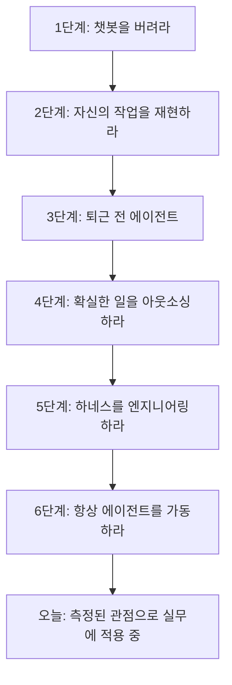
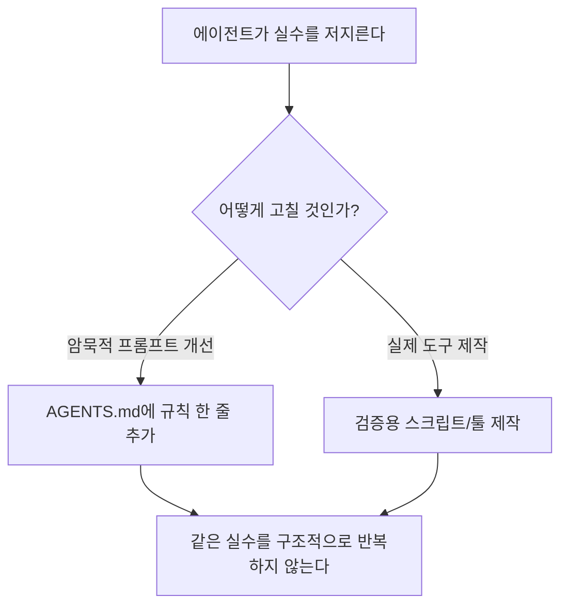
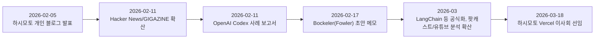

> 다만 한 가지는 정직하게 밝혀둘 필요가 있다. Hashimoto가 처음 작성했다는 원문 블로그 글의 URL은 여러 후속 자료에서도 정확히 재확인되지 않고 있으며, 대부분의 2차 자료는 그의 발언을 인용하는 형태로만 존재한다. 따라서 “그가 정확히 어떤 문장으로 이 개념을 처음 소개했는가”보다는 “2026년 2월, 이 개념이 거의 동시다발적으로 등장해 업계 표준 용어로 정착했다”는 사실관계에 무게를 두는 것이 안전하다.
>
> [**하네스 엔지니어링(Harness Engineering)이란 무엇인가 — AI 에이전트를 실제로 작동하게 만드는 숨은 계층**](https://k82022603.github.io/posts/%ED%95%98%EB%84%A4%EC%8A%A4-%EC%97%94%EC%A7%80%EB%8B%88%EC%96%B4%EB%A7%81(harness-engineering)%EC%9D%B4%EB%9E%80-%EB%AC%B4%EC%97%87%EC%9D%B8%EA%B0%80-ai-%EC%97%90%EC%9D%B4%EC%A0%84%ED%8A%B8%EB%A5%BC-%EC%8B%A4%EC%A0%9C%EB%A1%9C-%EC%9E%91%EB%8F%99%ED%95%98%EA%B2%8C-%EB%A7%8C%EB%93%9C%EB%8A%94-%EC%88%A8%EC%9D%80-%EA%B3%84%EC%B8%B5/)

## 1. 들어가며 — 이 문서가 다루는 것

이전에 정리했던 문서는 "하네스 엔지니어링"이라는 개념이 업계 전반에서 어떻게 확산되고 정의되었는지를 다뤘다. 이번 문서는 그 개념이 처음 세상에 나온 바로 그 1차 자료, 즉 HashiCorp의 공동창업자이자 Terraform과 Ghostty의 개발자인 Mitchell Hashimoto가 2026년 2월 5일 자신의 개인 블로그(mitchellh.com)에 올린 글 「My AI Adoption Journey」를 정독하고 해설하는 데 집중한다. 이 글은 여러 2차 자료에서 "원문 URL을 독립적으로 재확인하기 어렵다"고 언급될 정도로 참조는 많이 되지만 실제로 읽어본 사람은 적은 글이었는데, 이번에 원문 전체 텍스트를 확보했으므로 그 내용을 정확하게, 과장 없이 옮기고 검증하는 것이 이 문서의 목적이다.

먼저 분명히 해둘 것이 있다. 이 글은 학술 논문도, 기업의 공식 백서도 아니라 한 개발자의 지극히 개인적인 경험담이다. 하시모토 스스로도 글 서두에서 이 글을 전적으로 자신이 직접, 손으로 작성했다는 점을 굳이 밝히고 있으며, 이는 AI를 주제로 한 글에서 그 글 자체가 AI로 작성된 것이 아님을 명시할 필요를 느꼈다는 점에서 흥미로운 시대적 단서이기도 하다. 따라서 이 문서에서 다루는 내용의 상당 부분은 "검증된 사실"이 아니라 "한 개발자의 1인칭 경험과 주장"이라는 점을 전제로 읽어야 한다. 다만 그가 언급하는 배경 지식(예: Anthropic의 연구, 특정 AI 제품의 존재)에 대해서는 별도로 검색을 통해 사실관계를 확인했다.

## 2. 미첼 하시모토는 누구인가

하시모토는 2012년 HashiCorp를 공동창업했고, 클라우드 인프라를 코드로 관리하는 도구인 Terraform을 만든 인물로 널리 알려져 있다. 이후에는 Ghostty라는 오픈소스 터미널 에뮬레이터 프로젝트를 이끌고 있다. 그의 발언이 업계에서 무게감 있게 받아들여지는 이유는 단순히 유명세 때문이 아니라, 그가 오랫동안 개발자 도구와 인프라 자동화 분야에서 실질적인 성과를 쌓아온 인물이기 때문이다. 참고로 이 글이 발표되고 약 한 달 뒤인 2026년 3월 18일, 하시모토는 프론트엔드 배포 플랫폼 기업 Vercel의 이사회 멤버로 선임되었다는 보도자료가 발표되기도 했는데, 이는 이 글 자체와 직접 관련은 없지만 그가 이 시기 업계에서 계속 주목받는 인물이었음을 보여주는 정황이다.

## 3. 여정의 전체 구조 — 3단계의 심리적 전환

하시모토는 자신이 의미 있는 도구를 받아들일 때마다 항상 세 시기를 거친다고 말한다. 첫째는 비효율의 시기(그 도구를 어색하게 다루느라 오히려 손해를 보는 시기), 둘째는 적당함의 시기(그럭저럭 쓸 만해지는 시기), 그리고 셋째는 삶과 작업 방식 자체를 바꿔놓는 발견의 시기다. 그는 대개 이미 익숙하고 편안한 기존 작업 방식이 있기 때문에 새 도구를 받아들이는 첫 두 단계를 스스로에게 강제해야만 겪는다고 고백한다. 이 솔직한 전제는 이후 이어지는 6단계 여정 전체를 이해하는 데 중요한 배경이 된다 — 그는 처음부터 AI에 열광했던 사람이 아니라, 회의적인 태도에서 출발해 단계적으로 검증해나간 사람이라는 것이다.

## 4. 1단계 — 챗봇을 버려라

하시모토가 가장 먼저 내린 결론은 "챗봇(ChatGPT, 웹에서의 Gemini 등)으로 의미 있는 코딩 작업을 하려는 시도를 즉시 중단하라"는 것이었다. 그는 챗봇이 실제로 유용하며 자신의 일상적인 AI 활용에서 빠지지 않는 부분이라고 인정하면서도, 코딩에서는 그 유용성이 크게 제한된다고 지적한다. 이유는 명확하다 — 챗봇은 기본적으로 이전 학습 데이터를 근거로 그럴듯한 답을 내놓기를 "바라는" 방식으로 작동하고, 그것이 틀렸을 때 사람이 반복해서 "그거 틀렸어"라고 알려줘야 하는 비효율적인 구조이기 때문이다.

흥미로운 개인적 일화도 등장한다. 그는 여전히 AI에 회의적이던 시절, Ghostty의 명령 팔레트를 캡처해 Gemini에 붙여넣고 SwiftUI로 이를 재현해달라고 요청했던 순간이 자신의 첫 "이거 뭐지" 하는 놀라움의 순간이었다고 회고한다. 실제로 그 결과물이 매우 훌륭해서, 오늘날 macOS용 Ghostty에 탑재된 명령 팔레트는 그 순간 Gemini가 만들어준 결과물을 아주 가볍게만 수정한 것이라고 밝히고 있다. 하지만 이 성공 경험을 다른 작업에 그대로 적용하려 하자 실망만 남았다고 한다. 특히 이미 존재하는 코드베이스(브라운필드 프로젝트) 맥락에서는 챗봇 인터페이스가 자주 형편없는 결과를 냈고, 코드와 명령 출력을 인터페이스에 복사해 넣고 다시 복사해 나오는 과정이 매우 비효율적이었다는 것이다.

여기서 그는 핵심적인 용어 하나를 정의한다 — 실질적인 가치를 찾으려면 반드시 "에이전트"를 써야 한다는 것이다. 그가 정의하는 에이전트란 대화를 나누면서 동시에 외부 행동을 반복적으로 실행할 수 있는 LLM을 가리키는, 업계에서 통용되는 용어다. 그는 이 에이전트가 최소한 파일을 읽고, 프로그램을 실행하고, HTTP 요청을 보낼 수 있는 능력을 갖춰야 한다고 못박는다.

## 5. 2단계 — 자신의 작업을 재현하라

그다음 단계에서 그는 Claude Code를 시도했다. 그의 표현을 그대로 옮기면, 처음에는 전혀 인상적이지 않았다고 한다. 세션에서 좋은 결과를 얻지 못했고, 결과물을 일일이 손봐야 했으며, 이 과정이 오히려 직접 하는 것보다 시간이 더 걸렸다는 것이다. 여러 블로그 글을 읽고 영상을 봤지만 별다른 인상을 받지 못했다고 솔직하게 밝힌다.

포기하는 대신 그는 자신에게 하나의 강제 훈련을 부과했다 — 자신이 수작업으로 완료한 커밋들을 모두 에이전트로 다시 만들어보는 것이었다. 말 그대로 같은 작업을 두 번 한 셈이다. 먼저 직접 작업을 완료한 뒤, 그 해답을 에이전트에게 보여주지 않은 상태에서 품질과 기능 면에서 동일한 결과를 만들어내도록 에이전트와 씨름했다. 이 과정이 몹시 고통스러웠다고 그는 인정하지만, 새로운 도구를 받아들일 때 마찰이 자연스럽다는 것을 이미 여러 차례 경험했기에, 충분히 노력을 쏟아붓지 않고서는 확고한 결론을 내릴 수 없다고 판단했다고 설명한다.

이 강제 훈련을 거치며 그는 스스로의 경험을 통해 몇 가지 원칙을 재발견했다고 말한다. 세션을 명확하고 실행 가능한 개별 작업 단위로 쪼갤 것, 애매한 요청이라면 계획 수립 세션과 실행 세션을 분리할 것, 그리고 에이전트에게 스스로 작업을 검증할 방법을 주면 대개 스스로 실수를 고치고 회귀(regression)를 막아낸다는 것이었다. 이런 발견들은 이미 다른 사람들도 말하고 있던 내용이었지만, 스스로 처음부터 원리를 파고들어 발견했기에 더 단단한 이해로 남았다고 그는 강조한다.

이 단계에서 그가 강조하는 또 하나의 중요한 통찰은, 효율성 향상의 상당 부분이 "언제 에이전트를 쓰지 말아야 하는지 아는 것"에서 나온다는 점이다. 실패할 가능성이 높은 작업에 에이전트를 투입하는 것은 명백한 시간 낭비이며, 이를 미리 피할 수 있는 지식 자체가 시간을 절약해준다는 것이다. 이 단계가 끝날 무렵 그는 에이전트를 쓰는 것이 직접 하는 것보다 느리지는 않다고 느낄 만큼 자연스럽게 활용하게 되었지만, 여전히 순수하게 "더 빨라졌다"는 느낌은 받지 못했다고 밝힌다 — 왜냐하면 대부분의 시간을 에이전트를 감독하는 데 쓰고 있었기 때문이다.

## 6. 3단계 — 퇴근 전 에이전트

효율성을 좀 더 끌어올리기 위해 그는 새로운 패턴을 시작한다 — 매일 업무 마지막 30분을 떼어내어 하나 이상의 에이전트를 가동해두는 것이다. 그의 가설은 단순했다. 어차피 일할 수 없는 시간에 에이전트가 조금이라도 진전을 만들어낼 수 있다면 효율을 얻을 수 있지 않겠느냐는 것이었다. 즉 "가진 시간에 더 많이 하려는 시도" 대신 "가지지 못한 시간에 더 많이 하려는 시도"였다.

처음에는 이번에도 성과가 없고 짜증스러웠다고 한다. 하지만 곧 실제로 도움이 되는 몇 가지 작업 범주를 발견했다. 첫째는 깊이 있는 리서치 세션으로, 특정 라이선스 조건을 가진 특정 언어의 라이브러리를 모두 조사해서 각각의 장단점, 개발 활동성, 커뮤니티 반응 등을 여러 페이지 분량으로 요약하게 하는 작업이었다. 둘째는 병렬로 여러 에이전트를 돌려 자신이 시간이 없어 시작하지 못했던 막연한 아이디어들을 시도해보게 하는 것으로, 이 결과물을 실제로 배포할 것이라 기대하지는 않았지만 다음 날 해당 작업에 착수할 때 미처 몰랐던 부분을 미리 밝혀줄 수 있었다고 한다. 셋째는 이슈와 PR(풀 리퀘스트)의 분류·검토 작업으로, 에이전트들이 GitHub CLI(gh)를 다루는 데 능숙하다는 점을 활용해 여러 개를 병렬로 띄워 분류 작업을 시켰다. 이때 중요한 것은 에이전트가 직접 응답하도록 허용하지 않고, 다음 날 아침 자신이 어떤 작업에 우선순위를 둬야 할지 안내해주는 보고서만 받고자 했다는 점이다.

그는 다른 사람들처럼 밤새 에이전트를 루프로 돌리는 수준까지는 가지 않았다고 명확히 선을 긋는다. 대부분의 경우 에이전트는 30분 이내에 작업을 끝냈다. 다만 하루 중 늦은 시간, 즉 몰입 상태에서 빠져나와 지쳐 있고 개인적으로 비효율적이라고 느끼는 시간대의 노력을, 다음 날 아침 더 빠르게 시작할 수 있게 해주는 "워밍업"으로 전환하는 것이 그에게 실질적인 도움이 되었다고 말한다. 이 단계를 거치며 그는 AI 이전보다 (아주 조금이라도) 더 많은 일을 하고 있다고 느끼기 시작했다.

## 7. 4단계 — 확실한 일을 아웃소싱하라

이 시점부터 하시모토는 자신의 AI가 어떤 작업에 강하고 어떤 작업에 약한지에 대해 상당한 확신을 갖게 되었다고 말한다. 특정 작업에 대해서는 AI가 대체로 정확한 해결책을 낼 것이라는 높은 신뢰가 생겼고, 따라서 다음 단계는 그런 작업 전체를 에이전트에게 맡기고 자신은 다른 일을 하는 것이었다.

구체적으로는 이렇게 작동한다. 매일 아침 전날 밤 분류 작업을 했던 에이전트들의 결과를 가져와, 그중 에이전트가 거의 확실하게 잘 해결할 것 같은 이슈들만 수작업으로 걸러낸 뒤, 그 작업들을 (병렬이 아니라 한 번에 하나씩) 백그라운드에서 계속 진행시킨다. 그 사이 그는 다른 작업을 한다 — 소셜미디어를 보거나 영상을 보는 것이 아니라, AI 이전과 마찬가지로 자신이 원해서 하거나 반드시 해야 하는 다른 일에 깊이 몰입하는 것이다.

이 단계에서 그가 강조하는 중요한 실무 원칙은 "에이전트의 데스크톱 알림을 꺼두라"는 것이다. 맥락 전환(context switching)은 매우 비싼 비용을 치르게 하며, 효율을 유지하려면 에이전트를 언제 방해할지는 사람이 통제해야지 그 반대가 되어서는 안 된다고 그는 강조한다. 에이전트가 먼저 알림을 보내게 하지 말고, 자연스러운 작업 중단 시점에 직접 확인하러 가라는 것이다.

여기서 그는 매우 흥미로운 지점을 언급한다 — 널리 알려진 Anthropic의 "스킬 형성(skill formation)" 연구 논문을 의식하고 있다는 것이다. 그는 "다른 일을 한다"는 원칙이 이 논문이 지적하는 위험, 즉 위임한 작업에 대한 스킬을 형성하지 못하게 되는 문제를 어느 정도 상쇄해준다고 본다 — 위임한 작업에 대한 스킬은 형성하지 못하는 대신, 자신이 직접 계속 수행하는 작업에서는 여전히 자연스럽게 스킬을 쌓아간다는 절충안인 셈이다. 이 시점부터 그는 "이제 돌아갈 수 없는 영역"에 확고히 들어섰다고 느꼈다고 말한다.

여기서 언급된 Anthropic의 연구를 짚고 넘어갈 필요가 있다. 검색으로 확인한 바에 따르면, 이는 Anthropic Fellows Program 소속 연구자인 Judy Hanwen Shen과 Alex Tamkin이 2026년 1월 28일 arXiv에 공개한 「How AI Impacts Skill Formation」이라는 논문을 가리키는 것으로 보인다. 이 연구는 파이썬 경험이 있지만 특정 비동기 라이브러리(Trio)에는 익숙하지 않은 52명의 개발자를 대상으로, AI 도움을 받은 집단과 받지 않은 집단으로 나누어 무작위 대조 실험을 진행했다. 그 결과 AI의 도움을 받은 집단은 완료 속도에서는 미미한 차이만 보였지만, 개념적 이해·코드 읽기·디버깅 능력을 측정하는 퀴즈에서 평균 17% 낮은 점수를 기록했다. 특히 디버깅 영역에서 점수 차이가 가장 크게 나타났다. 연구진은 참가자들의 상호작용 패턴을 여섯 가지로 분류했는데, 이 중 세 가지(모든 코드 작성을 AI에 완전히 위임하는 패턴, 처음엔 스스로 하다가 점차 AI에 의존도를 높이는 패턴, AI를 디버깅 크러치로만 사용하는 패턴)는 낮은 학습 성과와 연결되었고, 나머지 세 가지(개념적 질문을 던지거나 설명을 요청하거나 자신의 이해를 검증하는 데 AI를 활용하는 패턴)는 스킬 형성을 유지하는 것으로 나타났다. 하시모토가 자신의 4단계 전략(위임하는 대신 다른 일에 깊이 몰입하기)을 이 연구와 연결지어 설명하는 것은, 결국 그가 자신이 직접 관여하는 영역에서는 여전히 능동적으로 사고하며 스킬을 유지하고 있다는 논리로 읽힌다.

## 8. 5단계 — 하네스를 엔지니어링하라 (용어가 탄생하는 지점)

이 문서 전체에서 가장 중요한 대목이 바로 이 5단계다. 하시모토는 에이전트가 처음부터 올바른 결과를 내거나, 최소한 손볼 것이 거의 없는 결과를 낼 때 훨씬 효율적이라는, 스스로도 "말할 필요도 없이 뻔한" 사실을 짚는다. 이를 확실하게 달성하는 방법은 에이전트에게 자신이 틀렸을 때 이를 빠르고 정확하게 알려주는 도구를 주는 것이라고 그는 말한다.

그리고 다음과 같이 말한다 — 이 개념에 아직 업계 전반에서 통용되는 용어가 있는지는 모르겠지만, 자신은 이것을 "하네스 엔지니어링"이라고 부르게 되었다고. 그 정의는 다음과 같다 — 에이전트가 실수를 저지르는 것을 발견할 때마다, 그 에이전트가 다시는 같은 실수를 저지르지 않도록 환경 자체에 해결책을 엔지니어링하는 것. 그는 이 용어를 새로 발명할 생각은 없으며, 만약 이미 존재하는 용어가 있다면 기꺼이 그것을 따르겠다고 겸손하게 덧붙인다. 실제로 검색을 통해 확인한 바로는, 이 표현이 등장한 지 불과 며칠 뒤 OpenAI의 엔지니어 Ryan Lopopolo가 자사 Codex 사례 보고서에서 유사한 개념을 정식화했고, 이후 LangChain을 비롯한 여러 조직이 "Agent = Model + Harness"라는 공식으로 이를 압축하면서 이 용어가 업계 표준으로 자리잡았다. 즉 하시모토 본인이 스스로 인정하듯, 이 개념 자체를 그가 완전히 처음부터 발명했다기보다는, 소프트웨어 업계에 이미 존재하던 테스트 하네스·평가 하네스·스캐폴드 같은 개념을 AI 에이전트 맥락에 적용해 이름 붙인 것에 가깝다.

그는 하네스 엔지니어링이 두 가지 형태로 이루어진다고 설명한다. 첫째는 암묵적 프롬프트를 개선하는 것, 즉 AGENTS.md(혹은 그에 상응하는 파일)를 갱신하는 것이다. 예를 들어 에이전트가 반복적으로 잘못된 명령을 실행하거나 존재하지 않는 API를 찾으려 한다면, 이런 실패 하나하나를 규칙 목록에 추가해나가는 것이다. 그는 이 방식의 실제 사례로 자신이 이끄는 Ghostty 프로젝트의 AGENTS.md를 언급하며, 그 파일의 각 줄이 실제로 있었던 나쁜 에이전트 행동 하나하나에 대응하고, 이렇게 만든 파일이 그 문제들을 거의 완전히 해결했다고 밝힌다. (다만 이 파일 자체의 구체적인 내용을 이 문서에서 그대로 옮기지는 않는다. 저작권이 있는 외부 저장소의 실제 파일이기 때문이며, 궁금한 독자는 원문 링크를 통해 Ghostty 저장소에서 직접 확인하는 것이 정확하다.)

둘째는 실제로 프로그래밍된 도구를 만드는 것이다. 예를 들어 스크린을 자동으로 캡처하는 스크립트, 필요한 테스트만 골라 빠르게 돌리는 스크립트 등이다. 이런 도구는 보통 "이런 도구가 존재한다"는 사실을 에이전트에게 알려주는 AGENTS.md 갱신과 함께 짝을 이뤄 도입된다고 그는 설명한다.

그는 이것이 현재 자신이 도달한 지점이라고 밝히며, 에이전트가 "나쁜 일"을 하는 것을 볼 때마다 그 일을 다시는 하지 않도록 진지하게 노력하고 있고, 반대로 에이전트가 "좋은 일"을 하고 있음을 스스로 검증할 수 있도록 만드는 데도 마찬가지로 노력하고 있다고 말한다.

## 9. 6단계 — 항상 에이전트가 돌아가게 하라

5단계와 동시에 진행되는 목표로, 하시모토는 언제나 에이전트 하나가 가동 중인 상태를 지향한다고 말한다. 만약 에이전트가 돌아가고 있지 않다면 스스로에게 "지금 에이전트가 나를 위해 할 수 있는 일이 있는가"라고 묻는다는 것이다.

그는 특히 Amp의 "deep 모드"처럼 더 느리지만 더 신중한 모델과 이 원칙을 결합하는 것을 선호한다고 밝히는데, 각주에서 이 deep 모드가 사실상 GPT-5.2-Codex를 기반으로 한다고 설명한다. 검색을 통해 확인한 바에 따르면, Amp는 Sourcegraph가 개발한 코딩 에이전트 제품이며, "deep" 모드는 실제로 2026년 1월 28일 GPT-5.2-Codex를 탑재하고 출시되었다. 이 모드는 작은 변경 하나에도 30분 이상이 걸릴 수 있지만, 그만큼 매우 좋은 결과를 낸다는 것이 하시모토의 평가이며, 이는 Amp 자체의 공식 발표 내용과도 일치한다. (참고로 Amp의 deep 모드는 이후 시간이 지나며 GPT-5.3-Codex, GPT-5.4, GPT-5.5 등으로 기반 모델이 계속 교체되었는데, 이는 하시모토의 글이 작성된 2026년 2월 시점 이후의 변화이므로, 그의 글에서 언급된 모델명 자체는 작성 시점 기준으로 정확했다고 볼 수 있다.)

그는 아직 여러 에이전트를 동시에 병렬로 돌리는 단계까지는 가지 않았고, 지금 당장은 그럴 생각도 없다고 밝힌다. 하나의 에이전트를 돌리는 것이, 자신이 즐기는 깊이 있는 수작업과 다소 멍청하지만 신비롭게도 생산적인 로봇 친구를 돌보는 일 사이에서 지금 자신에게 맞는 균형이라는 것이다. "항상 에이전트가 돌아가게 하라"는 목표는 아직 완전히 달성된 것이 아니라 여전히 진행 중인 목표이며, 그는 현재 일반적인 근무일의 10~20% 정도만 백그라운드 에이전트를 효과적으로 가동하고 있다고 스스로 평가하면서도, 이를 개선하기 위해 계속 노력하고 있다고 밝힌다. 그는 에이전트를 그저 돌리기 위해 돌리고 싶지는 않으며, 정말로 도움이 될 것 같은 작업이 있을 때만 가동하고 싶다고 강조한다.

## 10. 오늘 — 그리고 그가 스스로에게 부여하는 한계

글의 마지막 부분에서 하시모토는 이 여정을 통해 현대 AI 도구로 성공을 거두고 있으며, 현실에 발을 딛은 균형 잡힌 관점으로 접근하고 있다고 믿는다고 말한다. 그는 AI가 앞으로도 계속될 기술인지 아닌지에 대해 개인적으로 크게 신경 쓰지 않으며, 자신은 그저 그 일 자체를 사랑해서 무언가를 만들고 싶어하는 소프트웨어 장인일 뿐이라고 밝힌다.

그는 이 분야 전체가 너무 빠르게 움직이고 있어서 조만간 이 글을 다시 돌아보며 지금의 순진함을 웃어넘기게 될 것이라고 예상하면서도, 과거의 자신을 부끄러워할 수 없다면 아마 성장하고 있지 않은 것이라는 격언을 인용하며 자신이 올바른 방향으로 성장하기를 바란다고 적는다. 마지막으로 그는 자신이 이 문제에 아무런 이해관계가 없다는 점(어떤 AI 기업에서 일하거나, 투자하거나, 자문하지 않는다는 점)을 각주로 명시하며, AI를 쓰지 않기로 한 다른 사람들의 선택도 충분히 존중한다고 강조한다. 그는 누군가를 설득하려는 것이 아니라, 새로운 도구 전반에 자신이 어떻게 접근하는지(AI에 국한되지 않고)에 대한 개인적인 접근법을 공유하고 싶었을 뿐이라고 글을 맺는다.

## 11. 이 글은 어떻게 받아들여졌는가 — 확산과 반응

이 글은 발표 직후 개발자 커뮤니티에서 상당한 화제를 모았다. 특히 Hacker News에 게시된 뒤 활발한 토론이 이어졌는데, 확인 가능한 반응 중 하나는 이 글이 "균형 잡혀 있고 과장되지 않았다"는 호평이었으며, 회의적이던 개발자들에게도 AI 에이전트를 워크플로우에 도입해볼 만한 전환점이 될 수 있다는 논평이 달렸다. 일부 댓글에서는 하시모토가 강조한 "하네스 엔지니어링" 개념을 더 확장해서, 반복되는 실수를 규칙으로 만들고 이를 계속 쌓아나가는 것이 마치 백신을 통한 면역 형성과 비슷하다는 비유를 제시하기도 했다. 동시에 이 글이 실제로 좋은 결과를 얻기까지 드는 비용이나 시간에 대한 언급이 부족하다는 비판적인 의견도 있었다.

일본의 기술 매체 GIGAZINE은 이 글을 2026년 2월 11일 자 기사로 요약 소개하며 6단계 전체를 상세히 정리했고, 팟캐스트 「Fragmented」는 2026년 3월경 이 글을 OpenAI의 Codex 사례, Stripe의 Minions 프로젝트(Stripe가 오픈소스 에이전트 프레임워크 Goose를 포크해 만든 자체 코딩 에이전트)와 함께 묶어 "하네스 엔지니어링의 다섯 가지 기둥"이라는 주제로 다루기도 했다. 유튜브에서도 이 글을 분석하는 영상이 여럿 올라왔다.

한편 이 개념 자체에 대해 비판적인 시각도 존재한다. 한 분석글은 "하네스 엔지니어링"이라는 표현이 사실상 기존의 플랫폼 엔지니어링(platform engineering)이라는 개념에 새로운 이름을 붙인 것에 지나지 않는다는 논지를 펼치며, 하시모토가 이 개념 자체나 하네스라는 발상 자체를 발명한 것은 아니고(그는 스스로도 이를 인정한다), 소프트웨어 업계에는 이미 테스트 하네스, 평가 하네스, 스캐폴드, 런타임, 미들웨어, 제어 평면(control plane), 오케스트레이션 레이어 같은 개념들이 오래전부터 존재해왔다는 점을 지적한다. 이런 비판은 하시모토의 글 자체가 틀렸다는 뜻이라기보다는, 그가 관찰하고 이름 붙인 현상이 실은 소프트웨어 엔지니어링에서 오래전부터 반복되어온 패턴(신뢰할 수 없는 구성요소를 감싸는 검증 계층을 만드는 것)의 최신 버전이라는 점을 상기시켜준다고 볼 수 있다.

## 12. SM/SI 및 엔터프라이즈 AX 관점에서의 시사점

이 글의 진짜 가치는 화려한 수사가 아니라, 한 실무자가 자신의 워크플로우를 단계적으로, 정직하게 재구성해나간 기록이라는 데 있다. 특히 3단계(퇴근 전 에이전트)와 4단계(확실한 일 아웃소싱)에서 강조하는 "에이전트에게 언제 방해받을지를 사람이 통제해야 한다"는 원칙, 그리고 5단계에서 강조하는 "실수가 발견될 때마다 그 실수를 환경 자체에서 구조적으로 불가능하게 만든다"는 원칙은, SM/SI 조직에서 개인 실무자 수준의 AI 활용 성숙도를 어떻게 단계적으로 끌어올릴 것인가에 대한 실용적인 참고 모델이 될 수 있다. 특히 그가 인용하는 Anthropic의 스킬 형성 연구는, AI에게 전면적으로 위임하는 방식이 신입 실무자의 역량 형성을 저해할 수 있다는 점에서, SM 조직 내 주니어 엔지니어의 AI 활용 가이드라인을 설계할 때 반드시 고려해야 할 근거 자료로 활용할 수 있다. 다만 이 연구는 아직 프리프린트 단계이며 표본 크기(52명)가 크지 않다는 점, 그리고 하시모토 본인의 6단계 여정 역시 어디까지나 개인의 경험담이라는 점은 인용할 때 함께 밝혀두는 것이 정직한 태도일 것이다.

## 13. 핵심 요약

하시모토의 여정은 챗봇을 버리고 에이전트로 전환하는 것에서 시작해, 자신의 과거 작업을 에이전트로 재현해보며 원리를 체득하고, 퇴근 전 자투리 시간에 에이전트를 가동해 워밍업 효과를 얻고, 신뢰도가 검증된 작업을 아예 아웃소싱하며 다른 일에 몰입하고, 실수가 반복되지 않도록 환경 자체를 고쳐나가는 하네스 엔지니어링을 실천하고, 마지막으로 항상 에이전트가 무언가를 하고 있는 상태를 지향하는 것으로 이어지는 6단계 과정이다. 그가 이 과정에서 만들어낸 "하네스 엔지니어링"이라는 표현은 완전히 새로운 발명이라기보다, 소프트웨어 업계에 이미 존재하던 검증·안전장치 개념을 AI 에이전트 시대에 맞게 다시 이름 붙인 것에 가깝다. 그럼에도 이 표현이 이후 OpenAI, LangChain, Anthropic 진영을 비롯한 업계 전반에서 빠르게 표준 용어로 자리잡았다는 사실 자체가, 그가 짚어낸 문제의식(모델의 성능이 아니라 그 주변 환경 설계가 실제 신뢰성을 좌우한다는 것)이 얼마나 널리 공감을 얻었는지를 보여준다. 그리고 그가 반복해서 강조하는 태도 — 과장하지 않고, 측정 가능한 근거를 바탕으로, 스스로 실험해보고 판단한다는 태도 — 는 이 글이 단순한 기술 트렌드 소개를 넘어 실무자들에게 신뢰를 얻은 이유이기도 하다.

## 참고 자료 (References)

- Mitchell Hashimoto, "My AI Adoption Journey", mitchellh.com, 2026-02-05 (원문, 이 문서의 1차 출처) — https://mitchellh.com/writing/my-ai-adoption-journey
- Hacker News, "My AI Adoption Journey" 토론 스레드, 2026-02-11 — https://news.ycombinator.com/item?id=46903558
- GIGAZINE, "Six steps from a former AI skeptic to creating AI that can be used at work", 2026-02-11 — https://gigazine.net/gsc_news/en/20260211-my-ai-adoption-journey-6-steps/
- Fragmented (AI Developer Podcast), "307 - Harness Engineering - the hard part of AI coding", 2026-03-17 — https://fragmentedpodcast.com/episodes/307/
- Xiumu AI, "The Pragmatic Guide to AI Agent Adoption: Lessons from Mitchell Hashimoto", 2026-02-09 — https://xiumu.com/the-pragmatic-guide-to-ai-agent-adoption-lessons-from-mitchell-hashimoto/
- Haverin (Substack), "What is Harness Engineering? Why the AI Industry's Newest Buzzword is an Old Idea", 2026-05-08 (비판적 시각) — https://haverin.substack.com/p/what-is-harness-engineering-ai-hype
- OpenAI, "Harness engineering: leveraging Codex in an agent-first world" (Ryan Lopopolo), 2026-02-11 — https://openai.com/index/harness-engineering/
- Judy Hanwen Shen, Alex Tamkin (Anthropic Fellows Program), "How AI Impacts Skill Formation", arXiv:2601.20245, 2026-01-28 — https://arxiv.org/abs/2601.20245
- Anthropic, "How AI assistance impacts the formation of coding skills" (연구 요약 블로그) — https://www.anthropic.com/research/AI-assistance-coding-skills
- InfoQ, "Anthropic Study: AI Coding Assistance Reduces Developer Skill Mastery by 17%", 2026-02-23 — https://www.infoq.com/news/2026/02/ai-coding-skill-formation/
- Amp (Sourcegraph), "Go Deep" (deep 모드 출시 공지, GPT-5.2-Codex 탑재), 2026-01-28 — https://ampcode.com/news/deep-mode
- Vercel, 미첼 하시모토 이사회 선임 보도자료, 2026-03-18 (2차 출처 인용)

---
작성일자: 2026-07-05
