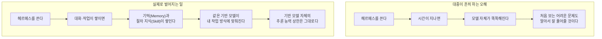
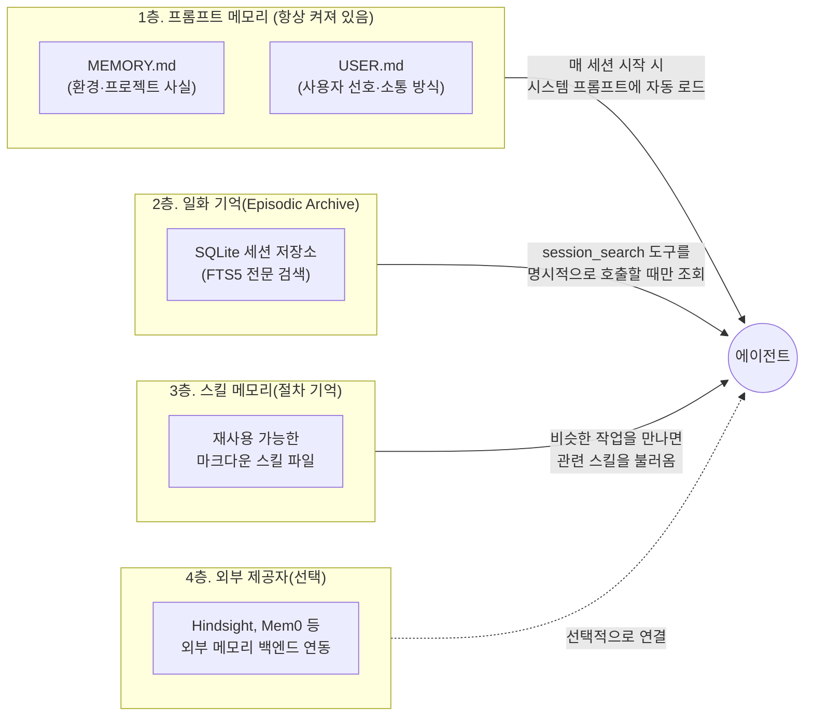
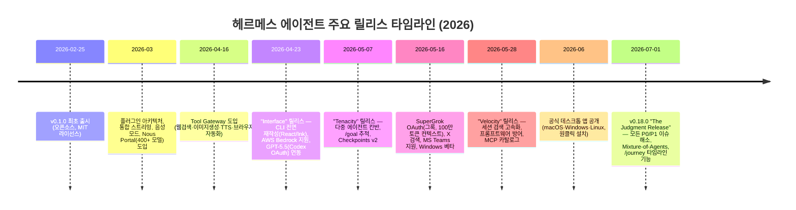

- 작성 기준일: 2026년 7월 5일
- 분석 대상 원문: Threads, @hyun_dah, 게시물 링크(DaXHrYVASVy) — "헤르메스를 두고 가장 위험한 오해"
- 검증 방법: Nous Research 공식 문서(hermes-agent.nousresearch.com), GitHub 저장소(NousResearch/hermes-agent) 릴리스 노트, 그리고 다수의 독립 기술 분석 글을 교차 대조하여 작성함

> 
> https://www.threads.com/@hyun_dah/post/DaXHrYVASVy
> 
> 요즘 헤르메스를 두고 가장 위험한 오해가 하나 있다.
> 
> “한 번 세팅해두면 알아서 점점 똑똑해지는 AI”
> 라는 식의 설명이다.
> 
> 반은 맞고, 반은 많이 위험하다.
> 
> 헤르메스는 마법처럼 지능이 올라가는 게 아니다. 
> 당신이 자주 쓰는 방식, 반복되는 업무, 선호하는 문맥에 맞게 
> 메모리와 스킬이 쌓이면서 점점 “당신에게 맞춰지는” 쪽에 가깝다.
> 
> 이 차이를 모르면 문제가 생긴다.
> 
> 처음 보는 어려운 문제도 
> 헤르메스가 알아서 척척 해결해줄 거라고 믿게 된다. 
> 그러다 결과를 검증하지 않고, 베이스 모델의 한계를 잊고, 결국 “딸깍하면 된다”는 말만 남는다.
> 
> 그런데 실제로 오래 쓰는 사람들은 조금 다르게 접근한다.
> 
> “얘가 똑똑해졌네?”가 아니라 
> “내 작업 방식에 더 잘 맞게 세팅됐네”라고 본다.
> 
> 그래서 메모리를 정리하고,
> 
> 스킬 파일을 감사하고, 
> 잘못 쌓인 습관을 지우고, 
> 반복 업무를 더 안전하게 다듬는다.
> 
> 이게 훨씬 실전적이다.
> 
> 물론 넓은 의미에서 보면 
> 인간도 기억을 형성하면서 배우듯이 
> 헤르메스도 어떤 의미에서는 “학습한다”고 말할 수 있다.
> 
> 하지만 대중이 오해하는 재훈련이나 지능 상승과는 다르다. 
> 이 구분을 흐리면, 결국 도구를 설명하는 게 아니라 환상을 파는 일이 된다.
> 
> AI 시대에 제일 위험한 건 
> 모르는 사람이 아니라 
> 조금 써보고 다 아는 것처럼 말하는 사람이다.
> 
> 헤르메스는 딸깍 도구가 아니라 
> 운영하는 시스템에 가깝다.
> 
> 잘 쓰는 사람은 프롬프트만 잘 쓰는 사람이 아니라 
> 기억을 관리하고, 스킬을 점검하고, 결과를 검증하는 사람이다.
> 
> 혹시 지금 누군가에게 
> “헤르메스 쓰면 알아서 다 됩니다”라고 말하고 있다면 
> 한 번쯤 멈춰서 생각해봤으면 좋겠다.
> 
> 그건 설명이 아니라 
> 누군가의 시행착오를 더 크게 만드는 말일 수도 있다
> 
> 

---

## 1. 이 문서의 목적

이 문서는 한 Threads 이용자가 올린 글을 출발점으로 삼아, 그 글이 다루고 있는 실제 대상인 **헤르메스 에이전트(Hermes Agent)** — Nous Research가 만든 오픈소스 자율 AI 에이전트 — 가 정확히 어떤 원리로 작동하는지를 공식 문서와 여러 독립 기술 분석을 바탕으로 상세히 풀어 설명하는 것을 목표로 한다. 원문 게시물의 핵심 주장은 "헤르메스를 쓰면 시간이 지날수록 저절로 똑똑해진다"는 대중적 오해가 위험하다는 것이었다. 실제로 확인해 보면, 이 주장은 기술적으로 상당히 정확하다. 헤르메스는 대화를 거듭할수록 실제로 무언가를 축적하지만, 그것은 모델 자체의 지능이 향상되는 것이 아니라 사용자의 작업 방식에 맞춰 기억과 절차 지식이 쌓이는 것이다. 이 둘의 차이는 미묘해 보이지만, 실제로 이 도구를 가르치거나 도입하는 입장에서는 매우 중요한 구분이다.

---

## 2. 원문 게시물이 말하는 핵심 주장 요약

원문 게시물의 논지를 정리하면 다음과 같은 흐름을 가진다.

첫째, "한 번 세팅해두면 알아서 점점 똑똑해지는 AI"라는 설명은 절반만 맞다. 둘째, 실제로 벌어지는 일은 마법 같은 지능 상승이 아니라, 사용자가 자주 쓰는 방식과 반복되는 업무, 선호하는 문맥에 맞춰 메모리와 스킬이 쌓이면서 도구가 점점 그 사람에게 "맞춰지는" 과정이다. 셋째, 이 차이를 모르면 처음 보는 어려운 문제도 알아서 해결해 줄 것이라고 과신하게 되고, 결과를 검증하지 않게 되며, 베이스 모델 자체의 한계를 잊게 된다. 넷째, 실제로 오래 쓰는 숙련자들은 "똑똑해졌다"가 아니라 "내 작업 방식에 더 잘 맞게 세팅됐다"고 인식하며, 그래서 메모리를 정리하고 스킬 파일을 감사(監査)하고 잘못 쌓인 습관을 지우는 식으로 도구를 능동적으로 운영한다. 다섯째, 넓은 의미에서 인간이 기억을 형성하며 배우듯 헤르메스도 어떤 의미에서는 "학습한다"고 말할 수 있지만, 이것이 대중이 오해하는 "재훈련"이나 "지능 상승"과는 분명히 다른 층위라는 점을 강조한다.

아래 3장부터는 이 주장 하나하나를 Nous Research의 공식 자료와 독립 기술 분석으로 실제 검증한다.

---

## 3. 헤르메스 에이전트란 무엇인가

헤르메스 에이전트는 Nous Research가 만든 오픈소스(MIT 라이선스) 자율 AI 에이전트로, 2026년 2월 25일 v0.1.0으로 처음 출시되었다. 특정 통합개발환경(IDE)에 종속된 코딩 보조 도구나 단일 API를 감싼 챗봇 래퍼가 아니라, 서버나 개인 컴퓨터, 심지어 5달러짜리 초저가 VPS 위에서 상시로 실행되는 독립 에이전트 애플리케이션이다. 터미널(CLI) 환경뿐 아니라 텔레그램, 디스코드, 슬랙, 왓츠앱, 시그널, 이메일 등 여러 메신저 플랫폼을 통해 동일한 하나의 에이전트와 대화할 수 있고, 2026년 6월 초부터는 macOS·Windows·Linux용 정식 데스크톱 애플리케이션도 공개되었다.

Nous Research는 원래 "Hermes" 계열의 파인튜닝 모델(Hermes 3 등, Llama 계열을 기반으로 학습)로 잘 알려진 연구소이며, 분산 학습 최적화 기술인 DisTrO와 이를 활용한 탈중앙화 학습 네트워크 Psyche 등을 함께 연구해 온 곳이다. 헤르메스 에이전트라는 제품은 이런 연구 배경 위에서 "모델"이 아니라 "에이전트 런타임(runtime)"으로 설계되었다는 점이 중요하다. 즉 헤르메스 에이전트는 특정 하나의 언어모델이 아니라, 앤트로픽의 클로드, OpenAI의 GPT 계열, 구글 제미나이, xAI의 그록, 그리고 Nous 자체의 Hermes 모델을 포함한 300개 이상의 모델을 자유롭게 골라 붙일 수 있는 틀(프레임워크)이다. `hermes model` 명령 한 줄로 기반 모델을 바꿀 수 있으며, 별도의 코드 수정이 필요 없다.

2026년 7월 1일 기준 최신 버전은 v0.18.0 "The Judgment Release"이며, 출시 이후 약 4~5개월 만에 GitHub 스타 수는 독립 분석 기준 2026년 5월 중순경 약 14만 4천 개, 6월 하순경 약 18만 개 수준으로 보고되어 빠르게 성장하고 있다(다만 이 수치는 집계 시점에 따라 문서마다 다르게 인용되므로 정확한 실시간 값이 아니라 대략적 추세로 이해하는 것이 안전하다). 경쟁 관계에 있는 오픈소스 에이전트 프레임워크로는 37만 개 이상의 스타를 보유한 OpenClaw가 자주 언급되는데, 두 프로젝트는 "메신저 연동과 도구 호출이 가능한 개인 AI 에이전트"라는 목표는 같지만, OpenClaw는 5,700개 이상의 커뮤니티 스킬과 24개 이상의 메신저 지원 등 생태계의 넓이에서, 헤르메스는 아래에서 설명할 "학습 루프"의 구조적 깊이에서 강점을 가진다는 평가가 여러 독립 분석에서 공통적으로 나타난다.

---

## 4. 오해의 핵심 — "지능 상승"과 "개인화"는 다른 층위다

원문 게시물의 핵심은 결국 다음 그림으로 요약된다.

여기서 결정적으로 구분해야 할 것은 "기반 모델(base model)"과 "에이전트 층(agent layer)"이다. 헤르메스 에이전트가 어떤 모델을 붙이든, 실제로 추론하고 코드를 짜고 문제를 푸는 주체는 여전히 그 기반 모델이다. 헤르메스가 하는 일은 그 기반 모델에게 매 세션마다 적절한 배경 정보와 과거에 효과가 있었던 절차를 프롬프트로 제공하는 것이다. 다시 말해 헤르메스를 오래 쓴다고 해서 그 안에 붙어 있는 모델 자체의 추론 능력이 올라가는 것이 아니라, "이 사람은 이런 방식의 답변을 선호하고, 이 프로젝트는 이런 구조를 가지고 있으며, 이런 종류의 문제는 과거에 이런 절차로 풀었을 때 성공했다"는 맥락이 점점 더 정교하게 축적되는 것이다. 이는 사람으로 치면 새로운 신입 사원이 회사에 대해 아무것도 모르는 상태에서 시작해, 몇 달이 지나면 회사의 관행과 암묵지를 체화하는 것과 비슷한 과정이며, 신입 사원 개인의 타고난 지능 자체가 몇 달 만에 상승한 것은 아니라는 비유와 정확히 대응한다.

---

## 5. 실제 작동 원리 — "닫힌 학습 루프(Closed Learning Loop)" 심층 해설

Nous Research는 이 메커니즘을 공식적으로 "닫힌 학습 루프(closed learning loop)"라고 부른다. 공식 문서는 이를 "에이전트가 스스로 큐레이션하는 메모리, 주기적인 넛지(nudge), 자율적인 스킬 생성, 사용 중 스킬 자기개선, LLM 요약을 곁들인 세션 간 전문(全文) 검색, 그리고 사용자 모델링(Honcho dialectic user modeling)"으로 구성된다고 설명한다. 아래에서 이 구성 요소를 하나씩 풀어본다.

### 5.1 네 개 층으로 이루어진 메모리 구조

여러 독립 기술 분석이 공통적으로 보고하는 내용에 따르면, 헤르메스의 기억 체계는 성격이 서로 다른 네 개 층으로 나뉘어 있으며, 이 분리 자체가 핵심 설계 원칙이다.

**1층, 프롬프트 메모리**는 `MEMORY.md`와 `USER.md`라는 두 개의 파일로 구성되며 사용자 홈 디렉터리의 `~/.hermes/memories/` 위치에 저장된다. 이 두 파일은 세션이 시작될 때마다 사용자가 메시지를 한 글자도 보내기 전에 이미 시스템 프롬프트 안에 자동으로 포함된다. `MEMORY.md`에는 프로젝트 구조, 서버 설정, 명명 규칙, 과거에 시행착오를 거쳐 배운 교훈 같은 "환경에 대한 사실"이 담기고, `USER.md`에는 사용자가 선호하는 소통 방식, 기술 숙련도, 반복되는 의사결정 같은 "사용자에 대한 사실"이 담긴다. 여러 독립 분석에 따르면 이 두 파일을 합친 글자 수 제한이 약 3,575자로 상당히 타이트하게 걸려 있다고 하는데, 이는 무한정 쌓기보다 끊임없이 다듬고 정리하도록 강제하려는 설계 의도로 해석된다(다만 이 정확한 글자 수는 공식 문서에서 직접 확인된 수치라기보다 복수의 제3자 기술 분석에서 공통적으로 보고된 값이라는 점은 밝혀둔다). 이 파일들에 대한 수정은 에이전트가 대화 도중에 판단해 반영하더라도, 실제로는 다음 세션부터 적용되며 같은 대화 중간에 즉시 반영되지는 않는다.

**2층, 일화 기억**은 모든 CLI 및 메신저 세션 내용이 `~/.hermes/state.db`라는 SQLite 데이터베이스에 기록되고, FTS5(전문 검색 인덱스)로 색인되는 구조다. 이 층은 1층과 달리 "항상 로드"되는 것이 아니라, 에이전트가 `session_search`라는 도구를 명시적으로 호출했을 때만 조회된다. "지난주에 그 Redis TTL 버그 어떻게 처리했었지?" 같은 질문에 답하려면 이 층을 검색해야 하며, 검색 결과는 그대로 삽입되지 않고 별도의 LLM 호출을 거쳐 요약된 뒤 필요한 부분만 문맥에 들어간다. 즉 "항상 켜져 있는 기억"과 "필요할 때 찾아보는 기억"을 구조적으로 분리해, 시스템 프롬프트가 계속 무거워지는 것을 막는다는 것이 이 설계의 핵심이다.

**3층, 스킬 메모리**가 원문 게시물이 말하는 "스킬"에 해당하는 층이다. 에이전트가 복잡한 작업 — 독립 분석에 따르면 대략 다섯 번 이상의 도구 호출, 오류로부터의 복구, 또는 자명하지 않은 워크플로우로 정의됨 — 을 마치고 나면, 그 과정이 재사용할 가치가 있는지 스스로 평가한다. 가치가 있다고 판단되면 단순한 로그가 아니라 "재사용 가능한 절차 지침서"에 해당하는 마크다운 스킬 파일을 `~/.hermes/skills/` 위치에 작성한다. 이후 비슷한 유형의 작업을 다시 만나면, 처음부터 다시 추론하는 대신 이 스킬 파일을 불러와 참고한다. 스킬은 한 번 쓰이고 끝나는 것이 아니라 사용될 때마다 다듬어진다. 잘 작동하면 강화되고, 실패하면 예외 상황이나 대안 절차가 추가되는 식으로 갱신된다.

**4층, 외부 제공자 연동**은 기본 세 층 위에 선택적으로 얹을 수 있는 확장 계층으로, Hindsight나 Mem0 같은 전용 메모리 백엔드를 연결해 더 정교한 의미 기반 검색이나 자동 캡처 기능을 추가하고 싶은 사용자를 위한 것이다.

### 5.2 "주기적 넛지"와 동의 기반(consent-aware) 쓰기

공식 문서는 이 학습 루프를 "동의 기반 학습 루프(consent-aware learning loop)"라고 표현한다. 세션이 진행되는 동안 정해진 간격마다 에이전트는 사용자에게 보이지 않는 내부 시스템 프롬프트를 통해 "지금까지 있었던 일 중 기억해 둘 만한 것이 있는가"를 스스로 점검하라는 지시를 받는다. 이 점검에서 반복된 수정 지시나 지속적으로 유효할 워크플로우 교훈이 발견되면, 그것이 압축된 메모리 항목이나 절차적 스킬로 저장된다. 다만 이 저장 행위는 완전히 자동으로 몰래 이루어지는 것이 아니라, `write_approval` 기능을 통해 사용자가 검토한 뒤 반영되도록 단계를 걸어둘 수 있고, 기본적으로는 채팅창에 "💾 메모리가 업데이트되었습니다" 같은 짧은 알림이 표시되도록 되어 있다. 이는 사용자가 자신도 모르는 사이 잘못된 습관이 스킬로 굳어지는 것을 방지하기 위한 안전장치로 이해할 수 있다.

### 5.3 스스로를 정리하는 큐레이션 과정

스킬이 무한정 쌓이기만 하면 오히려 문제가 생긴다. 여러 독립 분석은 이를 "성장 그 자체는 지능이 아니다"라는 문제로 표현한다. 복잡한 작업을 할 때마다 스킬이 하나씩 추가되면 반년쯤 지나 수백 개의 스킬이 쌓이고, 그중 상당수는 중복되거나 낡아버린다. 이렇게 되면 스킬 설명이 서로 겹쳐 에이전트가 적절하지 않은 스킬을 골라 쓰는 역효과가 발생할 수 있다. 이 문제를 막기 위한 것이 정기적으로 실행되는 정리·감사 과정이며, 독립 분석에서는 이를 "큐레이터(Curator)"라고 부르는 주기적(예: 7일 주기) 작업으로 설명한다. 이 과정은 스킬 저장소를 훑으며 각 스킬을 평가하고, 유사한 스킬을 병합하고, 오랫동안 호출되지 않은 스킬을 보관 처리하며, 설명 문구를 더 명확하게 다시 쓴다. 이는 사람의 수면 중 기억 재정리 과정에 곧잘 비유되는데, 사용자가 개입하지 않아도 백그라운드에서 자동으로 일어난다는 점에서 그렇다. 다만 이러한 정기 정리가 완전히 자동으로 이루어진다고 해서 손 놓고 방치해도 된다는 뜻은 아니며, 바로 이 지점에서 원문 게시물이 강조하는 "숙련자는 메모리를 정리하고 스킬 파일을 감사한다"는 능동적 관리의 필요성이 나온다. 실제로 2026년 7월 1일 출시된 v0.18.0 "The Judgment Release"에는 `/journey`라는 신규 기능이 추가되었는데, 이는 헤르메스가 그동안 축적한 기억과 스킬을 시간순으로 재생해 볼 수 있는 타임라인 화면이며, 사용자가 여기서 직접 잘못된 항목을 편집하거나 삭제할 수 있도록 만들어졌다. 데스크톱 앱에는 이와 짝을 이루는 "메모리 그래프"도 함께 추가되어, 에이전트가 무엇을 알고 있는지, 그것이 어떻게 자라났는지, 그리고 무엇이 잘못 쌓였는지를 사용자가 직접 들여다보고 다듬을 수 있게 되었다. 이는 원문 게시물이 권장하는 "숙련자의 운영 방식"이 이제는 제품 차원의 공식 기능으로 지원되고 있다는 것을 보여주는 구체적 증거다.

### 5.4 그렇다면 진짜 "재훈련"은 어디에 있는가 — Atropos와의 차이

여기서 원문 게시물이 던진 질문, 즉 "이것이 재훈련이나 지능 상승과는 다른가"에 대한 가장 명확한 답이 나온다. 헤르메스 에이전트는 일상적인 학습 루프와는 완전히 별개로, Nous Research의 강화학습 프레임워크인 **Atropos**와 모델 가중치를 실제로 갱신하는 학습 서비스인 **Tinker**를 연동할 수 있는 기능도 함께 제공한다. 이 기능을 사용하면 운영자가 `rl_start_training()` 같은 도구를 직접 호출해 로컬 트라젝토리(trajectory, 행동 궤적) API 서버를 띄우고, LoRA 방식의 학습 최적화를 거쳐 기반 모델의 가중치 자체를 실제로 파인튜닝할 수 있다. 이는 에이전트가 작업을 시도하고, 그 궤적을 평가하고, 이후 같은 실패를 막기 위해 모델 가중치 수준까지 손을 대는 방식으로, 자기개선을 모델 기반 층까지 밀어붙이는 것이라 볼 수 있다.

그러나 결정적으로, 이 경로는 다음과 같은 조건에서만 작동한다.

- 별도의 API 키(`TINKER_API_KEY`, `WANDB_API_KEY`, `OPENROUTER_API_KEY`)를 직접 설정해야 한다.
- `tinker-atropos`라는 별도의 하위 모듈을 초기화해야 한다.
- 트라젝토리를 수집하고, 흥미로운 것만 걸러 평점을 매기고, RL 파이프라인을 실행하고, 모델을 갱신하고, 다시 배포하는 전체 루프를 사용자가 능동적으로 운영해야 한다.

즉 이것은 기본값으로 켜져 있거나 사용자가 그냥 두면 저절로 일어나는 과정이 아니라, 연구자나 팀이 특정 도메인에 맞춰 모델 자체를 학습시키고 싶을 때 선택적으로 사용하는 "훈련 측 인프라"다. 실제로 이 기능을 설명하는 문서는 다음과 같은 질문에 명시적으로 답하고 있다. "헤르메스는 대화하면서 저절로 재훈련되는가?"라는 취지의 질문에 대해 공식적인 설명은 "아니다. 일상적인 학습 루프는 사용에서 재사용 가능한 스킬을 만드는 것이다. Atropos RL 파이프라인은 훈련 측의 더 무거운 경로이며, 대부분의 사용자는 RL이 아니라 스킬에 의존한다"고 분명히 선을 긋고 있다. 이는 원문 게시물이 강조한 구분 — "넓은 의미에서는 학습이라 부를 수 있지만, 대중이 오해하는 재훈련이나 지능 상승과는 다르다" — 을 헤르메스 에이전트를 만든 회사 스스로가 문서상으로 뒷받침하고 있다는 뜻이다.

아래 표는 이 두 층위를 정리한 것이다.

| 구분 | 일상적 학습 루프(스킬·메모리) | Atropos RL 파인튜닝 |
|---|---|---|
| 무엇이 바뀌는가 | 프롬프트에 실리는 기억/절차 지식 파일 | 기반 모델의 가중치 자체 |
| 언제 일어나는가 | 매 세션, 자동(동의 기반 알림 포함) | 사용자가 명시적으로 켰을 때만 |
| 필요한 설정 | 별도 설정 없이 기본 동작 | 별도 API 키·하위 모듈 초기화 필요 |
| 비유 | 신입 사원이 회사 관행을 익히는 것 | 그 사람의 두뇌 자체를 훈련시키는 것 |
| 기반 모델 교체 시 | 기억·스킬은 유지되지만 추론 상한은 새 모델에 종속 | 훈련된 모델은 그 자체로 별도 산출물 |
| 대상 사용자 | 거의 모든 일반 사용자 | 연구자·팀 단위의 고급 사용자 |

이 표에서 알 수 있듯, 대다수 사용자가 실제로 경험하는 "헤르메스가 나아지는 것 같다"는 감각은 왼쪽 열, 즉 스킬과 메모리 축적에서 오는 것이며, 이는 모델의 근본적인 추론 능력과는 무관하다. 오른쪽 열의 실제 재훈련 경로는 원문 게시물이 경고한 "대중이 오해하는 재훈련"에 해당하지만, 이는 기본 사용 경험과 분리된 별도의 고급 기능이다.

---

## 6. 왜 이 오해가 실제로 위험한가

이 구분을 흐리게 되면 실무에서 다음과 같은 구체적인 문제로 이어진다.

에이전트가 며칠, 몇 주에 걸쳐 특정 프로젝트에 맞춰 기억과 스킬을 쌓았다고 해서, 그 프로젝트와 전혀 무관한 새로운 영역의 어려운 문제까지 잘 풀어줄 것이라고 기대하는 것은 근거가 없다. 스킬은 "이 사람, 이 프로젝트에 특화된 절차 지식"이지 일반 지능의 향상이 아니기 때문이다. 또한 헤르메스에 어떤 기반 모델을 붙였는지에 따라 결과의 품질 상한이 결정되므로, 상대적으로 추론 능력이 약한 모델을 붙여놓고 오래 썼다고 해서 그 결과가 강한 모델 수준으로 올라가지 않는다. 그리고 에이전트가 스스로 "이건 기억해 둘 만하다"고 판단하는 자기평가 능력 자체도 완벽하지 않다는 점을 독립 분석들은 공통적으로 지적한다. 즉 에이전트가 성공했다고 스스로 판단해 스킬로 저장한 절차가 실제로는 최선이 아니었을 수 있고, 이것이 검증 없이 반복해서 재사용되면 잘못된 습관이 오히려 굳어질 위험이 있다. 원문 게시물이 "잘못 쌓인 습관을 지운다"는 관리 행위를 강조한 것도 이런 배경에서 이해할 수 있다.

---

## 7. 숙련자들의 실제 운영 방식

원문 게시물이 제시한 숙련자의 태도 — "똑똑해졌다"가 아니라 "내 작업 방식에 더 잘 맞게 세팅됐다"고 보고, 메모리를 정리하고, 스킬 파일을 감사하고, 잘못 쌓인 습관을 지우고, 반복 업무를 더 안전하게 다듬는다는 접근 — 은 헤르메스 에이전트가 실제로 제공하는 기능들과 정확히 맞아떨어진다. 앞서 설명한 `/journey` 타임라인과 데스크톱의 메모리 그래프는 사용자가 축적된 기억과 스킬을 직접 들여다보고 편집·삭제할 수 있게 해주는 공식 도구다. 또한 프롬프트 메모리 층의 엄격한 글자 수 제한은 애초에 무한정 쌓이지 않고 계속 다듬어지도록 구조적으로 유도하며, 큐레이터 성격의 정기 정리 작업 역시 같은 방향으로 설계되어 있다. 결국 이 도구를 "딸깍 한 번으로 알아서 다 되는 도구"로 대하는 사람과, "메모리·스킬이라는 자산을 운영하는 시스템"으로 대하는 사람 사이의 결과 차이는, 도구 자체의 성능 차이가 아니라 이 관리 행위를 얼마나 의식적으로 수행하느냐의 차이에서 갈릴 가능성이 크다.

---

## 8. 최근 릴리스 흐름으로 보는 헤르메스 에이전트의 방향성

아래는 2026년 2월 출시 이후 지금까지의 주요 흐름을 정리한 타임라인이다.

특히 눈여겨볼 부분은 2026년 7월 1일자 "The Judgment Release"다. Nous Research 팀은 이 릴리스를 위해 약 열흘간 저장소에 남아있던 최우선순위(P0) 및 상위순위(P1) 이슈를 전수 조사해 100% 해소했다고 밝혔으며, 동시에 이번 릴리스의 주제를 "헤르메스가 얼마나 잘 사고하는지, 그리고 자신의 작업이 실제로 끝났다는 것을 어떻게 아는지"로 잡았다고 설명했다. 여러 모델의 추론을 나란히 보여주고 취합하는 "Mixture-of-Agents" 기능이 정식으로 통합된 것도 이 릴리스에서다. 이런 흐름은 헤르메스 에이전트가 "무조건 기능을 더 많이 쌓는" 방향이 아니라, 스스로의 판단 품질과 투명성(사용자가 에이전트의 사고 과정과 축적된 기억을 직접 확인할 수 있게 하는 방향)에 점점 더 무게를 두고 있다는 것을 보여준다. 이는 원문 게시물이 강조한 "검증"과 "관리"의 중요성이 제품 설계 방향과도 일치하고 있음을 시사한다.

---

## 9. 정리 — 교육 현장에서 강조할 포인트

이 내용을 강의나 교육 자료로 활용한다면, 다음 세 가지 포인트로 정리해 전달하는 것이 가장 명확하다.

첫째, 헤르메스 에이전트에서 "학습"이라는 단어는 두 가지 완전히 다른 층위를 가리킬 수 있다. 하나는 매일 자동으로 일어나는 메모리·스킬 축적(프롬프트 층위의 개인화)이고, 다른 하나는 사용자가 명시적으로 설정해야 하는 Atropos 기반의 실제 모델 가중치 재훈련이다. 대부분의 사용자가 경험하는 "똑똑해진 느낌"은 전자에서 온다.

둘째, 헤르메스가 어떤 기반 모델을 쓰고 있는지는 그 자체로 결과물의 품질 상한을 결정하는 독립 변수다. 기억과 스킬이 아무리 잘 쌓여도, 기반 모델의 근본적인 추론 능력을 넘어설 수는 없다.

셋째, 도구가 자동으로 무언가를 기억하고 절차를 만들어낸다는 사실이 "사용자가 아무것도 하지 않아도 된다"는 뜻은 아니다. 오히려 그 반대로, 헤르메스는 사용자가 쌓인 기억과 스킬을 주기적으로 들여다보고, 잘못된 것을 정리하고 삭제할 수 있는 공식 도구(`/journey`, 메모리 그래프)를 제공함으로써 "운영"이라는 행위 자체를 제품의 일부로 설계했다. 이 운영을 하지 않는 사람과 하는 사람의 결과 차이가, 이 도구를 둘러싼 "딸깍이냐 시스템이냐"는 논쟁의 실질적인 답이라고 볼 수 있다.

---

## 10. 용어집 (Glossary)

| 용어 | 설명 |
|---|---|
| 헤르메스 에이전트(Hermes Agent) | Nous Research가 만든 오픈소스 자율 AI 에이전트 런타임. 특정 모델이 아니라 여러 LLM을 붙여 쓸 수 있는 틀 |
| 닫힌 학습 루프(Closed Learning Loop) | 메모리·스킬·세션 검색이 하나의 지속적 과정 안에서 서로 맞물려 돌아가는 헤르메스의 핵심 설계 개념 |
| 프롬프트 메모리(Prompt Memory) | 매 세션 시작 시 시스템 프롬프트에 자동으로 실리는 항상 켜져 있는 기억층(MEMORY.md, USER.md) |
| 일화 기억(Episodic Archive) | 과거 세션 전체를 SQLite·FTS5로 색인해 두고, 필요할 때만 검색해 불러오는 기억층 |
| 스킬(Skill) / 절차 기억 | 복잡한 작업을 완료한 뒤 에이전트가 스스로 작성하는 재사용 가능한 마크다운 절차 지침서 |
| 큐레이터(Curator) | 스킬 저장소를 주기적으로 평가·병합·정리하는 자동화 과정을 가리키는 커뮤니티 용어(공식 명칭은 문서에 따라 다르게 표현될 수 있음) |
| 주기적 넛지(Periodic Nudge) | 세션 중 일정 간격으로 에이전트에게 "기억할 만한 것이 있는지 점검하라"고 지시하는 내부 시스템 프롬프트 |
| Atropos | Nous Research의 강화학습(RL) 트라젝토리 수집·평가 프레임워크. 모델 가중치 자체를 훈련하는 데 쓰임 |
| Tinker | LoRA 방식 등으로 실제 모델 가중치 학습을 수행하는 훈련 서비스. Atropos와 함께 연동됨 |
| Nous Portal | 하나의 구독으로 300개 이상 모델과 웹검색·이미지생성·TTS·브라우저 자동화 도구를 함께 제공하는 Nous Research의 게이트웨이 서비스 |
| 기반 모델(Base Model) | 헤르메스 에이전트가 실제 추론을 위임하는 언더레잉 LLM(클로드, GPT, 그록, Nous 자체 모델 등) |

---

## 11. 참고 자료 (전체 출처)

- Hermes Agent 공식 웹사이트: https://hermes-agent.nousresearch.com/
- Hermes Agent 공식 문서: https://hermes-agent.nousresearch.com/docs/
- Hermes Agent 메모리 기능 공식 문서: https://hermes-agent.nousresearch.com/docs/user-guide/features/memory
- Hermes Agent GitHub 저장소: https://github.com/nousresearch/hermes-agent
- Hermes Agent GitHub 릴리스 노트: https://github.com/NousResearch/hermes-agent/releases
- Hermes Agent v0.18.0 "The Judgment Release" 상세: https://github.com/NousResearch/hermes-agent/releases/tag/v2026.7.1
- Hermes Agent 뉴스 페이지: https://www.hermes-ai.net/news/
- Hermes Agent 변경 이력: https://hermes-ai.net/changelog/
- Atropos RL 파이프라인 설명: https://hermes-agent.ai/features/reinforcement-learning
- Atropos RL과 학습 루프의 차이(도구 설명): https://hermes-agent.ai/tools/atropos-rl
- Atropos GitHub 프로젝트 소개: https://hermesatlas.com/projects/NousResearch/atropos
- RL 트레이닝 구조 설명(커뮤니티 문서): https://github.com/mudrii/hermes-agent-docs/blob/main/rl-training.md
- Hermes 3 모델 기술 소개: https://nousresearch.com/hermes3
- 헤르메스 아키텍처 및 Psyche/DisTrO 분석: https://gregrobison.medium.com/architectural-and-strategic-analysis-of-the-hermes-agent-framework-and-the-psyche-decentralized-3f7d18fb40f6
- 학습 루프·메모리 구조 심층 분석(1): https://mranand.substack.com/p/inside-hermes-agent-how-a-self-improving
- 학습 루프·메모리 구조 심층 분석(2): https://www.revolutioninai.com/2026/04/how-hermes-agent-works-learning-loop-memory-explained.html
- 4계층 메모리 구조 분석: https://aiagentmemory.org/articles/hermes-agent-memory/
- 메모리 구조 및 큐레이터 개념 분석: https://dev.to/manikant92/hermes-agent-has-four-memories-and-thats-why-it-doesnt-forget-you-2e55
- 메모리 작동 방식 실무 가이드: https://vectorize.io/articles/hermes-agent-memory-explained
- 메모리 시스템 종합 해설: https://www.glukhov.org/ai-systems/hermes/hermes-agent-memory-system/
- 핵심 기능(메모리·스킬·학습 루프) 정리: https://wisgate.ai/blogs/hermes-agent-core-features-memory-skills-learning
- 데스크톱 앱 출시 및 OpenClaw 비교 분석: https://medium.com/@tentenco/hermes-agent-desktop-app-everything-you-need-to-know-about-nous-researchs-self-improving-ai-agent-3cb59bd31e5f
- OpenClaw와의 비교(HackerNoon): https://hackernoon.com/hermes-agent-vs-openclaw-which-ai-agent-framework-wins-in-2026
- 설치 가이드 및 최신 버전 정보: https://techjacksolutions.com/ai-tools/hermes/hermes-setup-guide/
- 실무자용 종합 레퍼런스(2026): https://blakecrosley.com/guides/hermes
- 개요/정의 문서: https://webvise.io/blog/hermes-agent-self-improving-ai
- 완전 가이드(NxCode): https://www.nxcode.io/resources/news/hermes-agent-complete-guide-self-improving-ai-2026
- 마스터클래스(1): https://www.dailydoseofds.com/p/hermes-agent-masterclass/
- 마스터클래스(2): https://blog.dailydoseofds.com/p/hermes-agent-masterclass
- OpenRouter의 Hermes Agent 소개: https://openrouter.ai/apps/hermes-agent
- 원문 Threads 게시물: https://www.threads.com/@hyun_dah/post/DaXHrYVASVy

---

### 정확성에 관한 참고 사항

이 문서에서 인용한 수치 중 GitHub 스타 수, 프롬프트 메모리의 정확한 글자 수 제한(약 3,575자), 스킬 생성 기준(도구 호출 5회 이상 등), 큐레이터 정리 주기(7일)는 Nous Research의 1차 공식 문서에서 직접 확인된 값이 아니라 여러 독립 기술 분석 자료에서 공통적으로 보고된 수치임을 밝혀둔다. 이러한 세부 수치는 버전이 올라가면서 바뀔 수 있으므로, 정확한 최신 값이 필요하다면 공식 문서(hermes-agent.nousresearch.com/docs)의 해당 페이지를 직접 확인하는 것을 권장한다. 반면 학습 루프의 전반적 구조(4계층 메모리, 닫힌 학습 루프, Atropos/Tinker를 통한 별도의 가중치 재훈련 경로)는 공식 문서와 다수의 독립 분석이 일관되게 보고하는 내용이므로 신뢰도가 높다.
