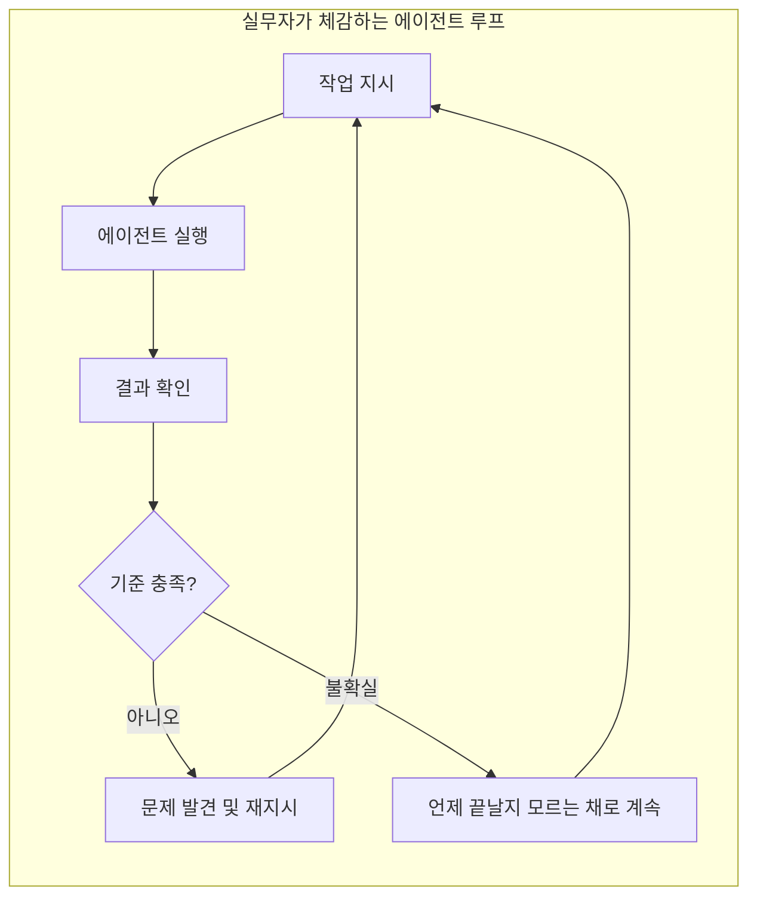
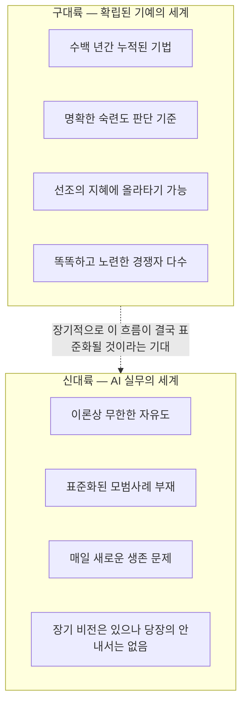
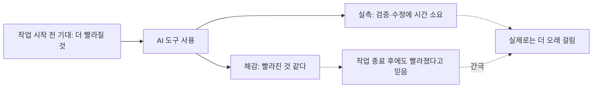

> 이 문서는 2026년 7월 공유된 페이스북 게시물(원문 링크: facebook.com/share/p/1JGZhhqYtX)을 원문 그대로 인용된 텍스트를 1차 자료로 삼아 분석한 해설 문서입니다. 해당 게시물은 크롤러 접근이 차단되어 있어 직접 열람은 불가능했으며, 사용자가 전달한 원문 텍스트를 검증된 원본으로 취급했습니다. 이 문서의 목적은 그 글이 무엇을 말하고 있는지, 어떤 맥락 위에 서 있는지를 최대한 근거를 갖추어 풀어내는 것입니다.

> 
> **AI, 때려치고 싶을 때가 많습니다.** 오늘 새벽에도 무언가 고쳐야 하는 데 막막하기만 한 악몽을 꾸다가, 새벽에 짜증이 폭발해서 눈을 비비며 몇개의 업무를 더 맡겨두고 다시 잠들었습니다. 이번에 처음이 아닙니다 한달에 한번 정도 꾸는 악몽입니다 ㅎㅎㅎ 공감하실 분이 얼마나 계실지 모르겠네요.
> 
> AI로 하는 일들이 너무 자유도가 높고, 하나 하나 베스트 프랙티스가 없어서 배우기가 어렵습니다.
> 
> 예를 들어 미술 학원에 갔는데, 드로잉을 배운다고 해볼게요. 연필로 슥슥 삭삭, 수백년간 누적된 기술들 수십 수백개를 열심히 배우다 보면 몇년이 흐르고, 내 레벨이 바로 파악이 될 것 같습니다. 거대한 산업속에서 선조들의 고민과 지혜에 쉽게 올라탈 수 있어요.
> 
> 그런데 AI는 말하자면 신대륙입니다. 16세기에 미대륙에 왔는데, '무엇이든 가능하다'는 건 알겠구만, 간단한 몇가지부터 시작하고 싶은 우리네 팔로워의 본능에는 무척 맞지 않습니다. 인디언에, 벌레에, 문명의 이기는 부족하고, 음식은 풍부한 것 같다가도 동네 들짐승들과 사투를 벌이기도 해야 합니다. 이론적으론 신대륙이지만 눈 앞에선 그냥 원시 그대로입니다. 4백년 후에 이 대륙이 세계 최강이 될 것이다, 라는 비전이 제 아무리 타당하더라도, 매일의 고난을 이겨나가는데 도움이 안되는 날이 더 많을지도 모르겠습니다.
> 
> 저는 머리가 좋지 않아서, 구대륙의 철저한 질서 내에서 성공할 길을 찾는 것은 무척이나 어렵게 느껴지는 타입입니다. 수백년간 안착한 숨겨진 질서들의 핵심을 이해하는 것보다, 새로운 질서가 만들어질 때 용감 무쌍한 아마추어들끼리 모험하는 것을 더 좋아했습니다. 똑똑한 사람들은 낡은 질서에 더 몰려 있기 때문에, 그들과 정면 경쟁하는 것을 두려워했던 것 같습니다. 미지의 세계의 길잡이 같은 역할이 스트리트 스마트한 사람들에게 그나마 조금 평온을 준다고 할까요. 모든게 실패해도 가까운 마을에 안주할 수 있잖아요.
> 
> 그럼에도 혼란은 극심합니다. 주말에 수백번째 루프를 돌리고 있는 프로젝트가 두개가 있는데. 과연 이 루프는 어디로 향해가고 있는가 하는 두려움과 미지와 혼란에 빠집니다. 와 진짜 다 때려치고 싶습니다. 경험상 AI 가 완벽한 결과를 내줄 가능성은 거의 없습니다. 기차 백대를 만든다고, 물류가 알아서 해결되지 않는 것과 비슷합니다... 무언가 사이즈가 커지면, 치밀하게 깎아 나가야할 지점들이 더 넓어질 겁니다.
> 
> 머리가 아픕니다.
> 
> 그래도 한동안은 이 머리 아픈 업무를 계속 진행해나갈 것 같아요. 그 모든 것을 쉽고 간명하게 설명할 수 있는 날이 오면 머리가 맑아지겠죠. 누군가에겐 좋은 선생이 될 수 있을지도 모릅니다.
> 
> 어느덧 새어보니 AI와 씨름한지 1만 시간이 훌쩍 넘은 것 같습니다. 새로 나오는 대부분의 AI 툴들이나 설계들이 낡아 보일 지경입니다. 벤처 투자 심사를 하고 있었다면, AI 접근하는 모든 팀들이 어떤 설계로 어느 정도의 해자를 가지는지 10분이면 파악이 끝날 것 같아요. 안해본 게 없을 지경이니까요. 누가 무엇 때문에 밤을 지새우고, 무엇이 아직 불안정한 기술이고 무엇이 확실한 기술인지도 제가 대부분 적어도 열 시간 많게는 백 시간 이상씩은 해봤기 때문에  대략 이해가 됩니다.
> 
> 그래도 고통스럽습니다. 그 어지러운 가능성들이 빗발 치는게 어려워요.
> 
> 결국엔 단순해질 겁니다. 모든 깨달음이 그러하듯이.
> 

## 목차

0. 프롤로그 — 이 글은 무엇에 관한 글인가
1. 새벽의 장면 — 악몽, 루프, 그리고 짜증
2. 핵심 은유 읽기 — 구대륙의 화실과 신대륙의 황무지
3. "완벽한 결과는 없다" — 체감 생산성과 실제 생산성의 간극
4. 왜 아직 표준이 없는가 — 2026년 에이전틱 코딩의 현실 지형
5. 아마추어 정신과 새로운 질서 — 글쓴이가 서 있는 자리
6. 1만 시간이 가르쳐 준 것, 가르쳐 주지 않은 것
7. 결론 — 결국 단순해질 것이라는 믿음

---

## 0. 프롤로그 — 이 글은 무엇에 관한 글인가

이 게시물은 기술 튜토리얼도, 도구 리뷰도 아닙니다. AI 코딩 에이전트를 다루는 실무자가 자신의 내면 상태를 솔직하게 기록한 성찰문에 가깝습니다. 형식상으로는 개인 소셜미디어에 올라온 짧은 글이지만, 내용상으로는 세 가지 층위가 겹쳐 있습니다.

첫째는 감정의 층위입니다. 새벽 악몽, 짜증, "다 때려치고 싶다"는 표현이 반복되는데, 이는 단순한 하소연이 아니라 매달 한 번꼴로 반복되는 패턴으로 스스로 인지하고 있다는 점에서 자기관찰의 기록이기도 합니다.

둘째는 은유의 층위입니다. 글쓴이는 AI로 일하는 경험을 "신대륙"에 비유하고, 전통적인 기예를 배우는 경험(드로잉 학원)을 "구대륙"에 비유합니다. 이 비유가 글 전체의 뼈대를 이루고 있습니다.

셋째는 정체성의 층위입니다. 글쓴이는 자신을 "머리가 좋지 않아 구대륙의 질서에서 성공하기 어려운 타입", 대신 "새로운 질서가 만들어질 때 아마추어들과 함께 모험하는 것을 좋아하는 타입"으로 규정합니다. 이는 단순한 겸손이 아니라, 왜 굳이 이렇게 고통스러운 영역에 남아 있는지를 설명하는 나름의 논리입니다.

아래에서는 이 세 층위를 하나씩 풀어보면서, 글 속에 담긴 주장 중 외부 사실로 확인할 수 있는 부분은 실제 자료로 뒷받침하고, 지극히 개인적인 경험과 감정의 영역은 그대로 존중하여 다루겠습니다.

---

## 1. 새벽의 장면 — 악몽, 루프, 그리고 짜증

글의 도입부는 매우 구체적입니다. 새벽에 "무언가 고쳐야 하는데 막막하기만 한 악몽"을 꾸다가 짜증이 폭발해서, 잠이 덜 깬 채로 오히려 업무를 몇 개 더 맡겨두고 다시 잠들었다는 장면입니다. 이 행동 자체가 상징적입니다. 괴로움의 원인(업무)에서 도망치는 대신, 그 괴로움을 유발한 대상에게 일을 더 맡기고 다시 눈을 감는다는 것은, AI 에이전트를 다루는 사람들 사이에서 드물지 않게 나타나는 패턴입니다. 자기 전에 에이전트에게 작업을 맡겨두고("돌려두고") 다음 날 결과를 확인하는 방식은 실제로 많은 실무자들이 채택하는 운영 방식이기도 합니다.

글쓴이는 이 악몽이 "한 달에 한 번 정도" 반복된다고 스스로 밝힙니다. 이는 지나가는 하루의 피로가 아니라, 장기간 누적된 인지적 부하가 주기적으로 표출되는 패턴에 가깝습니다. 뒤에 이어지는 문단에서 "주말에 수백 번째 루프를 돌리고 있는 프로젝트가 두 개 있다"는 진술이 등장하는데, 이 "루프"라는 표현이 이 글 전체에서 가장 중요한 키워드 중 하나입니다.

여기서 말하는 루프란, AI 에이전트에게 작업을 지시하고, 결과를 확인하고, 문제를 발견하고, 다시 지시하는 과정을 자동화된 형태로 반복하는 작업 방식을 가리킵니다. 문제는 이 반복이 "수백 번째"에 이르러도 완결되었다는 확신이 서지 않는다는 점입니다. 글쓴이는 이를 "이 루프는 어디로 향해가고 있는가 하는 두려움과 미지와 혼란"이라고 표현합니다. 이는 단순한 기술적 불편함이 아니라, 반복 작업의 종착점이 보이지 않는 데서 오는 존재론적 피로에 가깝습니다.

이 다이어그램이 보여주듯, 문제는 순환 구조 자체가 아닙니다. 순환은 모든 반복적 개선 작업의 본질입니다. 문제는 "기준 충족"과 "불확실" 사이의 판단이 흐릿하다는 데 있습니다. 종료 조건이 명확하지 않은 루프는 심리적으로 훨씬 더 소모적입니다.

---

## 2. 핵심 은유 읽기 — 구대륙의 화실과 신대륙의 황무지

글의 중심축은 두 가지 세계를 나란히 놓는 비유입니다. 하나는 미술 학원에서 드로잉을 배우는 경험이고, 다른 하나는 16세기에 아메리카 대륙에 도착한 이주민의 경험입니다.

드로잉을 배우는 쪽은 "구대륙"으로 그려집니다. 연필로 선을 긋는 기법부터 시작해서, 수백 년간 누적된 기법과 원칙들이 체계적으로 정리되어 있고, 몇 년을 배우면 자신의 실력 수준을 비교적 명확하게 가늠할 수 있는 세계입니다. 이 비유에서 핵심은 "거대한 산업 속에서 선조들의 고민과 지혜에 쉽게 올라탈 수 있다"는 문장입니다. 즉 구대륙에서는 개인이 처음부터 모든 것을 발명할 필요가 없습니다. 앞서간 사람들이 이미 실패와 성공을 통해 걸러낸 지도가 있기 때문입니다.

반대로 AI로 일하는 경험은 "신대륙"으로 그려집니다. 이론적으로는 무엇이든 가능하지만, 그 가능성이 오히려 초심자에게는 방향을 잃게 만듭니다. 글쓴이는 이 신대륙을 "이론적으론 신대륙이지만 눈앞에선 그냥 원시 그대로"라고 표현하며, 문명의 이기는 부족하고 매일 크고 작은 생존 문제와 씨름해야 하는 곳으로 묘사합니다. 특히 인상적인 문장은 "4백 년 후에 이 대륙이 세계 최강이 될 것이라는 비전이 제 아무리 타당하더라도, 매일의 고난을 이겨나가는 데 도움이 안 되는 날이 더 많을지도 모르겠다"는 대목입니다. 이는 장기적으로는 AI가 산업 전체를 재편할 것이라는 거시적 전망과, 오늘 당장 마주한 에이전트 오류 하나를 고치지 못해 밤을 새우는 미시적 현실 사이의 괴리를 정확히 짚어낸 표현입니다.

이 비유에서 흥미로운 점은, 글쓴이가 신대륙을 낭만화하지 않는다는 사실입니다. 흔히 "프론티어"라는 표현은 자유와 기회를 강조하는 방향으로 쓰이지만, 이 글은 오히려 그 프론티어의 고단함, 즉 인프라 부재와 예측 불가능성 쪽에 무게를 둡니다. 이는 실제로 2026년 현재 에이전틱 코딩 생태계를 다루는 여러 실무 기록에서도 공통적으로 확인되는 정서입니다. 국내 개발 커뮤니티에 올라온 여러 후기들을 보면, 도구 자체의 발전 속도는 매우 빠르지만 그 도구를 "어떻게 통제 가능한 루프로 만들 것인가"라는 전략의 문제는 도구 발전 속도를 따라가지 못하고 있다는 지적이 반복적으로 등장합니다. 즉 이 글의 은유는 감상적인 과장이 아니라, 실제 실무 현장의 체감을 압축한 표현에 가깝습니다.

---

## 3. "완벽한 결과는 없다" — 체감 생산성과 실제 생산성의 간극

글쓴이는 "경험상 AI가 완벽한 결과를 내줄 가능성은 거의 없다"고 단언하면서, 이를 "기차 백 대를 만든다고 물류가 알아서 해결되지 않는 것과 비슷하다"는 비유로 설명합니다. 즉 생성 능력(기차를 만드는 능력)이 아무리 뛰어나도, 그것들을 실제로 목적지까지 정확히 옮기는 조율 능력(물류)은 별개의 문제이며, 시스템의 규모가 커질수록 이 조율의 문제는 오히려 더 커진다는 주장입니다.

이 직관은 개인의 인상비평에 머물지 않습니다. 2026년 현재까지 나온 가장 널리 인용되는 실증 연구 중 하나가 정확히 이 지점을 다루고 있습니다. AI 안전성 연구 비영리기관인 METR은 2025년 2월부터 6월까지, 평균 5년 이상 특정 오픈소스 저장소에 기여해 온 숙련 개발자 16명을 대상으로 무작위 대조 실험을 진행했습니다. 각 개발자는 자신이 실제로 처리해야 할 246개의 과제를 무작위로 절반은 AI 도구 사용을 허용받고 절반은 허용받지 않은 채 수행했는데, 그 결과는 통념과 정반대였습니다. AI 도구를 사용했을 때 개발자들은 작업을 더 빨리 끝낸 것이 아니라 오히려 19퍼센트 더 오래 걸렸습니다. 더 흥미로운 지점은 개발자들이 실험 전에는 AI가 자신을 24퍼센트 빠르게 해줄 것이라 예측했고, 실험이 모두 끝난 뒤에도 여전히 자신이 20퍼센트가량 빨라졌다고 믿었다는 사실입니다. 즉 체감된 생산성과 실측된 생산성 사이에 거의 40퍼센트포인트에 달하는 간극이 존재했던 것입니다.

METR 연구진은 이 역설의 원인으로 몇 가지 가설을 제시했습니다. AI가 생성한 코드를 검토하고 다듬는 데 예상보다 많은 시간이 들어갔다는 점, 그리고 실험 대상이 이미 수년간 그 저장소에 익숙한 숙련자들이었기 때문에 AI가 끼어들 여지 자체가 크지 않았다는 점이 대표적입니다. 다른 분석에서는 낮은 신뢰성 때문에 개발자들이 결과물을 이중, 삼중으로 검증하는 데 시간을 쓸 수밖에 없었다는 점도 지적되었습니다. 이는 글쓴이가 말한 "무언가 사이즈가 커지면 치밀하게 깎아나가야 할 지점들이 더 넓어질 것"이라는 직관과 정확히 겹칩니다. 생성은 빨라졌지만, 검증과 통합이라는 병목은 오히려 더 도드라지게 된 것입니다.

물론 이 연구가 모든 상황에 일반화되지는 않는다는 점도 함께 짚을 필요가 있습니다. 연구 대상이 이미 수백만 줄 규모의 성숙한 코드베이스에 익숙한 극소수 숙련자였다는 점에서, 초심자나 그린필드 프로젝트, 빠른 프로토타이핑 상황에서는 결과가 다르게 나타날 수 있다는 반론도 함께 제기되고 있습니다. 또한 이 실험은 2025년 초 시점의 도구(Cursor Pro와 Claude 3.5·3.7 Sonnet 조합)를 기준으로 했기 때문에, 이후 등장한 더 발전된 에이전트형 도구에서는 결과가 달라질 가능성도 배제할 수 없습니다. 다만 핵심 메시지, 즉 "체감 속도와 실제 속도는 다르며, 그 차이를 스스로 알아차리기 어렵다"는 점만큼은 글쓴이의 경험과 상당히 일치합니다.

---

## 4. 왜 아직 표준이 없는가 — 2026년 에이전틱 코딩의 현실 지형

글쓴이가 느끼는 "모범사례의 부재"는 과장된 하소연이 아니라 지금 이 시점 AI 코딩 생태계의 실제 특징입니다. "바이브 코딩"이라는 용어 자체가 아직 채 2년이 되지 않은 신조어입니다. 이 표현은 2025년 2월, AI 연구자 안드레 카파시가 소셜미디어에 처음 제시하면서 통용되기 시작했고, 그해 말 콜린스 사전이 올해의 단어로 선정할 만큼 빠르게 확산되었습니다. 하나의 작업 방식이 이름을 얻은 지 채 2년도 되지 않았다는 사실 자체가, 왜 이 영역에 아직 "정착된 질서"가 없는지를 잘 설명해 줍니다. 구대륙의 드로잉 기법은 수백 년의 축적을 가지고 있지만, 에이전트를 이용한 코딩은 세대 하나가 채 지나지 않은 영역입니다.

2026년 상반기 현재 이 생태계를 들여다보면, 도구 자체는 매우 빠르게 진화하고 있습니다. 저장소 전체를 인덱싱해 구조 단위로 코드를 이해하는 통합개발환경형 도구, 여러 에이전트를 작업 단위로 조율하는 플랫폼형 도구, 터미널 기반으로 파일을 읽고 고치고 커밋까지 자동으로 수행하는 명령줄 기반 에이전트 등이 동시에 경쟁하고 있습니다. 문제는 이 도구들 사이에 아직 합의된 표준 워크플로가 없다는 점입니다. 어떤 실무자는 설계를 먼저 사람이 하고 반복적인 구현만 AI에 맡기는 방식을 택하고, 어떤 실무자는 처음부터 끝까지 자연어 지시만으로 밀어붙이는 순수한 방식을 택합니다. 두 접근 모두 성공 사례와 실패 사례가 동시에 보고되고 있으며, 어느 쪽이 "정답"인지에 대한 산업 전반의 합의는 아직 존재하지 않습니다.

구글 크롬과 제미나이 개발에 관여해 온 시니어 개발자 애디 오스마니가 최근 펴낸 책 역시 이 지점을 정확히 다루고 있습니다. 그는 개발자의 역할이 "코드를 직접 치는 사람"에서 "AI가 만든 결과물의 구조를 검토하고 방향을 결정하는 사람"으로 이동하고 있다고 진단합니다. 다만 그 책조차도 도구를 잘 쓰는 구체적인 매뉴얼을 제시하기보다는, 개발자가 스스로 통제 가능한 루프를 어떻게 설계할 것인가라는 전략적 사고방식을 강조하는 데 그칩니다. 즉 이 분야에서 가장 앞서 있다고 평가받는 저자들조차 "이렇게 하면 확실히 성공한다"는 확정된 절차를 제시하지 못하고 있는 것이 현재의 현실입니다. 글쓴이가 느끼는 막막함은 이 지점에서 개인의 능력 부족이 아니라, 업계 전체가 아직 도달하지 못한 성숙도의 문제로 재해석될 수 있습니다.

---

## 5. 아마추어 정신과 새로운 질서 — 글쓴이가 서 있는 자리

글의 후반부에서 글쓴이는 자신의 정체성을 스스로 규정합니다. "머리가 좋지 않아서 구대륙의 철저한 질서 내에서 성공할 길을 찾는 것은 무척이나 어렵게 느껴지는 타입"이라고 말하면서도, 동시에 "새로운 질서가 만들어질 때 용감무쌍한 아마추어들끼리 모험하는 것을 더 좋아했다"고 덧붙입니다. 이어서 "똑똑한 사람들은 낡은 질서에 더 몰려 있기 때문에 그들과 정면 경쟁하는 것을 두려워했던 것 같다"는 문장이 나옵니다.

이 대목은 자기비하처럼 보이지만, 실제로는 상당히 전략적인 자기 위치 설정입니다. 이미 질서가 확립된 구대륙에서는 앞서 언급했듯 수백 년간 그 질서를 다듬어 온 뛰어난 경쟁자들과 정면으로 부딪혀야 합니다. 반면 질서가 아직 형성되지 않은 신대륙에서는 경쟁의 축 자체가 다릅니다. "누가 더 정교한 지도를 그리는가"보다는 "누가 먼저 그 땅을 밟아 보았는가"가 더 중요해지는 국면입니다. 글쓴이가 스스로를 "길잡이" 역할에 위치시키는 것도 이런 맥락에서 이해할 수 있습니다. "미지의 세계의 길잡이 같은 역할이 스트리트 스마트한 사람들에게 그나마 조금 평온을 준다"는 문장은, 완벽한 정답을 알지 못해도 남들보다 조금 먼저 헤매어 본 경험 자체가 하나의 자산이 될 수 있다는 인식을 보여줍니다.

마지막 문장인 "모든 게 실패해도 가까운 마을에 안주할 수 있잖아요"는 이 모험에 붙은 안전장치를 뜻합니다. 신대륙을 개척하다 실패하더라도 원래 있던 마을, 즉 기존의 안정된 직업적 기반이나 생활이 있다는 뜻으로 읽힙니다. 이는 이 도전이 무모한 올인이 아니라, 위험을 어느 정도 관리하면서 감행하는 계산된 모험이라는 점을 보여주는 대목입니다.

---

## 6. 1만 시간이 가르쳐 준 것, 가르쳐 주지 않은 것

글쓴이는 스스로 "AI와 씨름한 지 1만 시간이 훌쩍 넘은 것 같다"고 밝히면서, 그 결과 "새로 나오는 대부분의 AI 툴이나 설계들이 낡아 보일 지경"이라고 말합니다. 이어 벤처 투자 심사역이었다면 어떤 팀의 설계와 해자를 10분 안에 파악할 수 있을 것이라는 비유, 그리고 "누가 무엇 때문에 밤을 지새우고, 무엇이 아직 불안정한 기술이고 무엇이 확실한 기술인지" 대부분 열 시간에서 백 시간 이상 직접 해 보았기 때문에 이해가 된다는 서술이 이어집니다.

이 대목에서 짚고 넘어갈 부분이 있습니다. "1만 시간의 법칙"은 대중적으로 널리 퍼진 표현이지만, 이는 특정 분야에서 전문성을 획득하는 데 걸리는 시간을 가리키는 통속화된 개념이지 엄밀한 과학적 기준은 아닙니다. 글쓴이 역시 이를 엄밀한 기준으로 제시하기보다는, 자신이 쏟아부은 절대적인 시간의 총량을 비유적으로 표현하는 데 사용하고 있는 것으로 읽는 것이 정확합니다.

더 중요한 것은 그다음 문장입니다. "그래도 고통스럽습니다. 그 어지러운 가능성들이 빗발치는 게 어려워요." 이는 절대적인 경험량이 반드시 심리적 평온으로 이어지지는 않는다는 점을 보여줍니다. 많은 시간을 투입해 얻는 것은 무엇이 확실한 기술이고 무엇이 아직 불안정한 기술인지 판별하는 감각, 즉 패턴 인식 능력입니다. 반면 그 판별 능력이 늘어난다고 해서 매번 새로 쏟아지는 선택지들 자체가 줄어들지는 않습니다. 오히려 선택지를 판별할 수 있는 눈이 밝아질수록, 무시해도 되는 것과 진지하게 검토해야 하는 것을 가려내는 데 드는 인지적 노력은 계속 발생합니다. 이는 전문성의 축적이 피로를 없애주기보다, 피로의 성격을 바꾸어 준다는 점을 보여주는 사례로 볼 수 있습니다. 초심자의 피로가 "무엇을 해야 할지 몰라서 오는 피로"라면, 숙련자의 피로는 "너무 많은 것을 알아서, 그중 무엇에 시간을 쓸지 매번 다시 판단해야 하는 데서 오는 피로"에 가깝습니다.

---

## 7. 결론 — 결국 단순해질 것이라는 믿음

글은 "결국엔 단순해질 겁니다. 모든 깨달음이 그러하듯이"라는 문장으로 마무리됩니다. 이 문장은 앞선 모든 혼란과 고통의 서술 이후에 등장하기 때문에 더 무게를 가집니다. 지금 이 시점에서는 표준도 없고, 완벽한 결과도 없고, 새벽마다 악몽에 시달릴 정도로 복잡하지만, 이 복잡함이 영원히 지속되는 상태는 아니라는 전망입니다.

이는 실제로 구대륙과 신대륙 비유를 끝까지 밀고 나갔을 때 자연스럽게 도달하는 결론이기도 합니다. 지금은 원시 상태로 보이는 신대륙도 시간이 지나면 나름의 질서, 나름의 모범사례, 나름의 "구대륙"이 됩니다. 글쓴이가 스스로 밝히듯, 그 단순화의 순간이 오면 "누군가에게 좋은 선생이 될 수 있을지도 모른다"는 기대 역시 이 글의 숨은 동기 중 하나로 읽힙니다. 즉 지금 겪고 있는 혼란을 기록하고 견뎌내는 이유 중 하나는, 훗날 그 혼란을 정리해서 다른 사람에게 지도를 그려 줄 수 있는 위치에 서고 싶다는 바람과 맞닿아 있습니다.

정리하자면, 이 글은 한 실무자가 최전선에서 느끼는 소진과 혼란을 솔직하게 드러낸 기록이면서 동시에, 그 혼란이 왜 발생하는지를 스스로 분석하려는 시도이기도 합니다. 실제 산업 데이터와 비교했을 때도 글쓴이의 직관, 즉 AI가 생성 속도는 높여주지만 검증과 통합의 부담은 줄여주지 않는다는 인식, 그리고 아직 이 분야에 확립된 표준이 없다는 인식은 모두 현재 시점에서 확인 가능한 사실들과 부합합니다. 다만 새벽 악몽이 반복되는 정도의 피로가 누적되고 있다면, 그것은 업계 전체가 아직 성숙하지 않은 데서 오는 구조적 문제인 동시에, 개인이 스스로를 돌보는 문제이기도 하다는 점은 함께 기억할 필요가 있습니다.
