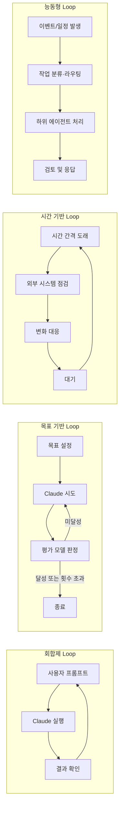
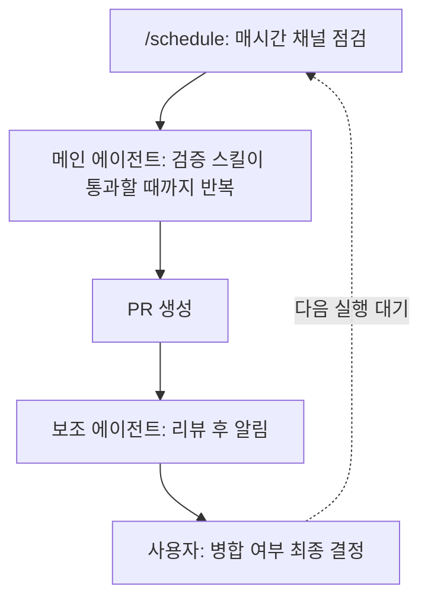

> 원문 출처: Anthropic 공식 블로그 「Getting started with loops」(2026년 6월 30일 게시, 작성자 Delba de Oliveira · Michael Segner, https://claude.com/blog/getting-started-with-loops), Claude Code 공식 문서(code.claude.com/docs), 그리고 이를 소개한 [ClaudeDevs](https://x.com/claudedevs/status/2074208949205881033)(X)와 歸藏([op7418](https://x.com/op7418/status/2074364045294293191), X)의 게시물을 바탕으로 작성했습니다. 본 문서는 2026년 7월 7일 기준으로 위 원문과 공식 문서를 직접 확인하여 검증한 내용만을 담고 있습니다.

---

## 목차

1. 들어가며: 왜 지금 "Loop"라는 단어가 화두인가
2. Claude Code 팀이 정의하는 Loop란 무엇인가
3. 유형 1 — 회합제 Loop (Turn-based Loop)
4. 유형 2 — 목표 기반 Loop (Goal-based Loop, `/goal`)
5. 유형 3 — 시간 기반 Loop (Time-based Loop, `/loop`와 `/schedule`)
6. 유형 4 — 능동형 Loop (Proactive Loop)
7. 네 가지 Loop 한눈에 비교하기
8. Loop 품질을 지키는 방법: 코드 품질 관리
9. Loop의 대가: 토큰 사용량을 관리하는 방법
10. `/goal` 명령어의 세부 동작 원리 (공식 문서 보완 설명)
11. `/schedule`과 Routines의 세부 구조 (공식 문서 보완 설명)
12. 중화권의 반응: 歸藏(op7418)이 정리한 요약과 시사점
13. 마무리: 이 프레임워크가 실제로 말해주는 것

---

## 1. 들어가며: 왜 지금 "Loop"라는 단어가 화두인가

최근 X(트위터)에서는 "프롬프트를 잘 쓰는 법" 대신 "루프를 설계하는 법(designing loops)"을 이야기하는 글이 부쩍 늘었습니다. 그런데 정작 "루프가 정확히 무엇인가"를 검색해 보면 사람마다 답이 조금씩 다릅니다. 어떤 사람은 `/loop` 명령어 하나를 가리키고, 어떤 사람은 에이전트가 스스로 판단해서 반복 작업을 수행하는 방식 전체를 가리키며, 또 어떤 사람은 코딩을 넘어 "일하는 방식 자체가 바뀌는 큰 흐름"으로 이 단어를 씁니다.

이런 혼선을 정리하기 위해 Anthropic의 Claude Code 팀이 직접 블로그 글을 통해 자신들이 사용하는 정의와 분류 체계를 공개했습니다. 이 문서에서 다루는 내용이 바로 그 원문이며, 첨부된 화면 속 네 장의 개념도(回合制 Loop, 目标型 Loop, 定时型 Loop, 主动型 Loop라는 중국어 라벨이 붙은 버전)는 이 원문의 네 가지 루프 유형을 시각화한 자료입니다. 함께 인용된 歸藏(계정명 op7418)의 글은 이 원문 내용을 중국어로 요약하고 자신의 해석을 덧붙인 게시물입니다.

## 2. Claude Code 팀이 정의하는 Loop란 무엇인가

Claude Code 팀은 루프를 다음과 같이 정의합니다.

> **루프란, 에이전트가 정지 조건(stop condition)이 충족될 때까지 작업의 주기(cycle)를 반복하는 것이다.**

이 정의 자체는 단순하지만, 팀은 여기서 한 걸음 더 나아가 루프를 네 가지 기준으로 세분화합니다. 첫째는 무엇이 그 루프를 촉발(trigger)하는가, 둘째는 무엇이 그 루프를 멈추게(stop) 하는가, 셋째는 Claude Code의 어떤 기능(primitive)이 사용되는가, 넷째는 어떤 유형의 작업에 그 루프가 가장 적합한가입니다. 이 네 가지 기준을 축으로 삼아 팀은 루프를 회합제(Turn-based), 목표 기반(Goal-based), 시간 기반(Time-based), 능동형(Proactive)이라는 네 단계로 나눕니다.

중요한 전제도 함께 짚고 넘어갑니다. 모든 작업에 복잡한 루프가 필요한 것은 아니며, 가장 단순한 해법부터 시작해서 필요한 경우에만 이 패턴들을 선택적으로 적용하라는 것입니다. 즉 이 네 단계는 "더 발전된 방식으로 무조건 올라가야 하는 사다리"가 아니라, 작업의 성격에 맞춰 고르는 도구 상자에 가깝습니다.

아래 그림은 이 네 유형이 어떻게 서로 다른 궤도를 그리는지를 정리한 것입니다.



## 3. 유형 1 — 회합제 Loop (Turn-based Loop)


이 유형은 우리가 Claude Code를 처음 접했을 때부터 이미 매일 경험하고 있는 가장 기본적인 방식입니다. 공식 문서는 이를 다음과 같이 규정합니다. 촉발 요인은 사용자의 프롬프트 하나이고, 정지 기준은 Claude 스스로 "작업을 완료했다" 혹은 "추가 맥락이 필요하다"고 판단하는 시점입니다. 가장 적합한 용도는 정기적인 절차나 일정의 일부가 아닌, 비교적 짧은 단발성 작업입니다. 그리고 이 유형을 관리하는 방법은 구체적인 프롬프트를 작성하고, 스킬(skill)을 활용해 검증 단계를 개선함으로써 왕복 횟수(turn) 자체를 줄이는 것입니다.

우리가 보내는 모든 프롬프트는 사실 하나의 수동 루프를 시작시킵니다. 다만 그 루프의 각 단계를 사람이 직접 지휘한다는 점이 다른 유형과 구분되는 지점입니다. Claude는 맥락을 수집하고, 행동을 취하고, 자신의 작업을 점검하고, 필요하면 이를 반복한 뒤 응답을 내놓습니다. Claude Code 팀은 이 흐름 전체를 "에이전틱 루프(agentic loop)"라고 부릅니다.

예를 들어 "좋아요 버튼을 만들어줘"라고 요청하면, Claude는 기존 코드를 읽고, 수정하고, 테스트를 돌린 뒤, 스스로 "이 정도면 작동할 것"이라고 믿는 결과물을 건네줍니다. 그 뒤에는 사람이 그 결과물을 직접 확인하고, 다음 프롬프트를 작성하는 방식으로 대화가 이어집니다.

여기서 팀이 강조하는 개선 포인트가 하나 있습니다. 검증 단계를 사람이 매번 손으로 확인하는 대신, 그 확인 절차 자체를 `SKILL.md` 파일로 코드화해두면 Claude가 스스로 자신의 작업을 훨씬 더 폭넓게, 처음부터 끝까지 점검할 수 있게 된다는 것입니다. 이때 핵심은 Claude가 결과물을 직접 보고(see), 측정하고(measure), 상호작용(interact)할 수 있는 도구나 커넥터를 함께 제공하는 것이며, 점검 기준이 정량적일수록 Claude 스스로 검증하기가 쉬워집니다.

원문이 제시하는 예시 스킬은 프런트엔드 변경 사항을 검증하는 절차입니다. 이 스킬은 UI 변경을 단순히 "코드 수정에 성공했다"는 이유만으로 완료로 보고하지 말 것을 명시하고, 사람 검토자가 하듯 개발 서버를 켜서 실제로 페이지를 열어보고, 새로 추가된 컨트롤을 직접 클릭해 상태 변화와 전후 화면을 비교하고, 브라우저 콘솔에 새로운 오류나 경고가 없는지 확인하고, 크롬 개발자 도구 MCP를 이용해 성능 추적과 핵심 웹 지표(Core Web Vitals) 감사를 수행하도록 지시합니다. 이 중 어느 단계라도 실패하면 문제를 고친 뒤 처음 단계부터 다시 실행하고, 절반만 검증된 작업을 그대로 넘기지 말라는 원칙도 함께 담겨 있습니다.

```
--- 
name: verify-frontend-change 
description: Verify any UI change end-to-end before declaring it done. 
--- 

# Verifying frontend changes 
Never report a UI change as complete based on a successful edit alone. Verify it the way a human reviewer would: 

1. Start the dev server and open the edited page in the browser. 

2. Interact with the change directly. For a new control (button, input, toggle): click it, confirm the expected state change, and screenshot before/after. 

3. Check the browser console: zero new errors or warnings. 

4. Use the Chrome Devtools MCP, run a performance trace and audit Core Web Vitals.

If any step fails, fix the issue and rerun from step 1 — do not hand back partially verified work.

```

## 4. 유형 2 — 목표 기반 Loop (Goal-based Loop, `/goal`)


두 번째 유형은 `/goal` 명령어로 대표됩니다. 촉발 요인은 여전히 실시간으로 사람이 입력하는 프롬프트이지만, 정지 기준이 달라집니다. 목표가 달성되었거나, 사용자가 지정한 최대 시도 횟수(turn)에 도달했을 때 멈춥니다. 이 유형은 검증 가능한 종료 조건이 있는 작업, 즉 "완료됐는지 아닌지를 객관적으로 판정할 수 있는 작업"에 가장 잘 맞습니다. 관리 방법은 구체적인 완료 기준을 설정하고, "5번 시도 후 중단"과 같은 명시적인 횟수 상한을 함께 거는 것입니다.

복잡한 작업일수록 한 번의 왕복만으로는 부족한 경우가 많습니다. 에이전트는 반복할 수 있을 때 더 나은 성과를 냅니다. `/goal`은 "완료란 무엇인가"를 사람이 미리 정의해둠으로써, Claude가 계속 반복할 수 있는 기간을 늘려주는 장치입니다.

이 방식의 핵심은 완료 기준을 사람이 명시적으로 정의해두면, Claude 스스로 "이 정도면 충분히 잘 됐다"는 모호한 판단을 내려 루프를 너무 일찍 끝내버리는 문제를 막을 수 있다는 점입니다. Claude가 매번 작업을 멈추려고 할 때마다, 별도의 평가 모델(evaluator model)이 사용자가 설정한 조건을 충족했는지 점검하고, 조건이 충족되지 않았다면 다시 작업으로 돌려보냅니다. 이 과정은 목표가 충족되거나, 사용자가 지정한 횟수에 도달할 때까지 계속됩니다. 통과한 테스트의 개수나 특정 점수 기준선 통과처럼, 결정론적인(deterministic) 기준일수록 이 방식이 특히 효과적인 이유가 여기에 있습니다.

원문이 제시한 예시 명령어는 다음과 같습니다.

```
/goal get the homepage Lighthouse score to 90 or above, stop after 5 tries.
```

("홈페이지의 Lighthouse 점수를 90점 이상으로 만들어라, 5번 시도 후에는 중단하라"는 뜻입니다.)

## 5. 유형 3 — 시간 기반 Loop (Time-based Loop, `/loop`와 `/schedule`)


세 번째 유형은 특정 시간 간격에 의해 촉발됩니다. 정지 기준은 사용자가 직접 취소하거나, 작업 자체가 완료되는 것(예: PR이 병합되거나 큐가 비워지는 것)입니다. 가장 적합한 용도는 반복적으로 발생하는 작업이나, 외부 환경·시스템과 상호작용해야 하는 작업입니다. 관리 방법은 간격을 더 길게 잡거나, 시간이 아닌 이벤트에 반응하도록 설계하는 것입니다.

일부 에이전트 작업은 성격 자체가 반복적입니다. 예를 들어 매일 아침 슬랙 메시지를 요약하는 작업처럼, 작업 내용은 그대로이고 입력값만 바뀌는 경우입니다. 또 어떤 작업은 외부 시스템에 의존하는데, 이런 시스템과 상호작용하는 간단한 방법은 일정 간격으로 상태를 확인하고 변화가 있으면 반응하는 것입니다. 코드 리뷰를 받거나 CI(지속적 통합, Continuous Integration의 약자로 코드 변경 시 자동으로 실행되는 검증 절차)에 실패할 수 있는 PR이 대표적인 예입니다.

이런 경우를 위해 `/loop` 명령어를 사용하면 지정한 간격마다 프롬프트를 다시 실행할 수 있습니다.

```
/loop 5m check my PR, address review comments, and fix failing CI
```

(5분마다 "내 PR을 확인하고, 리뷰 코멘트에 대응하고, 실패한 CI를 고쳐라"는 프롬프트를 재실행하라는 뜻입니다.)

여기서 반드시 짚어야 할 실무적 차이가 있습니다. `/loop`는 사용자의 컴퓨터에서 실행되기 때문에, 컴퓨터를 끄면 루프도 함께 멈춥니다. 이 루프를 클라우드로 옮기고 싶다면 `/schedule` 명령어로 루틴(routine)을 만들면 됩니다. 이 부분은 뒤에서 별도 장으로 더 자세히 다룹니다.

## 6. 유형 4 — 능동형 Loop (Proactive Loop)


네 번째이자 가장 발전된 형태는 이벤트나 일정에 의해 촉발되며, 실시간으로 사람이 개입하지 않습니다. 정지 기준은 개별 작업 단위로는 각 목표가 달성될 때 종료되지만, 루틴 자체는 사용자가 직접 꺼버리기 전까지 계속 돌아갑니다. 가장 적합한 용도는 버그 리포트, 이슈 분류, 마이그레이션, 의존성 업그레이드처럼 잘 정의되어 있고 반복적으로 발생하는 작업 흐름입니다. 관리 방법은 루틴을 더 작고 빠른 모델로 처리하도록 라우팅하고, 판단이 필요한 순간에만 가장 강력한 모델을 투입하는 것입니다.

이 유형은 앞서 설명한 개별 기능들, 즉 `/goal`이나 `/loop` 같은 기본 요소에 더해, 자동 승인 모드(auto mode)와 동적 워크플로우(dynamic workflows, 연구 프리뷰 단계)라는 Claude Code의 추가 기능을 조합해서 만들어지는 장기 실행 루프입니다.

예를 들어 들어오는 피드백을 처리하기 위해 다음과 같은 조합을 쓸 수 있습니다. 새로운 리포트가 있는지 확인하는 루틴을 돌리기 위한 `/schedule`(연구 프리뷰 단계), 완료의 기준을 정의하기 위한 `/goal`과 그 검증 방식을 문서화하는 스킬, 각 리포트를 분류하고 고치고 수정 사항을 검토하는 에이전트들을 오케스트레이션하는 동적 워크플로우, 그리고 이 루틴이 매번 권한을 묻기 위해 멈추지 않도록 하는 자동 승인 모드입니다.

원문이 제시한 종합 예시 프롬프트는 다음과 같습니다.

```
/schedule every hour: check #project-feedback for bug reports.
/goal: don't stop until every report found this run is triaged,
actioned, and responded to. When fixing a bug, use a workflow to
explore three solutions in parallel worktrees and have a judge
adversarially review them.
```

(매시간 #project-feedback 채널에서 버그 리포트를 확인하고, 이번 실행에서 발견된 모든 리포트가 분류되고 처리되고 응답될 때까지 멈추지 말며, 버그를 고칠 때는 세 개의 독립된 작업 공간(worktree)에서 세 가지 해결책을 병렬로 탐색한 뒤 심사자 역할의 에이전트가 서로 다른 시각에서 이를 검토하게 하라는 뜻입니다.)

이 흐름을 그림으로 정리하면 다음과 같습니다.



여기서 중요한 것은 "라플탑이 켜져 있든 꺼져 있든 이 흐름은 계속 돌아간다"는 점입니다. 사람은 최종적으로 무엇을 병합할지 결정하는 역할만 남게 되고, 나머지 절차는 클라우드에서 자율적으로 진행됩니다.

## 7. 네 가지 Loop 한눈에 비교하기

원문 말미의 표를 그대로 옮기면 다음과 같습니다.

| 유형 | 사람이 넘기는 것 | 언제 쓰는가 | 어떤 기능을 쓰는가 |
|---|---|---|---|
| 회합제 (Turn-based) | 검증(check) | 탐색 중이거나 아직 결정을 못 내렸을 때 | 맞춤형 검증 스킬 |
| 목표 기반 (Goal-based) | 정지 조건(stop condition) | "완료"가 무엇인지 이미 알고 있을 때 | `/goal` |
| 시간 기반 (Time-based) | 촉발 시점(trigger) | 작업이 내 프로젝트 밖에서 일정에 따라 일어날 때 | `/loop`, `/schedule` |
| 능동형 (Proactive) | 프롬프트 자체 | 작업이 반복적이고 잘 정의되어 있을 때 | 위 전부 + 동적 워크플로우 |

원문은 시작하는 방법도 구체적으로 제시합니다. 지금 하고 있는 일 중에서 자신이 병목이 되는 작업 하나를 고른 뒤, 그 작업의 어느 부분을 넘길 수 있는지 스스로 물어보라는 것입니다. 검증 절차를 글로 쓸 수 있는가, 목표가 충분히 명확한가, 작업이 일정에 따라 들어오는가. 이 질문에 답이 나오면 실제로 루프를 돌려보고, 어디서 멈추거나 어디서 과도하게 나가는지 관찰한 뒤 주저 없이 계속 고쳐 나가라고 조언합니다.

## 8. Loop 품질을 지키는 방법: 코드 품질 관리

루프가 내놓는 결과물의 품질은 결국 그 루프를 둘러싼 시스템의 품질에 달려 있습니다. 원문은 시스템을 설계할 때 신경 써야 할 지점을 다음과 같이 제시합니다.

코드베이스 자체를 깨끗하게 유지하는 것이 첫 번째입니다. Claude는 이미 코드베이스에 존재하는 패턴과 관습을 그대로 따라가기 때문입니다. 두 번째는 Claude에게 자기 작업을 스스로 검증할 수 있는 방법을 주는 것입니다. 팀과 자신에게 "좋은 결과"가 어떤 모습인지를 스킬로 코드화해두라는 뜻입니다. 세 번째는 문서에 쉽게 접근할 수 있도록 하는 것입니다. 프레임워크와 라이브러리 문서에는 최신 모범 사례가 담겨 있기 때문입니다. 네 번째는 코드 리뷰를 위해 두 번째 에이전트를 활용하는 것입니다. 새로운 맥락으로 시작하는 리뷰어는 편향이 적고, 원래 작업을 수행한 에이전트의 추론 과정에 영향을 받지 않기 때문입니다. 이를 위해 내장된 `/code-review` 스킬이나 깃허브용 Code Review 기능을 쓸 수 있다고 안내합니다.

마지막으로 원문이 강조하는 원칙 하나가 있습니다. 개별 결과물이 기준에 못 미쳤을 때, 그 한 건만 고치고 끝내지 말고, 앞으로의 모든 반복에 적용될 수 있도록 그 교훈을 시스템 자체에 코드화하려고 시도하라는 것입니다.

## 9. Loop의 대가: 토큰 사용량을 관리하는 방법

토큰 사용량을 관리하려면 루프에 명확한 경계가 있어야 한다고 원문은 말합니다. 작은 작업에는 여러 에이전트나 복잡한 루프가 필요 없으며, 어떤 작업은 더 저렴하고 빠른 모델로도 충분하므로, 작업과 모델을 알맞게 골라야 한다는 것이 첫 번째 원칙입니다. 두 번째는 성공 기준과 정지 기준을 명확히 정의하는 것입니다. "완료"가 무엇인지 구체적으로 규정할수록 Claude가 해법에 더 빨리 도달할 수 있지만, 동시에 너무 이르게 끝나지 않도록 하는 균형도 필요합니다.

세 번째는 대규모로 실행하기 전에 먼저 시범 삼아 돌려보라는 것입니다. 동적 워크플로우는 수백 개의 에이전트를 동시에 파생시킬 수 있으므로, 작업 전체가 아닌 작은 조각으로 먼저 사용량을 가늠해보라는 조언입니다. 네 번째는 결정론적인 작업에는 스크립트를 활용하라는 것입니다. 스크립트를 실행하는 것이 매번 추론을 거쳐 단계를 밟는 것보다 저렴하기 때문입니다. 예를 들어 PDF 관련 스킬이 양식 채우기 스크립트를 함께 제공하면, Claude는 매번 그 코드를 다시 유도해내는 대신 그 스크립트를 그대로 실행하면 됩니다.

다섯 번째는 필요 이상으로 자주 루틴을 돌리지 말라는 것입니다. 감시하려는 대상이 실제로 얼마나 자주 바뀌는지에 맞춰 간격을 설정하라는 뜻입니다. 여섯 번째는 사용량을 주기적으로 점검하라는 것입니다. `/usage` 명령어는 스킬, 서브 에이전트, MCP별로 최근 사용량을 분류해서 보여주고, 아무 인자 없이 `/goal`을 입력하면 지금까지 진행된 턴 수와 토큰 사용량을 보여주며, `/workflows` 명령어는 각 에이전트의 토큰 사용량을 보여주고 언제든 특정 에이전트를 중단시킬 수 있습니다.

## 10. `/goal` 명령어의 세부 동작 원리 (공식 문서 보완 설명)

원문 블로그에는 소개되지 않았지만, Claude Code 공식 문서를 직접 확인한 결과 `/goal`의 내부 동작 방식을 더 구체적으로 파악할 수 있었습니다. 이 부분은 실제로 학습자에게 명령어를 가르칠 때 특히 유용한 세부 사항이므로 함께 정리합니다.

`/goal`은 세션 범위(session-scoped)의 프롬프트 기반 Stop 훅(hook)을 감싸는 래퍼(wrapper)입니다. Claude가 한 턴(turn)을 마칠 때마다, 사용자가 설정한 조건과 지금까지의 대화 내용 전체가 사용자가 설정한 "작고 빠른 모델(small fast model)"로 전송됩니다. 이 모델은 기본값으로 Haiku가 지정되어 있습니다. 이 평가 모델은 예/아니오 판정과 짧은 이유를 함께 반환합니다. "아니오"라는 판정이 나오면 Claude는 계속 작업하라는 지시를 받고, 그 이유가 다음 턴을 위한 안내로 함께 전달됩니다. "예"라는 판정이 나오면 목표가 해제되고, 대화 기록(transcript)에 "달성됨(achieved)" 항목이 기록됩니다.

이 평가자는 세션이 설정된 것과 동일한 공급자(provider) 위에서 작동하며, 도구를 직접 호출하지 않습니다. 즉 Claude가 대화 안에서 이미 드러낸 내용만을 근거로 판단할 수 있다는 뜻입니다. 이 때문에 "npm test가 종료 코드 0으로 끝난다"처럼, Claude 스스로의 출력물이 곧 증거가 되는 형태로 조건을 작성하는 것이 중요하다고 문서는 강조합니다.

한 세션에는 하나의 목표만 활성화될 수 있으며, 조건의 길이는 최대 4,000자까지 허용됩니다. 목표를 얼마나 오래 실행할지 제한하고 싶다면 "20턴 후에는 중단하라"처럼 턴 수나 시간에 대한 조건절을 함께 조건문에 포함시키면 됩니다. `/goal` 명령어를 인자 없이 입력하면 현재 상태, 즉 조건 내용, 실행 시간, 평가된 턴 수, 현재 토큰 소모량, 평가자의 가장 최근 판정 이유를 볼 수 있습니다.

목표를 취소하려면 `/goal clear`를 입력하면 되고, `stop`, `off`, `reset`, `none`, `cancel`이 모두 같은 기능을 하는 별칭(alias)으로 인정됩니다. 새로운 대화를 시작하기 위해 `/clear`를 입력해도 활성화된 목표는 함께 제거됩니다. 세션이 종료될 때 목표가 활성 상태였다면, `--resume`이나 `--continue`로 그 세션을 다시 열었을 때 조건 자체는 복원되지만, 턴 수·타이머·토큰 소모 기준선은 모두 초기화됩니다. 반대로 이미 달성되었거나 취소된 목표는 복원되지 않습니다.

`/goal`은 비대화형 모드(non-interactive mode), 데스크톱 앱, 그리고 Remote Control(원격 제어) 환경에서도 동작합니다. 다음과 같이 `-p` 플래그와 함께 실행하면 하나의 호출만으로 루프를 완료 상태까지 밀어붙일 수 있습니다.

```bash
claude -p "/goal CHANGELOG.md has an entry for every PR merged this week"
```

이 방식으로 비대화형 목표를 실행 중일 때 조건이 충족되기 전에 멈추고 싶다면 Ctrl+C로 중단하면 됩니다.

마지막으로 실행 조건 두 가지가 있습니다. `/goal`은 신뢰(trust) 대화 상자를 이미 수락한 작업 공간(workspace)에서만 작동하는데, 평가자 자체가 훅 시스템(hooks system)의 일부이기 때문입니다. 또한 설정에서 `disableAllHooks`가 어느 수준에서든 켜져 있거나, 관리형 설정(managed settings)에서 `allowManagedHooksOnly`가 지정되어 있으면 `/goal`을 사용할 수 없으며, 이 경우 명령어는 조용히 아무 반응도 하지 않는 대신 그 이유를 알려줍니다.

## 11. `/schedule`과 Routines의 세부 구조 (공식 문서 보완 설명)

원문 블로그는 `/schedule`을 "루프를 클라우드로 옮기는 방법" 정도로만 짧게 언급합니다. 하지만 공식 문서를 확인해 보면 Claude Code가 제공하는 예약 실행 방식이 실제로는 세 가지 층위로 나뉘어 있다는 사실을 알 수 있습니다.

첫 번째 층위는 `/loop`입니다. 이는 세션에 종속되어 있어서, 터미널이나 세션이 살아 있는 동안에만 작동하고 컴퓨터가 잠들거나 세션이 종료되면 함께 멈춥니다. 두 번째 층위는 데스크톱 예약 작업(Desktop scheduled tasks)입니다. 이는 사용자의 로컬 컴퓨터에서 실행되며, 데스크톱 앱이 열려 있고 컴퓨터가 깨어 있는 동안에만 작동합니다. 파일과 도구에 직접 접근할 수 있다는 장점이 있는 대신, 컴퓨터가 잠들면 예약된 실행이 건너뛰어집니다. 세 번째 층위가 바로 루틴(Routines)입니다. 이는 Anthropic이 관리하는 클라우드 인프라에서 실행되기 때문에 사용자의 컴퓨터가 꺼져 있어도 예정된 시간에 그대로 실행됩니다.

CLI에서 `/schedule` 명령어를 입력하면 대화형으로 클라우드 루틴을 만들 수 있습니다. 예를 들어 "매주 평일 오전 9시에 CI 대시보드를 확인하고 실패 항목을 요약하라"는 식의 자연어 명령을 그대로 사용할 수 있습니다. 최소 실행 간격은 1시간이며, 이보다 더 짧은 간격의 표현식은 거부됩니다. "매 2시간마다"나 "매달 첫째 월요일"처럼 사전 설정에 없는 간격을 지정하려면, 웹 UI에서 가장 가까운 사전 설정을 먼저 고른 뒤 CLI에서 `/schedule update`로 구체적인 크론(cron) 표현식을 지정하면 됩니다. 실행 시각은 실제 예정 시각보다 몇 분 정도 늦게 시작될 수 있는데, 이는 여러 루틴이 몰리는 것을 분산시키기 위한 의도적인 지연(stagger)이며, 이 지연 폭은 같은 루틴이라면 항상 일정하게 유지됩니다.

루틴은 크게 세 부분으로 구성됩니다. 가장 중요한 프롬프트(사람의 승인 없이 자율적으로 실행되기 때문에 지시가 명확해야 합니다), Claude가 작업을 수행할 하나 이상의 저장소(repository), 그리고 슬랙·리니어·구글 드라이브 등을 연결하는 선택적 커넥터(connector)입니다. 촉발 방식도 일정(schedule) 외에 API 호출이나 깃허브 이벤트를 통해서도 가능하며, 하나의 루틴이 이 세 가지 촉발 방식을 동시에 가질 수도 있습니다. 기본적으로 루틴은 `claude/`로 시작하는 브랜치에만 푸시할 수 있도록 제한되어 있는데, 이는 루틴이 실수로 보호된 브랜치를 변경하는 것을 막기 위한 안전장치입니다. 다른 브랜치에도 푸시하고 싶다면 "제한 없는 브랜치 푸시 허용" 설정을 켜야 합니다.

루틴은 일반 대화형 세션과 마찬가지로 구독 사용량을 소모하며, 여기에 더해 계정별로 하루에 시작할 수 있는 실행 횟수에 별도의 상한이 걸려 있습니다. 참고로 Claude Cowork에서도 `/schedule`을 입력하면 유사한 방식으로 반복 작업을 예약할 수 있는 스킬이 실행되며, 컴퓨터가 잠들어 있던 동안 건너뛴 작업은 앱이 다시 켜지면 자동으로 재실행되고 그 사실을 알림으로 안내해 줍니다.

## 12. 중화권의 반응: 歸藏(op7418)이 정리한 요약과 시사점

Anthropic의 이 블로그 글은 X에서 op7418(계정 이름 歸藏)이라는 계정을 통해 중국어로 요약되어 소개되었습니다. 해당 게시물은 "지금 사람들이 말하는 Loop Engineer의 밑바탕 논리는 이 개념이 정식으로 제안되기 전부터 이미 갖춰져 있었고, 이런 작업 흐름도 다들 계속 써오던 것인데, 다만 새로운 이름이 붙었을 뿐"이라는 관찰로 시작합니다. 이는 원문의 취지, 즉 "루프라는 말이 갑자기 새로 생긴 개념이 아니라 이미 존재하던 실무 패턴에 정식 이름과 분류 체계를 붙인 것"이라는 메시지와 정확히 일치하는 해석입니다.

op7418의 요약은 원문의 네 가지 유형을 각각 회합제 순환(回合制循环, Single-turn Loop), 목표 기반 순환(基于目标的循环, Goal-oriented Loop), 시간 기반 순환(基于时间的循环, Time-based Loop), 능동 순환(主动循环, Active Loop)으로 번역해 정리했습니다. 여기서 눈여겨볼 만한 점은, 원문이 회합제 유형을 "사람이 매번 개입하지 않아도 된다"는 식으로 서술하지 않는데도, op7418의 요약문에는 "이 순환에서는 추가 개입이 필요하지 않다(不需要额外干预)"는 표현이 들어가 있다는 점입니다. 이는 요약자가 "Claude가 한 턴 안에서 스스로 맥락 수집, 실행, 검토를 반복한다"는 원문의 내부 절차를 강조하려 한 것으로 보이며, 다만 최종적으로 다음 프롬프트를 사람이 작성해야 한다는 원문의 전제 자체는 달라지지 않습니다. 정보를 인용할 때는 이런 미세한 뉘앙스 차이도 함께 참고할 필요가 있습니다.

또한 op7418은 원문의 "코드 품질 유지"와 "토큰 사용량 관리" 두 절을 자신의 언어로 재구성하면서, 특히 목표 기반 모드가 토큰을 크게 소모할 수 있다는 점과, 시스템 자체에 명확한 경계(대형 모델을 쓸 시점과 소형 모델을 쓸 시점, 명확한 시작·종료 조건)를 설정해두지 않으면 시스템이 스스로 방향을 잃고 한없이 실행되면서 많은 토큰을 소모할 위험이 있다는 점을 강조합니다. 이는 원문의 "관리형 사용(managed usage)" 항목들과 방향이 일치하는 해석입니다.

마지막으로 op7418은 이 네 가지 순환 방식이 결국 지금 에이전트가 흔히 갖추고 있는 여러 기능들, 즉 앞서 언급한 GOAL 모드, Loop 모드, 그리고 스킬(Skills)과 훅(Hooks) 같은 요소들의 조합으로 이루어진다는 결론을 덧붙였습니다. 이 결론 역시 원문이 4장(능동형 루프)에서 "이 기본 요소들이 자동 승인 모드, 동적 워크플로우 같은 다른 기능과 조합되어 더 큰 루프를 이룬다"고 서술한 부분과 같은 맥락입니다.

## 13. 마무리: 이 프레임워크가 실제로 말해주는 것

이 문서에서 다룬 네 단계, 즉 회합제·목표 기반·시간 기반·능동형이라는 분류는 사실 "에이전트에게 무엇을 넘겨줄 것인가"라는 하나의 질문에 대한 네 가지 답으로 요약할 수 있습니다. 회합제에서는 사람이 검증(check)만 손에 쥐고 나머지를 넘기고, 목표 기반에서는 정지 조건(stop condition) 자체를 넘기며, 시간 기반에서는 촉발 시점(trigger)을 넘기고, 능동형에서는 프롬프트 자체를 넘기게 됩니다. 각 단계로 올라갈수록 사람이 손에서 놓는 몫이 늘어나지만, 그만큼 검증 절차와 완료 기준을 사전에 정교하게 설계해두어야 하는 부담도 함께 커집니다.

원문이 반복해서 강조하는 문장, "루프의 품질은 그 루프를 둘러싼 시스템의 품질에 달려 있다"는 말은 결국 루프라는 개념이 프롬프트 작성 기술의 연장이 아니라, 검증 가능한 완료 기준을 세우고 이를 코드나 스킬로 문서화하는 엔지니어링 작업에 더 가깝다는 점을 보여줍니다. 그리고 이 지점이야말로 최근 화두가 되고 있는 "루프 설계(loop engineering)"라는 표현이 실제로 가리키는 대상이라 할 수 있습니다.
