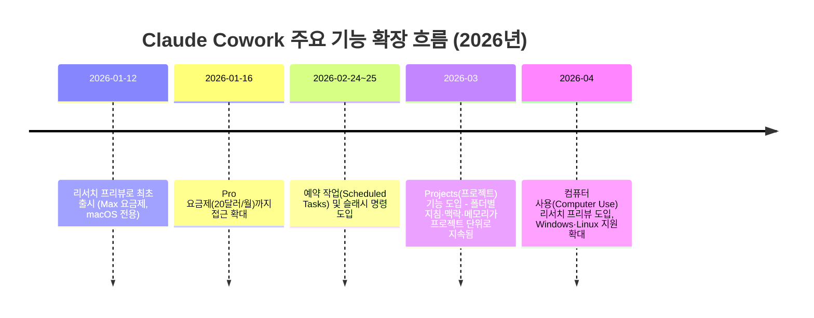
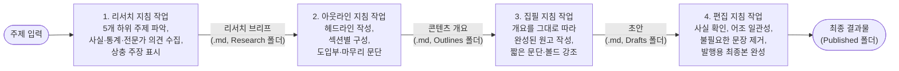

> 이 문서는 Khairallah AL-Awady(X 계정 @eng_khairallah1)가 게시한 ["How to Build Your First Team of AI Agents Using Claude (Full Course)"](https://x.com/eng_khairallah1/status/2074410155689542072) 가이드를 원문 그대로 정리하고, Claude Cowork의 공식 문서·발표 자료를 웹 검색으로 확인해 사실관계를 대조한 자료입니다. 확인되지 않거나 과장된 부분은 추측하지 않고 그대로 "확인 불가" 또는 "실제와 다름"으로 표시했습니다.

---

## 1. 이 자료를 읽기 전에 — 출처를 먼저 점검합니다

이 가이드는 X(트위터) 계정 @eng_khairallah1이 작성한 장문 게시글입니다. 이 계정의 게시 이력을 살펴보면 몇 가지 반복되는 패턴이 있습니다.

- "Anthropic이 방금 OO분짜리 워크숍을 공개했다", "Anthropic 엔지니어 두 명이 24분 만에 모든 기능을 공개했다" 같은 문구가 24분, 25분, 27분, 30분, 45분 등 숫자만 바뀐 채 여러 달에 걸쳐 반복 게시되고, 매번 자신이 쓴 다른 장문 글로 연결됩니다.
- "카르파시가 Anthropic에 합류했다"처럼 사실에 기반한 소재(실제로 Andrej Karpathy는 2026년 5월 19일 Anthropic의 프리트레이닝 팀에 합류했습니다)를 언급하면서도, "그의 팀 동료가 실제 사용하는 LOOPS.md 파일을 보여줬다"처럼 검증 불가능한 개인 일화를 덧붙여 신뢰도를 높이는 방식의 글쓰기가 반복됩니다.
- 이번에 검토하는 "AI 에이전트 팀 만들기" 글 역시 같은 계정의 여러 "OO 완전 가이드" 시리즈 중 하나입니다.

이것이 뜻하는 바는 "이 글의 내용이 전부 거짓"이라는 것이 아닙니다. 실제로 아래에서 확인하듯, 이 글이 설명하는 Cowork의 개별 기능(폴더 접근권, 지침 작성, 예약 작업 등)은 대체로 실재하는 기능에 기반하고 있습니다. 다만 **"에이전트를 만든다"는 표현이 Cowork의 공식 기능명인지, 저자가 만든 활용법 은유인지를 구분**하고, **"이렇게 하면 완전 자동으로 4명의 에이전트가 협업한다"는 뉘앙스가 실제 제품 동작과 정확히 일치하는지**를 항목별로 짚어보는 것이 이 문서의 목적입니다.

---

## 2. Claude Cowork 자체에 대한 검증된 사실

가이드 본문에 들어가기 전에, Cowork가 실제로 무엇인지부터 명확히 해두겠습니다.

Claude Cowork는 Anthropic이 2026년 1월 12일 처음 공개한 기능으로, Claude Desktop 앱 안에서 Claude가 사용자의 로컬 파일·폴더에 직접 접근해 여러 단계로 이루어진 작업을 자율적으로 수행하도록 만든 에이전트 시스템입니다. Claude Code(개발자용 터미널 도구)와 동일한 에이전트 아키텍처를 공유하지만, 터미널 지식 없이도 비개발자가 쓸 수 있도록 데스크톱 앱 안에 단순화된 형태로 제공됩니다.

일반 채팅과 결정적으로 다른 점은 **파일 접근권**입니다. 일반 채팅에서는 파일을 매번 업로드해야 하지만, Cowork에서는 특정 폴더에 접근 권한을 부여하면 Claude가 그 폴더 안의 파일을 직접 읽고, 수정하고, 새로 만들 수 있습니다. 작업 도중에는 계획을 세우고, 필요하면 여러 하위 작업을 병렬로 처리하며, 진행 상황을 계속 사용자에게 보여줍니다. 파일을 영구 삭제하는 작업에는 반드시 별도의 승인이 필요하도록 설계되어 있습니다.

### Cowork 기능 확장 흐름 (공식 발표 기준)

가장 최근 공식 자료 기준으로 Cowork는 macOS, Windows, Linux 모두에서 Claude Desktop 앱을 통해 이용할 수 있고, Pro·Max·Team·Enterprise 등 모든 유료 요금제에서 접근 가능합니다. 다만 Cowork 작업은 일반 채팅보다 토큰 소모가 크기 때문에 Pro 요금제 사용자는 사용량 제한에 더 빨리 도달할 수 있다는 점이 공식 안내에 포함되어 있습니다.

---

## 3. 가이드의 핵심 프레임 — "에이전트를 구성하는 4가지 요소"

가이드는 모든 AI 에이전트가 다음 4가지로 이루어진다고 설명합니다.

| 요소 | 가이드의 설명 | 실제 Cowork에서의 대응 |
|---|---|---|
| 역할 (Role) | "무엇이든 하는 AI"가 아니라 "한 가지 일을 전문적으로 하는 AI" | Cowork 자체에 "역할"을 저장하는 별도 슬롯은 없음. 작업 시작 시 사람이 입력하는 지침 문구로 역할을 부여하는 방식 |
| 지침 (Instructions) | 과정, 품질 기준, 출력 형식을 구체적으로 명시 | 실제로 Cowork의 작업 성능은 지침의 구체성에 크게 좌우됨. 이 설명 자체는 타당함 |
| 도구 (Tools) | 웹 검색, 파일 접근, 이메일, 캘린더 연동 여부 | Cowork는 실제로 로컬 파일 접근권 + 커넥터(Gmail, Google Drive, Slack 등) + 웹 검색·Claude in Chrome 연동을 지원함 |
| 메모리 (Memory) | 과거 작업을 기억하는지 여부 | 2026년 3월 이전에는 Cowork 세션마다 맥락이 초기화되는 방식이었으나, 이후 도입된 **Cowork Projects** 기능을 통해 프로젝트 단위로 메모리가 유지되도록 바뀜 |

이 4요소 프레임 자체는 AI 에이전트를 개념적으로 이해하는 데 무리가 없는 설명입니다. 다만 "메모리" 항목은 가이드가 쓰여진 시점과 현재 Cowork의 실제 동작 방식 사이에 차이가 있을 수 있는 부분이라 아래에서 더 자세히 다룹니다.

---

## 4. 첫 번째 에이전트 만들기 — 가이드의 5단계 검증

가이드는 Claude Desktop의 Cowork 탭을 열고 다음 5단계로 "리서치 에이전트"를 만들라고 안내합니다.

1. **역할 정하기**: 콘텐츠 리서치, 초안 작성, 데이터 정리, 미팅 준비, 주간 리포트 중 하나를 선택
2. **시스템 지침 작성하기**: "너는 나의 콘텐츠 리서치 에이전트다. 5개 하위 주제를 찾고, 각각 사실·통계·전문가 의견을 수집하고, 상충하는 주장을 표시하고..." 같은 상세 지침 입력
3. **접근권 부여하기**: 결과물을 저장할 `/Research` 폴더에 접근권을 주고, Gmail·Google Drive·Slack 같은 커넥터가 있다면 함께 연결
4. **테스트하기**: 실제 주제를 던져서 결과물을 확인
5. **다듬기**: 출력이 너무 길다거나 형식이 안 맞으면 구체적으로 피드백해서 다음 결과물의 품질을 높이기

**검증 결과**: 이 5단계는 실제 Cowork 사용법과 정확히 일치합니다. 폴더 접근권을 지정하고, 자연어로 상세한 지침을 주고, 결과를 보며 지침을 다듬어나가는 것은 Anthropic 공식 문서가 안내하는 표준적인 Cowork 사용 흐름 그대로입니다. 다만 정확히 말하면 이 과정은 "에이전트를 만드는" 것이 아니라, **하나의 Cowork 작업(또는 프로젝트)에 역할 지침을 부여하는 것**입니다. Cowork에는 만들어진 "에이전트"를 목록에 저장해두고 이름으로 불러 쓰는 별도의 등록 기능은 없습니다(단, 아래 6장에서 설명할 **Projects** 기능을 활용하면 비슷한 효과를 낼 수 있습니다).

---

## 5. "4개 에이전트 팀" 워크플로우 — 콘텐츠 제작 파이프라인

가이드가 제시하는 핵심 사례는 리서치→아웃라인→집필→편집으로 이어지는 4단계 콘텐츠 제작 파이프라인입니다.

가이드가 설명하는 실행 방식은 다음과 같습니다: "리서치 에이전트"에게 "[주제]를 리서치하라"고 말하고, 그 출력을 "아웃라인 에이전트"에게 넘겨 "이 리서치 브리프로 아웃라인을 만들어라"라고 말하고, 이런 식으로 사람이 각 단계 사이에서 결과물을 손으로 이어붙이며 4단계를 거치는 것입니다.

**중요한 구분점**: 이는 Cowork가 자동으로 4개의 독립된 에이전트를 생성해 서로 통신하게 만드는 기능이 아닙니다. 실제로는 **역할 지침이 다른 4개의 개별 작업(대화창)을 사람이 순서대로 실행하고, 한 작업의 출력 파일을 다음 작업의 입력으로 사람이 직접 지정**하는 방식입니다. "팀"이라는 표현은 은유이고, 실제로 작업 사이를 조율하는 주체는 여전히 사람입니다. (다만 아래 6-4에서 설명하는 것처럼, 하나의 작업 안에서 "리서치→아웃라인→집필→편집 전체 파이프라인을 실행하라"고 한 번에 지시하면 Cowork가 내부적으로 하위 작업을 조율해 처리하는 것도 가능합니다. 이 경우에도 각 단계가 별도의 "에이전트"로 저장되는 것은 아니고, 하나의 작업 안에서 Claude가 스스로 단계를 나누어 순차 처리하는 것입니다.)

---

## 6. "고급 기법" 4가지 — 항목별 사실관계 대조

가이드의 4번째 모듈에서 제시하는 고급 기법들을 하나씩 검증했습니다.

### 6-1. 예약된 에이전트 워크플로우 (`/schedule`)

가이드는 매주 월요일 아침 7시에 리서치 작업을, 8시에 아웃라인 작업을 자동 실행하도록 예약할 수 있다고 설명합니다.

**검증**: 실재하는 기능입니다. `/schedule`은 2026년 2월 24~25일 Anthropic이 공식 도입한 Cowork 예약 작업(Scheduled Tasks) 기능으로, 현재 모든 유료 요금제에서 사용할 수 있습니다. 어떤 Cowork 작업에서든 `/schedule`을 입력하면 반복 주기(시간별/매일/매주/평일만/온디맨드)를 설정해 자동 실행되는 작업으로 전환됩니다. 다만 한 가지 중요한 제약이 있습니다 — **예약 작업은 컴퓨터가 켜져 있고 Claude Desktop 앱이 실행 중일 때만 동작**합니다. 컴퓨터가 잠자기 상태이거나 앱이 꺼져 있으면 해당 회차는 건너뛰고, 컴퓨터가 다시 깨어날 때 자동으로 실행됩니다.

### 6-2. 일관성을 위한 컨텍스트 파일 (`context.md`)

가이드는 모든 에이전트가 작업 시작 전에 공통으로 읽는 `context.md` 파일(대상 독자, 톤, 금지 표현, 형식 규칙 등)을 만들고, 모든 에이전트의 지침에 "작업 시작 전 context.md를 먼저 읽어라"를 추가하라고 안내합니다.

**검증**: 이 아이디어 자체는 유효하지만, 가이드가 설명하는 방식(매번 지침에 "먼저 이 파일을 읽어라"라고 수동으로 적어주는 방식)은 다소 번거로운 우회 방법입니다. 2026년 3월 Anthropic이 공식 도입한 **Cowork Projects(프로젝트)** 기능을 사용하면 이 목적을 훨씬 더 정확하게 달성할 수 있습니다. 프로젝트 단위로 폴더, 지침(Instructions), 맥락(Context), 메모리(Memory)를 한 번 설정해두면, 그 프로젝트 안에서 실행되는 모든 작업이 매번 "먼저 읽어라"라는 지시 없이도 자동으로 해당 맥락을 불러옵니다. 즉, 가이드가 이 글을 쓴 시점 이후에 Anthropic이 사실상 이 아이디어를 공식 기능으로 만들었다고 볼 수 있습니다.

### 6-3. 피드백 루프

가이드는 매번 결과물에 구체적인 피드백을 주면 다음 결과물의 품질이 계속 좋아진다고 설명합니다.

**검증**: 이 부분은 과장 없이 타당한 설명입니다. 다만 "에이전트가 시간이 지나며 스스로 기준을 학습한다"는 뉘앙스에 대해서는 주의가 필요합니다. Cowork Projects의 메모리 기능이 활성화된 프로젝트 안에서는 실제로 이전 작업에서의 맥락을 다음 작업이 참고할 수 있지만, 프로젝트로 묶이지 않은 개별 작업들 사이에서는 이런 학습이 자동으로 이어지지 않습니다. 즉 이 기법이 실제로 작동하려면 같은 프로젝트 안에서 반복 작업을 해야 한다는 전제가 필요합니다.

### 6-4. 멀티스텝 자동화 워크플로우

가이드는 "이 주제로 전체 파이프라인(리서치→아웃라인→집필→편집)을 실행하고, 중간 파일을 모두 저장한 뒤 최종본을 Published 폴더에 전달하라"고 한 번에 지시하면 Claude가 처음부터 끝까지 전부 처리한다고 설명합니다.

**검증**: 부분적으로 타당합니다. Cowork는 실제로 복잡한 작업을 여러 하위 작업으로 나누고 병렬로 조율하는 "서브에이전트 조율(sub-agent coordination)" 능력을 갖추고 있어서, 이런 식의 한 번에 지시하는 방식이 실제로 동작할 수 있습니다. 다만 결과물의 품질과 각 단계 간 일관성은 앞선 5장에서 설명한 "사람이 단계마다 확인하며 넘기는 방식"보다 검증이 덜 이루어진 채 진행될 수 있다는 점에 유의해야 합니다. Anthropic 공식 안내 역시 Cowork가 작업 도중 계속 진행 상황을 보여주고 사람이 중간에 개입해 방향을 바로잡을 수 있도록 설계되어 있다는 점을 강조하고 있으며, 이는 "완전히 손을 떼고 맡기는 것"보다는 "지켜보며 필요할 때 개입하는 것"에 더 가까운 설계 철학임을 시사합니다.

---

## 7. 추가로 제시된 3가지 템플릿

가이드 마지막 부분은 다른 업무 영역에도 같은 패턴을 적용할 수 있다며 세 가지 팀 구성을 제안합니다.

| 팀 이름 | 구성 (4단계) |
|---|---|
| 비즈니스 인텔리전스 팀 | 데이터 수집 → 분석 → 리포트 작성 → 실행 제안 |
| 고객 리서치 팀 | 설문 설계 → 데이터 정리 → 패턴 탐지 → 인사이트 도출 |
| 소셜 미디어 팀 | 트렌드 파악 → 콘텐츠 캘린더 작성 → 게시물 초안 → 발행 전 최적화 |

이 세 템플릿 역시 앞선 콘텐츠 제작 팀과 동일한 구조(역할별 지침을 부여한 개별 작업을 순서대로 실행)를 그대로 적용한 것이므로, 실제 구현 방식과 주의할 점은 5장·6장에서 설명한 내용과 동일하게 적용됩니다.

---

## 8. 종합 평가

이 가이드를 강의 자료로 활용하실 때 다음과 같이 정리해서 전달하시면 정확할 것입니다.

- **유효한 부분**: 폴더 접근권 부여, 상세한 역할·지침 작성, 결과를 보며 지침을 다듬는 반복 개선, 예약 작업(`/schedule`)을 통한 자동화는 모두 Cowork의 실제 기능에 기반한 정확한 안내입니다.
- **과장 또는 은유로 이해해야 할 부분**: "에이전트를 만든다", "에이전트 팀을 구성한다"는 표현은 Cowork의 공식 기능이 아니라, 역할별 지침을 부여한 개별 작업을 사람이 순서대로 운영하는 사용 패턴을 가리키는 저자의 비유적 표현입니다.
- **가이드 작성 시점 이후 발전한 부분**: `context.md`를 수동으로 매번 읽게 하는 우회 기법은, 이후 Anthropic이 공식 출시한 Cowork Projects(프로젝트)의 지침·맥락·메모리 기능으로 대체·흡수되었다고 볼 수 있습니다.
- **비판적으로 봐야 할 부분**: 이 글의 저자 계정은 반복적인 후킹 문구와 숫자를 바꿔가며 여러 개의 유사한 "완전 가이드"를 게시해온 이력이 있으므로, "Anthropic이 이렇게 발표했다"는 식의 프레이밍보다는 개별 기능 설명의 사실 여부를 Anthropic 공식 문서로 직접 재확인하는 습관이 필요합니다.

---

## 9. 강의 진행용 체크리스트 / 토론 질문

**실습 체크리스트**
- [ ] Claude Desktop에서 Cowork 탭을 열고, 폴더 하나를 지정해 역할 지침을 입력한 작업을 만들어보기
- [ ] 결과물에 구체적인 피드백을 주고, 같은 지침으로 두 번째 결과물이 어떻게 달라지는지 비교해보기
- [ ] Cowork에서 `/schedule`을 입력해 예약 작업이 실제로 어떤 옵션(주기, 폴더, 모델)을 요구하는지 확인해보기
- [ ] (가능하다면) Cowork Projects를 만들어 폴더·지침·맥락을 한 번 설정한 뒤, 여러 작업에서 재설명 없이 맥락이 유지되는지 확인해보기
- [ ] 리서치→아웃라인→집필→편집 4단계를 사람이 직접 이어붙이는 방식과, 한 번에 "전체 파이프라인을 실행하라"고 지시하는 방식의 결과물 품질을 비교해보기

**토론 질문**
- "에이전트를 만든다"는 표현이 실제로는 어떤 기술적 실체(지침이 담긴 작업)를 가리키는지, 마케팅적 프레이밍과 실제 기능을 구분해서 설명해볼 수 있는가?
- 사람이 단계마다 개입해 결과를 확인하는 반자동 워크플로우와, 한 번에 전체를 맡기는 완전자동 워크플로우 사이에서 어떤 기준으로 선택해야 하는가?
- "OO분짜리 워크숍", "$300짜리 강의보다 낫다" 같은 반복되는 후킹 문구를 발견했을 때, 콘텐츠의 신뢰도를 어떻게 점검할 수 있는가?

---

## 10. 용어집

| 용어 | 설명 |
|---|---|
| Cowork | Claude Desktop 안에서 로컬 파일에 직접 접근해 다단계 작업을 자율 수행하는 Anthropic의 에이전트 기능 |
| 커넥터 (Connectors) | Gmail, Google Drive, Slack 등 외부 서비스를 Cowork에 연결해 정보를 가져오거나 작업에 활용하도록 하는 기능 |
| 예약 작업 (Scheduled Tasks) | Cowork에서 특정 작업을 정해진 주기(매일·매주 등)로 자동 실행하도록 등록하는 기능. `/schedule`로 설정 |
| Cowork Projects (프로젝트) | 폴더, 지침, 맥락, 메모리를 하나의 작업공간 단위로 묶어 여러 작업에서 지속적으로 재사용하는 기능 (2026년 3월 도입) |
| 서브에이전트 조율 (Sub-agent coordination) | 하나의 작업 안에서 복잡한 일을 여러 하위 작업으로 나누어 병렬로 처리하는 Cowork의 내부 처리 방식 |
| 컴퓨터 사용 (Computer Use) | Claude가 화면을 보고 마우스·키보드를 직접 조작해 데스크톱 작업을 수행하는 리서치 프리뷰 기능 |

---

## 11. 참고 자료

- Anthropic, Claude Cowork 제품 페이지 — https://www.anthropic.com/product/claude-cowork
- Anthropic, Claude Cowork 소개 페이지 — https://claude.com/product/cowork
- Claude 고객센터, Cowork 시작하기 — https://support.claude.com/en/articles/13345190-get-started-with-claude-cowork
- Claude 고객센터, Cowork 예약 작업 안내 — https://support.claude.com/en/articles/13854387-schedule-recurring-tasks-in-claude-cowork
- Claude 고객센터, Cowork 프로젝트로 작업 정리하기 — https://support.claude.com/en/articles/14116274-organize-your-tasks-with-projects-in-claude-cowork
- VentureBeat, Cowork 출시 보도 (2026년 1월) — https://venturebeat.com/technology/anthropic-launches-cowork-a-claude-desktop-agent-that-works-in-your-files-no
- TechCrunch, Andrej Karpathy의 Anthropic 합류 보도 (2026년 5월 19일) — https://techcrunch.com/2026/05/19/openai-co-founder-andrej-karpathy-joins-anthropics-pre-training-team/
- X(트위터), @eng_khairallah1 게시물 이력 (반복 후킹 패턴 확인용, 여러 날짜의 게시물 다수)

---

*이 문서는 2026년 7월 8일 기준으로 검색 가능한 정보를 근거로 작성되었습니다. Cowork는 빠르게 업데이트되는 제품이므로, 실제 강의 자료로 활용하실 때는 위 공식 문서 링크에서 최신 상태를 다시 한번 확인하시는 것을 권해드립니다.*
