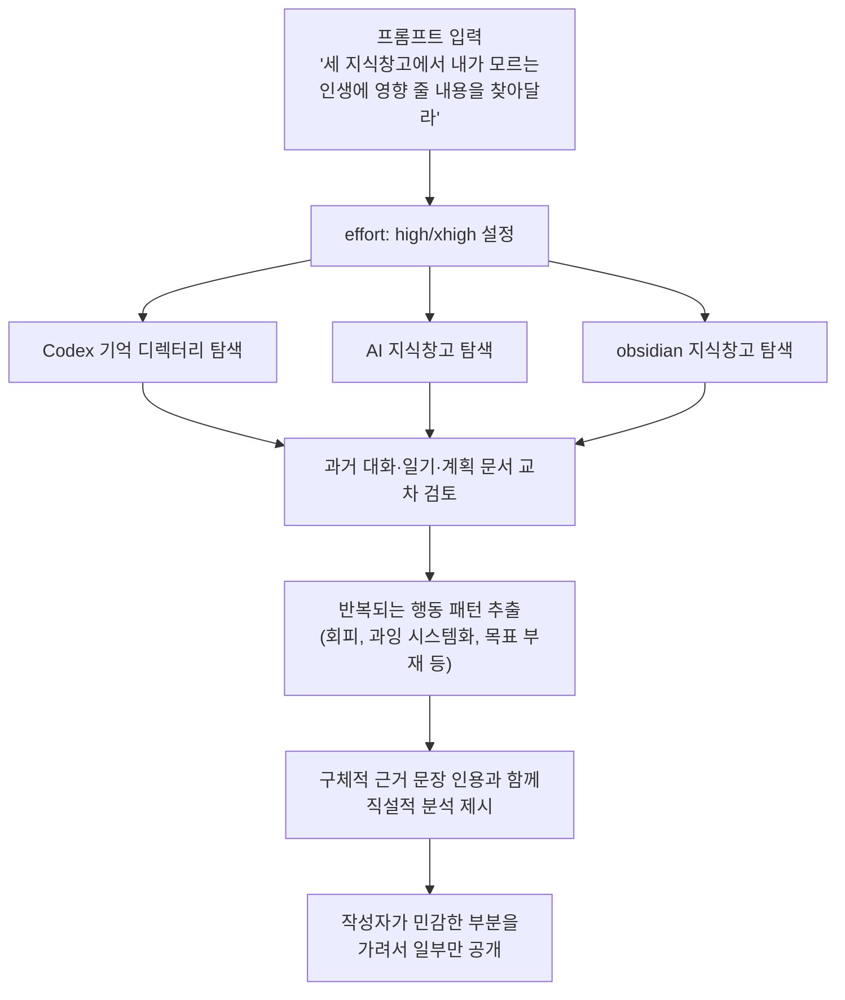

X(옛 트위터) 사용자 gengdaj가 올린 두 건의 게시물과 함께 첨부된 대화 화면을 종합해서 정리한 내용이다. 핵심은 간단하다. Codex 기억 시스템, AI 지식창고, obsidian 지식창고라는 세 개의 개인 데이터베이스를 하나의 프롬프트로 묶어 Claude Fable 5에게 던졌더니, 본인도 미처 알아차리지 못했던 삶의 패턴을 뼈아플 정도로 정확하게 짚어냈다는 경험담이다. 같은 프롬프트를 OpenAI의 Codex CLI에 넣었을 때는 일기 내용을 그대로 요약해 되돌려주는 수준에 그쳤다는 비교도 함께 나온다.

이 글은 그 경험담이 어떤 맥락에서 나온 것인지, Claude Fable 5가 실제로 어떤 모델인지, 그리고 게시물에서 언급된 구체적인 통찰 내용이 무엇인지 순서대로 짚어본다.

---

## 1. 게시물의 핵심 내용

[첫 번째 게시물](https://x.com/gengdaj/status/2074158466005172709)에서 작성자는 이렇게 적었다. Fable 5와 대화하면서 effort를 높은 단계로 설정하고, 대화 한 번에 10달러 정도를 쓰면서 자신이 가진 모든 지식창고와 기억 데이터를 훑게 했다는 것이다. 그 결과로 나온 분석이 너무 적나라해서, 이를 공개하려면 상당 부분을 모자이크 처리해야 했다고 밝혔다. 반면 똑같은 프롬프트를 Codex CLI에 입력했을 때는 예전에 써둔 일기를 분석 없이 그대로 반복하는 수준에 그쳐 "영양가가 없었다"고 평가하며, 그 결과물은 따로 공유할 가치조차 느끼지 못했다고 적었다.

[두 번째 게시물](https://x.com/gengdaj/status/2074026868727292306)은 별도의 대화에서 나온 내용이다. 작성자는 최근의 계획, 과거 성과, 가치판단 자료를 Fable 5에 전부 입력해 30분 정도 대화했는데, 그 과정에서 나온 조언들이 "최소 여섯 자리 수(원화 기준 수십만~백만 원대)의 가치를 만들어냈다고 느꼈다"고 적었다. 이전에 Codex 기억 시스템을 최적화해달라고 요청했을 때 이미 기획과 사고의 깊이가 남다르다고 느꼈던 터라, 이번에는 인생 전반의 판단을 맡겨봤다는 설명이다.

두 게시물 모두 어디까지나 작성자 한 명의 주관적 경험이라는 점은 분명히 해둘 필요가 있다. "여섯 자리 수의 가치"라는 표현은 객관적으로 측정된 수치가 아니라 본인의 체감을 나타낸 것이고, Codex CLI와의 비교 역시 동일한 조건에서 통제된 실험을 거친 것이 아니라 한 사용자의 1회성 체험담이다. 아래에서 다루는 구체적인 조언 내용들도 그런 전제 위에서 읽어야 한다.

---

## 2. 함께 첨부된 대화 화면이 보여주는 것

게시물에는 터미널 기반 에이전트 화면 몇 장이 함께 올라와 있다. 화면 상단에는 "Claude Code"라는 창 제목이 붙어 있고, 하단 모델 선택란에는 "gpt-5.5 xhigh"라는 표기가 보인다. 즉 Claude Code라는 이름이 붙은 터미널 환경에서 실제로는 GPT-5.5 모델을 xhigh(최고 수준) reasoning 설정으로 돌리고 있는 세션이라는 뜻이다. 이는 Codex, 가재코드, LazyCodex 계열처럼 하나의 CLI 하네스 안에서 여러 회사의 모델을 바꿔가며 쓰는 최근 하네스 엔지니어링 흐름과 맞닿아 있는 구성으로 보인다. 다만 이 특정 화면이 두 게시물 중 정확히 어느 쪽 대화에 해당하는지는 게시물 텍스트만으로 완전히 특정하기는 어렵다.

화면에 나온 대화 내용은 게시물 프롬프트와 정확히 일치한다. "Codex 기억 시스템 지식베이스, AI 지식베이스, obsidian 지식베이스가 있는데, 여기서 아직 의식하지 못했지만 알면 인생에 큰 영향을 줄 내용을 더 파낼 수 있는지" 묻는 요청이 그대로 보이고, 이에 대해 모델이 세 개의 로컬 디렉터리(개인 obsidian 저장소, AI 지식창고, Codex 기억 디렉터리)를 실제로 열어 파일을 읽고 패턴을 검색하는 과정이 로그로 남아 있다. 이후 이어지는 답변에는 다음과 같은 지적들이 등장한다.

- 어린 시절 스스로 삶을 통제할 수 없었던 경험이, 성인이 된 뒤 cron 작업과 자동화 스크립트로 하루 일과를 촘촘히 짜는 습관으로 이어졌다는 해석. 자서전에 스스로를 "무수한 cron이 설정된 가재"에 비유한 문장을 근거로 든다.
- 법학을 선택한 것이 진지한 진로 결정이 아니라, 수능 다음 날 시험 과목이었던 이공계에 대한 반발적 회피였다는 해석. 정작 법학 관련 시험을 미루면서도 "법률+AI"라는 차별화 정체성만 계속 붙들고 있다는 지적.
- "성장을 인생의 주선(主線)으로 삼는다"는 원칙이 사실은 모호한 개념이어서, 정작 무엇을 해야 하는지는 걸러주지 못하고 스스로를 정당화하는 도구로만 쓰이고 있다는 지적.
- 정작 가장 크게 성공했던 경험(각색 없이 순수 AI로 만든 유튜브 영상이 한 달 만에 10만 팔로워를 모은 일)은 얼굴을 드러내지 않아도 되는, 본인이 가장 잘하는 영역이었는데도 YPP 정책 변경 이후 그 라인을 통째로 포기하고, 정작 가장 두려워하는 얼굴 노출 콘텐츠로 방향을 틀었다는 지적.

이 지적들은 상당히 개인적이고 예민한 내용이라 작성자가 상당 부분을 가려서 공개했다고 밝힌 것과 맥락이 일치한다. 다만 위 내용 역시 화면에 나온 텍스트를 그대로 옮긴 것이며, 그 분석이 실제로 타당한지, 혹은 지나치게 단정적인지는 독자가 판단할 몫이다. AI가 내놓은 심리 분석은 어디까지나 텍스트 패턴에 기반한 추론이지 임상적 진단이 아니라는 점도 함께 짚어둘 필요가 있다.

---

## 3. Claude Fable 5는 어떤 모델인가

이 경험담을 이해하려면 먼저 Claude Fable 5가 무엇인지 짚어야 한다.

Anthropic은 2026년 6월 9일 Claude Fable 5를 공개했다. 이 모델은 기존 Opus 등급보다 위에 있는 새로운 "Mythos급" 모델군의 첫 일반 공개 버전이다. 흥미로운 지점은 이번 발표가 하나의 모델을 두 가지 이름으로 동시에 내놓았다는 것이다. Claude Mythos 5는 Fable 5와 동일한 가중치를 공유하지만, 사이버 보안·생명과학 등 특정 영역의 안전장치가 해제된 버전으로 미국 정부와 협력하는 Project Glasswing 소속 기관 등 제한된 대상에게만 제공된다. 반면 일반 사용자가 쓰는 Fable 5에는 이 영역들을 감지해 걸러내는 안전 분류기가 붙어 있다.

공개된 벤치마크에 따르면 Fable 5는 자동화 프로그래밍 벤치마크인 SWE-Bench Pro에서 80.3%의 통과율을 기록해 GPT-5.5(58.6%), Gemini 3.1 Pro(54.2%)를 상당한 격차로 앞섰고, 더 어려운 문제를 다루는 FrontierCode Diamond 벤치마크에서도 기존 최고 기록의 두 배 이상을 기록했다. Stripe는 초기 테스트에서 사람 엔지니어 팀이 두 달 넘게 걸릴 것으로 예상했던 5천만 줄 규모의 Ruby 코드베이스 마이그레이션을 Fable 5가 하루 만에 끝냈다고 밝혔다. 다만 이런 수치들은 모두 Anthropic과 초기 테스트 기업이 공개한 자료에 근거한 것으로, 독립적인 재현 검증이 모든 항목에서 이뤄진 것은 아니라는 점은 감안할 필요가 있다.

가격은 입력 토큰 100만 개당 10달러, 출력 토큰 100만 개당 50달러로, 기존 최상위 모델이었던 Opus 4.8(입력 5달러, 출력 25달러)의 정확히 두 배다. 컨텍스트 윈도우는 100만 토큰을 유지한다.

이 모델은 출시 이후 순탄하지만은 않았다. 6월 12일, 미국 상무부가 수출통제를 이유로 Fable 5와 Mythos 5에 대한 접근을 전 세계적으로 전면 중단시켰다. Amazon 연구팀이 발견한 특정 우회 기법이 모델의 안전장치를 무력화해 소프트웨어 취약점을 찾아내도록 유도할 수 있다는 우려가 계기가 된 것으로 보도됐다. 이후 18일 만인 6월 30일, 상무부가 통제를 해제했고 7월 1일부터 전 세계에서 다시 접근이 재개됐다. 재개된 버전에는 해당 우회 기법을 표적으로 하는 새로운 안전 분류기가 추가돼, 보도에 따르면 해당 기법을 99% 이상 차단한다고 한다. 이 소동과 재개 과정에 대해서는 Anthropic의 공식 발표(anthropic.com/news/fable-mythos-access)에 안내되어 있다. 재개를 기념해 7월 1일부터 7일까지는 Pro, Max, Team, Enterprise 구독자 대상으로 주간 사용량의 절반까지 별도 비용 없이 Fable 5를 쓸 수 있는 프로모션이 진행 중인데, 공교롭게도 이 프로모션 종료일이 오늘(7월 7일)이다. 즉 게시물 작성자가 부담 없이 여러 차례 깊이 있는 대화를 시도해볼 수 있었던 시점과도 맞물린다.

### Fable 5 핵심 정보 요약

| 항목 | 내용 |
|---|---|
| 발표일 | 2026년 6월 9일 |
| 모델 등급 | Mythos급(Opus 위 최상위 등급)의 일반 공개 버전 |
| 자매 모델 | Claude Mythos 5 (동일 가중치, 안전장치 해제, 제한된 대상만 이용 가능) |
| SWE-Bench Pro | 80.3% (GPT-5.5 58.6%, Gemini 3.1 Pro 54.2%) |
| 가격 | 입력 $10 / 출력 $50 (100만 토큰당, Opus 4.8의 2배) |
| 컨텍스트 윈도우 | 100만 토큰 |
| 서비스 중단 이력 | 6/12 수출통제로 전면 중단 → 6/30 통제 해제 → 7/1 재개 |
| 현재 프로모션 | 7/1~7/7 구독자 주간 사용량 50% 무료 |

---

## 4. "effort" 설정이 의미하는 것

게시물에서 언급된 "/high", "xhigh" 같은 표현은 Anthropic이 Fable 5에 도입한 effort 파라미터를 가리킨다. Anthropic의 공식 프롬프트 가이드에 따르면 effort는 지능, 응답 속도, 비용 사이의 균형을 조절하는 핵심 수단으로, 일상적인 작업에는 medium이나 low를, 대부분의 작업에는 high를, 역량이 가장 중요한 작업에는 xhigh를 쓰도록 권장한다. 흥미로운 점은 Fable 5는 effort를 낮게 설정해도 이전 세대 모델의 xhigh 성능을 웃도는 경우가 많다는 설명이 붙어 있다는 것이다. 다만 effort를 높일수록 모델이 필요 이상으로 정보를 수집하고 숙고하는 경향이 있어, 정말 복잡하고 모호한 문제를 붙잡을 때만 xhigh를 쓰는 것이 실용적이라는 것이 공식 가이드의 취지다.

게시물 작성자가 "10달러짜리 대화 한 번"이라고 표현한 것도 이 맥락에서 이해할 수 있다. 개인 지식창고 전체를 훑고 패턴을 재구성하는 작업은 단순 질의응답이 아니라 장시간 자율 작업에 가깝기 때문에, 높은 effort 설정에서 상당한 토큰을 소모하는 것이 자연스럽다.

아래는 이번 사례에서 실제로 벌어진 작업 흐름을 정리한 것이다.

---

## 5. Fable 5와 Codex CLI, 어떤 차이가 언급됐나

작성자가 든 비교는 다음과 같이 요약할 수 있다. 다시 한 번 강조하지만 이는 통제된 벤치마크가 아니라 한 사용자의 1회성 체감 비교다.

| 구분 | Claude Fable 5 (작성자 체감) | Codex CLI (작성자 체감) |
|---|---|---|
| 입력 자료 처리 방식 | 세 지식창고를 실제로 탐색하며 패턴을 재구성 | 기존 일기 내용을 그대로 요약·반복 |
| 결과물 성격 | 스스로 인지하지 못했던 행동 패턴에 대한 직설적 지적 | 이미 알고 있던 내용의 재진술, 새로운 통찰 부재 |
| 작성자의 평가 | "무지막지하게 잔인해서" 모자이크 처리가 필요할 정도 | "영양가가 없어서" 공유할 필요를 못 느낌 |
| 비용 인식 | 대화 한 번에 약 10달러 소모, 그만한 가치가 있었다고 평가 | 별도 언급 없음 |

이 비교에서 눈여겨볼 부분은 두 도구가 애초에 다른 용도로 설계됐다는 점이다. Codex CLI는 OpenAI가 만든 터미널 기반 코딩 에이전트로, 원래 목적은 코드 작성과 디버깅이지 개인 심리 분석이 아니다. 반면 이번 프롬프트는 방대한 비정형 텍스트(일기, 메모, 대화 기록)에서 숨은 패턴을 찾아내는 장기 추론·종합 작업에 가깝다. Anthropic의 공식 가이드가 강조하는 Fable 5의 강점, 즉 장시간 자율성과 모호한 문제를 스스로 구조화하는 능력이 이런 유형의 작업에 유리하게 작용했을 가능성이 있다. 다만 이것이 두 모델 간 전반적인 우열을 증명하는 것은 아니며, 어디까지나 이 특정 과제 유형에서 나타난 한 사용자의 개인적 인상이라는 점을 다시 한 번 짚어둔다.

---

## 6. 두 번째 대화에서 나온 인생 전략 조언 네 가지

두 번째 게시물에서는 최근 계획과 과거 성과, 가치판단 자료를 모두 입력해 얻은 조언 네 가지가 정리돼 있다. 첨부된 대화 화면 중 한 장에는 이 중 첫 번째 조언에 대한 훨씬 상세한 풀이도 함께 담겨 있어, 두 자료를 합쳐 정리하면 다음과 같다.

**1) "성장을 주선으로 삼는다"는 원칙 자체를 재점검할 것.** 화면에 나온 풀이에 따르면, "성장"이라는 개념은 두 가지 역할을 한다. 첫째는 나쁜 선택지를 걸러내는 필터 역할(예: 성장과 무관한 소비성 활동 배제)이고, 둘째는 좋은 선택지 중 우선순위를 매기는 역할이다. 첫 번째 역할은 잘 작동하지만, 두 번째 역할에서 문제가 생긴다. "성장"이라는 잣대만으로는 수학 공부, 영어 공부, 제품 개발, 투자, 커뮤니티 활동 중 무엇을 먼저 해야 하는지 가려주지 못한다는 것이다. 이를 나침반과 목적지에 비유해, 가치관(나침반)은 방향을 알려주지만 방향만 있고 도착 지점이 없으면 지도 위를 정처 없이 헤매는 것과 같다고 지적한다. 해법으로 제시된 것은 나침반은 유지하되, 검증 가능한 목표를 매달 하나씩 세우라는 것이다. "올해 나는 제품 능력에서 성장했다"처럼 검증 불가능한 목표 대신, "2027년 7월까지 실사용자가 있는 AI 제품을 0에서 1로 만들어 출시한다"거나 "2027년 7월까지 중국어 계정 팔로워 10만, 영어 계정 팔로워 5천 명을 달성한다"처럼 1년 뒤 타인이 객관적으로 판단할 수 있는 목표를 세우라는 조언이다.

**2) 투자 학습에 지나치게 많은 시간을 쓰지 말 것.** 연간 투자 관련 학습 시간의 상한을 10시간 정도로 정하고, 대신 적은 금액으로 시장의 교훈을 직접 얻는 것을 일종의 "감정적 투자 비용"으로 받아들이라는 조언이다. 주력 시간은 콘텐츠 제작과 제품 개발에 쏟는 편이 낫다는 취지다.

**3) 대형 언어모델과 AI 관련 유튜브 팟캐스트 시청을 꾸준히 이어갈 것.** 영어 듣기 능력 향상, AI 분야에 대한 인지 축적, 콘텐츠 소재 확보라는 세 가지 효과를 동시에 얻을 수 있는 활동이라는 이유다.

**4) 법률테크 로펌 인턴십을 단순한 인턴 경험이 아니라 제품 감각을 기르는 기회로 재해석할 것.** 실무를 통해 기업(B2B) 고객의 실제 수요를 관찰하는 훈련으로 삼으라는 조언이다.

작성자는 기존에 스스로 옳다고 믿었던 여러 판단이 이 대화를 통해 뒤집혔고, 그 덕분에 수십에서 수백 시간에 달했을 시행착오를 줄일 수 있었다고 평가했다. 다음 GPT 모델(5.6)이 나오면 같은 방식으로 다시 대화를 시도해볼 계획이라는 언급으로 게시물은 마무리된다.

---

## 7. 정리하며 짚어둘 점

이 사례는 단일 사용자가 자신의 개인 데이터를 놓고 진행한 비공식적인 체험담이라는 점을 다시 한 번 강조할 필요가 있다. Fable 5가 내놓은 분석이 실제로 정확한 통찰인지, 아니면 그럴듯하게 들리는 일반화인지는 이 자료만으로 객관적으로 판단하기 어렵다. AI가 방대한 개인 기록에서 그럴듯한 패턴을 찾아내는 것과, 그 패턴이 실제로 그 사람의 삶을 정확히 설명하는 것은 다른 문제이기 때문이다.

다만 이 사례가 보여주는 기술적으로 흥미로운 지점은 분명하다. Claude Fable 5는 공식 문서에서도 강조하듯 장시간에 걸쳐 여러 파일과 소스를 스스로 탐색하고, 모호한 요청을 받았을 때 스스로 다음 행동을 구조화하는 데 강점을 보이도록 설계된 모델이다. 개인 지식창고 여러 개를 하나의 프롬프트로 엮어 심층 분석을 맡기는 이번 활용법은, 코딩을 넘어 개인 기록 관리와 자기 성찰 도구로서의 활용 가능성을 보여주는 사례로 볼 수 있다. 동시에, 비슷한 시도를 해보고 싶은 사람이라면 AI가 내놓는 심리적 해석을 임상적 진단이나 절대적 사실로 받아들이기보다는, 스스로를 돌아보는 참고자료 중 하나로 다루는 편이 안전하다.

---

작성일: 2026년 7월 7일
