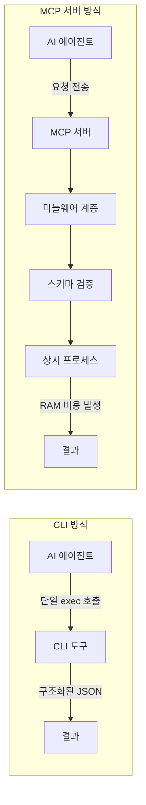
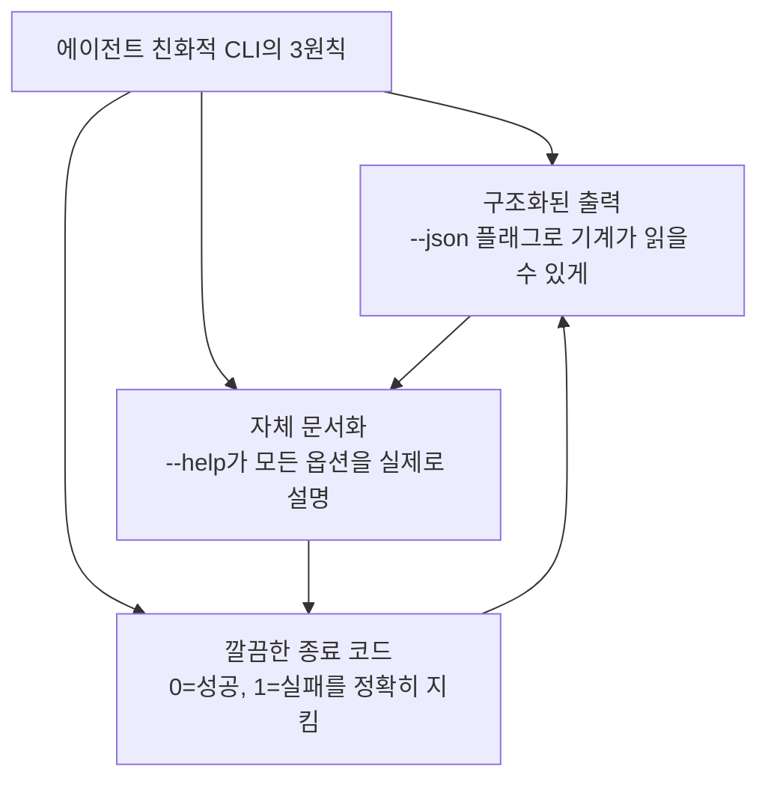
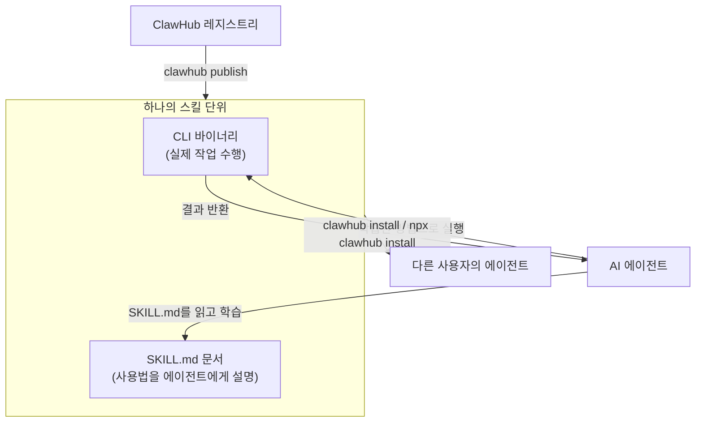
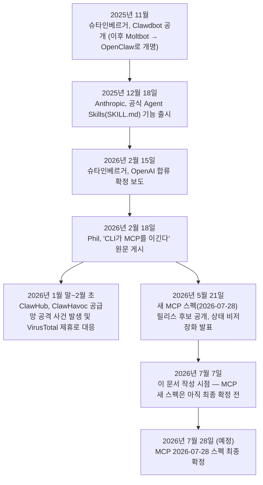

>- 원본 자료: Phil (Rentier Digital), "Why CLIs Beat MCP for AI Agents — And How to Build Your Own CLI Army"（Medium, 2026년 2월 18일 게시）
>- 원문 주소: https://medium.com/@rentierdigital/why-clis-beat-mcp-for-ai-agents-and-how-to-build-your-own-cli-army-6c27b0aec969
>- 이 문서 작성 기준일: 2026년 7월 7일

---

## 목차

1. 이 문서를 만든 이유와 원본 자료
2. 발단 — "mcp were a mistake. bash is better."
3. 피터 슈타인베르거와 OpenClaw는 누구/무엇인가
4. 필자 Phil의 핵심 주장 — CLI가 이기는 이유
5. MCP 대 CLI, 무엇이 어떻게 다른가
6. MCPorter — MCP를 CLI로 되돌리는 도구
7. 에이전트 친화적 CLI를 만드는 세 가지 원칙
8. CLI와 SKILL.md의 결합, 그리고 ClawHub 생태계
9. OpenClaw 없이 나만의 에이전트 만들기
10. 커뮤니티의 반박 — 균형 잡힌 시각
11. 그 후 무슨 일이 있었나 — 2026년 7월 기준 최신 현황
12. 종합 판단 — 결국 CLI인가 MCP인가
13. 마무리

---

## 1. 이 문서를 만든 이유와 원본 자료

이 문서는 2026년 2월 중순 AI 에이전트 커뮤니티에서 상당한 화제를 모았던 하나의 글, 그리고 그 아래에 달린 수십 개의 댓글을 근거로 작성되었다. 필자 Phil은 Rentier Digital이라는 이름으로 활동하는 개발자로, 우분투 환경에서 오랫동안 커맨드라인 도구 위주로 작업해온 경험을 바탕으로 "MCP(Model Context Protocol)보다 CLI(Command Line Interface)가 AI 에이전트에게 더 나은 인터페이스"라는 주장을 폈다. 이 주장이 특히 힘을 얻은 계기는 190만 개가 넘는 깃허브 스타를 받은 오픈소스 프로젝트 OpenClaw의 창시자 피터 슈타인베르거(Peter Steinberger)가 자신의 X(옛 트위터) 계정에 올린 한 문장, 그리고 그가 곧이어 OpenAI에 채용되었다는 뉴스였다.

원문은 단순히 하나의 주장만 펼치는 글이 아니라, 실제로 동작하는 코드 예시(자바스크립트 CLI 스크립트, CLAUDE.md 문서화 예시, Anthropic의 tool_use API를 활용한 80줄짜리 미니 에이전트 루프, GitHub Actions 워크플로우 등)를 상당히 구체적으로 제시하고 있어, 단순한 의견 표명보다는 실무 가이드에 가까운 성격을 띤다. 이 문서에서는 원문의 논지를 충실히 요약하고, 댓글란에서 제기된 반박들을 함께 정리한 뒤, 웹 검색을 통해 확인한 이후의 실제 전개(피터 슈타인베르거의 OpenAI 합류 확정 여부, ClawHub 생태계의 성장과 보안 사고, MCP 프로토콜 자체의 진화, Anthropic이 이 문제에 어떻게 대응했는지)를 별도 장으로 덧붙였다. 원문 발행일로부터 이 문서 작성일까지 약 5개월이 지났기 때문에, 그 사이 상황이 상당히 바뀐 부분들이 있다.

---

## 2. 발단 — "mcp were a mistake. bash is better."

이야기의 시작은 여섯 단어짜리 짧은 글이었다. 피터 슈타인베르거가 X에 남긴 문장을 그대로 옮기면 다음과 같다.

> "mcp were a mistake. bash is better."

필자 Phil은 이 문장을 보자마자 캡처해서 개발자 친구 세 명에게 보냈다고 적었다. 그가 이렇게 반응한 이유는 본인의 실무 경험 때문이었다. Supabase CLI, Vercel CLI, Docker, git, n8n 등 그가 매일 사용하는 도구 스택이 전부 터미널 기반이었고, 지난해 유행하던 MCP 서버들을 몇 개 붙여봤지만 그때마다 컨텍스트 윈도우의 상당 부분을 잡아먹고 이따금 예기치 않게 오작동하는 경험을 했다는 것이다. 그런 상황에서 2026년 가장 주목받는 오픈소스 개발자가 자신과 같은 결론에 도달했고, 심지어 OpenAI가 그 결론에 공감할 만큼 그를 채용했다는 사실이 그에게는 하나의 확증처럼 다가온 것이다.


`Left: MCP in theory. Right: MCP in practice, according to my terminal.`


`MCP Server vs CLI: Performance Comparison for Agents`

원문에는 삽화 두 장이 함께 실려 있었는데, 하나는 만화 형태로 그려진 대비 장면이었다. 왼쪽 칸에는 연기가 피어오르는 방 안에서 온갖 케이블에 둘러싸인 채 "40퍼센트가 소모되고 나서야 뭔가 시작되게 되어 있었다"고 절망하는 인물이, 오른쪽 칸에는 문을 박차고 들어오며 "파이프 하나, 명령어 하나"를 외치는 영웅적인 인물이 그려져 있었다. 이는 MCP의 스키마 로딩 방식과 CLI의 단순한 실행 방식을 과장되게 대비시킨 풍자였다. 다른 한 장은 정보 그래픽 형태로, MCP 서버와 CLI 각각의 특성을 화살표와 아이콘으로 요약한 것이었다.

---

## 3. 피터 슈타인베르거와 OpenClaw는 누구/무엇인가

원문의 설득력은 상당 부분 피터 슈타인베르거라는 인물의 실제 이력에 기대고 있으므로, 이 부분은 특히 꼼꼼히 사실관계를 확인할 필요가 있었다. 검색으로 확인한 내용은 다음과 같다.

피터 슈타인베르거는 오스트리아 출신 개발자로, PSPDFKit(PDF 처리 SDK 회사)의 창업자로 먼저 이름을 알린 인물이다. 그가 2025년 11월 무렵 공개한 개인 AI 비서 프로젝트는 처음에는 "Clawdbot"이라는 이름으로 불렸다. 그런데 이 이름이 Anthropic의 "Claude"와 지나치게 유사하다는 이유로 법적 이의 제기를 받아 "Moltbot"으로 개명했고, 이후 슈타인베르거 본인이 새 이름을 더 마음에 들어 해서 최종적으로 "OpenClaw"라는 이름으로 정착했다. 왓츠앱, 텔레그램, 슬랙, 디스코드, 시그널, 아이메시지 등 다양한 메신저를 통해 사용자가 자연어로 지시를 내리면 에이전트가 실제로 셸 명령을 실행하거나 파일을 다루거나 외부 API를 호출하는 방식으로 동작하는 이 프로젝트는 출시 후 몇 주 만에 폭발적인 인기를 얻었다. 포브스 보도에 따르면 이 프로젝트는 몇 주 사이 주간 방문자 200만 명을 기록했으며, 깃허브 스타 수는 원문이 언급한 19만 개를 넘어 이후 20만 개, 나아가 22만 개 선까지 늘어난 것으로 여러 매체가 전하고 있다.

2026년 2월 15일, 테크크런치는 슈타인베르거가 OpenAI에 합류한다고 보도했다. 슈타인베르거 본인이 남긴 블로그 글의 취지는, 자신이 회사를 크게 키울 수도 있었겠지만 그보다는 세상을 바꾸는 쪽에 관심이 있으며 OpenAI와 함께하는 것이 그 목표를 가장 빠르게 이루는 방법이라 판단했다는 것이었다. OpenAI CEO 샘 올트먼은 X를 통해 슈타인베르거가 "차세대 개인 에이전트를 이끌게 될 것"이라 밝혔고, OpenClaw 프로젝트 자체는 OpenAI가 계속 지원하는 독립 오픈소스 재단으로 이관되어 존속하게 되었다고 발표했다. 즉 원문이 "그 다음 OpenAI가 그를 채용했다(Then OpenAI hired him)"고 서술한 부분은 실제로 일어난 사실이며, 과장이 아니다. 다만 한 가지 흥미로운 뒷이야기가 있다. 클라우드워즈(Cloud Wars)의 분석에 따르면, OpenClaw는 한때 기본 모델로 Claude Opus를 추천할 만큼 Anthropic 생태계와 가까웠던 프로젝트였으나 결과적으로는 OpenAI로 흡수되었고, 이를 두고 일각에서는 Anthropic이 놓친 인재 영입 기회로 평가하기도 했다.

---

## 4. 필자 Phil의 핵심 주장 — CLI가 이기는 이유

원문은 에이전트가 외부 도구와 상호작용하는 방식을 GUI, REST API/SDK, MCP, CLI 네 가지로 나누고 이를 순위 매기듯 서술한다. GUI는 애초에 논외로 처리된다. 에이전트에게 브라우저 버튼을 클릭하게 시키는 것은 CI/CD 파이프라인에 마우스를 쥐여주는 것과 다를 바 없다는 것이 필자의 표현이다. REST API와 SDK는 그런대로 쓸 만하지만, 서비스마다 인증 방식과 응답 형식과 오류 처리 방식이 제각각이라 결국 통합할 때마다 래퍼 코드를 새로 짜야 하는 부담이 있다고 지적한다.

MCP에 대한 비판이 이 글의 핵심이다. 여러 도구를 표준 프로토콜 하나로 연결한다는 아이디어 자체는 훌륭하지만, 실제로는 MCP 서버를 하나 추가할 때마다 그 서버가 지원하는 전체 스키마—도구 설명, 매개변수 목록, 기능 선언—가 통째로 에이전트의 컨텍스트 윈도우에 쏟아져 들어간다는 것이다. 필자는 에이전트가 실제 요청을 채 생각해보기도 전에 컨텍스트의 30~40퍼센트가 이미 MCP 관련 정보로 소진되어 있다고 주장한다. 그리고 이 주장의 근거로 다시 한번 슈타인베르거를 인용하는데, 그가 MCP를 직접 써보고 지원까지 만들어봤지만 결국 MCP 서버를 CLI로 되돌리는 도구(MCPorter, 6절에서 다룬다)를 만들었다는 점, 그리고 그가 남긴 다음과 같은 짧은 평가를 소개한다.

> "The only good thing about MCP was companies opening up some APIs."(MCP가 만들어낸 유일하게 좋은 결과는 기업들이 API를 개방하게 만들었다는 점뿐이다)

필자는 이 발언을 두고, 프로토콜 자체는 곁가지였고 그로 인해 강제로 열리게 된 API들이야말로 진짜 성과였다는 해석을 덧붙인다.

이에 반해 CLI는 컨텍스트 부담이 사실상 없고, 파이프로 다른 명령과 자유롭게 조합할 수 있으며, 터미널에서 직접 실행해보는 것만으로 2초 안에 테스트할 수 있고, `--json` 플래그 하나만 붙이면 별도의 직렬화 계층 없이 파싱 가능한 구조화된 출력을 얻을 수 있다는 것이 필자의 주장이다. 무엇보다 에이전트 입장에서는 `exec` 호출 한 번이면 충분하며, 별도의 미들웨어나 프로토콜 핸드셰이크, 배후에서 RAM을 잡아먹으며 상시 대기하는 서버 프로세스가 필요 없다는 점을 강조한다.

이러한 철학을 실제로 대규모로 구현한 것이 OpenClaw 생태계라는 것이 필자의 설명이다. 구글 지도용 `goplaces`, 아이메시지용 `imsg`, X(트위터)용 `bird`, 왓츠앱용 `wacli`, 지메일과 캘린더용 `gog`, 보안 카메라용 `camsnap`, macOS 화면 캡처와 AI 비전 분석을 결합한 `peekaboo`, 영상과 팟캐스트 요약용 `summarize` 등 약 열두 개의 독립적인 CLI 도구들이 모두 한 가지 일을 잘 해내고, `--json`을 지원하며, 명확한 `--help`를 갖추는 동일한 패턴을 따른다는 것이다.

---

## 5. MCP 대 CLI, 무엇이 어떻게 다른가

원문이 제시한 비교 항목들을 정리하면 다음과 같은 구도가 된다. 아래는 원문의 표를 그대로 옮긴 것이 아니라 같은 논지를 재구성한 것이다.

| 비교 항목 | MCP 서버 방식 | CLI 방식 |
|---|---|---|
| 컨텍스트 윈도우 부담 | 서버 하나당 30~40% 수준 소모 (필자 주장) | 이론상 0에 가까움 (`--help` 정도) |
| 의존성 | 실행 중인 프로세스, 프로토콜 핸드셰이크 필요 | 없음 — 그냥 실행하면 됨 |
| 테스트 용이성 | 서버를 띄우고 연결한 뒤 테스트 | 명령을 실행하고 표준출력만 보면 됨 |
| 조합 가능성 | 스키마 단위로 하나씩 처리 | 파이프, `jq`, `xargs`로 자유롭게 연결 |
| 구조화된 출력 | 스키마가 항상 강제됨 | `--json` 플래그를 추가하면 됨 |
| 런타임 오버헤드 | 서버 프로세스 + 메모리 상시 점유 | 실행 사이에는 오버헤드 없음 |

필자는 이 비교를 시각적으로도 정리했는데, 하나는 "왜 CLI가 에이전트에게 유리한가"라는 제목의 대비 도식으로, MCP 서버 쪽에는 무거운 JSON 스키마, 상시 프로세스, 늘어나는 메모리, 서버-클라이언트 오버헤드를 나열하고 CLI 쪽에는 단일 실행 호출, `--json` 출력, 실행 사이 오버헤드 없음을 나열했다. 다른 하나는 "AI 에이전트 통합 패턴"이라는 제목으로, 에이전트가 CLI 도구를 부를 때는 단일 호출로 구조화된 JSON을 곧바로 받는 반면, MCP 서버를 부를 때는 미들웨어 계층과 스키마 검증과 상시 프로세스를 거쳐야 하고 그 과정에서 RAM 비용이 발생한다는 흐름을 그림으로 보여주었다.

이 관계를 다이어그램으로 정리하면 다음과 같다.



다만 이 표는 어디까지나 필자 한 사람의 주장을 정리한 것이며, 10절에서 살펴보듯 이 비교표 자체에 대한 반박도 상당히 많았다는 점을 미리 밝혀둔다.

---

## 6. MCPorter — MCP를 CLI로 되돌리는 도구

원문에서 슈타인베르거가 "MCP를 CLI로 되돌리는 도구"를 만들었다고 언급한 것은 실제로 존재하는 프로젝트, MCPorter를 가리킨다. 검색을 통해 확인한 바로는 MCPorter는 슈타인베르거가 직접 공개한 타입스크립트 기반 도구로, 커서(Cursor), Claude Code, Windsurf, VS Code 등에 이미 설정되어 있는 MCP 서버들을 찾아내어 그로부터 타입이 지정된 클라이언트와 CLI 래퍼를 자동으로 생성해준다. OAuth 인증을 처리하고 HTTP, SSE, stdio 등 다양한 전송 방식을 지원하며, 자격증명을 캐시해서 매번 재인증할 필요가 없게 만든다.

사용법은 비교적 단순한데, 예를 들어 어떤 MCP 서버든 다음과 같은 한 줄 명령으로 컴파일된 CLI로 변환할 수 있다고 슈타인베르거 본인이 X에서 시연한 바 있다.

```bash
npx mcporter generate-cli "npx -y chrome-devtools-mcp" --compile
```

이렇게 생성된 CLI는 `--help` 메뉴를 스스로 학습해서 필요할 때만 점진적으로 세부 정보를 노출하는 방식(progressive disclosure)으로 동작하도록 설계되어 있다는 것이 그의 설명이다. MCPorter는 macOS, 리눅스, 윈도우에서 모두 동작하며 npm과 Homebrew를 통해 설치할 수 있고, 이 문서 작성 시점 기준으로 버전이 0.11.x대까지 올라온 상태다. 즉 이 도구는 "MCP냐 CLI냐"라는 이분법을 넘어, MCP로 이미 개방된 API 생태계를 CLI라는 실행 형태로 재포장해서 양쪽의 장점을 취하려는 실용적인 시도로 볼 수 있다.

---

## 7. 에이전트 친화적 CLI를 만드는 세 가지 원칙

원문은 독자들이 "직접 CLI를 만들 시간이 없다"고 생각하며 글을 덮기 전에, 실제로는 20~30줄 정도의 코드면 충분하다고 설득하며 세 가지 원칙을 제시한다.

첫째는 구조화된 출력이다. 사람이 보기 좋은 표 형태의 출력은 에이전트가 파싱하기 어렵기 때문에, `--json` 플래그를 두어 기계가 읽기 좋은 형태로도 출력할 수 있어야 한다는 것이다. 원문은 Supabase에 연결해서 MRR(월간 반복 매출), 활성 구독자 수, 당일 신규 가입자 수를 계산하고 `--json` 여부에 따라 사람 친화적 출력과 기계 친화적 출력을 모두 지원하는 노드 스크립트 예시를 제시한다.

둘째는 실질적으로 설명이 되는 `--help`다. 에이전트는 사람이 README를 읽듯 `--help` 출력을 읽고 사용법을 파악하기 때문에, 도움말이 부실하면 에이전트가 존재하지 않는 옵션을 지어내는(할루시네이션) 결과로 이어질 수 있다고 경고한다.

셋째는 깔끔한 종료 코드다. 0은 성공, 1은 실패라는 원칙을 지키지 않으면, 즉 스크립트가 오류를 삼키고도 종료 코드 0을 반환하면 에이전트는 실제로는 실패한 배포를 두고 "성공적으로 배포되었습니다"라고 잘못 보고하게 된다는 것이다. 필자는 새벽 2시에 자신의 배포 스크립트가 조용히 실패하고 있었는데도 Claude Code가 계속 배포 성공을 알려서 20분간 헤맸던 개인적인 경험을 예로 든다.

이 세 원칙을 도식화하면 다음과 같다.



---

## 8. CLI와 SKILL.md의 결합, 그리고 ClawHub 생태계

원문이 가장 핵심적으로 강조하는 패턴은 "CLI 바이너리 + SKILL.md 문서 = 자율적 실행 능력"이라는 공식이다. 에이전트는 사람처럼 시행착오를 거쳐 CLI를 탐색할 수 없기 때문에, 어떤 명령이 있고 어떤 플래그를 쓸 수 있으며 출력이 어떤 형태인지를 미리 알아야 한다는 것이다. 그래서 OpenClaw 생태계의 모든 CLI는 SKILL.md라는 구조화된 문서를 함께 배포하며, 이 문서가 곧 에이전트를 위한 사용 설명서 역할을 한다. 원문은 이 개념 자체는 특별히 새로운 것이 아니며, CLAUDE.md에 자신이 쓰는 CLI들을 문서화하는 행위 역시 본질적으로 같은 패턴이라고 말한다. 다만 슈타인베르거는 이 형식을 표준화하고 ClawHub라는 이름의 배포 계층까지 만들었다는 점에서 한 걸음 더 나아갔다는 것이다. 원문 발행 시점 기준으로 ClawHub에는 3천 개 이상의 서드파티 스킬이 등록되어 있었다고 서술되어 있다.

여기서 중요한 점은, ClawHub에 등록된 스킬 대부분이 OpenClaw 런타임 없이도 독립적으로 활용 가능하다는 것이다. 예를 들어 `goplaces`(구글 지도 CLI)나 `summarize`(영상·팟캐스트·웹페이지 요약 CLI)는 각각 `brew install`이나 `npm install`로 설치한 뒤, 관련 명령어를 그대로 자신의 CLAUDE.md에 붙여 넣으면 Claude Code가 곧바로 활용할 수 있다고 원문은 설명한다.

```
# In your CLAUDE.md — stolen straight from ClawHub

## goplaces (Google Maps CLI)
- `goplaces search "coffee near me" --open-now --json` - find places
- `goplaces search "pizza" --lat 40.8 --lng -73.9 --radius-m 3000 --json` - location-biased search
- `goplaces details <place_id> --json` - full place details with reviews
- `goplaces resolve "Soho, London" --json` - geocode a place name
Requires: GOOGLE_PLACES_API_KEY env var

## summarize (Video/Podcast/Web summarizer CLI)
- `summarize --url "https://youtube.com/watch?v=xxx" --json` - summarize a video
- `summarize --url "https://some-blog.com/post" --json` - summarize a web page
- `summarize --url "https://podcast.fm/ep42" --cli claude --json` - pick which model to use
```

원문은 또한 OpenClaw를 실제로 운영 중인 사용자를 위해, 자체 CLI를 SKILL.md 형태로 패키징하고 `clawhub publish` 명령으로 배포하는 절차, 그리고 이렇게 만든 스킬을 크론 작업과 결합해서 매일 아침 지표를 점검하고 이상이 있으면 왓츠앱으로 알림을 보내는 자동화 예시까지 구체적으로 제시한다.

```
---
name: check-mrr
description: Check SaaS metrics (MRR, signups, churn) from Supabase.
metadata:
  openclaw:
    requires:
      env:
        - SUPABASE_URL
        - SUPABASE_KEY
      bins:
        - node
    primaryEnv: SUPABASE_URL
---

# check-mrr
Get current SaaS metrics from production Supabase.
## Install
npm install -g @yourhandle/check-mrr
## Commands
- `check-mrr --json` - full metrics as JSON
- `check-mrr --period week` - metrics for the current week
- `check-mrr --period month` - monthly overview
## Output format (--json)
{
  "mrr": 1247,
  "active_subscriptions": 89,
  "signups_today": 3,
  "timestamp": "2026-02-17T10:30:00Z"
}
```

```
// In openclaw.json
{
  "cron": [
    {
      "schedule": "0 8 * * *",
      "message": "Run check-mrr --json. If signups_today is 0 or mrr dropped more than 5% from yesterday, alert me on WhatsApp with a summary. Otherwise just log it.",
      "channel": "whatsapp"
    }
  ]
}
```

이 CLI+SKILL.md 패턴의 구조를 도식화하면 다음과 같다.



---

## 9. OpenClaw 없이 나만의 에이전트 만들기

원문 후반부는 OpenClaw라는 특정 런타임에 의존하지 않고도 같은 패턴을 구현하는 방법을 코드로 제시한다. 핵심 아이디어는 Anthropic의 tool_use API를 호출하고, 도구 호출을 CLI 실행에 매핑하며, 에이전트가 작업을 마칠 때까지 이 과정을 반복하는 단순한 루프다. 원문이 제시한 예시 코드는 대략 다음과 같은 흐름으로 동작한다.

먼저 `check_mrr`, `deploy_production`, `send_slack` 세 가지 도구를 정의하고, 각 도구 이름을 실제 셸 명령으로 매핑하는 함수를 만든다. 그런 다음 사용자로부터 받은 작업 지시문을 메시지로 messages.create 호출에 담아 보내고, 응답이 `tool_use` 블록을 포함하면 해당 명령을 `execSync`로 실행한 뒤 그 결과를 다시 대화에 추가하는 식으로 루프를 돈다. 응답의 `stop_reason`이 `end_turn`이 되면 최종 텍스트를 반환하고 종료한다. 필자는 이 코드가 약 80줄 정도이며, 이것이 "자신만의 미니 OpenClaw"라고 표현한다. 여기에 새로운 CLI를 하나 추가하는 데는 도구 정의 하나와 매핑 한 줄만 더하면 되므로 30초 정도면 충분하다는 것이다.

```
import Anthropic from '@anthropic-ai/sdk'
import { execSync } from 'child_process'

const client = new Anthropic()
// Your CLIs, declared as tools
const tools = [
  {
    name: "check_mrr",
    description: "Get current SaaS metrics (MRR, active subs, signups today)",
    input_schema: {
      type: "object",
      properties: {
        period: { type: "string", enum: ["today", "week", "month"], default: "today" }
      }
    }
  },
  {
    name: "deploy_production",
    description: "Deploy latest commit to Vercel production. Returns deploy URL.",
    input_schema: {
      type: "object",
      properties: {}
    }
  },
  {
    name: "send_slack",
    description: "Send a message to a Slack channel",
    input_schema: {
      type: "object",
      properties: {
        channel: { type: "string" },
        message: { type: "string" }
      },
      required: ["channel", "message"]
    }
  }
]
// Map tool names to CLI commands
function executeTool(name, input) {
  const commands = {
    check_mrr: `node ./scripts/check-mrr.js --json --period ${input.period || 'today'}`,
    deploy_production: `vercel deploy --prod --yes 2>&1`,
    send_slack: `curl -X POST -H 'Authorization: Bearer ${process.env.SLACK_TOKEN}' \
      -H 'Content-Type: application/json' \
      -d '{"channel":"${input.channel}","text":"${input.message}"}' \
      https://slack.com/api/chat.postMessage`
  }
  
  try {
    const result = execSync(commands[name], { encoding: 'utf-8', timeout: 30000 })
    return result
  } catch (err) {
    return JSON.stringify({ error: err.message, exitCode: err.status })
  }
}
// The agent loop
async function runAgent(task) {
  let messages = [{ role: "user", content: task }]
  
  while (true) {
    const response = await client.messages.create({
      model: "claude-sonnet-4-5-20250514",
      max_tokens: 4096,
      system: "You are an autonomous agent. Use the available tools to complete tasks. Be concise in your reasoning.",
      tools,
      messages
    })
    // If Claude is done talking, we're done
    if (response.stop_reason === "end_turn") {
      const text = response.content.find(b => b.type === 'text')
      return text?.text || 'Done.'
    }
    // If Claude wants to use tools, execute them
    const toolBlocks = response.content.filter(b => b.type === 'tool_use')
    if (toolBlocks.length === 0) break
    messages.push({ role: "assistant", content: response.content })
    const toolResults = toolBlocks.map(block => ({
      type: "tool_result",
      tool_use_id: block.id,
      content: executeTool(block.name, block.input)
    }))
    messages.push({ role: "user", content: toolResults })
  }
}
// Run it
const result = await runAgent(
  "Check our MRR. If it's above $1000, deploy to production and notify #team on Slack with the metrics. If it's below, just send a warning to Slack."
)
console.log(result)
```


이 루프를 자율적으로 돌리기 위한 방법으로는 세 가지가 제시된다. 리눅스 crontab을 이용해 매일 아침저녁으로 스크립트를 실행하는 방법, systemd 서비스나 도커 컨테이너로 감싸는 방법, 그리고 별도의 인프라 없이 GitHub Actions의 scheduled workflow를 활용하는 방법이다. 필자는 퍼블릭 저장소라면 무료이고 프라이빗 저장소라도 월 2천 분의 무료 사용량이 제공되므로, 30초 안에 끝나는 하루 한 번짜리 에이전트 실행에는 충분하다고 덧붙인다. n8n에 대해서는, 시각적 워크플로우가 필요한 복잡한 자동화에는 적합하지만 "CLI를 호출하고 LLM이 판단하게 둔다"는 이 용도에는 오히려 마찰이 더 크다는 평가를 내린다.

- **`cron`**

```
# crontab -e
0 8 * * * cd /home/deploy/my-agent && node agent.js "Morning check: metrics, deploy if stable, notify team"
0 20 * * * cd /home/deploy/my-agent && node agent.js "End of day: summarize signups, flag any anomalies to Slack"
```


- **`Three Essential Rules for Building Agent-Friendly Command Line Tools`**


- **`GitHub Actions`**

```
name: Daily Agent Run
on:
  schedule:
    - cron: '0 8 * * *'

jobs:
  agent:
    runs-on: ubuntu-latest
    steps:
      - uses: actions/checkout@v4
      - uses: actions/setup-node@v4
        with:
          node-version: '22'
      - run: npm install @anthropic-ai/sdk
      - run: node agent.js "Morning routine"
        env:
          ANTHROPIC_API_KEY: ${{ secrets.ANTHROPIC_API_KEY }}
          SUPABASE_URL: ${{ secrets.SUPABASE_URL }}
          SUPABASE_KEY: ${{ secrets.SUPABASE_KEY }}
```


---

## 10. 커뮤니티의 반박 — 균형 잡힌 시각

이 글에는 상당히 활발한 토론이 댓글로 이어졌으며, 그 중 다수가 필자의 주장에 대한 실질적인 반박을 담고 있었다. 이 문서에서는 그 논지를 균형 있게 소개한다.

가장 널리 공감을 얻은 반박 중 하나는 Alebasterr가 제기한 것으로, 원문 자체에 내적 모순이 있다는 지적이었다. MCP를 컨텍스트 윈도우를 낭비한다고 비판하면서, 정작 CLI 여러 개의 사용법을 CLAUDE.md에 문서화하라고 권장하는데 이 역시 컨텍스트를 차지하기는 마찬가지라는 것이다. 그는 또한 대부분의 MCP 구현체가 노출할 도구를 선택적으로 설정할 수 있게 해주기 때문에, 40개 도구의 스키마가 한꺼번에 쏟아지는 문제는 프로토콜 자체의 결함이라기보다 설정의 문제에 가깝다고 짚었다. 나아가 원문이 커스텀 노드 스크립트나 크론 작업, 에이전트 루프를 만드는 데는 여러 절을 할애하면서도 정작 도구가 3개뿐인 기본적인 MCP 서버를 직접 만드는 방안은 전혀 고려하지 않았다는 점도 지적했다. 그의 결론은 "CLI가 MCP를 대체한다"는 이분법보다는 "도구를 작고 잘 정의된 범위로 유지하라"는 원칙이 진짜 핵심이며, 이는 CLI든 MCP든 마찬가지로 적용된다는 것이었다.

smoyerx라는 사용자 역시 비슷한 맥락에서, "CLI는 컨텍스트 오버헤드가 0"이라는 주장에 반박했다. `--help` 출력을 읽거나 SKILL.md 형태의 사용법 문서를 읽는 행위 자체가 컨텍스트를 소비하며, 특히 CLAUDE.md처럼 항상 읽히는 문서에 CLI 사용법을 넣어두면 그 CLI를 실제로 쓰든 안 쓰든 매번 컨텍스트를 차지한다는 것이다.

기술적으로 더 깊이 들어간 반박도 있었다. Jerimiah Ham은 자신이 사용하는 MCP 환경에서는 60개 도구 중 어느 것도 세션 시작 시 미리 로드되지 않고 필요할 때만 온디맨드로 로드된다며, 그렇다면 스킬 방식과 비교했을 때 실질적으로 무엇이 다른지 되물었다. Andrii Tkachuk는 좀 더 화해적인 입장을 취했는데, CLI는 훌륭한 로컬 실행 표면이지만 동일한 기능을 Claude나 ChatGPT, Codex, 혹은 커스텀 에이전트가 원격에서 표준화된 방식으로 발견하고 소비해야 할 때는 MCP가 가치를 발휘한다고 정리했다. 그는 CLI 기반 도구를 MCP로 노출하되 동적 도구 필터링을 결합하는 방식이 실무에서 강력한 패턴이 될 수 있다고 제안했다.

결제·금융 도메인에 특화된 반박도 있었다. KhalidR Khan은 결제 CLI에는 순서 문제가 있다고 지적했다. HSM(하드웨어 보안 모듈) 연산, 인증 체인, 정산 흐름은 상태를 가지는(stateful) 작업이기 때문에 `authorize --json | jq | capture` 같은 단순한 파이프 조합으로는 다루기 어렵다는 것이다. 그는 오히려 원문 후반부에 나온 tool_use 루프 방식이 단순한 CLI 파이핑보다 이런 상황을 더 잘 처리한다고 평가했다. Alex Punnen은 MCP가 OAuth와 권한 부여를 훨씬 쉽게 처리한다는 점을 짚었는데, CLI 방식으로 이를 구현하려면 비개발자 사용자가 다루기 어려운 인증 토큰 발급 과정을 직접 거쳐야 한다는 것이다.

한편 Jason Vene나 Nikki Reed처럼 필자의 주장에 적극 동의하며 자신의 실제 경험(토큰 소비가 40퍼센트 줄었다는 사례 등)을 덧붙인 댓글들도 상당수 있었고, Casen Davis는 개인용 에이전트에는 CLI가 유리하지만 고객을 상대하는 서비스형 에이전트, 예컨대 전화로 예약을 받는 상황에는 셸 접근 권한을 주는 방식 자체가 적합하지 않다는 실용적인 구분을 제시하기도 했다.

마지막으로 특기할 만한 것은, 이 댓글란에 2026년 6월 26일자로 달린 Brandonadill의 댓글이다. 그는 2026년 7월 28일 공개될 예정인 새 MCP 스펙이 MCP를 상태 비저장(stateless) 프로토콜로 바꾸기 때문에, 원문이 지적한 "상시 프로세스가 RAM을 잡아먹는다"는 비판 지점 자체가 무의미해질 것이라고 언급했다. 이는 다음 장에서 다룰, 원문 발행 이후 실제로 벌어진 가장 중요한 변화 중 하나다.

---

## 11. 그 후 무슨 일이 있었나 — 2026년 7월 기준 최신 현황

원문이 발행된 지 약 5개월이 흐른 지금, 웹 검색으로 확인한 실제 전개 상황을 정리하면 다음과 같다.

### 11.1 피터 슈타인베르거의 OpenAI 합류는 예정대로 진행되었다

앞서 3절에서 다뤘듯, 슈타인베르거의 OpenAI 합류는 원문 발행 직전인 2026년 2월 15일에 실제로 확정되어 여러 매체를 통해 보도되었다. 이는 단순한 소문이 아니라 확인된 사실이다. 샘 올트먼은 슈타인베르거가 "매우 똑똑한 에이전트들이 서로 상호작용하며 사람들에게 유용한 일을 해내는 미래에 대해 놀라운 아이디어를 가진 천재"라고 평가했으며, "이것이 우리 제품 라인의 핵심이 될 것"이라고 밝힌 바 있다. OpenClaw 프로젝트 자체는 독립 오픈소스 재단으로 이관되어 OpenAI의 지원 아래 계속 운영되고 있다.

### 11.2 ClawHub는 폭발적으로 성장했지만, 큰 보안 사고를 겪었다

원문이 "3천 개 이상의 스킬"이라고 언급했던 ClawHub 레지스트리는 그 이후 훨씬 빠르게 성장했다. 여러 매체의 집계를 종합하면 2025년 11월 127개에서 2026년 1월 5,700개, 2026년 2월 13,000개 안팎, 2026년 3월 무렵에는 13,700~15,000개 수준까지 늘어난 것으로 보도되고 있다. 다만 이 수치들은 출처마다 다소 엇갈리는데, 그 이유는 아래에서 설명할 보안 사고 이후 대규모 삭제 조치가 있었기 때문이다.

2026년 1월 말, "ClawHavoc"이라 불리는 조직적인 공급망 공격 사건이 발생했다. 보안 업체 Koi Security의 조사에 따르면 공격자들은 "clawhubb"처럼 정식 이름과 한 글자만 다르게 만든 이른바 타이포스쿼팅 스킬을 다수 배포했고, 이 악성 스킬들은 사용자의 SSH 키, API 토큰, 브라우저 세션 쿠키를 몰래 빼돌리는 리버스 셸을 심었다. 한 매체의 보도에 따르면 정리 이전 레지스트리 전체 스킬 중 상당수가 이런 방식으로 악성이었던 것으로 나타났으며, Snyk의 별도 감사에서도 등록된 스킬의 13.4퍼센트가량이 악성코드, 프롬프트 인젝션, 노출된 API 키 등 심각한 문제를 지닌 것으로 확인되었다. OpenClaw 측은 2026년 2월 7일 VirusTotal과 파트너십을 맺고 자동 검사 체계를 도입했으며, 이 과정에서 2,400개가 넘는 의심스러운 스킬을 삭제한 것으로 알려졌다.

이 사건이 이 문서의 맥락에서 중요한 이유는, 원문이 그리는 이상적인 그림—"ClawHub에서 아무 스킬이나 설치해서 SKILL.md를 CLAUDE.md에 붙여 넣기만 하면 곧바로 쓸 수 있다"는 흐름—이 실제로는 상당한 보안 위험을 동반한다는 사실이 이후 드러났기 때문이다. 즉 CLI+SKILL.md 패턴이 컨텍스트 효율성 면에서 갖는 장점과는 별개로, 검증되지 않은 제3자 스킬을 무분별하게 설치하는 행위 자체는 코드를 실행 권한과 함께 그대로 신뢰하는 것과 같아서, MCP 서버를 검증 없이 신뢰하는 것과 본질적으로 다르지 않은 위험을 안고 있다는 교훈을 남겼다.

흥미롭게도 이 교훈은 Anthropic 자신의 공식 문서에도 그대로 반영되어 있다. Anthropic이 2025년 12월 공식 출시한 "Agent Skills" 기능—Claude가 SKILL.md 형식의 폴더를 동적으로 불러와 특정 작업에 특화되는 바로 그 패턴—의 공식 안내 문서에는, 스킬이 악성일 경우 명시된 목적과 다르게 도구를 호출하거나 코드를 실행하도록 Claude를 유도할 수 있다는 점을 분명히 경고하며, 반드시 신뢰할 수 있는 출처(직접 만들었거나 Anthropic이 제공한 스킬)만 사용하라고 권고하고 있다.

### 11.3 Anthropic은 "MCP 세금" 문제 자체를 정면으로 다루기 시작했다

원문이 제기한 핵심 비판—MCP 서버를 여러 개 연결하면 도구 정의만으로 컨텍스트가 급격히 소모된다는 문제—는 사실 Anthropic 스스로도 인지하고 있던 문제였다. Anthropic 엔지니어링 블로그의 "Code execution with MCP" 글은 이 문제를 정확히 짚으며, 다섯 개의 MCP 서버만 연결해도 58개 도구가 약 5만 5천 토큰을 대화 시작 전부터 소모할 수 있다고 설명한다. 이 글이 제시한 해법은 원문의 "CLI로 되돌아가자"는 결론과는 결이 다르다. MCP 서버를 직접 호출하는 대신, 그것을 코드로 다룰 수 있는 API처럼 취급해서 에이전트가 코드를 작성해 필요한 도구만 그때그때 찾아 쓰고, 중간 결과는 모델의 컨텍스트를 거치지 않은 채 실행 환경 안에서 처리하도록 하는 방식이다. Anthropic이 제시한 예시에서는 이 방식으로 한 작업의 토큰 소비량이 15만 토큰에서 2천 토큰으로, 약 98.7퍼센트 줄었다고 밝히고 있다.

Anthropic은 여기서 한 걸음 더 나아가, Claude 개발자 플랫폼에 프로그래매틱 툴 콜링(Programmatic Tool Calling)과 툴 서치 툴(Tool Search Tool)이라는 기능을 도입했다. 후자는 도구 정의를 처음부터 전부 컨텍스트에 올리는 대신 필요한 시점에만 검색해서 불러오는 방식으로, Anthropic이 공개한 수치에 따르면 이 방식이 기존 대비 약 85퍼센트의 토큰 절감 효과를 보였고, 대규모 도구 라이브러리를 다루는 상황에서 정확도까지 함께 향상되었다고 한다. 요컨대 Anthropic의 접근은 "MCP를 버리고 CLI로 가자"가 아니라 "MCP를 유지하되, 그 위에 코드 실행과 온디맨드 도구 발견이라는 계층을 얹어서 같은 문제를 해결하자"는 쪽에 가깝다.

이러한 Anthropic의 대응 논리에 대해서는 업계 안에서도 이견이 있다. 보안 연구자 Michael Bargury는 자신의 블로그에서, Anthropic이 제시한 사례들이 최첨단 에이전트를 염두에 둔 것이지 기업 현장에서 만들어지는 대다수의 단순한 에이전트를 대변하지는 않는다는 점, 그리고 애초에 5만 토큰이 넘는 데이터를 도구 사이에서 옮겨야 한다면 그것은 생성형 모델이 아니라 결정론적 코드가 처리할 일이라는 점을 지적했다.

### 11.4 MCP 프로토콜 자체가 "상태 비저장(stateless)" 구조로 대대적으로 개편되는 중이다

원문 댓글에서 Brandonadill이 언급했던 내용은 실제로 진행 중인 사안이며, 이 문서를 작성하는 2026년 7월 7일 현재 아직 최종 확정되지 않은 상태다. Model Context Protocol 공식 블로그에 따르면, 2026-07-28 버전이라 불리는 새 스펙의 릴리스 후보(release candidate)가 2026년 5월 21일 공개되었고, 최종 확정판은 2026년 7월 28일에 발표될 예정이다. 즉 이 글을 쓰는 시점 기준으로 정확히 21일 뒤에 확정되는, 아직 검증 기간(10주간의 SDK 검증 창구) 중에 있는 초안이다.

이번 개편의 핵심은 프로토콜 계층에서의 상태 제거다. 기존 방식에서는 클라이언트가 `initialize` 핸드셰이크를 거쳐 서버로부터 `Mcp-Session-Id`를 발급받고, 이후의 모든 요청에 이 세션 ID를 실어 보내야 했다. 이 방식은 하나의 클라이언트를 특정 서버 인스턴스에 고정시키는 결과를 낳아서, 수평 확장이 필요한 배포 환경에서는 세션을 유지하는 로드밸런싱(sticky session)이나 공유 세션 저장소 같은 부가 인프라가 필요했다. 새 스펙에서는 이 핸드셰이크와 세션 ID가 완전히 제거되어, 어떤 요청이든 어떤 서버 인스턴스로 가도 처리될 수 있게 된다. 대신 프로토콜 버전이나 클라이언트 정보 같은 것들은 매 요청의 `_meta` 필드에 실려 함께 전달되며, `Mcp-Method`, `Mcp-Name` 같은 새로운 헤더를 통해 게이트웨이나 로드밸런서가 본문을 열어보지 않고도 라우팅과 속도 제한을 걸 수 있게 된다.

다만 보안 매체 SecurityWeek의 보도에 따르면, 이러한 상태 비저장화가 모든 문제를 해결하는 것은 아니다. Akamai의 분석을 인용한 이 보도는, 프로토콜이 여러 취약점 부류를 제거하는 동시에 구현 방식에 따라 보안이 크게 좌우되는 새로운 영역들을 만들어낸다고 지적한다. 예측 가능한 추적 식별자를 통한 워크플로우 탈취, 다른 에이전트의 데이터에 대한 접근, 테넌트 간 무단 작업 트리거 등이 새로 우려되는 지점으로 거론되었다. 또한 이번 개편에서는 Roots, Sampling, Logging 세 기능이 폐기 예정으로 지정되었는데, 새로 도입된 공식 폐기 정책(최소 12개월의 유예 기간을 보장)에 따라 당장 동작이 멈추는 것은 아니다.

결과적으로 이 변화는, 원문이 MCP를 비판했던 근거 중 하나인 "상시 프로세스가 RAM을 잡아먹는다"는 지점을 상당 부분 해소하는 방향으로 프로토콜 자체가 움직이고 있다는 뜻이다. 다만 원문이 지적한 다른 비판 지점, 즉 도구 스키마가 통째로 컨텍스트에 로드되는 문제는 이번 상태 비저장화와는 별개의 사안이며, 이 부분은 11.3절에서 다룬 코드 실행 패턴이나 툴 서치 툴 같은 접근으로 다뤄지고 있다.

### 11.5 Anthropic 스스로도 SKILL.md 패턴을 공식 채택했다

원문이 그리는 "CLI 바이너리 + SKILL.md 문서" 조합이 매력적인 패턴이라는 사실은, 공교롭게도 Anthropic 자신의 행보를 통해서도 뒷받침된다. Anthropic은 2025년 12월 18일 "Agent Skills"라는 기능을 공식 출시했는데, 이는 이름과 설명이 담긴 YAML 프론트매터로 시작하는 SKILL.md 파일을 폴더 형태로 구성해서, Claude가 필요할 때만 동적으로 이를 불러와 특정 작업에 특화되도록 하는 방식이다. Anthropic의 엔지니어링 블로그는 이를 신입 사원에게 온보딩 가이드를 만들어주는 것에 비유하며, 이 방식이 "점진적 공개(progressive disclosure)"—이름과 설명만 먼저 로드하고, 실제로 필요할 때 본문을 읽는 방식—를 통해 컨텍스트를 절약한다고 설명한다. 이는 원문이 설명한 SKILL.md의 역할과 본질적으로 동일한 개념이다.

이 기능은 Claude.ai, Claude Code, Claude API, AWS의 Claude Platform, Microsoft Foundry 등 여러 표면에서 공통으로 쓸 수 있는 "Agent Skills 공개 표준"으로 확장되었으며, 이후 Claude Code의 슬래시 명령어 기능과도 통합되어 사실상 하나의 체계로 수렴했다. 다만 Anthropic 공식 문서 역시 스킬이 실행 권한을 동반하는 만큼 신뢰할 수 없는 출처의 스킬을 쓸 때는 각별한 주의가 필요하다고 명시하고 있는데, 이는 11.2절에서 다룬 ClawHub의 ClawHavoc 사건이 남긴 교훈과 정확히 같은 맥락이다.

이 다섯 가지 흐름을 시간 순으로 정리하면 다음과 같다.



---

## 12. 종합 판단 — 결국 CLI인가 MCP인가

지금까지 살펴본 내용을 종합하면, "CLI가 MCP를 이긴다"는 원문의 도발적인 제목만큼 이분법적으로 정리되는 사안은 아니라는 것이 드러난다. 원문이 지적한 문제—MCP 서버를 여러 개 연결했을 때 도구 정의가 컨텍스트를 과도하게 잡아먹는다는 것—는 실제로 존재하는 문제이며, 이는 원문의 주장뿐 아니라 Anthropic 자신의 엔지니어링 블로그에서도 인정하고 있는 사실이다. 다만 그 해법으로 원문이 제시한 답(CLI로 완전히 돌아가자)과, Anthropic이 실제로 택한 답(MCP를 유지하되 코드 실행과 온디맨드 도구 발견 계층을 그 위에 얹는다), 그리고 MCP 워킹그룹이 프로토콜 자체를 개편해 나가는 방향(상태 비저장화, 캐싱 표준화)은 서로 다른 세 갈래의 접근이다.

또한 CLI 접근이 만능은 아니라는 점도 댓글란과 이후 실제 사건들이 함께 보여준다. 결제나 정산처럼 상태를 유지해야 하는 작업, 여러 사용자를 대상으로 하는 다중 테넌트 환경에서의 인증과 권한 관리, 그리고 무엇보다 검증되지 않은 제3자 CLI나 스킬을 무분별하게 설치했을 때 따라오는 보안 위험(ClawHavoc 사건이 실제로 증명했듯이)은 CLI 방식이라고 해서 자동으로 해결되는 문제가 아니다. 결국 "CLI냐 MCP냐"라는 질문보다, Alebasterr가 댓글에서 지적했듯 "도구를 작고 명확한 범위로 유지하고, 신뢰할 수 없는 코드를 실행 권한과 함께 그냥 믿지 않는다"는 원칙이 실제로 더 본질적인 교훈에 가까워 보인다.

한 가지 확실한 것은, 이 논쟁이 벌어진 2026년 2월 이후로 업계 전체가 "에이전트에게 얼마나 많은 도구를, 얼마나 효율적으로, 얼마나 안전하게 노출할 것인가"라는 문제를 매우 진지하게 다루기 시작했다는 점이다. MCP 프로토콜 자체의 개편, Anthropic의 코드 실행 및 툴 서치 기능, 그리고 SKILL.md라는 공통 언어가 OpenClaw 진영과 Anthropic 진영 양쪽에서 동시에 채택된 것은 모두 같은 문제의식에서 나온 서로 다른 답이라고 볼 수 있다.

---

## 13. 마무리

이 문서는 하나의 도발적인 블로그 글에서 출발해, 그 글이 인용한 인물과 사건들이 실제로 어떻게 전개되었는지를 검증하고, 원문 발행 이후 5개월 사이 이 주제와 관련해 실제로 일어난 가장 중요한 변화들—피터 슈타인베르거의 OpenAI 합류 확정, ClawHub의 폭발적 성장과 그에 뒤따른 심각한 보안 사고, Anthropic의 코드 실행 기반 MCP 효율화 대응, MCP 프로토콜 자체의 상태 비저장 구조로의 개편, 그리고 Anthropic이 스스로 SKILL.md 패턴을 공식 기능으로 채택한 사실—을 정리했다. 이 주제는 여전히 빠르게 움직이고 있으며, 특히 2026년 7월 28일로 예정된 MCP 새 스펙의 최종 확정과 그 이후 각 SDK와 클라이언트들의 실제 대응 여부는 앞으로도 지켜볼 필요가 있는 지점이다.

---

### 출처

- Phil (Rentier Digital), "Why CLIs Beat MCP for AI Agents — And How to Build Your Own CLI Army", Medium, 2026.02.18. https://medium.com/@rentierdigital/why-clis-beat-mcp-for-ai-agents-and-how-to-build-your-own-cli-army-6c27b0aec969
- TechCrunch, "OpenClaw creator Peter Steinberger joins OpenAI", 2026.02.15.
- Forbes, "OpenAI Hires OpenClaw Creator Peter Steinberger And Sets Up Foundation", 2026.02.16.
- CNBC, "OpenClaw creator Peter Steinberger joining OpenAI, Altman says", 2026.02.15.
- Cloud Wars, "OpenClaw Founder Peter Steinberger Joins OpenAI in Major AI Talent Coup", 2026.02.20.
- ClawHub(clawhub.ai) 및 GitHub openclaw/mcporter 저장소, MCPorter 관련 페이지
- Agent Wars, "MCPorter Makes MCP Servers Actually Callable", 2026.04.22.
- Firecrawl Blog, "MCP vs CLI for AI Agents: Which One Should You Use in 2026?", 2026.06.05.
- Anthropic Engineering, "Code execution with MCP: building more efficient AI agents"
- Anthropic, "Introducing advanced tool use on the Claude Developer Platform"
- Anthropic, "Equipping agents for the real world with Agent Skills" / "Introducing Agent Skills" (claude.com/blog/skills)
- Model Context Protocol 공식 블로그, "The 2026-07-28 MCP Specification Release Candidate"
- SecurityWeek, "New Enterprise-Ready MCP Specification Brings New Security Challenges", 2026년 6~7월경
- DataCamp, "Best ClawHub Skills: A Complete Guide"; Medium(Ewan Mak), "The Best ClawHub Skills Worth Installing Now"; Felo Search Blog, "Best OpenClaw Skills in 2026" (ClawHavoc 보안 사고 관련)
