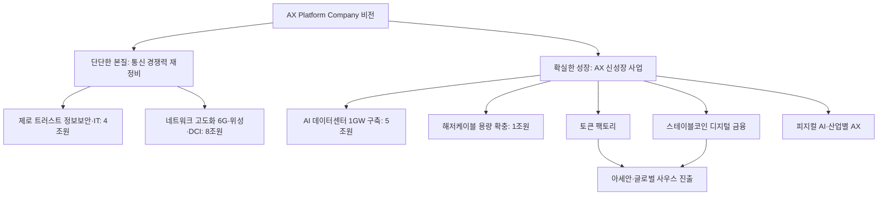
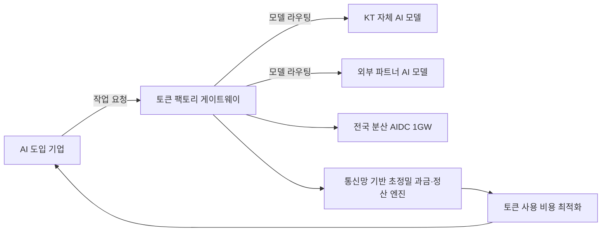
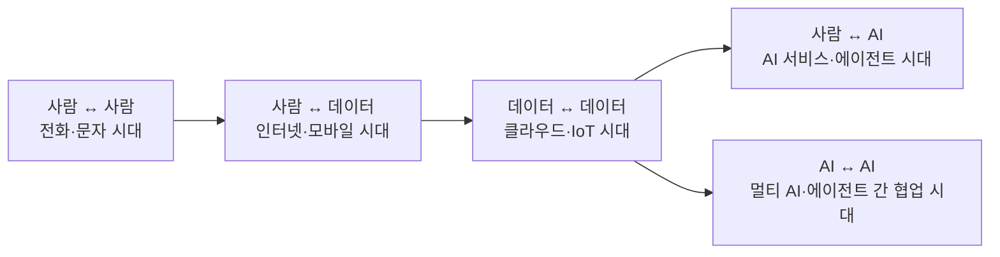

## 관련글

[**30년 정통 KT맨 박윤영의 승부수는 'AX 플랫폼'… 토큰 팩토리·디지털 금융이 미래 먹거리**](https://biz.chosun.com/it-science/ict/2026/07/06/YGL2SB7E4ZE7RCUXVXXNYJUIKA/)

## 목차

1. 들어가며 — 이 발표가 갖는 의미
2. 박윤영 대표는 누구인가 — 이력과 KT호 출범의 배경
3. 'AX 플랫폼 컴퍼니'라는 새로운 좌표
4. 첫 번째 축, '단단한 본질' — 통신 경쟁력 재정비
5. 두 번째 축, '확실한 성장' — AI 인프라 확장
6. 토큰 팩토리 — 통신사의 과금 DNA를 AI에 이식하다
7. 스테이블코인과 디지털 금융 플랫폼 — 케이뱅크·BC카드와의 결합
8. 산업별 AX와 해외 진출 로드맵
9. 경쟁 구도 — SK텔레콤, LG유플러스와의 비교
10. 남은 과제와 관전 포인트
11. 마치며

---

## 1. 들어가며 — 이 발표가 갖는 의미

2026년 7월 6일, 서울 광진구 풀만 앰배서더 서울 이스트폴 호텔에서 박윤영 KT 대표이사가 취임 후 첫 기자간담회를 열었다. 지난 3월 31일 취임한 지 100일을 갓 넘긴 시점에서 열린 이 자리에서 박 대표는 KT를 '인공지능 전환(AX) 플랫폼 컴퍼니'로 탈바꿈시키겠다는 청사진을 공개했다. 향후 3년간 정보보안·IT와 네트워크 분야에 약 12조원을, 향후 5년간 AI 인프라 분야에 약 6조원을 투입해 총 18조원 규모의 투자를 단행하겠다는 계획이다.

이 발표는 단순한 신규 사업 발표가 아니다. KT는 지난해 대규모 해킹 사고와 무단 소액결제 피해로 창사 이래 최악의 신뢰 위기를 겪었고, 그 여파로 전임 김영섭 대표가 연임을 포기하는 초유의 사태를 맞았다. 따라서 이번 간담회는 위기를 수습하고 새 리더십 아래 조직을 재정비하는 동시에, 통신사에서 AI 기업으로 체질을 바꾸겠다는 이중의 메시지를 담고 있다고 볼 수 있다.

## 2. 박윤영 대표는 누구인가 — 이력과 KT호 출범의 배경

박윤영 대표는 1962년생으로 서울대 토목공학과를 졸업하고 같은 분야에서 석사와 박사 학위를 받았다. 1992년 한국통신(현 KT) 네트워크기술연구직으로 입사한 뒤 한때 SK로 자리를 옮겼다가 다시 KT로 복귀했으며, 이후 KT 융합기술원 미래사업개발그룹장과 기업사업컨설팅본부장, 기업사업부문장(사장)을 두루 거쳤다. 특히 기업간거래(B2B) 부문에서 실적을 끌어올린 인물로 평가받아 왔고, 이번 취임 전 유력 후보군에 오를 당시에도 30년간 KT에 몸담으며 인공지능·디지털전환 기반 B2B 성장을 이끈 경력이 강점으로 꼽혔다.

박 대표의 취임 배경에는 KT가 겪은 심각한 위기가 자리하고 있다. 2025년 KT는 무단 소액결제와 불법 소형 기지국(펨토셀) 접속, 개인정보 유출 등 일련의 보안 사고에 휘말렸다. 정부 민관합동조사단은 KT가 2024년 3월부터 7월 사이 악성코드에 감염된 서버 43대를 발견하고도 정부에 신고하지 않았다는 사실을 확인했으며, 이 과정에서 사고를 축소·은폐하려 했다는 의혹까지 제기됐다. 김영섭 당시 대표는 국회 국정감사에서 경영 전반에 대한 책임을 언급하며 사실상 연임 포기 의사를 밝혔고, 결국 2025년 11월 4일 KT 이사회에서 차기 대표이사 공모에 참여하지 않겠다고 공식화했다. 이 여파로 KT는 위약금 면제 조치를 시행한 2025년 12월 31일부터 2026년 1월 13일 사이 약 31만 명의 가입자가 이탈하는 등 실질적 타격을 입기도 했다.

이런 배경 속에서 2026년 3월 정기 주주총회를 통해 선임된 박 대표에게는 두 가지 무거운 과제가 함께 주어졌다. 하나는 해킹 사고 수습과 그 과정에서 드러난 취약한 보안·조직 문화의 재건이었고, 다른 하나는 취임 당시 자신을 지지한 이사회의 비정상적인 영향력을 정상화하는 일이었다. 박 대표가 이번 간담회에서 "보안은 우리가 하는 일의 부분이 아니라 전체일 수 있도록 교육하고 있다"고 강조한 대목은 바로 이 배경과 맞닿아 있다.

## 3. 'AX 플랫폼 컴퍼니'라는 새로운 좌표

박 대표는 KT의 역사를 되짚으며 새 비전의 논리를 세웠다. 그는 1981년 한국전기통신공사로 출범했을 때는 국가를 위해 일했고, 2002년 민영화 이후에는 주주 이익 극대화를 추구해 왔지만, 시기마다 다른 정체성 속에서도 업의 본질은 언제나 '연결'이었다고 짚었다. 그러면서 AX 시대에는 사람과 AI, AI와 AI를 연결하는 것이 KT의 새로운 본령이 될 것이라고 말했다.

이렇게 제시된 'AX 플랫폼 컴퍼니'는 국가 기간통신사업자로서 대한민국 연결의 현재와 미래를 책임지는 동시에, 공공·산업·개인이 AX를 통해 성장하도록 돕는 조력자 역할을 하겠다는 의미를 담고 있다. 박 대표는 이를 무대 위에서 연기하는 주인공 배우가 아니라, 무대와 조명을 만들어 배우가 더 돋보이도록 돕는 역할에 비유하기도 했다. 이 비전은 '단단한 본질'과 '확실한 성장'이라는 두 축을 중심으로 짜여 있으며, 두 축이 선순환하는 구조를 만드는 것이 핵심 전략으로 제시됐다.

## 4. 첫 번째 축, '단단한 본질' — 통신 경쟁력 재정비

박 대표가 제시한 첫 번째 축은 통신사업자로서의 기본기를 다시 다지는 일이다. KT는 향후 3년간 정보보안·IT 분야에 4조원, 네트워크 분야에 8조원 등 총 12조원을 투입한다. 이는 지난 3개년 대비 2배 늘어난 규모로, 특히 보안 부문은 '모든 것을 신뢰하지 않고 항상 철저히 검증한다'는 제로 트러스트 원칙 아래 전사 보안 체계를 전면적으로 재정의하는 데 쓰인다. 클라우드 네이티브 전환과 보안 전문인력 확충도 함께 추진된다.

네트워크 부문에서는 6세대 이동통신(6G), 위성통신, 데이터센터 상호연결(DCI) 등 차세대 인프라 확보에 주력한다. 박 대표는 특히 위성통신의 중요성을 강조하며 정지궤도(GEO)와 저궤도(LEO)의 다중 위성을 KT SAT을 통해 직접 관제·운용함으로써 재난 상황에서도 끊기지 않는 통신 주권을 확보하겠다고 밝혔다. 그는 "대한민국은 항상 연결돼 있어야 하고, 그 연결에 대한 주체는 대한민국이 가져야 한다"고 말해 안보적 관점에서 위성 인프라의 자립을 강조했다. 개인 고객을 위한 서비스에도 변화가 예고됐다. 지금까지는 통신사가 요금제를 설계하고 고객이 그중에서 선택하는 구조였다면, 앞으로는 고객이 스스로 요금 설계를 주도할 수 있도록 그 주체를 통신사에서 고객으로 옮기겠다는 구상이다.

## 5. 두 번째 축, '확실한 성장' — AI 인프라 확장

두 번째 축은 AI 인프라 투자다. KT는 향후 5년간 6조원을 투입하는데, 이 중 5조원은 전국에 분산된 총 1기가와트(GW) 규모의 AI 데이터센터(AIDC)를 실수요 기반으로 구축하는 데 쓰인다. 박 대표는 "AI 시대의 중요한 인프라는 AI 데이터센터"라며, 전국 3,500여 개 국사에 AI 에지를 배치해 피지컬 AI와 자율주행 시대에 폭발적으로 늘어날 수요에 대비하겠다고 밝혔다.

나머지 1조원은 해저케이블 확충에 투입된다. 박 대표는 AI 데이터센터가 늘어나면 국가 간 연결 데이터 용량이 약 8배 급증할 것으로 예상된다며, 현재 38Tbps 수준인 해저케이블 용량을 128Tbps 이상으로 미리 준비하겠다고 밝혔다. 이는 기존 대비 약 90Tbps를 추가로 확보하겠다는 의미로, 국제 데이터 트래픽 급증에 선제적으로 대응하려는 포석이다. 이 대목에서 박 대표는 투자 규모가 경쟁사에 비해 작은 것 아니냐는 취재진의 질문에 "실수요를 기반으로 KT가 할 수 있는 범위에서 제시한 숫자"라며 "AI 데이터센터에서 중요한 것은 운용해본 경험인데, 여기서 KT는 다른 회사와 차별화된다"고 답했다.

## 6. 토큰 팩토리 — 통신사의 과금 DNA를 AI에 이식하다

이번 발표에서 가장 눈길을 끄는 신성장 사업은 '토큰 팩토리'다. 토큰은 AI 모델이 문장이나 이미지 등을 처리할 때 사용하는 가장 기본적인 단위로, 최근 AI 서비스 시장이 정액제 구독 모델에서 사용한 만큼 지불하는 사용량 기반 과금 구조로 빠르게 옮겨가면서 그 중요성이 커지고 있다. 문제는 기업들이 AI를 앞다퉈 도입하고 있지만, 어떤 작업에 어떤 모델을 얼마나 효율적으로 써야 비용을 줄일 수 있는지 판단하기 어렵다는 데 있다.

박 대표는 바로 이 지점에서 통신사의 오랜 강점을 접목하려 한다. 그는 "AI 시대에 토큰은 새로운 경제의 기본 단위가 됐다"며 "AI 기업이 아직 능숙하지 않은 '과금'은 통신사가 가장 잘하는 영역인 만큼, 이 둘이 결합하면 새로운 사업 모델이 될 수 있다"고 설명했다. 통신망을 수십 년간 운영하며 쌓아온 초정밀 과금·정산 역량에 전국 AIDC와 자체 AI 모델을 활용한 토큰 최적화 엔진을 결합해, 토큰의 생성과 중개, 과금까지 지원하는 하나의 플랫폼을 만들겠다는 구상이다. 실질적으로는 기업이 처리해야 할 작업의 성격에 맞춰 적합한 AI 모델을 연결해주는 일종의 '게이트웨이'이자, 기업 내 여러 AI 도입 상황을 통제하고 조율하는 'AI 오케스트레이션' 서비스의 성격도 함께 가진다. KT는 이 사업을 통해 2030년까지 1조원 규모로 성장시키겠다는 목표를 제시했다.

## 7. 스테이블코인과 디지털 금융 플랫폼 — 케이뱅크·BC카드와의 결합

두 번째 신성장 축은 스테이블코인 기반 디지털 금융 플랫폼이다. KT그룹은 케이뱅크의 1,600만 고객 기반과 BC카드의 350만 가맹점·결제정산 역량, 그리고 KT 자체의 초저지연·고신뢰 네트워크와 보안 인프라를 결합해 발행부터 보관, 송금, 실사용 생태계에 이르는 전 과정을 아우르는 그림을 그리고 있다.

다만 이 사업의 현실화 여부는 국내 입법 상황에 상당 부분 달려 있다는 점을 짚어둘 필요가 있다. 현재 한국에서는 민간 기관이 원화 스테이블코인을 발행하는 것이 사실상 금지돼 있는데, 이는 헌법상 화폐 발행 권한이 한국은행에만 있기 때문이다. 이재명 정부 출범 이후 원화 스테이블코인 제도화가 국정과제로 제시되면서 논의에 속도가 붙었고, 여야 의원들이 각각 관련 법안을 발의하는 등 이른바 '디지털자산기본법' 제정이 추진되고 있다. 그러나 스테이블코인을 은행 중심 컨소시엄으로 제한할 것인지, 비은행 기업의 참여를 폭넓게 허용할 것인지를 두고 한국은행과 금융위원회, 은행권과 핀테크·빅테크 업계 사이에 입장 차이가 여전히 크다. 정부는 2026년 경제성장전략을 통해 발행인가제 도입과 준비자산 100% 이상 유지 의무화 등을 뼈대로 한 법안을 마련하겠다는 방침을 밝혔지만, 지방선거 등 정치 일정과 맞물려 입법 시점은 계속 유동적인 상태다. 결국 KT의 스테이블코인 사업 역시 법적 기반이 갖춰지는 시점과 그 구체적인 조건에 따라 실제 사업 범위와 속도가 크게 달라질 수밖에 없는 구조다.

## 8. 산업별 AX와 해외 진출 로드맵

KT는 AIDC와 자체 AI 모델 등 AX 인프라 사업을 기반으로 토큰 팩토리, 스테이블코인, 피지컬 AI 솔루션을 단계적으로 결합해 사업 모델을 고도화하겠다는 방침이다. 산업별로는 금융권에는 에이전틱 AI를, 공공 부문에는 소버린 수요에 맞춘 AX를, 제조·의료 분야에는 피지컬 AI를 제공하겠다고 밝혔으며 정부 실증 사업에도 적극 참여하겠다는 뜻을 밝혔다.

해외 진출과 관련해서는 이미 태국, 베트남 등에서 소규모 AX 사업을 진행하고 있다는 점을 언급하며 아세안을 넘어 신흥국인 '글로벌 사우스' 시장까지 사업 권역을 점진적으로 넓히는 로드맵을 제시했다. 파트너십 전략도 다변화한다. 기존에 협력해 온 마이크로소프트와의 관계를 이어가는 동시에, 구글과 팔란티어 등 글로벌 AI 기업, 그리고 업스테이지·리벨리온·솔트룩스 등 국내 AI 기업으로 협력 대상을 넓혀 고객의 선택권을 확대하고 국내 AX 생태계를 강화하겠다는 취지다. 박 대표는 "AX 플랫폼 컴퍼니는 KT 혼자서 할 수 없다"며 글로벌 파트너와 국내 AX 파트너들과 함께 생태계를 만들어가겠다고 강조했다.

## 9. 경쟁 구도 — SK텔레콤, LG유플러스와의 비교

이번 발표는 통신 3사가 나란히 AI 인프라 경쟁에 뛰어드는 흐름 속에서 나왔다. 공교롭게도 KT의 간담회 하루 전인 7월 5일, SK텔레콤은 최대 15GW 규모의 AI 데이터센터를 구축해 '아시아 AI 인프라 허브'로 도약하겠다는 계획을 공개했다. 정재헌 SK텔레콤 대표는 울산에 짓고 있는 1GW급 데이터센터를 시작으로 영남권과 서남권에 클러스터를 확장해 2029년까지 5GW를, 2035년까지 15GW를 순차적으로 구축하겠다고 밝혔으며, 이를 경부고속도로와 초고속 인터넷에 이은 대한민국의 세 번째 국가 인프라 혁신으로 규정했다. SK텔레콤 측 설명에 따르면 통상 1GW급 AI 데이터센터 구축에는 약 70조원의 사업비가 소요되며, 15GW 목표를 달성하려면 자체 투자 외에도 전략적 파트너 투자와 프로젝트 파이낸싱 등을 통한 대규모 자금 조달이 필요하다.

같은 통신 3사 중 하나인 LG유플러스는 홍범식 대표 체제 아래 '신뢰'를 핵심 키워드로 내세우며 상대적으로 보수적인 행보를 보이고 있다. 세 회사 모두 지난해 크고 작은 해킹 사고를 겪은 만큼, 2026년 신년사에서는 예년의 'AI 성과 창출' 강조 대신 신뢰 회복과 고객, 안전이라는 키워드가 두드러졌다는 공통점이 있다.

이런 맥락에서 보면 KT의 18조원 규모 투자, 그중에서도 AIDC 5조원·1GW 목표는 SK텔레콤의 15GW·약 1,000조원 규모 로드맵에 비하면 상당히 신중한 수준이다. 박 대표 스스로도 기자간담회에서 이 점에 대한 질문을 받고 "실수요 기반"이라는 원칙과 "운용 경험의 차별성"을 근거로 제시한 바 있다. 이는 공격적인 선점형 투자보다는 검증된 수요와 본업 경쟁력을 우선하는 KT식 접근법을 보여주는 대목으로 해석할 수 있다.

## 10. 남은 과제와 관전 포인트

이번 청사진이 실제로 성과를 낼 수 있을지는 몇 가지 지점에서 지켜볼 필요가 있다. 첫째, 토큰 팩토리는 아직 구체적인 요금 체계나 파트너사, 상용화 일정이 공개되지 않은 초기 구상 단계에 가깝다. 통신사의 과금 노하우를 AI 영역에 이식한다는 방향성은 설득력이 있지만, 실제로 기업 고객들이 기존에 쓰던 클라우드·AI 플랫폼 대신 KT의 게이트웨이를 선택할 유인을 얼마나 확보하느냐가 관건이 될 것이다.

둘째, 스테이블코인 사업은 앞서 짚었듯 국내 입법 상황에 전적으로 의존한다. 디지털자산기본법의 통과 시점과 발행 주체 관련 세부 조건이 확정되기 전까지는 KT-케이뱅크-BC카드 연합의 구체적인 사업 모델도 유동적일 수밖에 없다.

셋째, KT는 해킹 사고로 인한 신뢰 훼손을 완전히 회복하지 못한 상태에서 대규모 신사업을 발표했다는 점에서, 보안 투자에 대한 선언이 실제 조직 문화와 시스템 개선으로 이어지는지가 함께 검증받을 사안이다. 일각에서는 사후 보상과 투자 계획을 발표하는 것만으로는 사고 이전에 존재했던 관리 실패를 온전히 설명하기 어렵다는 지적도 제기된 바 있다.

넷째, 통신 3사가 동시에 대규모 AI 인프라 투자에 나서면서 국내 전력 수급과 부지 확보를 둘러싼 경쟁이 치열해질 가능성이 있다. 업계 관계자들 사이에서는 이런 경쟁 구도가 AI 데이터센터와 B2B AI 시장 선점 경쟁을 한층 가속화할 것이라는 전망이 나오고 있다.

## 11. 마치며

박윤영 대표가 제시한 'AX 플랫폼 컴퍼니'는 통신 본업의 기본기를 다시 다지는 '단단한 본질'과, 토큰 팩토리·스테이블코인·피지컬 AI 등 신성장 사업을 키우는 '확실한 성장'이라는 두 축으로 요약된다. 국가 기간통신사업자라는 정체성을 유지하면서도 AI 시대에 맞춰 연결의 대상을 사람에서 AI로 확장하겠다는 것이 이 전략의 핵심 논리다.

다만 이 청사진은 아직 방향성과 투자 규모를 제시한 단계이며, 토큰 팩토리의 구체적인 사업 모델이나 스테이블코인의 법적 기반, 보안 신뢰 회복의 실질적 성과 등은 앞으로 하나씩 채워나가야 할 과제로 남아 있다. 통신 3사가 나란히 AI 인프라 경쟁에 뛰어든 지금, KT의 행보가 실제 실행력으로 이어지는지는 앞으로 몇 분기에 걸쳐 이어질 후속 발표와 실적을 통해 확인될 것으로 보인다.

---

*이 문서는 조선비즈가 제공한 원문 기사와 이투데이, 뉴스웨이, 경향신문, 인사이트코리아, 한국경제, 매일일보, inews24, 중앙이코노미뉴스, EBN 등 2026년 7월 6일자 관련 보도, 그리고 KT 전임 대표 교체 배경과 스테이블코인 법제화 현황, SK텔레콤 AI 데이터센터 계획 등에 대한 별도 검색 결과를 종합해 작성했다.*

---

## 별첨. "연결의 대상을 사람에서 AI로 확장한다"는 말은 정확히 무슨 뜻인가

본문 3장에서 인용한 박윤영 대표의 발언, 즉 "AI 시대에는 사람과 AI, AI와 AI를 연결하는 것이 KT의 새로운 본령"이라는 문장은 여러 매체에서 조금씩 다른 표현으로 반복해서 보도됐다. 스마트비즈에 따르면 박 대표는 간담회에서 "최근까지 사람과 사람, 사람과 데이터, 데이터와 데이터를 연결했다면 AI 시대에는 사람과 AI, AI와 AI를 연결하는 것이 새로운 연결의 일이 될 것"이라고 말했다. 천지일보가 전한 발언도 같은 취지다. 이 문장 하나만 놓고 보면 다소 추상적인 슬로건처럼 들릴 수 있어, 실제로 KT의 어떤 사업과 연결되는 이야기인지 하나씩 풀어서 설명한다.

### 1) KT가 스스로 정의해온 '연결'의 역사

KT는 이번 발표에서 자신의 정체성을 하나의 서사로 정리했다. 1981년 한국전기통신공사로 출범했을 때는 전화선을 놓아 사람과 사람을 잇는 회사였고, 이후 인터넷 시대에는 사람이 데이터(웹, 이메일, 클라우드)에 접속하도록 돕는 역할을 더했으며, 데이터센터와 클라우드 인프라 시대에는 데이터와 데이터, 즉 서버와 서버, 시스템과 시스템을 잇는 역할까지 맡아왔다는 것이다. 정리하면 아래와 같은 흐름이다.

박 대표가 말한 "본질은 변하지 않는다"는 것은, KT가 지금까지 해온 일—전화선과 기지국, 광케이블과 데이터센터로 무언가를 안정적으로 이어주는 일—의 성격 자체는 그대로 유지된다는 뜻이다. 다만 그 '무언가'의 종류가 사람과 사람에서 사람과 AI, AI와 AI로 넓어진다는 것이 이번 선언의 핵심이다.

### 2) "사람과 AI를 연결한다"는 것은 구체적으로 무엇인가

이는 개인이나 기업이 AI 서비스를 쓸 때 그 접점을 KT가 책임지겠다는 의미로 읽을 수 있다. 예를 들어 이런 장면들이 여기에 해당한다.

개인 고객이 스마트폰으로 AI 비서나 AI 에이전트를 쓸 때, 그 신호가 끊기지 않고 지연 없이 오가도록 하는 통신망 자체가 '사람과 AI의 연결'이다. KT가 강조한 6G, 위성통신, 그리고 전국 3,500여 국사에 배치하는 'AI 에지'가 여기에 해당하는 인프라다. AI 에지는 사용자가 있는 현장에서 가까운 곳에 AI 연산을 배치해, 자율주행이나 산업 현장의 실시간 AI 판단처럼 한 순간의 지연도 허용되지 않는 서비스에서 사람과 AI 사이의 반응 속도를 끌어올리는 역할을 한다.

또한 KT가 준비 중인 '요금 설계 주체를 고객으로 전환'하는 서비스도 이 범주에 들어간다. 사람이 AI에게 원하는 조건을 직접 지시하고 AI가 그에 맞춰 요금제를 설계해주는 방식이 되면, 사람과 AI가 직접 상호작용하는 접점이 통신 서비스 안으로 들어오는 셈이다.

### 3) "AI와 AI를 연결한다"는 것은 구체적으로 무엇인가

이 부분이 사실 이번 전략에서 더 새로운 이야기다. 여기에는 최소 세 가지 사업이 걸려 있다.

첫째는 토큰 팩토리다. 기업이 어떤 작업에는 A사의 언어모델을, 다른 작업에는 KT 자체 모델을이나 다른 파트너사의 모델을 쓰도록 연결해주고, 그 사용량을 통합해서 과금하는 구조다. 즉 여러 AI 모델 사이를 KT의 게이트웨이가 중개한다는 점에서 'AI와 AI의 연결'이며, 경향신문이 이를 "AI 오케스트레이션(기업 내 도입된 AI를 통제하고 조율하는 것)"이라고 설명한 것도 같은 맥락이다.

둘째는 AI 데이터센터 간 연결이다. 국내에 흩어진 KT의 AIDC들, 그리고 국내외 다른 기업의 데이터센터들이 서로 데이터를 주고받는 양이 앞으로 크게 늘어난다. 천지일보 보도에 따르면 박 대표는 "AI 데이터센터가 제대로 돌아가려면 연결도 중요하다"며 국제 트래픽을 실어 나르는 해저케이블과 육양국, 그리고 데이터센터 간 연결을 뜻하는 DCI(데이터센터 상호연결)가 모두 필요하다고 밝혔다. 결국 해저케이블 확장(38Tbps→128Tbps 이상)도 사람이 아니라 AI 데이터센터들끼리 주고받는 트래픽이 8배 가까이 늘어날 것이라는 전망에 대비한 투자라는 점에서, 'AI와 AI의 연결'을 물리적으로 뒷받침하는 인프라다.

셋째는 스테이블코인·디지털 금융 인프라다. 이는 사람 간 거래라기보다, 앞으로 AI 에이전트가 사람을 대신해 결제나 정산을 자동으로 처리하는 시나리오(에이전틱 커머스)를 염두에 둔 포석으로 해석할 수 있다. 다만 이 부분은 KT가 명시적으로 밝힌 내용이라기보다, 스테이블코인과 토큰 경제를 함께 묶어 제시한 맥락에서 업계가 공통적으로 그리는 방향성에 가깝다는 점은 짚어둘 필요가 있다.

### 4) 이 표현을 어떻게 받아들이면 좋을까

정리하면 "연결의 대상을 사람에서 AI로 확장한다"는 문장은 새로운 기술을 가리키는 말이라기보다, KT가 자신의 기존 자산—통신망, 데이터센터, 해저케이블, 과금·정산 시스템, 보안 인프라—을 사람 간 통신이 아니라 AI 시스템 간, 그리고 사람과 AI 사이의 트래픽을 감당하는 용도로 다시 정의하겠다는 사업 전략 선언에 가깝다. 실제로 이데일리는 이번 전략의 성격을 "글로벌 빅테크와 SK텔레콤의 대규모 선투자 방식과는 다른, 기존 통신 인프라와 AI 소프트웨어를 결합한 실용주의"로 요약했는데, 이 역시 같은 맥락이다. 즉 KT는 새로운 무언가를 처음부터 만드는 것이 아니라, "우리가 원래 잘하던 연결이라는 일이 이제는 AI를 대상으로도 필요해졌다"는 논리로 통신사에서 AI 인프라 기업으로의 전환 명분을 세운 것이라고 볼 수 있다.

다만 이 문장 자체는 비전 선언에 해당하며, 토큰 팩토리나 AI 에지, 스테이블코인 각각의 구체적인 상용화 일정과 요금 체계, 파트너사는 본문 10장에서 짚었듯 아직 공개되지 않은 부분이 많다. 따라서 "연결 대상의 확장"이라는 표현은 KT가 그리는 방향성을 압축한 슬로건으로 이해하되, 실제 사업이 그 방향대로 구체화되는지는 앞으로의 발표를 통해 계속 확인이 필요하다.

---

## 별첨 2. "이게 정말 AX인가?" — 토큰 팩토리·해저케이블·AI 에지를 비판적으로 다시 뜯어보기

별첨 1에서 정리한 설명, 즉 토큰 팩토리(AI 모델 간 중개)와 해저케이블·AIDC 확충(AI 데이터센터 간 트래픽), AI 에지(사람과 AI 사이의 실시간 반응)가 "연결의 대상이 사람에서 AI로 확장된다"는 문장의 실체라는 정리에 대해, "이게 진짜 AX냐"는 의문은 상당히 타당한 지적이다. 결론부터 말하면, KT의 설명이 완전히 틀린 말은 아니지만 '연결의 확장'이라는 문학적 수사와 실제 투자 내역 사이에는 의도적으로 좁혀 말하지 않은 간극이 있다. 그 이유를 짚어본다.

### 1) 'AX'라는 단어에는 두 가지 다른 의미가 섞여 쓰인다

AX(AI Transformation, 인공지능 전환)라는 말은 원래 한 조직이 업무 방식과 의사결정 구조를 AI 중심으로 근본적으로 재편하는 것을 가리킨다. 보안업계 매체 이글루코퍼레이션의 설명을 빌리면, DX가 데이터를 모으고 시스템을 연결하는 것이었다면 AX는 도구를 들여오는 데 그치지 않고 업무 자동화·지능화·자율화를 통해 일하는 방식 자체를 바꾸는 것이다. 이 정의를 KT 자신에게 엄격하게 적용하면, 데이터센터를 짓고 해저케이블을 놓고 엣지 장비를 배치하는 일은 그 자체로 KT가 AI로 '전환'하는 것이 아니라, AI 수요가 늘어난 시장에 인프라를 공급하는 전통적인 설비투자(CAPEX) 사업에 더 가깝다.

다만 최근 산업계에서는 'AX'라는 말이 더 넓은 의미로도 쓰인다. 이는 어떤 기업이 자기 자신을 바꾸는 것이 아니라, 데이터센터·전력망·네트워크 같은 기존 자산을 활용해 다른 기업들의 AI 도입을 지원하는 사업으로 전환하는 것을 뜻한다. 버라이즌의 'AI Connect', T모바일과 OpenAI의 협업, 싱가포르 싱텔의 소버리 AI 데이터센터 사업 등이 모두 이 범주에 속하며, 국내에서도 통신사들이 이런 흐름을 따라가고 있다는 분석이 나온다. KT의 이번 발표도 이 두 번째 의미, 즉 '자신을 위한 AX'가 아니라 **'남을 위한 AI 인프라 사업으로의 전환'** 에 훨씬 가깝다.

### 2) KT 스스로도 "우리는 배우가 아니라 무대"라고 밝혔다

이 지점에서 흥미로운 것은 박 대표 본인이 이 구분을 부정하지 않았다는 점이다. 그는 이번 간담회에서 AX 플랫폼의 정체성을 "무대 위에서 연기하는 배우가 아니라 배우가 더 잘할 수 있도록 무대와 조명을 만드는 역할"이라고 설명하며, 기업들의 AI 도입을 돕는 '인에이블러(Enabler)'가 되겠다고 못 박았다. 이는 결국 KT 자신이 AI로 업무를 재편하는 주체가 아니라, 남의 AX를 뒷받침하는 인프라·플랫폼 제공자라는 점을 스스로 인정한 표현이다. 그렇다면 "연결의 대상이 사람에서 AI로 확장된다"는 문장이 가리키는 실체는, KT 내부가 AI로 바뀐다는 뜻이 아니라 KT가 실어 나르는 트래픽의 주체가 사람에서 AI 시스템으로 옮겨가고 있고, KT는 그 물량을 받아낼 파이프(케이블·데이터센터·엣지)를 넓히겠다는 뜻에 가깝다.

### 3) 세 가지 사업을 하나씩 다시 보면

해저케이블과 AIDC 확충은, AI 데이터센터들끼리 주고받는 국제 트래픽이 늘어난다는 수요 전망에 대응하는 설비 증설이다. 케이블을 놓고 데이터센터를 짓는 행위 자체는 통신사가 AI 붐 이전부터 해오던 본업이며, 여기에 'AI'라는 수요처가 새로 추가됐을 뿐 통신 인프라 사업의 성격이 근본적으로 달라진 것은 아니다. 다시 말해 이 부분은 "KT가 AI와 연결하는 새로운 능력을 개발했다"는 뜻이라기보다 "트래픽을 일으키는 고객이 사람에서 AI 시스템으로 바뀌고 있으니 파이프를 더 굵게 만들겠다"는 뜻으로 읽는 편이 더 정확하다.

AI 에지 역시 마찬가지다. 전국 3,500여 개 통신 국사라는 기존 부동산·전력·회선 자산 위에 컴퓨팅 장비를 얹어 저지연 서비스를 제공하는 엣지 컴퓨팅 사업으로, 통신사가 이미 갖고 있던 입지 우위를 활용하는 것이다. 이 역시 산업 현장의 AI 추론 수요에 대응하는 인프라 사업이지, KT 내부 의사결정이나 업무 프로세스가 AI로 재편되는 것과는 결이 다르다.

세 사업 중 '연결 대상의 확장'이라는 표현에 그나마 가장 부합하는 것은 토큰 팩토리다. 여러 AI 모델 사이를 게이트웨이가 중개하고 사용량을 통합 과금하는 구조이기 때문에, 기존 통신 인프라 위에 'AI 모델 간 트래픽을 다루는 새로운 층'이 얹히는 셈이다. 다만 이 사업조차 아직 요금 체계나 파트너사, 상용화 일정이 전혀 공개되지 않은 개념 발표 단계이므로, 실체라기보다는 방향성 선언으로 보는 것이 정확하다.

### 4) 그렇다면 KT의 설명은 "말이 안 되는" 것인가

전적으로 틀렸다고 보기는 어렵다. 통신사가 보유한 데이터센터·전력망·네트워크 자산을 AI 인프라 사업으로 전환하는 것은 국내외에서 이미 통용되는 전략이며, KT만 유별나게 과장하고 있다고 볼 근거는 찾기 어렵다. 다만 "연결의 대상을 사람에서 AI로 확장한다"는 표현은 실제로는 "통신 설비투자의 고객이 사람에서 AI 시스템으로 옮겨간다"는, 훨씬 건조하고 산문적인 사실을 감성적이고 서사적인 언어로 압축한 것이다. 이 압축 과정에서 '본질은 그대로'라는 안정감을 주는 수사와, 실제로는 전형적인 통신 설비 확장 사업이라는 실질 사이에 해석의 간극이 생긴다.

참고로 국내 IT 업계 전반에서는 최근 '에이전트 워싱' 논란, 즉 기존 서비스에 AI나 에이전트라는 이름만 덧붙여 실적과 혁신성을 부풀리는 관행에 대한 우려가 커지고 있다는 보도도 있다. 다만 이 보도는 업계 전반의 현상을 지적한 것이며 KT의 이번 발표를 직접 겨냥해 비판한 것은 아니라는 점은 분명히 해둘 필요가 있다. 실제로 이번 발표에 대한 삼성증권 등 증권가 반응이나 전자신문 사설은 오히려 대체로 긍정적이었고, 투자 규모가 SK텔레콤 등에 비해 작다는 점에 대한 지적은 있었지만 '허구'라거나 '과장'이라는 직접적 비판은 확인되지 않았다.

### 5) 정리

"토큰 팩토리·해저케이블·AI 에지가 곧 AX냐"는 질문에 대한 답은, 좁은 의미의 AX(조직 스스로의 AI 기반 재편)로 보면 아니오에 가깝고, 넓은 의미의 AX(AI 붐에 필요한 인프라·플랫폼을 제공하는 사업)로 보면 그렇다고 할 수 있다. KT 스스로도 "인에이블러"라는 표현으로 후자의 의미임을 밝혔다는 점에서, 이 발표를 "말이 안 되는 주장"이라고 단정하기는 어렵다. 다만 "연결의 대상이 사람에서 AI로 확장된다"는 표현이 마치 KT 내부에 어떤 새로운 기술적 도약이 있었던 것처럼 들리게 하는 효과가 있는 반면, 실제 내용은 케이블 용량과 데이터센터 전력, 엣지 부지라는 전통적인 통신 설비투자에 훨씬 가깝다는 점은 읽는 사람이 구분해서 받아들일 필요가 있다.
