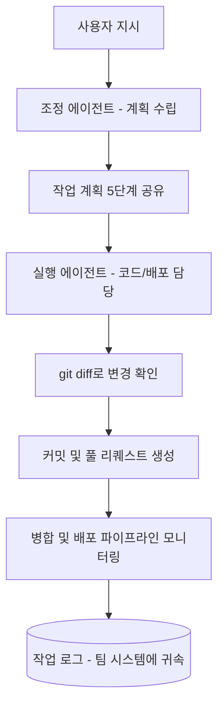
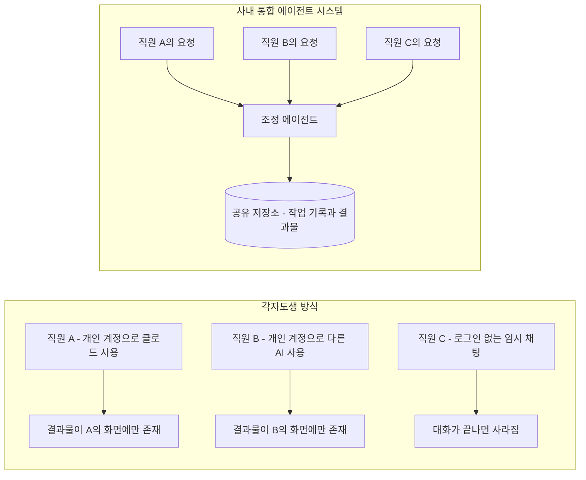
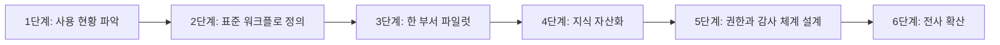

## 관련글

> 
> [**회사에서 직원들이 개별적으로 AI를 써서는 시너지가 나지 않습니다.**](https://www.facebook.com/share/p/19FXydMgk8/) 어떤 사람은 클로드를 쓰고 어떤 사람은 제미나이를 쓰고, 같은 서비스를 써도 개별 계정으로 작업하거나 심지어 임시채팅으로 작업하는 상황까지. 
> 
> 일전에 어떤 회사의 직원 한명이 본인이 사용한 프롬프트를 공유하지 않는다고 해서 이슈가 된 적이 있었죠. 여러 관점이 있지만 사실 중요한건 직원들이 슬랙을 쓰듯 모여서 작업할 수 있는 환경을 마련해 주는게 급선무입니다. 즉 회사 내부용 에이전트 시스템을 만들어 놓으면 그런 논쟁 자체가 의미가 없습니다.
> 
> 첨부처럼, 각 사용자는 자기 업무를 수행하면 되고요, 그러면 시스템은 그 사용자의 각종 지시를 잘 처리하고 '기억해서' 작업 결과물이 바깥의 어딘가나 직원의 개별 디스크에 저장되는 것이 아니라 시스템에 남도록 만드는 구조를 만드시면 됩니다.
> 
> 보시면 와 우리는 어떻게 저런걸 만들지? 하시겠지만 시간 문제일뿐 다 하실 수 있습니다. 해 보신 분들은 흐흐 나도 처음엔 무슨 말인지 몰랐지 웃을 건데요, 정말 할 수 있습니다. 구성원들의 작업이 집적되는 구조를 만들어 놓으면 그 퍼포먼스는 이전에 경험한 적이 없는 수준이 될 거에요!
> 
> 아시죠? 대표가, 리더가 챙겨야 합니다! 절대 위임하지 마세요
>

## 목차

1. 들어가며
2. 원문 요약 — 페이스북 게시물이 말하는 것
3. 화면이 보여주는 것 — 공유 에이전트 작업대 해부
4. "각자도생 AI"의 실제 비용
5. 프롬프트를 감추는 사람들 — 이미 벌어지고 있는 마찰
6. 지금 실제로 존재하는 사내 통합 에이전트 도구들
7. 저자 의견 톺아보기 — 무엇이 착각이고 무엇이 진짜인가
8. 리더가 챙겨야 하는 이유 — 왜 위임하면 안 되는가
9. 실무 로드맵 — 사내 통합 에이전트 시스템을 만드는 여섯 단계
10. 남는 질문들 — 프롬프트 소유권, 보안, 거버넌스
11. 정리하며

---

## 1. 들어가며

이 문서는 두 가지 자료를 바탕으로 한다. 하나는 페이스북에 올라온 게시물이고, 다른 하나는 그 게시물의 주장을 뒷받침하기 위해 함께 첨부된 어느 팀의 업무 화면이다. 페이스북 원문은 외부 크롤러의 접근을 차단하고 있어 직접 열람할 수는 없었지만, 게시물을 공유한 사람이 본문을 그대로 옮겨 적어 두었기 때문에 그 인용문을 1차 자료로 삼아 분석했다. 여기에 2026년 7월 현재 시점의 국내외 엔터프라이즈 AI 에이전트 동향을 검색으로 보강해서, 게시물의 주장이 막연한 개인 의견인지 아니면 업계에서 실제로 검증되고 있는 흐름인지를 짚어보려 한다.

게시물의 핵심 문장은 짧다. 회사에서 팀원 여럿이 AI를 가지고 하나의 프로젝트를 같이 할 수 있을 거라는 생각 자체가 착각이라는 것이다. 정확히는, "개별적으로 각자 AI 툴을 쓰는 방식"으로는 그런 협업이 불가능하다는 뜻이다. 이 문서는 이 주장이 왜 타당한지, 그리고 무엇을 대안으로 제시하고 있는지를 차근차근 풀어본다.

## 2. 원문 요약 — 페이스북 게시물이 말하는 것

게시물의 논지를 순서대로 정리하면 다음과 같다.

첫째, 회사 안에서 직원들이 AI를 개별적으로 쓰는 방식으로는 시너지가 나지 않는다고 말한다. 어떤 사람은 클로드를 쓰고 어떤 사람은 제미나이를 쓰며, 같은 서비스를 쓰더라도 각자의 개인 계정으로 작업하거나 심지어 로그인조차 하지 않는 임시 채팅으로 작업하는 경우까지 있다는 것이다. 이렇게 되면 한 사람이 AI와 나눈 대화, AI가 만들어낸 초안, AI가 참고한 맥락이 모두 그 사람의 화면 안에만 존재하고 사라진다.

둘째, 저자는 과거에 있었던 사례 하나를 언급한다. 어느 회사의 한 직원이 자신이 사용한 프롬프트를 동료들에게 공유하지 않아 논란이 됐다는 것이다. 저자는 이 사건에 대해 여러 해석이 있을 수 있다고 인정하면서도, 정작 중요한 것은 그런 논쟁 자체가 벌어질 필요가 없는 환경을 만드는 일이라고 말한다. 즉 프롬프트를 공유하라 마라를 놓고 다투는 대신,애초에 작업이 회사 시스템 위에서 이뤄지도록 만들면 그 논쟁 자체가 무의미해진다는 논리다.

셋째, 저자가 제시하는 대안은 사내용 에이전트 시스템이다. 각 구성원은 평소처럼 자신의 업무를 지시하면 되고, 시스템은 그 지시를 처리하고 기억해서, 결과물이 외부 어딘가나 개인의 디스크에 남는 게 아니라 회사 시스템 안에 남도록 설계하라는 것이다. 첨부된 화면이 그 예시로 제시되어 있다.

넷째, 저자는 이런 시스템을 구축하는 일이 처음엔 막막해 보여도 결국 시간문제일 뿐 누구나 만들 수 있다고 말한다. 그리고 구성원들의 작업 결과가 한곳에 쌓이는 구조를 만들어두면, 그 성과는 이전에 경험하지 못한 수준이 될 것이라고 전망한다.

다섯째, 저자는 이 작업을 실무자에게 위임하지 말고 대표나 리더가 직접 챙겨야 한다고 강조하며 글을 맺는다.

## 3. 화면이 보여주는 것 — 공유 에이전트 작업대 해부

첨부된 화면은 "마케팅자동화"라는 이름이 붙은 작업 공간을 보여준다. 왼쪽에는 지금 동시에 돌아가고 있는 여러 작업 목록이 떠 있다. 각 항목에는 어떤 저장소, 어떤 지시를 기준으로 작업이 진행 중인지, 그리고 얼마나 시간이 흘렀는지가 함께 표시되어 있고, 필요하면 그 자리에서 작업을 중단시킬 수 있는 버튼도 붙어 있다. 즉 한 사람이 여러 개의 작업을 동시에 맡겨놓고 병렬로 진행 상황을 확인하는 구조다.

화면 가운데에는 조정 역할을 하는 에이전트가 사용자의 요청을 확인했다고 답하면서, 5단계로 이뤄진 작업 계획을 제시하는 장면이 나온다. 이 계획은 브라우저 개발자 도구로 오류를 확인하는 단계, 서버 로그에서 실패 원인과 스택 트레이스를 찾는 단계, 재현 조건을 특정하는 단계, 원인에 맞춰 코드나 설정을 수정하는 단계, 마지막으로 같은 입력으로 재현 테스트를 하는 단계까지 순서대로 배열되어 있다. 계획을 다 세운 뒤 곧바로 실행에 들어가는 게 아니라, 계획 자체를 사람이 볼 수 있는 형태로 먼저 공유한다는 점이 특징이다.

오른쪽에는 실제 실행을 담당하는 에이전트의 작업 과정이 실시간으로 노출된다. 이 에이전트는 git diff로 변경 사항을 확인하고, 의도한 수정인지 재차 확인한 뒤, 커밋과 푸시를 거쳐 풀 리퀘스트를 여는 과정을 순서대로 밟는다. 이후 풀 리퀘스트가 병합 가능한 상태인지 확인하고, 병합 후에는 배포 파이프라인이 정상적으로 끝까지 도는지를 계속 지켜보는 모습도 함께 보인다.

이 화면에서 눈여겨볼 부분은 세 가지다. 첫째, 조정을 맡는 에이전트와 실제 코드·배포 작업을 실행하는 에이전트가 역할별로 분리되어 있다는 점이다. 이는 하나의 거대한 AI가 모든 걸 처리하는 방식이 아니라, 계획 수립과 실행이라는 서로 다른 역할이 나뉘어 협업하는 구조에 가깝다. 둘째, 작업의 전 과정—무엇을 하기로 했는지, 무엇을 했는지, 결과가 어땠는지—이 전부 이 작업 공간 안에 그대로 기록되어 남는다는 점이다. 어느 개인의 로컬 컴퓨터나 개인 채팅 기록에 흩어지는 게 아니라 하나의 화면, 하나의 저장 공간 안에 쌓인다. 셋째, 여러 작업이 동시에 병렬로 진행되고 있다는 점인데, 이는 한 사람의 지시가 하나의 스레드로 끝나는 게 아니라 여러 갈래로 뻗어나가 동시에 처리되고 있다는 뜻이다.

다만 한 가지는 분명히 짚어야 한다. 화면에 등장하는 조정 에이전트의 이름표 자체가 특정 상용 제품의 공식 명칭인지는 공개된 자료로 확인할 수 없었다. 검색을 통해 국내 AI 에이전트 스타트업 목록이나 관련 서비스들을 확인해봤지만 해당 명칭과 정확히 일치하는 공개 제품 정보는 찾지 못했다. 따라서 이 화면은 특정 브랜드를 홍보하기 위한 자료라기보다, 팀 전용으로 구축했거나 시범적으로 도입한 도구가 실제로 어떻게 동작하는지를 보여주는 사례로 이해하는 편이 정확하다. 아래에서 소개할 여러 공개 도구들 역시 같은 개념—조정과 실행의 역할 분리, 작업 기록의 중앙 저장, 병렬 처리—을 각자의 방식으로 구현하고 있다.

## 4. "각자도생 AI"의 실제 비용

저자가 말하는 "착각"이 왜 착각인지는 실제로 여러 곳에서 이미 지적되고 있는 문제다. 케이티클라우드 기술 블로그는 그동안 많은 기업에서 AI 시스템들이 이른바 각자도생 방식으로 운영되어 왔다고 설명한다. 고객센터 AI, ERP 시스템 AI, HR 챗봇이 저마다 따로 움직이다 보니 서로 정보를 주고받기가 쉽지 않았다는 것이다. 이 문제를 풀기 위해 구글이 만든 에이전트 간 통신 표준인 A2A 프로토콜이 등장했다는 설명도 함께 나온다. 이는 원래 서로 다른 AI 시스템 사이의 연결 문제를 다루는 맥락이지만, 같은 회사 안에서 사람마다 서로 다른 AI 도구와 서로 다른 계정으로 일하는 상황에도 그대로 적용되는 논리다.

비슷한 지적은 국내 엔터프라이즈 AI 관련 백서에서도 발견된다. 씨엔에프의 에이전트 플랫폼 비교 가이드는 어떤 부서는 챗봇을 만들고 어떤 부서는 문서 검색 시스템을 만들지만 이들이 서로 연결되지 않아 데이터가 고립되는 이른바 사일로 현상이 벌어진다고 짚는다. 이 파편화를 풀어줄 오케스트레이션 계층이 있어야 회사의 AI 자산을 하나로 묶을 수 있다는 것이 이 가이드의 핵심 주장이다. 결국 페이스북 게시물이 말하는 "각자 AI를 쓰면 시너지가 안 난다"는 문장은, 이미 업계에서 부서 단위, 조직 단위로 관찰되고 있는 파편화 문제를 개인 단위로 한 번 더 축소해서 짚은 것에 가깝다.

디파이나이트의 기업용 AI 에이전트 가이드는 이 문제를 조금 더 실무적인 언어로 풀어낸다. 일부 실무자들은 어차피 AI로 직접 원하는 기능을 만들면 되는 것 아니냐고 생각해서 개인적으로 도구를 구현해 사내에 배포하기도 하지만, 개인이 만든 도구나 범용 AI 어시스턴트와 기업용으로 제대로 설계된 AI 에이전트 사이에는 분명한 차이가 있다고 지적한다. 범용 AI 서비스는 대체로 클라우드 기반으로 동작하기 때문에 데이터를 넣는 순간 그 데이터가 외부 서버를 거칠 수밖에 없고, 이는 개인 사용자에게는 큰 문제가 아니어도 기업에는 전혀 다른 이야기가 된다는 것이다. 결국 프롬프트를 아무리 잘 써도, 업무의 맥락 자체가 시스템 안에 내재화되어 있지 않으면 한계가 뚜렷하다는 지적으로 이어진다.

## 5. 프롬프트를 감추는 사람들 — 이미 벌어지고 있는 마찰

저자가 언급한 "프롬프트를 공유하지 않아 이슈가 된 사례"는 특정 사건 하나를 콕 집어 검증하기는 어려웠지만, 이런 마찰이 한국 직장 문화 안에서 이미 낯설지 않은 현상이라는 점은 여러 자료로 확인할 수 있었다. 한 직장인 커뮤니티에는 자신이 쓰는 프롬프트를 절대 공유하지 않는 신입 직원을 어떻게 대해야 할지 고민하는 글이 올라와 있었고, 댓글에서도 이를 둘러싼 의견이 팽팽하게 갈리는 모습이 보였다. 이는 이 문제가 단순한 해프닝이 아니라 AI 활용 노하우를 개인의 자산으로 여기는 인식과, 협업을 위해 공유해야 한다는 인식이 부딪히는 지점에서 반복적으로 발생하고 있음을 보여준다.

이 갈등은 법률적으로도 다뤄지기 시작했다. 한 변호사가 브런치에 올린 글은 업무 중 작성한 AI 프롬프트가 과연 직원 개인의 것인지 아니면 회사의 업무상 산출물인지를 짚는다. 이 글에 따르면 아직 프롬프트의 소유권에 관한 판례가 충분히 쌓인 단계는 아니지만, 기존의 업무상 저작물 원칙이나 영업비밀 법리를 적용하면 직원이 회사의 시간과 장비, 내부 프로세스를 활용해 업무 범위 안에서 작성한 프롬프트에 대해서는 회사가 귀속이나 사용통제권을 주장할 가능성이 높다고 설명한다. 다만 모든 프롬프트가 영업비밀로 인정되는 것은 아니며, 공개된 자료에서 쉽게 찾을 수 있는 일반적인 프롬프트는 보호 대상이 되기 어렵다는 단서도 함께 붙는다.

이 지점이 바로 저자가 게시물에서 짚은 핵심과 정확히 맞닿는다. 프롬프트가 누구의 것이냐를 놓고 회사와 직원이 다투는 상황 자체가, 애초에 작업이 개인의 화면 안에서 이뤄지기 때문에 벌어지는 문제라는 것이다. 만약 처음부터 회사가 관리하는 시스템 위에서 지시와 결과가 오간다면, 그 프롬프트와 결과물이 누구의 것인지를 놓고 다툴 필요 자체가 사라진다. 저자가 "그런 논쟁 자체가 의미가 없어진다"고 말한 것은 바로 이런 맥락이다.

## 6. 지금 실제로 존재하는 사내 통합 에이전트 도구들

페이스북 게시물이 말하는 시스템, 즉 개인의 지시를 받아들이되 결과는 회사 시스템에 남기는 구조는 이미 여러 형태로 시장에 나와 있다. 몇 가지를 살펴본다.

### 6.1 Claude Cowork

앤스로픽이 2026년 1월 30일 연구 미리보기 형태로 내놓은 Claude Cowork는 클로드를 단순한 챗봇에서 여러 단계를 스스로 처리하는 팀 단위 에이전트로 바꿔주는 자율 작업 공간이다. 사용자가 한 번 목표를 말해두면 클로드가 스스로 계획을 세우고, 필요한 파일을 읽고, 분석하고, 결과물을 만들어 지정된 폴더에 저장해두는 방식으로 동작한다. 별도 요금 체계 없이 클로드의 프로, 맥스, 팀, 엔터프라이즈 플랜에 포함되어 제공되며, 팀 플랜은 최소 5개 좌석부터 시작한다. 2026년 2월 24일에는 부서별 기능을 담은 플러그인 10종과 구글 캘린더, 지메일, 아웃리치 등을 연결하는 새로운 MCP 커넥터 12종이 추가됐고, 기업 팀이 자체적으로 승인한 플러그인만 모아 운영할 수 있는 사설 플러그인 마켓플레이스도 함께 공개됐다. 2026년 4월 기준으로는 4,200개가 넘는 스킬과 770개가 넘는 MCP 서버, 2,500개가 넘는 마켓플레이스 목록이 등록되어 있다는 집계도 확인된다.

Claude Cowork 구조에서 특히 중요한 부분은 CLAUDE.md와 SKILL.md라는 두 종류의 파일이다. CLAUDE.md는 프로젝트 전반에 걸쳐 에이전트가 따라야 할 규칙, 역할 정의, 문체와 톤, 결과물의 형식 같은 것을 한 번 정의해두면 이후 모든 작업에 자동으로 반영되도록 해주는 파일이고, SKILL.md는 반복되는 특정 업무의 절차와 참고 자료, 스크립트를 하나로 묶어두는 파일이다. 두 파일 모두 일반 텍스트 기반이라 버전 관리 시스템에 그대로 올려 팀 전체가 공유할 수 있고, 클로드 코드뿐 아니라 클로드의 웹 버전과 데스크톱 버전에서도 동일하게 작동한다. 즉 팀원이 누구든, 어떤 클로드 화면에서 작업하든 같은 규칙과 같은 절차를 따르게 만들 수 있다는 뜻이다. 이는 페이스북 게시물이 말한 "시스템이 지시를 기억해서 처리하는 구조"를 파일 단위로 구현한 사례라고 볼 수 있다.

### 6.2 Claude Code 에이전트 팀

Claude Code에는 여러 개의 클로드 코드 세션을 하나의 팀처럼 조율하는 에이전트 팀 기능이 있다. 한 세션이 팀 리더 역할을 맡아 작업을 나누고 배정하며 결과를 종합하고, 팀원 세션들은 각자 독립된 맥락 안에서 작업하되 서로 직접 소통할 수도 있다. 단일 세션 안에서 결과만 보고하는 서브에이전트와 달리, 팀원들이 서로 발견한 내용을 공유하고 서로의 판단에 이의를 제기하며 함께 조율해야 하는 작업, 예를 들어 여러 관점에서 동시에 조사가 필요한 연구나 프런트엔드·백엔드·테스트가 동시에 걸린 변경 작업에 특히 유용하다고 설명되어 있다. 다만 이 기능은 아직 실험적 기능으로 분류되어 기본적으로는 꺼져 있고, 별도의 환경 설정을 통해 켜야 하며 클로드 코드 2.1.32 이상 버전이 필요하다.

### 6.3 기업용 오케스트레이션 플랫폼

같은 개념은 국내외 여러 벤더의 제품에서도 반복적으로 등장한다. 세일즈포스의 Agentforce는 에이전트가 회사의 CRM 데이터를 근거로 답을 생성하고, 가드레일을 통해 이탈 행동을 통제하며, 만 팔천 개 이상의 기업이 도입해 고객·직원 지원을 자동화하고 있다고 소개한다. SAP는 Joule Agents라는 이름으로 여러 비즈니스 기능에 걸쳐 통합된 에이전트 체계를 제공하고, 어도비는 Experience Platform Agent Orchestrator를 통해 마케팅 라이프사이클 전반의 에이전트를 하나로 엮는 구조를 내세운다. 국내에서는 베스핀글로벌의 제조업 특화 에이전트 오케스트레이션 플랫폼, 솔트룩스의 온프레미스 지원 지식관리 플랫폼 등이 사내 데이터가 외부로 나가지 않는 것을 전제로 한 통합 구조를 제시하고 있다. 공통점은 뚜렷하다. 개별 직원이 각자 어떤 AI를 쓰든, 결과와 맥락과 권한은 회사가 관리하는 하나의 층위에 모이도록 설계한다는 것이다.

이 도구들을 단순 비교하면 다음과 같다.

| 구분 | 무엇을 통합하는가 | 핵심 장치 |
|---|---|---|
| Claude Cowork | 개인의 지식노동 결과물 | CLAUDE.md·SKILL.md·플러그인 마켓플레이스 |
| Claude Code 에이전트 팀 | 개발 작업의 병렬 협업 | 팀 리더·팀원 세션·공유 작업 목록 |
| Agentforce·Joule 등 엔터프라이즈 플랫폼 | 부서 간 업무 프로세스 전체 | 거버넌스·권한 관리·감사 로그 |

## 7. 저자 의견 톺아보기 ('샅샅이 더듬어 가면서 차근차근 살피다') — 무엇이 착각이고 무엇이 진짜인가

여기까지 검토한 자료를 종합하면, 저자의 주장은 과장이 아니라 업계에서 이미 여러 각도로 확인되고 있는 현상을 압축한 것에 가깝다. "회사에서 여럿이 AI로 하나의 프로젝트를 할 수 있을 것"이라는 기대가 착각인 이유는 AI 자체의 한계 때문이 아니다. 사람들이 서로 다른 도구, 서로 다른 계정, 심지어 기록조차 남지 않는 방식으로 일하는 한, AI가 아무리 똑똑해져도 협업의 결과물이 한곳에 쌓일 방법이 없기 때문이다. 씨엔에프 가이드가 말한 사일로 현상이나 케이티클라우드가 말한 각자도생이라는 표현은 결국 같은 문제를 부서 단위에서 바라본 것이고, 저자의 게시물은 이를 개인 단위로 끌어내려 더 날카롭게 짚은 셈이다.

한편 저자가 제시하는 해법, 즉 사내 통합 에이전트 시스템 역시 허황된 아이디어가 아니라 지금 이 순간 여러 회사와 벤더가 실제로 구축하고 있는 방향과 정확히 일치한다. Claude Cowork의 플러그인 마켓플레이스, Claude Code 에이전트 팀의 공유 작업 목록, 그리고 앞서 살펴본 여러 엔터프라이즈 플랫폼들은 모두 "개인의 지시는 다양해도 결과와 맥락은 하나의 시스템에 모인다"는 동일한 설계 원칙을 따르고 있다. 다만 이 원칙이 실제로 작동하려면 단순히 도구 하나를 도입하는 것만으로는 부족하고, 조직이 자신의 업무 절차를 파일이나 규칙으로 명시적으로 정리해서 그 시스템에 넣어주는 작업이 함께 있어야 한다. 이는 하네스 엔지니어링이라는 이름으로 불리는 작업, 즉 에이전트가 어떤 기준으로 판단하고 움직일지를 사람이 미리 설계해두는 과정과 그대로 이어진다.

## 8. 리더가 챙겨야 하는 이유 — 왜 위임하면 안 되는가

저자는 글의 마지막에서 이 작업을 대표나 리더가 직접 챙겨야 하며 절대 위임해서는 안 된다고 강조한다. 이 대목은 단순한 당부가 아니라 앞서 살펴본 여러 자료가 공통으로 짚는 지점과도 맞닿아 있다. 삼성SDS의 인사이트 리포트는 AI 통합이 본질적으로 부서 간 협업을 필요로 하기 때문에 처음부터 비즈니스 리더와 IT 팀, 실제 사용하는 사람들을 함께 참여시켜야 한다고 강조한다. 프롬프트 소유권을 다룬 법률 자료 역시, 회사가 실제로 접근 권한을 관리하고 비밀유지 정책을 운영해왔다는 사실이 있어야만 그 산출물을 회사 자산으로 인정받을 수 있다고 설명한다. 다시 말해 시스템을 만드는 일도, 그 시스템 위에서 나온 결과물이 조직의 자산으로 인정받는 일도, 누군가가 위에서 정책과 권한 구조를 명확히 정해주지 않으면 저절로 이뤄지지 않는다.

실무자에게만 맡겨두면 벌어지는 일은 뻔하다. 각자 익숙한 도구를 계속 쓰고, 각자의 계정으로 로그인하고, 필요하면 임시 채팅으로 빠르게 해치우는 지금의 방식이 그대로 굳어진다. 반대로 리더가 직접 이 문제를 챙기면, 어떤 도구를 회사 표준으로 삼을지, 어떤 업무 절차를 파일로 정리해 시스템에 넣을지, 누가 어디까지 접근할 수 있을지를 결정할 권한과 예산이 함께 움직인다. 저자가 말한 "위임하지 말라"는 문장은 결국 이 결정 권한의 문제를 가리키고 있다.

## 9. 실무 로드맵 — 사내 통합 에이전트 시스템을 만드는 여섯 단계

지금까지 살펴본 내용을 바탕으로, 실제로 이런 시스템을 만들어가는 과정을 여섯 단계로 정리해본다.

첫 단계는 지금 조직 안에서 누가 어떤 AI 도구를 어떤 방식으로 쓰고 있는지부터 파악하는 일이다. 어떤 팀이 어떤 서비스를 개인 계정으로 쓰고 있는지, 어떤 업무가 임시 채팅으로 처리되어 기록조차 남지 않는지를 먼저 확인해야 무엇을 통합해야 하는지가 보인다.

두 번째 단계는 반복되는 업무 흐름을 표준화하는 일이다. 디파이나이트 가이드가 짚었듯 프롬프트를 잘 쓰는 것만으로는 부족하고, 업무의 맥락 자체가 시스템 안에 내재화되어 있어야 한다. 이는 결국 CLAUDE.md나 SKILL.md 같은 파일로, 혹은 각 벤더가 제공하는 플레이북 형태로 업무 절차를 문서화하는 작업으로 이어진다.

세 번째 단계는 전사에 한꺼번에 적용하기보다 한 부서, 한 업무에서 먼저 시범 운영을 해보는 일이다. 앞서 살펴본 화면 속 사례처럼 마케팅 자동화나 특정 버그 수정처럼 범위가 뚜렷한 업무부터 시작하면, 조정 에이전트와 실행 에이전트의 역할을 어떻게 나눌지, 작업 계획을 사람에게 어떻게 보여줄지 같은 세부 설계를 부담 없이 검증할 수 있다.

네 번째 단계는 파일럿에서 얻은 절차와 노하우를 파일이나 지식베이스 형태로 굳혀 회사의 자산으로 만드는 일이다. 이 단계가 빠지면 시스템은 있어도 그 시스템이 조직의 노하우를 기억하지 못하는 껍데기로 남는다.

다섯 번째 단계는 누가 어떤 데이터에 접근할 수 있는지, 에이전트가 어떤 행동까지 자율적으로 할 수 있는지, 그리고 무슨 일이 있었는지 감사할 수 있는 로그를 어떻게 남길지를 설계하는 일이다. 이는 뒤에서 다룰 보안·거버넌스 문제와 바로 연결된다.

여섯 번째 단계는 검증된 절차와 권한 체계를 다른 부서로 확산시키는 일이다. 이때부터는 초기 도구 선택보다 조직 전체가 같은 표준을 따르도록 만드는 리더십의 역할이 더 커진다.

## 10. 남는 질문들 — 프롬프트 소유권, 보안, 거버넌스

이런 시스템을 만들 때 자연스럽게 따라오는 질문들이 있다. 첫째는 프롬프트와 결과물의 소유권 문제다. 앞서 살펴본 법률 자료에 따르면 직원이 업무 범위 안에서 회사의 자원을 활용해 작성한 프롬프트는 회사에 귀속될 가능성이 높지만, 이는 회사가 실제로 접근 권한과 비밀유지 정책을 관리해왔다는 전제가 있을 때 성립하는 이야기다. 사내 통합 시스템을 만드는 일 자체가 이 전제를 충족시키는 작업이기도 하다.

둘째는 보안과 데이터 주권 문제다. 디파이나이트 가이드는 범용 AI 서비스에 데이터를 넣는 순간 그 데이터가 외부 서버를 거칠 수밖에 없다는 점을 지적하면서, 금융이나 제조, 공공기관처럼 보안이 중요한 조직이라면 온프레미스 배포를 지원하는 기업용 솔루션을 검토해야 한다고 설명한다. 접근 권한을 부서별, 직급별로 세밀하게 나눌 수 있는지, 누가 언제 어떤 데이터를 조회했는지 기록하는 감사 로그가 남는지가 시스템 선택의 실질적인 기준이 된다.

셋째는 거버넌스, 즉 에이전트가 어디까지 자율적으로 행동해도 되는지를 정하는 문제다. 씨엔에프 가이드는 에이전트가 왜 그런 판단을 내렸는지 근거를 남기는 로그 설계가 기업 환경에서는 필수적이라고 짚는다. 화면 속 사례에서 실행 에이전트가 병합과 배포까지 자동으로 진행하는 모습이 인상적이긴 하지만, 실제 운영에서는 어느 단계까지 자동 진행을 허용하고 어느 단계에서 사람의 승인을 받도록 할지를 미리 정해두는 설계가 함께 있어야 한다.

## 11. 정리하며

페이스북 게시물이 던진 문장, 즉 회사에서 여럿이 AI를 가지고 한 프로젝트를 할 수 있을 거라는 생각에서 벗어나야 한다는 주장은 검색을 통해 확인한 여러 산업 자료와 크게 어긋나지 않았다. 각자도생이라는 표현으로, 혹은 사일로 현상이라는 표현으로 이미 여러 곳에서 지적되고 있는 문제이고, 프롬프트를 공유하지 않아 생기는 마찰 역시 국내 직장 커뮤니티와 법률 논의 양쪽에서 실제로 다뤄지고 있는 현상이었다. 그리고 그 해법으로 제시된 사내 통합 에이전트 시스템은 이미 Claude Cowork, Claude Code 에이전트 팀, 그리고 여러 엔터프라이즈 오케스트레이션 플랫폼을 통해 구체적인 형태로 시장에 나와 있다.

다만 도구가 있다는 사실과 그 도구가 조직 안에서 실제로 작동한다는 사실은 다르다. 업무 절차를 파일로 정리하는 일, 접근 권한과 감사 체계를 설계하는 일, 그리고 이 모든 결정을 실무자가 아니라 리더가 직접 챙기는 일까지 함께 갖춰져야 저자가 말한 "이전에 경험한 적 없는 수준의 퍼포먼스"에 다가갈 수 있을 것으로 보인다.
