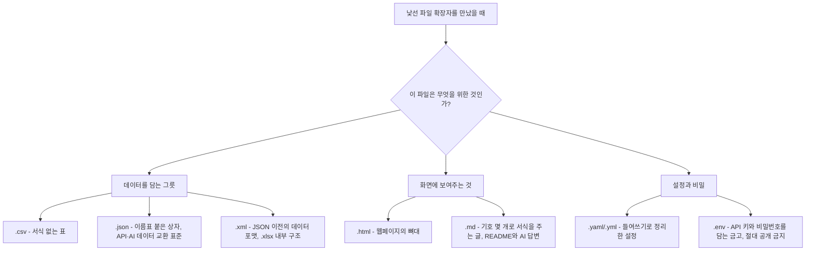

## 이 글이 다루는 원문

> 
> https://www.threads.com/@connie_daddy/post/DaeYI87H_kQ
> 
> 바이브 코딩을 가르치다 보면 사람들이 코드보다 먼저 막히는 곳이 있다. 파일 확장자다. .json, .yaml, .env, .md 같은 낯선 확장자가 쏟아지는 순간 "역시 난 개발자가 아니라서"라며 손을 놓는다.
> 
> 그런데 비개발자가 마주치는 수십 개 포맷은 사실 딱 세 부류로 나뉜다.
> 
> 첫째, 데이터를 담는 그릇. CSV는 엑셀에서 서식만 뺀 표이고, JSON은 이름표를 붙인 상자다. 요즘 앱과 AI가 데이터를 주고받는 건 거의 다 JSON이다. XML은 그 옛날 버전이고, 엑셀 파일도 뜯어보면 안은 XML로 되어 있다.
> 
> 둘째, 보여주는 것. HTML은 웹페이지의 뼈대이고, 마크다운(.md)은 이나 - 같은 기호 몇 개로 서식을 주는 글이다. README도, AI 챗봇의 답변도 대부분 마크다운이다.
> 
> 셋째, 설정과 비밀. YAML은 들여쓰기로 정리한 설정이고, .env는 API 키와 비밀번호를 담는 금고다. .env만큼은 절대 공개 저장소에 올리면 안 된다. 열쇠를 통째로 내주는 사고가 된다.
> 
> 확장자를 다 외울 필요는 없다. "이건 데이터냐, 화면이냐, 설정이냐." 이 셋 중 무엇인지 감만 잡으면 진입 장벽의 절반은 사라진다. 낯선 파일이 무섭지 않아지는 순간, 바이브 코딩은 그때부터 진짜 시작된다
> 

Threads 계정 `@connie_daddy`가 올린 게시글을 바탕으로 정리한 내용이다. 원문은 Threads의 로봇 접근 차단 정책 때문에 직접 열람이 불가능했고, 검색으로도 해당 게시글 원문 자체는 별도로 확인되지 않았다. 따라서 이 문서는 사용자가 전달한 게시글 원문 텍스트를 그대로 분석 대상으로 삼았으며, 그 안에 담긴 기술적 주장(JSON, YAML, CSV, XML, 마크다운, .env의 특성)은 별도로 검색을 통해 사실관계를 재확인했다. 확인 결과 게시글이 설명하는 기술적 내용은 모두 실제 사실과 부합했다.

---

## 게시글의 문제의식: 코드보다 먼저 막히는 지점

글쓴이는 바이브 코딩(Vibe Coding, AI에게 대부분의 코드를 맡기고 사람은 방향성과 설계에 집중하는 개발 방식)을 가르치는 입장에서 반복적으로 목격한 현상을 지적한다. 초보자들이 실제로 막히는 지점은 복잡한 로직이나 알고리즘이 아니라, 그보다 훨씬 앞단에 있는 **파일 확장자**라는 것이다. `.json`, `.yaml`, `.env`, `.md` 같은 낯선 확장자가 화면에 쏟아지는 순간, 많은 사람이 "역시 나는 개발자가 아니라서 안 되는구나"라며 포기해 버린다는 것이 글의 출발점이다.

글쓴이는 이 좌절이 불필요하다고 말한다. 비개발자가 실제로 마주치는 수십 개의 파일 포맷은 겉보기와 달리 딱 세 부류로 나뉘기 때문이다. 확장자 하나하나를 암기하는 대신 "이게 데이터인지, 화면인지, 설정인지"라는 감각만 잡으면 진입 장벽의 절반이 사라진다는 것이 핵심 메시지다.

---

## 세 부류로 나눈 파일 확장자

### 첫째, 데이터를 담는 그릇 — CSV, JSON, XML

이 부류는 순수하게 정보 자체를 담아 옮기기 위한 포맷이다.

**CSV**는 쉼표로 값을 구분한 표 형태의 텍스트 파일로, 흔히 "엑셀에서 서식만 빼낸 표"로 비유된다. 실제로 셀 배경색이나 글꼴 같은 꾸밈 정보 없이 순수한 값들만 콤마로 나열되어 있어, 어떤 프로그램이든 쉽게 읽고 쓸 수 있다는 것이 특징이다.

**JSON**(JavaScript Object Notation)은 `{"이름": "값"}` 형태로 이름표(키)와 값을 짝지어 담는 포맷이다. 글에서는 이를 "이름표를 붙인 상자"에 비유했는데, 실제로 웹 API와 AI 서비스 대부분이 데이터를 주고받을 때 JSON을 표준으로 쓰고 있어 이 비유는 현재의 개발 생태계를 정확히 반영한다. Anthropic API를 포함해 대부분의 AI 모델 API가 요청과 응답을 JSON 형식으로 주고받는 것이 대표적인 예다.

**XML**은 JSON보다 앞서 널리 쓰였던 데이터 포맷으로, `<태그>내용</태그>` 형태로 값을 감싸는 방식이다. 글쓴이는 "그 옛날 버전"이라고 표현했는데, 이는 대체로 맞는 설명이다. JSON이 등장하기 전까지 웹에서 데이터를 교환하는 표준으로 XML이 널리 쓰였고, 지금도 완전히 사라진 것은 아니다. 흥미로운 점은 글에서 언급한 대로 엑셀 파일(.xlsx)을 압축 해제해서 열어보면 내부 구조가 실제로 XML 기반이라는 사실이다. `.xlsx`는 Office Open XML이라는 표준을 따르는 압축 파일이며, 그 안에는 시트 데이터, 서식, 스타일 정보가 여러 개의 XML 문서로 나뉘어 저장되어 있다. 겉으로는 하나의 엑셀 파일처럼 보이지만 속을 뜯어보면 XML 문서 묶음이라는 설명은 기술적으로 정확하다.

### 둘째, 보여주는 것 — HTML, 마크다운

이 부류는 사람이 눈으로 읽거나 화면에 표시하기 위한 포맷이다.

**HTML**은 웹페이지의 구조, 즉 뼈대를 이루는 언어다. 제목, 문단, 버튼, 이미지가 들어갈 자리를 정의하고, 여기에 CSS로 디자인을 입히고 JavaScript로 동작을 붙이는 것이 일반적인 웹 개발의 구조다.

**마크다운**(.md)은 `#`이나 `-` 같은 기호 몇 개만으로 제목, 목록, 강조 같은 서식을 표현하는 경량 문서 포맷이다. HTML보다 훨씬 단순한 문법으로 읽기 쉬운 글을 만들 수 있다는 것이 특징이며, 실제로 GitHub 저장소의 README 파일 대부분이 마크다운으로 작성되고, AI 챗봇의 답변 역시 대체로 마크다운 문법을 기반으로 서식을 표현한다. 이 설명 역시 현재의 개발·AI 생태계 관행과 정확히 일치한다.

### 셋째, 설정과 비밀 — YAML, .env

이 부류는 프로그램이 어떻게 동작해야 하는지 정의하거나, 외부에 노출되면 안 되는 민감한 값을 담는 포맷이다.

**YAML**(확장자는 `.yaml` 또는 `.yml`)은 들여쓰기로 계층 구조를 표현하는 설정 파일 포맷이다. 중괄호나 따옴표를 많이 쓰는 JSON과 달리 들여쓰기와 하이픈만으로 구조를 나타내기 때문에 사람이 손으로 작성하고 읽기에 더 편하다는 평가를 받는다. 실제로 YAML은 JSON과 구조적으로 호환성이 높아서, 일반적인 JSON 문서는 확장자만 바꿔도 유효한 YAML 문서로 인식되는 경우가 많다. Kubernetes 설정 파일이나 CI/CD 파이프라인 정의, Docker Compose 파일 등에서 YAML이 널리 쓰이는 이유가 여기에 있다.

**.env** 파일은 API 키, 데이터베이스 비밀번호, 인증 토큰 같은 민감한 값을 담는 파일이다. 글쓴이는 이를 "금고"에 비유했는데, 이 비유는 실무 감각을 정확히 반영한다. `.env` 파일이 실수로 GitHub 같은 공개 저장소에 올라가면, 그 안에 담긴 API 키나 비밀번호가 그대로 노출되어 제3자가 이를 도용해 비용을 발생시키거나 시스템에 무단 접근하는 사고로 이어질 수 있다. 그래서 `.env` 파일은 `.gitignore`에 등록해 버전 관리 시스템에서 아예 제외하는 것이 개발 현장의 기본 상식으로 자리 잡고 있으며, 글에서 강조한 "절대 공개 저장소에 올리면 안 된다"는 경고는 과장이 아니라 실제로 지켜야 할 원칙이다.

---

## 세 가지 분류를 한눈에 보기

---

## 확장자별 비교표

| 분류 | 확장자 | 핵심 역할 | 대표 사용처 |
|---|---|---|---|
| 데이터 | .csv | 서식 없는 순수 표 데이터 | 엑셀 대체용 표, 데이터 내보내기 |
| 데이터 | .json | 이름표(키)-값 구조의 데이터 | 웹 API, AI 모델과의 데이터 교환 |
| 데이터 | .xml | 태그로 값을 감싸는 구조화 데이터 | 구형 데이터 교환, .xlsx 내부 구조 |
| 화면 | .html | 웹페이지의 구조(뼈대) | 웹사이트 |
| 화면 | .md | 기호 기반의 경량 서식 문서 | README, AI 챗봇 답변, 블로그 원고 |
| 설정·비밀 | .yaml / .yml | 들여쓰기 기반 설정 정의 | Kubernetes, CI/CD, Docker Compose |
| 설정·비밀 | .env | API 키·비밀번호 등 민감 정보 저장 | 환경 변수, 인증 정보 관리 |

---

## 댓글에서 이어진 반응

이 게시글에는 "jenova ai"를 언급하며 공감하는 댓글이 달렸다. 댓글 작성자는 이 설명 방식이 정확히 비개발자들이 확장자에서 막히는 지점을 짚었다고 평가하면서, 자신이 관여하고 있는 jenova ai에도 이런 식으로 막막한 문제를 구조부터 풀어주는 접근이 잘 맞아떨어진다고 언급했다. 특히 AI 초보자를 대상으로 하는 AI가 "이게 데이터인지, 화면인지, 설정인지" 감을 잡도록 도와주는 방식이 실제로 도움이 된다는 취지의 반응이었다. 다만 jenova ai 자체에 대한 구체적인 정보(서비스 형태, 제공 주체 등)는 이번 검색 과정에서 별도로 확인되지 않아, 댓글에 담긴 내용 이상으로 확장해 설명하지는 않는다.

---

## 이 게시글이 바이브 코딩 초보자에게 주는 시사점

바이브 코딩은 AI가 코드의 상당 부분을 생성해 주는 방식이기 때문에, 사람이 굳이 문법을 외우지 않아도 프로젝트를 진행할 수 있다는 인상을 준다. 그런데 실제로 프로젝트를 진행하다 보면 설정 파일을 확인하거나, API 키를 넣거나, AI가 만들어 준 데이터 구조를 눈으로 확인해야 하는 순간이 반드시 온다. 이때 파일 확장자 자체가 낯설어서 접근을 포기해 버리면, AI의 도움을 받고도 프로젝트를 완성하지 못하는 상황이 생긴다.

글쓴이가 제안하는 해법은 확장자를 통째로 암기하는 대신 세 가지 질문으로 압축하는 것이다. "이 파일이 데이터를 담고 있는가, 화면에 보여줄 내용인가, 아니면 설정이나 비밀 정보인가." 이 감각만 있으면 처음 보는 확장자를 만나도 당황하지 않고 대략적인 성격을 짐작할 수 있고, 이것이 바이브 코딩을 실제로 끝까지 완주하는 데 필요한 최소한의 지도 역할을 한다는 것이 이 글의 결론이다.

---

## 검증 노트

- 원문 게시글: Threads, 계정 `@connie_daddy` (직접 열람 불가로 사용자 제공 텍스트를 원문으로 사용)
- CSV, JSON, XML의 데이터 포맷 특성 및 .xlsx 내부가 XML 구조라는 설명: 일반적으로 통용되는 파일 포맷 사양과 일치함을 확인
- YAML과 JSON의 구조적 호환성: 나무위키 YAML 문서 등 공개 자료로 교차 확인
- .env 파일의 보안 취급 원칙(공개 저장소 업로드 금지): 개발 업계의 표준 관행과 일치함을 확인
- jenova ai에 대한 별도 정보는 이번 검색으로 확인되지 않아, 댓글 내용 이상으로 서술하지 않았음

---

작성일: 2026년 7월 7일
