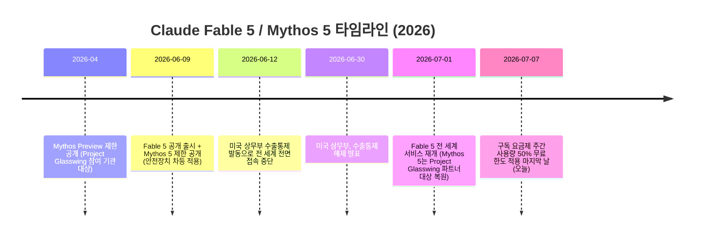
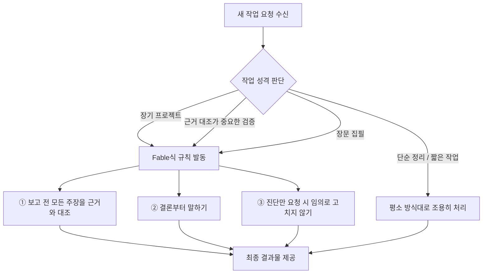

> 원본: Facebook 게시물 (`https://www.facebook.com/share/p/1HHNagzPKD/`)
> 이 문서는 원문의 아이디어를 재구성·해설하면서, 그 배경이 되는 Claude Fable 5의 사실관계를 2026년 7월 7일 기준으로 검증한 참고자료입니다. Facebook 게시물 자체는 플랫폼 특성상 외부 자동 접근이 차단되어 있어, 본문은 이용자가 제공한 원문 텍스트를 기준으로 재구성했습니다.

> 
> [신모델 Fable의 심장만 이식해봤습니다]
> 
> Fable 5가 나왔다고 다들 들썩이던데, 저는 조금 다른 각도로 접근해봤습니다 
> 
> 제 생각은 이랬어요. "신모델로 통째로 갈아타기보다, 그 핵심만 뽑아서 제 작업 환경에 이식(implant)해보면 어떨까?"
> 
> 제 일의 대부분은 코딩이 아니라 자료 정리입니다. 판례 검증, 컬럼 집필, 방대한 법률 지식 베이스 정리 같은 일들이죠. Fable의 강력한 자율 실행력이 통째로 필요한 건 아니더라고요. 정작 제게 필요한 건 그 안에 담긴 운영 원칙이지, 화려한 홍보 문구가 아니었습니다.
> 
> 그래서 Fable 자료를 두 층으로 나눠봤습니다. "5천만 줄을 하루에" 같은 검증되지 않은 과장은 걷어내고, 진짜 알맹이인 프롬프트 제어 원칙만 골라냈어요. 그리고 그걸 제 AI 작업 설정(CLAUDE.md)에 심었습니다.
> 
> 이식의 핵심은 "조건부 발동" 입니다. 평소엔 조용히 있다가, 작업 성격을 스스로 판단해서 — 장기 프로젝트인지, 근거 대조가 중요한 검증인지, 장문 집필인지 — 무거운 일일 때만 Fable식 규칙이 켜지도록 했어요. 단순 정리에는 개입하지 않고요.
> 
> 이식한 태도는 세 가지입니다.
> 1. 보고하기 전에 모든 주장을 실제 근거와 대조하기 (법률은 법령 DB 교차검증 필수)
> 2. 결론부터 말하기
> 3. 진단만 부탁한 경우엔 함부로 고치지 않기
> 
> 남의 엔진을 통째로 부러워하기보다, 그 핵심만 제 방식에 맞게 옮겨 심어본 셈입니다. 모델은 계속 바뀌어도, 잘 이식해둔 원칙은 남으니까요.
> 
> 작지만 제법 의미 있는 작업이었던 것 같아 뿌듯합니다.
> 

---

## 이 문서를 읽기 전에 — 핵심 요약 한 문단

이 게시물의 저자는 2026년 6월 9일 출시된 Anthropic의 최상위 모델 **Claude Fable 5**를 통째로 업무 환경에 도입하지 않았습니다. 대신 저자는 "모델 자체"가 아니라 "그 모델이 일하는 방식(운영 원칙)"만 뽑아내어, 자신이 이미 쓰고 있는 **Claude Code의 CLAUDE.md 설정 파일**에 옮겨 심었습니다. 그리고 이 원칙이 항상 작동하는 게 아니라, 작업의 성격(장기 프로젝트·근거 대조가 중요한 검증·장문 집필 등 "무거운 작업")을 스스로 판단해서 필요할 때만 조건부로 발동하도록 설계했다는 것이 이 글의 핵심입니다. 이식된 세 가지 원칙은 ① 보고 전 근거 대조, ② 결론 우선 서술, ③ 진단만 요청받았을 때는 임의로 고치지 않기입니다.

아래에서는 이 아이디어를 이해하는 데 필요한 배경지식(Fable 5가 정확히 무엇이고 왜 화제였는지), 게시물이 말하는 "이식" 전략의 작동 원리, 그리고 게시물 속 한 가지 수치 주장에 대한 사실관계 검증을 순서대로 다룹니다.

---

## 1부. 왜 다들 "Fable 5"에 들썩였나 — 정확한 배경 정리

### 1.1 Fable 5는 무엇인가

Claude Fable 5는 Anthropic이 처음으로 일반 대중에게 공개한 **"Mythos 등급(Mythos-class)"** 모델입니다. Mythos 등급이란 기존 최상위 모델이었던 Opus 등급보다 한 단계 위에 있는 새로운 분류로, Anthropic은 2026년 4월 소수의 사이버보안 방어 기관에게만 "Mythos Preview"라는 이름으로 제한 공개한 바 있습니다. 이후 6월 9일, 이 기술을 일반 사용자도 쓸 수 있도록 안전장치를 덧씌운 버전이 **Fable 5**라는 이름으로, 안전장치를 일부 해제한 더 강력한 버전이 **Mythos 5**라는 이름으로 동시에 출시되었습니다. 두 모델은 근본적으로 동일한 모델이며, 차이는 어떤 안전 필터가 얼마나 적용되었는지에 있습니다.

Anthropic의 발표에 따르면 Fable 5는 소프트웨어 엔지니어링, 지식노동, 시각 인식, 과학 연구 등 거의 모든 벤치마크에서 이전까지 공개된 어떤 모델보다 뛰어난 성능을 보였고, 특히 작업이 길고 복잡할수록 다른 모델과의 격차가 커지는 것이 특징으로 소개되었습니다. Fable 5는 사이버보안·생물학·화학처럼 오남용 위험이 큰 영역의 질문에 대해서는 자동으로 이전 최상위 모델인 Opus 4.8의 답변으로 전환되는 안전장치를 갖추고 있으며, 이런 전환이 발생하는 비율은 전체 세션의 약 5% 미만으로 알려져 있습니다. 가격은 입력 토큰 기준 100만 토큰당 10달러, 출력 토큰 기준 100만 토큰당 50달러로, 이전 Mythos Preview 가격의 절반 이하 수준입니다.

### 1.2 출시부터 오늘까지 — 롤러코스터 같았던 한 달

이 모델은 출시 직후 극적인 사건을 겪었습니다. 아래는 확인된 시점을 기준으로 정리한 타임라인입니다.

이 중단 사태의 발단은 Amazon 소속 보안 연구원들이 Fable 5의 안전장치를 우회해, 모델이 특정 소프트웨어 취약점을 식별하고 그중 하나에 대해서는 실제로 악용 가능한 코드까지 생성하도록 만든 사례를 발견해 이를 미국 정부에 보고한 데 있습니다. 이 보고를 근거로 미국 정부는 6월 12일 자로 Fable 5와 Mythos 5에 대해 외국 국적자의 접근을 제한하는 수출통제 지침을 즉시 발효시켰고, Anthropic은 실시간으로 사용자의 국적을 검증할 방법이 없었기 때문에 아예 전 세계 모든 사용자에 대한 접근을 일시 중단하는 방식을 택했습니다.

이후 Anthropic은 미국 정부 및 Amazon과 함께 해당 사례를 검증했고, 그 결과 문제가 된 우회 기법은 Fable 5만의 고유한 취약점이 아니라 Claude Opus 4.8, GPT-5.5, Kimi K2.7을 포함한 여러 경쟁 모델에서도 동일하게 재현 가능했다는 점을 확인했다고 밝혔습니다. Anthropic은 해당 우회 패턴을 99% 이상 차단하는 새로운 안전 분류기(classifier)를 개발해 적용했고, 미국 상무부는 6월 30일 수출통제를 해제했습니다. 이에 따라 Fable 5는 7월 1일부터 Claude Platform, Claude.ai, Claude Code, Claude Cowork 전반에 걸쳐 전 세계 사용자에게 다시 제공되고 있으며, 이는 오늘(7월 7일) 기준으로도 유지되고 있는 상태입니다. 다만 Pro·Max·Team 등 구독제 요금제에서 Fable 5 사용량을 주간 한도의 최대 50%까지 무료로 포함해주는 조치는 7월 7일, 즉 오늘까지만 적용되고 이후에는 별도 사용 크레딧 방식으로 전환될 예정입니다.

### 1.3 Fable 5 핵심 스펙 한눈에 보기

| 항목 | 내용 |
|---|---|
| 분류 | Mythos 등급 (Opus 등급보다 상위 분류, 최초의 대중 공개 버전) |
| 출시일 | 2026년 6월 9일 |
| 가격 | 입력 100만 토큰당 $10 / 출력 100만 토큰당 $50 |
| 안전장치 | 사이버보안·생물학·화학 등 고위험 질의는 Opus 4.8로 자동 전환 (전체 세션의 약 5% 미만) |
| 대표 사례 | Stripe가 5천만 줄 규모 Ruby 코드베이스 전체 마이그레이션을 하루 만에 완료 (수작업 시 팀 단위로 2개월 이상 소요 예상) |
| 자매 모델 | Mythos 5 (동일 모델, 안전장치 일부 해제, Project Glasswing 파트너 등 소수에게만 제공) |
| 현재 상태(7월 7일 기준) | 수출통제 해제 후 전 세계 서비스 재개 상태 |

---

## 2부. 게시물의 핵심 아이디어 — "모델 전체가 아니라 원칙만 이식한다"

### 2.1 저자의 문제의식

저자는 자신의 업무가 코딩이 아니라 **판례 검증, 컬럼 집필, 방대한 법률 지식 베이스 정리**와 같은 자료 정리 중심 작업이라는 점을 분명히 합니다. 앞서 살펴본 것처럼 Fable 5는 장시간 자율 실행(수 시간~수일간 사람 개입 없이 작업을 이어가는 능력)과 대규모 코드 마이그레이션 같은 영역에서 강점을 보이는 모델입니다. 그런데 저자의 업무는 이런 "긴 자율 실행력" 자체가 핵심 병목이 아니라는 것이 저자의 판단입니다. 오히려 저자가 눈여겨본 것은 Fable 5의 발표 자료와 활용 사례 속에 드러난 **"어떻게 일해야 하는가"에 대한 운영 원칙**이었고, 화려한 성능 지표나 마케팅 문구는 자신의 작업에는 크게 의미가 없다고 본 것입니다.

이 문제의식은 실제로 최근 AI 업계에서 자주 언급되는 개념과 맞닿아 있습니다. 모델 자체를 교체하는 것과, 특정 모델이 보여준 행동 패턴이나 프롬프트 규율을 다른 환경에 이식하는 것은 별개의 선택지이며, 후자는 특히 CLAUDE.md처럼 텍스트 기반 설정 파일을 쓰는 도구에서 상대적으로 쉽게 실현할 수 있습니다.

### 2.2 CLAUDE.md — 이식이 이루어지는 실제 장소

저자가 원칙을 "심었다"고 표현한 대상인 CLAUDE.md는 Claude Code가 세션을 시작할 때마다 자동으로 읽어 들이는 마크다운 형식의 설정 파일입니다. Anthropic 공식 문서에 따르면 Claude Code는 두 가지 상호보완적인 기억 체계를 갖고 있는데, 하나는 사람이 직접 작성해서 프로젝트나 개인 작업 방식에 대한 지속적인 맥락을 부여하는 CLAUDE.md 파일이고, 다른 하나는 Claude가 스스로 사용자의 교정 내용이나 선호를 학습해 기록해 나가는 "오토 메모리(auto memory)" 기능입니다. 이 두 체계는 매 대화 시작 시 함께 로드되며, Anthropic은 이를 강제로 적용되는 설정값이 아니라 참고할 맥락으로 다룬다고 설명합니다.

CLAUDE.md는 프로젝트 전체가 공유하는 규칙, 팀 차원의 컨벤션, 그리고 개인 차원의 작업 습관까지 계층적으로 나누어 작성할 수 있고, 일반적으로는 매 세션마다 반드시 지켜야 할 사실—빌드 명령어, 코딩 컨벤션, "항상 이렇게 하라"는 규칙—만 간결하게 담아두는 것이 권장됩니다. 저자가 이 글에서 하고 있는 작업은 정확히 이 원리를 활용한 것입니다. Fable 5라는 모델 자체를 가져오는 대신, Fable 5가 보여준 신뢰할 만한 작업 방식을 문장으로 정제해 자신의 CLAUDE.md 안에 "항상 지킬 규칙"으로 기록해 둔 것입니다.

### 2.3 "조건부 발동" — 이식의 진짜 핵심

저자가 특히 강조하는 부분은 이 원칙들이 **항상 켜져 있지 않다**는 점입니다. 평소 단순한 정리 작업에는 개입하지 않다가, 작업의 성격을 스스로 판단해 아래와 같은 조건에 해당할 때만 규칙이 발동하도록 설계했다고 합니다.

- 장기 프로젝트인가
- 근거 대조가 중요한 검증 작업인가 (예: 법률 판례 확인)
- 장문 집필 작업인가

이 설계는 CLAUDE.md 운용에서 실제로 자주 언급되는 원칙과도 일치합니다. 파일에 너무 많은 규칙을 무조건 걸어두면 오히려 짧고 단순한 작업까지 불필요하게 무거워지고, 지침이 서로 충돌하거나 장황해질 위험이 커지기 때문에, 조건을 걸어 필요한 순간에만 규칙이 개입하도록 하는 것이 실무에서 권장되는 방식입니다. 아래는 저자가 설명한 조건부 발동 로직을 도식화한 것입니다.

### 2.4 이식된 세 가지 원칙 상세 해설

**① 보고하기 전에 모든 주장을 실제 근거와 대조하기 (법률은 법령 DB 교차검증 필수)**
이 원칙은 결과물을 내놓기 전에 "그럴듯하게 들리는 문장"과 "실제로 확인된 사실"을 구분하라는 규율입니다. 특히 법률 정보를 다루는 저자의 업무 특성상, 판례나 법령을 인용할 때는 실제 법령 데이터베이스와 대조하지 않은 내용을 그대로 내보내지 않도록 명시한 것으로 보입니다. 이는 이 글의 저자가 평소에도 강조해 온 "정확성 우선" 원칙—구어체·근사치 요약이 아니라 검증된 수치를 쓰고, 불일치가 있으면 명시적으로 표시한다는 원칙—과도 결이 같습니다.

**② 결론부터 말하기**
장문의 배경 설명을 먼저 늘어놓지 않고, 결론이나 판단을 앞세운 뒤 근거를 뒤따라 붙이는 서술 방식입니다. 법률 자문이나 컬럼처럼 독자가 바쁘게 핵심을 확인해야 하는 글쓰기에서 특히 유용한 규율입니다.

**③ 진단만 부탁한 경우엔 함부로 고치지 않기**
사용자가 "이 부분이 왜 문제인지 봐 달라"고 요청했을 뿐인데, AI가 그걸 넘어서 마음대로 내용을 수정해버리는 것을 막는 원칙입니다. 이는 코드 작업에서도 자주 강조되는 원칙과 동일한 맥락으로, 진단(diagnosis)과 수정(fix)은 서로 다른 요청이며 사용자가 명시적으로 요청한 범위를 넘어서는 안 된다는 규율입니다.

### 2.5 왜 "이식"이라는 비유가 적절한가

저자는 이 접근을 "엔진을 통째로 부러워하기보다 심장만 옮겨 심었다"고 표현합니다. 이 비유가 실질적으로 의미하는 바는, 모델(엔진) 자체는 몇 달 뒤 또 다른 신모델로 대체되겠지만, 그 모델이 보여준 좋은 작업 습관(심장, 즉 운영 원칙)은 텍스트 형태의 설정 파일 안에 남아 계속 작동할 수 있다는 것입니다. 모델은 계속 바뀌어도 잘 정제된 원칙은 도구가 바뀌어도 이식 가능한 자산으로 남는다는 것이 이 글의 결론입니다.

---

## 3부. 사실관계 검증 — 게시물 속 한 가지 주장 바로잡기

이용자가 요청한 "막연한 추측이나 거짓말이 없어야 한다"는 원칙에 따라, 게시물에 등장하는 구체적 수치 주장 하나를 검증했습니다.

> 게시물 원문: "그래서 Fable 자료를 두 층으로 나눠봤습니다. '5천만 줄을 하루에' 같은 검증되지 않은 과장은 걷어내고, 진짜 알맹이인 프롬프트 제어 원칙만 골라냈어요."

저자는 이 "5천만 줄을 하루에" 처리했다는 수치를 **검증되지 않은 과장**으로 분류하고 제외했다고 밝히고 있습니다. 그러나 확인 결과, 이 수치는 근거 없는 소문이 아니라 **Anthropic의 6월 9일 공식 Fable 5 출시 발표문에 실제로 포함된 내용**입니다. 발표문에는 결제 서비스 기업 Stripe가 초기 테스트 과정에서 5천만 줄 규모의 Ruby 코드베이스 전체에 걸친 마이그레이션 작업을 Fable 5로 하루 만에 완료했으며, 이는 수작업으로 진행했다면 팀 단위로 2개월 이상 걸렸을 작업이라고 명시되어 있습니다. 이 내용은 Anthropic 공식 발표문뿐 아니라 VentureBeat, TechCrunch 등 복수의 독립 매체에서도 동일하게 인용·보도되었습니다.

다만 몇 가지 유의할 점은 있습니다.

- 이 수치는 **Anthropic이 자사 발표문에 공개한 고객사(Stripe)의 사례**이며, 독립적인 제3자 기관이 별도로 재현·검증한 벤치마크 수치는 아닙니다. 즉 "출처가 불분명한 과장"은 아니지만, "기업의 자체 발표 자료에 담긴 성공 사례"라는 성격은 분명히 있습니다.
- Anthropic은 이 마이그레이션이 정확히 어떤 종류의 작업(예: 루비 버전 업그레이드, 특정 API 제거 등)이었는지는 구체적으로 공개하지 않았습니다.
- 업계 분석가들 사이에서는 "5천만 줄"이라는 규모 자체가 Stripe 특유의 사례이며, 대다수 일반 기업의 코드베이스는 이보다 훨씬 작다는 점, 그리고 이런 결과는 테스트 커버리지가 뛰어난 특수한 환경에서 나온 최선의 사례로 받아들여야 한다는 지적도 함께 나오고 있습니다.

**정리하면:** 이 특정 수치는 저자가 분류한 것처럼 "출처 불명의 과장된 소문"이 아니라, Anthropic이 공식적으로 발표하고 여러 매체가 검증·보도한 사실에 가깝습니다. 다만 이는 기업의 자체 홍보성 사례 발표라는 한계는 있으므로, "완전히 검증된 독립 벤치마크"와 "기업이 공개한 고객 성공 사례"를 구분해서 이해하는 것이 정확합니다. 저자의 전체적인 접근 방식—과장된 마케팅 수사와 실제로 쓸모 있는 운영 원칙을 구분해서 걸러낸다는 태도—자체는 매우 합리적이지만, 이번 사례에서 걸러낸 구체적 항목 하나는 실제로는 걸러낼 필요가 없었던 항목이었다는 점을 짚어둘 필요가 있습니다.

---

## 4부. 강의·실무 활용을 위한 시사점

### 4.1 이 사례가 보여주는 더 큰 흐름

이 게시물은 결국 "신모델이 나올 때마다 무조건 갈아타야 하는가?"라는 질문에 대한 하나의 대안적 답을 보여줍니다. 최근 AI 업계의 흐름은 대화형 AI에서 자율적으로 오래 일하는 에이전트형 AI로 옮겨가고 있으며, Fable 5처럼 장시간 자율 실행을 극대화한 모델이 계속 등장하고 있습니다. 그러나 모든 사용자의 업무가 "장시간 자율 실행"을 필요로 하는 것은 아니며, 이 게시물의 저자처럼 정밀한 근거 대조와 신중한 서술이 더 중요한 업무 환경에서는 모델 교체보다 **운영 원칙의 이식**이 더 실용적인 선택일 수 있습니다.

### 4.2 청중에게 던질 수 있는 토론 질문

- 여러분의 업무에서 "장시간 자율 실행력"이 정말 핵심 병목인가, 아니면 "판단의 정확성과 신중함"이 더 중요한가?
- 신모델의 발표 자료를 볼 때, 어떤 내용이 "검증된 사실"이고 어떤 내용이 "홍보용 사례"인지 구분하는 자신만의 기준이 있는가?
- CLAUDE.md 같은 설정 파일에 "조건부 발동" 규칙을 걸어본 경험이 있는가? 어떤 조건에서 규칙이 켜지고 꺼지도록 설계했는가?

### 4.3 실무 체크리스트

- [ ] 신모델 발표를 접했을 때, 모델 자체를 도입할지 / 그 안의 원칙만 흡수할지를 먼저 구분해서 판단한다
- [ ] 발표 자료 속 인상적인 수치가 "독립 검증된 벤치마크"인지 "기업 자체 발표 사례"인지 구분한다
- [ ] CLAUDE.md에 규칙을 추가할 때는 "항상 켜둘 규칙"과 "특정 조건에서만 켤 규칙"을 분리해서 설계한다
- [ ] 근거 대조, 결론 우선, 요청 범위 준수와 같은 규율은 모델이 바뀌어도 재사용 가능한 자산으로 문서화해 둔다

---

## 용어 정리

| 용어 | 설명 |
|---|---|
| Mythos 등급 (Mythos-class) | Anthropic이 Opus 등급보다 상위로 분류한 새로운 모델 계열. 2026년 4월 Mythos Preview로 처음 제한 공개됨 |
| Fable 5 | Mythos 등급 모델 중 안전장치를 적용해 일반 대중에게 공개한 버전 |
| Mythos 5 | Fable 5와 동일한 기반 모델이나 일부 안전장치를 해제한 버전. Project Glasswing 등 소수 신뢰 기관에만 제공 |
| Project Glasswing | Anthropic이 미국 정부 및 주요 기업들과 협력해 Mythos 계열 모델을 사이버 방어에 활용하는 프로그램 |
| CLAUDE.md | Claude Code가 세션 시작 시 자동으로 읽어 들이는, 사람이 직접 작성하는 지속적 지침 파일 |
| 오토 메모리 (Auto memory) | Claude가 사용자의 교정과 선호를 스스로 학습해 기록하는 기억 체계. CLAUDE.md와 상호보완적으로 작동 |
| 조건부 발동 | 특정 규칙이나 지침이 항상 적용되는 것이 아니라, 작업의 성격을 판단해 필요한 경우에만 활성화되도록 설계하는 방식 |
| 하네스 (harness) | 에이전트형 AI가 실제 작업 환경에서 도구를 호출하고 상태를 관리하며 오래 일할 수 있도록 감싸는 실행 틀 |

---

## 참고 자료

- Anthropic, "Claude Fable 5 and Claude Mythos 5" (2026.06.09) — https://www.anthropic.com/news/claude-fable-5-mythos-5
- Anthropic, "Redeploying Claude Fable 5" (2026.06.30) — https://www.anthropic.com/news/redeploying-fable-5
- TechCrunch, "Anthropic's Claude Fable 5 is a version of Mythos the public can access today" — https://techcrunch.com/2026/06/09/anthropic-released-claude-fable-5-its-most-powerful-model-publicly-days-after-warning-ai-is-getting-too-dangerous/
- VentureBeat, "Anthropic brings Mythos to the masses with Claude Fable 5" — https://venturebeat.com/technology/anthropic-brings-mythos-to-the-masses-with-claude-fable-5-its-most-powerful-generally-available-model-ever
- MacRumors, "Anthropic's Claude Fable 5 Available Again After U.S. Lifts Export Controls" (2026.07.01) — https://www.macrumors.com/2026/07/01/anthropic-fable-5-relaunch/
- Yahoo Finance / Yahoo Tech, "Anthropic finally brings back Claude Fable 5" — https://tech.yahoo.com/ai/claude/articles/anthropic-finally-brings-back-claude-045118890.html
- MobiHealthNews, "Anthropic debuts Claude Science, renews access to Fable 5, Mythos 5" — https://www.mobihealthnews.com/news/anthropic-debuts-claude-science-renews-access-fable-5-mythos-5
- AWS Blog, "Anthropic Claude Fable 5 on AWS" — https://aws.amazon.com/blogs/aws/anthropic-claude-fable-5-on-aws-mythos-class-capabilities-with-built-in-safeguards-now-available/
- Anthropic Claude Code 공식 문서, "How Claude remembers your project" — https://code.claude.com/docs/en/memory

*문서 작성 기준일: 2026년 7월 7일*
