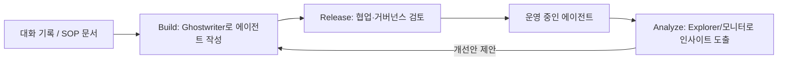
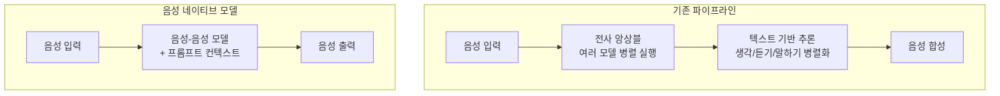

- **원본:** Max Agency 팟캐스트(LangChain 제작), Harrison Chase와 Sierra 최고제품책임자(Head of Product) Zack Reneau-Wedeen의 대담
- **영상:** [**The best AI agents are simpler than you think**](https://www.youtube.com/watch?v=uCKhOmth2ms)
- **공개일:** 2026년 6월 18일

## 들어가며

Sierra는 Fortune 20 기업 대부분에게 고객 대면 에이전트를 공급하는 대화형 AI 플랫폼이다. 흔히 "고객 서비스 챗봇 회사"로 알려져 있지만, 이번 대담에서 Zack Reneau-Wedeen이 밝힌 그림은 훨씬 넓다. Sierra는 브라우징, 예약, 좌석 선택, 일정 변경, 판매, 로열티에 이르기까지 고객 생애주기 전반에 걸쳐 에이전트를 배치하는 것을 목표로 삼고 있으며, 그 근거는 창업 초기부터 있었던 비전이라고 그는 설명한다. 실제로 일부 계약에서는 Sierra 에이전트가 판매 성사에 대해 커미션을 받는 성과 기반 모델까지 운영되고 있다.

이 문서는 팟캐스트에서 다뤄진 핵심 주제들—노코드 에이전트 빌더의 설계 철학, 멀티에이전트 시스템에 대한 회의론, 음성 아키텍처의 병렬 처리 구조, 결제 인프라의 격리 설계, 메모리를 퍼스트클래스 프리미티브로 만드는 방식, 성과 기반 가격 모델—을 정리한 것이다.

---

## 1. 플랫폼 구조: Analyze, Build, Release

Sierra 플랫폼은 세 개의 큰 축으로 나뉜다.

- **Analyze(분석)**: Explorer 에이전트(대화 데이터를 위한 챗GPT 딥리서치 격), 리포트, 그리고 대화 데이터를 상시 평가하는 모니터가 위치한다.
- **Build(구축)**: Ghostwriter(에이전트를 만드는 에이전트, Codex나 Claude Code에 대응), Journeys(에이전트의 소스코드 계층이지만 실제로는 자연어에 가까운 표준운영절차에 더 가깝다), 그리고 여러 변수 설정이 포함된다.
- **Release(배포)**: 협업, 변경 관리, 거버넌스 절차가 이 계층에 속한다. Fortune 20의 상당수를 고객으로 두다 보니, 처음부터 매우 정교한 승인·리뷰 프로세스를 구축할 수밖에 없었다고 한다.

세 단계는 순차적이라기보다 순환적이다. 처음 에이전트를 만들 때는 대화 기록, 표준운영절차 문서, 또는 Ghostwriter와의 대화를 참고해 Build에서 시작하는 경우가 많다. 하지만 에이전트가 실제 운영에 들어간 뒤에는 일상 업무가 Analyze에서 시작된다. 고객만족도나 해결률, 혹은 판매 전환율 같은 지표를 개선할 지점을 찾고, 이를 다시 Build로 가져가 반영하는 흐름이 반복된다. Ghostwriter는 이 지점에서 분석 결과를 보고 개선안을 먼저 제안하기도 하면서 일종의 폐루프(closed loop)를 형성한다.

이 작업을 실제로 수행하는 주체는 엔지니어라기보다 고객 경험을 가장 깊이 이해하는 오퍼레이션 인력, 즉 고객 경험 매니저인 경우가 많다. Sierra의 설계 철학은 "지식을 가장 잘 아는 사람이 플랫폼에서 직접 그 지식을 구현할 수 있어야 한다"는 것이며, 엔지니어링 팀은 별도의 도구·패키지를 통해 플랫폼을 확장하는 역할을 맡는다.

---

## 2. Ghostwriter와 Journeys: 노코드가 실제로 의미하는 것

Ghostwriter는 에이전트를 만들어주는 에이전트다. 그 아래에는 몇 개의 계층이 존재한다.

1. **Agent OS**: 여러 모델로 구성된 하나의 "성좌(constellation)". 하나의 대화 턴에서 10~15개의 서로 다른 모델이 호출될 수 있다. 일부는 최상위 추론이 필요한 프론티어 모델이고, 일부는 특정 작업에 특화된 자체 개발 모델이며, 일부는 저렴하고 빠른 분류기 모델이다.
2. **Agent SDK**: 코드 기반의 에이전트 오케스트레이션·컨텍스트 관리 계층. Sierra가 처음 시작된 지점이다.
3. **Journeys(노코드 계층)**: 지난 18개월 사이 대부분의 에이전트 개발이 이 계층으로 옮겨왔다. Journeys는 Agent SDK 코드로 결정론적이고 동형적(isomorphic)으로 컴파일된다. 즉 코드를 노코드로, 노코드를 다시 코드로 왕복 전환할 수 있다.

여기서 흥미로운 지점은 Journeys가 순수 자연어 텍스트가 아니라는 것이다. Zack은 순수 텍스트 방식을 선택할 경우 두 가지 함정에 빠진다고 설명한다. 하나는 "비결정적으로 컴파일되어" 실험해본 결과 득보다 실이 컸다는 것이고, 다른 하나는 결국 프롬프트 엔지니어링 작업이 되어버려 오퍼레이션 팀이 아니라 엔지니어링 팀의 영역으로 넘어가 버린다는 것이다. Sierra는 의도적으로 오퍼레이션 팀의 영역에 머무르는 쪽을 택했다.

Ghostwriter의 학습 곡선에 대해서는 실제 사례를 든다. "주문 반품을 처리하고 싶다", "항공권 예약을 만들고 싶다", "1차 진료의에서 전문의로 리퍼럴을 처리하고 싶다"라고 말하면 Ghostwriter는 이미 그 개념들을 이해하고 Journeys 전문가로서 작성해준다. 다만 Ghostwriter가 작성하는 것은 코드가 아니라 Journeys 자체이기 때문에, 사용자는 이후에 그 내용을 직접 들여다보고 검토할 수 있다.

### 모델의 습관에 맞출 것인가, 새로운 개념을 가르칠 것인가

이 대목에서 나온 원칙이 인상적이다. Zack은 매 순간 "모델이 이미 익숙한 형태로 문제를 재구성할 것인가" 아니면 "우리의 사고방식이 옳다고 보고 모델에게 새로 가르칠 것인가"라는 갈림길에 선다고 말한다. 그의 경험적 법칙은 "80%는 모델이 이미 잘하는 방식에 맞추고, 나머지 20%만 특별한 경우로 남겨두라"는 것이다. 예컨대 코딩 에이전트가 파일 시스템, Git, GitHub PR에 강하다는 것을 알면, 문제를 그 구조로 최대한 치환해버리는 식이다. 반대로 대안이 없는 경우에만 모델을 새로 학습시키는 투자를 한다.

이 원칙은 Agent SDK 자체를 Ghostwriter가 직접 작성하게 할지 여부에도 적용됐다. 결론은 "그렇게 하지 않는다"였는데, 이유는 Agent SDK가 완전한 노코드도 완전한 코드도 아닌 "중간 지대"에 있어 모델을 오히려 혼란스럽게 할 수 있기 때문이다. Ghostwriter는 대다수 활동이 일어나는 노코드 계층에 집중적으로 최적화되어 있다.

---

## 3. Agent-to-Agent 통신: API가 MCP를 이기는 순간

Sierra 에이전트는 다른 Sierra 에이전트를 호출할 수도 있고, 고객사의 사내 에이전트 플랫폼을 호출할 수도 있다. 예를 들어 문서 생성을 자체적으로 처리하는 사내 장기 실행(long-running) 에이전트가 있다면, Sierra 에이전트는 그쪽에 위임하고 응답을 기다리는 방식으로 연동한다.

에이전트 간 통신에 어떤 프로토콜을 쓰는지에 대한 질문에는 명확한 답이 나온다. **가장 흔한 방식은 그냥 API 호출**이다. 상대가 누구인지 미리 알고 있을 때는 API 호출이 토큰을 절약하고 정확성을 100%에 가깝게 보장할 수 있기 때문이다. 다만 Sierra 에이전트는 MCP와 Agent2Agent 프로토콜도 지원하며, 이를 통해 MCP 클라이언트도 MCP 서버도 될 수 있다. 실제로 챗GPT 앱을 지원하는 방식이 바로 이것이다—Sierra 에이전트의 툴을 챗GPT에 노출시켜, 챗GPT 안에서 해당 에이전트를 호출할 수 있게 하는 구조다. 예로 든 것이 Redfin으로, redfin.com의 AI 검색 뒤편에는 Sierra 에이전트가 매물 목록을 반환하고 대화를 진행하고 있으며, 이 에이전트는 챗GPT 앱으로도 제공되고 있다.

---

## 4. 에이전틱 커머스가 이커머스보다 커질 것이라는 전망

Zack은 "에이전틱 커머스가 이커머스보다 커질 것"이라고 단언한다. 근거는 자신의 행동 변화다—예전에는 웹사이트를 돌아다니며 클릭했지만, 이제는 Codex나 Claude에게 일을 시킨다는 것이다. 구독 관리, 생필품 주문, 저녁 예약 등도 결국 같은 방식으로 처리하게 될 것이라 본다. 브랜드 입장에서는 이런 변화의 반대편에서 준비가 되어 있어야 한다는 것이 Sierra의 결제 투자 논리다.

Sierra는 몇 달 전 **PCI DSS 레벨 1 인증**을 획득했다고 밝혔다. 이는 결제 카드 업계 데이터 보안 표준의 최상위 등급으로, 공인 보안 심사관(QSA)의 심사를 거쳐야 한다. 이 인증 덕분에 Sierra는 별도 플랫폼으로 이동하지 않고도 체크아웃까지 일관된 경험을 제공하는, 사실상 유일한 음성 결제 플랫폼이 되었다고 설명한다.

핵심은 **격리된 인프라**다. 결제 정보는 외부 대형 언어모델로 전달되지 않는데, 이유는 어떤 LLM 제공업체도 그런 방식의 PCI 인증을 받지 않았기 때문이다. 즉 결제 처리는 별도 클러스터에서 이뤄지고, 모든 운영 절차가 보안 심사 기준에 맞춰 조정되어 있다.

에이전틱 커머스가 챗GPT나 Claude 같은 "개인 에이전트"가 브랜드의 에이전트와 대화하는 형태로 이뤄질지, 아니면 사용자가 직접 브랜드의 에이전트를 찾아가는 형태일지에 대해서는 "둘 다"라고 답하면서도, 사람들이 이미 Claude나 챗GPT, Codex에 많은 시간을 쓰고 있다는 점에서 개인 에이전트를 통한 상거래 비중이 클 것이라 예상한다. 다만 에이전트 대 에이전트 상호작용에서도 여전히 Shopify나 Stripe 같은 전문 플랫폼을 이용하듯, 상품을 제대로 제시하고 체크아웃을 쉽게 만드는 전문 플랫폼의 역할이 유효하다고 본다. 차이가 있다면 에이전트의 "주의(attention)"는 사람의 눈길만큼 가치 있지 않다는 점—적어도 아직까지는 그렇다는 단서를 단다.

흥미로운 자기 성찰도 나온다. Zack은 자신조차 아직 Codex로 휴지를 주문하지는 않는다고 인정하면서도, 구독 서비스를 전부 점검하고 안 쓰는 것을 해지해주는 작업만큼은 앱보다 Codex나 Claude Cowork에 맡기는 편이 훨씬 가깝다고 말한다. 브라우저 접근 권한을 주고 "로그인 안 한 스트리밍 앱은 해지하고, 비밀번호가 필요하면 알려줘"라고 지시하는 시나리오에 실제 수요가 있다고 본다.

---

## 5. 병렬 처리와 전사(transcription) 앙상블

Sierra 대화 처리 과정에는 병렬로 돌아가는 요소가 많다. 대표적인 예가 지식 검색이다—질문에 답이 필요한지 판단하기 전에 미리 답을 찾아 두는 방식으로, 분류(classification)와 응답 생성이 동시에 일어나기도 한다. 일종의 투기적 실행(speculative execution)이다.

또 다른 예는 **전사 앙상블(ensembling)** 이다. 음성 인식에서, 예컨대 영국 북부의 억양이 강한 화자를 인식할 때 특정 모델은 정확도가 가장 높지만 침묵 구간에서 환각(hallucination)을 더 많이 일으키는 경향이 있다. Sierra는 두 개 모델을 동시에 돌려서, 한 모델이 "침묵"이라고 판단하면 그 판단을 신뢰하고, 그렇지 않다고 판단하면 다른 모델을 신뢰하는 식으로 조합한다. 이런 병렬화는 특정 제공업체 하나에 전적으로 의존할 경우 필연적으로 마주치게 될 한계를 피하기 위한 것으로, 텍스트 생성에서 Claude·Gemini·GPT 계열 모델을 함께 쓰는 것과 같은 원리가 전사, 음성 합성, 음성-음성 모델 전반에 적용된다.

자체 개발 모델을 만드는 경우도 있다. 지식 검색·재랭킹(reranking)이 대표적인데, 기성 모델의 한계에 부딪혔을 때 자체 모델을 만들지 여부를 판단하고 평가하는 리서치 팀이 별도로 존재한다. 다만 이 판단은 신중하게 이뤄지며, 단지 "만들 수 있어서" 만드는 일은 지양한다고 강조한다.

한 번의 대화 턴에서 호출되는 10~15개 모델의 대략적인 구성비는 "프론티어 모델 몇 개, 굳이 프론티어가 필요 없는 분류기 여러 개, 음성의 경우 저지연을 위한 투기적 실행 몇 개"로 대략 3분의 1씩 나뉜다고 추정하면서도, 실제 추론(reasoning)의 대부분은 프론티어 모델이 담당한다고 덧붙인다.

---

## 6. Agent Data Platform: 구조화 데이터와 실시간 공감의 결합

대형 언어모델은 "그 순간의 공감(in-the-moment empathy)"에 강하다—긴 비행을 마치고 온 고객, 예약에 10분 늦어 교통체증에 갇혀 있던 고객을 알아채고 응대하는 식이다. 다만 그보다 더 깊은 층위, 즉 "이 고객이 진짜로 무엇을 원하는가"는 이전 세대의 추천 시스템이 오히려 더 잘 알고 있는 경우가 많다.

**Agent Data Platform**은 이 두 층위를 결합한다. 고객 데이터 플랫폼이나 사내 시스템과 통합하거나 제로카피 방식으로 연결해, "무엇을 추천해야 하는가"를 아는 구조화 데이터와 "지금 이 순간의 맥락"을 아는 비정형 데이터를 함께 활용해 더 나은 대화와 오케스트레이션을 생성한다. 예컨대 판매 상황에서 어떤 오퍼를 제시할지 아는 구조화 데이터가 있어도, 그것만으로 오퍼를 제시하면 어색하게 느껴질 수 있다. 대형 언어모델은 대화 맥락에 따라 두 오퍼 중 어떤 것을 어떻게 제시할지 자연스럽게 조율할 수 있다. 이런 방식은 판매, 로열티, 리텐션 대화에서 특히 많이 활용된다.

---

## 7. 컨텍스트 엔지니어링: "필요한 모든 것, 그 이상은 아무것도 아닌"

Sierra가 정의하는 컨텍스트 엔지니어링의 핵심 원칙은 "에이전트에게 할 일을 하는 데 필요한 모든 것을 보여주되, 그 이상은 보여주지 않는 것"이다. 다만 모델이 똑똑해질수록 "필요한 모든 것"에 대해서는 좀 더 느슨해도 되고, "그 이상은 아무것도 아닌"에 대해서는 여전히 정밀함이 필요하다고 말한다.

초창기 Agent SDK는 모델에게 정확히 필요한 것만 떠먹여 주는 방식에 가까웠다. 이를 식사에 비유하면, 지금은 "적절한 요리를 내놓는" 정도로 발전했고, 앞으로는 더 느슨한 구조로 갈 수도 있다고 본다.

**점진적 노출(progressive disclosure)** 도 핵심 개념이다. 어떤 정보를 프롬프트에 넣을 때는 그것이 실제로 관련 있어지기 전에 미리 넣지 않아야 하며, 동시에 나중에 그것을 프롬프트에서 빼내면 일관성이 깨질 위험이 있다. 그래서 프롬프트 압축(compaction) 작업을 할 때는 정보 손실이 없도록 신중해야 한다—시스템 프롬프트의 한 부분과 다른 부분이 서로 모순되면 좋은 결과가 나오지 않기 때문이다.

이 대목에서 나온 인상적인 표현이 있다. **"모델이 멍청하다고 생각될 때마다, 사실은 당신의 문제인 경우가 대부분이다."** 그리고 이를 뒤집은 또 다른 표현도 함께 언급된다. **"모델이 너무 멍청하다고 느껴질 때, 사실 그 모델은 너무 똑똑한 것이다."** 즉 문제의 원인이 모델의 능력 부족이 아니라 컨텍스트 설계의 결함인 경우가 많다는 뜻이다.

### 프롬프트 캐싱에 대한 실용적 태도

프롬프트 캐싱을 유지하는 것과 품질을 위해 캐시를 깨는 것 사이의 긴장에 대해서는 명확한 우선순위가 제시된다. 캐싱은 주로 속도와 비용을 위한 것이며, 품질이 항상 먼저라는 것이다. Sierra는 캐시 무효화에 종교적으로 집착하지 않는다. 대화 하나가 100달러짜리 상품이나 1,000달러짜리 평생가치 플랜을 판매할 수도 있는 상황에서는, 비용보다 품질에 집중할 수 있는 여유가 생긴다고 설명한다.

---

## 8. 강화학습(RL): 언제 유용하고 언제 아닌가

Sierra는 RL을 상당히 탐구했다고 밝힌다. RL의 두 가지 큰 약속은 모델 품질의 상한을 높이는 것과, 더 저렴한(오픈 웨이트) 모델로 유사한 성능을 내게 하는 것이다. 실무에서는 후자—오픈 모델을 프론티어 모델 수준으로 끌어올리는 용도—가 더 많이 쓰인다고 본다.

RL을 어렵게 만드는 요인 두 가지가 제시된다.

1. 학습 결과가 비결정적이며, 모델이 원치 않는 데이터를 그대로 재현(regurgitation)할 위험이 있는 데이터는 절대 포함할 수 없다. 이는 협상 불가능한 원칙이다.
2. 프론티어 모델의 발전 속도가 워낙 빨라서, 3~6개월 뒤에 무엇이 참일지를 늘 염두에 둬야 한다. 그런 관점에서 보면 RL 투자는 종종 반올림 오차(rounding error) 수준의 효과에 그친다.

다만 지식 검색처럼 Sierra가 최전선을 스스로 밀고 있는 영역에서는 RL이 의미가 있다고 본다. 흥미로운 지점은, Sierra가 RL을 도입하게 된 계기가 비용보다는 **용량(capacity)** 문제였다는 것이다. 블랙프라이데이·사이버먼데이 같은 트래픽 급증 시기에 대비해 부하 테스트를 진행하는데, 연간으로 환산하면 수십억 건에 달하는 대화량을 감당해야 한다. 이런 동시성 요구는 특정 제공업체의 다운타임에도 견딜 수 있어야 하고, 그때그때 용량이 있는 곳을 쓸 수 있어야 한다는 의미다. 즉 여러 모델 제공업체를 지원하는 이유의 상당 부분은 대규모 트래픽 스파이크에 대비하기 위함이다.

---

## 9. 멀티에이전트 시스템은 대체로 함정이다

이 대담에서 가장 단호한 주장 중 하나가 멀티에이전트 시스템에 대한 회의론이다. Zack은 멀티에이전트 시스템을 원하는 이유를 스스로 점검해봐야 한다고 말한다.

- 한 팀이 한 에이전트를, 다른 팀이 다른 에이전트를 맡기 위해서 멀티에이전트를 원한다면, **그것은 조직도를 그대로 출하(shipping your org chart)하는 것**이다.
- 단지 문제를 이쪽과 저쪽으로 나눠 생각하는 게 편해서 멀티에이전트를 원한다면, 그것 역시 임팩트를 최적화하는 게 아니다.

예로 든 것이 트리아지(triage) 에이전트와 실제 작업(task) 에이전트를 분리하는 경우다. 이렇게 나누면 작업 에이전트는 트리아지 단계의 정보를 잃고, 트리아지 에이전트는 작업 단계의 절차적 정보를 잃는다—이는 대체로 가치를 파괴하는 결과로 이어진다. 서브 에이전트를 하나 띄우더라도, 그 서브 에이전트가 작업에 필요한 모든 것을 갖추고 있는지, 그리고 굳이 메인 에이전트의 일부가 아니어야 할 이유가 있는지를 반드시 확인해야 한다는 것이다.

Zack은 이를 마이크로서비스에 비유한다—사람들이 그 정도의 최적화가 필요한 시점이 되기도 전에, 그리고 최선의 에이전트를 만드는 것과 무관한 이유로 멀티에이전트 시스템에 손을 뻗는 경우가 많다는 것이다. Sierra 에이전트는 대체로 하나의 브랜드를 대표하는 단일 에이전트 형태를 유지한다. 진짜로 분리 가능한 작업—첫 번째 컨텍스트가 두 번째 컨텍스트의 일부일 필요가 전혀 없는 경우—이 아니라면, 그리고 조직적인 어려움을 감수할 만한 특별한 이유가 있는 게 아니라면, 품질을 위해서라면 대체로 더 나은 컨텍스트 엔지니어링으로 해결 가능하다는 것이 그의 결론이다. 그는 스스로를 "모놀리스 지지자(monolith loyalist)"라고 표현한다.

---

## 10. 음성 아키텍처: 지연시간, 자연스러움, 60개 언어

Zack이 커리어에서 가장 즐거웠던 프로젝트로 꼽은 것이 음성이다. Sierra에서 처음 맡은 고객이 SiriusXM(차량 내 스트리밍 라디오 서비스)이었는데, 채팅보다도 전화를 통한 접점이 훨씬 많은 회사였다고 한다. 이 경험을 통해 음성에서 좋은 경험을 만드는 요소를 처음부터(first principles) 다시 생각하게 됐다고 말한다.

핵심 요소는 다음과 같다.

1. **지연시간(latency)**: 클로드 코드가 갖지 않는 유일한 제약이 바로 이것이다. Sierra 대화의 대부분은 음성이며, 1~2초 안에 응답하지 않으면 사람들은 상대가 어디 갔는지 의아해한다. 그래서 병렬 처리와 "잠시만요, 계정을 확인하고 있어요" 같은 진행 표시(progress indicator)가 중요하다.
2. **자연스러움(naturalism)**: 에이전트가 말하는 내용 자체와 음성 자체의 품질이 결합된 결과다. 문장을 읽어보면 "아, 이건 나도 로봇처럼 들리겠다" 싶은 경우가 실제로 있다고 한다.
3. **다국어 지원**: 텍스트 채팅에서는 다국어 대응이 비교적 쉽지만, 음성에서는 훨씬 어렵다. Sierra 플랫폼은 약 60개 언어를 지원하며, 일부 언어(예: 헝가리어)는 가장 좋은 전사 제공업체조차 단어 오류율이 20%에 달하기도 한다. 그래서 여러 전사 제공업체를 앙상블해 단일 모델보다 더 나은 결과를 끌어낸다.

### 생각하기, 듣기, 말하기의 병렬화

음성 네이티브(voice-to-voice) 모델이 몇 년 안에 대세가 될 것이라는 공감대가 있다면서도, 현재까지는 대부분 "음성 활동 감지를 담당하는 50줄짜리 파이썬 코드(예: Silero)"와 "무엇을 말할지 결정하는 수조 개 파라미터 모델"이 결합된 구조였다고 지적한다. Zack은 이 균형이 어색하게 느껴진다고 말한다—실제 대화에서는 "언제 말할지"를 결정하는 데도 상당한 두뇌 자원을 쓰기 때문이다. Sierra 음성 에이전트의 핵심 돌파구 중 하나는 단순히 작업을 병렬화하는 것을 넘어, **생각하기(thinking), 듣기(listening), 말하기(talking) 자체를 병렬화**하는 방식을 고안한 것이다—듣는 동안 이미 다음에 할 말을 생각하고, 말하는 동안 끼어들기(interruption)를 감지하는 식이다.

### 음성-음성 네이티브 모델로의 전환

프로덕션에 이미 투입된 음성-음성 모델도 있지만, 아직은 시장의 일부에 국한된다. 이유는 다음과 같다.

- 신뢰할 만한 수준의 안정성은 아직 영어 정도에서만 확보되고 있고, 다른 언어들을 지원하려면 당분간 여전히 모듈형 구조가 필요하다.
- 비용이 기존 방식보다 한 자릿수(약 10배) 더 높다.
- 추론(reasoning) 능력이 아직 충분치 않고, 도구 호출과 지시 준수(instruction following)에서도 신뢰도가 떨어진다.

그래서 음성-음성 모델을 프로덕션에 쓰는 경우는 절차가 비교적 단순하고, 자연스러움이 특히 중요하며, 복잡도가 낮은 경우로 제한된다. 흥미로운 역사적 언급도 있다—GPT-4o 오디오 모델이 처음 나왔을 때 매우 놀라웠지만, 당시 API의 통합 지점(integration point)이 "우리 모델을 쓰려면 우리 음성 활동 감지도 함께 써야 한다"는 식으로 설계되어 있어 개발자 친화성이 부족했다고 회고한다. Sierra는 그 모델을 파이프라인 전체의 "라스트 마일"에만 사용하는 방식으로 통합했다—입력 오디오를 붙잡아두고 모든 프롬프트 컨텍스트와 함께 오디오 모델에 흘려보내는 식이다.

50% 이상의 트래픽이 음성-음성 모델로 서빙될 시점에 대한 추정치로는, 향후 18개월 내에는 그렇게 되지 않을 것이라고 예상하면서도, 오버/언더 방식으로는 24개월 전후를 개인적인 추정치로 제시한다.

---

## 11. 메모리: 퍼스트클래스 프리미티브가 되다

Sierra는 지난해 11월 Agent Data Platform을 출시하면서 메모리를 플랫폼의 퍼스트클래스 요소로 만들었다. Zack은 자신의 개인적 사례를 든다—아내가 하와이에서 1년을 살았던 시기에 하와이안항공을 자주 이용했는데, 반려견을 하와이에 데려가려면 서류 작업이 많이 필요하다. 다시 전화했을 때 상담원(에이전트)이 자신이 왜 전화했는지, 통로 좌석을 선호한다는 것, 기내 인터넷을 자주 쓴다는 것을 기억해준다면 경험이 훨씬 나아진다는 것이다. 실제로 이름을 불러주고, 중요한 것을 기억하고, 그 순간에 공감을 보여주는 것만으로도 해결률과 전환율 등 비즈니스 핵심 지표가 개선되는 사례가 다수 관찰됐다고 한다.

메모리 저장에는 세 가지 층위가 있다.

1. **대화 턴 단위 저장**: 특정 턴에서 "이걸 메모리에 저장하라"고 지정하는 방식.
2. **에이전트 빌더가 사전 정의**: 에이전트를 구축하는 단계에서 "생일은 항상 기억하라" 같은 규칙을 미리 정의해두는 방식(Journey 빌딩의 일부).
3. **고객이 실시간으로 요청**: 대화 중 고객이 "다음에 전화할 때 이걸 기억해줘"라고 요청하면 에이전트가 그 시점에 판단해 저장하는 방식.

메모리의 내부 구조가 지식 그래프인지, 벡터 스토어인지, 파일 시스템인지는 큰 문제가 되지 않는다고 말한다. 이유는 개인 고객의 메모리 양이 지식 베이스보다 세 자릿수(1000배) 정도 작기 때문에, 검색·랭킹 문제 자체가 비교적 단순하다는 것이다.

한 가지 강조되는 위험 요소는 **인증(authentication)** 이다. 전화로 걸려온 번호만으로는 그 사람이 실제로 누구인지 100% 확신할 수 없는 경우가 많다(사무실 대표번호, 가족 공용 회선 등). 그래서 어떤 메모리를 추출할 수 있는지, 어떤 메모리가 민감한지에 대한 정책을 기업마다 신중히 설계해야 한다고 강조한다. "다시 전화 주셔서 감사합니다, ○○님"은 괜찮지만 "사회보장번호 때문에 전화하신 거죠?"는 전혀 다른 기준이 적용돼야 한다는 예시를 든다.

### 왜 아직 대형 메모리 전문 스타트업이 없는가

메모리는 2년 넘게 화제가 되어온 주제지만, 아직 압도적인 성공을 거둔 전문 스타트업은 눈에 띄지 않는다. 이에 대한 설명은 인증과 결부된 신뢰의 문제다. 챗GPT나 Claude 같은 제품은 사용자가 이미 신뢰하고 있는 제품이기 때문에 메모리 기능에 있어 더 큰 자유를 갖는다. 반면 B2B 메모리 전문 업체를 도입하려면, 메모리와 함께 인증·신원 확인까지 함께 구매해야 하는 부담이 생긴다는 것이다. 즉 메모리를 판매하는 것은 겉보기보다 훨씬 큰 책임을 함께 파는 일이라는 뜻이다.

---

## 12. 평가(Eval)와 시뮬레이션: tau-bench 생태계

Sierra 내부적으로는 두 종류의 평가 체계가 존재한다.

- **Agent OS 평가**: 일반적인 응용 AI 회사가 마주치는 평가 문제와 유사하다.
- **고객 대면 에이전트 평가**: 훨씬 복잡하다. 배경 소음이 있는 음성 상황, 적대적(adversarial) 사용자 20개 페르소나를 만들어 모든 시뮬레이션을 돌리는 것 등이 포함된다. 이를 위해 자체적으로 **시뮬레이션(Simulations)** 제품을 만들었으며, 좋은 시뮬레이션 체계를 갖췄는지 여부가 곧 에이전트를 잘 만들고 있는지를 가늠하는 척도라고 말한다.

Sierra는 연구팀이 개발한 여러 벤치마크를 오픈소스로 공개하고 있다—**tau-bench**(도구 호출과 절차 준수), **tau-voice**, **tau-knowledge**(지식 검색), **mu-bench**(다국어 전사 벤치마크)가 이에 해당한다. 이런 벤치마크는 주로 에이전트 자체를 평가하기보다 **모델·제공업체를 평가**하는 데 쓰인다. 예컨대 새로운 전사 모델을 제공업체가 소개하러 왔을 때, mu-bench로 돌려보게 한 뒤 판단한다. 앞서 언급한 "영국 북부 억양에서 침묵을 잘 인식하는 모델과, 발화를 잘 인식하는 모델이 다르다"는 발견도 이런 벤치마크 덕분에 가능했다고 설명한다. 반면 실제 프로덕션 에이전트의 평가는 고객마다 특성이 달라 일반적인 벤치마크로는 부족하고, 내부 시뮬레이션 도구에 의존한다.

---

## 13. 성과 기반 가격 모델(Outcome-based Pricing)

Sierra가 사업적으로 가장 성공한 이유로 꼽히는 것이 바로 성과 기반 가격 모델이다. Zack은 다소 도발적으로 표현한다. **"성과 기반 가격의 가치를 이해하지 못한다면, 당신의 성과가 그다지 가치 있지 않다는 뜻일 수 있다."** 100달러짜리 성과를 만들어내고 그 일부를 나눠 갖는 구조에서는 회사와 고객 모두 같은 방향으로 노를 젓게 된다는 것이다.

가격은 고객마다, 그리고 같은 고객 내에서도 유스케이스마다 다르다. 복잡한 기기 설정 문제를 15가지 방법으로 시도해야 하고 평균 대화 턴이 20턴에 달하는 경우와, TV 신호를 리셋하거나 은행 잔액을 확인하는 단순한 경우는 가치가 다르기 때문이다. 다만 Sierra는 모든 세부사항을 교조적으로 협상하지는 않는다고 말한다. 인센티브 정합이 주는 이득이 워낙 크기 때문에, 매 사례를 정밀하게 따지기보다는 단순하고 공정하게 느껴지는 기준을 함께 찾는 쪽을 택한다는 것이다.

왜 아직 이런 가격 모델이 더 확산되지 않았는지에 대해서는 두 가지 이유를 든다. 하나는 모델 성능이 좋아지면서 많은 제품이 사실상 "토큰을 사서 만들 수 있는 것"에 가까워졌다는 점, 다른 하나는 단순히 아직 이른 시기라는 점이다. 앞으로는 사람을 근무 시간이 아니라 산출물로 평가하듯, 에이전트도 결과로 평가받는 방향으로 나아갈 것이라 전망한다.

---

## 14. 포워드 디플로이드(Forward-deployed) 에이전트 빌더라는 인재상

Zack은 7년간 구글에서 Google Lens와 Google Podcasts의 창립 PM으로 일하고, Robinhood와 CoinTracker에서 제품을 이끈 뒤 Sierra에 합류했다. Sierra가 그의 첫 B2B 직무였다고 밝히면서, 이전까지는 소비자 제품—"내 친구들이 쓸 수 있겠다"고 상상할 수 있는 제품—을 좋아했지만 성장(growth) 지표를 몇 퍼센트 끌어올리는 일에는 크게 열정을 느끼지 못했다고 회고한다.

Sierra에서 발견한 것은 기업 영업(enterprise sales) 자체에 대한 애정이었다—한 고객이 불만을 가지면 바로 전화해서 이유를 파악하고 돕는 과정이 오히려 빌더로서 힘을 실어주는 경험이었다는 것이다. 동시에 Sierra 에이전트의 최종 사용자는 대부분 여전히 일반 소비자이기 때문에, 기업 영업의 신뢰 구축 과정과 소비자 등급의 제품 품질을 동시에 요구받는 드문 조합의 직무라고 설명한다.

코딩 에이전트의 부상으로 오히려 더 중요해진 역량으로는 **깊은 고객 직관**과 **주도성(agency)** 을 꼽는다. "왜 이걸 못 하지?"라고 묻는 태도, 즉 자신의 상태 메시지를 "오늘이라고 왜 안 돼?(why not today?)"로 정해둔 동료의 사례를 든다.

### 포뮬러 원 비유

인상적인 비유가 등장한다—**포뮬러 원 자동차는 현대 코나(Hyundai Kona)보다 타이어 교체가 더 잦아야 한다.** 더 빨리 달리고 더 많은 고무를 태우기 때문이다. 코딩 에이전트 덕분에 코드를 훨씬 빠르게 작성하고 리뷰할 수 있게 됐지만, 바로 그렇기 때문에 제품 판단력과 고객 직관이 오히려 **더 자주** 필요해졌다는 것이다. 이 역량을 스스로 갖춘 사람은 빠르게 움직이는 선순환에 들어갈 수 있지만, 한 사람이 그 역할을, 다른 사람이 엔지니어링을 나눠 맡는 구조라면 더 긴밀한 협업과 더 잦은 스탠드업이 필요해진다.

### 인재 프레임워크와 AI 네이티브 인터뷰

Zack이 아직 베타 단계라고 표현하는 개인적 평가 기준은 고객 직관, 주도성, 제품 판단력, 기술적 깊이, 커뮤니케이션, 강도(intensity), 그리고 리더십(활동이 많아졌을 때 올바른 방향으로 이끄는 능력)이다.

주도성을 면접에서 어떻게 평가하는지에 대한 답으로, Sierra의 **AI 네이티브 인터뷰**가 소개된다. 몇 시간에 걸쳐 하나의 제품을 처음부터 끝까지 만들고, 이후 팀과 함께 리뷰하는 방식이다. 이 과정에서 지원자가 무엇을 "자신의 일이 아니다"라고 여기는지, 어디까지를 자신의 재량으로 여기는지가 드러난다. 스스로 통제할 수 있는 영역이 넓다고 느끼는 사람일수록, 코딩 에이전트가 넓혀준 통제 범위(locus of control)를 실제로 활용해 더 많은 것을 만들어낸다는 것이 관찰의 핵심이다.

---

## 맺으며

이 대담을 관통하는 하나의 태도가 있다면, 그것은 **화려한 아키텍처보다 원칙에 대한 집요함**이다. 멀티에이전트 시스템을 조직도의 반영이 아니라 진짜 필요에 의해서만 채택하고, 컨텍스트는 필요한 만큼만 정밀하게 설계하고, 모델이 이미 잘하는 것에는 최대한 올라타되 정말 새로운 것이 필요할 때만 투자하고, 음성처럼 지연시간이 생명인 영역에서는 생각·듣기·말하기 자체를 병렬화하는 방식으로 문제를 재정의한다. Zack 스스로도 인정하듯 "모델이 멍청해 보일 때는 대체로 우리 쪽 문제"라는 태도가, 결국 Sierra가 반복적으로 발견해온 원칙인 셈이다.

**참고 링크**
- LangChain 공식 블로그(원문): https://www.langchain.com/blog/why-the-best-agents-are-simpler-than-you-think-sierra-max-agency-podcast
- Hamidun News(2차 가공 기사): https://news.hamidun.com/en/news/10766/sierra-why-the-best-customer-facing-ai-agents-run-on-simple-
- Sierra 공식 소개(공동창업자 확인): https://sierra.ai/about
