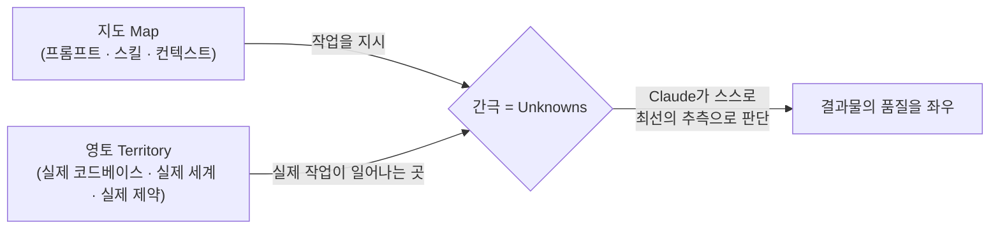
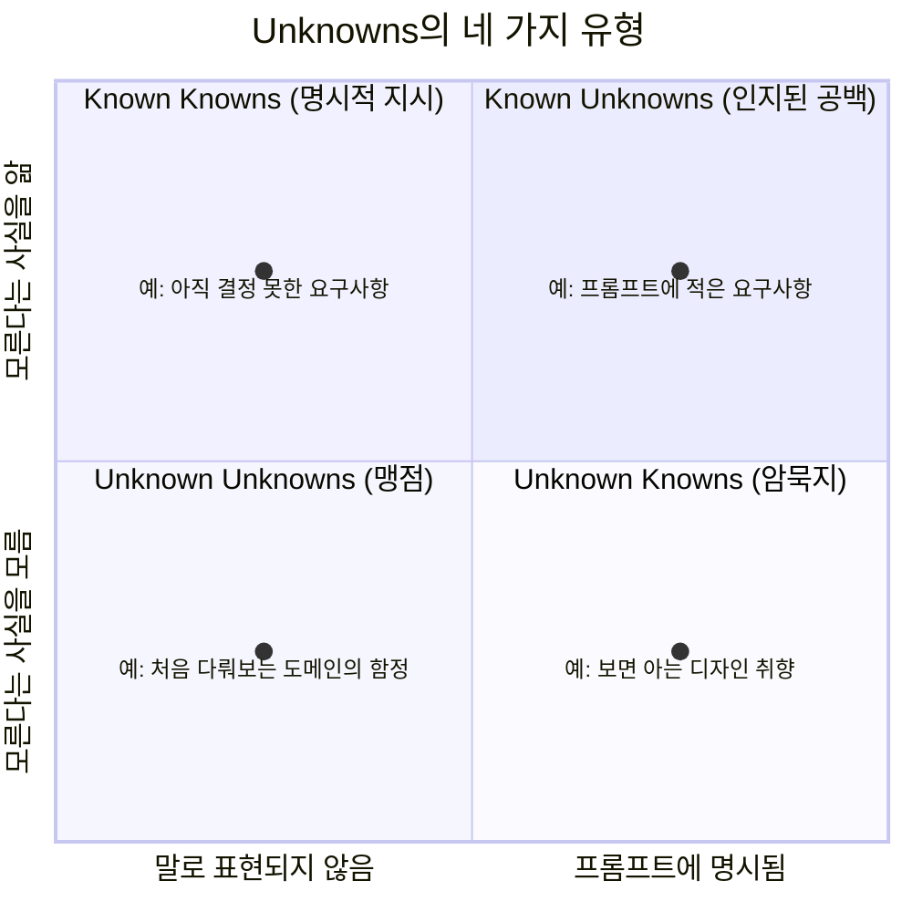
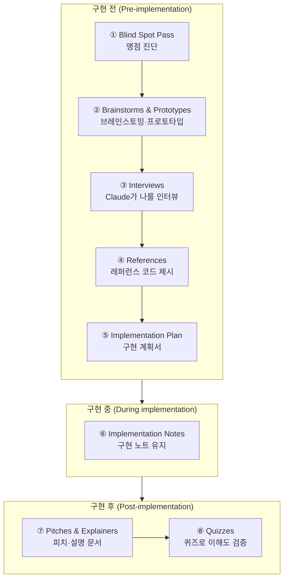
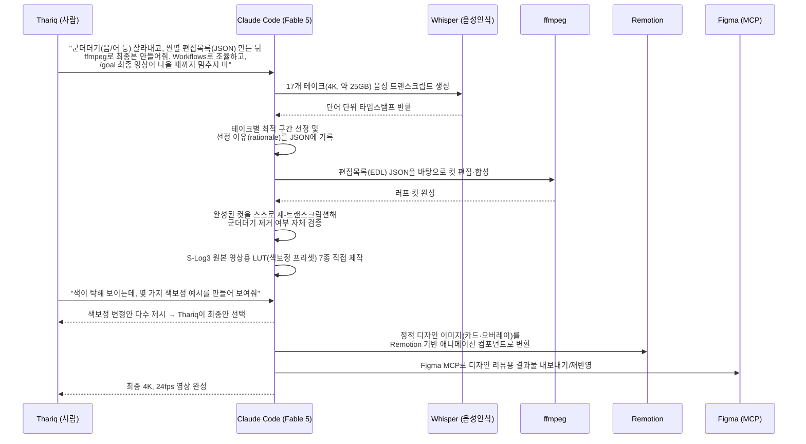
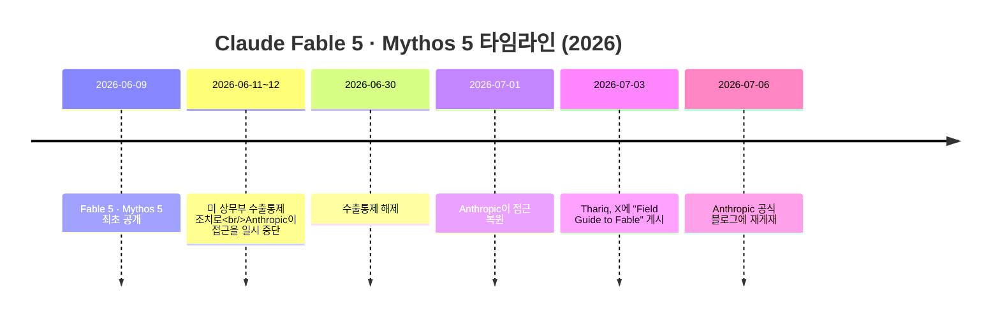

- **원문: ["A Field Guide to Fable: Finding Your Unknowns"](https://x.com/trq212/status/2073100352921215386)**
- **저자: Thariq Shihipar (Anthropic, Claude Code / Claude Design 팀)**
- **공개: 2026년 7월 3일 X(트위터) 스레드로 최초 게시 → 2026년 7월 6일 Anthropic 공식 Claude 블로그(claude.com/blog)에 정식 게재**

## 관련글

[**Fable를 다루는 법: 나의 Unknown을 찾아서**](https://k82022603.github.io/posts/fable%EB%A5%BC-%EB%8B%A4%EB%A3%A8%EB%8A%94-%EB%B2%95-%EB%82%98%EC%9D%98-unknown%EC%9D%84-%EC%B0%BE%EC%95%84%EC%84%9C/)

[**来自 Claude Code 团队成员 Thariq 分享的用好 Fable 5模型的秘诀。(Tips for Using the Fable 5 Model Effectively, Shared by Thariq from the Claude Code Team.)**](https://x.com/dotey/status/2074019009226322078)

---

## 이 문서를 읽기 전에

이 문서는 Anthropic의 Claude Code 팀 소속 엔지니어인 Thariq Shihipar가 작성한 글을 원문 그대로 옮긴 것이 아니라, 그 핵심 내용을 한국어로 풀어서 재구성하고, 관련된 배경 정보(Claude Fable 5 모델 자체의 출시 경위, Claude Code의 `/goal`·Workflows 기능 등)를 덧붙여 강의용으로 정리한 해설 자료다. 원문의 문장을 그대로 베끼지 않고 의미 단위로 재서술했으며, 검색을 통해 확인되지 않은 내용이나 추측성 정보는 포함하지 않았다.

원문 글은 2026년 7월 3일 X에 올라온 뒤 사흘 만에 약 200만 조회수를 기록했고, 이후 Anthropic이 자사 공식 블로그에 재게재할 정도로 커뮤니티에서 크게 화제가 되었다. 저자인 Thariq Shihipar는 Anthropic에서 Claude Code와 Claude Design을 담당하는 팀의 정직원(member of technical staff)이며, 이번 글 외에도 Claude Code의 "Dynamic Workflows" 기능을 소개한 공식 블로그 글의 공동 저자이기도 하다.

---

## 1. 핵심 비유: 지도(Map)는 영토(Territory)가 아니다

Thariq은 이번 글 전체를 관통하는 하나의 비유로 시작한다. 바로 "지도는 영토가 아니다(the map is not the territory)"라는 일반의미론(general semantics)의 오래된 명제다.

- **지도(Map)**: 우리가 Claude에게 넘겨주는 것 전부. 즉 프롬프트, 스킬(SKILL.md), 대화의 맥락(context) 등, 해야 할 일을 "표현"한 것.
- **영토(Territory)**: 실제로 작업이 일어나야 하는 곳. 실제 코드베이스, 실제 세계, 그리고 그 안에 존재하는 진짜 제약 조건들.

지도는 아무리 정교하게 그려도 영토 그 자체가 될 수 없다. 그리고 지도와 영토 사이에 존재하는 간극, 즉 Claude가 무언가를 실행하다가 "이 부분은 사용자가 뭘 원하는지 정보가 없으니 내가 최선을 다해 추측해야 한다"고 판단하게 되는 지점을, Thariq은 **"unknowns"(모르는 것들)** 이라고 부른다.

작업의 규모가 커질수록 Claude가 마주치는 unknowns의 개수도 함께 늘어난다. 그리고 Thariq은 Claude Fable 5를 두고 "내가 그동안 써본 모델 중 처음으로, 결과물의 품질이 모델의 능력이 아니라 내가 얼마나 잘 unknowns를 명확히 해주느냐에 의해 병목이 걸리는 모델"이라고 평가한다. 다시 말해 모델이 똑똑해질수록, 결과물의 한계를 결정짓는 요인은 "모델이 얼마나 잘하느냐"에서 "사용자가 얼마나 명확하게 자신이 모르는 것을 짚어주느냐"로 옮겨간다는 것이다.

여기서 중요한 지적이 하나 더 있다. 사전에 아무리 계획을 잘 세워도 그것만으로는 충분하지 않다는 점이다. unknowns는 구현이 한창 진행되는 도중에 갑자기 튀어나오기도 하고, 때로는 그 unknown 자체가 "애초에 이 문제는 지금과는 완전히 다른 방식으로 풀어야 한다"는 신호가 되기도 한다. 그래서 Thariq은 Fable과 함께 일하는 과정을 구현 **전(pre)**, 구현 **중(during)**, 구현 **후(post)** 에 걸쳐 계속해서 자신의 unknowns를 발견해나가는 반복적 과정으로 설명한다.

---

## 2. Unknowns의 네 가지 유형

Thariq은 문제를 Claude에게 가져올 때, 자신의 unknowns를 네 가지 축으로 나누어 생각한다고 밝힌다. 이 프레임은 원래 도널드 럼즈펠드가 대중화한 "known knowns / known unknowns / unknown unknowns" 구분에 "unknown knowns"를 더해 4분면으로 확장한 것이다.

| 유형 | 정의 | 예시 |
|---|---|---|
| **Known Knowns** (알고 있고, 말한 것) | 프롬프트에 이미 적어 넣은 내용. 즉 "나는 이걸 원한다"고 명시적으로 전달한 부분 | "로그인 페이지에 소셜 로그인 버튼을 추가해줘" |
| **Known Unknowns** (모른다는 것을 아는 것) | 아직 답을 정하지 못했지만, 스스로 "이건 아직 결정 못했다"고 인지하고 있는 부분 | "이 기능을 얼마나 오래 쓸지 아직 모르겠다" |
| **Unknown Knowns** (암묵적으로 알지만 말하지 않은 것) | 너무 당연해서 굳이 프롬프트에 적지 않지만, 막상 결과물을 보면 "이건 아니다"라고 바로 알아차릴 수 있는 것 | 디자인 취향처럼 "보면 안다"의 영역 |
| **Unknown Unknowns** (존재조차 몰랐던 것) | 아예 고려조차 하지 못한 것. 어떤 지식이 있는지조차 모르는 상태, 혹은 "이게 얼마나 좋아질 수 있는지" 감이 없는 상태 | 처음 다뤄보는 도메인의 업계 관행이나 함정 |

Thariq은 뛰어난 에이전틱 코더(agentic coder)일수록 이 네 영역 중 unknowns 자체가 상대적으로 적다고 말한다. 그는 예시로 Claude Code의 프로덕트를 이끄는 Boris Cherny와, Bun.js를 만든 개발자로 잘 알려진 Jarred Sumner의 프롬프트 방식을 관찰한 경험을 언급하는데, 이들은 자신이 정확히 무엇을 원하는지 매우 구체적으로 알고 있고, 코드베이스와 모델의 습성 모두에 깊이 동기화되어 있다는 것이다. 하지만 그런 숙련자들조차 여전히 unknowns를 전제로 두고 일한다. 결국 자신의 unknowns를 줄이고 미리 대비하는 능력 자체가 "에이전틱 코딩이라는 기술(skill)"의 본질이며, 다행히 이는 Claude와 함께 일하면서 점점 더 나아질 수 있는 능력이라고 강조한다.

---

## 3. Claude가 나를 돕게 하려면: 구체성의 딜레마

Thariq은 Claude에게 지시를 내리는 일을 "섬세한 균형 잡기"라고 표현한다.

- **지나치게 구체적으로 지시하면**: Claude는 설령 중간에 방향을 트는 것이 더 합리적인 상황이라도, 그냥 지시받은 대로 고지식하게 따라가 버린다.
- **지나치게 모호하게 지시하면**: Claude는 업계의 일반적인 관행(best practice)에 기대어 알아서 판단하는데, 그 판단이 지금 하려는 일과 맞지 않을 수 있다.

문제는 자신의 unknowns를 정리해두지 않으면 이 두 경우 모두에서 실패한다는 점이다. 앞으로 어느 구간에서 장애물이 나올지, 어느 구간은 무난하게 지나갈지 미리 알 수 없는데도, 정작 필요한 순간에는 Claude가 알아서 방향을 틀어주기를 바라게 된다는 것이다.

여기서 Thariq이 짚는 중요한 지점은, Claude 자체가 이런 unknowns를 훨씬 빠르게 찾아낼 수 있는 도구라는 사실이다. Claude는 코드베이스와 인터넷을 매우 빠르게 탐색할 수 있고, 평균적인 주제에 대해서는 사용자 개인보다 더 많이 알고 있으며, 실패로부터 더 빠르게 학습하고 다음 시도로 넘어갈 수 있다. 다만 이 모든 능력을 발휘하게 하려면, 사용자가 자신의 "출발점"에 대한 맥락을 충분히 줘야 한다. 즉 지금 어떤 생각의 단계에 있는지, 이 문제나 코드베이스에 대해 자신이 얼마나 경험이 있는지를 밝히고, Claude를 마치 함께 생각하는 파트너(thought partner)처럼 대하라는 것이다.

---

## 4. 8가지 실전 기법: 구현 전 · 중 · 후

Thariq은 구현의 세 단계(전/중/후)에 걸쳐 unknowns를 찾아내는 여덟 가지 구체적인 방법을 소개한다.

### ① Blind Spot Pass (맹점 진단)

새로운 작업을 시작할 때 가장 유용한 일 중 하나는 자신의 맹점을 파악하는 것이다. 예를 들어 코드베이스의 낯선 영역에 새 기능을 작성하거나, 디자인처럼 익숙하지 않은 작업을 Claude와 함께 할 때는 "unknown unknowns"가 많을 수밖에 없다. 어떤 질문을 던져야 하는지조차 모르고, 무엇이 좋은 결과물인지도 모르고, 과거에 어떤 시도가 있었는지, 어떤 함정을 피해야 하는지도 모르는 상태다.

이럴 때는 Claude에게 직접 "blind spot pass"와 "unknown unknowns"라는 표현을 그대로 사용해 요청하라고 권한다. 자신이 누구인지, 무엇을 알고 있는지에 대한 맥락을 함께 주는 것이 Claude가 협업을 어떻게 시작해야 할지 이해하는 데 중요하다.

**예시 프롬프트(번역)**
- "새로운 인증(auth) 프로바이더를 추가하려는데, 이 코드베이스의 인증 모듈에 대해 아는 게 전혀 없어. 관련된 unknown unknowns를 찾아내고, 내가 더 나은 프롬프트를 쓸 수 있도록 blind spot pass를 해줄래?"
- "색보정(color grading)이 뭔지도 모르는데 이 영상을 색보정해야 해. 내가 더 나은 프롬프트를 쓸 수 있도록, 색보정에 대한 나의 unknown unknowns를 알려줄래?"

### ② Brainstorms and Prototypes (브레인스토밍과 프로토타입)

"보면 안다"의 영역, 즉 unknown knowns가 많은 작업을 할 때는 Claude와 함께 브레인스토밍하고 프로토타입을 만들어보는 것이 효과적이다. 이런 암묵지를 프로토타이핑 단계에서 미리 말로 꺼내보는 것은 매우 중요한데, 구현이 끝난 뒤에야 그것을 발견하면 상대적으로 훨씬 비싼 대가를 치르기 때문이다. 기능이나 스펙의 작은 변화가 코드 구현에서는 완전히 다른 결과로 이어질 수 있고, 에이전트 입장에서도 이미 반영한 이전 변경을 되돌리기가 더 어려워진다.

예를 들어 백엔드 라우트를 연결하거나 프론트엔드에 추가 상태를 유지하지 않고도, 단지 프레임에 버튼 하나를 추가했을 때 어떻게 보이는지만 먼저 확인하고 싶을 수 있다. 시각적 디자인 역시 말로 설명하기는 어렵지만 보면 바로 아는 대표적 영역이라, 이럴 때는 여러 디자인 방향을 한꺼번에 요청한다.

Thariq은 거의 모든 코딩 세션을 탐색이나 브레인스토밍 단계로 시작한다고 밝힌다. 이는 프로젝트의 범위를 처음부터 의도를 가지고 정의하는 데 도움이 되며, Claude가 종종 자신이 놓쳤을 고가치 접근법을 찾아내기도 하고 반대로 지엽적인 데 매몰되기도 하기 때문에, 브레인스토밍은 범위를 너무 좁게도 너무 넓게도 잡지 않도록 막아준다.

**예시 프롬프트(번역)**
- "이 데이터로 대시보드를 만들고 싶은데 나는 시각적 감각이 없고 뭐가 가능한지도 몰라. 서로 완전히 다른 4가지 디자인 방향으로 HTML 페이지를 만들어줘. 그걸 보고 반응할게."
- "아무것도 연결하기 전에, 가짜 데이터로 새 에디터 툴바를 흉내 낸 HTML 파일 하나만 먼저 만들어줘. 실제 앱을 건드리기 전에 레이아웃에 대한 내 반응을 보고 싶어."
- "대략적인 문제는 이거야: 사용자들이 온보딩 후에 이탈해. 코드베이스를 탐색하고 개입 가능한 지점 10곳을, 비용이 적게 드는 것부터 야심 찬 것 순으로 브레인스토밍해줘. 어떤 게 와닿는지는 내가 알려줄게."

### ③ Interviews (인터뷰)

충분히 브레인스토밍을 한 뒤에도 여전히 unknowns가 남아 있을 수 있다. 이럴 때 Thariq은 Claude에게 자신을 인터뷰해달라고 요청한다. Claude에게 인터뷰를 부탁할 때는 문제에 대한 맥락을 함께 주어, 질문의 방향을 잡아주는 것이 좋다.

**예시 프롬프트(번역)**
- "모호한 부분에 대해 한 번에 하나씩 질문하면서 나를 인터뷰해줘. 내 답변에 따라 아키텍처가 바뀔 만한 질문을 우선순위로 삼아줘."

### ④ References (레퍼런스)

때로는 원하는 것을 말로 자세히 설명할 수 없는 경우가 있다. 그것을 표현할 언어가 없거나, 너무 복잡해서 설명하는 데만 상당한 시간이 걸릴 수도 있다. 이럴 때 가장 좋은 답은 레퍼런스, 즉 참고 자료를 주는 것이다. 다이어그램, 문서, 이미지도 참고 자료가 될 수 있지만, 가장 좋은 레퍼런스는 단연 **소스 코드 그 자체**다.

어떤 라이브러리가 원하는 방식대로 무언가를 구현하고 있거나, 정말 마음에 드는 디자인 컴포넌트가 있다면, 그 폴더를 Fable에게 가리키고 무엇을 참고해야 하는지 알려주면 된다. 설령 그것이 전혀 다른 프로그래밍 언어로 작성되어 있어도 상관없다. 이 방식은 스크린샷 한 장을 주는 것보다 훨씬 풍부한 정보, 즉 실제 마크업 구조와 코드가 어떻게 짜여 있는지를 Claude에게 제공한다. 실제로 Anthropic의 디자인 도구인 Claude Design도 동일한 원리로 작동하는데, 파일을 직접 건네지 않아도 마음에 드는 웹사이트의 특정 컴포넌트를 가리키기만 하면, 화면에 보이는 겉모습이 아니라 그 이면의 코드를 읽어낸다.

**예시 프롬프트(번역)**
- "vendor/rate-limiter 폴더에 있는 이 Rust 크레이트가 내가 원하는 백오프(backoff) 동작을 정확히 구현하고 있어. 이걸 읽고 우리 TypeScript API 클라이언트에 동일한 동작 방식으로 재구현해줘."

### ⑤ Implementation Plans (구현 계획서)

이제 구현할 준비가 되었다고 판단되면, Thariq은 Claude에게 검토용 구현 계획서를 작성해달라고 요청한다. 이때 계획서는 가장 바뀔 가능성이 높은 부분들, 예를 들어 데이터 모델, 타입 인터페이스, UX 흐름 등을 중심으로 구성하도록 요청한다. 이렇게 하면 Claude가 실제로 수정이 필요할 만한 부분을 먼저 드러내 보여줄 수 있다.

**예시 프롬프트(번역)**
- "구현 계획을 HTML로 작성하되, 내가 수정할 가능성이 큰 결정들, 즉 데이터 모델 변경, 새로운 타입 인터페이스, 그리고 사용자에게 보이는 부분을 맨 앞에 배치해줘. 기계적인 리팩토링 부분은 맨 아래로 묻어둬. 그 부분은 믿고 맡길게."

### ⑥ Implementation Notes (구현 노트)

계획에 만족하고 나면, Thariq은 새로운 세션을 열고 그동안 만든 산출물(spec 파일, 프로토타입 등)을 프롬프트에 함께 전달해 구현을 맡긴다. 이렇게 하면 새 세션에서도 컨텍스트 창은 새것이지만, 앞선 기획 단계에서 정리된 모든 정보는 그대로 가져올 수 있다.

하지만 아무리 계획을 잘 세워도 구현 중에는 항상 예상치 못한 unknown unknowns가 숨어 있기 마련이다. 에이전트가 작업을 진행하다가 코드에서 발견한 예외 상황(edge case) 때문에 계획과 다른 방식을 택해야 할 수도 있다. 이를 위해 Thariq은 Claude Code에게 임시로 'implementation-notes.md'(또는 .html) 파일을 유지하면서, 자신이 내린 결정들을 기록해두도록 요청한다. 이렇게 하면 다음 시도에서 그로부터 배울 수 있다.

**예시 프롬프트(번역)**
- "implementation-notes.md 파일을 계속 유지해줘. 계획에서 벗어날 수밖에 없는 예외 상황을 만나면, 보수적인 선택지를 택하고, 그 사실을 'Deviations(이탈 사항)' 항목 아래에 기록한 다음 계속 진행해."

### ⑦ Pitches and Explainers (피치와 설명 문서)

무언가를 출시하는 과정에서 가장 중요한 부분 중 하나는 이해관계자들의 동의와 승인을 얻는 일이다. 프로토타입, 스펙, 구현 노트를 하나의 최종 문서로 묶어 피치·설명 자료를 만들면 다음과 같은 효과가 있다.

- 리뷰어가 자신과 동일한 unknowns에서 출발해 내용을 이해하도록 도와 이해 속도를 높인다.
- 전문가들이 "저 사람이 우리가 미리 예상했을 unknowns와 흔한 실패 지점까지 고려했구나"라고 확인할 수 있게 해 승인 속도를 높인다.

**예시 프롬프트(번역)**
- "프로토타입, 스펙, 구현 노트를 하나의 문서로 묶어서 Slack에 올려 동의를 구할 수 있게 해줘. 맨 앞에는 데모 GIF를 배치해줘."

### ⑧ Quizzes (퀴즈)

긴 작업 세션이 끝나고 나면, Claude는 사용자가 생각했던 것보다 훨씬 많은 일을 해냈을 수 있다. 코드 diff만 읽어서는 실제로 무슨 일이 일어났는지 가볍게만 파악할 수 있는데, 많은 동작이 기존 코드 경로에 의존하기 때문이다.

Claude에게 변경 사항에 대해 충분한 맥락을 준 뒤 자신을 퀴즈로 시험해달라고 요청하면, 실제로 무슨 일이 일어났는지 이해하는 데 도움이 된다. Thariq은 이 퀴즈를 완벽하게 통과한 뒤에야 코드를 병합(merge)한다고 밝힌다.

**예시 프롬프트(번역)**
- "이번 변경 사항에서 일어난 모든 일을 확실히 이해하고 싶어. 맥락, 의도, 실제로 무엇을 했는지 등을 담은 HTML 보고서를 만들어주고, 맨 아래에는 내가 반드시 통과해야 하는 퀴즈를 넣어줘."

---

## 5. 실전 사례: Fable 5 런칭 영상을 Fable 5로 편집하다

Thariq은 이 모든 기법이 실제로 어떻게 결합되는지, Claude Fable 5의 런칭 영상을 편집한 자신의 경험을 예로 든다. 이 영상은 처음부터 끝까지 Claude Code로 편집되었고, 영상 편집은 Thariq 본인에게도 낯선 영역이었다.

그는 자신이 이미 알고 있는 지점에서부터 출발했다. Claude가 코드를 이용해 영상을 편집하고 자막(transcribe)을 뽑아낼 수 있다는 것은 알고 있었지만, 그 정확도가 충분한지는 확신할 수 없었다. 그래서 먼저 Claude에게 Whisper 같은 음성 인식 기술이 어떻게 작동하는지, 그리고 ffmpeg를 이용해 "음", "어" 같은 군더더기 소리나 긴 정적 구간을 정확히 잘라낼 수 있는지 설명해달라고 요청했다.

또한 발화 타이밍에 맞춰 움직이는 UI를 만들고 싶었지만 가능한지 확신이 없어, Remotion과 트랜스크립트를 활용한 프로토타입 영상을 먼저 만들어달라고 요청해 가능성을 확인했다.

마지막으로, 영상 자체의 색감이 다소 탁하게 느껴졌는데, 이것이 색보정(color grading)의 문제라는 것은 알았지만 정작 색보정이 무엇인지는 잘 몰랐다. 처음에는 Claude에게 몇 가지 변형안을 만들어 그중 고르게 하려 했지만, 정작 "좋은 색보정"이 어떤 모습인지 자신이 감을 잡지 못하고 있다는 것을 깨달았다. 그래서 방향을 바꿔, Claude에게 색보정에 대해 가르쳐달라고 요청해 자신의 unknowns를 먼저 파악하는 쪽을 택했다.

공개된 후속 자료(Thariq이 별도로 공유한 편집 과정 해설 영상과 인터랙티브 자료)에 따르면, 이 파이프라인은 다음과 같이 구성되었다.

이 사례에서 인상적인 지점은 두 가지다. 첫째, 사람이 직접 한 일은 취향을 제시하고, 후보를 고르고, 결과를 검토하는 것뿐이었고, 실제 영상 편집 프로그램(NLE)은 한 번도 열리지 않았다는 점이다. 둘째, 검증의 층위가 "영상을 눈으로 확인"하는 것에서 "재-트랜스크립션으로 군더더기가 정말 제거됐는지 자동 확인"하는 것으로 한 단계 위로 옮겨갔다는 점이다. 이는 아래에서 다룰 "Claude가 일을 제대로 하고 있는지"가 아니라 "Claude가 옳은 일을 하고 있는지"를 확인한다는 원칙과 정확히 맞닿아 있다.

---

## 6. 더 넓은 맥락: `/goal`과 Workflows — 감독에서 방향 설정으로

Thariq이 별도로 공유한 내용(사용자가 함께 제공한 X 게시물 번역본에 해당)에 따르면, Fable 5와 함께 일하면서 그의 작업 방식 자체가 세 가지 측면에서 바뀌었다고 한다. 이는 앞서 다룬 "Field Guide" 아티클과 같은 시기, 같은 문제의식에서 나온 이야기로, Fable 5 이후 Claude Code 팀 내부의 작업 방식 변화를 보여준다.

과거에는 Claude가 일을 "제대로" 하고 있는지 계속 점검해야 했다. 예를 들어 작업을 잘게 쪼개서 맡기고, 결과물을 반복적으로 검토하고, 너무 일찍 멈춰버리지는 않았는지 확인하는 식이었다. 그런데 Fable 5부터는 오히려 Claude가 "옳은" 일을 하고 있는지를 점검하는 쪽으로 무게중심이 옮겨갔다는 것이 Thariq의 요지다.

Fable 5는 한 번에 몇 시간씩 작업을 이어갈 수 있고, 스스로 자신의 결과물을 테스트하며, 정직하게 말해 Thariq 본인이 짠 코드보다 더 나은 코드를 내놓는 경우도 적지 않다고 한다. 그 결과 사람의 역할은 점점 감독(supervision)에서 방향 설정과 사전 준비(direction, upfront setup) 쪽으로 옮겨가고 있다.

이런 변화 속에서 Thariq이 꼽는 세 가지 실천은 다음과 같다.

**첫째, Claude를 사고 파트너(thought partner)로 대한다.** 필요한 맥락을 구현 전에 미리 제공한다. 예컨대 작은 스펙을 먼저 던지고, 최종 스펙 문서를 작성하기 전에 Claude에게 자신을 인터뷰하듯 구현 방안에 대해 질문하게 하거나, 여러 방향으로 발전시킬 수 있는 아이디어를 브레인스토밍하고 HTML 프로토타입으로 검토하게 하는 방식이다. 이는 앞서 소개한 "Field Guide"의 인터뷰·브레인스토밍 기법과 사실상 같은 이야기다.

**둘째, 목표(goal)와 그것을 검증할 방법을 명확히 설정한다.** 이를 위해 Claude Code에는 `/goal`과 Workflows라는 두 기능이 도입되었다. `/goal`은 Claude가 완료될 때까지 지속적으로 작업하도록 돕는 기능이고, Workflows는 그 작업을 검증하도록 돕는 기능이다. 예를 들어 스펙 문서를 작성한 뒤 "이 스펙을 완전히 구현하는 것을 목표로 설정하고, 계획의 각 부분을 Workflows로 검증한 다음, 무엇이 구현됐고 계획과 어떤 차이가 있었는지 보고서를 준비해줘"라고 요청하는 식이다. 이렇게 하면 Claude가 창의적이고 신중하게 역량을 발휘하면서도, 실제로 사용자가 원하는 것을 만들고 있는지를 함께 담보할 수 있다.

**셋째, 더 야심 차게 시도한다.** Thariq은 Fable 5가 "이런 건 대형 언어 모델이 못 할 것"이라고 여겨졌던 일에도 도전해볼 만한, 정말로 놀라운 모델이라고 평가한다. 앞서 소개한 런칭 영상 편집이 그 실례이며, Anthropic 팀은 Fable 5가 "무엇이든 가능하다"는 감각의 상한선을 끌어올렸다고 본다.

참고로 이 `/goal`과 Workflows 기능은 Thariq과 동료 Sid Bidasaria가 공동 집필한 Anthropic 공식 블로그 글("A harness for every task: dynamic workflows in Claude Code")에서 보다 자세히 다뤄진다. 이 글에 따르면 Workflows는 여러 번의 대화 압축(compaction)을 거치며 원래 목표에서 서서히 벗어나는 "goal drift(목표 이탈)" 문제를 줄이기 위해, 각기 독립된 컨텍스트 창과 좁은 목표를 가진 별도의 서브에이전트들을 오케스트레이션하는 방식으로 동작한다. 반복적으로 수행해야 하는 워크플로(예: 트리아지, 리서치, 검증 작업)에는 일정 주기로 실행되는 `/loop`와, 반드시 완료해야 할 조건을 못 박는 `/goal`을 함께 사용하도록 권장하고 있다.

---

## 7. Claude Fable 5는 어떤 모델인가 — 배경 정리

이 글이 다루는 모든 기법은 "Claude Fable 5"라는 특정 모델을 전제로 한다. 강의 맥락에서 혼동이 없도록 이 모델을 둘러싼 사실관계를 정리한다.

- Claude Fable 5와 그 자매 모델인 Claude Mythos 5는 2026년 6월 9일 공개되었다. 두 모델은 근본적으로 같은 모델을 기반으로 하지만, Fable 5는 생물학·사이버보안·LLM 연구개발(R&D) 영역에서 추가적인 안전 장치가 적용된 버전이고, Mythos 5는 이 상위 등급인 "Mythos" 티어의 모델로 소수의 신뢰받는 조직에만 제한적으로 제공된다.
- 공개 이틀 뒤인 2026년 6월 11~12일경, 미국 상무부의 수출 통제 조치에 따라 Anthropic은 Fable 5와 Mythos 5에 대한 접근을 일시 중단했다.
- 이후 2026년 6월 30일 해당 수출 통제가 해제되었고, Anthropic은 2026년 7월 1일부로 두 모델에 대한 접근을 복원했다.
- Thariq의 이번 "Field Guide" 글은 이러한 접근 복원 이후인 2026년 7월 3일 X에 게시되었고, 사흘 뒤인 7월 6일 Anthropic 공식 블로그에 정식으로 재게재되었다.

이 접근 중단·복원 경위에 대한 Anthropic의 공식 입장은 `https://www.anthropic.com/news/fable-mythos-access` 에서 확인할 수 있다. 다만 이 시점 이후로도 상황이 바뀌었을 가능성이 있으므로, 최신 소식은 Anthropic 공식 뉴스룸을 통해 다시 확인하는 것이 안전하다.

---

## 8. 한국어 용어 정리 (강의용 글로서리)

| 영어 표현 | 이 문서에서의 번역/설명 |
|---|---|
| Map / Territory | 지도 / 영토 — 표현(프롬프트·스킬·컨텍스트)과 실제 작업 대상(코드베이스·현실) 사이의 비유 |
| Unknowns | (사용자가 아직 명확히 하지 못한) 모르는 것들 |
| Known Knowns | 알고 있고, 이미 말한 것 |
| Known Unknowns | 모른다는 사실 자체는 알고 있는 것 |
| Unknown Knowns | 암묵적으로 알지만 말로 표현하지 않은 것 |
| Unknown Unknowns | 존재조차 몰랐던 것, 맹점 |
| Blind Spot Pass | 맹점 진단 — Claude에게 자신의 unknown unknowns를 짚어달라고 요청하는 기법 |
| Implementation Plan | 구현 계획서 |
| Implementation Notes | 구현 노트 — 계획과 달라진 지점(Deviations)을 기록하는 임시 문서 |
| Thought Partner | 사고 파트너 — Claude를 실행자가 아니라 함께 생각하는 상대로 대하는 태도 |
| `/goal` | Claude Code의 명령어. 완료 조건을 명시해 Claude가 그 조건이 충족될 때까지 작업을 지속하게 함 |
| Workflows (Dynamic Workflows) | Claude Code의 기능. 작업을 여러 서브에이전트로 나누어 조율·검증하는 맞춤형 하네스를 만들어줌 |
| Goal drift | 목표 이탈 — 대화가 길어지고 압축(compaction)이 반복되며 원래 목표나 제약이 조금씩 소실되는 현상 |
| EDL (Edit Decision List) | 편집 결정 목록 — 어떤 클립의 어느 구간을 사용할지 정리한 목록(이 사례에서는 JSON 형식) |
| LUT (Look-Up Table) | 색보정 프리셋 파일 |

---

## 9. 실전 체크리스트 (강의 자료로 바로 활용 가능)

**작업을 시작하기 전에 자문할 것**
- [ ] 이 작업이 익숙한 영역인가, 낯선 영역인가? 낯설다면 Blind Spot Pass부터 요청했는가?
- [ ] "보면 안다"는 식의 취향·기준이 개입하는 작업인가? 그렇다면 여러 방향의 프로토타입을 먼저 받아보았는가?
- [ ] 스펙을 확정하기 전에 Claude에게 인터뷰를 요청해 애매한 지점을 짚었는가?
- [ ] 말로 설명하기 어려운 요구사항이 있다면, 참고할 소스 코드나 컴포넌트를 직접 가리켜주었는가?
- [ ] 구현 계획서를 요청할 때, 바뀔 가능성이 큰 부분(데이터 모델·인터페이스·UX)을 앞에 배치하도록 요청했는가?

**구현이 진행되는 동안**
- [ ] implementation-notes.md 같은 파일로 계획과의 이탈(Deviations)을 기록하게 하고 있는가?
- [ ] 반복적이거나 장시간 걸리는 작업이라면 `/goal`과 Workflows를 함께 활용했는가?

**병합·배포 전에**
- [ ] 이해관계자에게 공유할 피치·설명 문서를 프로토타입·스펙·구현 노트를 묶어 준비했는가?
- [ ] 변경 사항에 대한 퀴즈를 통해 스스로 이해도를 검증한 뒤 병합했는가?

---

## 10. 토론 질문 (수업/세미나용)

1. "지도는 영토가 아니다"라는 비유를 자신의 실제 업무(코딩이 아니어도 좋다)에 적용한다면, 나의 "지도"와 "영토"는 각각 무엇에 해당하는가?
2. 네 가지 unknowns 유형 중, 최근에 겪은 프로젝트 실패나 재작업의 원인은 어느 유형에 가장 가까웠는가?
3. "너무 구체적인 지시"와 "너무 모호한 지시" 사이에서 실패했던 경험이 있다면, 그때 무엇을 미리 준비했더라면 도움이 되었을까?
4. Fable 5의 영상 편집 사례처럼, "이 도구로는 불가능하다"고 여겨왔던 작업 중 이제는 다시 시도해볼 만한 것이 있는가?
5. `/goal`과 Workflows처럼 "목표와 검증 방법"을 명시하는 접근이, 감독(supervision) 중심의 업무 방식과 근본적으로 어떻게 다른가?

---

## 11. 참고 자료

- Thariq Shihipar, "A Field Guide to Claude Fable: Finding Your Unknowns", Anthropic 공식 블로그 (2026.7.6 게재)
  `https://claude.com/blog/a-field-guide-to-claude-fable-finding-your-unknowns`
- Thariq (@trq212), X 스레드 원문 (2026.7.3 게시)
  `https://x.com/trq212/status/2073100352921215386`
- Thariq Shihipar, Sid Bidasaria, "A harness for every task: dynamic workflows in Claude Code", Anthropic 공식 블로그
  `https://claude.com/blog/a-harness-for-every-task-dynamic-workflows-in-claude-code`
- Fable 5 런칭 영상 편집 과정 인터랙티브 해설
  `https://thariqs.github.io/cc-video-editing-deck/`
- Anthropic, Fable 5·Mythos 5 접근 중단 및 복원 관련 공식 입장
  `https://www.anthropic.com/news/fable-mythos-access`

---

*이 문서는 2026년 7월 7일 기준으로 검색·확인된 정보를 바탕으로 작성되었다. Fable 5·Mythos 5의 이용 가능 여부나 관련 정책은 이후 변경되었을 수 있으므로, 최신 사항은 Anthropic 공식 채널(claude.com/blog, anthropic.com/news)에서 다시 확인하는 것을 권한다.*
