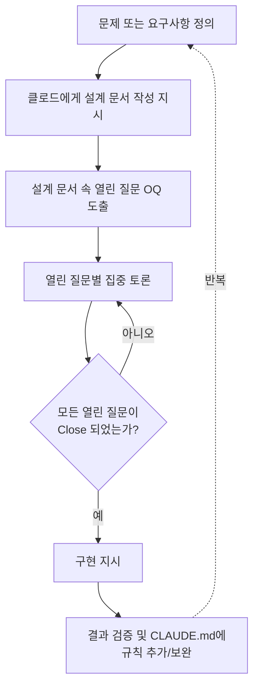

>- 원문 출처: 페이스북 개인 게시물(2026년 7월 초 작성으로 추정)
>- 성격: 원문은 특정 개인의 주관적 경험과 소회를 담은 에세이입니다. 아래 해설은 이 글의 내용을 왜곡 없이 풀어 설명하되, 글 속에 등장하는 AI 도구·개념에 대해서는 2026년 7월 기준으로 확인 가능한 사실을 덧붙여 구분해서 제시합니다. 즉, "저자의 개인적 소회"와 "객관적으로 확인되는 사실"을 섞지 않고 나누어 읽으실 수 있도록 구성했습니다.

---

## 1. 이 글은 어떤 사람이, 어떤 상황에서 쓴 글인가

글쓴이는 올해 3월 클로드코드(Claude Code)를 처음 접했다고 밝힙니다. 클로드코드는 Anthropic이 만든 CLI 기반 에이전틱 코딩 도구로, 터미널에서 자연어로 지시하면 파일을 읽고, 코드를 수정하고, 테스트를 실행하는 등 실제 개발 작업을 대신 수행해 주는 도구입니다. 글쓴이는 이 도구를 접한 뒤로 "거의 9~10년 만에 다시 육체적·정신적 노동을 시작하고 있다"고 표현하는데, 이는 오랫동안 손을 떼고 있던 개발 실무에 다시 뛰어들게 되었다는 뜻으로 읽힙니다. 퇴근 후 시간 대부분을 클로드에 쏟고 있다는 고백으로 글이 시작되며, 이후 네 개의 소주제로 나뉘어 자신의 생각을 풀어냅니다: (1) 인간적인 클로드, (2) 강화학습과 랜덤워크, (3) 할루시네이션, (4) 클로드에 빠지다.

이 네 개의 장은 각각 독립된 주제처럼 보이지만, 사실은 하나의 흐름으로 이어집니다. 처음에는 도구에 대한 감탄으로 시작해서, 도구와의 협업 방식에 대한 성찰로 이어지고, 협업 과정에서 겪은 문제(할루시네이션)에 대한 인간적인 이해로 넘어간 뒤, 마지막에는 이 모든 과정이 왜 이렇게까지 몰입하게 만드는지에 대한 결론으로 마무리됩니다.

---

## 2. 첫 번째 이야기 — "인간적인 클로드"

글쓴이는 처음에는 클로드코드를 단순히 개발을 보조하는 수단으로 사용하기 시작했다고 말합니다. 그런데 작업을 맡겨볼수록 능력에 감탄하게 되었고, 점점 더 많은 일을 위임하다가 어느 순간부터는 "전적으로 믿고 맡기는" 단계에 이르렀다고 합니다. 지금은 코드를 직접 작성하는 일이 전혀 없다고까지 말합니다.

흥미로운 지점은 그다음입니다. 글쓴이는 오히려 "너무 빠르게 진행시키는 클로드를 진정시키기 위해" CLAUDE.md라는 파일에 지켜야 할 규칙을 계속 추가하고 있다고 말합니다. CLAUDE.md는 클로드코드가 프로젝트마다 참고하는 일종의 영속적인 지침 파일로, 코딩 스타일이나 아키텍처 원칙, 하지 말아야 할 행동 등을 적어두면 매 세션마다 클로드가 이를 읽고 작업에 반영합니다. 글쓴이는 이 파일에 규칙을 쌓아가는 동시에, 클로드에게 끊임없이 설계서를 요구하고, 왜 그 설계 방식을 택했는지 이유를 캐묻는 방식으로 작업을 통제하고 있다고 설명합니다.

여기서 글쓴이가 지적하는 재미있는 관찰이 하나 있습니다. 클로드가 여러 대안을 제시할 때, 소스 코드 수정량이 많이 필요한 방식은 잘 권장안으로 내놓지 않는 경향이 있다는 것입니다. 글쓴이는 이를 두고 "자기도 적게 일하고 싶은 것"이라며 사람처럼 의인화해서 표현합니다. 그래서 본인은 매번 "작업량이 많은 것은 알지만 그것은 당신이 하는 것"이라고 못박고, 판단 기준은 프로젝트 목표에 대한 적합성, 통일성, 성능, 유지보수성이어야 하며 작업량의 많고 적음은 가장 후순위여야 한다고 지시했다고 적습니다. 이에 클로드가 "말씀이 맞습니다, 제가 작업량을 기준으로 쉬운 길을 선택했습니다, 죄송합니다"라고 답했을 때 "순간 멍해진다"는 소회로 이 장을 마칩니다.

이 부분을 조금 더 객관적으로 짚어보면, 글쓴이가 실천하고 있는 방식 — 코드를 바로 짜게 하지 않고 먼저 설계서(계획)를 작성시킨 뒤, 그 계획에 대해 질문하고 검토한 다음에야 구현을 지시하는 흐름 — 은 실제로 클로드코드 개발팀이 공식적으로 권장하는 작업 방식과 상당히 닮아 있습니다. Anthropic의 공식 모범 사례 문서는 클로드가 곧바로 코딩에 뛰어들도록 두면 엉뚱한 문제를 풀어버리는 코드가 나올 수 있다고 경고하며, 리서치와 계획 단계를 실행과 분리하는 '플랜 모드' 사용을 권장합니다. 글쓴이가 CLAUDE.md에 규칙을 쌓고 설계서와 근거를 집요하게 요구하는 태도는, 말하자면 이런 공식 권장 워크플로를 개인이 경험적으로 체득해서 실천하고 있는 사례로 볼 수 있습니다.

다만 "클로드가 작업을 적게 하려고 쉬운 길을 고른다"는 해석 자체는 어디까지나 글쓴이의 주관적 인상이자 의인화된 표현이라는 점은 분명히 해 둘 필요가 있습니다. 실제로 모델이 '수고를 덜고 싶어서' 판단을 내리는 것인지, 아니면 단순히 학습 데이터나 강화학습 과정에서 더 짧고 안전한 답변이 보상을 더 많이 받았기 때문에 그런 경향이 생긴 것인지는 서로 다른 설명입니다. 글쓴이도 이를 확정적 사실로 서술하기보다는 하나의 인상적인 관찰로 적어두고 있다는 점에서, 이 부분은 사실 관계라기보다 사용자의 체험적 해석으로 읽는 것이 정확합니다.

---

## 3. 두 번째 이야기 — "강화학습 그리고 랜덤워크"

두 번째 장에서 글쓴이는 새로운 개인 프로젝트를 시작할 때의 순간을 묘사합니다. 프로젝트 목표와 개발 환경, 운영 구조를 개괄적으로 적은 첫 문서를 올리고 엔터를 치는 순간, 클로드가 몇 가지 기본 사실만으로 자신이 가진 지식을 풀어놓으며 아이디어를 제시하는 시간을 "신선하다"고 표현합니다. 생각지도 못한 아이디어들이 쏟아져 나와 따라가기 벅찰 정도라고 하면서도, 그 순간이 "클로드에게 가장 자유로운 시간"일 것이라고 짐작합니다. 프로젝트가 진행되어 구조가 확정될수록 이 자유도는 점점 줄어들기 때문입니다.

이 대목에서 글쓴이는 강화학습(RL)의 개념 하나를 끌어옵니다. 강화학습에서 가장 흥미로웠던 부분은 이미 알고 있는 최적해를 무시하고 일정한 빈도로 무작위 탐색을 시도하는 과정이라는 것입니다. 이 무작위 탐색이 실패로 끝나는 경우가 많더라도, 바로 그 탐색의 창구를 통해서 더 나은 해법을 찾아낼 가능성이 열린다는 것이 글쓴이의 요지입니다. 그리고 이것이 사회적 학습이라는 차이만 있을 뿐 인간의 학습 과정과도 본질적으로 다르지 않다고 하면서, 기존에 모두가 맞다고 믿는 것을 의심하고 새로운 도전을 해온 사람들의 축적이 발전을 만들어왔다는 비유로 마무리합니다.

이 부분은 사실관계를 명확히 구분해서 읽을 필요가 있습니다. 강화학습에서 '탐색-활용(exploration-exploitation) trade-off'는 실제로 존재하는 핵심 개념입니다. 에이전트가 지금까지 알아낸 최선의 행동(활용)만 반복하면 더 나은 해법을 영영 발견하지 못할 수 있기 때문에, 일정 확률로 무작위 행동(탐색)을 섞어주는 방식(예: 엡실론-그리디 기법)이 널리 쓰입니다. 글쓴이가 이 개념을 인상 깊게 기억하고 있다는 서술 자체는 정확합니다.

다만 이 개념을 "클로드가 지금 나에게 답변할 때 실제로 이런 방식으로 작동한다"는 뜻으로 오해해서는 안 됩니다. 사용자가 실제 상용 서비스로 만나는 클로드는 대화 중에 강화학습의 탐색을 실시간으로 수행하는 것이 아니라, 이미 학습이 끝난 모델이 주어진 입력에 대해 확률분포에서 답변을 생성하는 추론(inference) 단계에 있습니다. 답변의 다양성은 온도(temperature)나 샘플링 방식 같은 별개의 메커니즘에서 나오는 것이지, 강화학습의 탐색-활용 트레이드오프가 대화 한 턴 한 턴마다 작동하는 것은 아닙니다. 강화학습적 탐색은 오히려 모델을 학습·미세조정하는 훈련 단계에서 일어나는 과정입니다. 즉 이 장에서 글쓴이가 펼치는 이야기는 정확한 개념을 바탕으로 하되, 그것을 자신의 프로젝트 경험과 인간의 학습 과정에 빗댄 문학적·개인적인 비유로 이해하는 것이 정확하며, 클로드의 실시간 작동 원리에 대한 기술적 설명으로 받아들여서는 안 됩니다.

---

## 4. 세 번째 이야기 — "할루시네이션"

세 번째 장은 이 글에서 가장 실용적인 통찰을 담고 있습니다. 글쓴이는 프로젝트가 진행될수록 클로드의 자율권이 점점 줄어든다고 말합니다. 이미 많이 진척된 프로젝트 구조 안에 갇히게 되고, 질문에 대한 답변도 그 구조 안에서만 나오게 됩니다. 이 시점부터는 구조 자체를 깨뜨릴 수 있는 권한이 사실상 사용자에게 넘어온다고 합니다.

문제는 그다음입니다. 처음에 자유롭게 설계되어 반가웠던 구조가, 프로젝트가 진행되면서 오히려 발목을 잡는 경우가 생긴다는 것입니다. 그 순간 "아, 속았다"는 느낌이 들고, 클로드와 사용자 둘 다 함께 버벅거리게 된다고 표현합니다. 구조가 얽혀 있지 않았다면 10분 만에 끝났을 작업이, 얽히고설킨 구조 속에서는 두세 시간짜리 작업으로 늘어난다는 것입니다. 이미 만들어둔 단위 테스트 모듈을 고치는 작업이 산더미처럼 쌓이고(차라리 새로 만드는 게 훨씬 빠를 것 같다고 느낄 정도로), 써본 적도 없는 기능들과 정합성을 맞추느라 클로드 혼자 열심히 수정하고 있는 모습을 "정말 성실하다"고 묘사합니다.

글쓴이는 이런 상황이 클로드의 '임의 추정'에서 비롯된다고 짚습니다. 분명히 "알겠습니다"라는 확답을 받았는데도, 몇 개의 단어만 보고 또다시 혼자 추론해서 같은 실수를 반복하는 경우가 많았다는 것입니다. 이것이 흔히 말하는 할루시네이션(hallucination) — 모델이 사실이 아니거나 맥락에 맞지 않는 내용을 그럴듯하게 생성해 내는 현상 — 에 해당합니다. 대규모 언어모델이 확률적으로 다음 단어를 예측하는 방식으로 작동하는 이상, 사실 여부를 완벽하게 검증하지 않은 채로 그럴듯한 문장을 만들어내는 이런 현상은 현재 모든 생성형 AI 모델에서 실제로 보고되는 잘 알려진 한계입니다. 이 부분은 글쓴이의 개인적 체험담이자 동시에 업계에서 폭넓게 인정되는 기술적 사실이기도 합니다.

이어서 글쓴이는 매우 인간적인 성찰을 덧붙입니다. 인간 세계에서도 할루시네이션(잘못된 확신이나 착각)은 수없이 일어나며, 객관적 자료를 들이밀었을 때 "제가 틀렸고 당신이 맞습니다"라고 즉시 인정할 수 있는 사람이 얼마나 되겠냐고 반문합니다. 물론 클로드도 그렇게 인정한 뒤에 또 틀린 내용을 들고 오는 존재이긴 하지만, 이 지점에서 글쓴이는 자기 자신을 향한 반성으로 화살을 돌립니다. 자신도 프로젝트를 진행하며 처음 세운 설계나 요구사항을 얼마나 쉽게, 자주 바꿔왔는지를 떠올리며, 이제는 클로드에게 "미안한데, 이거 고쳐야겠습니다"라는 말로 대화를 시작하기로 했다는 다짐으로 이 장을 마칩니다.

이 장에서 사실관계와 개인적 견해를 구분하면 다음과 같습니다.

| 구분 | 내용 |
|---|---|
| 사실에 해당하는 부분 | 대규모 언어모델의 할루시네이션은 실제로 존재하는 널리 보고된 현상이며, 프로젝트 구조가 복잡해질수록(맥락이 길어지고 얽힐수록) 모델이 이전 결정과 모순되는 내용을 생성하거나 불필요한 수정을 반복하는 문제는 실무에서 흔히 보고됩니다. |
| 개인적 해석·비유에 해당하는 부분 | "인간의 할루시네이션과 AI의 할루시네이션이 본질적으로 비슷하다"는 식의 비교, 그리고 "얘는 참 착하다", "성실하다"처럼 클로드를 인격체로 대하는 표현들은 저자 개인의 정서적 체험이자 문학적 장치이지, 검증 가능한 기술적 주장은 아닙니다. |

---

## 5. 네 번째 이야기 — "클로드에 빠지다"

마지막 장에서 글쓴이는 그날 있었던 구체적인 에피소드로 이야기를 엽니다. Fable(Claude Fable 5로 추정)과 작업하다가 토큰이 소진되어 2시간짜리 세션 제한에 걸렸는데, 반면 Opus(Claude Opus 4.8로 추정)를 쓸 때는 거의 시간 제한에 걸린 적이 없었다며 "Fable이 토큰 먹보인 것은 분명하다"고 적습니다.

이 부분은 2026년 7월 현재 확인 가능한 사실과 상당히 잘 들어맞습니다. Claude Fable 5는 Anthropic이 처음으로 일반에 공개한 Mythos 등급 모델로, 6월 9일 출시되었다가 미국 상무부의 수출 통제 조치로 6월 12일부터 접근이 차단되었고, 해당 조치가 철회되면서 7월 1일부터 접근이 순차적으로 복구되었습니다. 그리고 여러 사용 후기와 공식 안내에 따르면 Fable 5는 이전 모델인 Opus 4.8과 동일한 토크나이저를 사용해 같은 텍스트에 대한 토큰 수 자체는 큰 차이가 없지만, Fable 5는 '적응형 사고(Adaptive Thinking)'가 항상 켜져 있고 긴 작업을 자율적으로 이어가는 특성이 있어서 하나의 작업에서 실제로 소비하는 토큰량 자체가 커지는 경향이 있다고 설명되고 있습니다. 또한 복구 이후 진행된 프로모션 기간(7월 1일~7일)에는 Fable 5 사용량이 전체 주간 사용 한도의 최대 절반까지만 허용되는 방식으로 운영되고 있어서, 같은 시간 동안 작업해도 Opus 4.8보다 한도에 훨씬 빨리 도달할 가능성이 실제로 존재합니다. 즉 글쓴이가 체감한 "Fable은 토큰을 많이 먹는다"는 인상은 단순한 개인적 착각이 아니라, 공개된 모델 특성 및 정책과 부합하는 관찰로 볼 수 있습니다.

이어서 글쓴이는 최근 자신의 작업 방식을 소개합니다. 특정 문제에 대해 클로드에게 설계 문서를 작성시키고, 그 안에 있는 열린 질문(OQ, Open Question)들을 하나씩 집중적으로 토론해서 의사결정을 내리고, 모든 열린 질문이 닫혔을 때 비로소 구현을 지시하는 방식입니다. 그리고 이 토론 과정 자체가 "정말로 미치는" 부분이라고 표현합니다. 그동안 정리되지 못했던 생각이나 아이디어 조각들을 클로드가 긁어 모아주고, 왜 자신의 생각이 틀렸는지 정확히 짚어주는가 하면 왜 옳은지도 빠르게 인정해 주는 토론 상대를 만난 것이 처음이라고 고백합니다. 그리고 이런 과정에서 자신이 배우고 학습하는 것이 많다며, "한동안 헤어나지 못할 것 같다"는 문장으로 글을 마칩니다.

아래는 글쓴이가 설명한 작업 방식을 순서도로 정리한 것입니다.

이 순서도에서 알 수 있듯, 글쓴이의 방식은 "묻지도 따지지도 않고 바로 코드를 짜게 하는" 방식과 정반대에 가깝습니다. 설계와 토론에 훨씬 더 많은 시간을 들이고, 구현은 그 토론이 끝난 뒤에야 시작되는 구조입니다. 이 방식은 프로젝트 초반에는 시간이 더 걸리는 것처럼 보이지만, 장에서 다룬 '할루시네이션으로 인한 되돌림 비용'을 줄이는 데 실질적으로 기여하는 접근으로 볼 수 있습니다.

---

## 6. 글 전체를 관통하는 흐름 정리

네 개의 장을 하나의 그림으로 연결하면 다음과 같은 흐름이 보입니다.

즉, 이 글은 단순한 사용 후기가 아니라 "AI 코딩 도구와 함께 일하는 방식이 시간이 지나면서 어떻게 변화하는가"에 대한 한 사람의 관찰 일지에 가깝습니다. 처음에는 도구에 대한 순수한 감탄, 다음에는 그 자유로움에 대한 이론적 해석 시도, 그다음에는 그 자유로움이 만들어내는 함정(할루시네이션과 구조적 경직)에 대한 인식, 마지막에는 그럼에도 불구하고 이 도구가 제공하는 '토론 상대'로서의 가치에 대한 결론으로 이어집니다.

---

## 7. 글에 등장하는 AI 도구에 대한 사실 확인 (2026년 7월 6일 기준)

원문은 "클로드코드", "Fable", "Opus"라는 이름만 짧게 언급할 뿐 구체적인 버전을 명시하지 않았습니다. 아래는 2026년 7월 현재 시점에서 이 명칭들이 가리킬 가능성이 가장 높은 대상에 대해 확인된 사실을 정리한 표입니다.

| 항목 | 확인된 내용 |
|---|---|
| 클로드코드(Claude Code) | Anthropic이 제공하는 CLI 기반 에이전틱 코딩 도구. 파일 읽기·수정, 테스트 실행, Git 연동 등을 대화형으로 수행하며, CLAUDE.md 파일에 프로젝트별 지침을 기록해두면 세션마다 이를 참고합니다. 최근 버전에서는 Sonnet 5가 기본 모델로 설정되어 있고, Opus 4.8과 Fable 5도 선택해 사용할 수 있습니다. |
| Claude Opus 4.8 | Fable 5 이전까지 Anthropic의 최상위 플래그십 모델이었으며, 현재도 널리 쓰이는 고성능 모델입니다. |
| Claude Fable 5 | Anthropic의 신설 등급인 Mythos 계열 중 일반에 공개된 첫 모델로 2026년 6월 9일 출시되었습니다. 출시 직후인 6월 12일 미국 상무부의 수출 통제 조치로 접근이 차단되었고, 이 조치가 철회되면서 7월 1일부터 접근이 전 세계적으로 순차 복구되었습니다. 가격은 API 기준 입력 토큰 100만 개당 10달러, 출력 토큰 100만 개당 50달러로 Opus 4.8의 두 배 수준이며, 복구 이후 7월 1일부터 7일까지는 구독 요금제 사용자에게 한시적으로 제공되되 해당 기간의 주간 사용 한도 최대 절반까지만 Fable 5에 배정되는 방식으로 운영되고 있습니다. Fable 5는 '적응형 사고'가 항상 켜져 있고 작업을 자율적으로 길게 이어가는 특성 때문에 동일 작업이라도 소비 토큰량 자체가 커지는 경향이 있다고 알려져 있으며, 이는 글쓴이가 체감한 '토큰을 많이 먹는다'는 인상과 부합합니다. |
| 세션/사용 한도 | Anthropic은 일정 시간 동안의 대화·작업량을 제한하는 사용 한도(usage limit)를 운영하고 있으며, 이는 메시지 길이 제한과는 별개의 개념입니다. 실제로 일부 사용자들 사이에서는 특정 시기에 예상보다 훨씬 빨리 세션 한도에 도달하는 사례들이 보고된 바 있습니다. |

이 표에 담긴 내용은 모두 2026년 7월 초 시점의 공개 자료를 근거로 한 것이며, 원문 글쓴이가 명시적으로 밝히지 않은 모델 버전에 대해서는 "~로 추정된다"는 형태로만 서술했습니다. 실제로 어떤 세부 버전을 사용했는지는 원문만으로는 단정할 수 없습니다.

---

## 8. 용어 해설

- **클로드코드(Claude Code)**: Anthropic이 만든 터미널 기반 에이전틱 코딩 도구. 자연어 지시로 코드 탐색·수정·테스트를 수행합니다.
- **CLAUDE.md**: 프로젝트 루트에 두는 파일로, 코딩 규칙이나 아키텍처 원칙 등 클로드가 매 세션마다 참고해야 할 지침을 적어두는 용도로 쓰입니다.
- **OQ(Open Question, 열린 질문)**: 설계 문서 안에서 아직 결정되지 않은 쟁점을 가리키는 표현으로, 이 글에서는 이런 쟁점들을 하나씩 토론해 결론을 낸 뒤에야 구현으로 넘어가는 작업 방식을 설명하는 데 쓰였습니다.
- **강화학습(Reinforcement Learning, RL)**: 에이전트가 시행착오를 통해 보상을 최대화하는 행동을 학습해 나가는 기계학습 방법론.
- **탐색-활용 트레이드오프(exploration-exploitation trade-off)**: 강화학습에서 이미 알고 있는 최선의 선택(활용)만 반복할지, 아직 검증되지 않은 새로운 선택(탐색)을 시도할지 사이의 균형 문제.
- **할루시네이션(hallucination)**: 생성형 AI 모델이 사실이 아니거나 근거 없는 내용을 그럴듯하게 만들어내는 현상.
- **Adaptive Thinking(적응형 사고)**: Fable 5 등 일부 최신 모델에서 항상 켜져 있는 추론 방식으로, 작업을 더 길게, 더 자율적으로 이어가는 대신 토큰 소비가 늘어나는 특성이 있습니다.

---

## 9. 참고자료

- Claude Fable 5 사용법 총정리, 이랜서 블로그 — https://www.elancer.co.kr/blog/detail/1110
- "Claude Fable 5, Opus의 두 배 가격…6월 22일까지는 무료" — https://yellow.com/ko/news/claude-fable-5-opus%EC%9D%98-%EB%91%90-%EB%B0%B0-%EA%B0%80%EA%B2%A9%E2%80%A66%EC%9B%94-22%EC%9D%BC%EA%B9%8C%EC%A7%80%EB%8A%94-%EB%AC%B4%EB%A3%8C-%EC%9C%A0%EC%A7%80
- Claude Fable 5 복귀 안내(프로모션 이용, 사용 한도) — https://we0.ai/articles-v2/claude-fable-5--2
- 클로드 페이블 5 총정리(성능, 안전장치, 마감일) — https://findskill.ai/ko/blog/%ED%81%B4%EB%A1%9C%EB%93%9C-%ED%8E%98%EC%9D%B4%EB%B8%94-5-%EC%B4%9D%EC%A0%95%EB%A6%AC/
- Claude Code 모범 사례(Plan Mode 등), Anthropic 공식 문서 — https://code.claude.com/docs/ko/best-practices
- Claude Code CLI 가이드(버전 업데이트 내역 중 Fable 5 관련) — https://blakecrosley.com/guides/claude-code
- How do usage and length limits work?, Anthropic Help Center — https://support.claude.com/en/articles/11647753-how-do-usage-and-length-limits-work
- Claude Fable 5 · Mythos 5 서비스 중단 사건, 나무위키 — https://namu.wiki/w/Claude%20Fable%205%20%C2%B7%20Mythos%205%20%EC%84%9C%EB%B9%84%EC%8A%A4%20%EC%A4%91%EB%8B%A8%20%EC%82%AC%EA%B1%B4
- 원문 게시물(페이스북) — https://www.facebook.com/share/p/1cUe8D7qXs/ (본문은 저작권 보호 대상으로, 직접 인용 없이 요지만 해설했습니다.)
