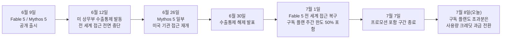
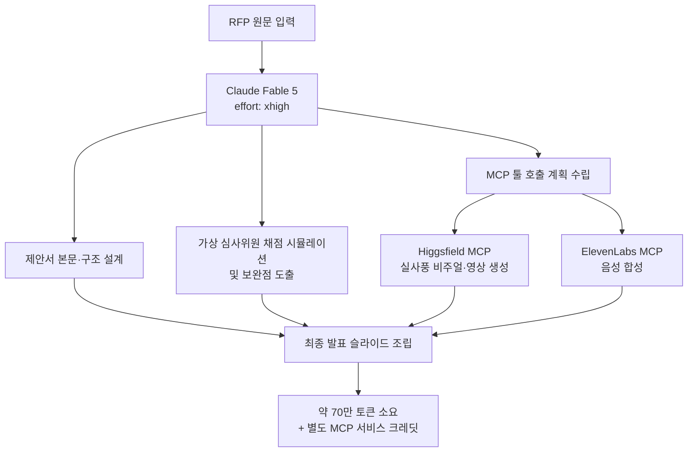

## 게시물 개요

> 
> Fable 5 를 쓰면 쓸수록 그 사이에 점점 더 진화하는 것이 눈에 보입니다. 솔직히 저도 이 수준에 맞게 진화하고 있는 중이구요. Goal 의 설정과 맥락을 주는 방식과 전체 프로세스와 아키텍처 설계 등등.
> 
> 이제는 알아서 토큰 비용 및 각종 외부 API (일레븐랩스)나 MCP (힉스필드) 비용도 모니터링해서 최적의 결과물과 비용 조합을 전략을 짜서 설계하고 실행하는 수준까지 보여주네요.
> 
> RFP 를 넣으면 80점 이상 수준의 제안서를 뽑아내는 서비스 프로토타이핑을 하고 있는데, 여러가지 고려 요소들이 꽤 있어서 xhigh 로 effort 설정하고, 시작부터 끝까지 Fable 5 로 돌려보고 있는데 700k (70만) 정도 토큰으로 상당한 수준의 결과물이 나옵니다. 
> 
> 최종 발표 슬라이드, 각종 실사 이미지와 동영상 생성, 가상 심사 위원의 정교한 채점 시뮬레이션 및 보완점 가이드까지. 나중에 적절히 마스킹해서 어떤 모습인지 따로 공유하겠습니다.
> 
> Fable 5 API 가격 책정이 Opus 의 딱 두배로, 백만 입력 토큰당 $10, 백만 출력 토큰당 $50 인데, 캐시히트율이나 기타 등등 고려하면 좀 차이가 있겠지만, 이 정도 가성비라면 저는 전혀 비싸다고 생각하지 않습니다. 
> 
> 호출 한 번에 10만원씩 나간다는 분들도 있는 거 같은데, 어떻게 호출해서 쓰시는 지 잘 감이 안오는데, 아마도 엄청 대규모 코드의 리팩토링같은 것을 돌리고 있으셔서 그러지 않을까 싶습니다. 
> 
> 여하튼 여러모로 최적화의 여지가 있어 보이며, 사실 쓰면서 계속 놀라는 것은 이 정도의 사고력을 담은 출력물을 이 속도에 내놓는다고? 입니다. Haiku 같은게 빠르긴 하지만 그건 워낙에 간단한 태스크를 위한 경량 모델이라 그런 것이고, 과거 GPT Pro 및 o3 같은 거 쓸 때 생각하면 정말 속터졌거든요. 30분 뒤에나 답이 나오고 등등... 그런데 Fable 5 는 한 마디로 AI의 두뇌 회전이 핑핑 돌아가는 느낌입니다. 
> 
> '워낙 빨리 변하니 좀 어느 정도 안정화됐을 때 배우고 싶다'는 분들도 적지 않은데, 사실 그래도 빨리 배우고 익히면서 같이 크는 게 맞다고 말씀드려왔지만, 지금은 진짜 타이밍이라고 봅니다. 
> 
> Fable 5 가 별로 똑똑하지 않다고 느껴지시는 분은 정말정말 똑똑하신 분이시거나, 뭔가 제대로 못쓰시거나 둘 중 하나의 경우가 아닐까 싶습니다. 이 정도 자질의 아이라면 빨리 입양해서 잘 키워서 잘 활용해야 합니다. 키우는 데에 어느 정도의 시간이 필요하다보니 늦으면 늦을수록 손해라고 생각합니다.
> 
> #ai #agent #claude #fable5 #speed #gonnector #고넥터
> 
> https://www.facebook.com/share/p/1HhXu9eTxn/
> 

공유된 페이스북 게시물은 Claude Fable 5를 실무 프로토타이핑에 집중적으로 투입하고 있는 한 실무자의 경험담이다. 핵심 요지는 세 가지로 정리된다. 첫째, Fable 5를 쓰면 쓸수록 모델 자체가 진화하는 것이 체감되며, 그에 맞춰 목표(Goal) 설정 방식과 컨텍스트를 주는 방법, 전체 프로세스·아키텍처 설계 역량도 함께 성장하고 있다는 점이다. 둘째, RFP(제안요청서)를 입력하면 80점 이상 수준의 제안서를 뽑아내는 서비스를 프로토타이핑하는 과정에서, effort를 xhigh로 설정하고 처음부터 끝까지 Fable 5로 돌렸더니 약 70만 토큰 규모로 최종 발표 슬라이드, 실사풍 비주얼과 영상 생성, 가상 심사위원의 정교한 채점 시뮬레이션까지 만들어냈다는 것이다. 셋째, Fable 5의 API 가격이 Opus의 정확히 두 배(백만 입력 토큰당 10달러, 백만 출력 토큰당 50달러)라는 점을 언급하며, 이 정도 성능이라면 비싸다고 생각하지 않는다는 평가와 함께, "한 번 호출에 10만원씩 나간다"는 일부 반응은 아마도 대규모 코드 리팩토링 같은 특수한 사용 패턴 때문일 것이라는 추정을 덧붙이고 있다.

이 글은 게시물에 담긴 주장들을 공식 문서와 언론 보도로 하나씩 검증하고, Fable 5의 가격 구조·effort 설정·외부 도구 연계 방식을 체계적으로 설명한다. 게시물 작성자 본인의 체감이나 특정 수치(예: 실제 최종 비용, "AI 두뇌 회전이 빠르다"는 인상)는 개인 경험에 기반한 주관적 서술이므로, 공식적으로 확인되는 사실과 구분해서 표기한다.

---

## 1. Fable 5는 무엇이고, 지금 어떤 상태인가

Claude Fable 5는 2026년 6월 9일, 자매 모델인 Claude Mythos 5와 함께 공개되었다. 두 모델은 동일한 기반 모델을 공유하지만, Fable 5는 일반 공개용으로 사이버보안·생물학·증류(distillation) 관련 안전 분류기가 추가로 적용된 버전이고, Mythos 5는 이러한 안전장치 일부가 완화된 대신 Project Glasswing이라는 신뢰 파트너 프로그램을 통해서만 제한적으로 제공된다(Anthropic 공식 문서, 2026년 6월). Fable 5는 출시 당일부터 Claude API, Claude Platform on AWS, Amazon Bedrock, Google Cloud Vertex AI, Microsoft Foundry 등 주요 채널에 일반 공개(GA)로 배포되었다.

그런데 출시 사흘 만인 6월 12일, 미국 상무부가 두 모델에 수출통제 조치를 발동하면서 상황이 급변했다. 아마존 소속 연구자들이 Fable 5의 안전장치를 우회해 소프트웨어 취약점을 식별하게 하고, 한 사례에서는 실제 취약점 공격 코드를 작성하게 만든 탈옥(jailbreak) 사례를 보고한 것이 발단이었다(Anthropic, "Redeploying Claude Fable 5", 2026년 6월 30일). 통제 명령이 국적을 불문하고 즉시 적용되는 방식이었고 실시간으로 이용자 국적을 검증할 방법이 없었기 때문에, Anthropic은 전 세계 모든 사용자에 대해 두 모델의 접근을 전면 중단했다. 흥미로운 점은, Anthropic이 자체 검증한 결과 해당 취약점 식별 능력은 Fable 5만의 고유 역량이 아니라 Opus 4.8, GPT-5.5, Kimi K2.7을 포함한 대부분의 최신 모델에서도 재현 가능했다는 사실이다. 이후 상무부의 재검토를 거쳐 6월 30일 수출통제가 해제되었고, 7월 1일부터 Claude Platform·Claude.ai·Claude Code·Claude Cowork 전반에 걸쳐 접근이 전 세계적으로 복구되었다(CNBC, 2026년 6월 30일자 보도).

여기서 오늘 날짜(2026년 7월 8일) 기준으로 짚어둘 실무적 포인트가 하나 있다. Anthropic은 복구 시점에 Pro·Max·Team 및 일부 Enterprise 플랜 사용자에 한해 "7월 7일까지 주간 사용량 한도의 최대 50%까지" Fable 5를 별도 과금 없이 포함해주겠다고 공지했다(Anthropic 공식 발표, 2026년 7월 1일). 즉 이 프로모션 성격의 무료 구간은 바로 어제(7월 7일)로 종료되었고, 오늘부터는 구독 플랜 내에서 Fable 5를 계속 쓰려면 사용량 크레딧(usage credits)을 활성화해야 하는 구간으로 넘어간 상태다. 게시물 작성자가 언급한 "70만 토큰짜리 xhigh 풀런"과 같은 대규모 실험을 지금 그대로 재현한다면, 구독 플랜 사용자라도 실질적으로는 API 종량 과금에 가까운 비용 구조를 마주하게 될 가능성이 높다는 뜻이다.

---

## 2. 가격 구조: "Opus의 정확히 두 배"는 사실인가

게시물의 가격 주장부터 검증하면, 결론적으로 정확하다. Claude Fable 5의 API 가격은 백만 입력 토큰당 10달러, 백만 출력 토큰당 50달러다(Anthropic Claude Platform Docs, "Introducing Claude Fable 5 and Claude Mythos 5"). Claude Opus 4.8은 백만 입력 토큰당 5달러, 백만 출력 토큰당 25달러로 책정되어 있으므로, 입력·출력 토큰 모두에서 Fable 5가 정확히 Opus 4.8의 두 배 가격인 셈이다. 참고로 이 가격은 Anthropic이 이전에 제한적으로만 제공했던 Mythos Preview(약 백만 토큰당 30달러/150달러 수준으로 알려짐)보다는 오히려 절반 이하로 낮아진 수치이기도 하다.

주요 모델의 API 가격을 표로 정리하면 다음과 같다.

| 모델 | 입력(백만 토큰당) | 출력(백만 토큰당) | 비고 |
|---|---|---|---|
| Claude Fable 5 / Mythos 5 | $10 | $50 | Opus 4.8의 정확히 2배 |
| Claude Opus 4.8 | $5 | $25 | Fable 5의 절반 |
| Claude Sonnet 5 | $2 (도입 가격, ~2026년 8월 31일까지) | $10 | 이후 정가 $3 / $15로 전환 예정 |
| Claude Sonnet 4.6 | 별도 정가 적용 | 별도 정가 적용 | Fable 5 대비 입력 기준 약 1/3~1/5 수준으로 언급됨 |

게시물 작성자가 말한 "가성비가 전혀 비싸지 않다"는 평가를 이해하려면 토큰당 가격이 아니라 완료된 작업(task) 단위 비용으로 봐야 한다는 점이 중요하다. 예를 들어 Stripe는 5천만 라인 규모의 Ruby 코드베이스 전체 마이그레이션을 Fable 5로 하루 만에 끝냈는데, 이는 팀 단위로 두 달 이상 걸릴 것으로 추산되던 작업이었다(Anthropic 공식 사례, TrueFoundry 정리 자료 재인용, 2026년 6월). 토큰당 가격만 보면 비싸 보여도, 결과물을 얻기까지 드는 총비용과 시간을 함께 계산하면 오히려 더 저렴한 경우가 실제로 보고되고 있다는 것이다.

비용을 줄이는 공식적인 레버도 세 가지로 정리된다. 첫째는 프롬프트 캐싱으로, 반복되는 시스템 프롬프트나 코드베이스 컨텍스트를 캐시로 재사용하면 해당 부분의 입력 비용이 약 90% 절감되어 백만 토큰당 10달러가 1달러 수준까지 낮아진다. 둘째는 배치(Batch) API로, 실시간 응답이 필요 없는 작업이라면 입력·출력 모두 50% 할인된 가격(백만 토큰당 5달러/25달러, 사실상 Opus 4.8과 동일한 가격)으로 처리할 수 있다. 셋째는 미국 내 데이터 라우팅을 강제하는 `inference_geo: "us"` 옵션인데, 이 경우 전 토큰 구간에 1.1배의 할증이 붙는다.

게시물에서 언급한 "호출 한 번에 10만원씩 나간다"는 이야기에 대해서도 짚을 필요가 있다. 이는 작성자 본인이 커뮤니티에서 접한 반응을 재인용하며 "아마 대규모 리팩토링 때문일 것"이라고 추정한 부분으로, 검증된 사실이 아니라 작성자의 개인적 추측임을 밝혀둔다. 다만 이 추측은 업계 분석과 방향이 일치한다. Fable 5를 포함한 트랜스포머 기반 모델은 상태를 기억하지 못하는(stateless) 구조이기 때문에, 에이전트가 여러 턴에 걸쳐 작업할 때마다 누적된 프로젝트 컨텍스트·이전 요약·툴 상태·파일 내용을 매 호출마다 다시 입력 토큰으로 전송해야 한다. 여기에 Fable 5 특유의 길고 꼼꼼한 추론 과정이 출력 토큰(백만 토큰당 50달러)으로 청구되기 때문에, 컨텍스트가 큰 코드베이스를 오래 붙잡고 도는 자율 에이전트 작업에서는 한 번의 계획 단계(planning pass)만으로도 몇 달러에서 수십 달러가 누적될 수 있다는 것이 여러 매체의 공통된 설명이다(TechTimes, 2026년 7월 6일). "10만원짜리 한 번의 호출"이라는 표현은 이런 장시간·대규모 자율 실행 세션의 누적 비용을 하나의 "호출"로 뭉뚱그려 인식한 결과일 가능성이 높다.

---

## 3. Effort 파라미터와 xhigh 설정의 의미

게시물에서 "effort를 xhigh로 설정하고 처음부터 끝까지 돌렸다"고 한 부분은 Fable 5의 핵심 제어 장치인 effort 파라미터를 가리킨다. Fable 5는 이전 모델들과 달리 사고(thinking) 기능이 항상 켜져 있는 구조(adaptive thinking)로 설계되어, 별도의 사고 토큰 예산(budget_tokens)을 수동으로 설정하는 방식 자체가 사라졌다. 대신 API의 `output_config`에 `effort` 값을 지정해 추론 깊이·툴 호출 방식·응답 길이를 한 번에 조절한다.

effort는 다섯 단계로 구성된다.

| 단계 | 특징 | 공식 권장 용도 |
|---|---|---|
| low | 최소한의 추론, 속도·비용 최적화 | 단순 반복 작업, 빠른 응답이 필요한 경우 |
| medium | 균형 잡힌 성능 | 무난한 일반 작업 |
| high (기본값) | 복잡한 추론과 정밀한 코딩에 적합 | API 미지정 시 기본 적용되는 수준 |
| xhigh | 반복적인 툴 호출과 깊은 탐색이 필요한 고난도 에이전트 작업 | 코딩·에이전트형 복잡 작업, 역량 민감 워크로드 |
| max | 제약 없이 가장 철저한 추론 | 지연 시간에 구애받지 않는 극난도 문제 |

공식 문서(Anthropic Claude Platform Docs, "Effort")는 대부분의 작업에는 기본값인 high로 시작하고, 역량이 특히 중요한 작업에만 xhigh를 쓰며, 일상적인 작업은 오히려 medium이나 low로 낮추라고 권고한다. 흥미로운 지점은 "Fable 5의 낮은 effort 단계가 이전 세대 모델의 xhigh보다 나은 성능을 내는 경우가 많다"는 공식 설명이다. 즉 게시물 작성자가 RFP 프로토타입처럼 "고려 요소가 많은" 복잡한 다단계 작업에 xhigh를 선택한 것은, 공식 가이드가 명시한 xhigh의 전형적인 적용 대상(반복적 툴 호출, 상세한 탐색이 필요한 고난도 에이전트 작업)과 정확히 부합하는 사용법이라고 볼 수 있다. 다만 xhigh·max 단계에서는 사고 토큰도 출력 토큰과 동일하게 과금되므로, max_tokens을 충분히 크게 잡아야 하는 동시에 일상적인 업무에까지 습관적으로 xhigh를 쓰면 비용만 커지고 품질 개선은 제한적일 수 있다는 점도 문서에서 함께 경고하고 있다.

---

## 4. "70만 토큰"이라는 규모를 비용으로 환산하면

게시물은 RFP 입력부터 최종 결과물까지 전체 파이프라인을 xhigh로 한 번에 돌렸을 때 약 70만(700k) 토큰이 소요되었다고 언급했다. 다만 이 70만 토큰이 입력과 출력 중 어느 쪽에 얼마나 배분되었는지는 게시물에 명시되어 있지 않으므로, 정확한 실제 청구 금액을 역산하는 것은 불가능하다. 대신 공식 가격표를 기준으로 두 가지 극단적인 시나리오를 계산해보면 대략적인 체감 범위를 잡을 수 있다.

70만 토큰이 전부 입력 토큰이라고 가정하면 비용은 약 7달러(700,000 ÷ 1,000,000 × $10) 수준이고, 반대로 전부 출력 토큰이라고 가정하면 약 35달러(700,000 ÷ 1,000,000 × $50) 수준이다. 실제로는 RFP 원문·기존 대화 맥락·중간 산출물을 반복해서 다시 읽어들이는 입력 토큰 비중이 크면서도, 슬라이드 초안·채점 시뮬레이션 결과 같은 장문 출력도 상당한 자율 에이전트형 작업의 특성상, 최종 비용은 이 두 극단 사이 어딘가, 대략 10달러 후반에서 20달러 중반 사이에 위치할 가능성이 높다. 여기에 프롬프트 캐싱이 적용되어 있었다면 반복 컨텍스트에 대한 입력 비용이 최대 90%까지 줄어들 수 있으므로 실제 지출은 이보다 낮았을 수도 있다. 이 계산은 어디까지나 공개된 가격표를 근거로 한 추정치이며, 게시물 작성자가 실제로 지불한 금액을 확인해주는 것은 아니라는 점을 분명히 해둔다.

---

## 5. RFP 프로토타입 워크플로우와 외부 MCP 연계

게시물은 최종 결과물로 발표 슬라이드, 실사풍 비주얼·영상 콘텐츠, 가상 심사위원의 채점 시뮬레이션까지 언급하며, Fable 5가 토큰 비용뿐 아니라 일레븐랩스(ElevenLabs)·힉스필드(Higgsfield) 같은 외부 API나 MCP 비용까지 함께 모니터링해서 비용과 결과물의 최적 조합 전략을 짜고 실행하는 수준을 보여준다고 서술했다. 이 부분은 두 가지 층위로 나누어 볼 필요가 있다.

먼저 확인 가능한 사실은, 일레븐랩스와 힉스필드 모두 실제로 Claude와 MCP(Model Context Protocol)로 연결되는 공식 또는 공식 준하는 서버를 제공하고 있다는 점이다. 힉스필드는 자체 MCP 서버(`https://mcp.higgsfield.ai`)를 통해 Veo, Sora, Kling, Seedance 등 30종 이상의 영상·비주얼 생성 모델을 Claude 대화 안에서 직접 호출할 수 있게 해주며, Claude 웹·Cowork·Claude Code 어디서든 별도의 API 키 관리 없이 힉스필드 계정 크레딧을 소모하는 방식으로 동작한다(Higgsfield 공식 블로그, 2026년). 일레븐랩스 역시 자체 MCP 서버를 공개해, 음성 합성·보이스 클로닝·음성 인식 같은 오디오 기능을 Claude Desktop이나 Claude Code에서 자연어 명령으로 호출할 수 있도록 지원한다(ElevenLabs 공식 블로그 및 GitHub 저장소). 즉 게시물에서 말하는 "슬라이드 외의 실사풍 비주얼·영상·음성" 산출물은 Fable 5 자체의 생성 기능이 아니라, MCP로 연결된 힉스필드(영상·비주얼)와 일레븐랩스(음성)라는 별도의 유료 서비스가 결합된 결과로 해석하는 것이 정확하다.

다음으로, "Fable 5가 알아서 토큰 비용과 외부 API 비용을 모니터링해 최적의 비용·결과물 전략을 설계하고 실행한다"는 부분은 작성자 본인의 워크플로우 설계와 체감을 서술한 것으로, Anthropic이 공식적으로 문서화한 Fable 5의 표준 기능은 아니다. 다만 이런 체감이 나올 만한 근거는 있다. Fable 5는 Opus 4.8 대비 장시간 자율 실행(long-horizon autonomy) 능력이 강화되어, 여러 날에 걸친 목표 지향적 작업에서도 지시 사항을 잃지 않고 유지하는 것이 공식적으로 확인된 강점이며, 툴 호출을 더 적은 횟수로 통합해서 처리하는 경향도 effort 단계별 특성으로 문서화되어 있다. 즉 여러 MCP 툴(힉스필드, 일레븐랩스)과 자체 계획 수립을 하나의 자율 실행 흐름 안에서 오래, 안정적으로 조율하는 능력 자체는 검증된 Fable 5의 특성이고, 그 능력을 활용해 작성자가 비용까지 고려한 실행 전략을 설계하도록 프롬프트나 시스템 구성을 짠 것이 실제 워크플로우의 실체에 가깝다고 볼 수 있다.

---

## 6. 체감 속도와 사고력에 대한 평가, 근거는 있는가

게시물은 과거 GPT Pro나 o3 계열 모델을 쓸 때 30분씩 기다리던 경험과 비교하며 Fable 5의 "두뇌 회전이 핑핑 도는" 느낌을 강조했다. 이는 명백히 주관적 체감이지만, 이를 뒷받침할 만한 정량적 근거도 함께 보고되어 있다. 벤치마크 측면에서 Fable 5는 SWE-Bench Pro에서 80.3%를 기록해 GPT-5.5의 58.6%를 크게 앞섰고, 공개된 벤치마크 대부분에서 최고 수준(state-of-the-art) 성적을 냈다(Anthropic 공식 벤치마크 발표, TrueFoundry 정리 자료 재인용). 속도·효율 측면에서도, 한 초기 고객사는 프런티어 물리학 연구 과제를 Fable 5로 36시간 만에 완료했는데, 이는 GPT-5.5가 나흘에 걸쳐 사용한 추론 토큰의 약 3분의 1만으로 이루어낸 결과라고 보고되었다(Finout 블로그, 2026년, Anthropic 자료 재인용). 즉 같은 작업을 더 적은 추론 토큰으로, 더 짧은 시간에 끝내는 경향이 실제로 관측되고 있으며, 이는 게시물 작성자가 말한 "생각은 깊은데 느리지 않다"는 체감과 방향이 일치한다.

다만 이러한 벤치마크 우위나 사례가 모든 작업 유형에 동일하게 적용된다고 단정할 수는 없다. Anthropic 스스로도 벤치마크는 참고 지표일 뿐이며, 실제 워크로드에서는 직접 검증(evals)해볼 것을 권고하고 있다는 점도 함께 밝혀둔다.

---

## 7. 지금이 배우기 좋은 타이밍인가

게시물은 "변화가 빠르니 안정화된 뒤에 배우겠다"는 태도보다 지금 바로 익히며 함께 성장하는 편이 유리하다는 견해를 제시했다. 이 판단에 참고할 만한 사실 관계는 다음과 같이 정리된다. Fable 5는 출시 사흘 만에 수출통제로 19일간 전면 중단되었다가 복구된 이력이 있어, 접근성 자체가 정치적·규제적 변수에 노출되어 있다는 점은 분명한 리스크 요인이다. 동시에 가격·기능 측면에서는 복구 이후에도 $10/$50 가격 정책과 강화된 안전 분류기를 유지한 채 정상 서비스되고 있으며, 오늘(7월 8일)부로 구독 플랜의 프로모션성 무료 포함 구간이 끝나고 사용량 크레딧 기반 과금 체계로 넘어가는 시점이라는 점도 실무적으로 고려할 부분이다. 즉 "지금 배워두는 것이 유리하다"는 주장 자체는 검증 대상이 아닌 의견이지만, 그 판단을 뒷받침하거나 견제할 수 있는 사실 관계(접근성 변동성, 과금 전환 시점, 검증된 성능 우위)는 위와 같이 명확히 존재한다.

---

## 8. 핵심 수치 요약

| 항목 | 내용 |
|---|---|
| 출시일 | 2026년 6월 9일 (Mythos 5와 동시 공개) |
| 수출통제 중단 기간 | 2026년 6월 12일 ~ 6월 30일(해제 발표), 7월 1일 접근 복구 (약 19일) |
| API 가격 | 입력 $10 / 출력 $50 (백만 토큰당) — Opus 4.8의 정확히 2배 |
| 캐시 히트 시 입력가 | 약 $1 / 백만 토큰 (표준 대비 약 90% 절감) |
| 배치 API 가격 | 입력 $5 / 출력 $25 (표준 대비 50% 절감, Opus 4.8과 동일 수준) |
| 구독 플랜 무료 포함 구간 | 2026년 7월 1일 ~ 7월 7일 (주간 한도의 최대 50%), 오늘부터 크레딧 전환 |
| effort 기본값 | high, 고난도 에이전트 작업엔 xhigh 권장 |
| 대표 벤치마크 | SWE-Bench Pro 80.3% (GPT-5.5는 58.6%) |
| 외부 도구 연계 예시 | Higgsfield MCP(비주얼·영상), ElevenLabs MCP(음성 합성) — 별도 크레딧 과금 |

---

작성일: 2026년 7월 8일
