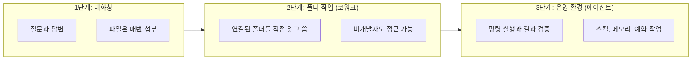
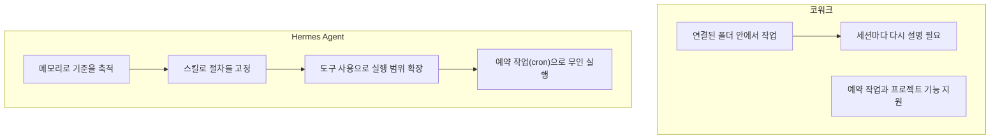
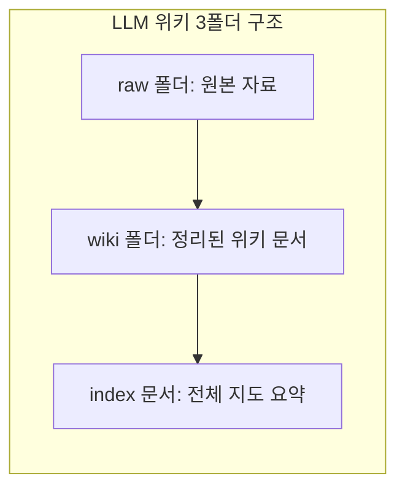

> 
> https://www.facebook.com/share/p/197RjtdPxv/
> 
> 코워크 이후, 작업은 어디로 옮겨가고 있는가
> 
> 요즘 AI 도구를 쓰다 보면, 예전에는 분명했던 역할 구분이 조금씩 달라지고 있다는 것을 느낍니다. 채팅으로 묻고 답하던 단계에서, 이제는 파일을 읽고 실행하고 반복 작업을 맡기는 단계로 넘어가고 있습니다.
> 
> 최근 한 사용자가 이런 말을 했습니다.
> 
> “연초에는 코워크와 코드 사용이 1:1 수준이었는데, 이제는 거의 코드만 쓰고 코워크가 하던 일은 Hermes Agent로 전부 이관해 자동화했다. 현재 시점에서 코워크는 포지션이 애매하고, 모델들이 버전업되면서 사용량을 많이 소모하게 되어 더 안 쓰게 된다.”
> 
> 이 발언을 한 개인의 도구 사용 변화로만 치부하면, 그 안에 담긴 더 큰 흐름을 놓치게 됩니다. AI 작업 환경의 중심이 어디로 이동하고 있는가입니다.
> 
> 이 말은 코워크가 이제 쓸모가 없어졌다는 뜻이 아닙니다. 또 다시 작업의 방식이 바뀌고 있다고 봅니다.
> 
> 자세한 글 내용은 댓글로 제공합니다.
> 
> [**코워크 이후, 작업은 어디로 옮겨가고 있는가**](https://sshong.com/20804?fbclid=IwZnRzaAS6RoZwZG9mA2V4dG4DYWVtAjExAHNydGMGYXBwX2lkCjY2Mjg1NjgzNzkAAR7CTEhEP6ozVXSIPOrQTUy5dyzFG4yV0mAFzIq73846eixhUt1W6Trk2uM8Hg_aem_LMgiHqKPAVeQrzaiBdetXQ)

## 목차

1. 이 문서에 대하여
2. 원문 기본 정보
3. 원문이 전하는 핵심 메시지
4. 세 단계로 본 AI 작업 환경의 이동
5. 코워크란 무엇이며 지금 어떤 상태에 있는가
6. Hermes Agent란 무엇인가
7. 코워크와 Hermes Agent, 은유로 본 차이
8. 옵시디언과 LLM 위키 — 카파시가 제안한 패턴
9. 모델 사용량과 작업 구조의 관계
10. 원문 주장에 대한 사실 확인과 균형 잡힌 시각
11. 같은 저자의 후속 글 — Hermes Agent는 어떻게 사용자를 배우는가
12. 정리 — 강의 자료로 가져갈 수 있는 것들
13. 참고 자료

---

## 1. 이 문서에 대하여

이 문서는 홍순성(홍스랩)이 2026년 7월 7일에 발행한 글 "코워크 이후, 작업은 어디로 옮겨가고 있는가"의 내용을 풀어서 설명하고, 그 안에 언급된 도구와 개념을 실제 공식 자료와 최신 보도로 다시 검증한 결과를 담고 있습니다. 원문은 짧은 에세이 형식으로 쓰여 있어서 코워크, Hermes Agent, 옵시디언, LLM 위키 같은 용어를 이미 아는 독자를 전제로 서술합니다. 이 해설에서는 그 용어들을 하나씩 풀어 설명하고, 원문이 내린 판단이 현재 시점의 공개 정보와 얼마나 일치하는지도 함께 짚었습니다.

원문 자체를 그대로 옮기기보다는 각 주장의 근거를 확인하고, 필요한 경우 반대되는 자료도 함께 제시하는 방식으로 정리했습니다. 막연한 추측이나 과장된 해석은 배제했고, 확인되지 않은 부분은 확인되지 않았다고 명시했습니다.

## 2. 원문 기본 정보

원문은 홍순성이 운영하는 블로그 HONGS LAB에 게재되었으며, 발행일은 2026년 7월 7일입니다. 저자 소개에 따르면 홍순성은 경희사이버대학교에서 AI콘텐츠제작실무를 강의하는 교수이자 AI 컨설턴트로, 지난 17년간 500여 개 기업을 대상으로 교육과 컨설팅을 진행했고 『월 20달러로 비즈니스 글쓰기 with 챗GPT』를 비롯한 다수의 저서를 집필했습니다. 원문은 "코워크", "AI트렌드", "헤르메스에이전트"라는 세 개의 태그가 붙어 있으며, 같은 날 발행된 후속 글 "Hermes Agent는 어떻게 사용자의 작업 방식을 배워 가는가"와 짝을 이루는 구조로 되어 있습니다. 원문의 도입부에는 한 사용자의 발언이 인용되어 있는데, 연초에는 코워크와 코드 사용 비중이 비슷했지만 지금은 코드 위주로 옮겨갔고 코워크가 하던 일은 Hermes Agent로 이관해 자동화했다는 내용입니다. 이 발언 하나를 실마리 삼아 글 전체가 전개됩니다.

## 3. 원문이 전하는 핵심 메시지

원문의 논지는 코워크가 쓸모없어졌다는 것이 아니라, AI 작업의 무게중심이 이동하고 있다는 것입니다. 저자는 이 이동을 세 단계로 그립니다. 처음에는 대화창에서 질문하고 답을 받는 방식이었고, 그다음에는 코워크처럼 폴더를 연결해 파일을 읽고 쓰는 방식으로 넘어갔으며, 지금은 상시로 돌아가면서 명령을 실행하고 결과를 검증하는 운영형 에이전트 환경으로 다시 옮겨가고 있다는 것입니다. 저자는 코워크를 "지금 연결한 폴더에서 일하는 손"에 비유하고, Hermes Agent를 "반복되는 작업 방식을 기억하고 다시 실행하는 운영자"에 비유합니다. 이 비유가 원문 전체를 관통하는 핵심 이미지입니다.

저자는 또한 이 변화의 배경에 두 가지 요인이 있다고 봅니다. 하나는 작업이 반복될수록 대화창이나 폴더 연결만으로는 부족해지고 절차와 스킬이 필요해진다는 점이고, 다른 하나는 모델이 발전할수록 한 번의 작업에서 처리하는 맥락과 추론이 늘어나면서 사용량 소모가 커지고, 그 결과 매번 같은 내용을 반복 입력하는 방식이 비효율적으로 변한다는 점입니다. 이 두 요인이 겹치면서 옵시디언과 LLM 위키 같은 외부 기억 장치, 그리고 스킬로 정리된 절차의 가치가 커진다는 것이 저자의 결론입니다.

## 4. 세 단계로 본 AI 작업 환경의 이동

원문이 그리는 이동 과정을 도식으로 정리하면 다음과 같습니다.

1단계에서는 AI가 답변자 역할에 머뭅니다. 사람이 파일을 올리고, 필요한 부분을 다시 요청하고, 결과를 대화창에서 받는 구조입니다. 2단계에서는 옵시디언 폴더 같은 저장 공간을 연결해 AI가 직접 읽고 쓰는 구조가 만들어집니다. 원문은 이 단계에서 코워크가 특히 비개발자에게 의미가 컸다고 설명합니다. 터미널을 몰라도 되고 복잡한 설정 없이 "이 폴더를 읽고 정리해줘"라는 요청만으로 파일 기반 작업을 맡길 수 있었기 때문입니다.

3단계는 원문이 지금 벌어지고 있다고 말하는 이동입니다. 이 단계의 에이전트는 파일을 읽는 데서 그치지 않고 명령을 실행하고, 결과를 확인하고, 오류가 있으면 스스로 수정합니다. 원문은 이것을 "실행과 검증에 가까운 환경"이라고 표현하며, 여기에 스킬 호출, 메모리 유지, 예약 작업까지 하나의 흐름으로 묶이는 것이 Hermes Agent 같은 도구의 특징이라고 설명합니다.

## 5. 코워크란 무엇이며 지금 어떤 상태에 있는가

코워크는 Anthropic이 만든 제품으로, Claude Code를 구동하는 것과 같은 에이전트 아키텍처를 지식노동 전반에 적용한 것입니다. Anthropic 공식 지원 문서에 따르면, 코워크에서 작업을 시작하면 클로드는 요청을 분석해 계획을 세우고, 복잡한 작업은 하위 작업으로 나누며, Anthropic 서버의 격리된 환경에서 코드와 셸 명령을 실행하고, 필요하면 여러 작업 흐름을 동시에 진행한 뒤, 완성된 결과물을 세션에 전달해 사용자가 미리 보고 내려받을 수 있게 합니다. 세션과 파일은 사용자의 클로드 계정에 저장되기 때문에 노트북을 덮어도 작업이 이어지고, 같은 세션을 다른 기기에서 열 수 있습니다. 컴퓨터에 있는 로컬 파일이나 브라우저가 필요한 경우에는 클로드 데스크톱 앱을 통해 접근합니다.

공교롭게도 이 원문이 발행된 바로 그 주에 코워크와 관련된 중요한 발표가 있었습니다. 2026년 7월 7일, Anthropic은 코워크를 웹과 모바일로 확장한다고 발표했습니다. TechCrunch와 VentureBeat의 보도에 따르면, 그동안 데스크톱 앱으로만 제공되던 코워크가 이제 웹과 모바일에서도 동작하며, 작업을 시작한 뒤 노트북을 닫아도 백그라운드에서 계속 실행되고, 사람의 판단이 필요한 지점에서는 휴대폰으로 알림을 보내는 방식으로 바뀌었습니다. 이와 함께 Anthropic은 2026년 5월 11일부터 31일 사이에 60만 개 이상의 조직에서 수집한 120만 건의 코워크 세션 사용 데이터를 공개했는데, 이 데이터에서 소프트웨어 개발 용도의 비중은 전체의 8.7퍼센트에 그쳤고, 가장 큰 비중을 차지한 것은 업무 프로세스 운영(33.4퍼센트)과 콘텐츠 제작 및 카피라이팅(16.4퍼센트)이었습니다. Anthropic은 이런 용도를 "일 주변의 일"이라고 표현하며, 특정 직무의 핵심 업무라기보다 거의 모든 역할에 걸쳐 있는 연결 작업이라고 설명했습니다.

이 발표는 원문이 말하는 "코워크의 포지션이 애매해진다"는 진단과 다소 결이 다른 신호입니다. 이 부분은 10장에서 따로 짚겠습니다.

## 6. Hermes Agent란 무엇인가

Hermes Agent는 Nous Research가 만든 오픈소스 자율 에이전트로, 공식 문서와 GitHub 저장소에 따르면 2026년 2월 25일에 출시되었습니다. Nous Research 공식 소개에 따르면 Hermes Agent는 "코딩 코파일럿도 아니고 챗봇 래퍼도 아닌" 자율 에이전트를 표방하며, 사용할수록 스스로 스킬을 만들고 다듬으며 세션을 넘어 사용자에 대한 이해를 축적하는 "닫힌 학습 루프"를 핵심 구조로 내세웁니다. 이 학습 루프는 SQLite 기반의 전문 검색과 LLM 요약을 활용해 과거 대화를 다시 찾아내는 방식으로 구현되어 있습니다.

기능 구성을 보면 크게 다섯 가지로 나뉩니다. 첫째는 연결성으로, 텔레그램, 디스코드, 슬랙, 왓츠앱, 시그널, 이메일, 명령줄 등 스무 개가 넘는 플랫폼에서 하나의 에이전트와 하나의 기억을 공유하며 대화할 수 있습니다. 둘째는 기억으로, 사용자의 프로젝트와 선호를 학습하고 스킬을 자동으로 생성하며 문제를 풀었던 방식을 잊지 않습니다. 셋째는 예약 실행으로, 자연어로 지정한 일정에 따라 보고서 작성이나 백업, 브리핑 같은 작업을 사람 없이 수행합니다. 넷째는 위임으로, 별도의 대화와 터미널을 가진 하위 에이전트에 작업을 분리해 맡길 수 있습니다. 다섯째는 검색으로, 웹 검색과 브라우저 자동화, 이미지 인식과 생성, 음성 합성, 다중 모델 추론을 함께 지원합니다.

실행 환경도 유연합니다. 로컬, 도커, SSH, Daytona, Singularity, Modal이라는 여섯 개의 터미널 백엔드를 지원하며, 이 중 Daytona와 Modal은 유휴 상태일 때 사실상 비용이 들지 않는 서버리스 방식으로 환경을 유지합니다. 모델 공급자 측면에서는 자체 구독 서비스인 Nous Portal을 통해 클로드, GPT, 제미나이, 딥시크, 큐원, 킴이, GLM, 미니맥스, 그록 등 300개가 넘는 최신 에이전틱 모델에 하나의 OAuth 로그인으로 접근할 수 있고, OpenRouter나 각 사의 API 키를 직접 연결하는 것도 가능합니다.

성장세와 관련해서는 출처마다 시점이 달라 수치가 다르게 보고되고 있다는 점을 밝혀 둘 필요가 있습니다. 2026년 6월에 게재된 Medium 기사(Ewan Mak)는 출시 후 넉 달이 채 안 되는 시점에 18만 개가 넘는 GitHub 스타를 모아 2026년 오픈소스 에이전트 프레임워크 중 가장 빠르게 성장했다고 전했고, 같은 기사는 2026년 6월 2일 데스크톱 앱이 공개 프리뷰(버전 0.15.2)로 출시되어 macOS, 윈도우, 리눅스에서 네이티브로 동작한다고 설명했습니다. 반면 공식 문서 페이지에는 10만 1천 개 이상이라는 수치가 표기되어 있는데, 이는 문서가 캐시된 시점의 차이로 보이며 정확한 실시간 수치는 GitHub 저장소를 직접 확인하는 편이 안전합니다. 참고로 경쟁 관계에 있는 또 다른 오픈소스 에이전트 프레임워크인 OpenClaw는 같은 시기 기준으로 37만 개가 넘는 스타를 보유한 것으로 보도되었고, Hermes Agent는 OpenClaw 사용자의 설정과 기억, 스킬, API 키를 자동으로 감지해 이전해 주는 마이그레이션 기능도 제공합니다.

다만 위 문단에서 다루는 도구 자체의 효용에 대해서는 과장된 기대와 실제 사용 사이에 간극이 있다는 지적도 함께 보도되었습니다. 앞서 인용한 Medium 기사는 석 달 넘게 매일 사용해 본 후기를 통해, 보고서 작성이나 데이터 통합처럼 매일 반복하는 작업에서는 2주 정도 지나면 눈에 띄게 빨라지지만, 한 번뿐인 복합적인 작업에서는 새로 시작하는 인스턴스와 별 차이가 없었다고 밝히고 있습니다. 즉 "쓸수록 똑똑해진다"는 표현은 반복되는 작업 범위 안에서 성립하는 것이지, 모든 작업에 적용되는 일반론은 아니라는 뜻입니다.

## 7. 코워크와 Hermes Agent, 은유로 본 차이

원문이 사용하는 "손"과 "운영자"라는 비유를 실제 제품 구조에 대입해 보면 다음과 같은 그림이 됩니다.

두 제품 모두 파일을 읽고 쓰고, 명령을 실행하고, 예약 작업을 지원한다는 공통점이 있습니다. 실제로 코워크에도 프로젝트 기능이 있어서 관련 작업을 하나의 지속적인 작업공간으로 묶고 자체적인 파일과 지침, 메모리를 유지할 수 있습니다. 다만 원문이 짚는 차이는 미묘합니다. 코워크는 사용자가 매번 작업을 열고 맥락을 설명해야 하는 세션 중심 구조에 가깝고, Hermes Agent는 사용자의 작업 환경과 선호, 검증 기준이 시간이 지날수록 스킬과 메모리 형태로 누적되는 구조에 가깝다는 것입니다. 이 차이는 절대적인 기능 차이라기보다는 각 제품이 강조하는 사용 방식의 차이로 이해하는 편이 정확합니다.

## 8. 옵시디언과 LLM 위키 — 카파시가 제안한 패턴

원문은 "안드레이 카파시가 말한 LLM 위키 패턴"을 언급하며 옵시디언과 함께 이를 작업의 기억 장치로 설명합니다. 이 부분은 실존하는 개념으로, 2026년 4월 3일 안드레이 카파시(전 OpenAI 창립 멤버이자 테슬라 AI 총괄)가 GitHub Gist에 게시한 개인 지식 시스템 구상에서 비롯되었습니다. 여러 매체의 설명을 종합하면 이 구상은 세 개의 폴더로 이루어져 있습니다. 원본 자료를 모아 두는 raw 폴더, LLM이 원본을 압축해 정리한 위키 문서를 모아 두는 wiki 폴더, 그리고 모델의 맥락 창 안에 들어갈 수 있는 크기로 전체 지도를 요약해 두는 index 문서입니다.

기존의 검색 증강 생성(RAG) 방식은 질문이 들어올 때마다 원문 조각을 다시 찾고, 다시 조합하고, 다시 시작합니다. 여러 매체는 이를 "매번 처음부터 다시 깨어나는 기억상실증"에 비유합니다. 반면 카파시가 제안한 방식에서는 원천 자료를 한 번 정리해 위키 페이지로 만들어 두고, 이후 질문에는 이 위키를 읽고 답한 뒤, 답변 자체도 새로운 지식으로 판단되면 다시 위키에 기록해 다음 질문부터 곧바로 활용합니다. 이런 축적 구조 때문에 여러 매체는 이 방식을 "쌓이는 지식"이라고 표현하며, RAG와 달리 매 질문이 독립적이지 않고 이전 지식 위에 쌓인다고 설명합니다.

다만 이 패턴에도 적용 범위에 대한 제한이 따라붙습니다. 카파시 본인이 이 접근을 개인 연구자가 다루는 안정적이고 한정된 지식 총량에 맞춰 제안했다는 설명이 있으며, 별도의 분석 자료는 이 방식이 수백에서 수천 페이지 규모, 토큰으로 치면 대략 5만에서 10만 토큰 이하의 작고 안정적인 개인 지식 기반에서 특히 효과적이라고 정리합니다. 조직 차원의 거버넌스나 대규모 문서 총량에는 RAG나 별도의 관리 계층이 여전히 필요하다는 지적도 함께 나옵니다. 원문이 옵시디언과 LLM 위키를 "작업 환경 자체가 조금씩 정리되는" 장치로 설명하는 것은 이 패턴의 취지와 맞닿아 있지만, 그 효과가 개인 규모의 지식 관리에 특히 적합하다는 전제는 함께 이해할 필요가 있습니다.

## 9. 모델 사용량과 작업 구조의 관계

원문은 최근 모델일수록 한 번의 작업에서 더 많은 맥락을 읽고 더 많은 도구를 쓰며 더 긴 추론을 하기 때문에 사용량 소모가 커지고, 매번 대화창에서 같은 내용을 반복 입력하는 방식은 비용 구조가 맞지 않는다고 말합니다. 이 부분은 특정 수치나 요금 정책을 인용한 것이 아니라 저자의 경험적 판단에 해당하는 서술이어서, 별도로 검증할 만한 공개 통계는 확인되지 않았습니다. 다만 방향성 자체는 업계에서 반복적으로 확인되는 흐름과 일치합니다. Hermes Agent 관련 보도에서도 스킬을 20개 이상 스스로 만든 에이전트가 비슷한 작업을 새 인스턴스보다 40퍼센트 빠르게 처리한다는 수치가 언급되었는데, 이 수치는 출력 품질의 향상이 아니라 토큰 소모량과 처리 시간의 절감을 가리키는 것으로 명시되어 있습니다. 즉 반복 작업에서 절차를 미리 정리해 두면 같은 결과를 더 적은 자원으로 얻을 수 있다는 논리는, 원문이 말하는 "무엇을 위키에 남기고 무엇을 스킬로 고정할지 판단해야 한다"는 주장과 방향이 일치합니다.

## 10. 원문 주장에 대한 사실 확인과 균형 잡힌 시각

원문의 핵심 진단, 즉 "코워크의 포지션이 애매해지고 있다"는 문장은 한 사용자의 개인적 경험을 근거로 삼고 있습니다. 이 진단이 시장 전체의 흐름과 얼마나 일치하는지는 별도로 검토할 필요가 있습니다.

공교롭게도 원문이 발행된 바로 그날, Anthropic은 코워크를 데스크톱 전용에서 웹과 모바일로 확장한다고 발표했습니다. 이 발표는 코워크가 축소되거나 애매한 위치로 밀려나는 신호라기보다는, 오히려 Anthropic이 코워크를 더 넓은 사용자층으로 밀어붙이고 있다는 신호에 가깝습니다. Anthropic은 이 발표와 함께 2026년 8월 5일까지 코워크 사용 한도를 두 배로 늘리는 프로모션도 함께 진행한다고 밝혔습니다. 또한 공개된 사용 데이터에서 소프트웨어 개발 비중이 전체의 8.7퍼센트에 불과하고 업무 프로세스 운영과 콘텐츠 제작이 절반 가까이를 차지한다는 점은, 코워크가 개발자보다 비개발자 지식노동자를 겨냥한 제품으로 자리잡고 있다는 Anthropic의 전략과 일치합니다.

이 지점에서 원문의 진단과 공식 발표 사이에는 관점의 차이가 있습니다. 원문은 개인 사용자의 반복적이고 전문화된 작업 흐름(글쓰기, 위키 관리, 검증 절차)을 기준으로 코워크의 역할이 줄어든다고 보는 반면, Anthropic의 데이터는 조직 전체에서 코워크가 다루는 "일 주변의 일"의 총량이 늘어나고 있다는 것을 보여줍니다. 두 관점은 서로 모순되지 않습니다. 코워크가 겨냥하는 사용자층(정기적으로 반복되지 않는 다양한 업무를 처리하는 일반 지식노동자)과 원문의 화자가 속한 사용자층(글쓰기와 위키 관리처럼 매우 반복적이고 전문화된 절차를 가진 1인 운영자)은 애초에 다른 층위일 가능성이 높습니다. 즉 원문의 주장은 "코워크가 시장에서 위축되고 있다"는 뜻이 아니라 "특정 유형의 반복 작업에서는 코워크보다 상시형 에이전트가 더 잘 맞는다"는 뜻으로 좁혀서 읽는 것이 정확합니다. 원문 스스로도 마지막 문단에서 "코워크가 사라졌다는 뜻은 아니다"라고 분명히 선을 긋고 있다는 점도 이 해석을 뒷받침합니다.

또한 코워크에는 이미 예약 작업과 프로젝트 기능이 포함되어 있어서, 원문이 Hermes Agent만의 장점으로 제시하는 "세션을 넘어선 기억"과 "무인 실행"의 일부는 코워크에서도 어느 정도 구현되어 있습니다. 다만 코워크의 예약 작업과 프로젝트 기능은 Anthropic 서버에서 관리되는 반면, Hermes Agent는 사용자가 직접 호스팅하는 오픈소스 구조라는 점에서 통제권의 위치가 다릅니다. 이 차이는 기능의 우열이 아니라 운영 주체의 차이로 이해하는 것이 맞습니다.

## 11. 같은 저자의 후속 글 — Hermes Agent는 어떻게 사용자를 배우는가

원문과 같은 날 발행된 후속 글 "Hermes Agent는 어떻게 사용자의 작업 방식을 배워 가는가"는 원문에서 다루지 않은 세부 사항을 보완합니다. 이 글은 Hermes Agent의 학습이 사용자 몰래 모델이 재훈련되는 방식이 아니라, 작업 과정에서 생긴 취향과 기준, 절차, 환경 정보를 메모리와 스킬로 남기고 다음 작업에서 다시 불러오는 구조라고 설명합니다. 저자는 메모리와 스킬의 역할을 분명히 구분합니다. 메모리는 사용자의 문체 기준이나 자주 쓰는 폴더 경로처럼 오래 지속되는 기본값을 담는 곳이고, 오늘 처리한 파일명처럼 금방 바뀌는 정보는 메모리에 넣지 않는 편이 낫다고 강조합니다. 스킬은 블로그 글쓰기나 강의안 작성처럼 반복되는 작업 순서를 절차로 고정하는 역할을 합니다.

이 후속 글은 또한 사용자가 에이전트에게 요청하는 방식이 학습 품질을 좌우한다고 말합니다. "이 초안을 다듬어줘"라고만 말하는 것보다 "내 문체 기준을 적용하고, 반복해서 쓸 기준이 보이면 메모리나 스킬 후보로 알려달라"고 요청하는 편이 에이전트를 단순 편집자가 아니라 사용자의 반복 작업 기준을 정리하는 파트너로 움직이게 만든다는 것입니다. 아울러 에이전트의 자율성이 무제한 권한을 뜻하지는 않으며, 삭제나 외부 발송, 서비스 설정 변경처럼 영향이 큰 작업은 범위를 확인받아야 안전하다는 점도 분명히 짚고 있습니다.

## 12. 정리 — 강의 자료로 가져갈 수 있는 것들

이 두 편의 글을 함께 읽으면, AI 작업 환경에 대한 논의를 세 가지 축으로 정리할 수 있습니다. 첫째는 어디에서 일하는가라는 축으로, 대화창에서 폴더 연결로, 다시 상시형 운영 환경으로 이동하는 흐름입니다. 둘째는 무엇을 기억하는가라는 축으로, 오래가는 취향과 기준은 메모리에, 반복되는 절차는 스킬에, 정리된 지식은 위키에 나누어 담는다는 구분입니다. 셋째는 누가 통제하는가라는 축으로, Anthropic이 운영하는 코워크와 사용자가 직접 호스팅하는 Hermes Agent 사이에서 어느 쪽에 데이터와 실행 권한을 둘 것인지를 정하는 문제입니다.

강의 자료로 정리할 때는 원문의 개인적 경험담을 시장 전체의 결론으로 일반화하지 않는 것이 중요합니다. 코워크의 웹·모바일 확장과 사용량 데이터가 보여주듯, 코워크는 여전히 확장되고 있는 제품이며 원문이 말하는 "포지션의 애매함"은 특정 유형의 반복적·전문화된 작업 흐름에 한정해서 이해하는 것이 사실에 더 가깝습니다. 동시에 메모리와 스킬, 예약 작업을 축으로 삼아 반복 작업을 절차화한다는 원문의 방법론적 제안 자체는, 코워크를 쓰든 Hermes Agent를 쓰든 다른 어떤 에이전트를 쓰든 그대로 적용할 수 있는 유용한 틀입니다.

## 13. 참고 자료

- 홍순성, "코워크 이후, 작업은 어디로 옮겨가고 있는가", HONGS LAB, 2026년 7월 7일, https://sshong.com/20804
- 홍순성, "Hermes Agent는 어떻게 사용자의 작업 방식을 배워 가는가", HONGS LAB, 2026년 7월 7일, https://sshong.com/20829
- Anthropic 지원 센터, "Claude Cowork 시작하기", https://support.claude.com/en/articles/13345190-get-started-with-claude-cowork
- Anthropic, "Claude Cowork" 제품 페이지, https://www.anthropic.com/product/claude-cowork
- TechCrunch, "The coding agent wars are spilling into the rest of the office: Claude Cowork", 2026년 7월 7일, https://techcrunch.com/2026/07/07/the-coding-agent-wars-are-spilling-into-the-rest-of-the-office-claude-cowork/
- VentureBeat, "Anthropic brings Claude Cowork to mobile and web as usage data shows most users aren't coding", 2026년 7월 7일, https://venturebeat.com/technology/anthropic-brings-claude-cowork-to-mobile-and-web-as-usage-data-shows-most-users-arent-coding
- 9to5Mac, "Anthropic expanding Claude Cowork to mobile and web, details here", 2026년 7월 7일, https://9to5mac.com/2026/07/07/anthropic-expanding-claude-cowork-to-mobile-and-web-details-here/
- Nous Research, Hermes Agent 공식 문서, https://hermes-agent.nousresearch.com/docs/
- Nous Research, Hermes Agent 공식 사이트, https://hermes-agent.nousresearch.com/
- GitHub, NousResearch/hermes-agent 저장소, https://github.com/nousresearch/hermes-agent
- Ewan Mak, "Hermes Agent Desktop App: Everything You Need to Know", Medium, 2026년 6월, https://medium.com/@tentenco/hermes-agent-desktop-app-everything-you-need-to-know-about-nous-researchs-self-improving-ai-agent-3cb59bd31e5f
- Atlan, "LLM Wiki vs RAG: The Karpathy Concept and Enterprise Reality", https://atlan.com/know/llm-wiki-vs-rag-knowledge-base/
- MindStudio, "Where RAG Breaks Down: The Karpathy LLM Wiki Alternative", https://www.mindstudio.ai/blog/karpathy-llm-wiki-pattern-knowledge-base-without-rag
- Agent Skills 공식 문서, https://agentskills.io/home

---

*이 문서는 2026년 7월 8일 기준으로 공개된 자료를 근거로 작성되었습니다. 특히 코워크의 웹·모바일 확장 소식과 Hermes Agent의 성장 지표처럼 시점에 따라 빠르게 바뀌는 내용은, 이후 시점에는 다시 확인이 필요할 수 있습니다.*
