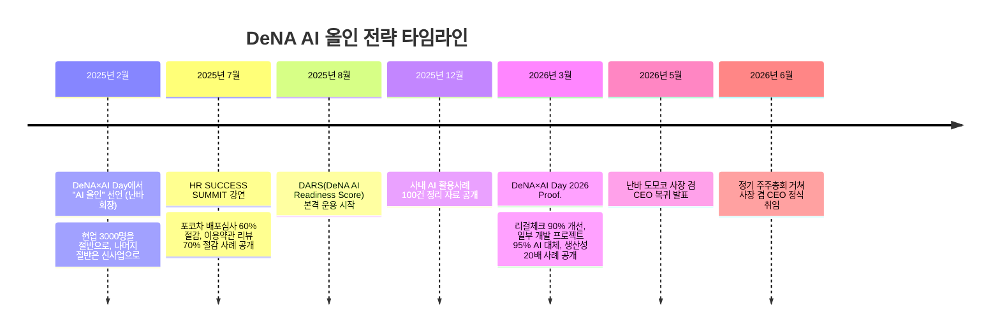
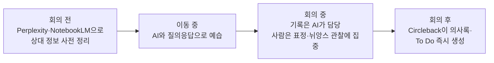
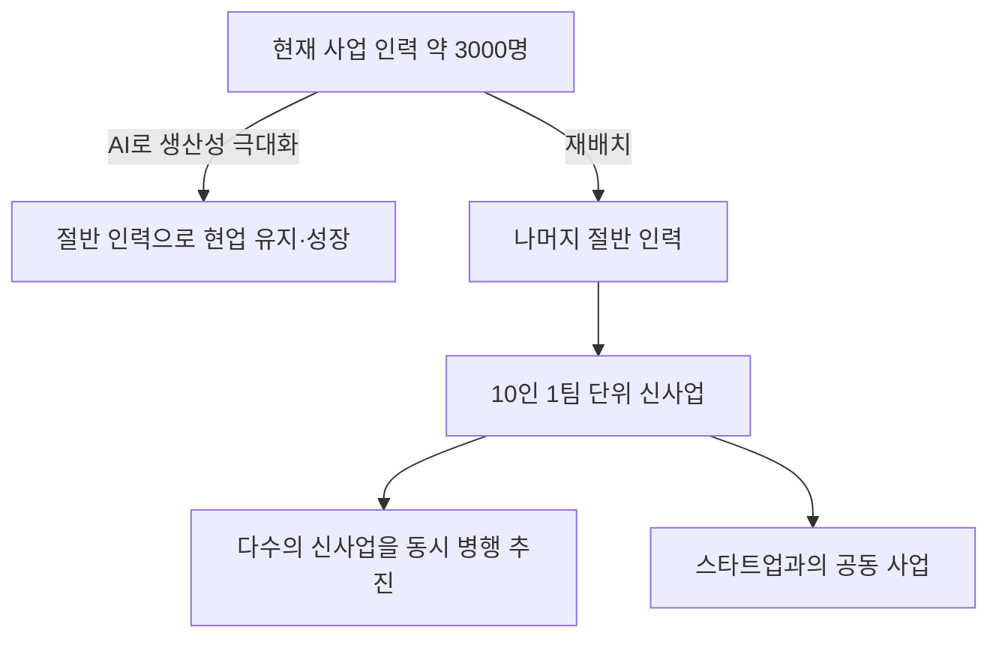

## 관련글

[**5년 만에 복귀한 사장이 첫날 한 일: "회사 OS를 AI로 갈아엎어라"**](https://www.facebook.com/share/p/1PkWtm6jNh/)

## 개요

2026년 5월 12일, 일본의 인터넷·게임 기업 디엔에이(DeNA)는 창업자이자 대표이사 회장인 난바 도모코(南場智子, 64세)가 대표이사 사장 겸 CEO로 복귀한다고 발표했다. 정식 발효일은 2026년 6월 27일에 열린 제28기 정기 주주총회 직후였다. 기존 사장 겸 CEO였던 오카무라 신고(岡村信悟)는 대표권을 가진 회장으로 자리를 옮겨, 정부·지자체·업계 단체 등 대외 창구 역할을 맡게 되었다.

난바 사장의 복귀는 여러 겹의 의미를 지닌다. 그는 1999년 DeNA를 창업했고, 2011년 남편의 간병을 이유로 사장직에서 물러나 비상근 이사가 되었다. 이후 2021년 4월부터는 오카무라 사장과 '2인 체제'로 경영에 관여해왔고, 이번에 사장직에 복귀함으로써 사장으로서는 15년 만, 상근 임원으로서는 2021년 이후 5년 만에 경영 최전선에 다시 선다. DeNA 공식 설명에 따르면 이번 인사의 배경은 "경영 속도를 비약적으로 높이고, 미래의 사업 환경을 전제로 한 조직 운영·사업 모델로의 변혁을 조속히 진행할 필요가 있다"는 판단이었다. 도요게이자이 온라인 인터뷰에서 난바 사장 본인은 "회사를 제로부터 다시 만들 생각으로, 3년을 목표로 조직 개혁을 이뤄내고 싶다"고 밝혔다.

여기서 한 가지 짚어야 할 사실이 있다. 흔히 이번 복귀와 "AI 올인" 선언이 같은 시점의 일처럼 이야기되지만, 실제로는 시간 순서가 다르다. "AI 올인" 선언은 난바 도모코가 아직 회장이던 2025년 2월 5일, 자사 행사 'DeNA×AI Day'(DeNA TechCon 2025)의 개막 연설에서 나온 것이다. 즉 그는 사장으로 돌아오기 약 1년 4개월 전에 이미 "DeNA는 AI에 올인합니다"라고 선언했고, 그 선언을 실행에 옮기는 과정에서 조직 변화의 속도를 더 끌어올리기 위해 스스로 다시 사장 자리에 앉는 길을 택한 것에 가깝다. 이 글은 이 시간 순서를 정확히 짚으면서, 2025년 2월부터 2026년 7월 현재까지 DeNA가 실제로 추진해 온 AI 전환의 내용을 정리한다.

## 복귀의 배경: 주춤한 성장, 그리고 창업자의 결단

난바 회장은 2026년 5월 12일 결산 설명회에서 "시장으로부터 '성장 기업'으로 보이고 있는가 하는 점에서 분한 마음이 있다"고 속내를 밝혔다. DeNA의 주가는 그가 사장직에서 물러난 직후인 2011년에 기록한 최고치를 아직 회복하지 못한 상태다. 2020년 3월기에는 상장 이후 처음으로 적자를 기록했는데, 2010년에 인수한 미국 게임사 ngmoco의 영업권 손상과 포켓몬과 공동 개발한 '포켓몬 마스터즈'의 부진이 주요 원인이었다. 이후 2021년부터 오카무라·난바 2인 체제로 게임 사업 재건과 신규 사업 육성을 병행해왔지만, 라이브 스트리밍(포코차 등)과 헬스케어(켄콤 등) 신사업이 기대만큼 스케일업되지 못했다는 것이 니혼게이자이신문 등의 분석이다.

난바 사장은 이런 상황에서 "창업자가 돌아와서 기간을 정해 '해내겠다'고 하고 밀어붙이면 어떨까 하는 논의 끝에 결정했다"고 복귀 이유를 설명했다. 그동안 오카무라 사장과 중요한 의사결정은 함께해왔지만, 앞으로는 자신이 직접 집행 책임자가 되어 조직을 재설계하겠다는 뜻이다.

## "AI 올인" 선언의 타임라인

아래는 공개된 발언과 보도를 바탕으로 정리한 시간 흐름이다.

이 흐름에서 알 수 있듯, "사장 복귀 첫날 AI로 회사를 갈아엎으라고 지시했다"는 식의 서사보다는, 이미 1년 넘게 진행해 온 AI 전환 프로젝트의 성과와 한계를 스스로 확인한 창업자가, 그 다음 단계—인력 재배치와 조직 구조 자체의 변화—를 밀어붙이기 위해 경영의 최전선으로 복귀했다고 보는 편이 사실에 더 가깝다.

## 경영자가 먼저 쓴다: 난바 사장의 AI 활용 방식

난바 사장이 여러 강연과 인터뷰에서 반복해 강조하는 것은 "경영자 자신이 AI에 흥분하고 있는가"라는 질문이다. IT 부서가 도구를 골라 현장에 배포하는 방식이 아니라, 최고경영자 본인이 회의 준비, 자료 작성, 투자 판단에 AI를 일상적으로 쓰고 그 경험을 조직에 전파하는 방식을 택하고 있다는 것이다.

공개된 강연과 보도를 종합하면 그가 실제로 쓰는 도구와 용도는 다음과 같이 정리된다.

| 목적 | 사용 도구 | 활용 방식 |
|---|---|---|
| 초면 상대 사전 조사 | Perplexity | 상대의 발언·기사·SNS 이력을 검색해 필독 자료 목록을 받음 |
| 자료 요약·정리 | NotebookLM | Perplexity로 모은 URL을 업로드해 핵심을 빠르게 파악 |
| 이동 중 예습 | 챗봇 대화 | 택시 이동 중 상대의 정치적 견해, 업계 인식 등을 질의응답 형태로 예습 |
| 회의록 자동화 | Circleback | 참석자 동의를 얻은 회의에 한해 자동 녹음·요약·할 일 목록 생성 |
| 투자·전략 판단 | Deep Research(Google) | 사업·재무·시장 정보를 짧은 시간에 정리해 M&A나 신사업 판단에 활용 |
| 프로토타입 제작 | Create XYZ, Cursor 등 | 비개발자도 몇 시간 안에 웹사이트나 서비스 시제품을 만들어 봄 |
| 일상 업무 보조 | 사내 커스터마이징 AI 에이전트(Slack 연동) | 할 일 리마인드, 그룹 채팅에서 자발적으로 업무를 맡아 처리 |

이 가운데 Circleback을 이용한 회의록 자동화는 "정보 유출 방지를 위한 사전 동의"와 "요약 공유 범위 결정"이라는 절차를 반드시 거친 뒤 도입한다는 점이 여러 매체에서 공통적으로 확인된다. 난바 사장은 "회의가 끝나면 곧바로 의사록이 있는 상태"가 되어 논의의 누락이나 특정인 의존을 줄일 수 있었고, 동시에 의사결정 속도와 질이 함께 올라갔다고 말한다.

## 회의 전·중·후를 바꾼 워크플로

DeNA가 공식적으로 소개하는 회의 문화 변화는 다음과 같은 흐름을 갖는다.

이 워크플로의 핵심은 단순한 "기록 자동화"가 아니라, 사람의 주의력을 관찰과 판단에 온전히 쓰도록 재배치하는 데 있다. 난바 사장은 자신의 업무 특성을 "매주 낯선 사람을 만나는 일이 유독 많고, 직전에야 준비하는 습관이 있다"고 설명하며, 이런 습관이 AI 도구들과 결합했을 때 특히 효과가 크다고 말한다.

또한 신규 기획을 논의할 때는 "기획서 대신 프로토타입을 보여 달라"는 요구가 새로운 회의 문화로 자리잡았다는 점도 여러 강연에서 확인된다. 종이 기획서로는 서로의 이미지에 차이가 생기기 쉽지만, 프로토타입이 있으면 즉시 이미지를 공유하고 실제 사용해 본 느낌까지 검증할 수 있다는 것이다.

## 숫자로 증명한 성과들

DeNA는 전사 확산에 앞서 특정 영역에서 먼저 성과를 수치화하는 방식을 택했다. 2025년 7월 HR SUCCESS SUMMIT 강연과 2026년 3월 'DeNA×AI Day 2026 Proof.' 클로징 세션에서 공개된 수치를 종합하면 다음과 같다.

| 영역 | 내용 | 성과 |
|---|---|---|
| 라이브 스트리밍(포코차) | 배포 심사의 일부에 AI 도입 | 심사 공수 60% 절감 |
| 법무(외부 서비스 이용약관) | AI가 먼저 리뷰하고, 판단이 애매한 경우에만 사람이 대응 | 리뷰 공수 70% 절감 |
| 법무(리걸체크 전반) | 업무 흐름을 AI 전제로 재설계 | 공수 90% 효율화 |
| QA(개발 테스트·품질관리) | AI 기반 검증 프로세스 도입 | 공수 약 50% 절감 |
| 소프트웨어 개발(일부 프로젝트) | Claude Opus 4.5 등장 이후 AI 활용 급증 | 작업의 95%를 AI가 대체, 종전 대비 생산성 20배 사례 |

법무 부문의 사례는 특히 구체적으로 설명되는데, 외부 서비스 이용약관 리뷰 업무에서 "먼저 AI가 검토하고, AI가 판단하기 애매한 경우에만 사람이 대응한다"는 순서로 업무 흐름 자체를 바꾼 결과 70%의 공수 절감이 나왔다고 한다. 반면 QA(품질관리) 영역에서는 요건 정리 → 테스트 분석 → 테스트 설계 → 테스트 구현이라는 공정을 AI에 통째로 맡기면 각 단계의 정확도가 곱해지면서 정확도가 급격히 떨어진다는 점이 사내에서 확인되었고, 이 때문에 공정을 잘게 나누고 중간 산출물마다 사람이 검토할 수 있는 구조로 재편했다는 설명도 함께 나왔다. 즉 DeNA의 성과는 "AI가 똑똑해서" 나온 것이 아니라, 업무 흐름을 어떻게 나누고 어디서 사람이 개입할지를 설계한 결과라는 점이 강조된다.

다만 이런 성과가 모든 프로젝트나 부서에 일률적으로 적용된 수치는 아니라는 점은 분명히 해둘 필요가 있다. 각 수치는 특정 업무·특정 부문에서 관측된 사례이며, 전사 평균치로 발표된 것은 아니다.

## AI 활용도를 평가 제도에 넣다: DARS

DeNA는 전사적인 AI 활용 능력을 끌어올리기 위해 자체 지표인 'DARS(DeNA AI Readiness Score)'를 만들어 2025년 8월부터 본격 운용하고 있다. DARS는 AI 도구 숙련도를 레벨 1부터 5까지 5단계로 정의한다.

- **레벨 1**: 기본적인 이용이 가능하며, 지시를 받으면 AI 도구를 쓸 수 있는 단계
- **레벨 5**: AI를 구사하여 개인의 퍼포먼스는 물론 조직 전체의 생산성과 성과를 비약적으로 향상시킬 수 있는 단계

DeNA가 강조하는 것은 단순히 "AI 도구를 안다"가 아니라 "AI 도구를 실제로 '다 써먹어서' 자신의 업무 성과, 나아가 조직 전체의 성과에 얼마나 기여했는가"라는 실적이 레벨 산정의 기준이 된다는 점이다. 평가는 사원과 상사가 협의해 스스로 신고하는 '신고제'를 채택했지만, 뒷단에서는 데이터를 기반으로 신고의 타당성을 점검할 수 있는 구조를 마련해 두었다. 인사 부문이 전사에 공통되는 추상적인 레벨 정의를 내리고, 각 조직이 자신의 직무에 맞게 구체적인 기준을 보완하는 이원적 구조다.

DeNA는 2025년도 말까지 일부 불가피한 협업 조직을 제외한 전사가 'DARS 조직 레벨 2'(구성원의 50% 이상이 개인 레벨 2 이상)에 도달하는 것을 목표로 제시했으며, 2025년 10월 시점의 달성 상황은 공개되지 않았으나 담당 임원은 "무리한 목표는 아니다"라고 밝힌 바 있다.

## 자신의 경영 판단을 AI에 담아 조직에 공유하는 시도

DeNA 공식 미디어 '풀스윙(フルスイング)'에 실린 난바 회장의 2025년 7월 강연에 따르면, 사업본부장이나 자회사 대표들이 자신의 사고방식과 경영 판단 기준을 AI에 학습시켜, 사원들이 언제든 그 AI에게 질문할 수 있도록 만드는 서비스를 도입한 사례가 소개되었다. 이 서비스를 도입한 한 자회사 대표는 "자신의 생각을 AI에 인스톨하는 과정에서, 평소 자신의 생각이 얼마나 정리되어 있지 않았는지 깨달았다"고 말했고, 부수적으로 "경영 방침에 일관성이 생겼다"는 효과도 있었다고 전해진다. 현장 사원들 입장에서도 리더의 생각을 언제든 확인할 수 있어 편리하다는 반응이 있었다고 한다.

이 사례는 난바 사장 개인의 발언을 학습시킨 것이라기보다, DeNA 내 여러 사업본부장·자회사 대표들이 각자 자신의 판단 기준을 AI화한 사례라는 점에서, "사장의 판단 기준이 조직 전체에 하나로 배포된다"기보다는 "리더 각자가 자신의 사고를 AI로 형식화하는 문화가 조직 곳곳에 퍼지고 있다"고 보는 편이 실제 사례에 더 가깝다.

## "AI 올인"의 본질: 인력 감축이 아니라 재배치

난바 사장이 2025년 2월 강연에서 제시한 구도는 명확하다. 약 3,000명이 담당하는 현재 사업을, 아주 소박한 목표라며 절반의 인원으로 유지가 아니라 성장시키고, 나머지 절반의 인력은 신규 사업으로 돌린다는 것이다. 신규 사업은 하나의 거대 프로젝트가 아니라 "10명이 한 팀을 이뤄 유니콘을 양산한다"는 이미지로 다수의 사업을 동시에 추진하는 방향이다. DeNA는 이 목표 영역을 생성형 AI 산업 구조 중에서도 '애플리케이션 레이어'로 설정하고 있다.

## 효율화의 역설: "여백은 저절로 신사업으로 흘러가지 않는다"

2026년 3월 6일 'DeNA×AI Day 2026 Proof.' 클로징 세션에서 난바 회장은 매우 솔직한 1년 결산을 내놓았다. 앞서 정리한 대로 리걸체크 90% 절감, QA 50% 절감, 포코차 심사 60% 절감, 개발 프로젝트 일부 95% AI 대체 같은 효율화 자체는 분명히 성공했다는 것이다. 그러나 정작 목표로 삼았던 "신규 사업으로의 인력 이동"은 생각만큼 진행되지 않았다고 그는 인정했다.

이유는 이렇다. 업무 하나에 걸리는 공수가 줄어들면, DeNA 구성원들은 그렇게 생긴 여유 시간에 "예전부터 하고 싶었지만 할 수 없었던 일"을 스스로 채워 넣는다. 남는 시간이 생겼다고 자발적으로 "저는 이 역할에서 빠지겠습니다"라고 말하는 사람은 거의 없고, 오히려 다음 일을 알아서 가져가 버린다는 것이다. 난바 회장은 이를 두고 "DeNA의 구성원은 매우 성실하다. 일본인은 대체로 그런 경향이 있다고 생각한다"고 평했다.

이 현상은 1865년 영국 경제학자 윌리엄 스탠리 제번스가 『석탄 문제』에서 제시한 '제번스의 역설'—증기기관의 효율이 높아지면 석탄 소비가 줄어들 것 같지만, 실제로는 활용 범위가 넓어지면서 총소비량이 오히려 늘어나는 현상—과 구조적으로 닮아 있다는 해설이 여러 경영·조직 평론에서 언급되고 있다.

이 문제에 대한 DeNA의 대응은 두 가지로 요약된다. 첫째, 남바 회장 스스로 "사람을 먼저 움직이는" 다소 거친 리더십이 필요하다고 밝혔다. 효율화로 생긴 여유가 자연스럽게 신사업으로 흘러가길 기다리기보다, 대담한 인력 이동을 먼저 결정하고 그 안에서 일하게 만드는 방식이다. 둘째, 인사 부문의 제안으로 매니저의 평가 지표에 '인재 배출'을 포함시키는 방향을 추진하고 있다. 즉 관리자가 부하 직원을 AI로 여유롭게 만든 뒤 신사업으로 얼마나 내보냈는지를 평가 대상으로 삼겠다는 것이다. 실제로 니혼게이자이신문은 2026년 5월 30일 보도에서, DeNA가 2026년도부터 관리직을 대상으로 부하 직원의 이동을 독려하는 행동 지침을 마련했다고 전했다.

## 정리: 창업자가 다시 경영 최전선에 선 이유

이번 복귀와 관련해 확인되는 사실을 종합하면 다음과 같이 정리할 수 있다.

- 난바 도모코의 "AI 올인" 선언은 2025년 2월, 그가 아직 회장이던 시절에 이루어졌으며, 2026년 6월 사장 복귀는 그로부터 약 1년 4개월 뒤에 일어난 별개의 사건이다.
- 사장 복귀는 정확히는 "15년 만"이다(2011년 사장직 사퇴, 2026년 복귀). 다만 상근 임원으로서는 2021년 이후 5년 만의 일이기도 하다.
- 2025년 2월부터 2026년 3월까지 약 1년간 DeNA는 법무·QA·라이브 스트리밍 심사·소프트웨어 개발 등 여러 영역에서 구체적인 효율화 수치를 공개했고, 이를 뒷받침하기 위해 DARS라는 자체 평가 지표를 만들어 전사에 적용했다.
- 효율화 자체는 성공했지만, 그로 인해 생긴 인력 여유가 애초 목표였던 신규 사업으로 자연스럽게 흘러가지는 않았다는 점을 경영진 스스로 인정했고, 이 문제를 풀기 위해 인사 평가 제도 변경과 보다 적극적인 톱다운 리더십이 필요하다는 결론에 도달했다.
- 난바 사장의 복귀는 이 두 번째 단계—효율화로 만든 여백을 실제 조직 재편과 인력 재배치로 연결시키는 단계—를 창업자 스스로 진두지휘하기 위한 결정으로 볼 수 있다.

## 참고 자료

- ITmedia NEWS, "DeNA、南場智子氏が社長兼CEOに復帰へ" (2026.5.12)
- 니혼게이자이신문(日本経済新聞), "DeNA、南場智子会長が15年ぶり社長復帰 事業モデル変革へCEO兼任" (2026.5.12)
- 니혼게이자이신문, "南場氏DeNA社長復帰、AI全振りで第2の創業 野球以外は多角化不発" (2026.5.14)
- 니혼게이자이신문, "DeNA社長復帰の南場智子氏、「AI全振り」の覚悟 新事業に人材移動" (2026년 5월경)
- 도요게이자이 온라인(東洋経済オンライン), "DeNA南場氏｢15年ぶり社長電撃復帰｣に至った必然" (2026.5월경)
- 풀스윙 by DeNA(フルスイング by DeNA), "DeNA南場智子が語る「AI時代の会社経営と成長戦略」全文書き起こし" (2025.2.5 강연 기록)
- 풀스윙 by DeNA, "DeNAが挑む「AIネイティブカンパニー」への全社的取り組み" (2025.7.10 HR SUCCESS SUMMIT 강연 기록)
- 풀스윙 by DeNA, "DeNA南場智子「先に動かし、事業を広げる」スピーチ全文書き起こし" (2026.3.6 DeNA×AI Day 2026 클로징 강연 기록)
- ITmedia AI+, "「AIにオールイン」宣言から1年、DeNA南場会長が明かす進捗 「効率化は進んだ。ところが……」" (2026.3.9)
- 니혼게이자이 크로스트렌드(日経クロストレンド), "南場会長の号令でDeNAが全社員のAIスキルを可視化 LINEヤフーは義務化" (2025.10.6)
- 니혼게이자이 크로스테크 Active, "南場会長の大号令で全社員がAI人材化するDeNA、独自の指標でスキル評価" (2026.1.28)
- DeNA Engineering Blog, "DeNA 品質管理部門が挑むAI化戦略" (2025.12.2)
- 로그미 비즈니스(ログミーBusiness), "「経営者がAIに興奮しているかがポイント」 DeNA南場会長が語る、10人でユニコーンを作る時代とは" (2025.2월경)
- 일본어 위키백과, "南場智子" 항목

---

작성일: 2026년 7월 9일
