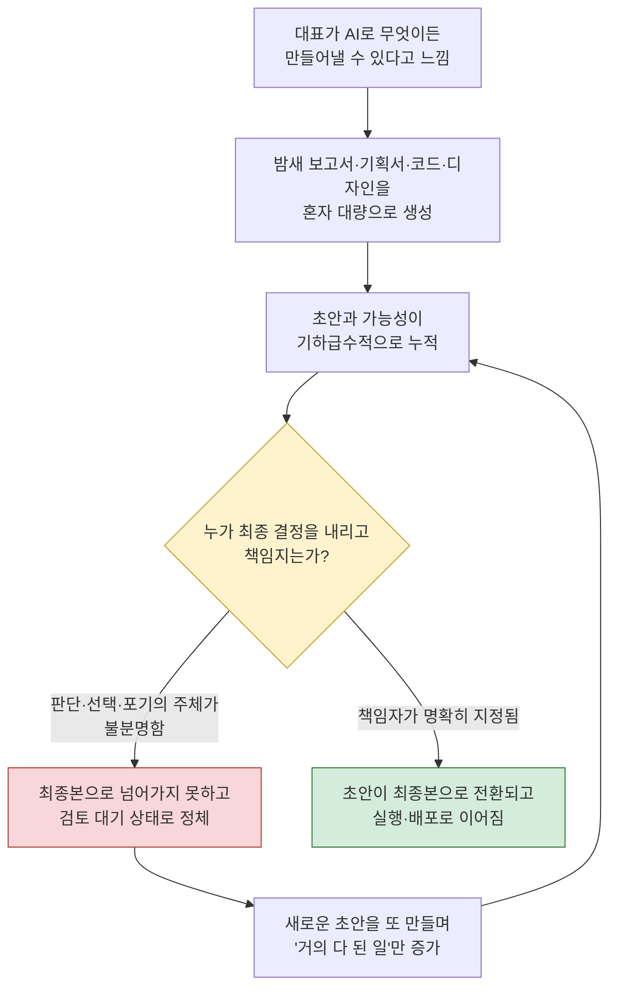
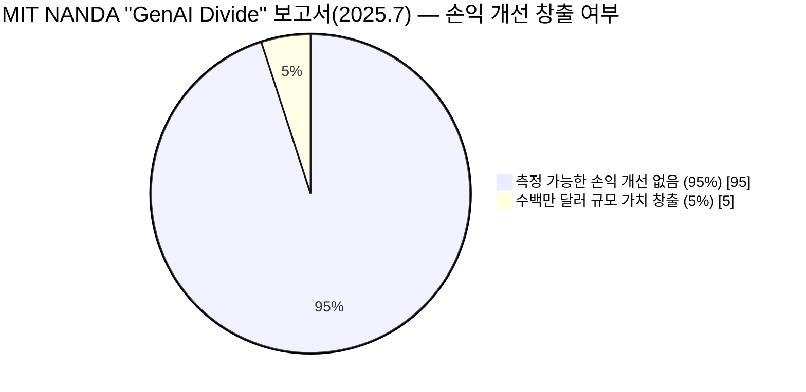
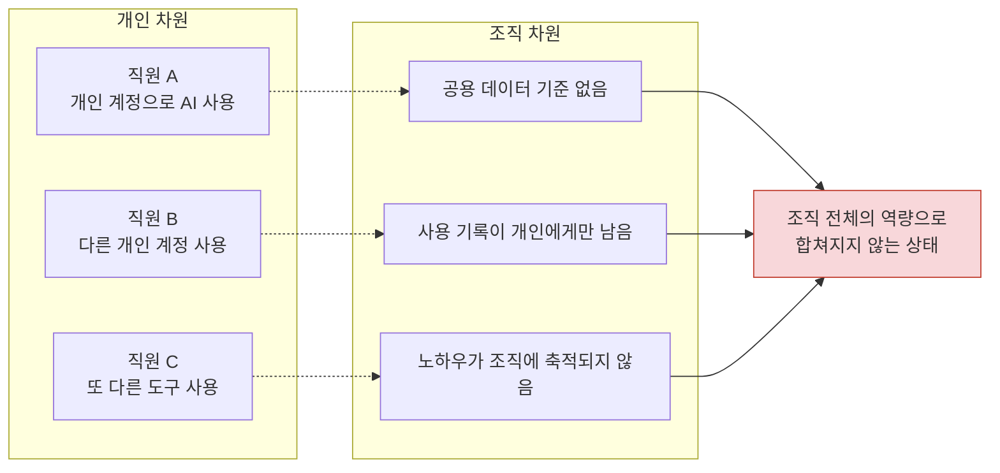
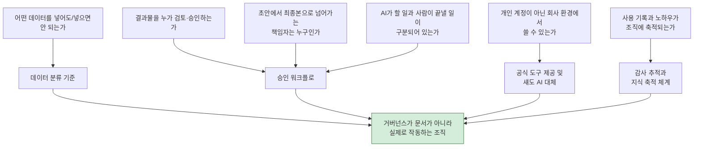

- 원문: 2026년 7월 페이스북 게시글(그만의아침편지 #인공지능 #AI #AX)
- 참고: 원문 링크(https://www.facebook.com/share/p/1J5efWiqpm/)는 페이스북의 자동 접근 차단 정책(robots.txt)으로 직접 확인이 불가능하여, 전달받은 원문 텍스트를 1차 자료로 삼아 분석했습니다.

---

## 목차

1. 들어가며 — 학습에서 발산으로
2. 1장. "AI 미결 증후군"이란 무엇인가
3. 2장. 초안은 쌓이는데 왜 끝나지 않는가 — 통합자로서의 인간
4. 3장. 숫자로 확인하는 조직 AI 도입의 현실 — MIT의 "GenAI 디바이드"
5. 4장. 각자도생 AI의 실체 — 회사 밖에서 이미 벌어지고 있는 일
6. 5장. 체감과 실측의 간극 — METR 연구가 보여주는 생산성 역설
7. 6장. 좋은 조직이 답할 수 있어야 하는 일곱 가지 질문
8. 7장. 결론 — AX는 기술이 아니라 문화와 책임의 문제
9. 부록 A. 용어와 사실관계 정리
10. 부록 B. 참고자료

---

## 들어가며 — 학습에서 발산으로

원문은 지난 2년간 인공지능을 맹렬하게 학습해온 시기를 마무리하고, 이제는 그 안에서 걸러진 통찰을 밖으로 꺼내 이야기하는 시점에 접어들었다는 선언으로 시작합니다. 정보를 광범위하게 수집하고, 그것을 자신에게 맞도록 수렴시켜 통찰을 끄집어낸 뒤, 대화를 시작하는 방식이 저자가 오랫동안 반복해온 학습 패턴이라는 겁니다. 이 글이 다루는 두 가지 장면 — 대표의 과잉 확신과 직원-조직 간의 괴리 — 은 그 발산의 첫 결과물에 해당합니다.

이 문서는 원문이 제시한 관찰을 하나씩 풀어서 설명하고, 2025~2026년 사이에 발표된 기업 AI 도입 관련 연구 및 통계를 통해 그 관찰이 저자 개인의 인상비평인지, 아니면 업계 전반에서 반복적으로 확인되는 패턴인지를 대조해보는 방식으로 구성했습니다.

---

## 1장. "AI 미결 증후군"이란 무엇인가

원문이 그리는 첫 번째 장면은 이렇습니다. 대표가 처음 생성형 AI를 접하면 전지전능한 비서를 얻은 듯한 흥분을 느낍니다. 보고서, 기획서, 코드, 디자인까지 예전 같으면 외주를 주거나 팀원에게 맡겨야 했던 일들을 혼자서 밤새 뽑아낼 수 있게 되었기 때문입니다. 그런데 며칠이 지나도 일이 끝나지 않는 현상이 나타납니다. 초안은 계속 늘어나는데 최종본은 나오지 않고, 아이디어는 쌓이는데 제품은 출시되지 않으며, 회의 자료는 풍성해지는데 의사결정은 자꾸 뒤로 밀립니다.

저자는 이 현상을 "AI 미결 증후군"이라고 이름 붙였습니다. 이는 학계나 컨설팅업계에서 통용되는 공식 용어가 아니라, 저자가 자신의 관찰을 압축하기 위해 만든 표현입니다. 다만 그 안에 담긴 메커니즘 — AI가 시작하는 비용은 극적으로 낮춰주지만, 끝맺는 데 필요한 인간의 판단·선택·포기·책임까지 대신해주지는 못한다는 것 — 은 아래에서 살펴볼 여러 외부 연구에서도 유사한 형태로 반복해서 확인됩니다.

다음 순환 구조는 원문에서 묘사된 흐름을 도식화한 것입니다.

이 순환 구조에서 핵심은 D 지점, 즉 "누가 최종 결정을 내리는가"입니다. AI는 C 지점까지의 과정 — 가능성을 만들어내는 일 — 을 극적으로 가속하지만, D 지점 이후의 과정, 즉 여러 가능성 중 하나를 선택하고 나머지를 포기하며 그 결과에 책임을 지는 과정은 여전히 사람의 몫으로 남아 있습니다. 조직에 이 책임 구조가 명시적으로 설계되어 있지 않으면, AI가 만들어내는 산출물의 양은 늘어나지만 완결되는 일의 수는 오히려 줄어드는 역설이 발생한다는 것이 저자의 진단입니다.

---

## 2장. 초안은 쌓이는데 왜 끝나지 않는가 — 통합자로서의 인간

이 현상은 실제로 2025~2026년 사이 여러 산업 현장 연구에서 "생성형 AI 디바이드"라는 이름으로 훨씬 큰 규모의 데이터를 통해 확인되었습니다. 다음 장에서 이를 자세히 다루기 전에, 먼저 이 문제의 구조를 짚어볼 필요가 있습니다.

AI가 초안을 만드는 속도는 인간보다 압도적으로 빠릅니다. 그러나 초안을 최종본으로 만드는 과정에는 다음과 같은, AI가 대신할 수 없는 요소들이 끼어듭니다.

맥락의 축적입니다. 프로젝트가 길어질수록 이전 결정과 그 이유, 조직 내부의 암묵적 합의가 쌓이는데, 현재의 생성형 AI 도구 다수는 세션이 끝나면 그 맥락을 온전히 유지하지 못합니다. 그래서 매번 사람이 맥락을 다시 설명해줘야 하고, 이 과정에서 결정을 미루는 쪽이 당장은 더 편해 보입니다.

우선순위의 결정입니다. AI는 여러 대안을 동시에, 그것도 각각 그럴듯하게 만들어낼 수 있습니다. 그런데 그 여러 대안 중 무엇을 선택하고 무엇을 버릴지는 조직의 전략과 책임 구조 안에서만 결정될 수 있는 문제입니다. 대안이 많아질수록 오히려 결정은 늦어지는 경향이 나타납니다.

검토와 승인의 주체입니다. AI가 만든 결과물을 누가 검토하고, 그 결과에 대해 누가 서명하는지가 조직 안에 명시되어 있지 않으면, 결과물은 계속 "거의 다 된 상태"로 대기하게 됩니다. 이 지점이 바로 원문이 지적한 "미결"의 실체이며, 다음 장에서 살펴볼 국제 연구들이 공통적으로 지목하는 실패 지점이기도 합니다.

---

## 3장. 숫자로 확인하는 조직 AI 도입의 현실 — MIT의 "GenAI 디바이드"

저자의 관찰이 개인적 인상에 그치는 것이 아니라는 점은, 2025년 7월 매사추세츠공과대학(MIT) 미디어랩 산하 NANDA 프로젝트가 발표한 보고서 "The GenAI Divide: State of AI in Business 2025"를 통해 구체적으로 확인할 수 있습니다.

이 보고서는 기업 임원 인터뷰와 설문, 그리고 실제 배포된 AI 프로젝트 사례 분석을 종합해, 기업들이 생성형 AI에 300억~400억 달러 규모를 투자했음에도 <cite index="4-1">그중 95%가 측정 가능한 사업 성과(손익 개선)를 만들어내지 못했다는 결론을 내렸습니다.</cite> 반대로 <cite index="4-1">통합에 성공한 5%의 파일럿만이 수백만 달러 규모의 실질적 가치를 창출하고 있었습니다.</cite> 연구진은 이 격차가 <cite index="4-1">모델 성능이나 규제 때문이 아니라 도입 방식의 차이에서 비롯된다고 명시했습니다.</cite>

특히 주목할 만한 점은 실패의 원인입니다. 보고서는 <cite index="3-1">현재의 생성형 AI 시스템이 지속적인 기억 장치를 갖추지 못해 사용자가 매번 상호작용마다 전체 맥락을 다시 제공해야 하는 문제를 지적했고,</cite> 한 임원의 말을 빌려 시스템이 고객 선호도를 기억하지 못하고 이전 수정 내용에서 학습하지 못해 같은 실수를 반복한다고 전했습니다. 이는 앞서 2장에서 설명한 "맥락의 축적" 문제와 정확히 겹칩니다.

도입 방식의 차이도 뚜렷했습니다. <cite index="7-1">전문 벤더의 도구를 구매하고 파트너십을 맺은 경우 약 67%의 확률로 성공한 반면, 내부적으로 자체 개발한 경우 성공률은 그 3분의 1 수준에 그쳤습니다.</cite> 예산 배분에서도 불일치가 발견되었는데, <cite index="7-1">생성형 AI 예산의 절반 이상이 영업·마케팅 도구에 투입되었지만, 실제 가장 높은 투자수익률은 백오피스 자동화 — 아웃소싱 비용 절감, 외부 대행사 비용 절감, 운영 효율화 — 에서 나왔습니다.</cite>

이 통계를 시각화하면 다음과 같습니다.

원문이 말한 "초안은 쌓이는데 최종본이 안 나온다"는 관찰은, 이 보고서가 말하는 "높은 채택률, 낮은 전환율(high adoption, low transformation)" 현상과 사실상 같은 문제를 가리키고 있습니다. 조직 곳곳에서 AI 파일럿이 시작되지만, 대다수는 파일럿 단계에서 프로덕션으로 넘어가지 못하고 정체됩니다. 실제로 이 보고서의 원문 데이터에 따르면 <cite index="10-1">생성형 AI 도구를 검토한 조직의 60%가 파일럿 단계까지 갔지만, 그중 실제 프로덕션에 도달한 비율은 5%에 불과했습니다.</cite>

---

## 4장. 각자도생 AI의 실체 — 회사 밖에서 이미 벌어지고 있는 일

원문의 두 번째 장면은 직원과 조직 사이의 괴리입니다. 직원들은 이미 개인적으로 AI를 쓰고 있고, 보고서와 이메일에 AI 특유의 어투가 묻어나는 게 눈에 띌 정도라고 저자는 말합니다. 문제는 이 개인적 사용이 회사의 공식 체계 안으로 들어오지 못한 채, 권한을 나누고 각자 알아서 쓰게 두는 수준에서 멈춰 있다는 점입니다. 저자는 이를 "각자도생 AI"라고 부릅니다.

이 현상은 해외 보안·거버넌스 업계에서는 "섀도 AI(shadow AI)"라는 이름으로 이미 광범위하게 연구되고 있으며, 각자도생 AI와 정확히 같은 문제를 가리킵니다. 2026년 상반기에 발표된 여러 조사 결과를 종합하면 규모가 상당히 구체적으로 드러납니다.

먼저 승인 체계의 공백입니다. IBM의 2025년 조사에 따르면 <cite index="19-1">조직의 37%만이 AI 거버넌스 정책을 갖추고 있어, 나머지 63%는 아무런 안전장치 없이 운영되고 있는 셈입니다.</cite> 정책이 없는 상태에서 <cite index="19-1">생성형 AI 사용자의 약 47%가 개인 계정을 통해 도구에 접근하며, 이는 회사 차원의 통제를 완전히 우회하는 경로입니다.</cite>

MIT NANDA 보고서 역시 같은 문제를 별도로 확인했는데, <cite index="9-1">전체 기업의 90% 이상에서 직원들이 공식 파일럿이 실패한 뒤에도 개인용 AI 도구를 계속 사용하는 "섀도 AI 경제"가 존재한다고 지적했습니다.</cite> 유사하게 EPAM의 분석도 <cite index="25-1">90% 이상의 기업에서 직원들이 일상 업무에 개인 AI 계정을 사용하고 있는 반면, 공식 대형언어모델 도구를 제공하는 조직은 40%에 그친다는 점을 확인했습니다.</cite>

규모가 작지 않다는 점도 중요합니다. 2026년 웨이크필드 리서치가 연매출 5억 달러 이상 기업의 사무직 종사자 1,250명을 대상으로 진행한 조사에서는 <cite index="24-1">응답자의 3분의 2(66%)가 회사 정책상 허용되지 않는다고 스스로 인식하면서도 업무에 AI 도구를 사용한 적이 있다고 답했습니다.</cite> 이 과정에서 민감한 사업 데이터가 외부의 공개 모델로 함께 흘러 들어가는 경우도 상당수 보고되었습니다.

이 현상이 왜 반복되는지도 연구들이 공통적으로 지목합니다. 직원들이 승인되지 않은 도구를 쓰는 이유로는 <cite index="19-1">속도가 승인된 대안보다 빠르다는 점이 가장 크게 꼽혔고, 승인된 도구가 개인이 알아서 찾은 도구보다 기능적으로 못하다는 응답도 27%에 달했습니다.</cite> 즉 금지만으로는 해결되지 않는 구조적 문제라는 뜻입니다. 실제로 반대 사례도 확인되는데, <cite index="19-1">기업용 대안을 제대로 제공했을 때 비승인 도구 사용이 89% 줄어들었다는 조사 결과도 있습니다.</cite>

원문이 제시한 일곱 가지 질문 중 상당수 — 어떤 데이터를 AI에 넣어도 되는지, 결과물을 누가 검토하는지, 개인 계정이 아니라 회사의 안전한 환경에서 쓸 수 있는지 — 는 바로 이 "각자도생 AI(섀도 AI)" 문제에 대한 직접적인 대응책에 해당합니다. 아래 구조도는 이 문제의 핵심을 보여줍니다.

각 직원이 개인적으로는 AI를 매우 능숙하게 쓰고 있을 수 있지만, 그 경험이 공용 데이터 기준이나 기록 체계 없이 흩어져 있으면 조직 전체의 역량으로 합쳐지지 않습니다. 이것이 바로 "각자도생"이라는 표현이 정확히 짚어내는 지점입니다.

---

## 5장. 체감과 실측의 간극 — METR 연구가 보여주는 생산성 역설

원문은 AI가 비용을 낮춰주는 역할은 하고 있지만 지속 가능성을 담보하는 팀원은 아직 아니라고 말합니다. 이 주장과 관련해 가장 자주 인용되는 실증 연구가 바로 비영리 연구기관 METR(Model Evaluation and Transparency Research)이 2025년 7월 발표한 연구입니다.

이 연구는 평균 5년 이상의 경력을 가진 오픈소스 개발자 16명을 대상으로, 이들이 실제로 익숙하게 다뤄온 대형 저장소에서 실제 업무 이슈를 처리하도록 하는 무작위 대조 실험(RCT) 방식으로 설계되었습니다. 결과는 연구진의 예상과 정반대였습니다. <cite index="17-1">개발자들이 AI 도구 사용을 허용받았을 때, 업무 완료 시간이 오히려 19% 더 길어졌습니다.</cite> 더 놀라운 점은 인식과 실제의 간극이었는데, <cite index="17-1">개발자들은 AI가 자신을 24% 더 빠르게 만들어 줄 것으로 예상했고, 느려진 것을 실제로 경험한 뒤에도 여전히 20% 더 빨라졌다고 믿었습니다.</cite>

연구진 스스로도 이 결과에 놀랐습니다. <cite index="13-1">저자들은 논문에서 애초에 AI가 긍정적인 속도 향상을 만들어낼 것이라고 폭넓게 예상했다고 명시적으로 밝혔습니다.</cite> 이 결과가 단순한 실험 설계상의 우연이 아닌지 검증하기 위해 <cite index="18-1">연구진은 프로젝트의 규모나 품질 기준, 개발자의 기존 AI 숙련도 등 슬로다운에 영향을 줄 수 있는 21가지 요인을 별도로 수집하고 평가했으며, 실험적 결함의 영향을 완전히 배제할 수는 없지만 슬로다운 효과가 여러 분석에 걸쳐 일관되게 나타난 점으로 볼 때 이것이 주로 실험 설계 때문이라고 보기는 어렵다고 결론지었습니다.</cite>

다만 이 연구를 인용할 때 짚어야 할 최신 사실관계가 하나 있습니다. METR은 2026년 2월, 더 많은 참가자와 최신 AI 도구를 사용한 후속 실험을 진행했으나, <cite index="12-1">AI 없이 작업하는 것을 원치 않아 실험 참여 자체를 거부하는 개발자가 크게 늘어난 것을 확인했고, 이로 인해 AI로 인한 생산성 향상 추정치가 하향 편향될 가능성이 높다고 판단해 후속 실험의 데이터가 현재 시점의 AI 생산성 효과를 신뢰성 있게 보여주지 못한다고 밝혔습니다.</cite> 즉 2025년 7월의 "19% 느려짐" 수치 자체는 견고한 실험 결과로 남아 있지만, 이후 시점의 최신 도구에도 동일한 정도의 슬로다운이 적용된다고 단정할 수는 없으며, METR 스스로도 후속 연구 설계를 변경하고 있는 중이라는 점은 균형 있게 짚어둘 필요가 있습니다.

이 연구가 원문과 맞닿는 지점은 명확합니다. AI는 코드를 작성하는 활동 자체는 가속하지만, 그 결과물을 검토하고 수정하고 통합하는 과정에서 발생하는 추가적인 인지 부담까지 상쇄해주지는 못합니다. 원문이 말한 "인간의 판단, 선택, 포기, 책임"이 코딩이라는 구체적 영역에서 어떻게 시간으로 환산되는지를 이 연구가 숫자로 보여준 셈입니다.

---

## 6장. 좋은 조직이 답할 수 있어야 하는 일곱 가지 질문

원문은 좋은 AI 조직의 조건을 "최신 도구를 많이 쓰는 것"이 아니라 일곱 가지 질문에 답을 갖고 있는 것으로 정의합니다. 어떤 데이터를 AI에 넣어도 되고 어떤 데이터는 절대 넣으면 안 되는지, AI 산출물을 누가 검토하고 승인하는지, 초안에서 최종본으로 넘어가는 책임자가 누구인지, 직원이 개인 계정이 아니라 회사의 안전한 환경에서 AI를 쓸 수 있는지, 사용 기록과 노하우가 개인이 아니라 조직에 축적되는지, 그리고 AI가 할 일과 사람이 끝내야 할 일이 구분되어 있는지가 그 내용입니다.

흥미로운 점은 2026년 기준 기업 AI 거버넌스 실무 문헌들이 다루는 프레임워크의 핵심 항목과 이 일곱 가지 질문이 상당 부분 겹친다는 사실입니다. 실무 가이드들은 대체로 데이터 분류 체계(공개·내부·기밀·제한 등 등급을 나누고 어떤 등급이 어떤 도구에 들어갈 수 있는지 규정), 승인 워크플로(어떤 산출물이 실제 업무에 쓰이기 전 누가 검토·승인하는지), 사용 도구의 인벤토리(회사가 승인한 도구와 섀도 AI를 포함한 실제 사용 현황 전체 목록), 그리고 감사 추적(누가 언제 어떤 데이터로 어떤 결과를 만들었는지 기록이 남는지)이라는 네 축을 공통적으로 강조합니다.

이 네 축을 원문의 질문과 겹쳐 그리면 다음과 같은 흐름이 됩니다.

다만 여기서 2026년 실무 문헌들이 공통적으로 강조하는 한 가지 단서를 덧붙일 필요가 있습니다. 정책 문서만으로는 충분하지 않다는 점입니다. 여러 거버넌스 가이드는 규정이 조직도나 지침서에만 존재하고 실제 시스템 단에서 강제되지 않으면 사실상 지켜지지 않는다고 지적하며, 데이터 등급별 접근 제한이나 승인 절차가 실제 업무 흐름(파이프라인) 안에 기술적으로 내장되어야 한다는 점을 반복해서 강조합니다. 원문이 "권한으로 에이전트를 나눠 별개로 쓰게 만들고 공용 샌드박스를 설정하는 정도에서 멈춘다"고 표현한 부분은, 정확히 이 "문서상의 정책"과 "실제로 작동하는 통제" 사이의 간극을 가리키고 있다고 볼 수 있습니다.

---

## 7장. 결론 — AX는 기술이 아니라 문화와 책임의 문제

원문은 곧 조직 AX(AI Transformation) 패키지 사업을 파트너들과 함께 시작할 수 있을 것 같다는 전망과 함께, 결국 기업의 AX는 기술의 문제가 아니라 문화와 책임의 문제라는 결론으로 마무리됩니다. 이 문서에서 살펴본 세 가지 외부 근거 — MIT NANDA의 95%/5% 격차, 섀도 AI 관련 각종 조사, METR의 생산성 역설 실험 — 은 모두 같은 지점을 서로 다른 각도에서 가리키고 있습니다. 기술 자체의 성능 부족이 아니라, 조직이 그 기술을 둘러싼 책임과 절차를 설계하지 못한 데서 실패가 반복된다는 것입니다.

원문의 마지막 문장은 이 결론을 하나의 비유로 요약합니다. 길 위의 돌부리를 만났을 때, 그 돌이 어디서 왔는지를 따지는 대신 책임 있는 사람이라면 그 돌을 치우겠다는 목표를 세우고 실제로 치운다는 것입니다. AI가 만들어내는 가능성의 더미 앞에서, 조직에게 필요한 것은 더 많은 도구가 아니라 그 더미 중 무엇을 최종본으로 만들지 결정하고 책임지는 사람과 절차라는 것이 이 글 전체를 관통하는 메시지입니다.

---

## 부록 A. 용어와 사실관계 정리

**"AI 미결 증후군"과 "각자도생 AI"는 학술적으로 확립된 용어가 아니라 저자가 만든 표현입니다.** 다만 이 표현들이 가리키는 현상 — 조직 차원의 파일럿-프로덕션 전환 실패, 직원 개인 차원의 비공식 AI 사용 확산 — 은 각각 MIT NANDA의 "GenAI 디바이드"와 업계에서 널리 쓰이는 "섀도 AI(shadow AI)"라는 용어로 이미 폭넓게 연구되어 있으며, 이 문서는 그 대응관계를 밝히기 위해 두 용어를 나란히 소개했습니다.

**MIT NANDA "GenAI Divide" 보고서의 95%/5% 수치**는 2025년 7월 발표된 원 보고서(경영진 인터뷰 및 공개된 AI 배포 사례 분석 기반)에서 나온 수치이며, 이후 여러 매체가 이를 인용하는 과정에서 표본 규모(인터뷰 대상자 수, 설문 응답자 수)에 대한 서술이 매체마다 소폭 다르게 나타났습니다. 이 문서에서는 보고서 원문 및 1차 보도를 기준으로 핵심 수치만을 인용했습니다.

**METR의 "19% 슬로다운" 연구는 2025년 2~6월 데이터를 기반으로 한 결과이며, 2026년 2월 시점에 METR 스스로가 후속 실험의 신뢰성에 한계가 있음을 공개적으로 밝혔습니다.** 따라서 이 수치를 "AI는 항상 개발자를 느리게 만든다"는 식으로 일반화하는 것은 과도한 해석이며, 이 문서는 원 실험의 결과와 그에 대한 최신 단서를 함께 제시했습니다.

**섀도 AI 관련 통계(37%, 47%, 66%, 90% 이상 등)는 조사기관과 표본에 따라 수치 편차가 존재합니다.** 이는 섀도 AI가 정의상 공식적으로 추적되지 않는 활동이기 때문에 발생하는 구조적 한계이며, 여러 조사기관의 결과가 방향성(대다수 기업에서 비공식 AI 사용이 광범위하게 존재하고, 공식 거버넌스 정책을 갖춘 기업은 소수)에서는 일치하지만 정확한 퍼센트는 조사마다 다를 수 있다는 점을 감안해 읽어야 합니다.

---

## 부록 B. 참고자료

- MIT NANDA, "The GenAI Divide: State of AI in Business 2025" (2025.7)
- Fortune, "MIT report: 95% of generative AI pilots at companies are failing" (2025.8)
- Forbes, "MIT Finds 95% Of GenAI Pilots Fail Because Companies Avoid Friction" (2025.8)
- Legal.io, "MIT Report Finds 95% of AI Pilots Fail to Deliver ROI, Exposing 'GenAI Divide'" (2025.8)
- METR, "Measuring the Impact of Early-2025 AI on Experienced Open-Source Developer Productivity" (2025.7)
- METR, "We are Changing our Developer Productivity Experiment Design" (2026.2)
- Vectra AI, "Shadow AI explained: risks, costs, and enterprise governance" (2026.5)
- EPAM, "Shadow AI: The Emerging Enterprise Risk That Can No Longer Be Ignored" (2026.2)
- PagerDuty, "2026 Shadow AI Survey" (2026)
- IBM, "What Is Shadow AI?" (2026.4)

---

*이 문서는 2026년 7월 9일 기준으로 검색 가능한 최신 자료를 바탕으로 작성되었습니다. 인용된 통계는 각 발행 시점의 조사 결과이며, 이후 갱신되었을 가능성이 있습니다.*
