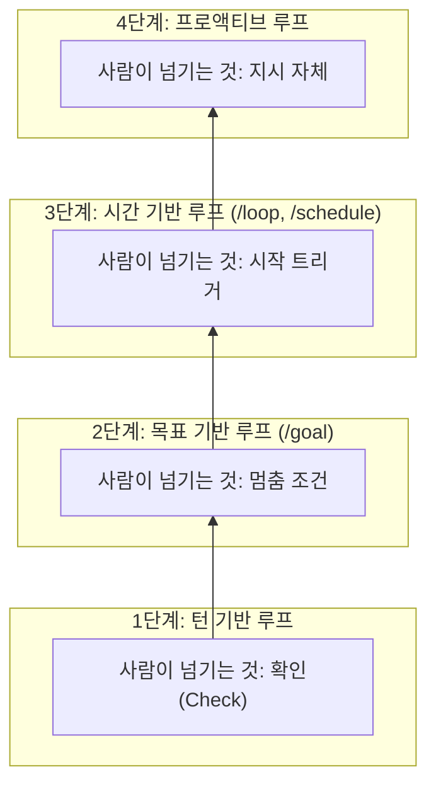
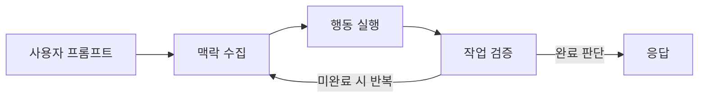
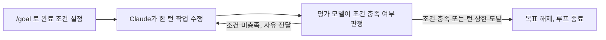
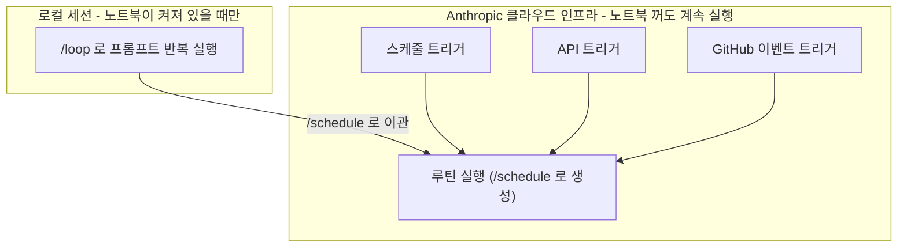
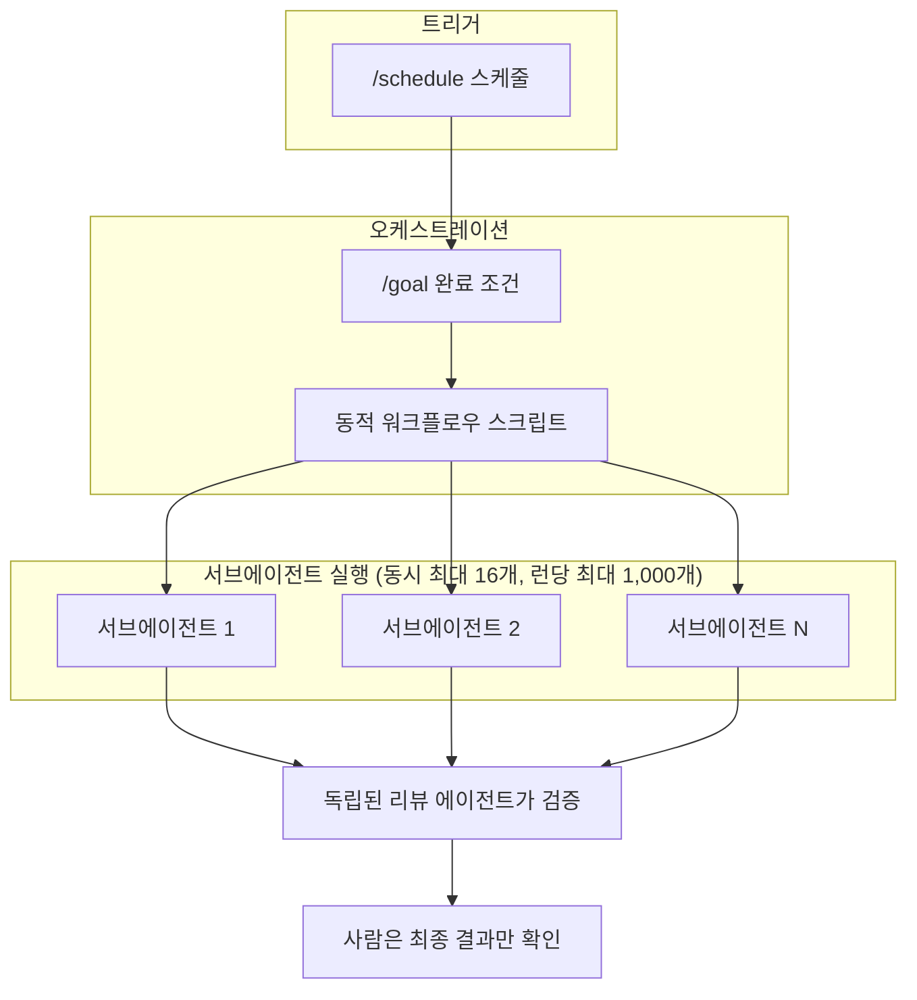

## 관련글

[**Claude Code의 "Loop" 개념 완전 해설: 프롬프트에서 루프로**](https://k82022603.github.io/posts/claude-code%EC%9D%98-loop-%EA%B0%9C%EB%85%90-%EC%99%84%EC%A0%84-%ED%95%B4%EC%84%A4-%ED%94%84%EB%A1%AC%ED%94%84%ED%8A%B8%EC%97%90%EC%84%9C-%EB%A3%A8%ED%94%84%EB%A1%9C/)

## 이 문서가 다루는 내용

이 문서는 Anthropic Claude Code 팀이 2026년 6월 30일 공식 블로그(claude.com/blog)에 게시한 ["Getting started with loops"](https://x.com/claudedevs/status/2074208949205881033)라는 글과, 이 글을 두고 국내 개발자 계정([@choi.openai](https://www.threads.com/@choi.openai/post/Dadww2CExgF))이 Threads에 올린 해설 스레드 두 가지를 함께 놓고 정리한 것이다. 원문의 내용은 Anthropic 개발자 문서(code.claude.com/docs) 중 `/goal`, 루틴(Routines, `/schedule`), 동적 워크플로우(Dynamic Workflows) 페이지를 직접 대조하여 수치와 동작 방식을 검증했으며, 검증 과정에서 확인되지 않았거나 제3자의 해석에 불과한 부분은 별도로 표시해 두었다. 오늘 날짜인 2026년 7월 7일 기준으로 해당 블로그 글은 게시된 지 약 일주일 지난 최신 내용이다.

핵심 질문은 이렇다. 최근 "프롬프트 엔지니어링"이라는 말 대신 "루프를 설계한다"는 말이 자주 들리는데, Claude Code 팀은 이 "루프"라는 것을 정확히 어떻게 정의하고, 몇 가지로 분류하며, 각각을 언제 쓰라고 권하는가. 그리고 이 분류 체계를 실제로 사용해 보면 무엇을 얻고 무엇을 조심해야 하는가.

---

## 루프란 무엇인가

Claude Code 팀은 루프를 "에이전트가 멈춤 조건(stop condition)에 도달할 때까지 같은 작업 사이클을 반복하는 것"이라고 정의한다. 이 정의 자체는 단순하지만, 팀은 여기서 한 걸음 더 들어가 루프를 네 가지 기준으로 나눈다. 무엇이 루프를 시작시키는가, 무엇이 루프를 멈추게 하는가, Claude Code의 어떤 기능(프리미티브)이 이를 구현하는가, 그리고 어떤 종류의 작업에 가장 적합한가라는 네 가지 축이다.

이 네 가지 축을 기준으로 실제로는 턴 기반 루프(Turn-based Loop), 목표 기반 루프(Goal-based Loop, `/goal`), 시간 기반 루프(Time-based Loop, `/loop`와 `/schedule`), 프로액티브 루프(Proactive Loop)라는 네 단계로 정리된다. 흥미로운 점은 이 네 단계가 단순히 "더 자동화된 버전"을 나열한 것이 아니라, 매 단계마다 사람이 손에서 놓는 판단의 종류가 다르다는 것이다. 아래에서 하나씩 살펴본다.



---

## 1. 턴 기반 루프 (Turn-based Loop)


가장 기본적인 형태다. 사실 우리가 평소에 Claude Code에 프롬프트 하나를 보내는 행위 자체가 이미 작은 루프를 하나 도는 것이다. 시작은 사용자의 프롬프트이고, 멈춤은 Claude가 스스로 "작업을 끝냈다" 또는 "추가 맥락이 필요하다"고 판단하는 순간이다. 짧고 정기적인 일정이나 프로세스에 속하지 않는 단발성 작업에 가장 적합하다.

내부적으로 이 루프는 맥락을 모으고, 행동을 취하고, 스스로 점검하고, 필요하면 다시 반복한 뒤 응답하는 사이클을 돈다. 예를 들어 좋아요 버튼을 하나 만들어 달라고 요청하면, Claude는 기존 코드를 읽고, 수정하고, 테스트를 돌린 다음 "이제 됐다고 생각되는" 결과를 건넨다. 이후 사람이 직접 결과물을 확인하고 다음 프롬프트를 작성하는 식이다.

이 단계에서 사람이 관리할 수 있는 부분은 검증 절차다. 매번 사람이 눈으로 확인하던 절차를 SKILL.md 파일에 규칙으로 명문화해 두면, Claude가 스스로 더 많은 부분을 검증하고 다음 단계로 넘어갈 수 있다. 이때 중요한 것은 Claude가 결과를 직접 보고, 측정하고, 상호작용할 수 있는 도구나 커넥터를 함께 제공하는 것이다. 검증 기준이 숫자로 잴 수 있을수록, 즉 정량적일수록 Claude가 통과 여부를 스스로 판정하기 쉬워진다.

공식 문서가 제시하는 예시는 프론트엔드 변경 사항을 검증하는 SKILL.md다. 이 스킬은 "UI 변경을 완료됐다고 보고하기 전에, 개발 서버를 켜고 실제로 브라우저에서 클릭해 상태 변화를 확인하고, 콘솔에 새로운 오류가 없는지 점검하고, Chrome DevTools MCP로 성능까지 감사하라"는 내용을 담고 있다. 이렇게 하면 사람이 매번 개입하지 않아도 Claude가 스스로 "진짜로 확인된 완료"와 "그냥 편집이 끝난 상태"를 구분할 수 있게 된다.



---

## 2. 목표 기반 루프 (Goal-based Loop, `/goal`)


한 번의 턴으로는 부족한, 좀 더 복잡한 작업에 쓰는 단계다. `/goal` 명령은 "완료 조건(completion condition)"을 설정해 두면 Claude가 사람의 개입 없이 여러 턴에 걸쳐 그 조건을 향해 계속 작업하게 만든다. 핵심은, 매 턴이 끝날 때마다 Claude 스스로가 "이 정도면 됐다"고 판단하게 두는 대신, 별도의 평가 모델(evaluator model)이 사람이 정해 둔 조건을 검사하고, 조건이 충족되지 않았다면 Claude를 다시 작업하게 돌려보낸다는 점이다.

Anthropic 개발자 문서를 직접 확인한 결과, `/goal`은 Claude Code v2.1.139부터 사용 가능하며, 기술적으로는 세션 범위의 프롬프트 기반 Stop 훅(hook)을 감싼 래퍼다. Claude가 한 턴을 마칠 때마다 설정된 조건과 지금까지의 대화 내용이 사용자가 설정해 둔 "작고 빠른 모델(small fast model)"—기본값은 Haiku 계열—로 전달되고, 이 모델이 "예/아니오"와 짧은 이유를 반환한다. "아니오"면 그 이유가 다음 턴의 지침으로 Claude에게 전달되고, "예"면 목표가 해제되며 대화 기록에 달성 항목이 남는다. 이 평가용 토큰 비용은 메인 작업에 쓰이는 토큰에 비해 통상 무시할 만한 수준이라고 문서는 설명한다.

이 방식이 효과적인 이유는 명확하다. 통과한 테스트 개수나 특정 점수 기준처럼 결정론적(deterministic)인 기준일수록 평가 모델이 판단하기 쉽고, Claude도 무엇을 향해 가야 하는지 헷갈리지 않는다. 다만 한 가지 주의할 점은, 이 평가 모델이 별도로 명령을 실행하거나 파일을 읽지는 않는다는 것이다. 오직 Claude가 대화 중에 이미 드러낸 결과만 보고 판단하기 때문에, 조건은 "Claude 스스로 증명할 수 있는 형태"로 적어야 한다. 예를 들어 "test/auth의 모든 테스트가 통과한다"는 조건이 잘 작동하는 이유는, Claude가 실제로 테스트를 돌리고 그 결과가 대화 기록에 남기 때문이다.

문서에 따르면 세션당 하나의 목표만 활성화할 수 있고, 조건 문자열은 최대 4,000자까지 지정할 수 있다. 또한 조건 안에 턴 수나 시간 제한 절을 포함시켜 두면(예: "5번 시도 후 중단") 무한정 반복되는 것을 막을 수 있다. 공식 예시는 다음과 같다.

```
/goal get the homepage Lighthouse score to 90 or above, stop after 5 tries.
```



---

## 3. 시간 기반 루프 (Time-based Loop, `/loop`와 `/schedule`)

이 단계부터는 사람이 넘기는 것이 "시작 트리거"로 바뀐다. 즉 언제 루프를 돌릴지를 사람이 매번 누르지 않아도 되는 단계다. 두 가지 유형의 반복 작업이 여기 해당한다. 하나는 작업 자체는 동일하고 입력만 바뀌는 경우(매일 아침 Slack 메시지를 요약하는 것 같은 일), 다른 하나는 외부 시스템에 의존해서 일정 간격으로 상태를 확인하고 변화에 반응해야 하는 경우(PR에 리뷰가 달렸는지, CI가 실패했는지 확인하는 일)다.

`/loop`는 세션 안에서 프롬프트를 일정 간격으로 재실행하는 명령이다. 공식 문서를 확인한 결과 `/loop`는 CLI 세션에 종속된(session-scoped) 가벼운 스케줄러로, 세션이 끝나면 함께 사라진다. 간격은 초·분·시간·일 단위로 지정할 수 있고(초 단위는 분 단위로 반올림), Claude가 이를 크론(cron) 표현식으로 변환해 예약한다. 슬래시 명령이나 스킬을 프롬프트 자리에 넣어 매 반복마다 그 스킬을 실행하게 만들 수도 있다. 공식 예시는 다음과 같다.

```
/loop 5m check my PR, address review comments, and fix failing CI
```

`/loop`는 어디까지나 로컬 세션에서 동작하기 때문에 노트북을 끄거나 세션을 종료하면 함께 멈춘다. 이를 클라우드로 옮겨서 노트북이 꺼져 있어도 계속 돌아가게 하려면 `/schedule` 명령으로 "루틴(Routine)"을 만들어야 한다.

루틴은 프롬프트, 하나 이상의 저장소(repository), 커넥터 구성을 하나로 묶어 Anthropic이 관리하는 클라우드 인프라에서 자동 실행되도록 저장해 둔 것이다. 문서에 따르면 루틴에는 세 가지 트리거를 걸 수 있다. 정해진 주기로 실행되는 스케줄(schedule) 트리거, 외부 시스템이 HTTP POST 요청을 보내면 실행되는 API 트리거, 그리고 PR 오픈이나 릴리스 게시 같은 GitHub 이벤트에 반응하는 GitHub 트리거다. 하나의 루틴에 이 세 가지를 동시에 걸어둘 수도 있다. 다만 이 기능은 아직 "리서치 프리뷰(research preview)" 단계이며, 문서는 동작 방식과 제한이 향후 바뀔 수 있다고 명시하고 있다.



---

## 4. 프로액티브 루프 (Proactive Loop)


가장 위 단계로, 사람이 넘기는 것은 이제 "지시 자체"다. 이벤트나 스케줄로 시작되며 실시간으로 사람이 붙어 있지 않다. 버그 리포트 처리나 이슈 분류, 마이그레이션, 의존성 업그레이드처럼 잘 정의되어 있고 계속 흘러들어오는 작업 스트림에 적합하다.

이 단계는 앞서 나온 프리미티브들을 조합해서 만든다. `/schedule`로 정기적인 트리거를 걸고, `/goal`로 "무엇이 끝난 상태인지"를 정의하고 스킬로 그 검증 방법을 문서화하며, 동적 워크플로우(Dynamic Workflows)로 각 작업을 여러 에이전트에 나눠 처리하게 하고, 오토 모드(Auto Mode)로 매번 권한을 묻지 않고 계속 진행되게 만든다. 공식 블로그가 제시한 조합 예시는 다음과 같다.

```
/schedule every hour: check #project-feedback for bug reports.
/goal: don't stop until every report found this run is triaged, actioned, and responded to.
When fixing a bug, use a workflow to explore three solutions in parallel worktrees
and have a judge adversarially review them.
```

여기서 핵심 기능인 동적 워크플로우에 대해서는 Anthropic 개발자 문서(code.claude.com/docs/en/workflows)를 직접 확인했다. 동적 워크플로우는 Claude가 작성한 자바스크립트 스크립트가 백그라운드에서 서브에이전트들을 대규모로 조율하는 기능이며, Claude Code v2.1.154 이상에서 사용할 수 있고 Pro, Max, Team, Enterprise 요금제 전반과 Anthropic API, AWS Bedrock, Google Cloud Agent Platform, Microsoft Foundry에서 이용 가능하다. Pro 요금제에서는 `/config`의 Dynamic workflows 항목에서 켜야 한다.

문서가 명시한 실행 한도는 두 가지다. 동시에 실행되는 에이전트는 최대 16개(CPU 코어가 제한된 환경에서는 더 적을 수 있음)이고, 한 번의 실행(run)당 총 에이전트 수는 최대 1,000개다. 이 두 수치는 각각 로컬 자원 사용을 억제하고 무한 폭주를 막기 위한 안전장치라고 문서는 설명한다. 서브에이전트, 스킬, 에이전트 팀(agent teams)과 달리 워크플로우는 "계획 자체를 코드로 옮긴" 것이어서, Claude의 컨텍스트 창에는 중간 결과가 쌓이지 않고 최종 결과만 남는다는 점이 구조적 차이다. 참고로 Claude Code에는 `/deep-research`라는 번들 워크플로우가 기본 포함되어 있어, 여러 방향으로 웹 검색을 분산시키고 출처를 상호 대조한 뒤 인용이 달린 보고서를 만들어 준다.



---

## 네 단계 요약표

| 루프 유형 | 사람이 넘기는 것 | 적합한 상황 | 사용하는 기능 |
|---|---|---|---|
| 턴 기반 | 확인(Check) | 탐색하거나 결정을 내리는 중일 때 | 커스텀 검증 스킬 |
| 목표 기반 | 멈춤 조건 | 완료 상태가 명확할 때 | `/goal` |
| 시간 기반 | 시작 트리거 | 작업이 프로젝트 밖 일정에 따라 일어날 때 | `/loop`, `/schedule` |
| 프로액티브 | 지시 자체 | 반복적이고 잘 정의된 작업일 때 | 위 전부 + 동적 워크플로우 |

---

## 코드 품질을 유지하는 방법

루프의 결과물 품질은 결국 루프를 둘러싼 시스템의 품질에 달려 있다는 것이 공식 블로그의 핵심 메시지다. 코드베이스 자체가 깔끔하게 정돈되어 있어야 Claude가 기존 패턴과 관례를 그대로 따라갈 수 있다. Claude가 스스로 자기 작업을 검증할 방법을 스킬 형태로 마련해 두어야 하고, 프레임워크와 라이브러리 문서가 최신 상태로 손 닿는 곳에 있어야 한다.

특히 강조되는 부분은 코드 리뷰를 위해 별도의 에이전트를 쓰라는 것이다. 작업을 만든 맥락과 완전히 분리된, 새로운 맥락을 가진 리뷰어가 훨씬 편향이 적고 원래 에이전트의 추론 과정에 물들지 않는다. Claude Code에 기본 내장된 `/code-review` 스킬이나 GitHub용 Code Review 기능을 활용하면 된다. 그리고 개별 결함을 하나 고치는 데서 그치지 말고, 그 교훈을 시스템에 반영해서 앞으로의 모든 반복에 도움이 되도록 만드는 것이 좋다고 문서는 권한다.

## 토큰 사용량을 관리하는 방법

루프는 경계가 분명해야 토큰 비용을 통제할 수 있다. 작업 성격에 맞는 프리미티브와 모델을 골라야 하는데, 작은 작업에는 굳이 여러 에이전트나 복잡한 루프가 필요 없고, 값싸고 빠른 모델로 충분한 경우도 많다. 성공 기준과 멈춤 조건을 명확하게 정의해야 Claude가 너무 늦지도, 너무 이르지도 않게 답을 찾아낼 수 있다.

대규모 실행 전에는 반드시 시범 실행(pilot)을 거쳐야 한다. 동적 워크플로우는 수백 개의 에이전트를 동시에 띄울 수 있기 때문에, 전체 작업 대신 일부만 떼어내어 비용을 가늠해 보는 편이 안전하다. 결정론적인 작업은 추론으로 풀지 말고 스크립트로 처리하는 것이 더 저렴한데, 예를 들어 PDF 서식을 채우는 스킬이라면 매번 코드를 새로 만들지 않고 스크립트를 실행시키는 식이다. 루틴을 지나치게 자주 돌릴 필요도 없으며, 감시 대상이 실제로 얼마나 자주 바뀌는지에 맞춰 주기를 설정하면 된다.

사용량을 점검할 때는 `/usage` 명령으로 스킬, 서브에이전트, MCP별 최근 사용량을 나눠 볼 수 있고, 인자 없이 `/goal`을 실행하면 지금까지 진행된 턴 수와 토큰 사용량을 볼 수 있으며, `/workflows`는 각 에이전트의 토큰 사용량을 보여주고 언제든 특정 에이전트를 멈출 수 있게 해 준다.

---

## Threads 해설이 덧붙인 해석: "위임의 사다리"

여기서부터는 Anthropic의 공식 입장이 아니라, 위 블로그 글을 두고 국내 개발자 계정 @choi.openai가 Threads에 올린 개인적인 해석이라는 점을 먼저 밝혀 둔다. 이 해설자는 네 단계를 단순한 "자동화 단계표"가 아니라 "위임의 단계표"로 읽는다. 한 칸씩 올라갈 때마다 사람이 쥐고 있던 판단의 한 조각—확인, 멈춤 조건, 시작 트리거, 지시 자체—을 에이전트에게 넘기게 되고, 그만큼 편리해지는 대신 문제가 생겼을 때 사람이 개입할 자리가 좁아진다는 것이다.

이 해설자가 특히 강조하는 지점은 검증의 독립성이다. 어떤 답을 만들어낸 바로 그 맥락이 그 답을 채점까지 하면, 자기가 짠 로직을 스스로 옳다고 믿어버리는 문제가 생길 수 있다는 것이다. 이는 실제로 공식 문서에서도 확인되는 설계 원칙과 일치한다. `/goal`의 평가 모델은 작업을 수행하는 Claude와는 별도의 모델이 조건 충족 여부를 판단하고, 동적 워크플로우 역시 "독립적인 에이전트가 서로의 결과물을 적대적으로(adversarially) 검토하게 할 수 있다"는 점이 공식 문서에 명시되어 있다. 즉 "검증자를 만든 자로부터 떼어놓아야 한다"는 해설자의 주장은 근거 없는 추측이 아니라, 실제 제품 설계에 반영된 원칙을 짚은 것으로 볼 수 있다.

다만 이 해설이 언급하는 구체적인 사례—예를 들어 실패의 세 가지 유형(조용한 죽음, 표류, 이해 격차)이나 반복 횟수·예산 상한, 실패 반복 시 차단기, worktree 단위로 영향 범위를 가두는 방법—은 공식 블로그에 직접 명시된 내용이 아니라 해설자 본인의 실무적 조언에 가깝다는 점을 분명히 해 둔다. 실제로 유용한 원칙이지만, Anthropic이 공식적으로 권장하는 수치나 절차는 아니라는 뜻이다. 비용 관리에 대해서도 해설자는 "받아들여진 변경 하나당 비용"을 지표로 삼으라고 제안하는데, 이 역시 해설자의 실무 팁이며 공식 문서가 제시하는 지표는 아니다.

---

## 실전에서 시작하는 방법

공식 블로그가 제안하는 시작 방법은 단순하다. 지금 하고 있는 일 중에서 자신이 병목이 되고 있는 작업 하나를 고르고, 그중 어느 조각을 넘길 수 있을지 물어보라는 것이다. 검증 절차를 직접 적어 둘 수 있는가, 완료 상태가 충분히 명확한가, 작업이 일정한 주기로 발생하는가와 같은 질문들이다. 아이디어가 생겼다면 일단 루프를 돌려 보고, 어디서 멈추는지 또는 어디서 과도하게 나아가는지를 관찰한 뒤, 주저하지 말고 반복해서 다듬어 나가면 된다.

턴 기반에서 목표 기반으로, 다시 시간 기반과 프로액티브 단계로 올라가는 순서 자체가 권장되는 진행 방향이다. 한 번에 맨 위 단계로 뛰어오르기보다는, 손으로 한 번 돌려 본 작업을 스킬로 굳히고, 그 스킬을 루프로 감싸고, 마지막에 스케줄에 올리는 단계적 접근이 안전하다.

---

## 참고 자료

- Anthropic 공식 블로그: [Getting started with loops](https://claude.com/blog/getting-started-with-loops) (2026년 6월 30일 게시)
- Anthropic 개발자 문서: [Keep Claude working toward a goal (/goal)](https://code.claude.com/docs/en/goal)
- Anthropic 개발자 문서: [Automate work with routines](https://code.claude.com/docs/en/routines)
- Anthropic 개발자 문서: [Orchestrate subagents at scale with dynamic workflows](https://code.claude.com/docs/en/workflows)
- Anthropic 개발자 문서: [Run prompts on a schedule](https://code.claude.com/docs/en/scheduled-tasks)
- Threads 해설: @choi.openai, ["언제부터 'AI한테 시킨다'가 아니라 '루프를 짠다'가 됐을까요"](https://www.threads.com/@choi.openai/post/Dadww2CExgF) (원문 저자 제공)

---

