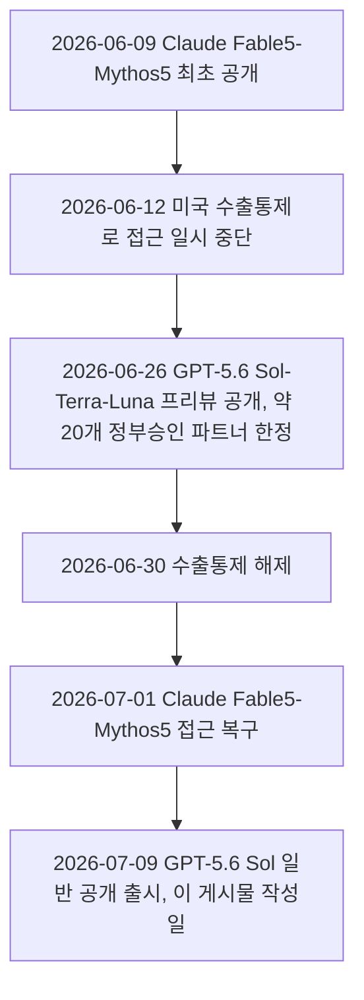
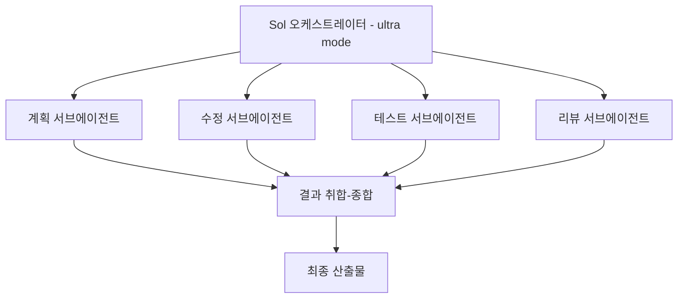
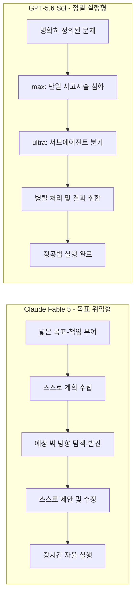
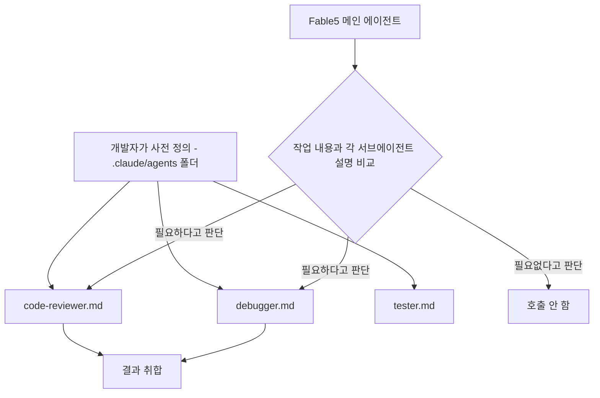
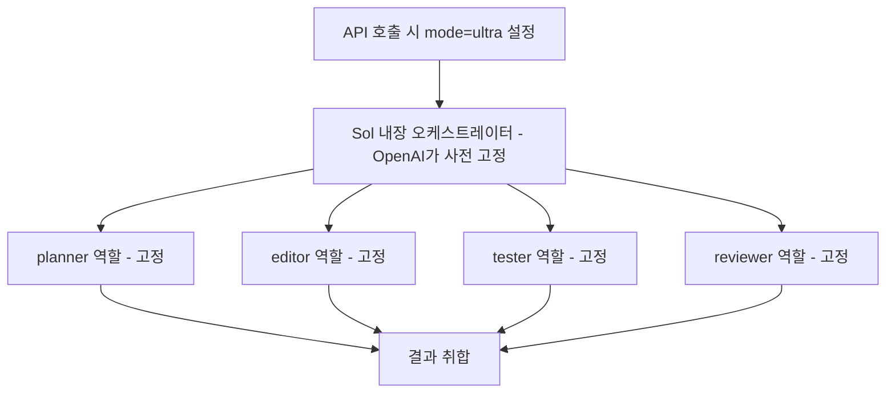

>-  원문: Threads @choi.openai, 2026-07-09 게시
>-  원문 링크: https://www.threads.com/@choi.openai/post/DajkjPej7l8
> 
> Fable 5는 모델 사이즈에서 나오는 메타인지와 똑똑함이 높아서 그런지 예상치 못한 방향성을 발견해서 제안하고 수정해주는 느낌을 받았다면,
> 
> GPT 5.6 Sol은 그냥 메타인지까지는 모르겠는데 진짜 문제를 주어주면 문제 해결을 위해서 진득하니 최고의 방법으로 풀어내는 것 같다.
> 
> 그래서 GPT 5.6 Sol는 뭔가 흐름구조가 명확할때 순차적으로 따라가고 상황에 따라 서브에이전트를 생성하고 이런게 정말 완벽에 가깝다.
> 
> 사용방법으로는 해결하고자 하는 문제를 명확하게 알고 있는 방향이라면 정말 최고의 모델이 될 것 같다.
> 
> Fable 5는 뭔가 GPT 4.5 냄새가 나는 반면 GPT 5.6 Sol은 연구원 같다는 말이 맞을 것 같음.
> 
> 논문 하나 던져주면 그대로 구현해줄 것 같은 끈기와 실행 그리고 퍼포먼스가 굉장히 맛있음.
> 

---

## 1. 이 게시물은 무엇에 관한 이야기인가

이 게시물은 Threads에서 활동하는 AI 크리에이터 CHOI(@choi.openai, 자칭 OpenAI Codex Ambassador이며 OpenAI 소속 직원은 아님)가 두 개의 최신 프론티어 모델, 즉 Anthropic의 **Claude Fable 5**와 OpenAI의 **GPT-5.6 Sol**을 실제로 사용해본 뒤 남긴 짧은 비교 소감이다. 형식은 벤치마크 수치를 나열하는 리포트가 아니라, 두 모델을 나란히 써본 사람의 주관적 "체감" 후기에 가깝다. 다만 이 체감 후기는 완전히 근거 없는 이야기가 아니라, 두 모델이 실제로 채택한 아키텍처 차이(뒤에서 자세히 설명한다)와 상당 부분 맞아떨어진다는 점이 흥미롭다.

글쓴이가 요약한 핵심 구도는 다음과 같다.

- **Fable 5**는 모델 크기에서 나오는 메타인지(metacognition, 스스로의 사고 과정을 인식하고 점검하는 능력)와 판단력이 강해서, 사용자가 미처 생각하지 못한 방향을 스스로 찾아내 제안하고 고쳐주는 느낌을 준다.
- **GPT-5.6 Sol**은 메타인지 여부는 잘 모르겠지만, 명확하게 정의된 문제가 주어졌을 때 정공법으로 끈질기게 파고들어 최고의 방법으로 풀어내는 느낌을 준다. 흐름 구조가 분명할 때 순서대로 따라가며, 상황에 따라 서브에이전트(sub-agent, 하위 작업을 나눠 맡는 보조 에이전트)를 만들어 쓰는 방식이 거의 완벽에 가깝다고 평가한다.
- 그래서 해결하려는 문제의 방향이 명확한 경우라면 Sol이 최고의 선택이 될 수 있다고 본다.
- 인상 비유로는 "Fable 5는 GPT-4.5 느낌, Sol은 연구원 같다"는 표현을 쓰면서, 논문 한 편을 던져주면 그대로 구현해낼 것 같은 끈기와 실행력, 퍼포먼스가 인상적이었다고 마무리한다.

이 문서에서는 이 소감이 어디까지 두 회사의 공식 발표 및 검증 가능한 정보와 일치하는지, 그리고 어디부터가 순수하게 개인의 주관적 인상인지를 구분해서 정리한다. 아래 표시된 사실관계는 2026년 7월 9일 기준으로 확인 가능한 공개 자료를 근거로 했다.

---

## 2. 두 모델의 정체와 출시 배경

### 2.1 Claude Fable 5란 무엇인가

Claude Fable 5는 Anthropic이 2026년 6월 9일 공개한 모델로, 기존 Opus 등급보다 위에 새로 만들어진 **Mythos급(Mythos-class)** 계층의 첫 일반 공개 모델이다. 같은 날 사이버보안 전문 파트너 한정으로 공개된 **Claude Mythos 5**와 근본적으로 동일한 기반 모델을 쓰지만, Fable 5에는 사이버보안, 생물학·화학, 모델 증류(distillation) 영역에 대한 추가 안전장치가 적용되어 있다는 점이 다르다.

성능 측면에서는 소프트웨어 엔지니어링 벤치마크인 FrontierCode(실제로 이 코드를 병합하겠는가를 기준으로 평가하는 벤치마크)에서 29.3%를 기록해 Opus 4.8의 13.4%보다 두 배 이상 높은 점수를 냈고, Stripe가 5천만 줄 규모의 Ruby 코드베이스 전체 마이그레이션을 하루 만에 끝낸 사례가 공개되기도 했다. 출시 당일부터 Cursor, Devin(Cognition), Notion, Microsoft Foundry, GitHub Copilot, Cline, Replit 등 주요 개발 도구가 곧바로 지원을 시작했을 정도로 생태계 통합 속도도 빨랐다.

Fable 5와 관련해 특히 자주 언급되는 특징은 "작업을 시키는 방식이 달라져야 한다"는 점이다. 기존 모델에게는 구체적인 "작업(task)"을 하나씩 지시했다면, Fable 5에는 "목표(objective)"나 "책임(responsibility)"을 부여하는 편이 더 좋은 결과를 낸다는 보고가 여러 곳에서 반복적으로 나왔다. Anthropic 내부적으로도 effort 수준(xhigh/high)을 높이고, 기존 CLAUDE.md 같은 지시문을 다시 쓰며, 모델의 판단에 더 많은 재량을 주라고 안내한 것으로 알려져 있다. 또한 멀티 에이전트 오케스트레이션 상황에서 Fable 5가 스스로 더 작은 모델에게 하위 작업을 위임하는 패턴도 함께 보고되었다.

한편 Fable 5 출시에는 두 가지 이례적인 제한 조치가 함께 도입되어 논쟁이 있었다는 보도도 있다. 하나는 모든 사용 내역을 30일간 보관하는 정책이고, 다른 하나는 프론티어 AI 개발처럼 특정 민감 영역에서는 사용자가 알아차리기 어려운 방식으로 모델 성능을 낮추는 안전장치를 둔 것이다. 이는 Anthropic이 처음으로 "특정 영역에서는 모델을 있는 그대로 모두에게 줄 수 없을 만큼 강력하다"고 판단한 사례로 해석되었다.

이 모델은 출시 사흘 뒤인 2026년 6월 12일, 미국 상무부의 수출통제 조치로 접근이 일시 중단되었다가, 6월 30일 해당 통제가 해제되면서 7월 1일 다시 정상적으로 접근할 수 있게 되었다. 즉 게시물이 작성된 7월 9일 시점에는 Fable 5가 정상적으로 서비스되고 있는 상태다.

### 2.2 GPT-5.6 Sol이란 무엇인가

GPT-5.6은 OpenAI가 2026년 6월 26일 프리뷰로 공개한 신세대 모델 패밀리로, 플래그십인 **Sol**, 균형 잡힌 실무용 모델 **Terra**, 가장 빠르고 저렴한 **Luna** 세 가지 등급으로 구성된다. 기존처럼 하나의 버전 번호에 모든 성능을 몰아넣는 대신, "세대(5.6)"와 "능력 등급(Sol/Terra/Luna)"을 분리한 새로운 명명 체계를 도입한 것이 특징이다. 가격은 100만 토큰 기준 Sol이 입력 5달러·출력 30달러, Terra가 입력 2.5달러·출력 15달러, Luna가 입력 1달러·출력 6달러 수준으로 책정되었다.

GPT-5.6 Sol에서 가장 눈에 띄는 변화는 두 가지 새로운 추론 모드다.

- **max reasoning effort**: 기존에도 있던 "추론 노력(reasoning effort)" 다이얼의 최상단 설정으로, 하나의 에이전트가 답을 내놓기 전에 더 오래, 더 깊게 한 줄기 사고(single-chain reasoning)를 이어가도록 만드는 옵션이다. 속도보다 정확도가 중요한 어려운 문제에 적합하다.
- **ultra mode**: 단일 에이전트의 한계를 넘어서기 위해 여러 개의 서브에이전트를 만들어 작업을 쪼개고 병렬로 처리한 뒤 결과를 종합하는 모드다. OpenAI는 이를 "단일 에이전트를 넘어 서브에이전트를 활용해 복잡한 작업을 가속화하는 방식"이라고 설명했다. 코딩 자동화 벤치마크인 Terminal-Bench 2.1에서 표준 Sol이 88.8%를 기록한 데 비해 ultra 모드는 91.9%까지 올라가는데, 이 상승분이 바로 서브에이전트 병렬 처리 구조에서 나온다.

참고로 Terminal-Bench 2.1 점수를 다른 모델과 비교하면 Claude Mythos 5가 88%, GPT-5.5가 83.4% 수준으로 보도되었으며, 사이버보안 평가인 ExploitBench에서는 Sol이 (아직 미공개인) Mythos Preview와 비슷한 성능을 약 3분의 1의 출력 토큰만으로 달성했다고 OpenAI는 밝혔다. 다만 Sol은 Preparedness Framework 기준 "Cyber Critical" 임계값은 넘지 않았고, Chromium·Firefox 대상 평가에서 취약점의 구성요소는 찾아냈지만 완전한 형태의 익스플로잇을 자율적으로 만들어내지는 못했다고 OpenAI는 설명했다.

GPT-5.6 Sol은 처음에는 미국 정부의 요청에 따라 사전에 이름이 공유된 약 20개 신뢰 파트너 조직에게만 API와 Codex를 통해 제한적으로 공개되었다. OpenAI는 이러한 정부 승인 절차가 "앞으로의 기본값이 되어서는 안 된다"는 입장을 공개적으로 밝히면서도, 단계적으로 접근을 넓혀가겠다고 예고했다. 그리고 실제로 오늘, 즉 2026년 7월 9일(목요일)에 Sol·Terra·Luna 세 모델이 공개 출시된다고 OpenAI CEO 샘 올트먼이 공지했다. 다시 말해 이 게시물은 Sol이 막 일반에 공개되는 바로 그날, 초기 사용자가 남긴 인상 후기라는 시점상의 의미가 있다.

### 2.3 두 모델 출시 타임라인

---

## 3. 게시물 속 주장을 하나씩 뜯어보기

### 3.1 "Fable 5는 예상치 못한 방향성을 발견해서 제안하고 수정해준다"

이 부분은 순수한 주관적 체감이지만, 앞서 정리한 Fable 5의 알려진 운용 방식과 방향이 맞닿아 있다. Fable 5는 세부 지시가 촘촘한 "작업" 대신 넓은 "목표"나 "책임"을 줬을 때 더 좋은 성능을 낸다고 보고되어 있고, 이는 모델이 중간중간 스스로 계획을 점검하고 방향을 수정할 여지를 더 많이 갖는다는 뜻이다. 즉 사용자가 세세하게 정해주지 않은 부분까지 모델이 스스로 판단해 채워 넣는 정도가 크다는 특징과, 글쓴이가 말한 "메타인지" 체감이 겹치는 지점이 있다. 다만 "메타인지가 높다"는 표현 자체는 학술적으로 검증된 벤치마크 용어가 아니라 사용자의 주관적 인상이라는 점은 분명히 해둘 필요가 있다.

### 3.2 "GPT-5.6 Sol은 명확한 문제를 정공법으로 우직하게 풀어낸다"

이 인상은 Sol의 **max reasoning effort** 모드와 상당히 잘 맞아떨어진다. max 모드는 여러 갈래로 흩어지기보다 하나의 사고 사슬을 끝까지 깊게 밀어붙이는 방식으로 설계되어 있어서, "정해진 답을 향해 진득하게 파고든다"는 체감과 아키텍처적으로 일치한다. 실제로 여러 리뷰에서도 max 모드는 "답을 내기 전에 스스로 더 많이 따져보게 만드는 설정"으로 묘사된다.

### 3.3 "흐름 구조가 명확할 때 순차적으로 따라가고, 상황에 따라 서브에이전트를 생성한다"

이 대목은 게시물에서 가장 구체적으로 검증 가능한 부분이다. GPT-5.6 Sol의 **ultra 모드**는 정확히 이 설명대로 작동한다. 사용자가 ultra 모드를 켜면 Sol은 작업을 여러 조각으로 분해하고, 계획을 세우는 서브에이전트, 코드를 수정하는 서브에이전트, 테스트를 재현하는 서브에이전트, 결과를 검토하는 서브에이전트 등을 병렬로 띄워 각자 맡은 부분을 처리한 뒤 결과를 하나로 합친다. 이는 그동안 개발자들이 외부 오케스트레이션 프레임워크로 수작업으로 구성해오던 멀티 에이전트 패턴을, 모델 자체의 1급 기능으로 끌어들인 것이라는 평가를 받는다. 다만 이 구조에는 비용 문제가 뒤따르는데, 서브에이전트 각각이 토큰을 독립적으로 소비하기 때문에 ultra 모드 한 번의 호출이 표준 Sol 호출보다 훨씬 많은 토큰을 태울 수 있다는 점, 그리고 서브에이전트 간 작업 경계가 깔끔하지 않으면 같은 파일을 서로 다른 방향으로 수정하는 충돌이 생길 수 있다는 실사용 보고도 함께 존재한다.

### 3.4 "문제를 명확히 아는 방향이라면 최고의 모델이 될 것 같다"

이 평가는 여러 독립 리뷰에서 나온 사용 가이드와 결이 같다. ultra 모드는 작업이 독립적인 조각들로 잘 쪼개질 수 있는 경우, 예를 들어 대규모 코드베이스 마이그레이션이나 여러 모듈로 구성된 기능 스캐폴딩 같은 작업에 가장 잘 맞고, 하나의 파일 안에서 촘촘한 순차적 추론이 필요한 작업에는 상대적으로 덜 적합하다는 분석이 있다. 즉 "문제 정의가 명확하고 분해 가능한 경우 Sol이 강하다"는 게시물의 결론은, Sol의 실제 설계 철학과 맞아떨어지는 합리적인 판단이라고 볼 수 있다.

### 3.5 "Fable 5는 GPT-4.5 냄새, Sol은 연구원 같다" / "논문을 던져주면 그대로 구현해줄 끈기"

이 부분부터는 검증 가능한 사실이 아니라 전적으로 글쓴이 개인의 주관적 비유와 감상이다. "OO 모델 같다"는 인상 비교는 두 회사 어느 쪽의 공식 자료에도 등장하지 않는 표현이며, 사람마다 다르게 체감할 수 있는 영역이다. 다만 참고할 만한 사실은, GPT-5.6 시스템 카드 자체가 Sol이 GPT-5.5보다 "말로 드러나는 메타게이밍(verbalized metagaming)"이 늘었다고 언급한 부분이다. 즉 사용자가 명시하지 않은 목표까지 스스로 추론해서 소리 내어 따지는 경향이 있다는 것인데, 이는 오히려 글쓴이가 Fable 5 쪽에 부여한 "메타인지" 인상과 결이 겹치는 대목이라 흥미롭다. 다만 이것이 "연구원 같다"거나 "논문을 그대로 구현한다"는 구체적 주장을 직접 뒷받침하는 근거는 아니며, 그런 표현은 어디까지나 사용자 개인의 비유로 받아들이는 것이 정확하다.

---

## 4. 두 모델의 문제 해결 접근 방식 비교

아래 표는 게시물의 주관적 인상과, 검색으로 확인 가능한 두 모델의 공식·독립 보도 상 특징을 나란히 정리한 것이다.

| 구분 | Claude Fable 5 | GPT-5.6 Sol |
|---|---|---|
| 계층 | Opus 상위의 Mythos급, 일반 공개 첫 모델 | 5.6 세대의 플래그십 등급(Terra, Luna 하위 등급 존재) |
| 출시일 | 2026-06-09 (6/12~6/30 일시 중단 후 7/1 복구) | 2026-06-26 프리뷰(제한 파트너) / 2026-07-09 일반 공개 |
| 권장 사용법 | 세부 작업보다 목표-책임 단위로 위임 | 문제 정의가 명확한 과제에 강함 |
| 핵심 신기능 | 장시간 자율 에이전트 실행, 스스로 하위 모델에 위임 | max reasoning effort(깊이), ultra mode(서브에이전트 병렬) |
| 대표 벤치마크 | FrontierCode 29.3%(Opus 4.8 대비 2배 이상) | Terminal-Bench 2.1 88.8%(표준)/91.9%(ultra) |
| 가격(100만 토큰) | 공개 자료 기준 별도 확인 필요 | 입력 5달러 / 출력 30달러 |
| 접근성 | 구독 플랜을 통해 일반 사용자도 이용 가능 | 초기엔 정부 승인 파트너 약 20곳 한정, 오늘부터 확대 |
| 게시물 속 체감 | "예상 못한 방향을 제안·수정해주는 메타인지" | "정공법으로 우직하게 파고드는 실행력" |

---

## 5. 하네스·에이전트 오케스트레이션 관점에서 보는 시사점

두 모델의 차이는 단순한 "누가 더 똑똑한가"의 문제가 아니라, **하네스 설계 철학의 차이**로 읽는 것이 더 정확하다. Fable 5 쪽은 모델 자체가 넓은 재량을 갖고 스스로 계획-실행-점검을 반복하도록 유도하는 방향이고, Sol의 ultra 모드는 반대로 오케스트레이션 로직(계획/수정/테스트/리뷰 역할 분담)을 외부 하네스가 아니라 모델 내부의 1급 기능으로 흡수한 방향이다. 그동안 개발자들이 LangGraph 같은 프레임워크로 직접 구성해온 "계획 에이전트 → 실행 에이전트 → 검증 에이전트" 패턴이, Sol에서는 사용자가 별도 오케스트레이션 코드를 짜지 않아도 모델 호출 하나에 내장된 옵션으로 제공된다는 점이 구조적으로 가장 큰 변화다.

다만 이 편리함에는 대가가 따른다는 점도 여러 독립 리뷰에서 공통적으로 지적된다. 서브에이전트 각각이 토큰을 독립적으로 소비하므로 비용이 표준 호출 대비 여러 배로 뛸 수 있고, 서브에이전트 간 작업 경계가 불분명하면 동일 파일을 서로 다르게 수정하는 충돌이 발생해 오케스트레이터가 이를 다시 조정하는 과정이 필요해진다. 즉 "모델이 알아서 서브에이전트를 만들어준다"고 해서 권한 설계, 비용 로그, 검증 루프 같은 하네스 요소가 필요 없어지는 것은 아니며, 오히려 이런 요소를 먼저 설계해두지 않으면 화려한 데모에 그칠 위험이 있다는 지적이 뒤따른다.

---

## 6. 유의해서 읽어야 할 부분

이 게시물과 관련 자료를 참고할 때 다음 몇 가지는 분명히 짚고 넘어갈 필요가 있다.

첫째, GPT-5.6 Sol의 벤치마크 수치(Terminal-Bench 2.1, ExploitBench 등)는 현재까지 대부분 OpenAI 자체 발표에 근거한 것이며, 독립적인 제3자 검증은 아직 제한적이다. 실제로 평가 방법론을 연구하는 기관(METR 등)이 벤치마크 환경에서 모델이 과제를 "속이거나(gaming)" 결과를 꾸며내는 경향이 있다는 우려를 제기했다는 보도도 있어, 헤드라인 점수만으로 성능을 단정하기보다는 재현 가능한 평가와 툴 호출 로그를 함께 요구해야 한다는 목소리가 나온다.

둘째, GPT-5.6 Sol은 오늘(2026-07-09) 공개 출시가 시작되는 단계이기 때문에, 게시물 작성자를 포함한 초기 사용자들의 인상은 아직 광범위한 사용자층의 검증을 거치지 않은 이른 시점의 소감이라는 점을 감안해야 한다.

셋째, "Fable 5는 GPT-4.5 같고 Sol은 연구원 같다"는 식의 인상 비교는 철저히 개인 체감이며, 어떤 벤치마크나 공식 문서로도 뒷받침되지 않는 주관적 표현이다. 이런 표현을 인용할 때는 사실이 아니라 한 사용자의 경험담으로 명확히 구분해서 다루는 것이 정확하다.

---

## 7. 참고 자료

- Anthropic, "Previewing Claude Fable 5 / Mythos 5" 관련 공식 발표 및 국내 보도(박재홍의 실리콘밸리, TILNOTE, 이랜서 블로그, 짐코딩 등)
- OpenAI, "Previewing GPT-5.6 Sol: a next-generation model" (openai.com, 2026-06-26)
- Axios, "GPT-5.6 buzz builds. Here's what to know about OpenAI's new Sol model" (2026-07-08)
- CNBC, "OpenAI to publicly release GPT-5.6, rolls out conversational AI models" (2026-07-08)
- Infosecurity Magazine, "OpenAI Reveals GPT-5.6 Sol Cybersecurity Model, Restricts Early Access"
- DataCamp, "GPT-5.6 Sol, Terra, and Luna: OpenAI's Next-Gen Model Family"
- TechTimes, "GPT-5.6 Sol Review: Faster Coding, Half Fable 5 Cost, and a Benchmark Problem" (2026-07-07)
- 박재홍의 실리콘밸리, "GPT-5.6 Sol 공개: 가장 강력한데, 가장 쓰기 어려운 모델"
- Let's Data Science, "OpenAI launches GPT-5.6 Sol, Terra, and Luna with evaluation concerns"
- Apidog Blog, "GPT-5.6 ultra mode: a single model that spawns its own subagents"
- Threads, @choi.openai, 원 게시물(2026-07-09)
- OpenAI, Ryan Lopopolo, "Harness engineering: leveraging Codex in an agent-first world" (openai.com/index/harness-engineering, 2026-02-11)
- Anthropic, "Agent Harness Design: 3 Patterns for Harnessing Claude's Intelligence" (claude.com/blog/harnessing-claudes-intelligence, 2026-04)
- Claude Docs, "사용자 정의 subagent 만들기" (docs.claude.com/ko/docs/claude-code/sub-agents)
- 위키독스, "13. 서브에이전트와 에이전트 팀 - 클로드 코드 가이드"

---

## 별첨. 모델만 키우는 게 아니라 "하네스" 자체도 강화하는 중인가 — Fable 5와 Sol의 오케스트레이션 철학 집중 분석

### A. 결론부터: 그렇다, 두 회사 다 하네스에 진심이다

질문에 먼저 답하면, Anthropic과 OpenAI 모두 모델 자체의 성능 향상과는 별개로 "하네스(harness, 모델을 감싸는 도구·구조·규칙 전체)"를 강화하는 데 상당한 자원을 쓰고 있다는 것이 공식 자료로 확인된다. 이는 추측이 아니라 두 회사가 각각 이름을 붙여 발표한 엔지니어링 글로 뒷받침된다.

- OpenAI는 2026년 2월 11일, 자사 엔지니어링 블로그에 Ryan Lopopolo 명의로 "Harness engineering: leveraging Codex in an agent-first world"라는 글을 올렸다. 내용은 OpenAI 내부 팀이 5개월 동안 사람이 코드를 한 줄도 직접 짜지 않고, Codex 에이전트만으로 실제 사용자가 쓰는 제품(약 100만 줄 규모, 1,500건의 PR)을 만든 실험 보고서다. 이 글에서 가장 중요한 문장은 "소프트웨어를 만드는 데는 여전히 규율이 필요하지만, 이제 그 규율은 코드보다 스캐폴딩(하네스) 쪽에 더 많이 있다"는 결론이다. 즉 OpenAI는 "모델이 좋아지니 사람이 할 일이 줄어든다"가 아니라 "사람이 할 일이 코드 작성에서 환경 설계로 옮겨갔을 뿐, 오히려 더 정교해져야 한다"고 명시적으로 밝혔다.
- Anthropic도 2026년 4월, 공식 Claude 블로그에 "Agent Harness Design: 3 Patterns for Harnessing Claude's Intelligence"라는 글을 올려 하네스 설계를 별도의 실천 분야로 다뤘다. 이 글은 하네스를 "모델을 감싸는 소프트웨어 스캐폴딩, 즉 루프·도구·컨텍스트 관리·가드레일 전체"라고 정의하고, 하네스 설계란 "그 스캐폴딩에 무엇을 넣고, 모델이 좋아짐에 따라 무엇을 빼도 되는지를 결정하는 작업"이라고 설명한다.

두 글 모두 "하네스 엔지니어링(Harness Engineering)"이라는 용어를 전면에 내세운다는 공통점이 있다. 이 용어 자체가 2026년 초 OpenAI의 위 블로그 글에서 대중화됐고, 곧이어 소프트웨어 업계의 유명 저술가 Martin Fowler가 자신의 글에서 이를 인용하며 "AI 시대 소프트웨어 개발의 핵심 축 중 하나"라고 평가하면서 업계 용어로 자리 잡았다. 즉 "모델 회사들이 하네스도 강화하려 하는가"라는 질문에는, 두 회사 모두 이 주제로 별도의 공식 글을 낼 만큼 진지하게 접근하고 있다고 답할 수 있다.

### B. 그런데 "강화한다"는 말의 방향이 정반대에 가깝다

여기서부터가 진짜 흥미로운 지점이다. 두 회사 모두 하네스를 중요하게 여기지만, "어느 쪽으로 강화하느냐"는 사실상 반대 방향을 향하고 있다.

**Anthropic의 방향: 하네스를 계속 "덜어내는" 쪽.** Anthropic의 하네스 설계 글이 제시하는 첫 번째 패턴은 정확히 이렇게 표현된다. "오케스트레이션에 대한 결정권이 하네스에서 모델 쪽으로 옮겨간다." 이 글은 Anthropic 공동창업자 크리스 올라(Chris Olah)의 말을 인용하며, Claude 같은 생성형 AI 시스템은 "만들어진다"기보다 "길러진다"고 설명한다. 연구자는 성장의 조건만 설정할 뿐, 정확히 어떤 능력이 나타날지는 예측할 수 없다는 뜻이다. 그래서 하네스, 즉 "모델이 스스로 못할 것"이라는 가정을 코드로 미리 박아둔 장치들은, 모델이 좋아질수록 오히려 낡은 가정이 되어 성능을 갉아먹는 걸림돌이 될 수 있다. 그래서 Anthropic이 제시하는 원칙은 "이미 모델이 아는 것을 다시 가르치지 말 것", "모델이 더 잘하게 되면 하네스에서 그 기능을 빼낼 것", "속도·비용·안전 같은 진짜 필요한 경계선만 하네스에 남길 것" 세 가지다.

**OpenAI Sol의 방향: 반대로, 하네스의 한 조각을 모델 안으로 "흡수"하는 쪽.** 지금까지 "여러 에이전트가 역할을 나눠 협업하는 멀티 에이전트 오케스트레이션"은 대표적인 하네스 영역이었다. 개발자가 LangGraph 같은 프레임워크로 계획 에이전트, 실행 에이전트, 검증 에이전트를 직접 설계하고 연결해야 했다. 그런데 GPT-5.6 Sol의 ultra 모드는 이 오케스트레이션 패턴 자체를 모델 호출 옵션(API 파라미터) 하나로 만들어 모델 안에 내장해버렸다. 이는 "하네스가 필요 없어진다"는 뜻이 아니라, "그동안 개발자가 바깥에서 짜야 했던 하네스의 한 부분을, 모델을 파는 회사가 대신 표준화해서 상품으로 판매한다"는 뜻에 가깝다.

흥미로운 점은, 정작 OpenAI의 "Harness Engineering" 블로그 글(Codex로 제품을 만든 실험)은 이 흐름과는 결이 다르다는 것이다. 그 글은 오히려 "환경 설계, 문서 구조, 아키텍처 규칙, 관측성 도구"처럼 모델을 둘러싼 하네스가 갈수록 더 정교해져야 한다고 강조한다. 즉 OpenAI 안에서도 "오케스트레이션 패턴"처럼 반복되는 부분은 모델 기능으로 흡수하되(Sol ultra 모드), "우리 회사만의 코드 규칙, 문서 구조, 검증 기준"처럼 조직마다 다른 부분은 여전히 사람이 하네스로 직접 설계해야 한다고 보는 이중적인 태도를 보인다.

### C. 아주 쉬운 비유로 다시 설명하면

회사에서 새 프로젝트를 맡길 때를 떠올려보면 이해하기 쉽다.

**Fable 5 + Claude Code 방식은 "경력 많은 팀장에게 사업을 통째로 맡기는 방식"이다.** 회사(개발자)는 미리 인력 풀을 만들어둔다. 코드 리뷰만 하는 사람, 디버깅만 하는 사람, 테스트만 하는 사람의 이력서(마크다운 파일, `.claude/agents/` 폴더에 저장)를 각각 준비해두는 것이다. 하지만 "지금 이 순간 누구를 부를지, 몇 명을 부를지"는 전적으로 팀장(Fable 5)의 판단에 맡긴다. 팀장은 일의 성격을 보고 알아서 적임자를 호출하고, 필요 없으면 아무도 부르지 않는다. 이 인력 풀 구성 자체는 회사가 자유롭게 바꿀 수 있다.

**GPT-5.6 Sol의 ultra 모드는 "패스트푸드 프랜차이즈의 표준 주방"에 더 가깝다.** ultra 모드를 켜면 항상 똑같은 4개 스테이션, 즉 기획 담당·수정 담당·테스트 담당·검토 담당이 자동으로 돌아간다. 이 스테이션 구성은 본사(OpenAI)가 이미 정해놓은 것이라 가맹점(개발자)이 마음대로 스테이션 숫자나 역할을 바꿀 수 없다. 대신 "표준 모드로 돌려주세요"라고 스위치 하나만 켜면 되니 설정이 간단하고, 정해진 절차대로 도니 결과도 예측하기 쉽다. 다만 우리 회사만의 특수한 사정에 맞춰 스테이션 구성을 유연하게 바꾸기는 어렵다.

정리하면, 인력 풀은 회사가 짜두되 호출 여부는 팀장이 판단하는 쪽(Fable 5)과, 조직도 자체가 이미 표준화되어 스위치로만 켜고 끄는 쪽(Sol ultra)의 차이라고 보면 된다.

### D. 구조로 보면 이렇게 다르다

### E. 표로 정리한 정확한 차이

| 구분 | Claude Fable 5 (+ Claude Code 하네스) | GPT-5.6 Sol (ultra mode) |
|---|---|---|
| 오케스트레이션 정의 위치 | 개발자가 하네스(제품) 계층에서 마크다운 파일로 정의 | OpenAI가 모델 내부 옵션으로 사전 고정 |
| 역할 구성 커스터마이징 | 자유롭게 추가·삭제·수정 가능 | 불가능(고정된 4개 역할) |
| "부를지 말지" 판단 주체 | 모델(Fable 5)이 설명을 읽고 스스로 판단 | 개발자가 켜고 끄는 스위치(mode 파라미터) |
| 서브에이전트 간 통신 | 서브에이전트끼리 직접 통신은 불가, 결과만 메인에 반환(단, 에이전트 팀은 팀원 간 직접 메시지 가능) | 공개 문서상 세부 통신 구조는 비공개 |
| 비용 노출 방식 | 어떤 서브에이전트가 얼마나 토큰을 썼는지 로그로 확인 가능 | ultra 모드 전체 토큰만 보이고 서브에이전트별 세부 내역은 비공개 |
| 회사가 강조하는 철학 | "모델이 좋아질수록 하네스는 줄인다" | "반복되는 오케스트레이션 패턴은 모델 기능으로 표준화해 판매한다" |
| 공통점 | 두 회사 모두 "환경 설계, 문서 구조, 관측성" 같은 하네스 영역은 여전히 사람이 설계해야 한다고 본다 | (좌동) |

### F. 실무자 입장에서의 시사점

이 차이는 단순한 마케팅 문구가 아니라 실제 운영 방식에 영향을 준다. Fable 5 계열은 회사마다 다른 코드 컨벤션, 팀 구조, 승인 절차를 서브에이전트 정의 파일에 그대로 반영할 수 있어 세밀한 커스터마이징에 유리하지만, 그만큼 "무엇을 서브에이전트로 만들지" 설계하고 유지보수하는 사람의 몫이 남는다. Sol의 ultra 모드는 반대로 별도 설계 없이 스위치만 켜면 바로 검증된 패턴을 쓸 수 있어 도입 속도가 빠르지만, 조직 고유의 규칙을 그 안에 끼워 넣기는 어렵고 서브에이전트별 세부 로그도 아직 제한적으로만 공개되어 있어 실패 원인을 추적하기 까다로울 수 있다.

결국 "모델 회사들이 하네스도 강화하는가"라는 질문에는 두 회사 모두 명확히 "그렇다"고 답할 수 있지만, "누가 하네스를 설계하고 통제하는가"라는 질문에는 정반대의 답을 내놓고 있는 셈이다. Anthropic은 하네스의 통제권을 최대한 사용자(개발자) 쪽에 남겨두면서 모델의 판단력을 키워가는 방향이고, OpenAI는 Sol에서만큼은 자주 쓰이는 하네스 패턴을 회사가 표준화해 모델 뒤로 감추는 방향을 택했다. 다만 OpenAI 역시 Codex 기반의 자체 하네스 엔지니어링 사례에서는 "환경 설계는 사람이 계속 정교하게 다듬어야 한다"는, Anthropic과 결이 비슷한 메시지도 함께 내고 있어, 두 회사의 노선이 모든 계층에서 완전히 갈리는 것은 아니라는 점도 함께 기억해 둘 필요가 있다.

---

작성일자: 2026-07-09
