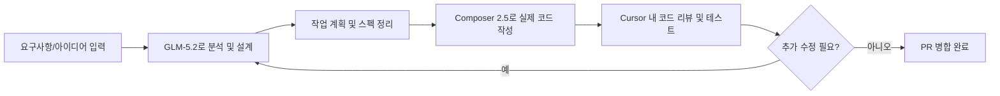

> 
> https://www.threads.com/@justinji03/post/DacJ_P4CX4R
> 
> Cursor로 GLM5.2 + Composer 2.5 조합이 최강이다. 
> 1. GLM5.2 로 개발할 내용을 분석 및 계획 만들고 
> 2. Composer 2.5로 코딩시키면 완전 가성비!! ㅎㅎㅎ 
> 
> 최근 모바일 앱도 나와서 지하철에서도 코딩 완전 가능ㅎㅎ 
> 
> 클로드코드도 좋지만 앞으로는 가성비가 대세일것 같다 ㅎㅎ
> 

## 들어가며

Threads에 올라온 justinji03 님의 게시글은 Cursor 안에서 GLM-5.2로 기획과 설계를 먼저 잡고, Cursor 자체 모델인 Composer 2.5로 실제 코딩을 맡기는 조합이 가성비 면에서 매우 만족스럽다는 개인적인 경험담이었습니다. 이어지는 댓글에서는 최근 나온 Cursor 모바일 앱을 실제로 써본 소감과, 자신이 사용 중인 요금제(Pro Plus + 온디맨드 추가 결제)에 대한 정보도 공유하고 있었습니다. 이 글은 그 내용을 출발점 삼아, GLM-5.2와 Composer 2.5가 실제로 어떤 모델인지, Cursor의 요금제 구조는 어떻게 되어 있는지, 그리고 모바일 앱은 지금 어떤 상태인지를 최신 자료로 검증하고 정리한 것입니다. 원문 게시글 자체는 개인의 사용 후기이므로 "가성비가 대세가 될 것"이라는 전망이나 "가장 강력한 조합"이라는 평가는 어디까지나 작성자 개인의 의견이며, 아래 내용 중 이 부분은 사실 확인의 대상이 아니라 맥락으로만 소개한다는 점을 먼저 밝혀 둡니다.

## Cursor의 요금제 구조부터 짚고 넘어가기

원문 댓글에서 언급된 "프로 플러스"와 "온디맨드 $15~20" 사용 패턴을 이해하려면 먼저 Cursor의 요금제 체계를 알아야 합니다. Cursor는 개인 사용자 대상으로 네 단계 요금제를 운영하고 있습니다. 무료인 Hobby, 월 20달러인 Pro, 월 60달러인 Pro+, 월 200달러인 Ultra이며, 팀 단위로는 사용자당 월 40달러인 Teams(2026년 6월부터 Standard/Premium 두 좌석 유형으로 세분화)와 별도 협의를 거치는 Enterprise가 있습니다.

각 요금제는 매달 정해진 만큼의 모델 사용량(크레딧 풀)을 포함하고 있으며, 이를 다 쓰면 이후로는 사용한 만큼 추가 요금이 청구되는 온디맨드 방식으로 전환됩니다. Pro+는 Pro 대비 OpenAI·Claude·Gemini 등 프리미엄 모델에서 3배의 사용량을 제공하는 것이 핵심이며, 기능 자체는 Pro와 동일합니다. Ultra는 20배의 사용량과 신규 기능 우선 접근권을 제공합니다. 이러한 요금제 구조를 볼 때, 게시글 작성자가 밝힌 "Pro Plus를 쓰면서 사용량이 부족할 때 온디맨드로 15~20달러 정도 추가 결제한다"는 사용 패턴은 Cursor의 공식 과금 구조와 정확히 들어맞는 자연스러운 사용 방식입니다. 월 60달러 정액 요금에, 초과분만큼만 API 요율로 추가 청구되는 방식이기 때문입니다.

| 요금제 | 월 요금 | 핵심 내용 |
| --- | --- | --- |
| Hobby | 무료 | 제한된 Agent 요청, 제한된 Tab 자동완성 |
| Pro | $20 | 무제한 Tab, 프런티어 모델 접근, $20 상당 크레딧 풀 |
| Pro+ | $60 | Pro와 동일한 기능 + 프리미엄 모델 3배 사용량 |
| Ultra | $200 | Pro와 동일한 기능 + 프리미엄 모델 20배 사용량, 신기능 우선 접근 |
| Teams(Standard/Premium) | $40 / $120 (사용자당) | 팀 협업, 중앙 결제, SSO 등 관리 기능 |

## GLM-5.2란 무엇인가

GLM-5.2는 중국 Z.ai(지푸AI 계열)가 내놓은 오픈웨이트 모델로, MIT 라이선스로 공개된 코딩·장기 에이전트 작업 특화 모델입니다. 아키텍처는 약 7440억 개 파라미터 중 400억 개가 토큰당 활성화되는 MoE(Mixture of Experts) 구조이며, DeepSeek의 희소 어텐션(Sparse Attention) 기법을 개량한 IndexShare라는 새로운 어텐션 구조를 도입해 초장문 컨텍스트 처리 시 토큰당 연산량을 약 2.9배 줄인 것이 특징으로 소개되었습니다. API 가격은 입력 100만 토큰당 1.4달러, 출력 100만 토큰당 4.4달러 수준으로, 이전 버전인 GLM-5.1과 동일한 가격대를 유지하고 있습니다.

성능 면에서는 공개된 지 얼마 되지 않았음에도 상당히 인상적인 결과를 냈습니다. 터미널 작업 능력을 측정하는 Terminal-Bench 2.1에서 GLM-5.1의 62.0점에서 81.0점으로 크게 뛰어올라, 오픈웨이트 모델 최초로 80%를 넘겼습니다. 프런트엔드 코딩 평가에서는 Claude Opus 4.7을 포함한 여러 Opus 계열 모델을 앞선 것으로 나타났으며, Design Arena에서는 1위, Code Arena의 프런트엔드 부문에서는 Claude Fable 5에만 뒤진 2위를 기록했습니다. 다만 이러한 수치는 Z.ai 및 관련 커뮤니티가 공개한 벤치마크 결과이며, 실제 작업 환경(어떤 IDE에서, 어떤 툴 접근 권한으로 실행했는지)에 따라 체감 성능은 달라질 수 있다는 점을 함께 감안할 필요가 있습니다.

Cursor 내 지원 현황을 보면 다소 복잡한 전개가 있었습니다. 한동안 Cursor 커뮤니티 포럼에는 "GLM-5.2를 공식 지원해 달라"는 기능 요청 글이 올라와 있었고, Cursor 담당자들은 2026년 6월 18일부터 22일 사이 포럼 답변을 통해 아직 네이티브 지원 일정이 없으며 OpenRouter를 경유한 우회 연결은 오류가 잦으니 Z.ai 직접 API 키를 쓰는 것이 그나마 안정적이라고 안내한 바 있습니다. 그런데 이후 Cursor 공식 문서 사이트에 GLM-5.2 모델 페이지가 개설되었고, 커뮤니티에서도 "GLM-5.2가 Cursor 앱에 공식으로 들어왔다"는 후기가 나오기 시작했습니다. 즉 게시글이 작성된 시점 기준으로는 데스크톱 앱에서 GLM-5.2를 정식 모델 목록에서 선택할 수 있게 된 것으로 보이며, 이는 원문 게시자가 "클로드코드도 좋지만 가성비가 대세가 될 것 같다"고 언급한 배경과도 맞닿아 있습니다.

## Composer 2.5란 무엇인가

Composer 2.5는 Cursor를 만든 회사(Anysphere)가 2026년 5월 18일 출시한 자체 브랜드 모델입니다. 처음부터 새로 만든 모델이 아니라 Moonshot AI의 Kimi K2.5라는 오픈소스 베이스 모델을 가져와 Cursor가 직접 후속 학습(post-training)을 진행한 결과물입니다. 이전 버전인 Composer 2 대비 학습에 사용한 합성 작업량을 25배 늘렸고, 정상 동작하던 저장소에서 기능을 일부러 제거한 뒤 이를 복구하도록 시키는 "기능 삭제" 유형의 훈련 문제를 새로 도입했습니다. 또한 작업이 끝난 뒤 한 번에 보상을 주는 방식이 아니라, 도구 호출이 실패할 때마다 국소적인 텍스트 피드백을 주는 방식의 강화학습을 적용해 복잡한 지시를 더 안정적으로 따르게 만들었다고 발표되었습니다.

성능 지표로는 다국어 코드 수정 능력을 측정하는 SWE-Bench Multilingual에서 79.8%, Cursor 자체 평가 지표인 CursorBench v3.1에서 63.2%를 기록해 Claude Opus 4.7의 61.6%를 근소하게 앞섰습니다. 다만 이 수치를 평가할 때 두 가지를 함께 고려할 필요가 있습니다. 하나는 CursorBench가 Cursor 자체 개발 벤치마크라는 점이고, 다른 하나는 실제로 v3.0에서 v3.1로 개정되는 과정에서 Composer 2의 점수가 60~65%대에서 50~55%대로 조정된 사례가 있어, 벤치마크 버전이 달라지면 점수도 함께 변할 수 있다는 점입니다. 반대로 셸·터미널 작업 능력을 보는 Terminal-Bench 2.0에서는 Composer 2.5가 GPT-5.5에 13%포인트 뒤처지는 것으로 나타나, 터미널·CLI 위주 작업이 많다면 이 격차를 감안해야 합니다.

가격 구조도 눈여겨볼 부분입니다. Composer 2.5는 같은 모델 가중치를 두 가지 속도 등급(Standard/Fast)으로 제공하는데, 응답 속도가 빠른 Fast 등급은 더 비싼 고성능 인프라에서 돌아가기 때문에 입력 100만 토큰당 3달러, 출력 100만 토큰당 15달러로 Standard 대비 약 6배 비쌉니다. 실제로 한 4인 개발팀은 Fast 등급이 기본값으로 바뀐 뒤 월 청구액이 인당 20~100달러 수준에서 팀 전체 약 1,000달러 수준으로 뛰었다는 사례가 커뮤니티에 공유되기도 했습니다. 그만큼 어떤 등급을 쓰는지가 실제 비용에 큰 영향을 준다는 점을 알아둘 필요가 있습니다.

| 구분 | GLM-5.2 | Composer 2.5 |
| --- | --- | --- |
| 개발사 | Z.ai (중국) | Anysphere(Cursor 운영사), Kimi K2.5 기반 |
| 라이선스 | MIT 오픈웨이트 | Cursor 자체 상품(비공개) |
| 출시 시점 | 2026년 6월 중순 | 2026년 5월 18일 |
| 컨텍스트 창 | 100만 토큰 | 100만 토큰 |
| 가격(API 기준) | 입력 $1.4 / 출력 $4.4 (100만 토큰당) | Standard 입력 $0.5~ / Fast 입력 $3, 출력 $15 (100만 토큰당) |
| Cursor 내 위치 | 서드파티 모델(정식 모델 목록 추가) | Cursor 네이티브 모델 |
| 강점으로 언급되는 영역 | 프런트엔드 코딩, 디자인 벤치마크, 비용 대비 성능 | 지속적인 에이전트 작업, 복잡한 지시 이행, IDE 통합 |

## "기획은 GLM-5.2, 코딩은 Composer 2.5" 조합의 의미

게시글에서 소개한 방식은 하나의 모델에 모든 일을 맡기지 않고, 작업 단계에 따라 모델을 나누어 쓰는 접근입니다. 개발할 내용을 분석하고 계획을 세우는 단계에서는 추론과 구조화된 출력에 강점이 있다고 알려진 GLM-5.2를 활용하고, 실제 코드를 작성하는 단계에서는 Cursor IDE와 긴밀하게 통합되어 있고 지속적인 에이전트 작업에 강한 Composer 2.5로 넘기는 흐름입니다. 이런 방식이 가성비 측면에서 매력적인 이유는, Composer 2.5의 Standard 등급이 상대적으로 저렴하면서도 IDE 네이티브 통합 덕분에 별도 설정 없이 바로 쓸 수 있고, GLM-5.2 역시 API 가격이 비교적 낮은 축에 속하기 때문입니다. 다만 이 조합이 절대적으로 "최강"이라고 단정할 근거는 아직 없으며, 두 모델의 벤치마크 비교 자료들도 "측정 환경(하네스, 툴 접근 권한, 프롬프트 방식)에 따라 실제 결과가 달라질 수 있다"는 단서를 반드시 함께 달고 있다는 점은 짚어둘 필요가 있습니다.

이 흐름에서 중요한 점은 GLM-5.2가 아직 Cursor 데스크톱 앱의 정식 모델 목록에 최근 들어서야 추가되었고, 그마저도 Cursor의 자체 OpenAI 호환 모델 연동 방식이 100만 토큰 컨텍스트를 다 살리지 못하고 20만 토큰으로 제한해서 보여주는 알려진 한계가 커뮤니티 포럼에 보고되어 있다는 사실입니다. 즉 GLM-5.2 자체의 성능 한계가 아니라 Cursor라는 특정 통합 경로의 제약이라는 점이 함께 설명되고 있습니다.

## Cursor 모바일 앱의 현재 상황

원문 댓글에서 언급된 모바일 앱은 실제로 2026년 6월 29일, Cursor의 iOS 공개 베타로 출시된 것이 맞습니다. TechCrunch는 이를 두고 Cursor가 SpaceX의 600억 달러 규모 인수 발표 이후에도 제품 개발 속도를 늦추지 않고 있다고 평가했으며, 이 앱을 통해 사용자는 휴대폰에서 새로운 코딩 에이전트를 실행하거나 데스크톱에서 시작한 에이전트를 이어서 제어할 수 있습니다. 9to5Mac과 Cursor 공식 블로그에 따르면 앱에서는 저장소를 선택하고 프런티어 모델 중 원하는 것을 골라 음성 입력이나 슬래시 명령으로 작업을 지시할 수 있으며, 클라우드의 격리된 가상 환경에서 에이전트가 실제로 코드를 테스트하고 시연까지 수행합니다. 작업이 끝나면 변경 내역(diff)을 검토하고 풀 리퀘스트를 그 자리에서 병합할 수 있고, 잠금화면의 라이브 액티비티와 푸시 알림으로 진행 상황을 계속 받아볼 수 있습니다.

다만 현재 시점에서 몇 가지 제약이 있습니다. 이 앱은 유료 요금제 사용자만 이용할 수 있는 공개 베타 단계이며, iOS·iPad 전용으로 출시되어 Android용 앱은 아직 발표되지 않았습니다. 또한 데스크톱 앱과 비교하면 저장소와 무관한 대화(repo-less chat) 기능이나 일부 워크플로가 아직 개발 중이라고 Cursor 스스로 밝히고 있습니다. 원문 게시자가 "모델 선택 부분이 데스크톱만큼 다양하지 않고, 특히 GLM-5.2가 보이지 않는다"고 언급한 부분은 공식 자료에서 구체적으로 확인되지는 않지만, 모바일 앱이 공개 베타 초기 단계이고 데스크톱 대비 기능이 아직 따라잡는 중이라는 공식 설명과는 방향이 일치하는 개인적 경험담으로 볼 수 있습니다. 참고로 출시 프로모션으로 2026년 7월 5일까지 모바일 앱 내 Composer 2.5 사용량에 75% 할인이 적용된 바 있습니다(현재 날짜 기준으로는 이미 종료된 프로모션입니다).

## 배경: SpaceX의 Cursor 인수

이 모든 흐름의 배경에는 2026년 6월 발표된 SpaceX의 Cursor 모회사(Anysphere) 인수 건이 있습니다. 전액 주식 교환 방식으로 진행된 이 거래는 약 600억 달러 규모로 알려졌으며, 두 회사가 이미 함께 새로운 모델을 학습시키고 있었고 이 모델이 조만간 Cursor와 xAI의 Grok Build 양쪽에 모두 탑재될 것이라는 내용도 함께 공개되었습니다. Cursor 측 공식 블로그에서도 Composer 2.5와는 별개로, SpaceX·xAI와 함께 "10배 더 많은 총 연산량"을 투입해 훨씬 큰 모델을 처음부터 학습시키고 있다는 사실을 확인해 준 바 있습니다. 이 소식은 앞으로 Cursor의 자체 모델 계보(Composer 후속작)가 어떻게 바뀔지가 핵심 변수로 떠올랐다는 점에서, GLM-5.2 같은 서드파티 모델에 대한 장기적인 통합 우선순위가 낮아질 가능성도 함께 거론되고 있다는 점을 참고할 만합니다.

## 정리하며

정리하면, GLM-5.2는 Z.ai가 내놓은 오픈웨이트 코딩 모델로 최근 벤치마크에서 두각을 나타내며 Cursor 정식 모델 목록에도 들어왔고, Composer 2.5는 Cursor가 Kimi K2.5를 기반으로 자체 후속 학습시킨 네이티브 모델로 IDE 통합과 지속적 에이전트 작업에 강점이 있습니다. 두 모델을 기획과 실행 단계로 나누어 쓰는 조합은 비용 효율 측면에서 합리적인 선택지로 보이지만, 이는 어디까지나 개인 사용자의 경험적 판단이며 공신력 있는 정량적 비교로 "최강 조합"이라 단정된 것은 아닙니다. 모바일 앱은 실제로 2026년 6월 말 iOS 공개 베타로 출시되어 유료 사용자가 쓸 수 있으며, Android 버전은 아직 나오지 않았습니다. 요금제 측면에서는 Pro+ 정액제에 온디맨드 추가 결제를 병행하는 것이 Cursor의 표준적인 과금 구조와 일치하는 합리적인 사용 패턴입니다. 다만 SpaceX의 인수와 공동 모델 개발 소식은 앞으로 Cursor의 자체 모델 로드맵을 크게 바꿀 수 있는 변수이므로, 특정 서드파티 모델 조합에 장기적으로 의존하는 전략을 세울 때는 이 점도 함께 감안하는 것이 좋겠습니다.

---

작성일: 2026년 7월 7일
