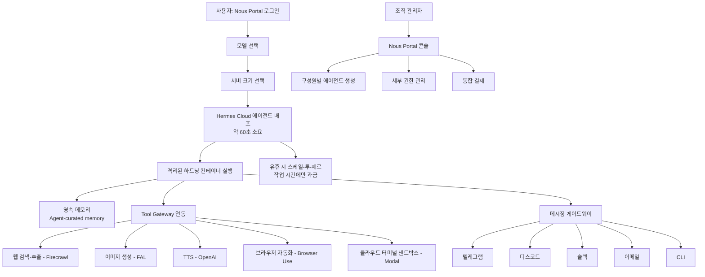

> 
> https://www.threads.com/@choi.openai/post/DajK_LmDqHs
> 
> Nous Research가 'Hermes Agent Cloud'를 공개했습니다.
> 
> 이제 모델과 서버 크기만 선택하면 약 1분 안에 항상 실행되는 AI 에이전트를 배포할 수 있는데요. 배포된 에이전트는 '지속 메모리(persistent memory)'를 활용하며 계속 실행되는 환경에서 작업을 이어갈 수 있습니다.
> 
> 기업 사용자를 위한 기능도 함께 제공됩니다.'*Nous Portal'에서 조직 구성원별 에이전트를 생성하고, 세부 권한 관리와 통합 결제를 지원한다고 합니다.
> 
> 요금은 서버 크기에 따라 달라지며, 자세한 내용은 'Hermes Cloud' 페이지에서 확인할 수 있습니다. AI 에이전트를 클라우드에서 상시 운영하려는 사용자들에게 새로운 선택지가 될 것으로 보입니다.
> 

## 1. 발표 개요

Nous Research는 공식 X(구 트위터) 계정을 통해 오픈소스 AI 에이전트 프로젝트 'Hermes Agent'의 클라우드 배포 기능인 'Hermes Cloud'를 공개했다. 공식 발표문의 핵심 문구는 다음과 같다. 모델과 서버 크기를 선택하기만 하면 두 번의 클릭과 약 60초 만에 에이전트가 실행 상태로 전환되며, 조직 단위로 사용할 경우 구성원별로 에이전트를 만들고 세부 권한을 관리하며 결제를 통합할 수 있다는 내용이다. 이 발표는 검색 시점(2026년 7월 9일) 기준으로 약 하루 전에 게시된 것으로 확인되며, 링크는 Nous Research가 운영하는 통합 구독 게이트웨이 'Nous Portal'의 클라우드 배포 페이지(portal.nousresearch.com/cloud)로 연결된다.

Threads에 게시된 원문 요약은 이 발표의 골자를 정확히 전달하고 있다. 다만 몇 가지 세부 사항, 특히 요금 구조와 서비스의 현재 상태(프리뷰 여부)에 대해서는 원문에 나오지 않은 내용이 있어, 아래에서 공식 페이지와 문서를 근거로 보완해 설명한다.

## 2. Hermes Agent란 무엇인가

이번 발표를 이해하려면 먼저 'Hermes Agent' 자체의 정체성을 짚을 필요가 있다. Hermes Agent는 Nous Research가 만든 오픈소스(MIT 라이선스) 자율 에이전트로, GitHub 저장소 기준 21만 개 이상의 스타와 3만 8천여 개의 포크를 보유하고 있다. 가장 최근 릴리스는 2026년 7월 1일에 배포된 v0.18.0("The Judgment Release")이며, 이는 이번 클라우드 기능 발표와 거의 같은 시점에 나온 버전이다.

Nous Research는 이 프로젝트를 "코딩 IDE에 종속된 코파일럿도 아니고 단일 API를 감싼 챗봇 래퍼도 아닌, 실행할수록 더 유능해지는 자율 에이전트"로 정의한다. 이 정의에는 세 가지 축이 담겨 있다.

첫째는 학습 루프다. Hermes Agent는 대화나 작업 경험으로부터 스스로 '스킬'을 만들어내고, 사용하면서 그 스킬을 개선하며, 주기적으로 스스로에게 지식을 기록하라는 신호(nudge)를 보낸다. 세션을 넘나드는 기억 회상에는 FTS5 전문 검색과 LLM 요약이 쓰이고, 사용자 모델링에는 Plastic Labs의 Honcho라는 변증법적(dialectic) 사용자 모델링 기술이 결합되어 있다.

둘째는 실행 환경의 다양성이다. 로컬 머신, Docker, SSH 원격 서버, Singularity, 그리고 서버리스 방식인 Daytona와 Modal까지 총 여섯 가지 백엔드를 지원한다. 이 중 Daytona와 Modal은 유휴 상태일 때 환경을 최대 절전(hibernate) 모드로 전환해 비용을 거의 발생시키지 않는다는 점이 특징으로 소개된다.

셋째는 접점의 확장성이다. 텔레그램, 디스코드, 슬랙, 왓츠앱, 시그널, 매트릭스, 매터모스트, 이메일, SMS, 딩톡, 페이시, 위챗워크, 위챗, QQ봇, 위안바오, 블루버블스, 홈어시스턴트, 마이크로소프트 팀즈, 구글 챗 등 20개가 넘는 플랫폼에서 하나의 게이트웨이 프로세스로 동일한 에이전트와 대화할 수 있다. 이는 경쟁 프로젝트로 자주 언급되는 OpenClaw 계열과 비교되는 지점이기도 하며, 실제로 Hermes Agent는 OpenClaw에서 설정, 메모리, 스킬, API 키를 그대로 가져오는 마이그레이션 명령(`hermes claw migrate`)까지 제공한다.

## 3. 'Hermes Agent Cloud'의 핵심 기능

이번에 공개된 클라우드 기능은 위와 같은 Hermes Agent를 사용자가 직접 서버를 구축하지 않고도 상시 실행 상태로 띄울 수 있게 해주는 관리형 서비스다. Nous Portal의 공식 소개 페이지에 따르면 핵심 기능은 다음 여섯 가지로 정리된다.

먼저 배포 방식이다. 이름과 모델만 고르면 별도의 서버 설정이나 DevOps 작업, YAML 설정 파일 작성 없이 몇 초 안에 에이전트가 온라인 상태가 된다고 설명한다. X 발표문에서는 여기에 '서버 크기 선택'이라는 단계가 추가로 언급되는데, 이는 컴퓨팅 자원의 규모(아마도 CPU·메모리 사양에 따른 등급)를 함께 고르는 절차로 보인다.

다음은 상시 가동과 과금 방식이다. 에이전트는 24시간 클라우드에 상주하지만, 유휴 상태일 때는 자동으로 스케일이 0으로 줄어들어 실제로 작업이 수행되는 시간에 대해서만 비용이 청구되는 구조라고 안내하고 있다. 이는 Hermes Agent가 원래 로컬 및 셀프호스팅 환경에서 지원하던 Daytona·Modal의 서버리스 절전 개념을 관리형 서비스 레벨로 그대로 옮겨온 것으로 볼 수 있다.

세 번째는 자연어 기반 예약 자동화다. 보고서 작성, 백업, 브리핑 등의 작업을 자연어로 일정을 지정해두면 게이트웨이를 통해 사람의 개입 없이 실행된다.

네 번째는 채널 통합이다. 텔레그램, 디스코드, 슬랙, 이메일, CLI 등 여러 접점에서 접속하더라도 하나의 클라우드 에이전트와 하나의 메모리를 공유한다.

다섯 번째는 메모리의 소재다. 기존 로컬 실행 방식에서는 메모리가 사용자의 기기(디스크)에 저장되지만, 클라우드 배포에서는 메모리가 기기가 아닌 에이전트 자체에 귀속된다. 따라서 사용자가 어느 기기로 접속하든 동일한 문제 해결 이력을 불러올 수 있다.

여섯 번째는 격리된 샌드박스다. 에이전트마다 독립된 하드닝(hardened) 컨테이너가 할당되며, 병렬로 서브에이전트를 띄우더라도 서로의 컨텍스트를 침범하지 않는다고 설명하고 있다.

## 4. 조직·팀을 위한 기능

X 발표문에서 별도로 강조한 부분은 팀 단위 활용이다. 조직 구성원 각각에게 에이전트를 만들어줄 수 있고, 세부적인 접근 권한 제어(granular access controls)와 통합 결제(unified billing)를 Nous Portal 한 곳에서 관리할 수 있다는 설명이다. 다만 이 기능의 구체적인 운영 방식, 예를 들어 몇 명까지 지원하는지, 권한 등급이 어떻게 구분되는지 같은 세부 사항은 이번 조사 시점까지 공개 페이지에 구체적으로 문서화되어 있지 않았다. 이는 실제로 조직 계정을 만들어 콘솔에 진입해야 확인 가능한 영역으로, 현재로서는 발표문 수준의 정보만 확인된다는 점을 밝혀둔다.

## 5. 요금 구조

Hermes Cloud 페이지는 클라우드 에이전트를 배포하려면 최소 10달러 상당의 크레딧을 충전하거나, 유료 구독이 활성화되어 있어야 한다고 명시하고 있다. 아울러 페이지 상단에는 "Hermes Cloud is currently in preview"라는 문구가 붙어 있어, 이 기능이 아직 정식 출시가 아닌 프리뷰(베타) 단계임을 스스로 밝히고 있다. 문제가 있거나 피드백이 있으면 디스코드 또는 지원 이메일로 연락하라는 안내도 함께 붙어 있다.

클라우드 에이전트의 과금은 Nous Portal의 구독 체계와 연동된다. Nous Portal은 2026년 7월 기준으로 아래 네 가지 요금제를 운영 중이다.

| 요금제 | 월 요금 | 주요 구성 |
|---|---|---|
| Free | $0 | 무료 모델 이용, 300개 이상 모델에 대한 종량제(Pay-As-You-Go) 접근 |
| Plus | $20 | 300개 이상 모델, 호스팅 툴 사용, 높은 요청 한도, 월 22달러 상당 크레딧(10% 보너스), 이월 한도 10달러 |
| Super | $100 | 300개 이상 모델, 호스팅 툴 사용, 더 높은 요청 한도, 월 110달러 상당 크레딧(10% 보너스), 이월 한도 50달러 |
| Ultra | $200 | 300개 이상 모델, 호스팅 툴 사용, 최고 요청 한도, 월 220달러 상당 크레딧(10% 보너스), 이월 한도 100달러 |

여기서 한 가지 명확히 구분해야 할 점이 있다. 위 표는 Nous Portal이라는 상위 구독 서비스의 요금제이며, 이 구독은 300개 이상의 모델 접근권과 웹 검색·이미지 생성·TTS·브라우저 자동화 등을 묶은 'Tool Gateway' 이용권을 포함한다. 반면 이번에 발표된 Hermes Cloud의 '서버 크기별' 컴퓨팅 비용, 즉 에이전트를 상시 실행하는 데 드는 인프라 비용이 정확히 얼마인지에 대한 세부 단가표는 공식 페이지에서 확인되지 않았다. 공식 페이지에는 "$10 최소 크레딧 또는 활성 구독 필요"라는 진입 조건만 명시되어 있을 뿐, 서버 크기(소형·중형·대형 등)별 시간당 또는 월간 과금 단가는 별도로 공개되어 있지 않다. 일부 소셜미디어 게시물에서 "월 10달러 미만으로 이용 가능하다"는 언급이 있었으나, 이는 개인 이용자의 체감 후기 수준이며 Nous Research가 공식적으로 발표한 가격표는 아니라는 점을 분명히 해둔다. 따라서 실제 조직 단위 운영 비용을 산정하려면 Nous Portal에 직접 가입해 콘솔에서 서버 크기별 크레딧 소모율을 확인하는 절차가 필요하다.

## 6. 자체 호스팅과 클라우드 배포의 차이

Hermes Agent는 애초에 오픈소스로 공개되어 개인이 직접 VPS나 도커 컨테이너에 설치해 운영하는 방식이 이미 폭넓게 쓰이고 있었다. Hetzner, DigitalOcean, Hostinger, Tencent Cloud Lighthouse 같은 클라우드 사업자들이 이미 자체적인 Hermes Agent 배포 템플릿이나 튜토리얼을 제공하고 있을 정도로, '상시 실행되는 개인 에이전트'에 대한 수요 자체는 이번 발표 이전부터 존재했다. 이런 배경에서 이번 Hermes Cloud는 Nous Research가 직접 관리형 옵션을 내놓아 인프라 구축의 번거로움을 없앤 것으로 이해할 수 있다.

두 방식의 차이를 정리하면 다음과 같다.

| 구분 | 자체 호스팅(셀프호스팅) | Hermes Agent Cloud |
|---|---|---|
| 초기 설정 | VPS 계약, OS 설치, 도커 설정, 방화벽·SSH 구성 등 직접 수행 | 이름과 모델, 서버 크기 선택만으로 약 60초 내 배포 |
| 인프라 관리 주체 | 사용자 본인(서버 유지보수, 장애 대응 포함) | Nous Research가 관리 |
| 비용 구조 | VPS 호스팅비(월 4~25달러 수준이 통상적으로 언급됨) + 별도의 LLM API 사용료 | Nous Portal 구독 또는 크레딧 충전을 통한 통합 과금(정확한 단가는 미공개) |
| 메모리 저장 위치 | 사용자가 지정한 서버의 디스크 | 클라우드 에이전트 자체(기기에 종속되지 않음) |
| 데이터 통제권 | 서버 전체에 대한 통제권을 사용자가 보유 | Nous Research의 인프라에 의존 |
| 조직·팀 기능 | 별도 구축 필요 | Nous Portal에서 구성원별 에이전트, 권한 관리, 통합 결제 제공 |
| 서비스 상태 | 성숙한 오픈소스 생태계, 다수의 서드파티 호스팅 가이드 존재 | 공식적으로 "프리뷰(preview)" 단계 |

## 7. 배포 흐름과 구조

Hermes Agent Cloud를 이용할 때의 전체적인 흐름을 도식으로 정리하면 다음과 같다.

이 구조에서 눈여겨볼 부분은 Tool Gateway다. Nous Portal 구독에 포함된 이 게이트웨이는 웹 검색·추출을 Firecrawl, 이미지 생성을 FAL(플럭스 2, Z-Image Turbo, 나노바나나 프로 등 9개 모델 지원), 음성 합성을 OpenAI TTS, 브라우저 자동화를 Browser Use, 코드 실행용 클라우드 터미널 샌드박스를 Modal이 각각 담당하는 방식으로 구성되어 있다. 원래 이 다섯 가지를 각각 쓰려면 다섯 개의 서로 다른 계정과 API 키, 다섯 개의 청구서를 관리해야 하지만, Portal 구독 하나로 이를 통합한 것이 Hermes Agent 생태계 전체의 특징이며, 클라우드 배포에서도 동일하게 적용된다.

## 8. 모델 접근과 관련한 참고 사항

Nous Portal을 통해 접근 가능한 모델 목록에는 앤트로픽의 Opus 4.7·Opus 4.6·Sonnet 4.6·Haiku 4.5, 오픈AI의 GPT-5.5 계열, 구글 제미나이 3 계열, 딥시크 V4 Pro, 알리바바 Qwen3.7-Max, 문샷 Kimi K2.6, 지푸 GLM-5.1, 미니맥스 M2.7, xAI Grok 4.3, 엔비디아 Nemotron-3, 텐센트 훈위안 3 등 300개 이상이 포함되어 있으며 이는 OpenRouter를 경유해 라우팅되는 구조다. 다만 Nous Research 자체 모델인 Hermes-4-70B·Hermes-4-405B는 대화와 추론에 특화되어 있을 뿐 도구 호출이 빈번한 에이전트 워크플로우에는 권장되지 않는다고 공식 문서에 명시되어 있다. 즉 Hermes Cloud로 에이전트를 배포할 때 모델을 고르는 단계에서 'Hermes'라는 이름 때문에 자사 모델을 선택하면 오히려 에이전트 성능이 떨어질 수 있다는 점을 Nous Research 스스로 경고하고 있는 셈이다.

## 9. 종합 정리

이번 발표는 이미 21만 개 이상의 GitHub 스타를 보유한 오픈소스 자율 에이전트 프로젝트가 '셀프호스팅 전용' 단계를 넘어 관리형 클라우드 서비스로 확장하는 움직임으로 볼 수 있다. 원 발표문에 담긴 핵심 정보, 즉 모델과 서버 크기 선택만으로 약 1분 내 배포, 영속 메모리, 조직용 구성원별 에이전트와 권한·결제 통합 기능은 모두 공식 페이지와 문서를 통해 확인되었다.

다만 두 가지는 명확히 구분해서 받아들일 필요가 있다. 첫째, 이 서비스는 현재 '프리뷰' 단계이며 최소 10달러 크레딧 또는 활성 구독이 필요하다는 진입 조건 외에, 서버 크기별 정확한 과금 단가는 조사 시점까지 공개 문서에서 확인되지 않았다. 둘째, 조직 기능의 세부 운영 방식(권한 등급 체계, 인원 제한 등)도 아직 발표문 이상의 구체적 문서화가 이루어지지 않은 상태다. 따라서 실제 도입을 검토한다면 Nous Portal 콘솔에 직접 접속해 최신 조건을 확인하는 절차가 필요하며, 프리뷰 단계 서비스 특성상 세부 사항이 향후 변경될 가능성도 열어두는 것이 합리적이다.

## 참고 자료

- Nous Research 공식 X(트위터) 발표, 2026년 7월 8일경 (검색 시점 기준 약 18시간 전 게시 확인)
- Hermes Cloud 공식 소개 페이지, portal.nousresearch.com/cloud
- Nous Portal 구독 관리 페이지, portal.nousresearch.com/manage-subscription
- Hermes Agent 공식 문서 – Nous Portal 연동 안내, hermes-agent.nousresearch.com/docs/integrations/nous-portal
- Hermes Agent 공식 문서 홈, hermes-agent.nousresearch.com/docs
- GitHub 저장소 NousResearch/hermes-agent (스타 210k, 포크 38.3k, 최신 릴리스 v0.18.0 "The Judgment Release", 2026년 7월 1일 배포 확인)

---
작성일자: 2026년 7월 9일
