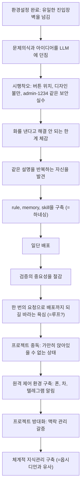
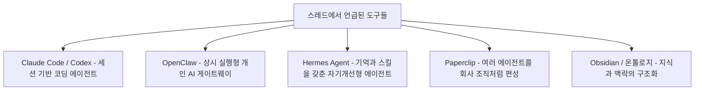

> 
> https://www.threads.com/@dorm_edu/post/DadOSTtiXqF
> 
> 저는 오픈 클로를 사용해본적이 없고
> 
> 헤르메스는 시도해봤는데 딱히 뭘 어떻게 쓴다는건지도 모르겠고
> 
> 옵시디언으로 제2의 뇌를 만들었다고 노드를 막 흔들흔들 하는 영상도 그래서 저걸로 뭘 한다는지 모르겠고
> 
> 무슨 AI 직원 30명을 고용했다는 영상을 봐도 저게 정말 제대로 협업이 이루어지고 뭔가 만들어내고 있는지 
>
> 아니면 그냥 에이전트를 시각화하면서 토큰 낭비한건 아닌가 의심스럽습니다..
> 
> 새로운 LLM 모델이 나오면 맨날 이제 클로드 코드 끝났다, 코덱스 끝났다 하는 것도 더 이상 감흥이 없습니다.
> 

---

## 1. 무엇에 대한 회의였나

이 스레드의 원문 게시자는 최근 AI 에이전트 생태계에서 유행하는 몇 가지 현상에 대해 누적된 피로감을 토로하는 것으로 글을 시작합니다. 나열된 회의감의 대상은 크게 다섯 가지입니다.

첫째, 오픈클로를 써본 적이 없고, 헤르메스는 시도해봤지만 정작 무엇을 어떻게 활용해야 하는지 실감이 나지 않는다는 점입니다. 둘째, 옵시디언으로 "제2의 뇌"를 만들었다며 그래프 뷰의 노드를 흔들어 보여주는 영상들을 봐도, 그것으로 실제 무엇을 하는지 알 수 없다는 것입니다. 셋째, "AI 직원 30명을 고용했다"는 식의 영상을 봐도, 진짜 협업이 이루어지며 결과물을 만들어내고 있는 것인지, 아니면 에이전트 조직도를 시각화하며 토큰만 낭비하고 있는 것인지 의심스럽다는 것입니다. 넷째, 새 모델이 나올 때마다 "이제 클로드 코드는 끝났다", "코덱스는 끝났다"는 식의 호들갑에 더 이상 감흥이 없다는 것. 다섯째, 바이브코딩을 유료 강의로 배우는 것에도 회의적인데, 강의를 만드는 사람들 본인이 실제로 무엇을 만들었는지부터 확인해야 하고, 강의 촬영에 바빠서 정작 스스로 문제의식을 가지고 바이브코딩을 충분히 돌려볼 시간이 없었을 가능성이 크다는 것입니다.

이 다섯 가지는 서로 다른 대상을 향하고 있지만 공통된 축이 하나 있습니다. **도구와 데모의 화려함이, 실제로 무엇이 만들어지고 무엇이 개선되었는가라는 질문을 가려버리는 현상**에 대한 경계심입니다.

---

## 2. 원문 게시자가 그린 "바이브코딩 성숙 여정" — 8단계

회의감을 나열한 뒤, 게시자는 자신이 관찰하고 경험한 바이브코딩 숙련 과정을 순서대로 서술합니다. 이 부분이 원문에서 가장 공을 들인 대목이며, 댓글들도 이 흐름에 가장 많이 공감했습니다. 아래는 원문의 흐름을 단계별로 정리하고 해설을 붙인 것입니다.

**1단계, 환경설정.** 게시자는 바이브코딩의 유일한 진입장벽은 개발 환경을 세팅하는 일이라고 말합니다. 이 문턱만 넘으면 그다음부터는 도구의 문제가 아니라 사람의 문제라는 것이 핵심 주장입니다.

**2단계, 문제의식 투입.** 환경설정이 끝나면 곧바로 자신이 풀고 싶은 문제와 아이디어를 LLM에게 던지는 것으로 시작된다고 설명합니다. 즉 바이브코딩의 출발점은 도구 선택이 아니라 "내가 무엇을 만들고 싶은가"라는 질문입니다.

**3단계, 시행착오.** 버튼 위치가 마음에 안 들어 밤새 고치고, 디자인이 촌스럽다고 AI에게 불평하고, `admin/1234` 같은 어처구니없는 보안 실수를 저지르는 과정을 통해 요령이 쌓인다고 말합니다. 이 대목은 실패를 실패로 남기지 않고 학습 재료로 삼는 태도를 강조합니다.

**4단계, 한계 체감과 반복 설명의 피로.** 단순히 LLM에게 화를 낸다고 문제가 풀리지 않는다는 것을 깨닫는 지점을 지나면, 매번 똑같은 설명을 반복하고 있는 자기 자신을 발견하게 됩니다.

**5단계, 규칙·기억·스킬 구축(하네싱).** 반복 설명의 피로를 줄이기 위해 규칙(rule), 기억(memory), 스킬(skill) 같은 장치를 스스로 고민하고 구축하게 되는데, 게시자는 이것이 결국 헤르메스 같은 "나를 기억해주는 LLM"이 만들어지는 과정과 본질적으로 같다고 봅니다. 그러면서 하네스 엔지니어링이니 루프 엔지니어링이니 하는 새로운 용어를 만드는 것 자체에는 크게 의미를 두지 않는다고 덧붙입니다. 자신이 원하는 방식으로 AI가 작동하기만 하면 충분하다는 것입니다.

**6단계, 배포.** 그다음 단계는 일단 공개하는 것입니다. 배포하고 나면 허술한 부분들을 조금씩 고치게 됩니다.

**7단계, 검증의 절감.** "제대로 확인하고 배포해!"라고 아무리 스스로 다짐해도 뜻대로 되지 않는 순간을 겪으면서, 검증이라는 절차가 왜 중요한지 몸으로 깨닫게 됩니다.

**8단계, 자동화 욕심과 프로젝트 중독.** 한 번의 요청만으로 배포까지 알아서 끝나길 바라는 욕심이 생기는데, 게시자는 이것이 흔히 말하는 루프 엔지니어링에 해당하는 것인지 스스로도 확신하지 못한 채 질문으로 남겨둡니다. 이 즈음이면 프로젝트를 계속 만드는 일에서 손을 뗄 수 없는 상태, 즉 일상적인 몰입 상태에 들어선다고 표현합니다.

**9단계, 원격 제어.** 일상 중에도 프로젝트를 챙기고 싶어지면서, 폰으로 전화하듯 프롬프트를 넣고 싶고, 차 안에서도 지시를 내리고 싶고, 터미널을 폰으로 들여다보고 싶고, 작업이 끝나면 텔레그램으로 알림이 오길 바라게 됩니다. 게시자는 이 욕구가 결국 오픈클로 같은 상시 실행형 개인 비서 시스템을 스스로 구축하는 과정, 혹은 "헤이 자비스" 하고 부르면 반응하는 비서를 만드는 과정과 비슷하다고 짚습니다.

**10단계, 지식/맥락 관리.** 프로젝트가 너무 많고 방대해지면 이걸 사람들에게 어떻게 소개하고, AI가 필요한 맥락을 그때그때 꺼내 쓰게 할지 감이 안 오기 시작합니다. 이 문제를 체계적으로 풀려는 시도가 결국 옵시디언과 비슷한 것을 구축하는 과정으로 이어진다고 말합니다.

게시자는 이 전체 여정을 정리하며, 바이브코딩이란 원하는 결과물을 위한 수단으로 모델과 도구가 존재하는 것이지, 어떤 수단을 거치면 결과가 저절로 나온다는 식의 마케팅에 속아서는 안 된다는 점을 결론으로 제시합니다. 그리고 과정보다 결과, 즉 "지금 내가 무엇을 만들었고 그것이 잘 작동하는가", "문제의식과 의도가 좋은가"가 진짜 중요한 질문이라고 마무리합니다.

---

## 3. 댓글에서 드러난 다섯 갈래의 공감과 보완

댓글들은 원문의 주장에 대체로 공감하면서, 각자의 실무 경험을 덧붙여 논지를 보강합니다. 주제별로 묶어 정리합니다.

### 3-1. 목적의식이 먼저다 — 온톨로지를 매개로 한 반응

한 댓글은 마침 그날 온톨로지에 관한 글을 읽었다며, 원문 게시자가 마지막에 언급한 "AI가 맥락을 알게 하는 것"이 바로 온톨로지 개념과 맞닿아 있다고 짚습니다. 다만 이 댓글의 핵심은 온톨로지라는 개념 자체를 소개하는 데 있지 않고, "내가 무슨 목적으로 이 일을 하고 있는가가 중요하지, 이걸로 멋있어 보이는 것을 만들었는가는 중요하지 않다"는 결론으로 이어집니다. 즉 온톨로지 역시 목적을 위한 하나의 수단일 뿐이라는 것이며, 원문의 결론과 정확히 같은 방향입니다.

### 3-2. 하네싱은 만능이 아니라 적재적소의 도구다 — 실무자의 냉정한 평가

실무에서 실제 제품을 만들어본 댓글 작성자는, 헤르메스 같은 정교한 하네싱은 실제 프로덕트 초기 개발 단계에는 과할 수 있다고 지적합니다. 이런 도구는 이미 업무가 어느 정도 매뉴얼화되어 반복적으로 수행되는 일, 그리고 여러 도구 중 무엇을 호출할지 능동적인 판단이 필요한 일에 적합하다는 것입니다. 결과적으로 제품 개발이 끝나거나 서비스가 어느 정도 궤도에 오른 뒤에 이런 도구를 도입하는 것은 의미가 있지만, AI 사용 자체에 매몰되는 것은 결국 기술적 FOMO(잊혀지는 것에 대한 두려움)를 이용하는 마케팅에 지나지 않는다고 진단합니다.

### 3-3. 바이럴과 기술적 FOMO의 경계

위 댓글은 이어서, 옵시디언 그래프 뷰의 노드가 흔들리는 장면이나 페이퍼클립류의 "AI 회사" 조직도를 시각화한 화면이 바이럴이 워낙 잘 되기 때문에, 이런 화려함이 실질적 가치와 무관하게 소비되고 있다고 짚습니다. 다른 댓글 작성자들도 자신이 옵시디언의 "흔들흔들"에 흔들렸던 스스로를 반성한다고 밝히며 이 지적에 동의를 표합니다.

### 3-4. 나만 그런 게 아니었다 — 원격 근무 도구 잔혹사

여러 댓글이 원문의 9단계(원격 제어 욕구)에 강하게 공감하며 각자의 경험을 공유합니다. 팀뷰어로 원격 접속해 일을 시키고, 크롬 원격 데스크톱으로 회사에서 집의 컴퓨터에 일을 시키고, 점프 데스크탑으로 일을 시키다가 유료 결제를 고민하게 된다는 경험담이 이어집니다. 한 댓글은 "한영 전환 버튼만 잘 먹으면 이게 최고인 것 같다"며 아이를 씻기다가도 들여다보게 된다고 언급하고, 이 상태를 코인 선물 거래를 하던 기분에 비유합니다. 이 경험들은 원문이 말한 "프로젝트 중독"과 "상시 접속 갈증"이 여러 사람에게 공통적으로 나타나는 패턴임을 보여줍니다.

### 3-5. 도구보다 결과, 배포 후 지속가능성

가장 많은 공감을 받은 축약형 댓글은 다음과 같은 취지로 요약됩니다. 도구 이름이 무엇인지보다 실제로 무엇이 줄어들었는지, 그리고 배포한 뒤에도 계속 돌아가는지가 핵심이며, 돌아가지 않는다면 그것은 포장만 그럴듯한 것에 불과하다는 것입니다. 비슷한 맥락에서 다른 댓글은 삽질을 통해 얻은 자기만의 자산을 정식(순정) 에이전트 워크플로로 프로세스화하면 될 일을, 그것이 잘 안 되기 때문에 오픈클로나 헤르메스 같은 기성 도구에 의존하게 되는 것이 아니냐고 지적합니다. 쉬운 길로 가려는 경향이 대부분의 이유라는 것입니다.

실제 제품 운영 경험이 있는 댓글 작성자는 여러 에이전트를 동시에 붙이는 데모를 조심스럽게 본다고 말하며, 막상 운영에 투입하면 산출물보다 로그와 책임 소재를 먼저 정리해야 하는 문제에 부딪힌다고 밝힙니다. 이는 데모 단계에서는 잘 드러나지 않는, 운영 단계 특유의 현실적인 제약을 짚은 지적입니다. 마지막으로 "시스템 구축을 보여주기 위한 시스템 구축은 구리다"는 짧은 댓글이 전체 스레드의 정서를 압축해서 대변합니다.

---

## 4. 스레드에 등장한 도구·개념 팩트체크

스레드에서 이름만 언급되고 지나간 도구들에 대해, 별도로 검색을 통해 확인한 사실관계를 정리합니다. 스레드 본문의 주장과는 분리해서, 검증 가능한 배경 정보로만 다룹니다.

| 명칭 | 정체 | 핵심 특징(확인된 사실) | 비고 |
|---|---|---|---|
| 오픈클로(OpenClaw) | 원래 Moltbot·Clawdbot이라는 이름으로 시작한 오픈소스 자율 에이전트 플랫폼 | 왓츠앱·텔레그램·디스코드 같은 메신저와 AI 에이전트를 연결하는 자체 호스팅 게이트웨이. 세션이 끝나도 기억이 유지되지 않는 기존 도구들과 달리, 로컬 PC나 서버에 배포되면 상시 실행되는 개인 AI 레이어로 작동. 엔비디아 CEO 젠슨 황은 2026년 3월 GTC 행사에서 오픈클로가 리눅스를 능가할 수 있는 오픈소스 프로젝트가 될 것이라는 취지로 평가함 | 2026년 초 이후 보안 우려도 함께 제기됨. Gartner는 개인용 AI 비서를 조직에서 통제 없이 쓰는 것을 경계하라는 보고서를 냈고, 클라이언트·서버 검증 미비에서 비롯된 CVE-2026-25253 취약점도 보고된 바 있음 |
| 헤르메스 에이전트(Hermes Agent) | Nous Research가 2026년 2월 26일 공개한 오픈소스 AI 에이전트, MIT 라이선스 | 터미널 CLI이자 동시에 메신저 게이트웨이로 작동하며, 디스크에 정체성과 장기 기억을 저장하고 스스로 스킬을 생성함. 복잡한 작업이 끝난 뒤 백그라운드에서 대화를 복기해 스킬을 만들고, 7일 주기로 백그라운드 큐레이터가 스킬·기억 라이브러리 전체를 정리하는 것이 특징 | "자기 개선형(self-improving)"이라는 표현은 모델 자체가 재학습된다는 뜻이 아니라, 기억과 스킬이 누적되면서 점점 더 잘 일하게 된다는 뜻에 가까움 |
| 페이퍼클립(Paperclip) | 2026년 3월 출시된 오픈소스 "Company OS" 콘셉트의 멀티 에이전트 오케스트레이션 플랫폼 | 클로드 코드, 오픈클로, 코덱스, 커서 같은 기존 에이전트를 그대로 가져와 CEO·CTO·마케터 같은 직함과 조직도를 부여하고, 목표·예산·승인 절차·감사 로그로 관리함. 스레드에서 언급된 "AI 직원 30명 고용" 류의 영상은 이 도구의 조직도 시각화 화면을 가리키는 것으로 보임 | 출시 5주 만에 GitHub 스타 5만 개를 넘길 만큼 화제성이 컸지만, 다수 분석글은 이 시점의 완성도를 V0.3 수준으로 평가하며 수익 모델과 보안 체계가 아직 미비해 프로덕션에 바로 투입하기는 이르다고 지적함 |
| 옵시디언(Obsidian) | 마크다운 기반 개인 지식관리 노트 앱 | PARA, 제텔카스텐 같은 방법론과 결합해 노트 간 연결을 그래프 뷰로 시각화하는 기능이 핵심. 마크다운 형식이 AI 모델과 궁합이 좋아 최근 AI 연동 활용법 콘텐츠가 많음 | 그래프 뷰의 노드가 흔들리는 화면 자체는 시각적 연출이며, 실제 지식관리 성과는 규칙(태그 체계, 폴더 구조 등)을 얼마나 일관되게 적용하느냐에 좌우됨 |
| 온톨로지(Ontology) | 특정 분야의 개념·속성·관계를 명확히 정의해 구조화한 지식 모델 | 사람마다 다르게 표현하는 용어를 AI와 인간이 동일한 의미로 해석하도록 만드는 공유 어휘 체계. 팔란티어(Palantir)나 마이크로소프트 Fabric IQ 같은 기업용 플랫폼에서 에이전트가 도메인 간 일관되게 추론하도록 하는 공유 컨텍스트 계층으로 활용됨 | 개인이 옵시디언 같은 도구로 만드는 지식 그래프와, 기업이 구축하는 정식 온톨로지는 정교함과 목적의 규모가 다름. 다만 "AI가 흩어진 맥락을 이해하게 만든다"는 지향점은 통함 |

---

## 5. 종합: 이 스레드가 말하고 있는 것

이 스레드를 관통하는 메시지는 결국 하나로 수렴합니다. 오픈클로, 헤르메스, 페이퍼클립, 옵시디언 같은 이름들은 저마다 다른 문제를 풀기 위해 나온 도구이지만, 그 이름 자체가 성과를 보장하지는 않는다는 것입니다. 원문 게시자가 그린 여정, 즉 환경설정에서 시작해 시행착오와 반복 설명의 피로를 거쳐 규칙·기억·스킬을 스스로 구축하고, 배포와 검증을 겪고, 결국 원격 제어와 지식관리 체계까지 손을 뻗게 되는 흐름은, 도구를 먼저 정해두고 따라가는 것이 아니라 실제로 부딪힌 문제를 풀다 보니 자연스럽게 그런 구조에 도달하게 된다는 순서를 강조합니다. 댓글들이 공통적으로 짚은 지점도 같은 방향입니다. 목적의식이 먼저이고, 도구는 그다음이며, 화려한 시각화나 최신 도구의 이름은 실제로 무엇이 줄었고 배포 후에도 계속 돌아가는지를 가려서는 안 된다는 것입니다.

다만 이 스레드가 다소 유보적으로 남겨둔 지점도 있습니다. "하네스 엔지니어링", "루프 엔지니어링" 같은 용어를 만드는 일 자체에는 큰 의미를 두지 않는다는 원문의 태도와, 이런 개념을 정교하게 체계화하려는 시도들 사이에는 실제로 긴장 관계가 있습니다. 다만 두 입장이 반드시 배치되는 것은 아닙니다. 이 스레드에서 반복적으로 등장한 경험, 즉 같은 설명을 반복하다가 규칙과 기억 장치를 만들게 되고, 배포 이후 검증의 중요성을 체감하고, 여러 에이전트를 동시에 운영할 때 산출물보다 로그와 책임 소재가 먼저 걸린다는 실무자의 지적은, 용어의 이름을 붙이든 붙이지 않든 실제로 겪게 되는 동일한 현상을 가리키고 있습니다. 즉 용어가 새로운 현상을 만드는 것이 아니라, 이미 벌어지고 있는 현상에 대해 나중에 이름이 붙는 것에 가깝다고 볼 수 있습니다. 이 지점에서 이 스레드는 도구와 용어의 유행에 휩쓸리기보다, 자신이 직접 부딪혀 얻은 경험을 신뢰하라는 메시지로 요약할 수 있습니다.

---

## 6. 참고자료

- Hermes Agent 공식 소개 페이지, hermes-agent.org
- "Hermes Agent란 무엇인가" 실전 가이드, WikiDocs (2026)
- "자기 개선형 AI 에이전트인 Hermes Agent의 실무자 가이드", PyTorchKR (2026.5)
- "OpenClaw 설명: AI 비서에서 자율 에이전트로", Kingspec (2026.3)
- "오픈클로(OpenClaw)란? 직접 사용하면서 깨달은 문제점", 데이터클리닉 블로그
- OpenClaw 나무위키 문서 (2026.5 갱신)
- "'Next-generation ChatGPT' OpenClaw, how far can it go?", 경향신문 영문판 (2026.3)
- "AI 에이전트의 습격? 오픈클로와 몰트북", 이글루코퍼레이션 Security & Intelligence (2026.3)
- "Paperclip, AI 에이전트로 회사를 굴리는 오픈소스 조직도" 및 "Paperclip: AI 에이전트를 '직원'처럼 관리한다는 발상의 전환", 박재홍의 실리콘밸리 (2026.4)
- "AI 에이전트 20개를 회사처럼 굴리는 오픈소스, Paperclip", DEV Community (2026.3)
- "Paperclip — AI 에이전트로 '무인 회사'를 운영하는 오픈소스 프레임워크", SOTAAZ Blog (2026.4)
- "온톨로지란? 온톨로지가 에이전틱 AI 시대의 필수 요소인 이유", S2W (2025.12)
- "온톨로지(미리 보기)란?", Microsoft Learn - Microsoft Fabric (2026.1)

---

