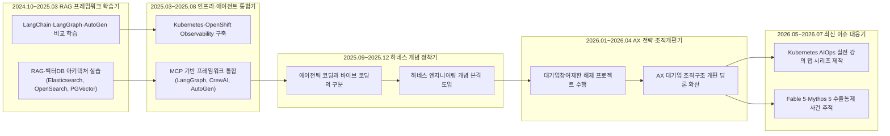
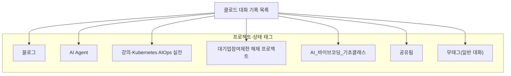

## 1. 이 문서의 정체

첨부해 주신 텍스트는 클로드(Claude.ai) 웹 인터페이스의 [왼쪽 대화 목록](https://k82022603.github.io/archives/)(사이드바)을 그대로 텍스트로 옮겨 놓은 것입니다. 클로드 인터페이스는 사용자가 그동안 나눈 대화를 시간 역순으로, 즉 가장 최근 대화가 맨 위에, 가장 오래된 대화가 맨 아래에 오도록 나열합니다. 첨부된 목록도 정확히 이 구조를 따르고 있어서, 맨 위의 "Why companies can't switch to cheaper AI models"(24시간 전)부터 시작해서 맨 아래의 "Exploring the Student Discounts for Anthropic's Claude"(2024년 10월 12일)까지, 대략 1년 9개월에 걸친 대화 제목이 순서대로 담겨 있습니다.

한 줄 한 줄의 구조를 뜯어보면 각 대화 항목은 사실상 두 가지 정보로 이루어져 있습니다.

첫째는 **대화 제목**입니다. 이는 클로드가 대화 초반 내용을 바탕으로 자동으로 붙이거나, 사용자가 직접 이름을 바꾼 제목입니다. 국문과 영문이 뒤섞여 있는 것도 눈에 띄는데, 이는 클로드가 대화의 주제나 사용된 언어에 따라 제목을 다르게 생성하는 경향과 관련이 있는 것으로 보입니다.

둘째는 **프로젝트 태그와 날짜**입니다. 클로드에는 "프로젝트(Projects)"라는 기능이 있어서, 특정 주제의 대화들을 하나의 폴더처럼 묶어둘 수 있습니다. 목록에서 "블로그", "AI Agent", "강의-Kubernetes AIOps 실전", "대기업참여제한 해제 프로젝트", "AI_바이브코딩_기초클래스"라는 이름이 반복적으로 등장하는데, 이것들이 바로 사용자가 만들어 둔 프로젝트 폴더의 이름입니다. 태그가 붙지 않은 대화는 어떤 프로젝트에도 속하지 않은, 프로젝트 바깥에서 이루어진 일반 대화입니다. 그리고 "공유됨"이라는 표시는 해당 대화를 외부에 공유 링크로 내보낸 적이 있다는 뜻입니다.

날짜 표기 방식도 클로드 인터페이스의 일반적인 규칙을 그대로 따르고 있습니다. 아주 최근 대화는 "24시간 전", "그저께", "3일 전", "7일 전"처럼 상대적인 시간으로 표시되고, 조금 더 지난 대화는 올해 안이라면 "6월 29일"처럼 연도 없이 월/일만 표시되며, 해가 바뀐 대화는 "2025년 12월 31일"처럼 연도까지 포함해 표시됩니다. 이 규칙 덕분에 목록만 봐도 대화가 발생한 시점을 상당히 정확하게 추정할 수 있습니다.

## 2. 전체 규모와 시간 범위

목록의 맨 위 항목이 "24시간 전"이라는 점, 그리고 오늘이 2026년 7월 6일이라는 점을 함께 고려하면, 이 목록은 2026년 7월 초까지의 대화를 담고 있고, 가장 오래된 항목인 2024년 10월 12일 대화까지 거슬러 올라갑니다. 즉 이 목록 하나에 **약 1년 9개월(21개월가량)의 클로드 사용 이력**이 압축되어 있는 셈입니다.

정확한 항목 수를 한 자리까지 세는 것은 목록의 분량 자체가 방대하여(체감상 수백 건을 훌쩍 넘는 규모) 눈으로 정확히 세는 것은 신뢰할 수 없는 방법이라고 판단했습니다. 그래서 이 문서에서는 "정확히 몇 건이다"라는 식의 숫자를 억지로 만들어내지 않고, 대신 시기별·주제별 구조와 흐름을 중심으로 서술하겠습니다. 이 점에서 확실하게 말할 수 있는 것은, 이 목록이 하루이틀의 기록이 아니라 **거의 2년 가까이 거의 매일, 어떤 날은 하루에도 열 건 넘게** 클로드를 사용해 온 상당히 밀도 높은 기록이라는 사실입니다.

## 3. 프로젝트 태그로 본 활동의 갈래

목록에 등장하는 프로젝트 태그들은 각각 뚜렷한 성격을 가지고 있어서, 이것만 따로 떼어 봐도 어떤 일을 병행해 왔는지 알 수 있습니다.

**"블로그"** 태그는 목록 전체에서 가장 자주 등장하는 축에 속하며, 특히 2025년 하반기 이후로 갈수록 비중이 커집니다. 이 태그가 붙은 대화들은 유튜브 영상, 트위터(X) 게시물, 뉴스 기사, 블로그 글 등 외부 콘텐츠를 가져와 한국어 마크다운 문서로 정리하거나, 스스로의 생각을 서술형으로 정리해 블로그에 올리기 위한 초안을 만드는 작업들입니다. "하네스 엔지니어링", "AX 전략", "Claude Code", "루프 엔지니어링" 같은 키워드가 반복해서 등장하는 것도 바로 이 태그 안에서입니다.

**"AI Agent"** 태그는 좀 더 이른 시기인 2025년 초중반에 집중되어 있고, LangChain, LangGraph, AutoGen, CrewAI, MCP(Model Context Protocol) 같은 에이전트 프레임워크를 학습하고 비교하는 대화들이 주로 여기에 묶여 있습니다. 이후 이 관심사가 "블로그" 태그 쪽으로, 즉 학습에서 콘텐츠화로 자연스럽게 이동해 간 흐름이 보입니다.

**"강의-Kubernetes AIOps 실전"** 태그는 2026년 6월 11일 하루에 집중적으로 등장하는데, Azure AKS 기반 클러스터 배포, Service/Ingress/카나리 배포, Volume과 StorageClass, 리소스 관리, 워크로드 배치 제어, NetworkPolicy, 고가용성, 모니터링, k8sgpt·kubectl-ai 같은 AI 기반 쿠버네티스 도구, 그리고 평가 문제 해설까지 이어지는 하나의 완결된 랩(Lab) 시리즈로 구성되어 있습니다. 이는 쿠버네티스 기반 AIOps를 주제로 한 강의 교재를 랩 단위로 순차 제작한 결과물로 보입니다.

**"대기업참여제한 해제 프로젝트"** 는 2025년 말부터 2026년 초 사이에 집중된 태그로, 기안기 및 업무관리 시스템, 이택스(지방세 전자신고), 에듀파인 RPA, Oracle Coherence와 RAC 아키텍처 비교 등 공공·행정 성격이 짙은 정보시스템 관련 대화들이 묶여 있습니다. 이름 자체에서 유추할 수 있듯, 특정 공공기관 또는 대기업 발주 사업에서 중소·중견기업의 참여를 제한하던 규제가 풀리는 상황에 대응하기 위한 사업 제안이나 시스템 구조 재검토 작업으로 보입니다.

**"AI_바이브코딩_기초클래스"** 태그는 2025년 2~3월에 집중되어 있으며, 바이브 코딩 입문자를 위한 강의 자료, 파워포인트 제작, Windows/Docker 환경에서의 PostgreSQL 구축 실습, MCP 날씨 서버 실습 등 교육용 콘텐츠로 채워져 있습니다.

**"공유됨"** 표시는 태그라기보다는 상태 표시에 가까운데, 국제 정세, 국내 정치, 노동 이슈, AI 산업 동향 등 누군가와 공유할 만한 가치가 있다고 판단한 대화에 붙어 있는 경우가 많습니다.

마지막으로 **태그가 없는 대화**들도 상당한 비중을 차지합니다. 이 부류에는 순수한 사회·정치 논평(부동산, 정치인 관련 사실 확인, 국제 분쟁 등), 개인적인 실무 트러블슈팅(Tomcat, Jenkins, PostgreSQL 설정 오류 등), 그리고 이따금씩 등장하는 개인적인 질문(게임 아이디 추천, 여행, 건강 관련 문의 등)이 섞여 있습니다.

## 4. 시간 흐름으로 본 관심사의 변화

목록을 시간순으로 훑어보면, 단순한 대화 모음이 아니라 하나의 뚜렷한 학습·전문성 발전 궤적이 읽힙니다. 이를 몇 개의 국면으로 나누어 설명하겠습니다.

### 2024년 10월~2025년 3월: RAG와 에이전트 프레임워크 학습기

목록의 가장 오래된 구간은 순수하게 기술을 익히는 단계입니다. Elasticsearch, OpenSearch, PGVector 사이의 벡터 검색 성능 비교, 하이브리드 서치(BM25+벡터) 구현, PDF 임베딩 파이프라인 구축, LangGraph와 AutoGen의 기초 튜토리얼, MCP(Model Context Protocol)의 개념 정리 등이 반복적으로 등장합니다. 이 시기의 대화는 실습 코드의 오류를 고치고, 프레임워크 버전 마이그레이션(AutoGen 0.2→0.4 등)을 다루는 실무형 트러블슈팅이 많은 비중을 차지합니다. 동시에 "바이브 코딩"이라는 표현이 이 시기부터 등장하기 시작해, 이후 계속 반복되는 핵심 주제어로 자리잡습니다.

### 2025년 3월~8월: 인프라와 에이전트의 결합기

이 시기에는 Kubernetes/OpenShift 기반의 관찰가능성(Observability) 구축, 즉 Prometheus·Grafana·Loki·Tempo를 활용한 로깅/모니터링 아키텍처 설계, MSA(마이크로서비스 아키텍처) 구축, 그리고 병원(한림의료원)이나 커머스 플랫폼(현대백화점) 같은 실제 기업 사례를 다루는 아키텍처 워크숍 자료가 다수 등장합니다. 동시에 12-Factor Agents, MCP와 LangGraph/CrewAI/AutoGen의 통합 아키텍처처럼, 여러 에이전트 프레임워크를 조합해 실제 서비스에 적용하는 방향으로 관심사가 확장됩니다.

### 2025년 9월~12월: 하네스(Harness) 개념의 정착기

이 구간부터 "에이전틱 코딩(Agentic Coding)"과 "바이브 코딩(Vibe Coding)"을 구분하려는 시도, 그리고 "하네스 엔지니어링(Harness Engineering)"이라는 개념이 뚜렷하게 자리를 잡습니다. Claude Code의 등장과 확산, AI 코딩 도구의 생산성 역설(속도는 빨라졌지만 실제 완성도는 그만큼 오르지 않는 현상)에 대한 비판적 분석, 그리고 "AI 에이전트 = 모델 + 하네스"라는 도식이 자주 등장하는 것도 이 시기입니다. 동시에 사회·정치 이슈에 대한 논평(부동산, 노동, 국제 분쟁 등)도 이 무렵부터 병행되어 나타납니다.

### 2026년 1월~4월: AX(AI 전환) 전략과 조직 개편 담론기

새해가 되면서 "대기업참여제한 해제 프로젝트"라는 구체적인 사업성 프로젝트가 시작되고, 동시에 "AX팀을 별도로 만들면 오히려 AX가 실패한다"는 역설, 즉 콘웨이의 법칙을 뒤집는 조직 설계론(Inverse Conway Maneuver)에 대한 논의가 본격화됩니다. Claude Opus 4.5부터 4.7까지 이어지는 모델 출시와 그에 대한 커뮤니티의 반응(예를 들어 "Claude Opus 4.7 성능 저하 논란"이나 "반성문 분석" 같은 제목)을 실시간으로 추적하며 분석하는 대화들도 두드러집니다.

### 2026년 5월~7월(현재): 최신 이슈 대응기

가장 최근 구간은 두 갈래로 압축됩니다. 하나는 "강의-Kubernetes AIOps 실전"이라는 태그로 묶인, 랩 4부터 11까지 이어지는 체계적인 쿠버네티스 AIOps 실습 강의 교재 제작이고, 다른 하나는 Claude Fable 5·Claude Mythos 5의 출시와 미국 정부의 수출통제 조치, 그리고 그 해제까지 이어지는 일련의 사건을 실시간으로 추적하고 정리하는 작업입니다. 이 두 갈래는 각각 "실무형 강의 콘텐츠 제작자"와 "AI 산업 동향을 가장 먼저 소화해 한국어로 풀어내는 콘텐츠 크리에이터"라는, 서두에서 언급한 두 가지 정체성을 그대로 반영하고 있습니다.

## 5. 태그 구조를 도식으로 정리하면

## 6. 목록 안에서 가장 두드러지는 여섯 가지 주제 축

목록 전체를 관통하는 주제들을 다시 한 번 성격별로 묶어서 정리하면 다음과 같습니다.

첫째는 **하네스 엔지니어링과 에이전트 신뢰성**입니다. "에이전트 = 모델 + 하네스"라는 도식, 프로덕션 환경에서 AI 에이전트가 실패하는 이유, 검증 게이트와 상태 영속성 설계, 인간 개입(Human-in-the-Loop) 지점 설계 등 반복적으로 등장하는 주제로, 이 목록 전체에서 가장 큰 비중을 차지하는 축이라고 볼 수 있습니다.

둘째는 **LangChain·LangGraph·AutoGen·MCP를 아우르는 에이전트 프레임워크 학습**입니다. 초기에는 각 프레임워크의 튜토리얼을 따라가는 수준이었지만, 점차 여러 프레임워크를 비교하고 통합하는 방향으로, 그리고 다시 Claude Code와 Deep Agents 같은 최신 도구로 관심이 이동하는 흐름을 보입니다.

셋째는 **Kubernetes/DevSecOps 실무와 AIOps**입니다. OpenShift 부트스트랩 오류 해결 같은 순수 인프라 트러블슈팅에서 시작해, 관찰가능성 아키텍처 설계, 그리고 최종적으로는 AI 도구(k8sgpt, kubectl-ai)를 결합한 AIOps 실습 강의 제작으로 발전해 왔습니다.

넷째는 **한국 기업의 AX(AI 전환) 전략과 조직론**입니다. AX팀을 별도로 두는 것의 위험성, 콘웨이의 법칙을 활용한 조직 재설계, SM/SI 대기업의 평가 체계 개편 등 한국 IT 서비스 산업에 특화된 담론이 최근으로 올수록 뚜렷해집니다.

다섯째는 **Claude 및 경쟁 모델들의 출시와 이슈를 실시간으로 추적·해설하는 활동**입니다. Claude Opus 4.5부터 4.8까지, Claude Sonnet 4.5, Claude Code의 여러 업데이트, 그리고 Qwen, GPT-5 계열, Gemini 3.0 등 경쟁 모델들의 소식까지 폭넓게 다루고 있습니다.

여섯째는 **한국 사회·정치 이슈에 대한 논평**입니다. 부동산, 노동 문제, 정치인 관련 사실 확인, 국제 분쟁 등 AI 기술과는 직접 관련이 없는 주제들도 상당한 빈도로 섞여 있는데, 이는 이 계정이 순수한 업무용 도구가 아니라 일상적인 사고 정리 도구로도 함께 쓰이고 있음을 보여줍니다.

## 7. 최근 사건 하나를 짚어보면: Claude Fable 5·Mythos 5 수출통제 사건

목록의 최근 구간에 반복해서 등장하는 "Fable 5"와 "Mythos 5" 관련 대화들은 실제로 있었던 사건을 다루고 있어서, 정확한 사실관계를 짚어드리는 것이 도움이 될 것 같습니다.

앤트로픽은 2026년 6월 9일, 자사의 새로운 최상위 등급 모델인 Claude Fable 5와 Claude Mythos 5를 공개했습니다. 두 모델은 근본적으로 동일한 모델을 기반으로 하되, Fable 5는 일반 사용자를 위해 강력한 안전장치를 적용한 버전이고, Mythos 5는 그 안전장치 일부를 완화한 버전으로 극소수의 신뢰할 수 있는 사이버 방어 조직에게만 제한적으로 제공되었습니다.

그런데 불과 사흘 뒤인 6월 12일, 미국 상무부가 국가안보를 이유로 두 모델에 대한 수출통제 조치를 내렸고, 그 결과 앤트로픽은 미국 내외를 막론하고 모든 외국 국적자(앤트로픽 소속 외국인 직원 포함)의 접근을 즉시 차단해야 했습니다. 실시간으로 국적을 구분해 접근을 통제할 방법이 없었기 때문에, 앤트로픽은 결국 모든 사용자에 대해 두 모델의 서비스를 전면 중단하는 조치를 취했습니다. 이 조치의 배경에는 아마존 소속 연구자들이 Fable 5의 안전장치를 우회해 소프트웨어 취약점을 찾아내는 방법(이른바 "탈옥")을 발견해 정부에 보고한 사건이 있었습니다.

앤트로픽은 이에 대해, 해당 우회 기법으로 확인된 취약점 수준은 이미 다른 공개된 모델들(Claude Opus 4.8, GPT-5.5, Kimi K2.7 등)에서도 동일하게 재현 가능한 수준이라고 반박하면서도, 정부의 법적 지시에는 따르겠다는 입장을 밝혔습니다. 이후 약 3주에 걸쳐 개선된 안전 분류기를 개발하고 미국 국립표준기술연구소(NIST) 산하 AI 안전·혁신센터의 검증을 거친 끝에, 6월 30일 미국 상무부가 수출통제를 해제했고, 앤트로픽은 7월 1일부터 Claude Platform, Claude.ai, Claude Code, Claude Cowork 전반에 걸쳐 Fable 5에 대한 전 세계 사용자 접근을 복원했습니다. 다만 Mythos 5는 여전히 미국 정부와의 협력 프로그램인 "프로젝트 글래스윙(Project Glasswing)"에 참여하는 일부 신뢰 기관에만 제한적으로 제공되고 있으며, 앤트로픽은 이 대상을 국내외로 점차 확대하기 위해 정부와 계속 협의 중이라고 밝히고 있습니다.

정리하면, 이 사건은 "모델이 실제로 위험한 일을 저질러서" 벌어진 일이라기보다는, 정부가 파악한 우회 기법의 심각성에 대한 평가가 앤트로픽 측과 미국 정부 사이에서 엇갈리면서 벌어진, AI 모델 배포를 둘러싼 정부-기업 간 거버넌스 갈등에 가깝습니다. 이 목록에 이 사건을 다루는 대화가 여러 건 연속으로 등장하는 것은, 이 사건이 AI 산업 전반의 규제 방향성을 가늠하는 데 중요한 사례로 받아들여졌기 때문으로 보입니다.

## 8. 종합해서 보면

이 목록 하나를 처음부터 끝까지 훑어보면, 단순한 대화 이력이라기보다는 한 사람의 전문성이 확장되어 온 궤적이 고스란히 드러납니다. RAG와 벡터 데이터베이스, 그리고 LangChain 계열 프레임워크를 익히던 실무자가, 점차 Kubernetes 기반 인프라와 관찰가능성 설계로 영역을 넓히고, 이후 "하네스 엔지니어링"이라는 하나의 중심 개념을 축으로 AI 에이전트의 프로덕션 안정성 문제에 집중하게 되었으며, 최근에는 이를 한국의 SM/SI 대기업이 조직을 어떻게 재설계해야 하는가라는 AX 전략 담론으로, 그리고 이를 다시 초보자를 위한 강의 교재와 한국어 콘텐츠로 만들어내는 활동으로 확장해 온 흐름이 이 목록 안에 고스란히 담겨 있습니다.

동시에 이 목록은 순수하게 업무적인 기록만은 아니어서, 사회·정치 이슈에 대한 개인적 사유, 실무 중 마주친 자잘한 오류 해결, 그리고 이따금씩 등장하는 사적인 질문들도 함께 섞여 있습니다. 이는 이 계정이 전문 지식 생산의 도구인 동시에, 일상적인 사고를 정리하는 개인적인 창구로도 함께 기능해 왔다는 점을 보여줍니다.

---

### 참고: 이 문서 작성 시 사실관계를 확인한 출처

- Anthropic 공식 발표 "Redeploying Claude Fable 5"(2026년 7월 1일)
- Anthropic 공식 발표 "Statement on the US government directive to suspend access to Fable 5 and Mythos 5"(2026년 6월)
- Anthropic 공식 Claude Platform 문서 "Introducing Claude Fable 5 and Claude Mythos 5"
- Al Jazeera, "US lifts restrictions on Anthropic's powerful AI models Fable and Mythos"(2026년 7월 1일)
- Cybersecurity Dive, "Anthropic reactivates Fable, Mythos after securing government approval"(2026년 7월 1일)

---

작성일자: 2026-07-06
