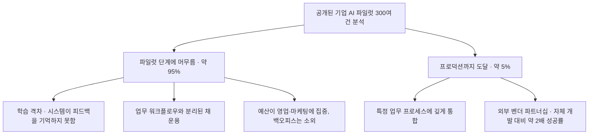
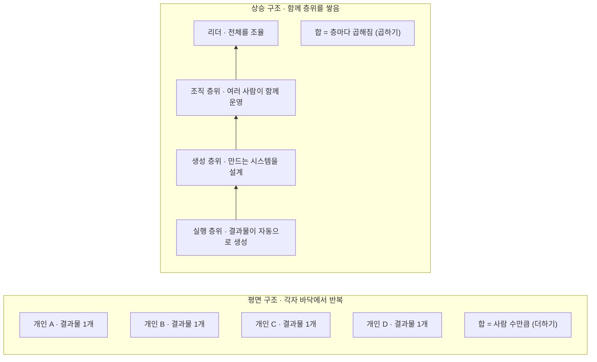

## 이 글이 다루는 두 가지 층위

> 
> https://www.facebook.com/share/1PKXPY2KY4/
> 
> [조직서 AI사용법, AX전환 교육 백날 해봐야 소용없는 이유, 소잡는 칼로 ]
> 
> 26년 MIT NANDA 이니셔티브에서 발표한 리포트에 따르면, 기업 AI 전환(도입) 프로젝트의 95%는 사실상 실패하는 것으로 규정지었습니다. 다 아는 이야기죠? '만능형 AI'에 대한 맹신, 단기적인 ROI에만 집착이 큰 이유로 국내서는 많이 인용되고 있습니다. 하지만 조직을 이끄는 리더 입장에서 이 논문의 핵심은 완전히 다른데 있더라고요.
> 
> 핵심은 사고 격차. 
> 1. AI의 사용 수준에 따라 그들의 사고하는 방식이 근원적으로 달라진다. AI로 이미지 생성, 영상 생성, 보고서/제안서 만드는 수준의 기초적인 활용 수준에 있는 사람과 AI로 새로운 솔루션, 새로운 비즈니스모델을 만드는 수준에 있는 사람은 그냥 다른 세계에 산다. 
> 2. 도구가 커지면 질문도 커져야 한다
도구는 열 배로 커졌는데 생각의 크기는 그대로다. 같은 AI를 사용해도, 어떤 사람은 "이 제안서를 빨리 써줘"라고 말하고, 어떤 사람은 "우리가 매번 만드는 이 제안서 작업 자체를 없앨 수는 없을까"라고 묻는다. 이걸로 콘텐츠를 잘 만들 수 있어와 이걸로 이 콘텐츠와 관련된 시장 자체를 다르게 혁신할 수 없을까를 생각한다. 도구는 같은데 생각의 크기가 다르다. 당연하지만 이 차이가 결과의 차이를 근본적으로 다르게 만들어낸다.
> 3. 리더가 전체를 꼭 챙겨라. 조직은 구성원들의 사고의 차원을 전반적으로 끌어올리지 않으면 AX 수준 역시 하향평준화에 머무르게 된다. 몇 사람만 앞서가면 헛돈다. 한두 사람이 아무리 크게 생각해도, 그들만 앞서가면 조직은 제자리기 때문에 결국 포기하게 된다. 결과물은 혼자 만들 수 있지만 결과물을 찍어내는 시스템은 여러 사람의 지식과 판단과 손이 맞물려야 겨우 돌아간다. 마케터가 아는 것, 기획자가 아는 것, 운영자가 아는 것이 한 시스템 안에 함께 녹아야, 그 시스템이 현장에서 살아 움직인다. AI 전환은 뛰어난 몇 사람을 키우는 일이 아니다. 구성원 전체의 생각을 함께 키우는 일이다. 다 같이 커질 때 비로소 시너지가 난다. 저마다 손으로 일하던 버릇을 내려놓고, 자기 일을 대신 해줄 시스템을 함께 짜기 시작할 때. 그때 조직은 사람 수만큼 일하던 곳에서, 사람 수를 넘어 일하는 곳으로 바뀐다.
> 
> 물론 닭 한 마리가 정말 필요할 땐, 소 잡는 칼로 그냥 닭을 잡으면 됩니다. 핵심은 도구가 열 배 커졌는데 조직의 생각이 그대로면 오히려 비용이라고 생각해요.
> 
> 다시 한번, 우리가 가진 소잡는 칼로 할 수 있는 일은 무엇인지를 생각하는 시간을 반드시 확보하고 구성원들과 동기화하는 시간들을 꼭 가져야 합니다. 이거는 리더가 반드시 챙겨야 하는 일입니다!
> 

원문 게시글은 두 개의 서로 다른 층위를 하나로 엮어서 이야기하고 있다. 하나는 MIT NANDA 이니셔티브가 2025년에 발표한 기업 AI 도입 실태 리포트이고, 다른 하나는 그 리포트의 핵심 수치를 출발점으로 삼아 저자가 독자적으로 전개하는 "사고의 격차"라는 조직론적 주장이다. 두 층위를 구분하지 않고 읽으면 리포트가 실제로 증명한 것과 저자가 리포트를 발판 삼아 새롭게 주장하는 것이 뒤섞이기 쉽다. 이 문서는 먼저 리포트 자체가 무엇을 조사했고 무엇을 밝혔는지를 최대한 원문에 가깝게 확인한 뒤, 그 위에 얹힌 저자의 해석을 별도로 정리하는 방식으로 구성했다.

먼저 짚어야 할 사실 하나가 있다. 원문 게시글에는 "26년 MIT NANDA 이니셔티브에서 발표한 리포트"라고 적혀 있지만, 확인 결과 이 리포트("The GenAI Divide: State of AI in Business 2025")는 2025년 7월에 발표되었고, 언론을 통해 널리 확산된 시점은 2025년 8월이다. 2026년에 발표된 후속 리포트는 확인되지 않는다. 아마도 저자가 리포트를 접하거나 이 글을 쓴 시점을 발표 시점으로 착각한 것으로 보이며, 이 문서에서는 정확한 발표 시점을 2025년 7월로 바로잡아 서술한다.

---

## 1. MIT NANDA 리포트의 실체

### 리포트의 기본 정보

이 리포트의 정식 제목은 [*The GenAI Divide: State of AI in Business 2025*](https://mlq.ai/media/quarterly_decks/v0.1_State_of_AI_in_Business_2025_Report.pdf)이며, MIT 미디어랩 산하 Project NANDA(Networked Agents and Decentralized Architecture)가 2025년 7월에 발표했다. 저자는 Aditya Challapally, Chris Pease, Ramesh Raskar, Pradyumna Chari 네 명이고, 리포트 스스로도 "예비 조사 결과(Preliminary Findings)"라고 명시하고 있어 동료 심사를 거친 학술 논문이 아니라 실무 조사 보고서에 가깝다는 점을 미리 밝혀둔다.

조사 기간은 2025년 1월부터 6월까지였고, 조사 방법은 세 가지를 병행했다. 공개적으로 알려진 기업 AI 도입 사례 300여 건에 대한 체계적 검토, 52개 조직 관계자를 대상으로 한 구조화 인터뷰, 그리고 4개 주요 산업 콘퍼런스에서 수집한 기업 리더 153명의 설문 응답이다. 여기서 한 가지 짚어야 할 혼선이 있다. 일부 언론 보도(예: Fortune)는 "150건의 인터뷰와 350명 설문"이라는 다른 수치를 인용했는데, 리포트 원문에 명시된 수치는 52개 조직 인터뷰와 153명 설문이다. 이 숫자 불일치는 이후 리포트의 신뢰성을 둘러싼 논쟁에서 하나의 쟁점이 되기도 했다.

### 핵심 발견 — 95%는 왜 "실패"로 분류되었나

리포트가 가장 널리 인용된 문장은 이것이다. 기업들이 생성형 AI에 300억~400억 달러를 투자했음에도 불구하고, 조사 대상 조직의 약 95%가 손익(P&L)에 측정 가능한 영향을 전혀 만들어내지 못했다는 것이다. 반대로 통합된 파일럿 프로젝트 가운데 약 5%만이 수백만 달러 단위의 실질적 가치를 뽑아내고 있었다. 리포트는 이 격차를 "GenAI Divide"라고 이름 붙였고, 이것이 모델 성능이나 규제 때문이 아니라 "접근 방식"의 차이에서 비롯된다고 못박았다.

특히 자체 개발한 맞춤형 기업용 AI 도구가 실제 프로덕션 단계까지 도달하는 비율은 5%에 불과하다는 수치도 함께 제시됐다. 반면 ChatGPT나 Copilot 같은 범용 도구는 80% 이상의 조직이 시험해봤고 40% 가까이가 실제로 배포까지 했지만, 이 도구들은 개인의 생산성은 끌어올려도 조직 전체의 손익에는 거의 영향을 주지 못한다고 리포트는 분석했다.

### 리포트가 지목한 원인 — "학습 격차"

리포트가 스스로 정의한 핵심 원인은 "Learning Gap(학습 격차)"이다. 이는 저자가 원문 게시글에서 말한 "사고 격차"와는 다른 개념이라는 점을 분명히 해둘 필요가 있다. 리포트가 말하는 학습 격차는 사람의 사고방식이 아니라 AI 시스템 자체의 기술적 한계를 가리킨다. 즉 대부분의 생성형 AI 도구가 피드백을 기억하지 못하고, 맥락에 적응하지 못하며, 시간이 지나도 개선되지 않는다는 것이다. 리포트는 "ChatGPT의 한계 자체가 GenAI Divide의 핵심 문제를 드러낸다. 맥락을 잊고, 학습하지 않으며, 진화하지 못한다"는 취지의 문장으로 이를 요약했다.

성공한 5%의 조직들은 이 한계를 정면으로 돌파한 곳들이었다. 이들은 업무 결과 기준으로 도구를 평가했고, 특정 업무 프로세스에 깊게 맞춤화된 시스템을 요구했다. 도입 방식에서도 차이가 뚜렷했는데, 외부 전문 벤더와 파트너십을 맺어 도입한 경우가 자체 개발보다 약 두 배(약 67% 대 33%) 더 높은 성공률을 보였다. 특히 금융 등 규제가 엄격한 산업에서는 자체 개발을 선호하는 경향이 강했음에도, 실제 데이터는 구매·파트너십 방식이 더 안정적인 결과를 낸다는 점을 보여주었다.

### 예산은 엉뚱한 곳에 쏠려 있었다

리포트는 기업들에게 가상의 100달러를 AI 관련 기능들에 배분해보라고 물었는데, 응답자들은 평균적으로 그중 약 70%를 영업과 마케팅 기능에 배정했다. 그러나 정작 측정 가능한 성과가 뚜렷하게 나타난 영역은 백오피스, 즉 문서 처리, 리스크 관리, 아웃소싱 대체 같은 후방 업무였다. 눈에 잘 띄는 영역에는 투자가 몰리고, 실제 절감 효과가 큰 영역은 상대적으로 소외되어 있었다는 뜻이다.

### 그림자 AI 경제

리포트가 밝힌 또 하나의 흥미로운 현상은 "그림자 AI 경제(Shadow AI Economy)"다. 공식적으로 기업이 AI 도구 구독을 제공하는 비율은 40% 안팎에 불과한데도, 직원의 90% 이상이 회사 정책과 무관하게 개인 계정으로 ChatGPT 같은 도구를 업무에 사용하고 있었다. 공식 파일럿은 회의실에서는 그럴듯해 보이지만 실제 현장에서는 맥락을 유지하지 못해 무너지는 반면, 직원들은 조용히 개인 도구로 업무를 처리하며 실질적인 효율을 만들어내고 있었다는 것이다. 산업 전반으로 보면 이런 구조적 변화가 뚜렷하게 나타난 분야는 9개 주요 산업 중 기술(Technology)과 미디어·통신 두 분야뿐이었고, 나머지 대부분의 산업은 "실험은 넘쳐나지만 전환은 없는" 상태에 머물러 있었다.

---

## 2. 리포트를 둘러싼 논쟁

이 리포트는 발표 직후 투자 심리에까지 영향을 줄 만큼 화제가 됐지만, 동시에 방법론에 대한 비판도 만만치 않게 제기됐다. 와튼 스쿨의 케네스 워바흐(Kenneth Werbach) 교수는 자신의 분석에서, 리포트 본문 어디를 찾아봐도 "95%가 제로 리턴"이라는 결론을 직접 뒷받침하는 데이터가 명확하게 제시되어 있지 않다고 지적했다. 그가 확인한 5%라는 수치는 정확히는 "성공적으로 구현된 맞춤형 기업용 AI 도구"라는 훨씬 좁은 범주에 해당하는 것이었고, 리포트 스스로도 "성공"의 정의를 "뚜렷하고 지속적인 생산성 또는 손익 영향"으로 규정했을 뿐 "실패"가 곧 "제로 리턴"을 의미한다고 명시하지는 않았다는 것이다. 테크 매체 Futuriom도 비슷한 맥락에서 "리포트가 무책임하고 근거가 빈약한 그림을 그리고 있다"고 비판하며, 근거 데이터 공개를 요구했다.

다만 이런 방법론적 논쟁에도 불구하고, "도입은 활발한데 전환은 드물다(high adoption, low transformation)"는 리포트의 핵심 메시지 자체는 비교적 폭넓게 수용되고 있다. 하버드비즈니스리뷰 기고자들은 이 리포트를 인용하며 "10년 전 디지털 전환 때와 같은 실수를 반복하고 있다. 실험을 장려하는 것은 좋지만, 그 실험이 통제 없이 방치되는 것은 역효과를 낳는다"고 지적했다. 즉 정확한 퍼센트 수치보다는, 실험은 많은데 조직적으로 수렴되지 않고 있다는 방향성 자체에 대한 공감대가 형성되어 있다고 보는 것이 정확하다.

아래 표는 리포트 원문 수치와 초기 언론 보도에서 혼선이 있었던 수치를 비교한 것이다.

| 항목 | 리포트 원문 수치 | 일부 언론 인용 수치 |
|---|---|---|
| 구조화 인터뷰 | 52개 조직 | 150건 (Fortune 등 일부 보도) |
| 설문 응답 | 153명 (산업 콘퍼런스 4곳) | 350명 (일부 보도) |
| 공개 사례 검토 | 300여 건 | 300여 건 (대체로 일치) |
| 조사 기간 | 2025년 1~6월 | — |
| 발표 시점 | 2025년 7월 | — |

---

## 3. 원문 게시글의 논지 — "사고의 격차"라는 확장된 해석

여기서부터는 리포트 자체가 아니라, 원문 게시글이 리포트의 95%라는 수치를 출발점 삼아 독자적으로 전개하는 조직론이다. 앞서 확인했듯이 MIT NANDA 리포트가 말하는 "학습 격차"는 AI 시스템의 기술적 한계(기억하지 못하고 적응하지 못함)를 가리키는 개념이고, 원문 게시글이 말하는 "사고 격차"는 AI를 사용하는 사람의 사고방식 차이를 가리키는 개념이다. 두 개념은 이름이 비슷하지만 가리키는 대상이 다르며, "사고 격차"라는 프레임 자체는 리포트에 등장하지 않는, 저자가 리포트의 문제의식을 인간 조직 차원으로 확장해 독자적으로 제시한 해석이라는 점을 분명히 밝혀둔다.

### 도구는 같은데 질문의 크기가 다르다

원문 게시글의 첫 번째 주장은, AI를 사용하는 수준에 따라 사람들이 근본적으로 다른 방식으로 사고하게 된다는 것이다. 이미지나 영상을 만들고 보고서를 작성하는 수준에 머무르는 사람과, AI로 새로운 솔루션이나 비즈니스 모델 자체를 설계하는 사람은 같은 도구를 쓰면서도 전혀 다른 세계에서 일하게 된다는 관찰이다. 이어지는 두 번째 주장은 이를 좀 더 구체적으로 풀어낸다. 같은 AI 앞에서 누군가는 "이 제안서를 빨리 써줘"라고 묻고, 누군가는 "우리가 매번 이 제안서를 만드는 과정 자체를 없앨 수는 없을까"라고 묻는다는 것이다. 도구의 성능은 열 배로 커졌는데 질문의 크기가 그대로라면, 결과의 차이는 도구가 아니라 질문의 크기에서 갈린다는 논리다.

### 리더가 조직 전체를 끌어올려야 하는 이유

세 번째 주장이 이 글의 실질적인 결론에 해당한다. 몇몇 뛰어난 개인이 아무리 크게 사고해도, 조직 전체의 사고 수준이 함께 올라가지 않으면 조직의 AI 전환 수준은 결국 하향평준화된다는 것이다. 그 근거로 제시되는 것이 "결과물은 혼자 만들 수 있지만, 결과물을 계속 찍어내는 시스템은 여러 사람의 지식과 판단이 맞물려야 돌아간다"는 관찰이다. 마케터가 아는 것, 기획자가 아는 것, 운영자가 아는 것이 한 시스템 안에 함께 녹아야 그 시스템이 현장에서 실제로 작동한다는 논리이며, 이는 리더가 소수의 우수 인재를 키우는 것이 아니라 구성원 전체의 사고 지평을 함께 넓혀야 한다는 주장으로 이어진다.

흥미롭게도 이 주장은 앞서 살펴본 MIT NANDA 리포트의 실증적 발견과 방향이 맞닿아 있다. 리포트는 AI 전환이 성공하려면 중앙의 AI 랩만이 아니라 현장 라인 매니저들에게 권한을 부여하는 것이 중요한 성공 요인이라고 밝혔는데, 이는 "소수만 앞서가면 조직은 제자리"라는 원문 게시글의 주장과 결이 비슷하다. 다만 이 연결은 저자가 리포트의 실증 결과 위에 자신의 해석을 얹은 것이지, 리포트가 "사고 격차"라는 개념을 직접 검증했다는 뜻은 아니라는 점은 다시 한번 구분해둘 필요가 있다.

### 소 잡는 칼과 닭

마지막으로 원문 게시글은 "우도할계(牛刀割鷄)", 즉 소 잡는 칼로 닭을 잡는다는 옛 표현을 빌려와 균형을 잡는다. 정말 닭 한 마리만 필요한 작은 일이라면 소 잡는 칼로 그냥 처리하면 된다는 것이다. 다만 핵심은 도구가 열 배 커졌는데 조직의 생각은 그대로 머물러 있다면, 그 큰 도구는 자산이 아니라 오히려 비용이 된다는 데 있다. 그래서 저자는 리더가 반드시 "우리가 가진 소 잡는 칼로 무엇을 할 수 있는지"를 구성원들과 함께 확인하는 시간을 정기적으로 가져야 한다고 강조하며 글을 맺는다.

---

## 4. 첨부된 도표가 말하는 것 — 더하기 구조와 곱하기 구조

원문 게시글에 함께 실린 도표는 두 가지 조직 구조를 나란히 대비시킨다. 왼쪽은 "평면" 구조로, 개인 네 명이 각자 자기 바닥에서 1개씩 결과물을 만들어내는 모습을 보여준다. 이 구조에서 전체 합은 "사람 수만큼", 즉 더하기로 늘어난다. 오른쪽은 "상승" 구조로, 실행 층위(결과물이 자동으로 만들어지는 단계) 위에 생성 층위(만드는 시스템 자체를 설계하는 단계), 그 위에 조직 층위(여러 사람이 함께 운영하는 단계), 맨 위에 리더가 층층이 쌓여 있다. 이 구조에서 전체 합은 "층마다 곱해지는" 방식으로 늘어난다.

이 도표가 전달하려는 메시지는 앞서 정리한 "사고 격차" 논지를 시각적으로 압축한 것이다. 개인이 각자 도구를 붙잡고 반복 작업을 처리하는 조직은 사람 수만큼만 일하지만, 결과물을 자동으로 만들어내는 시스템 위에 그 시스템을 함께 운영하고 개선하는 조직 층위를 쌓아 올린 조직은 사람 수를 넘어서는 산출을 만들어낼 수 있다는 것이다. 다만 이 곱하기 구조 역시 MIT NANDA 리포트가 실증적으로 검증한 모델이라기보다는, 리포트의 문제의식을 바탕으로 저자가 제시하는 개념적 프레임이라는 점을 다시 한번 밝혀둔다.

---

## 5. 종합 정리

정리하면 원문 게시글은 검증된 사실과 저자의 해석이 층층이 쌓인 구조로 되어 있다. 가장 아래에는 MIT NANDA가 2025년 7월에 발표한 실증 조사 결과가 있다. 기업이 300억~400억 달러를 투자했지만 약 95%의 조직이 손익에 측정 가능한 영향을 만들지 못했고, 성공한 5%는 학습 능력을 갖춘 시스템을 특정 업무에 깊게 통합하고 외부 파트너십을 적극 활용한 조직들이었다는 것이 리포트의 핵심 발견이다. 다만 이 수치를 둘러싸고 방법론 논쟁이 존재한다는 점, 그리고 일부 초기 보도에서 인터뷰·설문 규모가 실제와 다르게 인용됐다는 점도 함께 기억할 필요가 있다.

그 위에 저자는 "학습 격차"라는 기술적 개념을 "사고 격차"라는 인간·조직 차원의 개념으로 확장해서 자신의 논지를 전개한다. 같은 도구를 쓰더라도 질문의 크기가 다르면 결과가 근본적으로 달라진다는 관찰, 그리고 소수의 우수 인재가 아니라 조직 전체의 사고 수준을 함께 끌어올려야 한다는 리더의 역할론이 그 핵심이다. 이 부분은 리포트가 직접 검증한 내용은 아니지만, 리포트가 강조한 "라인 매니저 권한 부여"나 "조직 전반의 워크플로우 통합" 같은 성공 요인과 방향성 면에서는 상통하는 지점이 있다.

---

## 참고 자료

- The GenAI Divide: State of AI in Business 2025, MIT NANDA, 2025년 7월
- Fortune, "MIT report: 95% of generative AI pilots at companies are failing", 2025년 8월 18일
- The Register, "Generative AI does nothing for 95 percent of companies", 2025년 8월 18일
- Forbes, "MIT Finds 95% Of GenAI Pilots Fail Because Companies Avoid Friction", 2025년 8월 26일
- Virtualization Review, "MIT Report Finds Most AI Business Investments Fail, Reveals 'GenAI Divide'", 2025년 8월 19일
- Futuriom, "Why We Don't Believe MIT NANDA's Weird AI Study", 2025년 8월
- Harvard Business Review, "Beware the AI experimentation trap" (MIT NANDA 리포트 인용)
- AI Wiki, "MIT 'GenAI Divide' report (2025)" 정리 문서

---

작성일: 2026년 7월 10일
