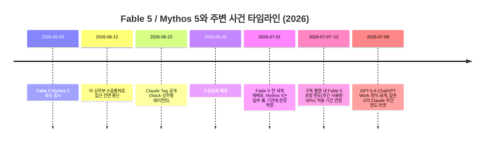
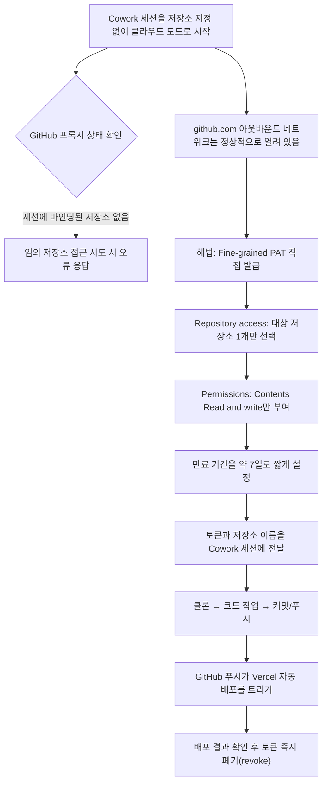

> 
> https://www.facebook.com/share/187jXHwiVa/
> 
> 이 글의 주제는 Claude Cowork 의 재발견입니다만, 잠깐 두 가지 중요한 최신 뉴스로 새면... (GPT 5.6 & Fable 5 한도 리셋 !!)
> 
> 1) 이미 쓰시는 분들도 계시겠지만, 새벽에 OpenAI 의 ChatGPT 5.6 Sol/Terra/Luna 최상위 모델들이 퍼블릭 론칭됐고, 또다른 큰 업데이트는 ChatGPT 앱의 완전 리노베이션, 즉 Codex 와 대통합 및 Work (클로드 Cowork 과 같은 포지션) 의 추가입니다. 게다가 기존 Artifact 를 훨씬 업그레이드한 Sites 기능 (OpenAI 가 호스팅하는 웹사이트 뚝딱 생성. 정말 웹사이트 수준을 만들어냄. 5.6 과 Work 덕분) 까지. 이것저것 체크하고 실험하느라 관련 글은 여러가지 실험 결과물과 더불어서 따로 올리겠습니다만, 그 과정에서 한 가지 흥미로운 것을 발견한 것이 이 글의 본주제
> 
> 2) 어제 알지 못한 채 잠들어버려서 새벽 2시의 Anthropic 의 Claude Tag 라이브 방송을 못봤는데, 동일 시각에 OpenAI 가 5.6 발표 및 위 1번 뉴스들을 뻥뻥 터뜨렸죠. 그리고...
> 
> Anthropic 이 또 밀당질을 해서... 주간 한도를 리셋했습니다. 중요한 것은 이 리셋에는 Fable 5 의 한도까지 리셋해버렸다는 것 !! 음... 잠들기 전에 선물하기 기능으로 안전하게 3번째 Max x20 계정에 Fable 5 작업을 돌리고 있었는데 (이미 계정 1, 2 는 다 씀) 졸지에 풀충전 계정 3개가 되어버렸습니다. 하.하.하. 뭐... 하려고 했던 것들 이 기회에 왕창 타임라인을 당겨서 진행해야죠. 잠 좀 자면서 하려면 좀 더 스마트하게 goal 루프들을 조직화해서 이용해야 겠고...
> 
> 이제 본론)
> 
> Claude Cowork 이 Claude Code 의 어디까지 커버 가능할 지를 계속 보고 있었는데, 작정하고 SW를 만들고 배포하려면 사실 Code + Git (GitHub 포함) 을 로컬이든 클라우드든 어디에서나 컨트롤하는 맞다고 생각해왔지만, Cowork 에서도 진입 방식만 약간 다를 뿐이지 결과적으로 마음대로 컨트롤이 가능하네요. 
> 
> 즉, Cowork 을 처음부터 git 레포로 띄우지 않고 그냥 cloud (Anthropic 호스팅 영역. 물론 그들이 보안으로 감싸놓은) 로 실행한 다음에 github PAT(Fine-grained Personal Access Token)을 발급해서 알려주면 클라우드로 모든 제어가 가능합니다. 
> 
> 저 시나리오를 원하지 않거나 하고 싶어도 하면 안되는 경우에는 Code 가 맞겠으나 그렇지 않다면 정말 완전 개발자를 위한 특정 케이스들 외에는 Cowork 으로 왠만한 것들이 다 가능할 것 같습니다. 아, 물론 코드를 어느 정도 직접 보거나 작업 과정에서 코딩/디버깅에 관련된 도구들을 제대로 쓰려면 당연히 Code (ChatGPT 에서는 Codex) 가 맞지요.
> 
> 다들 알고 계신데 제가 Code 가 메인이다보니 Cowork 을 샅샅이 살펴보고 케이스들 다 확인해보지 않아서 이제서야 안 것일수도 있습니다. ^^;;
> 
> #ai #agent #coding #claudecowork #anthropic #chatgpt #codex #dev #github #gonnector #고넥터
> 
> 

## 들어가며

공유된 글은 크게 두 개의 층위로 읽힌다. 앞부분은 하루 사이에 몰아친 AI 업계의 굵직한 소식 두 가지를 곁가지로 짚고 있고, 본론은 Claude Cowork가 생각보다 훨씬 깊은 곳까지, 즉 GitHub 저장소를 직접 컨트롤하고 배포까지 확인하는 영역까지 커버할 수 있다는 실전 발견을 담고 있다. 이 문서는 글에 등장하는 모든 사실관계를 최신 자료로 다시 확인하면서, 왜 그런 현상이 벌어졌는지 구조적으로 풀어썼다.

먼저 짚어야 할 사실은 글이 쓰인 시점(2026년 7월 10일)이 공교롭게도 OpenAI와 Anthropic 양쪽에서 동시에 큰 발표가 겹친 날이었다는 점이다. 이 우연한 타이밍 자체가 글의 흐름을 이해하는 데 중요한 배경이 되므로, 본론에 들어가기 전에 이 두 소식부터 정리한다.

---

## 1부. 잠깐 스쳐 가는, 그러나 결코 작지 않은 두 가지 소식

### 1) OpenAI, GPT-5.6 Sol / Terra / Luna를 정식 출시하고 ChatGPT를 통째로 재편했다

OpenAI는 6월 말부터 일부 신뢰 파트너 대상으로 제한적으로 미리 공개했던 GPT-5.6 시리즈를 2026년 7월 9일(현지시각) 정식으로 일반에 공개했다. 이번 세대부터는 단일 모델이 아니라 세 개의 등급으로 나뉜 제품군이라는 점이 특징이다. 가장 상위 모델인 Sol, 균형 잡힌 실무용 모델 Terra, 가장 빠르고 저렴한 Luna로 구성되며, 가격은 1백만 토큰 기준으로 Sol이 입력 5달러·출력 30달러, Terra가 입력 2.5달러·출력 15달러, Luna가 입력 1달러·출력 6달러로 책정되었다.

OpenAI가 자체 공개한 벤치마크에 따르면 Sol은 코딩 에이전트 성능을 측정하는 Artificial Analysis Coding Agent Index에서 80점을 기록해 Claude Fable 5보다 2.8점 앞섰다고 밝혔다. 다만 이는 OpenAI 측이 제시한 지표이며, 같은 시기 보도된 Techzine Global의 분석은 종합 지능을 보는 독립 지표(Artificial Analysis Intelligence Index)에서는 여전히 Fable 5가 가장 높은 점수를 유지하고 있다고 전했다. 즉 코딩 관련 특정 벤치마크에서는 우위를 보이지만, 전반적인 지능 지표에서는 아직 Fable 5가 앞서 있다는 것이 여러 매체의 공통된 평가다. SWE-bench Pro 같은 실전형 소프트웨어 엔지니어링 벤치마크에서는 Sol이 64.6%를 기록해 Claude Mythos 5의 80.3%에는 상당한 격차로 못 미친다는 점도 함께 보도되었다.

기술적 스펙보다 더 눈에 띄는 변화는 제품 구조 자체의 개편이다. OpenAI는 같은 날 코딩 에이전트 Codex를 ChatGPT 데스크톱 앱에 통합하면서, 기존 범용 업무 처리를 담당하는 새로운 에이전트인 ChatGPT Work를 함께 선보였다. 기존 데스크톱 앱은 ChatGPT Classic으로 이름이 바뀌고, Codex 앱을 쓰던 사용자는 업데이트하면 자동으로 새로운 통합 앱으로 전환된다. 이 통합 앱 안에서 사용자는 일반 대화용 Chat, 업무 자동화용 Work, 개발자용 Codex를 하나의 창에서 오갈 수 있다. ChatGPT Work는 목표를 던지면 여러 앱과 파일에서 맥락을 모아 시트, 슬라이드, 문서, 웹사이트 형태의 완성된 결과물을 만들어내는 방식으로 동작하며, 승인 단계와 진행 상황 확인 기능을 통해 자율성의 정도를 사용자가 조절할 수 있게 설계되었다.

여기에 더해 이전부터 베타로 운영되던 Sites 기능이 정식으로 자리를 잡았다. Sites는 대화나 작업 내용을 바탕으로 OpenAI가 직접 호스팅하는 인터랙티브 웹사이트나 웹 앱을 만들어 URL 하나로 공유할 수 있게 해주는 기능으로, 기존의 일회성 코드 미리보기 개념을 넘어서는 결과물이라는 평가를 받고 있다. ChatGPT Work는 7월 9일부터 Pro, Enterprise, Edu 플랜에 우선 적용되며 며칠 안에 Plus와 Business로 확대될 예정이고, 데스크톱 앱은 무료 플랜을 포함해 Mac과 Windows 전역에 곧바로 배포되었다.

### 2) Anthropic의 밀고 당기기 — 주간 사용 한도 리셋과 Fable 5의 롤러코스터

같은 날 새벽, Anthropic 쪽에서도 조용하지만 실질적인 변화가 있었다. 이를 이해하려면 최근 한 달간 Claude Fable 5와 Mythos 5를 둘러싸고 벌어진 일련의 사건을 먼저 정리할 필요가 있다.

Fable 5와 Mythos 5는 2026년 6월 9일 처음 출시되었다. 그런데 출시 사흘 만인 6월 12일, 미국 상무부의 수출통제 조치로 인해 두 모델에 대한 접근이 전면 중단되었다. Anthropic의 공식 발표에 따르면 이 조치는 Amazon 소속 연구자들이 Fable 5의 안전장치를 우회해 특정 소프트�어 취약점을 식별하고, 그중 하나는 실제 공격 코드를 생성하도록 만드는 방법을 발견해 보고한 데서 비롯되었다. 다만 Anthropic은 후속 검증에서 Claude Opus 4.8, GPT-5.5, Kimi K2.7을 포함한 더 낮은 등급의 모델들도 동일한 취약점을 찾아낼 수 있었고, 실제 공격 코드 생성 자체는 테스트한 거의 모든 모델에서 재현되었다고 밝히며, 이번 조치가 Fable 5만의 고유한 위험이라기보다는 정책적 판단에 가까웠음을 시사했다.

이후 미국 정부와의 협의를 거쳐 6월 30일 수출통제가 해제되었고, Anthropic은 7월 1일부터 Fable 5를 Claude Platform, Claude.ai, Claude Code, Claude Cowork 전반에 걸쳐 전 세계 사용자에게 다시 배포했다. Mythos 5는 이보다 제한적으로, 미국 정부의 승인을 받은 일부 미국 내 조직에 한해 우선 복원되었다. 재배포와 함께 새로운 안전 분류기가 추가되어 기존에 보고된 우회 기법을 99% 이상 차단한다고 발표했으며, 분류기에 걸린 요청은 Fable 5 대신 Opus 4.8로 자동 전환되는 구조다.

여기서 흥미로운 부분이 이용 한도 정책이다. Anthropic은 애초 7월 7일까지 Pro, Max, Team, 일부 Enterprise 플랜에서 주간 사용 한도의 최대 50%까지 Fable 5를 별도 과금 없이 포함한다고 밝혔는데, 이후 사용자들의 반발을 반영해 이 포함 기간을 7월 12일까지로 닷새 연장했다. 이 기간이 지나면 Fable 5는 구독 플랜에서 완전히 빠지고, 사용량 기반 크레딧(입력 1백만 토큰당 10달러, 출력 1백만 토큰당 50달러)을 통해서만 이용할 수 있게 된다.

그리고 글에서 언급된 바로 그 시점, 즉 7월 9일 GPT-5.6과 ChatGPT Work가 공개된 것과 거의 같은 시각에 Anthropic 공식 개발자 계정(ClaudeDevs)이 모든 사용자의 5시간 및 주간 사용 한도를 리셋했다는 공지를 올렸다. 이는 6월 12일 Fable 5 접근이 막혔을 때 한 차례, 그리고 7월 1일 Fable 5가 복원되었을 때 다시 한 차례에 이어 최근 한 달 사이 세 번째로 이뤄진 한도 리셋에 해당한다. AI 소식을 다루는 계정 TestingCatalog는 이 타이밍을 두고 "GPT-5.6을 테스트하는 대신 Fable 5로 다시 놀게 만들려는 것 같다"는 취지의 촌평을 남기기도 했는데, 이는 정황상의 해석일 뿐 Anthropic이 공식적으로 인정한 의도는 아니라는 점은 분명히 해둘 필요가 있다. 다만 결과적으로 그날 새벽 한도가 초기화된 것 자체는 다수의 매체와 Anthropic 공식 계정을 통해 확인되는 사실이다.

같은 날 새벽 2시(한국시각) 무렵에는 Anthropic이 "Claude Tag가 Slack에서 어떻게 쓰이는지"를 주제로 한 라이브 웨비나도 진행했다. Claude Tag는 지난 6월 23일 공개된 신제품으로, Slack 채널 안에 @Claude를 상주시켜 여러 사람이 하나의 Claude 인스턴스와 맥락을 공유하며 작업을 위임할 수 있게 하는 서비스다. Anthropic은 자사 제품팀 코드의 65%가 내부용 Claude Tag를 통해 작성되고 있다고 밝힌 바 있으며, 이번 웨비나는 태평양 표준시 오전 10시(한국시각 새벽 2시)에 진행되어 시차상 새벽에 놓친 사람이 많았을 시간대였다.

정리하면, 7월 9일에서 10일로 넘어가는 사이 OpenAI는 GPT-5.6과 ChatGPT Work라는 대형 제품 개편을 쏟아냈고, Anthropic은 그 타이밍에 맞춰 사용 한도를 리셋하며 Fable 5로 사용자를 다시 끌어들이는 모양새를 취했다. 아래는 이 흐름을 시간순으로 정리한 것이다.

---

## 2부. 본론 — Claude Cowork에서 GitHub와 배포 파이프라인을 통째로 컨트롤하기

### Cowork와 Code, 애초에 무엇이 다른가

본론으로 들어가기 전에 Claude Code와 Claude Cowork의 근본적인 구조 차이를 짚고 넘어갈 필요가 있다. 두 제품은 같은 Claude 모델과 같은 에이전트 아키텍처를 공유하지만, 실행되는 환경과 사용자층이 다르게 설계되었다.

Claude Code는 터미널이나 IDE에서 실행되는 개발자용 도구로, 로컬에서 실행할 경우 사용자의 운영체제 권한을 그대로 물려받아 파일시스템 전체와 셸 명령, git 조작에 직접 접근한다. 반면 Claude Cowork는 Claude 데스크톱 앱 안에서 실행되는 비개발자용 에이전트로, 격리된 리눅스 가상머신 안에서 동작한다. Anthropic의 엔지니어링 블로그에 따르면 Claude Code를 웹(클라우드)에서 실행하는 경우에도 마찬가지로 격리된 샌드박스 안에서 세션이 돌아가며, git 자격 증명 같은 민감한 정보는 샌드박스 내부에 절대 들어가지 않도록 설계되어 있다. 대신 커스텀 프록시 서비스가 모든 git 요청을 대신 처리하는데, 샌드박스 내부의 git 클라이언트는 이 프록시에 세션 전용의 스코프가 제한된 자격 증명으로 인증하고, 프록시가 요청 내용을 검증한 뒤(예를 들어 지정된 브랜치로만 푸시하도록 제한하는 식으로) 실제 GitHub 인증 토큰을 붙여 전달하는 구조다.

이 구조에서 중요한 포인트는, 저장소가 세션에 "바인딩"되는 시점이 세션을 처음 만들 때라는 점이다. Anthropic의 Managed Agents API 문서를 보면, 세션을 생성할 때 `resources` 항목에 `github_repository` 타입으로 저장소 URL과 인증 토큰을 함께 지정하도록 되어 있고, 저장소는 세션이 살아 있는 동안 고정되며 다른 저장소로 바꾸려면 새 세션을 만들어야 한다고 명시되어 있다. 다시 말해 Claude Code에서는 세션을 시작하는 순간 "이 세션은 이 저장소를 다룬다"는 것이 확정되기 때문에 자동으로 저장소가 묶이지만, Cowork를 저장소 지정 없이 그냥 클라우드 모드로 띄우면 애초에 세션에 바인딩된 저장소가 하나도 없는 상태로 시작하게 된다. 이 상태에서 어떤 저장소에 접근하려 해도 "이 세션에는 활성화되어 있지 않다"는 취지의 응답이 돌아오는 것은, 버그라기보다는 이 바인딩 구조에서 나온 자연스러운 결과라고 볼 수 있다.

아래는 세 제품(구 Claude in Slack, Claude Code, Claude Cowork)의 저장소·자격 증명 처리 방식을 비교한 표다.

| 항목 | Claude Code (로컬) | Claude Code (웹/클라우드) | Claude Cowork |
|---|---|---|---|
| 실행 환경 | 사용자 OS 위에서 직접 실행 | Anthropic 관리 격리 VM | Anthropic 관리 격리 리눅스 VM |
| GitHub 저장소 연결 시점 | 로컬 git 설정을 그대로 사용 | 세션 생성 시 저장소를 지정해야 자동 바인딩 | 세션 시작 시 저장소를 지정하지 않으면 바인딩된 저장소 없음 |
| 자격 증명 처리 | 로컬 git 자격 증명 직접 사용 | 프록시가 스코프 제한된 자격 증명을 대신 발급 | 세션에 저장소가 없으면 프록시가 넘겨줄 자격 증명 자체가 없음 |
| 외부 네트워크(github.com 등) 아웃바운드 | 사용자 네트워크 그대로 | 화이트리스트 기반 프록시 허용 | 화이트리스트 기반 프록시 허용(깃허브·PyPI·npm 등은 실제 인증서로 통과) |

이 표에서 드러나듯, Cowork 세션에서 github.com으로 나가는 네트워크 자체는 열려 있는 경우가 많다. 문제는 네트워크 접근 여부가 아니라 "이 세션이 어떤 저장소에 쓸 수 있는 자격 증명을 갖고 있는가"이며, 세션을 저장소 없이 시작했다면 그 자격 증명 자체가 애초에 존재하지 않는다.

### 해법: Fine-grained Personal Access Token으로 직접 저장소를 붙여주기

이 구조를 이해하고 나면 글에서 제시한 해법이 왜 타당한지 명확해진다. 세션이 자동으로 저장소를 물려받는 경로가 막혔다면, 사용자가 직접 저장소 접근 권한이 담긴 토큰을 세션에 전달해 수동으로 자격 증명을 채워 넣으면 된다는 발상이다. GitHub는 이런 상황을 위해 Fine-grained Personal Access Token이라는 기능을 공식적으로 제공하고 있으며, 발급 경로는 GitHub 계정 설정의 Developer settings 안에 있는 Fine-grained personal access tokens 메뉴에서 Generate new token을 선택하는 방식으로 접근한다.

이 토큰을 발급할 때 지켜야 할 원칙은 최소 권한 부여다. Repository access 항목에서는 작업할 저장소 단 하나만 선택하고, Permissions 항목에서는 Contents 권한을 Read and write로만 한정한다. 여기서 Contents 권한은 파일 읽기·쓰기와 커밋·푸시에 필요한 최소한의 범위이며, 이슈나 워크플로, 관리자 설정 같은 다른 권한까지 열어줄 필요는 없다. 만료 기간도 짧게, 글에서 제안한 것처럼 7일 정도로 설정해두면 작업이 끝난 뒤 토큰이 자동으로 무효화되므로 안전성이 높아진다. 실제로 Anthropic의 Managed Agents 문서 역시 세션에 GitHub 토큰을 제공할 때 "최소 권한을 가진 fine-grained personal access token을 사용하고, 계정 전체에 광범위한 접근 권한을 가진 토큰은 피하라"고 명시적으로 권고하고 있어, 이번 접근 방식은 Anthropic이 공식적으로 권장하는 사용 패턴과도 일치한다.

이렇게 발급한 토큰과 저장소 이름을 Cowork 세션에 전달하면, 세션은 그 정보를 이용해 저장소를 클론하고, 작업하고, 커밋한 뒤 푸시까지 수행할 수 있게 된다. 즉 세션 시작 시점에 자동으로 묶이는 경로가 아니라, 사용자가 사후적으로 자격 증명을 주입하는 경로를 통해 사실상 동일한 결과에 도달하는 셈이다.

### Vercel은 왜 별도 토큰이 필요 없었나

글에서 Vercel 쪽은 CLI도 토큰도 없다고 언급하면서도 "GitHub만 뚫리면 배포는 해결된다"고 정리한 부분은, Vercel이 기본적으로 GitHub 저장소와 연동되어 특정 브랜치에 푸시가 들어오면 자동으로 빌드와 배포를 트리거하는 구조를 갖고 있기 때문이다. 이는 Vercel 자체의 오래된 표준 기능으로, Cowork 세션이 Vercel API나 CLI에 직접 접근할 필요 없이, GitHub 저장소에 푸시하는 것만으로 배포 파이프라인 전체가 자동으로 돌아가게 된다. 다시 말해 이번 사례에서 실질적으로 뚫어야 했던 관문은 하나, GitHub 저장소에 대한 쓰기 권한뿐이었던 셈이다.

### 이 발견이 의미하는 것 — Cowork로 어디까지 가능한가

이 사례가 흥미로운 이유는, Cowork가 "코드를 다루지 않는 비개발자용 도구"라는 통념과 달리 실제로는 저장소 클론부터 코드 수정, 커밋, 푸시, 배포 확인까지 개발 워크플로 전체를 대행할 수 있다는 점을 보여주기 때문이다. 다만 이는 코드를 직접 눈으로 계속 들여다보며 세밀하게 디버깅하거나, 저장소 전체의 구조적 맥락(파일 간 의존 관계, 설정 패턴, git 히스토리 등)을 Claude Code처럼 능동적으로 탐색하며 작업하는 시나리오와는 성격이 다르다. 여러 비교 자료들이 공통적으로 짚듯, Claude Code는 프로젝트를 하나의 시스템으로 이해하며 인증 모듈을 리팩터링할 때 관련된 모든 파일을 찾아 조율된 변경을 제안하는 식으로 작동하는 반면, Cowork는 기본적으로 사용자가 지정하거나 공유한 파일을 중심으로 작업하는 방식에 가깝다.

따라서 결론적으로 정리하면, 코드를 직접 들여다보며 정밀한 디버깅이나 대규모 리팩터링이 필요한 작업, 혹은 애초에 클라우드 세션 방식이 아니라 로컬 환경을 그대로 활용해야 하는 경우라면 Claude Code가 여전히 더 적합하다. 하지만 "일단 배포까지 가는 것"이 목적이고 세밀한 코드 탐색이 필수가 아니라면, Fine-grained PAT 하나로 Cowork도 저장소 클론부터 푸시, 배포 확인까지 전 과정을 대행할 수 있다는 것이 이번 사례의 핵심 발견이다. 이는 결국 개발자가 아니어도, 혹은 터미널을 열지 않고도 실제 소프트웨어 배포까지 이어지는 작업을 위임할 수 있는 범위가 그만큼 넓어졌다는 뜻이기도 하다.

### 실전 체크리스트

작업 전:
Fine-grained PAT는 반드시 대상 저장소 하나로 범위를 제한하고, 권한은 Contents Read and write 이상으로 넓히지 않는다. 만료 기간은 실제 작업에 필요한 최소 기간(하루에서 일주일 이내)으로 짧게 설정한다.

작업 중:
Cowork에는 토큰과 정확한 저장소 이름만 전달하고, 다른 계정 정보나 광범위한 권한이 필요한 작업(조직 설정 변경, 다른 저장소 접근 등)은 별도로 처리한다.

작업 후:
배포 결과를 확인한 뒤에는 GitHub의 Fine-grained personal access tokens 목록에서 해당 토큰을 즉시 폐기한다. 만료 기간을 짧게 설정해두었더라도, 작업이 끝나는 즉시 수동으로 폐기하는 습관을 들이는 편이 안전하다.

---

## 마무리

이번 사례는 두 층위에서 읽을 가치가 있다. 하나는 업계 차원에서, GPT-5.6과 ChatGPT Work의 등장으로 OpenAI와 Anthropic 양쪽 모두 에이전트가 실제로 일을 끝까지 마치고 결과물을 내놓는 방향으로 제품을 밀어붙이고 있다는 흐름이다. 다른 하나는 실전 워크플로 차원에서, Cowork라는 비개발자용 도구조차 GitHub 자격 증명 하나만 제대로 넘겨주면 배포까지 대행할 수 있을 만큼 개발 도구와 지식노동 도구 사이의 경계가 흐려지고 있다는 점이다. 결국 어떤 도구를 선택할지는 "개발자인가 아닌가"보다 "지금 하려는 작업이 코드를 정밀하게 들여다볼 필요가 있는가, 아니면 결과물만 나오면 되는가"라는 질문에 더 가깝게 좌우되는 방향으로 가고 있다.

---

**작성일: 2026년 7월 10일**
