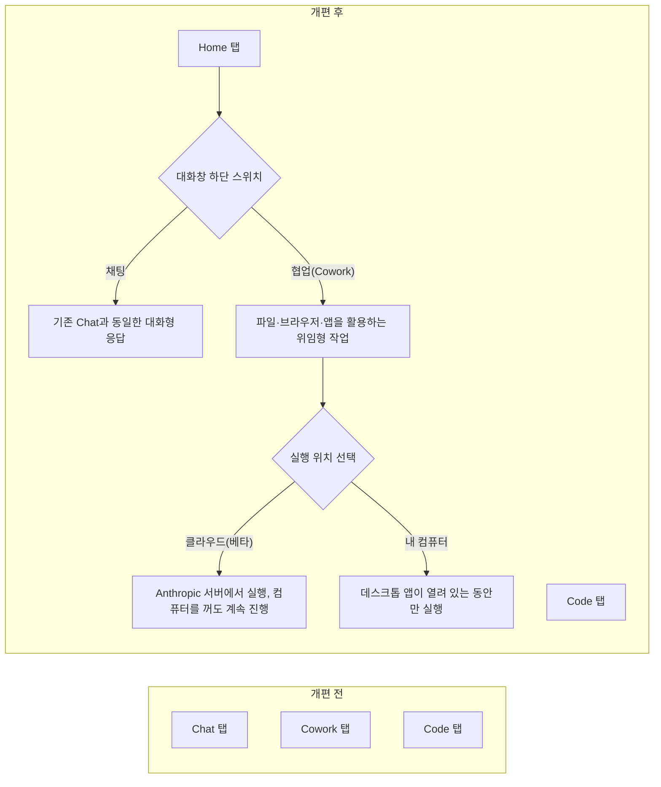

## 들어가며

> 
> https://www.facebook.com/share/p/186m8psRUD/
> 
> 이번에 Claude Desktop 클라이언트가 업데이트되면서 큰 변화가 있네요. 
> 
> 이제 Cowork 이 사라진 것처럼 보이지만, 서비스의 기본으로 격상됐습니다.
> 
> 즉, 예전에는 Chat, Cowork, Code 로 탭이 아예 분리되어 있었는데, 이제는 Home, Code 둘만 구분하고 Home 에 챗봇 스타일의 대화와 Cowork 스타일의 태스크를 대화창에 스위치를 둬서 선택하게 했습니다.
> 
> Claude Desktop 및 Cowork 등을 출시된 날부터 쓰면서 변화하는 모습을 봐온 입장에서, 이 정도로 기능이 붙어서 비슷해지고 있으면 그냥 합해도 되지 않나 싶었는데, 역시나 가장 이상적인 UI/UX 로 합쳐버렸습니다. 
> 
> 어떤 SW를 만들어서 배포해야 하는 태스크를 할 필요가 없는 사람들은 그냥 Home 으로 거의 모든 것을 할 수 있다고 보시면됩니다. 혼자만 만들어 쓰는 SW의 경우, 제대로 버전관리를 하면서 업그레이드해 나간다면 역시나 Code 가 낫지만 그 정도는 아니라고 한다면 Cowork 으로 충분합니다.
> 
> Codex 의 경우는 ChatGPT 앱에서 애초에 코딩도구로 분화시킨 다음에 그 안에서 Cowork 과 같은 것들을 흡수하고 있어서 지금 ChatGPT 와 Codex 의 포지셔닝이 제 경우 좀 애매하게 보이는데, Claude 는 일단 깔끔하게 정리됐네요. 구글은 여전히 파편화되어 있고...
> 
> #ai #agent #claude #cowork #codex #chatgpt #gemini #ui #ux #servicedesign #gonnector #고넥터
> 

공유된 글은 Claude Desktop 클라이언트의 최근 업데이트를 다루고 있다. 겉으로 보기에는 그동안 별도 탭으로 존재하던 Cowork가 화면에서 사라진 것처럼 보이지만, 실제로는 반대로 Cowork가 서비스의 기본 동작 방식으로 승격되었다는 것이 글의 핵심 관찰이다. 이 문서는 이 변화가 정확히 무엇이고 왜 일어났는지를 Anthropic 공식 발표와 지원 문서, 그리고 실사용 후기를 바탕으로 다시 확인한 뒤 정리한 것이다.

## 1. 무엇이 실제로 바뀌었나 — Chat과 Cowork가 하나의 Home으로

Anthropic은 2026년 7월 7일, Claude Cowork를 기존 데스크톱 전용에서 웹(claude.ai)과 모바일(iOS·Android)로 확장한다고 발표했다. Max 플랜부터 순차적으로 베타 롤아웃이 시작되며 이후 다른 플랜으로 확대될 예정이다. 이 발표에서 Anthropic 최고제품책임자 Mike Krieger는 "이제 Chat과 Cowork가 하나의 홈 탭을 공유하며, 사이드바와 검색, 프로젝트·아티팩트 보관 위치가 모두 하나로 합쳐졌다"고 밝혔다. 즉 예전에는 Chat, Cowork, Code로 세 개의 탭이 나뉘어 있었지만, 이제는 Home과 Code 두 개로 재편되고, Home 안에서 대화창 하단의 스위치를 통해 "채팅"과 "협업"(Cowork의 한국어 표기) 중 무엇으로 이번 대화를 시작할지 그때그때 고를 수 있게 된 것이다.

Anthropic 지원 센터의 공식 안내에도 이 변화가 명시되어 있다. "Chat과 Cowork는 하나의 Home을 공유하므로 둘 다 같은 곳에서 시작한다. 메시지 입력창 왼쪽 하단에서 Cowork를 선택하고 작업을 설명하면 되고, 일반 대화로 돌아가려면 Chat을 선택하면 된다"는 것이 안내 문구의 요지다. 다만 흥미로운 점은, 같은 시점에 Claude Code 데스크톱 문서(code.claude.com 한국어판)에는 여전히 "Chat, Cowork, Code" 세 개의 탭이 있다고 서술되어 있어, 실제 롤아웃 속도를 문서 갱신이 아직 따라가지 못하고 있는 것으로 보인다. 이는 이번 변경이 극히 최근(7월 첫째 주)에 이뤄진 롤아웃이라는 점을 감안하면 자연스러운 시차로 보인다.

## 2. 화면을 뜯어보기 — 새로 생긴 요소들

공유된 화면을 항목별로 정리하면 다음과 같다.

**좌측 사이드바**: 기존에는 Chat, Cowork, Code가 나란히 있었지만 이제 최상단에는 Home과 Code만 남았다. 그 아래로 새 작업, 프로젝트, 아티팩트, 예정된 작업, 발송(베타 표기), 사용자 지정 항목이 이어진다. 이 가운데 "발송"은 Dispatch의 한국어 표기로, 휴대폰에서 메시지를 보내면 Claude가 그 작업이 개발 작업인지 아닌지를 스스로 판단해 Cowork 세션이나 Code 세션 중 적절한 쪽으로 라우팅해주는 기능이다. Anthropic 지원 문서에 따르면 버그 수정이나 의존성 업데이트, 테스트 실행, PR 오픈 같은 작업은 자동으로 Code 세션으로, 리서치나 문서 편집, 스프레드시트 작업은 Cowork에 남는 방식으로 나뉜다.

**대화창 하단의 "채팅 / 협업" 스위치**: 이 스위치가 이번 업데이트에서 가장 상징적인 부분이다. 예전에는 어떤 작업을 하려면 먼저 Chat 앱을 쓸지 Cowork 앱을 쓸지부터 정하고 그 안으로 들어가야 했다면, 이제는 하나의 대화창 안에서 매 대화마다 "이번엔 그냥 대화만 할지, 아니면 작업을 맡길지"를 스위치 하나로 정하면 된다. 프로젝트 안에서도 마찬가지로, 같은 프로젝트 지식을 공유하면서 어떤 대화는 채팅으로, 어떤 대화는 협업(Cowork)으로 진행할 수 있다.

**"이 작업 실행" 팝업**: 화면 우측 상단에 나타난 이 팝업은 작업을 어디서 돌릴지 고르는 선택지다. "클라우드에서(베타) — 앱을 닫아도 계속 실행됩니다"와 "내 컴퓨터에서 — 컴퓨터가 켜져 있는 동안만 실행됩니다" 두 가지 옵션이 제시된다. 이는 앞서 설명한 Cowork의 웹·모바일 확장과 정확히 맞물리는 부분으로, Anthropic 지원 문서는 원격(클라우드) 세션의 경우 "Claude의 작업이 사용자 컴퓨터가 아니라 Anthropic 서버에서 실행되며, 노트북을 닫아도 계속 진행되고 예약된 작업도 기기가 오프라인이어도 실행된다"고 설명한다. 다만 로컬 파일 접근이나 브라우저 사용, 컴퓨터 제어처럼 실제 사용자의 컴퓨터 자원이 필요한 기능은 원격 세션이라 하더라도 데스크톱 앱이 열려 있어야만 그 컴퓨터에 접근할 수 있다는 제약이 함께 안내되어 있다.

**모델 선택 및 추론 강도**: 화면 우측의 "Fable 5 높음" 표시는 현재 대화에 어떤 모델을, 어느 정도의 추론 강도(reasoning effort)로 쓸지를 나타낸다. Fable 5는 지난 6월 출시 이후 수출통제로 인한 일시 중단과 복원을 거친 Anthropic의 최상위 모델로, 이 시점에는 구독 플랜에 포함되어 쓸 수 있는 상태였다.

**"8월 5일까지 2배 더 많은 사용량"**: 이 문구는 Cowork의 웹·모바일 확장을 기념해 Anthropic이 한시적으로 제공한 프로모션이다. 9to5Mac을 비롯한 여러 매체가 이 확장 발표와 함께 "Cowork 사용 한도를 8월 5일까지 두 배로 늘린다"는 내용을 보도했으며, Anthropic 공식 릴리스 노트에도 동일한 내용이 명시되어 있다.

아래는 이번 개편으로 달라진 화면 구조를 정리한 다이어그램이다.

## 3. 왜 이런 통합이 이루어졌는가

이번 통합은 갑작스러운 결정이 아니라, Cowork가 데스크톱을 넘어 웹과 모바일로 확장되는 더 큰 흐름의 부산물에 가깝다. Anthropic이 밝힌 사용 데이터에 따르면 Cowork 사용량의 90% 이상이 소프트웨어 개발이 아니라 일상적인 지식노동, 그중에서도 비용 정산이나 계약서 정리, 발표자료 작성 같은 업무 운영과 콘텐츠 제작에 집중되어 있었다. 즉 Cowork를 쓰는 사람 대부분이 애초에 코드를 다루지 않는 사용자였다는 뜻이다. 이런 상황에서 Chat과 Cowork를 굳이 서로 다른 탭, 서로 다른 프로젝트 저장 공간으로 나눠둘 이유가 점점 옅어졌고, 결국 하나의 대화 흐름 안에서 "이번엔 그냥 물어볼지, 일을 맡길지"만 스위치로 정하도록 단순화한 것으로 풀이된다.

실제로 이 업데이트를 다룬 실사용 후기에서도 비슷한 반응이 확인된다. 호주 매체 Impactiv8은 이번 개편에 대해 "이제는 어떤 앱 경험 안에 살지를 미리 정할 필요 없이, 프로젝트 안의 각 대화창마다 이걸 채팅으로 할지 협업 세션으로 할지 그때그때 정할 수 있어 훨씬 논리적으로 느껴진다"고 평가했다. 다만 같은 후기는 이전에 Chat과 Cowork에 같은 이름의 프로젝트를 각각 따로 만들어 뒀던 경우, 통합 이후 두 프로젝트가 나란히 중복으로 남을 수 있어 정리가 필요하다는 점도 함께 지적하고 있다. Anthropic 스스로도 이번 개편이 끝이 아니라 "Chat과 Cowork의 통합은 앞으로 더 개선될 예정"이라고 공지해, 지금의 형태가 최종 형태는 아니라는 점을 시사했다.

## 4. Codex, Gemini와 비교했을 때

글에서 언급한 것처럼, OpenAI 쪽의 상황은 결이 다르다. 바로 전날인 7월 9일 OpenAI는 코딩 전용 도구였던 Codex를 ChatGPT 데스크톱 앱에 통합하며 ChatGPT Work라는 범용 업무 에이전트를 새로 선보였는데, 이 통합 앱 안에는 일반 대화(Chat), 범용 업무(Work), 개발자용(Codex) 세 가지 모드가 여전히 구분되어 공존한다. 즉 Anthropic이 Chat과 Cowork라는 두 개의 축을 하나의 스위치로 합치고 Code만 별도로 남긴 것과 달리, OpenAI는 원래 개발자 전용이었던 Codex의 앱 껍데기 위에 범용 업무 기능을 얹으면서도 Codex 모드 자체는 그대로 유지하는 방식을 택했다. 이 때문에 사용자 입장에서는 "이 작업을 하려면 Work를 써야 하나, Codex를 써야 하나"를 판단해야 하는 지점이 여전히 남아 있는 반면, Claude 쪽은 코드를 다루지 않는 이상 Home 하나로 대부분의 상황이 정리된다는 점에서 구조가 상대적으로 단순하다고 볼 수 있다. Google Gemini의 경우 이번 두 회사의 개편과 비교될 만큼 하나의 흐름으로 정리된 발표가 확인되지 않았으며, 이는 현재까지 공개된 자료를 기준으로 한 상대적 평가일 뿐 향후 변경될 수 있다는 점은 밝혀둔다.

## 5. 실전에서 무엇이 달라지는가

정리하면, 소프트웨어를 만들어 배포하는 작업이 필요 없는 사용자는 이제 Home 하나로 대화와 위임형 작업을 오가며 거의 모든 일을 처리할 수 있게 되었다. 혼자 쓰는 소프트웨어라도 버전 관리를 제대로 하면서 점진적으로 개선해 나가야 하는 수준이라면 여전히 Code 탭이 더 적합하지만, 그 정도의 엄밀함이 필요 없는 작업이라면 Home의 협업(Cowork) 모드만으로 충분하다는 것이 이번 개편이 실질적으로 만들어내는 차이다. 여기에 더해 원격 실행 위치를 클라우드와 로컬 중에서 매번 고를 수 있게 되면서, 컴퓨터를 꺼도 이어지는 장시간 작업과 그날그날 컴퓨터 자원이 필요한 짧은 작업을 같은 화면 안에서 유연하게 오갈 수 있게 되었다는 점도 실무적으로 눈에 띄는 변화다.

## 마무리

이번 개편은 Cowork라는 브랜드가 축소된 사건이 아니라, 오히려 Cowork적인 작업 방식(파일과 앱을 넘나들며 결과물을 완성해 내는 방식)이 Claude Desktop의 기본 동작으로 승격된 사건에 가깝다. Chat이 스위치 하나로 협업 모드가 될 수 있다는 것은, 결국 앞으로 이 둘을 구분하는 것 자체가 점점 더 무의미해질 것이라는 신호로 읽을 수 있다. OpenAI와 Google이 각자 다른 방식으로 같은 방향(하나의 앱 안에서 대화와 실행형 작업을 통합하는 것)을 모색하고 있다는 점에서, 이번 변화는 Claude 하나만의 사건이라기보다는 업계 전반이 향하고 있는 흐름의 한 단면으로 보는 것이 더 정확하다.

---

**작성일: 2026년 7월 10일**
