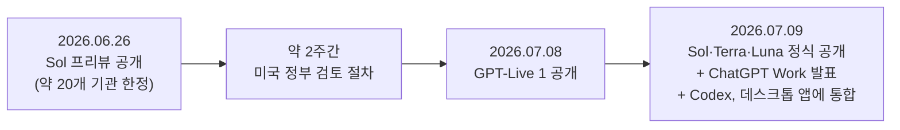
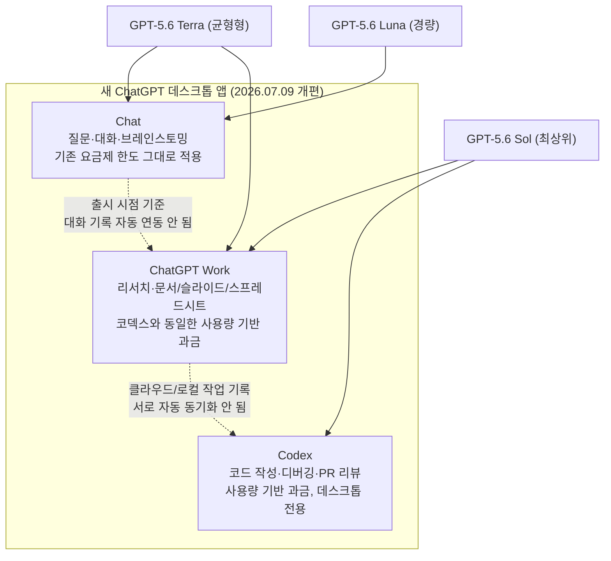
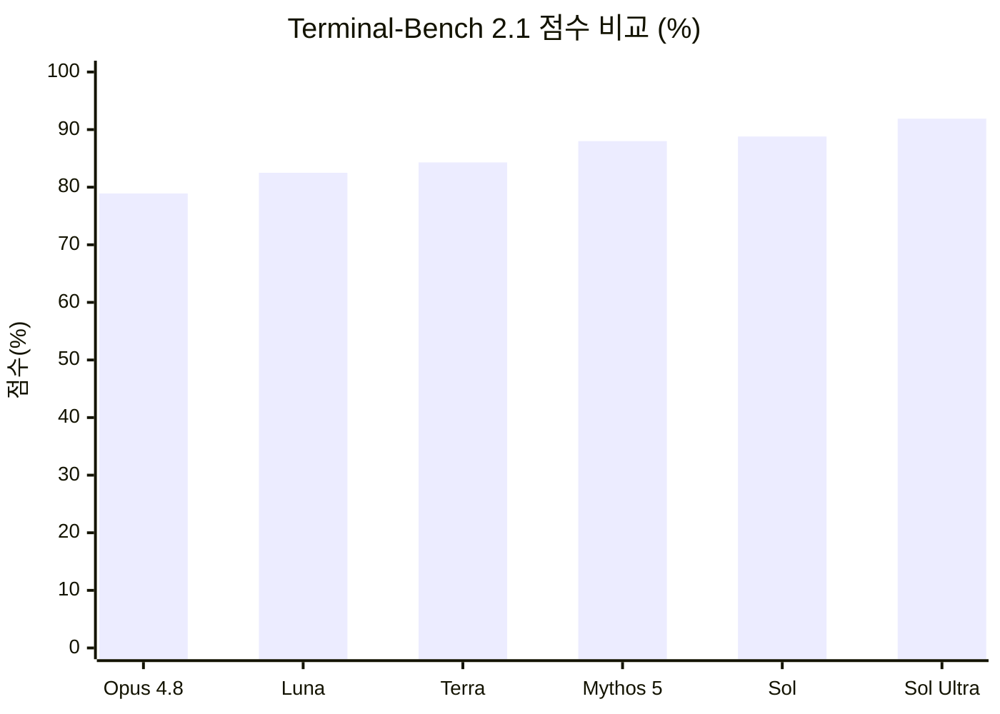
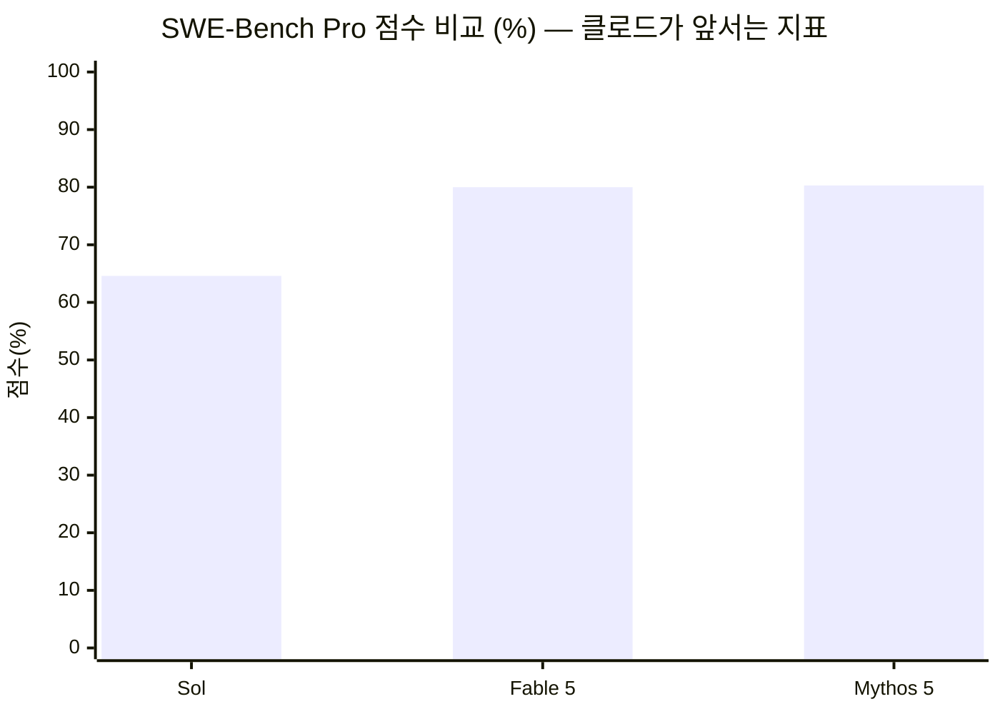

## 관련글

[**GPT 5.6 변화 정리**](https://www.threads.com/@hochul_shin__/post/DamUZHUEdlm)

[**GPT-5.6으로 코딩할 때 무조건 Sol을 고르는 게 정답은 아닙니다**](https://www.threads.com/@billionnapkin/post/Dao7Z7lESD5)

---

## 목차

1. 들어가며
2. 출시 타임라인 — 프리뷰에서 정식 공개까지
3. 세 개의 이름, 하나의 세대 — Sol · Terra · Luna
4. 대화와 위임을 나누다 — Chat · Work · Codex 삼분할 구조
5. 도구 호출의 재설계 — Programmatic Tool Calling과 ultra 모드
6. 숫자로 보는 성능, 그리고 그 이면
7. 미적 감각의 변화 — 코덱스가 만든 결과물과 GPT 이미지 2
8. 커뮤니티의 목소리 — 실사용 후기와 우회 방법
9. 쟁점 점검 — 원문 주장 팩트체크
10. 실전 전략 — 모델 등급과 effort는 서로 다른 축이다
11. 추가된 커뮤니티 반응 — 냉소와 갈아타기 고민
12. 정리하며 — 커뮤니티를 위한 시사점

---

## 1. 들어가며

지난 며칠 사이 스레드(Threads)의 AI 관련 계정들이 일제히 같은 이야기를 쏟아냈다. 오픈AI가 새 모델군인 GPT-5.6을 내놓았고, 그와 동시에 챗GPT 안에 "워크(Work)"라는 새로운 공간이 생겼으며, 기존에 독립 앱이었던 코덱스(Codex)가 챗GPT 데스크톱 앱 안으로 흡수되었다는 내용이었다. 여기에 더해 실사용자들은 새 모델의 미적 감각이 눈에 띄게 좋아졌다는 반응, 코덱스에서 작업한 내용을 챗으로 되돌리기 어렵다는 불만, 그리고 클로드(Claude)와 비교했을 때 어느 쪽이 더 나은지를 둘러싼 논쟁까지 다양한 목소리를 남겼다.

이 문서는 이런 파편화된 게시물과 댓글들을 하나로 묶어서, 무엇이 공식적으로 확인된 사실이고 무엇이 개인의 체감이자 의견인지를 구분해 정리한 것이다. AI바이브코딩기초클래스 커뮤니티에서 교육 자료로 쓰기 위한 목적을 감안해, 최대한 서술형으로 풀어 썼고 필요한 부분에는 표 대신 다이어그램을 곁들였다.

먼저 분명히 해둘 것이 있다. 이 문서에서 다루는 GPT-5.6은 실제로 2026년 6월 26일과 7월 9일 두 차례에 걸쳐 출시된, 확인 가능한 오픈AI의 실제 모델이다. 소셜미디어에서 도는 소문이 아니라 오픈AI 공식 발표, 악시오스(Axios)와 CNBC 같은 매체의 보도, 그리고 오픈AI의 개발자 문서를 통해 교차 확인한 내용이다.

---

## 2. 출시 타임라인 — 프리뷰에서 정식 공개까지

GPT-5.6의 출시는 한 번의 이벤트가 아니라 두 단계로 나뉘어 진행되었고, 그 사이에는 이례적으로 미국 정부가 개입한 2주간의 검토 기간이 끼어 있었다.

첫 단계는 2026년 6월 26일이었다. 오픈AI는 이날 GPT-5.6 Sol을 프리뷰 형태로 공개하면서, 코딩과 컴퓨터 사용, 사이버보안 영역에서 이전 세대를 크게 앞서는 성능을 보여준다고 밝혔다. 다만 이 프리뷰는 누구나 쓸 수 있는 형태가 아니었다. 오픈AI는 이 모델을 사이버 및 생물·화학 능력 측면에서 '높음' 위험 등급으로 분류했고, 그 결과 참여 사실이 정부와 공유된 약 20개 신뢰 기관에만 제한적으로 제공했다. 오픈AI는 당시 공식 입장에서 이런 정부 접근 절차가 장기적인 기본값이 되어서는 안 된다고 못박으며, 이 방식이 사용자와 개발자, 기업, 사이버 방어자, 글로벌 파트너들로부터 좋은 도구를 멀어지게 만든다고 설명했다.

이후 약 2주간 미국 정부와의 협의가 이어졌다. 샘 올트먼 오픈AI CEO는 CNBC와의 인터뷰에서 이 기간 동안 정부와 "협력적인 의견 교환"을 거쳐 "여러 변경"을 가했다고 밝혔고, 정부의 기술적 검토 역량에 대해 "인상적이었다"고 평가했다. 공교롭게도 이 기간은 안트로픽이 수출 통제 문제로 클로드 페이블 5와 클로드 미토스 5에 대한 접근을 일시 중단했다가, 미국 상무부가 수출 통제를 해제한 뒤인 7월 1일 접근을 복원한 시점과 겹친다. 오픈AI의 정식 출시 발표 역시 이 사실을 직접 언급하며, 경쟁사인 안트로픽이 접근을 복원한 직후 자사도 전면 공개에 나섰다고 설명했다.

두 번째 단계는 2026년 7월 9일이었다. 이날 오픈AI는 GPT-5.6 Sol, Terra, Luna 세 모델 모두를 챗GPT와 코덱스, API 전반에 정식으로 공개했다. 전 세계 동시 배포 방식으로 약 24시간에 걸쳐 순차 적용되었으며, 같은 날 새로운 업무용 에이전트인 챗GPT 워크(ChatGPT Work)도 함께 발표되었다. 하루 전인 7월 8일에는 음성 모델인 GPT-라이브 1(GPT-Live 1, 이전 명칭 GPT-Bidi 1)도 별도로 공개되어, 이 주간은 오픈AI 입장에서 발표가 몰린 한 주였다.

아래는 지금까지 설명한 흐름을 정리한 것이다.

정리하자면, 스레드 게시물에서 "어제 새벽에 출시되었다"는 표현은 정확히는 6월 26일의 제한적 프리뷰가 아니라 7월 9일의 전면 공개를 가리키는 것으로 보인다. 게시물 작성 시점이 7월 10일 전후로 추정되기 때문에 이 부분은 시점상 자연스럽게 맞아떨어진다.

---

## 3. 세 개의 이름, 하나의 세대 — Sol · Terra · Luna

GPT-5.6에서 가장 눈에 띄는 변화는 단일 모델이 아니라 세 개의 티어로 나뉘어 출시되었다는 점이다. 오픈AI는 이번부터 mini나 nano 같은 기존의 크기 기반 이름 대신, 태양과 지구, 달에서 따온 Sol, Terra, Luna라는 이름 체계를 도입했다. 숫자(5.6)는 세대를 가리키고, 이름은 세대와 무관하게 이어지는 능력 등급을 가리키는 구조다. 즉 다음 세대가 나오면 "6.0 Sol", "6.0 Terra" 식으로 숫자만 바뀌고 이름 체계는 유지될 가능성이 있다는 뜻인데, 이 부분은 오픈AI가 명시적으로 확정한 것은 아니고 여러 매체가 해석을 통해 추정한 내용이라는 점은 짚어둘 필요가 있다.

세 모델의 역할은 다음과 같이 나뉜다. Sol은 가장 강력한 플래그십 모델로, 복잡한 코딩과 보안 연구처럼 어려운 문제를 담당한다. Terra는 성능과 비용의 균형을 맞춘 모델로 고객 지원이나 내부 도구, 문서 분석 같은 대량 업무에 적합하다. Luna는 속도와 비용 효율을 우선한 모델로 요약이나 초안 작성, 일상적인 자동화에 쓰인다.

가격은 100만 토큰 기준으로 Sol이 입력 5달러·출력 30달러, Terra가 입력 2.5달러·출력 15달러, Luna가 입력 1달러·출력 6달러다. 티어 간 가격 차이가 5배에 이르기 때문에, 작업의 난이도에 맞춰 모델을 선택하면 비용을 상당히 절약할 수 있는 구조다.

추론 강도(reasoning effort) 옵션도 새로워졌다. 기존의 none, low, medium, high, xhigh에 이번에 max가 추가되어 Sol에게 가장 깊이 생각할 시간을 준다. 여기에 더해 ultra라는 별도의 모드가 생겼는데, 이는 단일 에이전트의 한계를 넘어 기본적으로 4개의 하위 에이전트를 병렬로 가동해 복잡한 작업을 가속하는 방식이다. 일부 벤치마크에서는 16개 에이전트까지 병렬로 돌린 결과도 공개되었다.

모델 접근 권한은 요금제에 따라 나뉜다. 무료(Free)와 Go 요금제 사용자는 챗GPT 워크와 코덱스 안에서 Terra만 쓸 수 있고, Plus·Pro·Business·Enterprise 사용자는 Sol·Terra·Luna 중에서 고르고 추론 강도도 직접 설정할 수 있다. max 추론 강도는 GPT-5.6에 접근 권한이 있는 모든 사용자가 챗GPT 워크와 코덱스에서 쓸 수 있지만, ultra 모드는 챗GPT 워크에서는 Pro와 Enterprise 사용자에게만, 코덱스에서는 Plus 이상 요금제부터 열려 있다.

---

## 4. 대화와 위임을 나누다 — Chat · Work · Codex 삼분할 구조

스레드 게시물에서 "챗과 워크의 분리"라고 표현한 부분이 이번 업데이트의 구조적 핵심이다. 오픈AI 도움말 문서는 이를 명확하게 정의하고 있다. 챗GPT는 이제 챗(Chat), 챗GPT 워크(ChatGPT Work), 코덱스(Codex) 세 가지 모드로 구성된다. 챗은 질문에 답하고 대화하는 기존 방식 그대로다. 워크는 더 긴 리서치를 수행하고 완성된 결과물—문서, 스프레드시트, 프레젠테이션, 리포트, 웹사이트—을 만들어내는 역할을 맡는다. 코덱스는 소프트웨어 개발과 기술 작업을 전담하는 에이전트로 남는다.

이 구조 변화의 배경에는 코덱스의 실제 사용 실태가 있다. 오픈AI 경제연구팀이 공개한 자료에 따르면 코덱스 주간 사용자는 500만 명이 넘는데, 그중 100만 명 이상이 소프트웨어 개발이 아닌 다른 업무에 코덱스를 쓰고 있었다. 코드를 한 줄도 짜지 않는 법무·재무·인사 부서 직원들까지 복잡한 작업을 여러 단계로 쪼개 처리하는 코덱스의 방식을 업무에 끌어다 쓰고 있었던 것이다. 오픈AI는 이 흐름을 정식 제품으로 만든 셈인데, 그 결과물이 챗GPT 워크다.

챗GPT 워크는 슬랙, 마이크로소프트 팀즈, 구글 드라이브, 셰어포인트, 이메일, 캘린더, CRM, 프로젝트 관리 도구는 물론 지메일, 아웃룩, 세일즈포스, 어도비, 줌, 링크드인, 깃허브, 드롭박스까지 아우르는 통합 플러그인 디렉터리를 통해 외부 앱과 연결된다. 사용자가 "@" 뒤에 앱 이름을 적어 특정 정보원을 지정할 수도 있고, 챗GPT가 알아서 어떤 앱을 참고할지 판단하게 둘 수도 있다. 예약 작업(Scheduled Tasks) 기능을 쓰면 사용자가 자리를 비운 사이에도 작업이 계속 진행되게 만들 수 있다.

과금 구조도 챗과는 다르다. 워크는 일반 대화형 챗과 달리 코덱스와 동일한 사용량 기반 과금 구조를 따른다. 즉 좌석 수가 아니라 실제로 얼마나 썼는지에 따라 요금이 매겨지고, 기업 관리자는 콘솔에서 팀별·개인별 지출 한도를 정하고 추가 크레딧 요청을 승인하는 방식으로 예산을 관리하게 된다.

세 모드가 놓이는 위치도 플랫폼마다 다르다. 오픈AI 도움말 문서에 따르면 웹과 모바일에서는 챗과 워크만 선택할 수 있고, 코덱스는 데스크톱 앱에서만 선택 가능한 모드다. 모바일 앱의 '원격(Remote)' 탭에서 데스크톱 코덱스가 처리 중인 작업 일부를 확인할 수는 있지만, 이는 웹이나 모바일의 대화 기록으로 편입되지는 않는다. 웹과 모바일에서 만든 워크 대화는 클라우드에 남고, 출시 시점 기준으로는 데스크톱의 워크 화면에 나타나지 않는다. 반대로 데스크톱에서 로컬 파일을 붙여 진행한 워크나 코덱스 작업도 그 컴퓨터에만 남는다. 이 부분은 뒤에서 다룰 커뮤니티의 불만—코덱스 작업 내용을 챗으로 이어가기 어렵다는 지적—과 정확히 맞아떨어지는 공식 문서상의 한계다.

제품 구조 개편과 함께 앱 브랜딩도 바뀌었다. 기존에 독립 앱이었던 코덱스는 새로운 챗GPT 데스크톱 앱 안으로 흡수되었고, 그 전까지 쓰이던 기존 데스크톱 앱은 '챗GPT 클래식(ChatGPT Classic)'이라는 이름으로 남게 되었다. 스레드 댓글 중 "채팅 UI는 classic이 나은데 프로젝트가 남아있어서"라는 언급은 바로 이 신구 앱 분리 상황에서 나온 실사용자의 반응으로 보인다.

아래는 지금까지 설명한 삼분할 구조를 정리한 다이어그램이다.

---

## 5. 도구 호출의 재설계 — Programmatic Tool Calling과 ultra 모드

스레드에 올라온 코덱스 제작 슬라이드 중 하나는 "도구 호출은 '한 번씩'에서 '작업 단위'로"라는 제목으로 프로그래매틱 툴 콜링(Programmatic Tool Calling, 이하 PTC)을 설명하고 있었다. 이는 실제로 오픈AI가 GPT-5.6과 함께 리스폰시스 API(Responses API)에 새로 도입한 기능이다.

기존 방식—오픈AI 문서가 '직접 호출'이라 부르는 방식—에서는 모델이 판단해서 도구를 한 번 호출하고, 결과를 확인한 뒤 다음 판단을 내리고 다시 도구를 호출하는 과정을 반복한다. 도구를 부를 때마다 모델이 매번 개입해야 하니, 반복 작업이 많을수록 왕복 횟수와 토큰 소모가 늘어난다.

PTC는 이 구조를 바꾼다. 모델이 자바스크립트 코드를 직접 작성해서, 격리된 호스팅 런타임(V8 엔진 기반) 안에서 여러 도구 호출을 한꺼번에 묶어 처리하게 만드는 방식이다. 이 런타임에는 Node.js나 네트워크 접근, 파일시스템, 서브프로세스 실행 같은 기능이 없고 딱 도구 조율에만 쓰인다. 모델은 이 코드 안에서 도구 결과를 필터링하고, 조인하고, 집계하고, 검증한 다음, 그렇게 구조화한 작은 결과만 최종적으로 모델 자신에게 돌려받는다. 오픈AI 문서의 표현을 빌리면 핵심은 "병렬 호출 자체가 목적이 아니라, 코드로 줄일 수 있는 중간 작업일 때 PTC가 효과적"이라는 것이다. 즉 다음에 무엇을 할지 이미 정해져 있는 반복 작업—가져오고, 거르고, 변환하고, 합산하는 흐름—에는 PTC가 잘 맞지만, 매 결과를 보고 나서야 다음 판단이 바뀌는 작업에는 여전히 기존의 직접 호출 방식이 더 적합하다.

이 기능은 영지식 데이터 보존(Zero Data Retention, ZDR) 환경과도 호환되도록 설계되었고, 추가적인 컨테이너 비용 없이 쓸 수 있다는 점도 문서에 명시되어 있다. 오픈AI가 공개한 고객 사례를 보면, 로고(Rogo)라는 금융 리서치 기업은 PTC를 도입한 뒤 품질 저하 없이 출력 토큰을 24% 줄이고 작업 완료 속도를 28% 높였다고 밝혔고, 플레이코(PlayCo)는 전체 토큰을 63.5%, 모델 턴 수를 50.1% 줄였다고 보고했다. 다만 이 수치들은 모두 오픈AI가 발표한 고객 자체 보고 수치이며, 독립적인 제3자가 재현해 검증한 결과는 아니라는 점은 분명히 해둘 필요가 있다.

한편 ultra 모드는 PTC와는 별개의 개념으로, 여러 개의 서브 에이전트가 병렬로 각자의 작업을 수행한 뒤 결과를 하나로 종합하는 방식이다. 기본값은 4개의 에이전트를 동시에 돌리는 것이고, 브라우즈컴프(BrowseComp)나 SEC-벤치 프로(SEC-Bench Pro) 같은 일부 벤치마크에서는 16개 에이전트까지 병렬로 운용한 결과도 공개되었다. 이 방식은 토큰 사용량을 늘리는 대신 벽시계 기준 작업 시간을 줄이고, 독립적으로 나눌 수 있는 복잡한 작업에서 성능을 끌어올리는 데 쓰인다.

---

## 6. 숫자로 보는 성능, 그리고 그 이면

오픈AI가 공개한 벤치마크 수치를 그대로 옮기면 GPT-5.6, 특히 Sol과 Sol Ultra가 여러 지표에서 매우 강력해 보인다. 하지만 여러 매체가 지적하듯, 오픈AI가 자체적으로 공개한 표 안에도 클로드 계열 모델이 앞서는 항목이 분명히 존재한다. 균형 잡힌 그림을 위해 양쪽을 함께 짚어본다.

먼저 커맨드라인 워크플로의 계획·반복·도구 조율 능력을 측정하는 터미널-벤치(Terminal-Bench) 2.1에서는 GPT-5.6 계열이 확실히 앞선다. 여러 매체가 공개한 수치를 종합하면 클로드 오퍼스(Opus) 4.8이 78.9%, GPT-5.6 Luna가 82.5%, GPT-5.6 Terra가 84.3%, 클로드 미토스(Mythos) 5가 88.0%, GPT-5.6 Sol이 88.8%, 그리고 여러 에이전트를 병렬로 돌리는 Sol Ultra가 91.9%를 기록했다. 흥미로운 점은 가장 저렴한 Luna조차 클로드 오퍼스 4.8을 앞선다는 것인데, 동시에 Luna는 오픈AI의 직전 세대 플래그십이었던 GPT-5.5의 83.4%에는 오히려 못 미쳤다. 즉 "가장 싼 신형이 이전 세대 최상위 모델보다 낫다"는 말은 클로드 오퍼스 4.8과 비교했을 때는 맞지만, 오픈AI 자신의 직전 세대 최상위 모델과 비교하면 성립하지 않는다.

에이전틱 코딩 능력을 종합 평가하는 아티피셜 애널리시스 코딩 에이전트 인덱스(Artificial Analysis Coding Agent Index) v1.1에서는 max 추론 강도의 Sol이 80점을 기록해 클로드 페이블(Fable) 5의 77.2점보다 2.8점 앞섰고, 이 과정에서 사용한 출력 토큰은 페이블 5의 절반 이하, 소요 시간도 절반 이하, 비용도 약 3분의 1 수준이었다고 오픈AI는 밝혔다. 같은 지표에서 Terra도 페이블 5를 근소하게 앞섰다는 보도가 있다.

하지만 실제 소프트웨어 엔지니어링 작업의 난이도를 반영하도록 설계된 SWE-벤치 프로(SWE-Bench Pro)에서는 상황이 뒤집힌다. 이 벤치마크에서 Sol은 64.6%에 그친 반면, 클로드 미토스 5는 80.3%, 클로드 페이블 5는 80%를 기록해 약 15~16점 차이로 클로드 계열이 앞선다. 마크테크포스트(MarkTechPost)는 이를 두고 "SWE-벤치 프로는 클로드 미토스 5와 페이블 5에 약 15점 뒤처진다"고 명시적으로 지적했다.

55개 전문 분야에 걸친 장기 실무 워크플로를 평가하는 에이전츠 라스트 이그잼(Agents' Last Exam, ALE)에서는 수치 자체에 혼선이 있었다. 오픈AI의 보도자료는 Sol이 53.6점을 기록해 클로드 페이블 5(적응형 추론 기준 40.5점)보다 13.1점 앞섰다고 발표했지만, 정작 오픈AI가 함께 공개한 평가표에는 Sol의 점수가 52.7점으로 다르게 적혀 있었다. 13.1이라는 차이값 자체는 53.6에서 40.5를 뺀 값과 일치하기 때문에 페이블 5 쪽 기준값은 일관되지만, Sol의 점수만 보도자료와 공식 표 사이에 약 1점 가까이 차이가 나는 셈이다. 이는 오픈AI 발표 자료 내부의 불일치이며, 이 문서를 준비하며 확인한 여러 출처 중에서 마크테크포스트가 별도로 짚어낸 부분이다.

컴퓨터 사용 능력을 측정하는 OS월드(OSWorld) 2.0에서는 Sol이 62.6%를 기록했는데, 이때 사용한 출력 토큰은 클로드 오퍼스 4.8 대비 85% 적었다고 오픈AI는 밝혔다. 사이버보안 영역에서는 6월 26일 프리뷰 발표 당시, 취약점 연구와 익스플로잇 관련 작업에서 Sol이 안트로픽의 미토스 프리뷰(Mythos Preview, 현재의 정식 미토스 5가 아니라 그 이전 프리뷰 버전) 대비 약 3분의 1의 토큰만으로 비슷한 성능을 냈다고 발표했다. 다만 오픈AI는 동시에 Sol, Terra, Luna 세 모델 모두가 자체 방어선인 '사이버 치명적(Cyber Critical)' 임계값은 넘지 않았으며, 크로미움과 파이어폭스를 대상으로 한 테스트에서 버그와 익스플로잇의 구성요소는 찾아냈지만 테스트된 조건에서 완전한 형태의 익스플로잇 체인을 자율적으로 만들어내지는 못했다고 명시했다.

한편 마크테크포스트는 GA(정식 출시) 발표를 종합하며 클로드 페이블 5가 여전히 앞서는 지표로 아티피셜 애널리시스 인텔리전스 인덱스 v4.1, GDPval-AA v2, 헬스벤치 프로페셔널(HealthBench Professional), 툴애슬론(Toolathlon)을 꼽았다. 정리하면 GPT-5.6은 터미널 기반 에이전틱 코딩, 컴퓨터 사용, 종합 코딩 에이전트 지표에서 강세를 보이지만, 실무 소프트웨어 엔지니어링 정확도(SWE-벤치 프로)와 몇몇 지식노동·헬스케어 관련 지표에서는 클로드 계열이 여전히 앞선다는 것이 여러 출처를 종합했을 때의 균형 잡힌 결론이다.

마지막으로 안전성 관련 수치도 짚어둘 만하다. 오픈AI는 GPT-5.6 정식 출시 전 약 70만 A100e GPU 시간을 블랙박스 자동 레드티밍에 투입했다고 밝혔고, 분류기 신호에만 의존하지 않고 추론 전용 모니터가 대화 내용을 검토해 잠재적 위해 가능성을 살피는 구조를 도입했다고 설명했다. 또한 Sol의 사이버 안전장치가 이전 모델 대비 약 10배 많은 잠재적 유해 활동을 차단한다고 주장했는데, 이 수치 역시 오픈AI 자체 발표 수치이며 독립 검증 결과는 아니다.

---

## 7. 미적 감각의 변화 — 코덱스가 만든 결과물과 GPT 이미지 2

스레드 게시물 중 하나는 코덱스로 만든 프레젠테이션 슬라이드와 웹사이트 화면을 예시로 공유하며 "GPT의 구리구리한 감성이 많이 사라졌다"고 평했다. 실제로 공유된 예시 중 하나는 앞서 설명한 PTC 기능 자체를 설명하는 슬라이드였고, 다른 하나는 여름 컬렉션을 소개하는 미니멀한 패션 브랜드 웹사이트, 또 다른 하나는 소리와 도형을 시각적으로 표현하는 추상적인 컨셉의 웹사이트였다. 이런 결과물의 디자인 완성도에 대한 평가는 결국 주관적인 판단의 영역이라, 이 문서가 "정말 좋아졌다" 혹은 "그렇지 않다"를 객관적으로 검증하기는 어렵다. 다만 앞서 6장에서 다룬 것처럼, 여러 업계 관계자들이 Sol을 코딩·전략·사이트 제작 전반에서 오픈AI의 역대 최고 모델로 평가했다는 보도가 있었던 점은 이 체감과 어느 정도 방향이 일치한다.

다만 짚어야 할 부분이 있다. 마지막 스레드 게시물에서 언급된 "지피티 이미지2 모델로, 자체 이미지 생성이 넘사벽. 클로드는 아예 안됨, 다 API로 가져와야함"이라는 주장은 GPT-5.6 자체의 기능이 아니라 별도의 이미지 생성 모델인 GPT 이미지 2(GPT Image 2)를 가리키는 것이다. GPT 이미지 2는 2026년 4월 21일 오픈AI가 별도로 출시한 모델로, GPT-5.6과 같은 시점에 나온 것이 아니다. 이 모델은 오픈AI 최초로 사고(thinking) 기반 구조를 이미지 생성에 적용했다는 점이 특징이며, 텍스트 렌더링 정확도가 크게 개선되어 한국어를 포함한 다국어 텍스트를 이미지 안에 비교적 정확하게 그려낼 수 있다는 평가를 받는다.

클로드가 자체 이미지 생성 기능을 갖추고 있지 않다는 부분은 사실이다. 여러 매체와 커뮤니티 자료를 확인한 결과, 안트로픽은 2026년 7월 기준으로도 클로드에 자체적인 텍스트-투-이미지(사진·일러스트 생성) 모델을 탑재하지 않았다. 클로드는 업로드된 시각 자료를 분석하는 능력, 그리고 SVG나 인터랙티브 컴포넌트를 코드로 그려내는 아티팩트(Artifacts) 기능은 갖추고 있지만, 사진처럼 보이는 이미지를 직접 생성하려면 MCP 등을 통해 외부 이미지 생성 모델과 연결해야 한다. 이는 안트로픽이 딥페이크 등 오남용 위험을 이유로 자체 이미지 생성 모델 개발을 의도적으로 미뤄온 전략적 선택이라는 것이 업계의 대체적인 해석이며, 안트로픽이 향후 이 방향을 바꿀지는 이 문서 작성 시점 기준으로 공식적으로 확인되지 않는다.

---

## 8. 커뮤니티의 목소리 — 실사용 후기와 우회 방법

공유된 게시물과 댓글에는 실사용자들의 체감과 우회 노하우가 여럿 담겨 있었다. 이 절의 내용은 모두 개인의 의견이자 경험담이며, 객관적으로 검증된 사실이 아니라는 점을 전제로 소개한다.

가장 실질적인 불만은 코덱스에서 진행한 작업을 챗으로 다시 가져오기 어렵다는 점이었다. 한 사용자는 "chat으로 대화하고 codex로 넘기는 방식은 훌륭하지만, codex로 넘겨서 작업을 진행하고 chat으로 돌아갈 방법이 없다"고 지적했는데, 이는 앞서 4장에서 설명한 오픈AI 공식 문서의 내용과 정확히 일치한다. 실제로 챗GPT 워크와 코덱스의 대화·작업 기록은 출시 시점 기준으로 서로 자동 동기화되지 않는다.

이에 대해 커뮤니티는 나름의 우회 방법을 공유했다. 한 댓글은 작업 내용을 파일로 압축(zip)해서 통째로 챗에 올리는 방법을 제안했고, 다른 댓글은 좀 더 정교한 방법을 제시했다. 챗에서 깃허브 플러그인에 접근할 수 있으니, 코덱스에서 작업을 마친 뒤 결과물을 마크다운으로 정리해 깃허브에 올리고, 그 올라간 내용을 챗이 읽도록 지시하면 맥락을 유지한 채 이어갈 수 있다는 것이다. 이 방법은 3장에서 설명한 통합 플러그인 디렉터리에 깃허브가 포함되어 있다는 사실과 부합하는, 사용자들이 스스로 찾아낸 실용적인 해법으로 보인다.

성능 체감에 대해서는 의견이 갈렸다. 코덱스로 Sol Ultra를 여덟 시간 사용해봤다는 한 사용자는 "Fable 5보다 훨씬 꼼꼼하게, 알아서 끝까지 물고 늘어져서 마치기 때문에 한 번에 끝나는 느낌"이라고 평가하면서도, 속도가 느리고 토큰 소모가 크다는 단점을 함께 지적했다. 반면 다른 사용자는 "하루종일 돌려보는데 페이블이 더 잘하는 것 같다"고 정반대의 체감을 전했다. 클로드 맥스와 코덱스에 매달 상당한 비용을 쓴다는 한 사용자는 코덱스로 완전히 갈아타는 것을 고려한다며, 그 이유로 코덱스의 컴퓨터·브라우저 사용 기능이 우수하다는 점, 클로드가 특정 지역 규제를 이유로 요청을 제한하는 경우가 있었다는 경험담, 코덱스의 프론트엔드 디자인이 개선되었다는 점, 그리고 앞서 7장에서 다룬 이미지 생성 격차를 꼽았다. 다만 이는 한 개인의 판단 기준이며, 다른 댓글에서는 "클로드는 좋긴 하지만 그 돈 주고 써야 할 정도로 좋은 건 아니다, 특히 코딩에 있어서는"이라는 부정적 체감과, 국내의 한 AI 유튜브 채널(이종범)을 언급하며 "지피티가 한 수 위이지만 클로드가 못한다는 뜻은 아니다"라는 조심스러운 평가도 함께 달렸다.

이런 체감 차이는 앞선 6장의 벤치마크 결과와 겹쳐 보면 어느 정도 설명이 된다. 터미널 기반 작업이나 컴퓨터·브라우저 사용 위주의 작업에서는 GPT-5.6 계열이 강세를 보이는 지표가 실제로 존재하고, 반대로 SWE-벤치 프로처럼 복잡한 실무 소프트웨어 엔지니어링을 평가하는 지표에서는 클로드 계열이 앞서는 결과도 존재한다. 즉 "어느 쪽이 낫다"는 결론은 작업의 성격에 따라 달라질 수 있으며, 이는 개인의 체감이 서로 다르게 나타나는 이유를 어느 정도 뒷받침한다.

한편 "챗은 사실상 무제한으로 쓸 수 있다"는 설명에 대해서는 댓글에서부터 "챗이 무제한일 리가"라는 회의적인 반응이 달렸다. 이 부분은 다음 장에서 별도로 팩트체크한다.

---

## 9. 쟁점 점검 — 원문 주장 팩트체크

이 장에서는 원본 게시물들이 담고 있던 구체적 주장을 하나씩 짚어, 공식 자료로 확인되는 부분과 확인되지 않는 부분을 구분한다.

**"챗(chat)은 기존 방식처럼 사실상 무제한으로 쓸 수 있다."** 이 표현은 부분적으로만 맞는 것으로 보인다. 오픈AI 도움말 문서는 챗이 "기존 요금제 구조 그대로" 유지된다고 설명할 뿐, '무제한'이라는 표현을 공식적으로 쓰지 않는다. 반대로 워크와 코덱스는 명시적으로 "사용량 기반 과금 구조"를 따른다고 밝혀, 챗과 워크/코덱스 사이에 과금 방식의 차이가 있다는 점은 사실로 확인된다. 다만 챗 자체도 요금제별 공정 사용 정책이나 한도가 있을 수 있어, '사실상 무제한'이라는 표현은 작성자 개인의 체감에 가깝다. 실제로 같은 게시물의 댓글에서도 "챗이 무제한일 리가"라는 회의적 반응이 나온 것을 보면, 이 부분은 커뮤니티 내에서도 의견이 엇갈리는 지점이다.

**"테라는 중상위급 모델인데 GPT-5.5보다 확실히 여러모로 낫다."** 이 주장은 어느 지표를 기준으로 삼느냐에 따라 결론이 달라진다. 아티피셜 애널리시스 코딩 에이전트 인덱스 기준으로는 Terra가 페이블 5를 근소하게 앞섰다는 보도가 있어 상당한 개선으로 볼 수 있는 근거가 있다. 반면 다른 매체는 Terra를 "GPT-5.5와 비슷한 품질을 절반 가격에" 제공하는 모델로 설명하기도 해, 절대적인 품질 향상보다는 가격 대비 효율 개선에 무게를 두는 해석도 존재한다. 두 설명이 서로 모순되는 것은 아니지만, "확실히 여러모로 낫다"는 단정적인 표현보다는 "적어도 일부 지표에서는 앞서고, 전반적으로는 가성비가 크게 개선되었다"는 쪽이 더 정확한 서술로 보인다.

**"미감이 꽤 좋아졌다."** 이는 검증 가능한 객관적 사실이라기보다 사용자 체감의 영역이다. 다만 앞서 언급했듯 여러 업계 관계자가 Sol을 코딩·전략·사이트 제작 부문에서 오픈AI의 최고 모델로 평가했다는 보도가 존재해, 완전히 근거 없는 체감은 아닌 것으로 보인다.

**"chat으로 넘겨서 codex로 작업하고 다시 chat으로 돌아갈 방법이 없다."** 이는 오픈AI 공식 도움말 문서와 정확히 일치하는, 사실로 확인되는 내용이다. 출시 시점 기준으로 워크와 코덱스의 클라우드/로컬 작업 기록은 챗의 대화 기록과 자동으로 동기화되지 않는다.

**"클로드는 이미지 생성이 아예 안 되고 다 API로 가져와야 한다."** 이는 사실로 확인된다. 안트로픽은 2026년 7월 기준으로도 클로드에 자체 텍스트-투-이미지 생성 모델을 탑재하지 않았으며, 사진 형태의 이미지를 만들려면 MCP 등을 통한 외부 연동이 필요하다.

**"클로드가 한국의 공정거래위원회 법 등을 이유로 요청을 제한하는 경우가 많다."** 이는 특정 개인의 사용 경험에 근거한 주장으로, 이 문서를 준비하며 확인한 공개 자료로는 그 빈도나 패턴을 독립적으로 검증할 수 없었다. 따라서 이 주장은 사실 여부를 판단하지 않고 하나의 개인 경험으로만 소개한다.

**"이종범 채널에서도 지피티가 한 수 위라고 한다."** 이는 특정 유튜브 채널의 평가를 인용한 2차 정보로, 이 문서는 해당 채널의 영상 내용을 직접 확인하지 않았으므로 그 평가의 정확한 근거나 맥락을 검증하지 않는다. 다만 이 댓글 작성자 스스로도 "클로드가 못한다는 뜻은 아니다"라며 신중한 태도를 취하고 있다는 점은 그대로 옮겨둔다.

---

## 10. 실전 전략 — 모델 등급과 effort는 서로 다른 축이다

GPT-5.6 출시 이후 개발자 커뮤니티에서 반복적으로 나오는 지적이 하나 있다. Sol·Terra·Luna라는 이름을 그대로 "상·중·하" 서열로 받아들이면 안 된다는 것이다. 스레드에 올라온 한 게시물은 이를 다음과 같이 정리했다. Luna에 더 높은 추론 강도(effort)를 주면 Sol을 낮은 강도로 쓸 때보다 비슷하거나 더 나은 결과를, 더 싼 값에 얻는 구간이 있다는 것이다. 그래서 "Luna < Terra < Sol"처럼 모델 이름만으로 줄을 세우지 말고, 모델과 effort의 조합—예를 들어 Luna High, Terra Medium, Sol Low—을 하나의 단위로 봐야 한다는 주장이다.

이 주장은 실제로 독립적인 벤치마크 기관인 아티피셜 애널리시스(Artificial Analysis)의 분석과 상당 부분 맞아떨어진다. 이 기관은 GPT-5.6 세 모델의 지능-비용 곡선(Pareto frontier)을 effort 단계별로 그려본 결과, Terra는 어떤 effort 단계에서도 최적 곡선 위에 놓이지 못한다는 점을 확인했다. 즉 Terra의 특정 effort 조합이 있다면, 그보다 더 지능이 높으면서 비용은 같거나, 지능은 같으면서 비용은 더 낮은 Luna 또는 Sol의 effort 조합이 항상 존재한다는 것이다. 이는 "Luna를 높은 강도로 쓰는 편이 Terra보다 나을 수 있다"는 원문 게시물의 주장과 방향이 일치하는 독립적인 근거다. 다만 이 분석이 정확히 "Luna High가 Sol Low보다 낫다"는 구체적인 문장으로 발표된 것은 아니라는 점은 분명히 해둔다. 확인되는 것은 "Terra가 최적 곡선에서 밀려난다"는 더 일반적인 결론이고, 원문 게시물의 표현은 이 결론을 실무자의 언어로 풀어낸 것에 가깝다.

Ultra 모드에 대한 설명도 여러 출처와 일치한다. Ultra는 "더 똑똑한 Sol"이 아니라 기본적으로 4개의 하위 에이전트를 병렬로 가동해 서로 다른 영역을 동시에 조사하고 결과를 합치는 방식이며, 이는 API의 멀티에이전트 베타 기능과 같은 원리로 동작한다. 독립 분석 기관 벨럼(Vellum)이 정리한 자료에 따르면 Ultra 모드는 브라우즈컴프(BrowseComp)에서 1.8점, SEC-벤치 프로에서 3.1점, 터미널-벤치에서 3.1점의 성능 향상을 가져오지만, 터미널-벤치 기준으로 이 3.1점을 얻기 위해 드는 비용은 단일 에이전트 Sol의 약 3배에 달한다. 이는 "Sol Ultra의 추가 비용이 항상 Max보다 가치 있는 것은 아니다. 나눌 수 없는 작업이라면 서브에이전트를 늘리기보다 한 모델이 깊게 생각하게 하는 편이 낫다"는 원문 게시물의 결론과 정확히 부합하는 수치다.

다만 "낮은 등급 모델에 effort만 올리면 항상 이득"이라는 식으로 이 원칙을 일반화하는 데는 주의가 필요하다. 코드 리뷰 도구 업체 코드래빗(CodeRabbit)이 100건 이상의 장기 코딩 작업으로 진행한 실측 결과를 보면, Sol은 63.7%의 작업을 통과시키면서 작업당 평균 출력 토큰이 20,968개였던 반면, Terra는 통과율이 40.7%에 그치면서도 평균 출력 토큰은 오히려 55,594개로 더 많이 썼다. 즉 이 특정 실험에서는 하위 모델이 통과율은 더 낮으면서 토큰은 더 많이 쓰는, 겉보기와 반대되는 결과가 나왔다. 이는 코드래빗 자체의 하네스와 작업 집합에 한정된 결과이고 모든 저장소에 일반화할 수는 없지만, "모델 등급을 낮추고 effort로 보완하면 항상 이득"이라는 손쉬운 공식이 작업의 성격에 따라 뒤집힐 수 있다는 것을 보여주는 사례다. 재시도나 수정 작업까지 포함한 전체 워크플로 비용을 기준으로 판단해야 한다는 뜻이다.

실무 가이드 차원에서 오픈AI 자신의 문서도 비슷한 방향을 제시한다. 오픈AI의 코덱스 가이드는 파일 6개에 걸친 이름 변경처럼 패턴과 대상, 테스트가 이미 알려진 작업은 Luna에, 반복 가능한 재현 경로가 없는 인증 오류 진단처럼 원인 분석 자체가 첫 결과물이 되어야 하는 작업은 Sol에 배정하라고 설명한다. 추론 강도에 대한 오픈AI의 이관 가이드 역시 "현재 쓰던 effort를 기준선으로 유지한 뒤 한 단계 낮춰서 비교해보라"는 보수적인 접근을 권장하며, max는 가장 어려운 품질 우선 작업에만 남겨두라고 안내한다.

정리하면, 원문 게시물이 제시한 실전 원칙—반복 작업은 Luna와 높은 effort, 일반 개발은 Terra, 중요한 판단은 Sol, 여러 영역을 동시에 조사할 때는 Ultra, 하나의 어려운 문제를 깊게 풀 때는 Max—은 독립 벤치마크와 오픈AI 자체 가이드 양쪽에서 대체로 뒷받침되는 합리적인 틀이다. 다만 이 틀을 기계적인 공식으로 쓰기보다는, 실제 작업에서 재시도·수정까지 포함한 총비용을 관찰하면서 조정해야 한다는 단서가 함께 붙는다.

---

## 11. 추가된 커뮤니티 반응 — 냉소와 갈아타기 고민

앞선 8장에서 정리한 반응 외에도, 시간이 조금 지난 뒤 올라온 게시물 중에는 훨씬 냉소적인 톤의 짧은 후기도 있었다. 한 사용자는 GPT-5.6의 세 등급을 "등급별 후기" 형식으로 이렇게 요약했다. Sol은 작업을 맡기고 나면 10시간 넘게 돌아오지 않을 만큼 오래 걸린다는 것, Terra는 "기시감"이 든다는 것—이전 세대와 크게 다르지 않다는 뉘앙스로 보인다—그리고 Luna는 "테라의 하위호환"이라는 것이다. 이 사용자는 결국 클로드 페이블 5 유료 구독으로 사는 것을 고민 중이라고 덧붙였다.

이 짧은 게시물은 언어유희가 섞인 주관적인 불만 표시에 가까워서, 문장 그대로를 검증 가능한 사실로 다루기는 어렵다. 다만 두 가지 지점은 앞서 다룬 내용과 맞닿아 있어 짚어둘 만하다. 하나는 Sol과 Sol Ultra의 처리 시간이 길다는 체감으로, 이는 8장에서 소개한 "Sol Ultra를 8시간 써봤다"는 다른 사용자의 후기나 6장에서 다룬 max·ultra 모드의 속도-비용 트레이드오프와 같은 방향이다. 다른 하나는 Terra에 대한 "기시감"이라는 평가로, 이는 10장에서 살펴본 아티피셜 애널리시스의 분석—Terra가 지능-비용 최적 곡선에서 밀려난다는 결론—과 감각적으로 겹치는 부분이 있다. 다만 이는 어디까지나 두 정보가 우연히 같은 방향을 가리키는 것이지, 이 게시물 자체가 그런 벤치마크를 근거로 든 것은 아니라는 점은 분명히 해둔다.

이처럼 GPT-5.6에 대한 커뮤니티 반응은 8장에서부터 이어 살펴본 대로 한쪽으로 쏠려 있지 않다. 실무에서 진지하게 모델·effort 조합을 설계하는 게시물이 있는가 하면, 같은 시기에 가볍게 불만을 토로하며 경쟁 모델로의 이동을 고민하는 게시물도 함께 존재한다. 이 온도차 자체가, 6장에서 짚었듯 어떤 벤치마크와 어떤 작업 유형을 기준으로 삼느냐에 따라 체감이 크게 달라질 수 있다는 사실을 다시 한번 보여준다.

---

## 12. 정리하며 — 커뮤니티를 위한 시사점

이번 GPT-5.6 출시에서 교육 자료로서 특히 곱씹어볼 만한 대목은 세 가지다.

첫째, 오픈AI가 챗과 워크와 코덱스를 나눈 방식은 결국 "어떤 모델이 가장 똑똑한가"라는 질문에서 "어떤 작업에 어떤 실행 환경을 앉힐 것인가"라는 질문으로 무게중심을 옮긴 것이다. 이는 AI바이브코딩기초클래스가 꾸준히 강조해온 원칙—모델 선택 자체보다 하네스와 인터페이스 설계가 실제 성능 차이를 만든다는 원칙—과 정확히 같은 방향을 가리킨다. 다만 오픈AI의 이번 구조 개편은 아직 완성형이 아니어서, 세 모드 사이의 대화 기록과 컨텍스트가 자동으로 이어지지 않는 초기 단계의 마찰이 커뮤니티 차원의 우회 방법(zip 압축 업로드, 깃허브 경유 컨텍스트 유지)으로 메워지고 있는 모습도 함께 관찰할 수 있었다.

둘째, PTC와 ultra 모드는 여러 모델을 역할별로 나누어 쓰는 멀티모델 오케스트레이션의 사고방식이 이제 개별 모델 내부의 설계 원리로도 들어오고 있다는 신호로 읽을 수 있다. 도구 호출을 코드로 묶어 처리하고, 서브 에이전트를 병렬로 돌려 검증과 실행을 나누는 방식은, 상위 티어 모델에만 교차 검증을 맡기고 실행과 검증 역할을 분리하는 멀티모델 운영 원칙과 결이 닿아 있다.

셋째, 벤치마크를 읽을 때는 항상 "어느 지표인가"를 함께 봐야 한다는 점이 이번에도 다시 확인되었다. GPT-5.6은 터미널 기반 작업과 컴퓨터 사용, 종합 코딩 에이전트 지표에서 강세를 보이지만, 실무 소프트웨어 엔지니어링 정확도를 겨냥한 SWE-벤치 프로에서는 클로드 계열에 뚜렷이 뒤처진다. 오픈AI 스스로 공개한 표 안에서도 보도자료 수치와 상세 표 수치가 어긋나는 대목이 있었다는 점 역시, 어떤 발표든 액면 그대로 받아들이기보다 원문 표와 각주까지 확인하는 습관이 필요하다는 것을 보여준다.

---

### 참고한 주요 출처

이 문서는 오픈AI 공식 발표(openai.com), 오픈AI 개발자 문서(developers.openai.com)와 도움말 센터(help.openai.com), 악시오스(Axios), CNBC, 마크테크포스트(MarkTechPost), 기가진(GIGAZINE), 아이티브리프(itbrief), 애널리틱스 인사이트(Analytics Insight), 더뉴런데일리(The Neuron Daily), 나무위키 및 한국어 위키백과의 GPT-5.6·GPT 이미지 관련 문서, 여러 클로드 이미지 생성 관련 기술 블로그, 그리고 10장 실전 전략 부분에서는 아티피셜 애널리시스(Artificial Analysis), 코드래빗(CodeRabbit) 블로그, 벨럼(Vellum), 킹기AI(Kingy.ai), 애자이플로우(agiflow.io), 더비티(Dervity), 마이클로(MyClaw), 트릴로지AI(Trilogy AI)의 분석 글을 교차 확인하여 작성했다. 스레드에 게시된 사용자 의견과 체감은 원문 그대로 요약하되, 사실 확인이 되지 않은 부분은 이 문서 곳곳에 명시적으로 표기했다.
