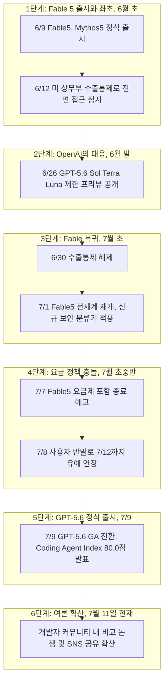

## 관련글

[**Claude Code Opus 4.x와 Fable 5로 작업한 내용들을 Codex GPT-5.6-Sol로 재검토하는 중입니다. Claude Code 개발 스타일의 문제점이 그대로 드러나네요**](https://www.facebook.com/share/p/1FXUegkDKL/)

---

## 목차
1. 이 문서의 목적과 원문 게시물 개요
2. 원문 게시물과 댓글 스레드 요약
3. 사건 타임라인: Fable 5 출시부터 현재까지
4. Claude Fable 5의 롤러코스터 — 출시, 수출통제, 재개, 종량제 전환
5. GPT-5.6 Sol과 Codex — 무엇이 새로 나왔는가
6. 벤치마크로 본 두 모델의 실제 격차
7. 게시물 주장에 대한 사실관계 검토 — 사실과 의견의 구분
8. "토큰 맥싱"과 Context Compact 비용 논란의 실체
9. 하네스 엔지니어링 관점에서 본 시사점
10. 종합 정리
11. 참고 자료

---

## 1. 이 문서의 목적과 원문 게시물 개요

공유해 주신 페이스북 게시물은 Byeongho Kang이라는 작성자가 올린 글과 그에 달린 댓글들로 구성되어 있습니다. 핵심 내용은 두 가지 갈래로 나뉩니다. 첫째, Claude Code(Opus 4.x, Fable 5 포함)로 작업한 결과물을 OpenAI의 Codex(GPT-5.6-Sol)로 재검토했더니 결함이 다수 발견되었다는 실무 경험담입니다. 둘째, Anthropic이 Fable 5를 구독 요금제에서 분리해 종량제(사용량 크레딧)로 전환하려는 정책에 대한 강한 반감입니다. 댓글에서는 "Fable 5 재출시 시점에 Opus 4.8 성능을 일부러 낮춰 Fable 5 구매를 유도한 것 아니냐"는 의혹도 제기됩니다.

이 문서는 이 게시물이 다루는 사건들을 웹 검색을 통해 하나하나 대조하면서, 어떤 부분이 공식적으로 확인된 사실이고 어떤 부분이 작성자 개인의 주관적 경험이나 추측인지를 명확히 구분해 정리한 것입니다. AI 업계 소식을 다루는 특성상 하루하루 상황이 바뀔 수 있으므로, 본 문서는 2026년 7월 11일 기준으로 확인 가능한 정보를 반영했습니다.

---

## 2. 원문 게시물과 댓글 스레드 요약

작성자 Byeongho Kang은 업무 중 Claude Code로 만든 결과물을 Codex GPT-5.6-Sol로 다시 검토하는 과정에서 문제점을 다수 발견했다고 밝힙니다. 그는 "Claude Code 결과물은 검수 없이 절대 신뢰해서는 안 된다"는 원칙을 세우게 된 계기로, 실무에서 검수되지 않은 결과물이 치명적이었던 경험을 언급합니다. 또한 Anthropic이 토큰 사용량을 줄이기 위한 여러 트릭을 쓰고 있다는 심증을 갖고 있었는데, Codex로 재검토하면서 그 심증이 확신으로 바뀌었다고 말합니다.

비용 측면에서는 Claude Code의 Context Compact(컨텍스트 압축) 기능을 사용할 때마다 상당한 비용이 청구되는 것에 대한 불만을 제기하며, 이 비용을 왜 사용자가 부담해야 하느냐고 반문합니다. 반면 Codex GPT-5.6-Sol은 토큰 소모량이 더 적고 속도도 빠르며 코드 품질과 작업 스타일도 더 낫다고 평가합니다. 마지막으로 Anthropic이 개인 사용자에게 Fable 5를 종량제로 판매하겠다고 한 것에 대해, "경쟁자가 생겼으니 안 사면 그만"이라는 태도를 보이며 당분간 Anthropic 제품을 쓰고 싶지 않다는 뜻을 밝힙니다.

댓글에서 Sungil Hwang은 경쟁 구도 자체를 긍정적으로 평가했고, 작성자는 이에 답하며 Fable 5 재출시 시점에 Opus 4.8 성능도 함께 낮춰 Fable 5 구매를 유도하는 전략이 아니냐는 의혹을 제기합니다. 이어서 노태운이라는 사용자가 이 문제를 "프롬프트나 설정 탓"으로 돌리는 사람들이 있지만 그냥 모델 자체가 안 좋은 것이라는 취지로 동의를 표합니다.

---

## 3. 사건 타임라인: Fable 5 출시부터 현재까지

아래는 Anthropic과 OpenAI 양측의 공식 발표, 그리고 신뢰할 수 있는 IT 매체 보도를 바탕으로 재구성한 시간순 흐름입니다.

이 타임라인에서 눈여겨볼 지점은, 두 회사의 신모델 출시 일정이 우연이라 보기 어려울 만큼 촘촘히 맞물려 있다는 것입니다. Fable 5가 수출통제로 발이 묶여 있던 6월 말, OpenAI는 정확히 그 공백을 틈타 GPT-5.6 프리뷰를 공개했고, Fable 5가 종량제 전환 유예를 받은 지 이틀 뒤인 7월 9일 GPT-5.6이 정식 출시되었습니다. 업계 매체 The New Stack은 Anthropic이 7월 9일 전체 사용자의 주간 사용한도를 리셋한 시점이 OpenAI의 GPT-5.6 출시와 겹친 것을 두고 "우연인지 의도된 것인지" 의문을 제기하기도 했습니다.

---

## 4. Claude Fable 5의 롤러코스터 — 출시, 수출통제, 재개, 종량제 전환

게시물에서 가장 감정적으로 다뤄진 대목이 바로 Fable 5의 요금 정책입니다. 이 부분은 오해의 소지가 있어 정확히 짚고 넘어갈 필요가 있습니다.

Fable 5는 2026년 6월 9일 Mythos 5와 함께 정식 출시되었습니다. 출시 당시 Anthropic은 Pro, Max, Team, 좌석 기반 Enterprise 요금제 사용자에게 6월 9일부터 6월 22일까지 별도 과금 없이 기존 요금제 한도 내에서 Fable 5를 사용할 수 있게 했습니다. 다만 이 무료 포함 기간은 사흘 만에 사실상 무산되었는데, 6월 12일 미국 상무부가 수출통제 조치를 내리면서 Fable 5와 Mythos 5에 대한 접근이 전면 차단되었기 때문입니다. 배경에는 아마존 소속 연구진이 방어적 검토를 가장해 실제로 작동하는 공격 코드를 생성하도록 모델을 유도할 수 있는 취약점을 발견했다는 사실이 있습니다. 이 통제는 6월 30일 해제되었고, Anthropic은 7월 1일 전 세계적으로 Fable 5 접근을 복원하면서 해당 취약점을 막기 위한 새로운 사이버보안 분류기를 함께 적용했습니다.

문제는 이 새 분류기가 다소 과민하게 반응한다는 점입니다. 여러 개발자들이 정상적인 코딩 요청임에도 이 분류기에 걸려 자동으로 Opus 4.8로 전환되는 경험을 보고했습니다. Anthropic 측은 이런 폴백이 발생하는 세션의 비율이 5% 미만이라고 밝혔지만, 긴 호흡의 에이전틱 작업 도중 모델이 중간에 바뀌는 것은 품질 문제라기보다 신뢰성 문제에 가깝다는 지적도 나옵니다. 이 부분은 게시물 작성자가 느낀 "품질 저하"의 실제 원인 중 하나일 가능성이 있습니다.

Fable 5는 원래 6월 9일 출시 시점부터 이미 API 기준 100만 토큰당 입력 10달러, 출력 50달러로 책정되어 있었고, 이는 Opus 4.8의 입력 5달러, 출력 25달러와 비교해 정확히 두 배입니다. 논란이 된 것은 구독 요금제 사용자에게 적용되던 "요금제 한도 내 무료 포함" 혜택이 종료되고 사용량 크레딧(종량제) 결제로 전환되는 시점입니다. 원래 계획대로라면 7월 7일 자정을 기해 Pro, Max, Team, Enterprise 사용자 모두 Fable 5를 쓰려면 별도의 사용량 크레딧을 충전해야 했습니다. 그러나 사용자들의 반발이 커지자 Anthropic은 7월 7일 마감 직전에 이 전환 시점을 7월 12일로 닷새 연장했습니다. 즉 게시물이 작성된 7월 11일 시점에는 아직 유예 기간 중이었고, 종량제 전환의 최종 시행 여부와 시점은 이 문서 작성 시점 기준으로 아직 확정되지 않은 상태입니다. Claude Code 엔지니어 Thariq Shihipar는 SNS에서 서버 용량이 충분해지면 Fable 5를 다시 표준 요금제에 포함시킬 수도 있다는 취지로 언급했지만, 확정된 일정은 없습니다.

정리하면, "Anthropic이 개인 사용자에게 Fable 5를 종량제로 팔려 한다"는 게시물의 서술은 사실에 부합합니다. 다만 이는 신규 정책이 아니라 애초 API 기준가로 설정되어 있던 요금이 구독 요금제 무료 포함 기간 종료 후 그대로 적용되는 구조이며, Anthropic 스스로도 사용자 반발 이후 전환 시점을 유예하는 등 조정 중이라는 점도 함께 고려할 필요가 있습니다.

| 항목 | Claude Opus 4.8 | Claude Fable 5 |
|---|---|---|
| 입력 단가(100만 토큰) | $5 | $10 |
| 출력 단가(100만 토큰) | $25 | $50 |
| 컨텍스트 윈도우 | 100만 토큰 | 100만 토큰 |
| 최대 출력 | 12.8만 토큰 | 12.8만 토큰 |
| 구독 요금제 포함 여부 | 표준 한도 내 포함 | 유예 기간 이후 사용량 크레딧 별도 결제 예정(2026-07-12부터, 변동 가능) |

---

## 5. GPT-5.6 Sol과 Codex — 무엇이 새로 나왔는가

OpenAI는 2026년 6월 26일 GPT-5.6 계열을 Sol, Terra, Luna 세 등급으로 나누어 제한된 프리뷰 형태로 처음 공개했습니다. 이 프리뷰는 미국 정부와의 조율 하에 소수의 신뢰 조직에게만 먼저 열렸는데, 이는 GPT-5.6 Sol이 사이버 보안 영역에서 상당한 성능 도약을 보였기 때문입니다. OpenAI는 Sol이 자사의 "Cyber Critical" 임계값은 넘지 않았다고 밝혔지만, 브라우저 취약점 평가에서 익스플로잇의 구성 요소를 스스로 찾아내는 능력을 보였다고 설명하며 단계적 배포 방침을 택했습니다.

이후 7월 9일, GPT-5.6 Sol, Terra, Luna는 ChatGPT, Codex, API 전반으로 정식 출시(GA)되었습니다. 이름 체계도 새로워졌는데, 숫자(5.6)는 세대를, Sol·Terra·Luna는 각자의 속도로 발전할 수 있는 성능 등급을 의미합니다. Sol은 최상위 플래그십, Terra는 GPT-5.5급 성능을 더 저렴하게 제공하는 모델, Luna는 가장 빠르고 저렴한 모델입니다. 가격은 100만 토큰 기준으로 Sol이 입력 5달러·출력 30달러, Terra가 입력 2.5달러·출력 15달러, Luna가 입력 1달러·출력 6달러입니다.

이와 함께 Codex 자체도 큰 변화를 겪었습니다. Codex는 ChatGPT 데스크톱 앱에 통합되었고, "Work"라는 새로운 기업용 에이전트도 함께 출시되었습니다. 7월 6일에는 OpenAI Codex 엔지니어링 리드 Thibaut Sottiaux가 최상위 등급인 Sol Ultra가 Codex 클라이언트 안에 탑재될 것이라고 공개적으로 확인했습니다. Sol Ultra는 여러 서브에이전트를 동시에 가동해 복잡한 작업을 처리하는 "ultra" 모드로, OpenAI는 기본적으로 4개의 에이전트를 병렬로 활용한다고 설명합니다.

---

## 6. 벤치마크로 본 두 모델의 실제 격차

게시물은 "Opus든 Fable이든 코드 퀄리티 정말 문제가 많았다"는 강한 어조로 결론을 내리지만, 실제 공개된 벤치마크 수치는 이보다 훨씬 근소한 격차를 보여줍니다. 이 부분이 이 문서에서 가장 중요하게 짚어야 할 지점입니다.

OpenAI가 자체 발표한 Artificial Analysis의 Coding Agent Index 기준으로 GPT-5.6 Sol은 80.0점을 기록해 새로운 최고 기록을 세웠다고 밝혔는데, 이는 Fable 5보다 2.8점 높은 수치입니다. 역산하면 Fable 5는 약 77.2점 수준으로, 100점 만점 지표에서 2.8점 차이는 결정적 우위라기보다는 근소한 우위에 가깝습니다. 같은 발표에서 OpenAI는 Sol이 이 점수를 달성하면서 출력 토큰은 절반 이하, 소요 시간도 절반 이하, 비용은 약 3분의 1 수준이었다고 주장했습니다. 즉 OpenAI가 실제로 강조하는 강점은 "압도적인 코드 품질 격차"가 아니라 "비슷하거나 근소하게 앞서는 품질을 훨씬 적은 토큰과 비용으로 달성한다"는 효율성 쪽에 가깝습니다. Artificial Analysis의 별도 Intelligence Index에서는 Sol이 Fable 5와 1점 이내 차이로 거의 동급으로 평가되었고, 다만 작업 완료 속도가 61% 빠르고 비용은 절반 수준이었다는 것이 OpenAI 측 설명입니다.

업계 반응도 엇갈립니다. AI 뉴스 큐레이션 매체 AINews(Latent Space)는 여러 분석가들의 반응을 정리하면서, 일부는 Sol을 Fable와 "대체로 동급"으로 평가했을 뿐 결정적으로 앞선다고 보지는 않았다고 전했습니다. 반면 비용 효율성 자체를 실질적 승부처로 본 분석가들도 있었습니다. 또한 GPT-5.6 Sol이 정식 출시된 지 불과 이틀 뒤인 7월 11일 현재는, 독립적인 개발자들이 충분한 시간을 두고 실제 프로젝트에 적용해 본 광범위한 후기가 아직 축적되지 않은 초기 단계라는 점도 고려해야 합니다. 실제로 GPT-5.6 Sol을 다룬 한 리뷰 기사는 프리뷰 단계에서의 벤치마크 수치에 대해 "신뢰성 문제가 문서화되어 있다"고 지적하며, 진짜 의미 있는 독립적 비교 평가는 아직 존재하지 않는다고 평가했습니다.

과거 세대인 Opus 4.7~4.8과 GPT-5.5를 비교한 여러 개발자 커뮤니티 리뷰에서는 일관되게 흥미로운 패턴이 나타납니다. 500명 이상의 개발자를 대상으로 한 한 설문에서는 응답자의 65%가 일상적으로는 Codex를 선호했지만, 블라인드 방식으로 결과물의 코드 품질만 평가했을 때는 응답자의 67%가 Claude Code의 코드를 더 깔끔하고 관용적이라고 평가했습니다. 즉 "체감 선호도"와 "코드 품질"이 서로 다른 결과를 보인 사례가 이미 존재합니다. 또 다른 실사용 후기에서는 Codex가 압축이나 컨텍스트 손실이 발생했을 때 이전 세션의 맥락을 완전히 잃어버리는 반면, Claude Code는 압축 이후에도 이전에 해결한 문제를 기억해 재활용하는 사례가 보고되기도 했습니다. 이는 "Claude Code가 무조건 대충 만든다"는 단정과는 결이 다른, 작업 유형에 따라 강점이 갈리는 그림을 보여줍니다.

| 지표 | Claude Fable 5 | GPT-5.6 Sol |
|---|---|---|
| Artificial Analysis Coding Agent Index | 약 77.2점(추정, Sol 대비 2.8점 낮음) | 80.0점(신규 최고 기록) |
| Artificial Analysis Intelligence Index | 기준점 | Fable 5 대비 1점 이내 차이 |
| 상대적 출력 토큰량 | 기준점 | Sol이 절반 이하 |
| 상대적 소요 시간 | 기준점 | Sol이 절반 이하 |
| 상대적 비용 | 기준점 | Sol이 약 3분의 1 수준 |
| 컨텍스트 윈도우 | 100만 토큰 | 약 105만 토큰 |

이 수치들은 모두 OpenAI 측이 자사 발표에서 공개한 것으로, 제3자 독립 검증을 거친 확정적 수치가 아니라 벤더가 제시한 벤치마크라는 한계가 있다는 점도 함께 밝혀둡니다.

---

## 7. 게시물 주장에 대한 사실관계 검토 — 사실과 의견의 구분

게시물과 댓글에 담긴 주장들을 하나씩 검증된 사실과 확인되지 않은 의견으로 나누어 정리하면 다음과 같습니다.

**확인된 사실인 부분**
- Fable 5가 구독 요금제에서 분리되어 종량제로 전환되는 절차가 실제로 진행 중이라는 점은 사실입니다. 다만 최종 전환 시점은 이미 한 차례 연기되었고 이 문서 작성 시점에도 유동적입니다.
- GPT-5.6 Sol이 공개된 벤치마크에서 Fable 5보다 근소하게 앞서고, 토큰 효율과 비용 면에서는 확실한 우위를 보인다는 점은 OpenAI의 공식 발표를 통해 확인됩니다.
- Fable 5가 재개된 이후 적용된 신규 보안 분류기가 일부 정상적인 코딩 요청까지 차단하며 Opus 4.8로 자동 전환시키는 부작용이 있다는 점은 여러 매체를 통해 확인됩니다.
- Claude Code에서 과거(2026년 3~4월) 실제로 컨텍스트 캐싱 관련 버그가 발생해 품질 저하와 사용한도 소모 증가를 유발했고, Anthropic이 이를 공식 포스트모템으로 인정한 사례가 있습니다.

**확인되지 않은 추측인 부분**
- "Fable 5 재출시 시점에 Opus 4.8 성능을 의도적으로 낮춰 Fable 5 구매를 유도했다"는 주장을 뒷받침하는 공식 자료나 독립적인 벤치마크 근거는 찾을 수 없었습니다. 이는 댓글 작성자의 개인적인 추정이며, 사실로 단정할 근거가 없는 부분입니다.
- "Anthropic이 토큰 사용량을 아끼기 위한 트릭을 의도적으로 쓴다"는 주장 역시, 앞서 언급한 컨텍스트 캐싱 버그처럼 실제 품질 저하를 유발한 기술적 결함 사례는 존재하지만, 이것이 "의도된 전략"이었다는 근거는 확인되지 않았습니다. Anthropic 공식 포스트모템에서는 이를 지연 시간 단축을 위한 최적화 과정에서 발생한 버그로 설명하고 있으며, 이 설명에 대한 회의적 시각(비용 절감이 진짜 목적이 아니냐는 추측) 역시 개발자 커뮤니티에 존재하지만, 그 또한 추정의 영역입니다.
- "Codex GPT-5.6-Sol이 Fable 5보다 훨씬 낫다"는 전면적 결론은, 실제 공개된 벤치마크상의 격차(100점 만점에 2.8점, 지능 지수 기준 1점 이내)와 비교하면 다소 과장된 표현입니다. 두 모델은 근소한 차이 또는 거의 동급으로 평가되며, Sol의 명확한 우위는 품질보다는 속도와 비용 효율성 쪽에 있다는 것이 다수 분석의 공통된 결론입니다.

---

## 8. "토큰 맥싱"과 Context Compact 비용 논란의 실체

게시물에서 가장 구체적으로 언급된 불만은 Context Compact(컨텍스트 압축) 기능 사용 시 발생하는 비용입니다. 이 부분은 실제로 개발자 커뮤니티에서 폭넓게 논의되는 주제이므로 조금 더 자세히 짚어볼 가치가 있습니다.

Claude Code의 구조상, 세션이 진행되는 동안 CLAUDE.md 파일, 도구 호출 기록, 읽어들인 파일 내용, 이전 응답 등 누적된 모든 맥락이 매 턴마다 다시 전송되며 입력 토큰으로 과금됩니다. 이는 Claude Code만의 특이한 설계가 아니라 트랜스포머 기반 모델 전반의 구조적 특성이지만, 세션이 길어질수록 체감 비용이 눈에 띄게 늘어나는 것은 사실입니다. 컨텍스트가 한도의 약 85%에 도달하면 자동 압축(auto-compaction)이 발동해 대화 기록을 요약본으로 대체하는데, 이 과정에서 도구 호출의 세부 내용이나 앞서 설정한 제약 조건의 정확한 문구가 요약 속에서 손실될 수 있다는 점이 실제 문제로 지적됩니다.

더 나아가 2026년 3~4월 사이에는 실제로 품질 저하를 유발한 버그가 있었습니다. Anthropic은 유휴 상태로 한 시간 이상 방치된 세션에서 캐시 미스가 어차피 발생할 것이므로 지연 시간을 줄이기 위해 오래된 사고(thinking) 구간을 정리하는 최적화를 도입했는데, 여기에 버그가 있어 이 정리 작업이 세션 내내 매 턴마다 반복 실행되는 문제가 발생했습니다. 그 결과 모델이 자신이 왜 현재 방식을 택했는지에 대한 기억을 점점 잃어가는 현상이 나타났고, 이는 캐시 미스를 유발해 사용한도가 예상보다 빨리 소진되는 부작용으로 이어졌습니다. Anthropic은 이 문제를 포함한 세 가지 별개의 제품 계층 이슈를 4월 20일자 버전에서 모두 해결했다고 공식적으로 밝힌 바 있습니다. 다만 해커뉴스 등 개발자 커뮤니티에서는 이 최적화의 진짜 동기가 "지연 시간 단축"이 아니라 "유휴 세션의 비용 절감"이었을 것이라는 회의적 반응도 있었는데, 이 역시 공식적으로 확인된 사실이 아니라 커뮤니티의 해석입니다.

결론적으로, "컨텍스트 압축 비용이 부담스럽다"는 불만 자체는 다수의 실사용자들이 공감하는 실제 현상이며 근거 없는 이야기가 아닙니다. 다만 이것이 "품질을 의도적으로 낮춰 비용을 아끼려는 전략"이었는지, 아니면 대규모 컨텍스트 윈도우를 지원하는 과정에서 불가피하게 따라오는 엔지니어링 난제이자 실제 버그의 결과였는지는 별개의 문제이며, 현재까지 공개된 자료로는 후자, 즉 "의도적 저품질화"보다는 "복잡한 시스템에서 발생한 결함과 최적화 부작용"이라는 설명 쪽이 더 근거가 탄탄합니다.

---

## 9. 하네스 엔지니어링 관점에서 본 시사점

이 논쟁을 하네스 엔지니어링(모델을 둘러싼 컨텍스트 관리, 도구 연동, 오케스트레이션 설계 전반)의 관점에서 바라보면 또 다른 층위의 해석이 가능합니다.

먼저, Claude Code와 Codex 양쪽 모두에서 나타나는 공통된 패턴은 "결과물의 품질이 모델 자체의 지능보다 하네스의 설계와 운영 방식에 더 크게 좌우된다"는 것입니다. 실제로 벤치마크상 Fable 5와 Sol의 지능 격차는 1점 안팎에 불과하지만, 체감 품질 차이가 크게 느껴지는 이유는 각 도구가 컨텍스트를 관리하는 방식, 압축 시점의 정보 손실 정도, 안전 분류기의 오탐률처럼 모델 바깥의 하네스 계층에서 발생하는 차이일 가능성이 높습니다. 이는 "모델을 바꾼다고 근본적인 문제가 해결되지 않을 수 있다"는 하네스 우선 원칙과도 정확히 맞닿아 있는 지점입니다.

둘째, "검수 없이는 Claude Code 결과물을 신뢰하면 안 된다"는 작성자의 원칙 자체는, 모델의 종류와 무관하게 성숙한 AI 활용 조직이라면 가져야 할 태도로서 타당합니다. 다만 이 원칙은 Codex를 포함한 모든 코딩 에이전트에 동일하게 적용되어야 하는 원칙이지, 특정 모델에만 국한된 결함으로 해석하는 것은 근거가 약합니다. 실제로 GPT-5.6 Sol 역시 아직 정식 출시된 지 이틀밖에 지나지 않아 독립적인 장기 검증이 축적되지 않은 상태입니다.

셋째, 요금 정책 변동성(Fable 5의 반복적인 무료-유료 전환, 수출통제로 인한 접근 정지, 서비스 재개 후 분류기 오탐 등)은 하네스 설계에 있어 "모델 가용성 자체가 하나의 리스크 요인"이라는 점을 다시금 보여줍니다. 특정 벤더나 특정 모델 한 종류에 전적으로 의존하는 파이프라인은, 이번 사례처럼 정치적·규제적 요인이나 요금 정책 변경만으로도 운영에 차질을 겪을 수 있습니다. 여러 모델을 상황에 맞게 조합하는 멀티 모델 하네스 설계가 실무적으로 더 안정적인 선택지가 될 수 있다는 점을 이번 사례가 보여줍니다.

---

## 10. 종합 정리

이 게시물은 실무자의 생생한 경험담과 Anthropic의 요금 정책에 대한 정당한 불만을 담고 있지만, 몇 가지 핵심 주장은 공개된 벤치마크 데이터나 공식 자료로 뒷받침되기보다는 개인적 추정에 가깝습니다. 정리하면 다음과 같습니다.

- Fable 5의 종량제 전환은 실제로 진행 중인 사실이지만, 아직 최종 확정된 상태는 아니며 이미 한 차례 유예된 바 있습니다.
- GPT-5.6 Sol이 Fable 5보다 코딩 벤치마크에서 근소하게 앞서고 비용·속도 효율성에서 뚜렷하게 앞선다는 것은 사실이지만, "코드 퀄리티가 훨씬 낫다"는 표현이 뒷받침할 만큼 격차가 크지는 않습니다.
- Anthropic이 Opus 4.8 성능을 의도적으로 낮췄다는 주장이나, 토큰 절약을 위해 의도적으로 품질을 낮춘다는 주장은 현재까지 확인된 근거가 없는 추측입니다. 다만 과거 실제로 발생했던 컨텍스트 캐싱 버그처럼, 비용 최적화 과정에서 품질에 부정적 영향을 준 실제 사례는 존재합니다.
- Context Compact로 인한 비용 부담은 실제 사용자들이 폭넓게 공감하는 현상이며, 근거 없는 불만이 아닙니다.

두 진영의 코딩 에이전트는 각각 강점과 약점을 가진 현재진행형 경쟁 구도에 있으며, 어느 한쪽이 압도적으로 우월하다고 단정하기에는 아직 이르다는 것이 이 문서가 확인한 자료들의 공통된 결론입니다.

---

## 11. 참고 자료

- OpenAI, "Previewing GPT-5.6 Sol: a next-generation model" (openai.com)
- OpenAI, "GPT-5.6: Frontier intelligence that scales with your ambition" (openai.com)
- TechCrunch, "OpenAI launches its new family of models with GPT-5.6" (2026-07-09)
- TestingCatalog, "OpenAI launches GPT-5.6 Sol, Terra, and Luna on apps and API" (2026-07-09)
- 9to5Mac, "OpenAI unveils ChatGPT Work agent, GPT-5.6 models now available" (2026-07-09)
- WindowsReport, "OpenAI Expands GPT-5.6 Access Across ChatGPT, Codex, and API"
- AINews(Latent Space), "OpenAI launches GPT 5.6 Sol/Terra/Luna, Codex becomes ChatGPT superapp"
- TechTimes, "GPT-5.6 Sol Review: Faster Coding, Half Fable 5 Cost, and a Benchmark Problem" (2026-07-07)
- Vertu, "GPT-5.6 Sol Ultra in Codex (July 6, 2026 Update)"
- AndroidHeadlines, "Anthropic's Claude Fable 5 Now Requires Pay-Per-Use—Even for Pro Subscribers"
- The New Stack, "Anthropic gives Claude subscribers five more days with Fable 5"
- Android Authority, "Fable 5's second act on Claude ends today, unless you're willing to pay more"
- ClaudeFa.st, "Claude Fable 5 Price: Is It Free, Usage Credits, and Access"
- DigitalApplied, "Claude Fable 5 Pricing: The July 7 Usage-Credits Switch"
- TygartMedia, "Claude Fable 5 Pricing and Access (2026)"
- Anthropic 공식 발표, "fable-mythos-access" (anthropic.com/news)
- InfoQ, "Anthropic Traces Six Weeks of Claude Code Quality Complaints to Three Overlapping Product Changes" (2026-05-14)
- HackerNoon, "Navigating Claude Code: The Context Window Tax"
- Anthropic Claude Code 공식 문서, "Manage costs effectively"
- CatDoes, Composio, AIVY 등 Claude Code vs Codex 비교 리뷰 다수

---

작성일자: 2026-07-11
