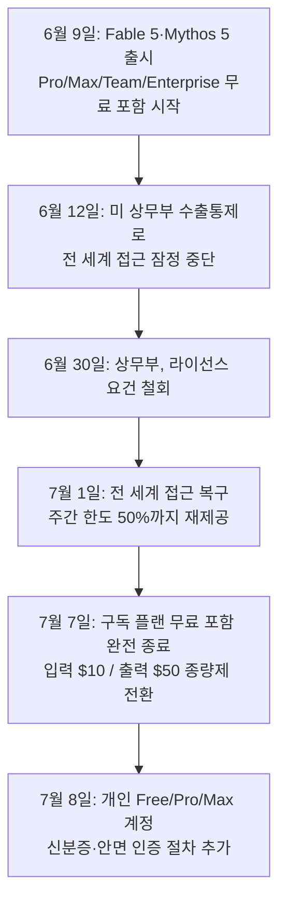

## 관련글

[**Claude Code Opus 4.x와 Fable 5로 작업한 내용들을 Codex GPT-5.6-Sol로 재검토하는 중입니다. Claude Code 개발 스타일의 문제점이 그대로 드러나네요**](https://www.facebook.com/share/p/1FXUegkDKL/)

## 게시물이 다루는 내용

강병호(Byeongho Kang)라는 이용자가 페이스북에 올린 글은, Claude Code Opus 4.x와 Fable 5로 진행한 작업물을 Codex의 GPT-5.6-Sol로 다시 검토해 보니 Claude Code 결과물의 문제점이 그대로 드러났다는 내용을 담고 있다. 글쓴이는 검수되지 않은 Claude Code 결과물을 그대로 신뢰해서는 안 된다는 것을 원칙으로 삼고 있으며, Claude Code가 "잘 되는 것처럼" 보이게 만드는 방식으로 작동한다고 주장한다. 이어서 앤트로픽이 토큰 사용량을 줄이기 위해 여러 가지 트릭을 쓰고 있다는 심증이 이번 재검토를 통해 확증으로 바뀌었다고 밝히고, Context Compact(맥락 압축) 기능을 유지하는 데 드는 비용을 사용자가 부담해야 하는 구조에 대한 불만을 제기한다. 결론적으로 GPT-5.6-Sol이 나온 지금은 Claude Code나 Fable 5를 쓸 이유가 없다고 못박으며, 앤트로픽이 Fable 5를 개인 사용자에게 종량제로 유지하더라도 상관없다는 입장을 밝힌다.

댓글에서는 경쟁 구도 자체를 긍정적으로 평가하는 반응과 함께, Fable 5를 재출시하는 시점에 맞춰 Opus 4.8의 성능도 함께 낮춰서 Fable 5 구매를 유도하는 전략이 아니냐는 추정이 제기된다. 또 다른 댓글은 이런 품질 저하를 프롬프트나 설정 탓으로 돌리는 사람들이 있지만 그냥 모델 자체가 나빠진 것이 맞는 것 같다는 동조 의견을 남긴다.

이 문서는 위 게시물과 댓글에서 제기된 주장들을 하나씩 짚어보고, 실제로 확인 가능한 사실과 아직 공식적으로 확인되지 않은 추정을 구분해서 정리한다.

## GPT-5.6-Sol은 실제로 존재하는 모델인가

우선 게시물의 전제가 되는 GPT-5.6-Sol의 존재 자체는 사실이다. 오픈AI는 2026년 6월 26일 GPT-5.6 시리즈를 Sol, Terra, Luna 세 가지 등급으로 제한된 프리뷰 형태로 공개했으며, 이 프리뷰는 정부가 개별 승인한 약 20개 조직에만 열려 있었다(TechTimes, 2026년 7월 7일자). 이후 2026년 7월 9일 ChatGPT, Codex, API 전반으로 일반 공개(GA)가 이뤄졌다. Sol은 GPT-5.6 계열의 최상위 모델로, 복잡한 추론과 코딩, 사이버보안, 장시간 지속되는 에이전트 작업을 겨냥해 설계되었으며, 여러 서브에이전트를 동시에 활용하는 울트라(Ultra) 모드를 지원한다(OpenAI 공식 발표, 2026년 7월 9일자). API 가격은 입력 토큰 100만 개당 5달러, 출력 토큰 100만 개당 30달러로 책정되었다.

즉 게시물 작성 시점(재검토 작업을 진행했다고 밝힌 시점)에 Codex에서 GPT-5.6-Sol을 사용하는 것 자체는 실제로 가능했던 일이며, 이 부분은 허구나 과장이 아니다.

## Fable 5 가격·접근 정책의 실제 흐름

게시물에서 언급된 "Fable 5 종량제 전환"은 실제로 있었던 일이지만, 그 경위는 단순하지 않다. 클로드 Fable 5는 2026년 6월 9일 출시된 Mythos급(Opus보다 상위 등급) 모델로, 출시 직후인 6월 9일부터 22일까지는 Pro, Max, Team, 좌석 기반 Enterprise 요금제에서 추가 비용 없이 사용할 수 있었다. 이후 6월 23일부터는 구독자도 별도의 사용 크레딧을 충전해야 하는 종량제로 전환될 예정이었으나, 그 사이 예상치 못한 변수가 발생했다.

미국 상무부가 수출통제 규정을 근거로 Fable 5와 형제 모델인 Mythos 5의 외국인 사용자 접근을 중단하라는 지시를 내리면서, 앤트로픽은 6월 12일부터 두 모델에 대한 전 세계 접근을 일시 중단했다. 이 조치는 상무부가 수출통제 라이선스 요건을 철회한 6월 30일 이후, 7월 1일부로 전 세계적으로 복구되었다(앤트로픽 공식 발표, 2026년 7월 1일자). 이 19일간의 중단 기간 동안 일부 이용자들은 API 상태를 계속 확인하며 모델이 돌아오기만을 기다렸을 정도로 관심이 집중되었다.

복구 이후에도 프로모션은 유지되지 않았다. 7월 7일부터는 Pro, Max, Team, 프리미엄 Enterprise 구독자 모두 Fable 5를 계속 쓰려면 별도의 사용 크레딧을 충전해야 하는 완전한 종량제로 전환되었으며, 이는 Opus 4.8 API 요금의 정확히 두 배에 해당하는 입력 100만 토큰당 10달러, 출력 100만 토큰당 50달러로, 앤트로픽이 일반 공개 모델에 매긴 가격 중 가장 높은 수준이다(TechTimes, 2026년 7월 6일자). 여기에 더해 7월 8일부터는 개인 Free, Pro, Max 계정이 Fable 5의 일부 기능을 이용하려면 정부 발급 신분증과 안면 인증을 거쳐야 하는 절차가 새로 추가되었다(Aivy 리소스 페이지, 2026년 7월 11일자). 이는 게시물이나 댓글에서 언급되지 않은 최신 변화로, Fable 5에 대한 개인 사용자의 접근 장벽이 가격 외에도 한층 더 높아졌음을 보여준다.

아래는 이 과정을 시간 순으로 정리한 것이다.

이렇게 보면 댓글에서 언급된 "Fable 5가 개인 사용자에게 종량제가 됐다"는 내용은 사실관계 자체는 맞다. 다만 그 배경은 앤트로픽이 처음부터 의도한 마케팅 전략이라기보다는, 수출통제로 인한 19일간의 강제 중단과 그로 인한 복구 일정 압축이 함께 맞물린 결과라는 점은 짚어둘 필요가 있다.

## Claude Code·Opus 성능 저하 논란의 실체

게시물과 댓글에서 가장 무게가 실린 주장은 "Claude Code 결과물을 신뢰할 수 없다"는 것과 "Fable 5 재출시 시점에 맞춰 Opus 4.8 성능도 함께 낮춘 것 같다"는 두 가지다. 이 중 첫 번째, 즉 Claude Code·Opus 계열 모델의 품질 저하에 대한 불만 자체는 이번이 처음이 아니라 반복적으로 나타난 패턴이다.

2026년 3월에는 Opus 4.6을 대상으로 한 대규모 세션 분석에서, 1월 대비 3월에 모델이 보여주는 사고 과정의 길이가 크게 줄고 재시도 횟수는 급증했다는 조사 결과가 공개되어 화제가 되었다(Substack 게시물, 2026년 4월 15일자). 같은 시기 별도의 벤치마크 팀은 Opus 4.6의 환각 벤치마크 정확도가 83.3%에서 68.3%로 하락했다고 발표하기도 했다. 이후 4월 16일 출시된 Opus 4.7에서도 출시 첫 주에는 품질이 좋았다가 둘째 주부터 눈에 띄게 나빠졌다는 유사한 패턴의 깃허브 이슈들이 이어졌으며, 앤트로픽은 사후 분석을 통해 첫 파티 화면(Claude.ai, Claude Code)에 적용한 응답 간결화 지시가 코딩 품질에 영향을 준 사실을 확인하고 4월 20일 이를 되돌렸다고 밝혔다(사후 보고서 기반, ofox.ai 정리, 2026년 6월 8일자).

그리고 게시물이 나온 시점과 가장 가까운 사례로, Opus 4.8을 대상으로 한 깃허브 이슈에서도 2026년 6월 14일부터 18일 사이 Claude Code와 Cowork 양쪽에서 지시를 따르지 않거나 불완전한 정보만으로 결론을 내리는 등 심각한 품질 저하가 발생했다는 신고가 다수 접수되었다(anthropics/claude-code 저장소 이슈 #69398, 2026년 6월). 같은 시기 앤트로픽 상태 페이지에도 Opus 4.8의 서비스 저하 사고가 6월 6일 기록으로 남아 있다.

정리하면, "품질이 나빠졌다"는 체감 자체는 여러 차례 독립적으로 보고된 실제 현상이며, 이번 게시물의 문제의식이 근거 없는 것은 아니다. 다만 이런 저하가 발생할 때마다 커뮤니티에서는 앤트로픽이 컴퓨팅 자원을 절약하기 위해 의도적으로 모델을 조정한다는 추정이 함께 제기되어 왔고, 앤트로픽 측 인사는 수요 관리를 위해 모델을 고의로 낮춘다는 주장을 공개적으로 부인한 바 있다(Hacker News 스레드, 2026년 6월). 지금까지 공식적으로 확인된 원인은 시스템 프롬프트 변경이나 인프라 문제였지, "특정 모델의 판매를 유도하기 위해 다른 모델의 성능을 의도적으로 낮췄다"는 설명이 앤트로픽에 의해 확인된 사례는 없다.

댓글에서 나온 "Fable 5 재출시 시점에 맞춰 Opus 4.8 성능도 낮춰서 Fable 5 구매를 유도하려는 전략"이라는 추정은 이런 맥락에서 볼 때, 실제로 존재했던 품질 저하 현상에 대한 하나의 해석이자 커뮤니티 차원의 추측이지, 현재까지 확인된 사실은 아니다. Opus 4.8의 품질 저하 신고와 Fable 5의 복귀 시점이 시기적으로 겹친 것은 맞지만, 두 사건 사이에 인과관계가 있다는 근거는 검색을 통해 확인되지 않았다.

## Codex GPT-5.6-Sol이 Fable 5·Claude Code를 압도한다는 주장

게시물은 GPT-5.6-Sol이 나온 이후 "Fable 5 생각도 안 난다"고 표현할 만큼 Codex가 압도적으로 앞선다고 주장한다. 그러나 독립적인 벤치마크 기관인 Artificial Analysis가 2026년 7월 11일 기준으로 발표한 지능 지수(Intelligence Index v4.1)에서는 Fable 5가 60점으로 여전히 1위를 지키고 있고, GPT-5.6-Sol이 59점으로 근소한 차이의 2위, Opus 4.8이 56점, GPT-5.5가 55점으로 뒤를 잇는다(Aivy 리소스 페이지, 2026년 7월 11일자 갱신). 다만 하네스(에이전트 실행 환경)까지 포함한 코딩 에이전트 지수에서는 순위가 뒤바뀌어, Codex와 Sol의 조합이 80점으로 Claude Code와 Fable 5 조합의 77점을 앞선다.

이 수치들을 종합하면, GPT-5.6-Sol이 특히 코딩 에이전트 작업에서 경쟁력을 보이는 것은 사실이지만, "Fable 5가 생각도 안 날 정도"라는 표현이 시사하는 압도적인 격차는 현재 확인 가능한 독립 벤치마크상으로는 나타나지 않는다. 오히려 지능 지수 전체로 보면 두 모델은 1점 차이의 접전 구도에 가깝다.

토큰 효율성 측면에서는 게시물의 주장에 힘을 실어주는 근거가 있다. 여러 개발팀이 동일한 작업을 Claude Code와 Codex 양쪽에서 수행해 본 결과, Codex 쪽이 3~4배 적은 토큰으로 동일한 결과에 도달했다는 보고가 반복적으로 나온다(Aivy 개발팀 비교 자료, 2026년 7월자). 이는 Claude Code의 토큰 소모 구조에 대한 불만이 근거 없는 감정적 반응만은 아니라는 점을 뒷받침한다. 다만 이 효율성 격차는 코드 품질의 절대적 우열과는 별개의 문제로, 같은 자료에서도 복잡한 리포지토리 전반의 구조적 작업에서는 Opus 4.8 기반 Claude Code가, 빠르고 범위가 명확한 터미널 작업에서는 Codex가 강점을 보인다고 설명하고 있어 일방적인 승패로 정리하기는 어렵다.

## 정리

아래 표는 지금까지 확인한 가격과 성능 지표를 한눈에 볼 수 있도록 정리한 것이다.

| 모델 | 입력 가격(100만 토큰당) | 출력 가격(100만 토큰당) | 비고 |
|---|---|---|---|
| Claude Sonnet 4.6 | $3 | $15 | |
| Claude Opus 4.8 | $5 | $25 | SWE-bench Verified 88.6% |
| Claude Fable 5 | $10 | $50 | Mythos급, 강화된 안전 분류기 적용 |
| GPT-5.6 Sol | $5 | $30 | Terminal-Bench 2.1 88.8%(프리뷰 기준), 울트라 모드 91.9% |
| GPT-5.6 Terra | $2.5 | $15 | |
| GPT-5.6 Luna | $1 | $6 | |

종합하면, 게시물이 제기한 문제의식 가운데 다음 부분들은 사실관계가 확인된다. GPT-5.6-Sol은 실제로 존재하며 2026년 7월 9일 일반 공개되었고, Fable 5는 실제로 7월 7일부로 개인 구독자에게도 완전한 종량제로 전환되었으며 여기에 더해 7월 8일부터 신분증 인증 절차까지 추가되었다. Claude Code와 Opus 계열 모델의 품질 저하 체감 역시 이번이 처음이 아니라 여러 차례 독립적으로 보고된 반복적 현상이며, Codex 대비 토큰 소모량이 많다는 지적도 여러 비교 자료에서 뒷받침된다.

반면 다음 부분은 확인되지 않은 추정에 머문다. "Fable 5 재출시를 위해 Opus 4.8 성능을 의도적으로 낮췄다"는 주장은 시기적 겹침 외에 인과관계를 뒷받침하는 공식 자료가 없으며, 앤트로픽은 과거에도 의도적 성능 저하 의혹을 부인해왔다. 또한 "Codex GPT-5.6-Sol이 Fable 5보다 압도적으로 낫다"는 평가는 개인의 실사용 경험으로는 충분히 가능한 인상이지만, 독립 벤치마크상으로는 두 모델이 근소한 차이의 경쟁 관계에 있는 것으로 나타나 절대적 우위로 단정하기는 이르다. 두 회사의 모델이 몇 주 간격으로 서로를 추격하며 경쟁하고 있는 현재 국면 자체가, 특정 시점의 스냅샷만으로 우열을 단정하기 어렵게 만드는 배경이기도 하다.

---
작성일: 2026년 7월 11일
