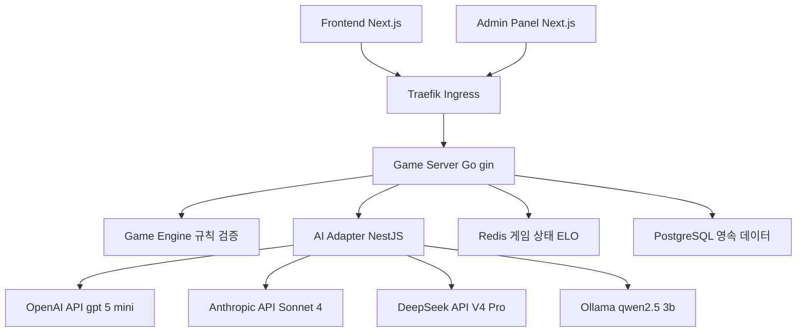
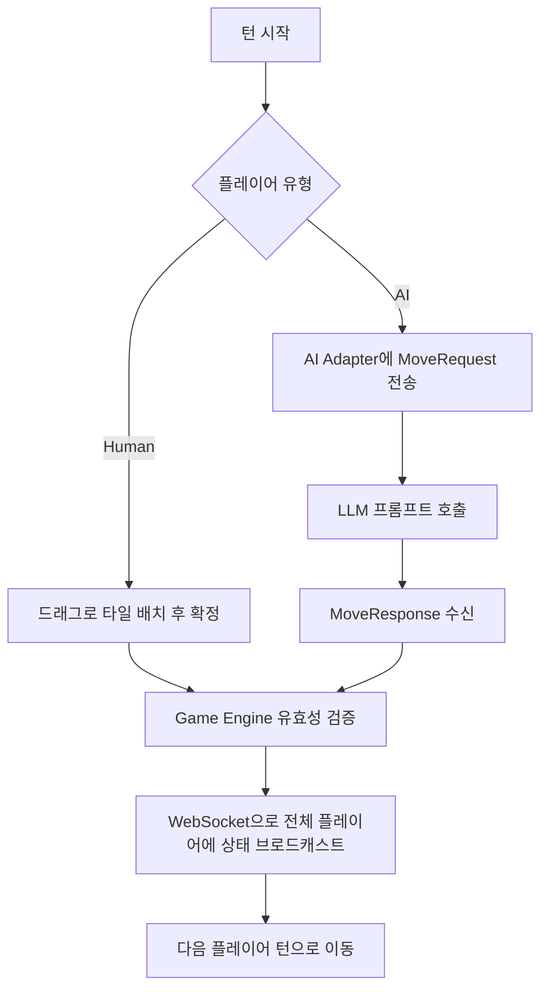
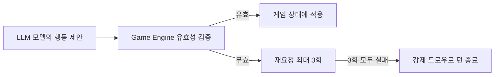

>- 대상 저장소: https://github.com/k82022603/RummiArena
>- 작성 근거: 저장소 내 README.md, docs/01-planning/01-project-charter.md, docs/02-design/01-architecture.md, docs/02-design/06-game-rules.md, docs/07-closure/01-project-closure-report.md 등 저장소에 실제로 존재하는 문서 원문을 직접 조회하여 작성했습니다. GitHub API를 통한 스타 수, 라이선스, 최신 커밋 시각 등 실시간 메타데이터는 조회 시점에 API 호출 제한(rate limit)에 걸려 확인하지 못했으며, 이 문서에는 포함하지 않았습니다. 아래 수치(테스트 통과 건수, LLM 대전 승률, 비용 등)는 모두 프로젝트 소유자가 저장소 문서에 자체적으로 기록해 둔 결과이며, 제3자가 독립적으로 재검증한 수치는 아니라는 점을 먼저 밝힙니다.

## 목차

1. 프로젝트 개요
2. 프로젝트 목적과 핵심 질문
3. 시스템 아키텍처
4. 기술 스택
5. 핵심 설계 원칙
6. 게임 규칙 설계
7. AI 캐릭터 시스템
8. LLM 대전 실험 결과
9. 스프린트 진행 이력
10. 테스트 및 품질 지표
11. 시스템 제약사항과 기술 부채
12. 프로젝트 회고
13. 참고 자료

---

## 1. 프로젝트 개요

RummiArena는 이스라엘 기원의 타일 기반 보드게임인 루미큐브(Rummikub)를 플랫폼으로 삼아, 서로 다른 대형 언어 모델(LLM)들이 이 게임을 얼마나 잘 플레이하는지 비교·분석하기 위해 만들어진 멀티 LLM 전략 실험 플랫폼입니다. Human 플레이어와 AI 플레이어가 2인에서 4인까지 혼합되어 실시간으로 대전할 수 있으며, OpenAI GPT, Anthropic Claude, DeepSeek, 그리고 로컬에서 구동되는 Ollama 기반 오픈소스 모델까지 총 네 종류의 LLM이 실제 대전에 투입되어 성능이 비교되었습니다.

저장소의 README에 따르면 이 프로젝트는 2026년 5월 10일 자로 공식 종료되었으며, 종료 시점 기준으로 Sprint 1부터 Sprint 7까지의 정규 개발 과정과 이후의 핫픽스 기간을 거쳐 총 2,462건의 자동화 테스트가 전부 통과한 상태로 마무리되었습니다. 단순한 게임 구현 실습이 아니라, 게임 서버부터 Kubernetes 배포, GitOps 기반 CI/CD, DevSecOps 보안 게이트까지 포함하는 SaaS 수준의 아키텍처로 설계되었다는 점이 특징입니다.

프로젝트 헌장 문서에는 프로젝트 유형이 "내부 AI 실험 프로젝트(외부 서비스 수준 설계)"로 명시되어 있고, 개발 기간은 2026년 3월 8일부터 시작해 2주 단위 스프린트로 진행되었습니다. 실제 종료는 애초 목표했던 2026년 8월 15일(Sprint 9)보다 훨씬 이른 5월 10일에 이루어졌는데, 이는 핵심 실험 목표였던 LLM 대전 비교와 기반 아키텍처 구축이 Sprint 7과 핫픽스 단계에서 충분히 달성되었다고 판단해 프로젝트를 조기 마무리했기 때문으로 보입니다. 다만 이 조기 종료의 구체적인 의사결정 배경까지는 종료 보고서에 명시적으로 서술되어 있지 않으므로, 이 부분은 추정임을 밝혀 둡니다.

## 2. 프로젝트 목적과 핵심 질문

프로젝트 종료 보고서는 이 프로젝트가 답하고자 했던 질문을 네 가지로 명확히 정리하고 있습니다. 첫째는 LLM이 규칙 기반 전략 게임을 얼마나 잘 플레이하는가라는 근본적인 물음이고, 둘째는 GPT, Claude, DeepSeek, Ollama 같은 서로 다른 LLM 모델들 사이에 전략적 차이가 실제로 존재하는가라는 비교 관점의 질문입니다. 셋째는 비용 대비 성능, 즉 달러당 게임 성능이 모델별로 어떻게 다른가라는 실용적인 질문이며, 넷째는 GPU 없이 로컬 CPU에서 추론하는 Ollama만으로도 의미 있는 수준의 게임 플레이가 가능한가라는 인프라 관점의 질문입니다.

이 프로젝트는 애벌레라는 닉네임을 쓰는 1인 개발자가 프로젝트 오너로서 전체 설계와 개발, 운영을 담당했고, 여기에 더해 Claude Code 기반의 AI 에이전트 13명(architect, go-dev, node-dev, frontend-dev, frontend-dev-opus, devops, qa, ai-engineer, game-analyst, designer, security, pm 등 역할별로 구분)이 협업하는 구조로 진행되었습니다. 종료 보고서의 회고 섹션에서는 이 13명의 AI 에이전트 팀이 약 2개월간 750건 이상의 커밋과 110건 이상의 설계 문서를 만들어냈다고 기록하고 있으며, "혼자 개발하는 사람 옆에서 13명의 AI가 함께 고민한다는 것이 가능하다는 것"을 이 프로젝트가 남긴 가장 중요한 발견으로 꼽고 있습니다.

## 3. 시스템 아키텍처

시스템은 클라이언트 레이어, 게이트웨이 레이어, 코어 서비스 레이어, 스토리지 레이어, LLM 레이어, DevOps 레이어의 여섯 개 층으로 구성되어 있습니다. 클라이언트 레이어는 Next.js로 만들어진 일반 사용자용 Frontend와 관리자용 Admin Panel로 나뉘고, 이들은 Traefik Ingress를 거쳐 Go 언어로 작성된 Game Server에 도달합니다. Game Server 내부에는 게임 규칙을 검증하는 Game Engine이 포함되어 있고, AI 플레이어의 턴이 되면 Game Server가 NestJS로 작성된 AI Adapter 서비스를 호출해 실제 LLM API와 통신합니다. 상태 데이터는 Redis에, 영속 데이터는 PostgreSQL에 저장되며, 종료 시점의 최종 아키텍처에는 Game Server와 AI Adapter 사이의 통신을 mTLS로 보호하는 Istio 서비스 메시도 도입되어 있었습니다.

아래는 저장소의 아키텍처 설계 문서와 종료 보고서에 실린 다이어그램을 재구성한 것입니다.

턴 진행 방식도 Human 턴과 AI 턴이 구조적으로 분리되어 있습니다. Human 플레이어는 브라우저에서 타일을 드래그해 배치한 뒤 확정 버튼을 눌러 WebSocket으로 행동을 전송하고, AI 플레이어는 Game Server가 AI Adapter에 MoveRequest를 보내면 AI Adapter가 해당 LLM에 프롬프트를 호출해 MoveResponse를 받아오는 방식입니다. 두 경로 모두 최종적으로는 Game Engine의 유효성 검증을 거쳐야만 실제 게임 상태에 반영됩니다.

## 4. 기술 스택

프론트엔드는 Next.js 15와 TailwindCSS를 기반으로 하고, 타일 드래그 앤 드롭에는 dnd-kit을, 상태 관리에는 Zustand를, 애니메이션에는 Framer Motion을 사용했습니다. 게임 로직을 담당하는 game-server는 Go 1.24로 작성되었으며 gin 프레임워크와 gorilla/websocket, GORM, zap 로거를 조합해 REST API와 WebSocket을 동시에 서비스합니다. LLM 연동을 전담하는 ai-adapter는 TypeScript 기반 NestJS로 작성되었고, class-validator와 요청 제한을 위한 throttler 모듈이 포함되어 있습니다.

데이터베이스는 PostgreSQL 16과 Redis 7의 조합을 사용하는데, PostgreSQL은 사용자 정보와 전적, 로그 같은 영속 데이터를 담당하고 Redis는 게임 상태와 ELO 레이팅, 타이머 같은 실시간성이 중요한 데이터를 담당합니다. 인증은 Google OAuth 2.0을 NextAuth.js로 연동해 처리하며, 인프라는 Docker Desktop 위의 Kubernetes, Helm 3, ArgoCD, Traefik v3로 구성됩니다. CI/CD는 GitLab CI와 GitLab Runner(Kaniko 빌드 방식)를 사용하고, 코드 품질과 보안은 SonarQube, Trivy, OWASP ZAP으로 관리하며, 게임 알림에는 카카오톡 API가 연동되어 있습니다.

## 5. 핵심 설계 원칙

이 프로젝트의 아키텍처 문서가 명시하는 설계 원칙 중 가장 눈에 띄는 것은 "LLM 신뢰 금지" 원칙입니다. LLM이 내놓는 응답은 어떤 경우에도 곧바로 게임 상태에 반영되지 않고, 반드시 Game Engine의 규칙 검증을 통과해야만 적용됩니다. 만약 LLM이 무효한 수를 제안하면 시스템은 최대 세 번까지 재요청을 시도하고, 그래도 유효한 수를 받지 못하면 강제로 타일을 드로우하는 방식으로 게임 진행을 보장합니다.

이 원칙은 종료 보고서에서 "전 모델 Fallback 0건 달성"이라는 수치로 검증되었다고 기록되어 있는데, 이는 네 종류의 LLM 모두에서 강제 드로우까지 가는 최종 실패 사례가 한 건도 없었다는 뜻으로, LLM이 이상한 응답을 내놓더라도 재요청 메커니즘이 이를 충분히 흡수했다는 의미로 해석됩니다.

두 번째 원칙은 Game Server를 상태 비저장(Stateless)으로 설계한 것입니다. 모든 게임 상태를 Redis에 저장함으로써 Pod가 재시작되더라도 진행 중이던 게임이 유지되도록 했고, 이는 수평 확장의 기반이 됩니다. 다만 아키텍처 문서는 현재는 replicas가 1로 설정되어 있어 단일 인스턴스가 모든 WebSocket 연결을 처리하고 있으며, 실제로 복수 인스턴스로 확장하려면 인스턴스 간 WebSocket 이벤트를 동기화하기 위한 Redis Pub/Sub 기반 메시지 브로커 도입이 필요하다고 명시하고 있습니다. 즉 수평 확장은 설계상 가능하지만, 종료 시점까지 실제로 검증되지는 않은 상태였습니다.

세 번째는 AI Adapter를 Game Engine으로부터 완전히 분리한 것입니다. Game Engine은 어떤 특정 LLM에도 의존하지 않고, 공통 인터페이스인 MoveRequest와 MoveResponse를 통해서만 AI Adapter와 통신합니다. 이 덕분에 모델을 교체하거나 새로운 LLM 공급자를 추가하는 작업이 Game Engine 코드를 건드리지 않고도 가능해집니다.

## 6. 게임 규칙 설계

Game Engine이 검증하는 규칙은 게임 규칙 설계 문서(docs/02-design/06-game-rules.md)에 77개 항목으로 정리되어 있으며, 문서 자체가 "구현 시 이 문서를 기준으로 한다"고 명시한 단일 진실 공급원(SSOT) 역할을 합니다. 루미큐브는 빨강, 파랑, 노랑, 검정 네 가지 색상에 1부터 13까지의 숫자가 각각 두 장씩 있는 숫자 타일 104장과 조커 2장을 합쳐 총 106장의 타일로 진행되며, 각 플레이어는 초기에 14장을 분배받습니다.

타일 하나하나는 `{색상}{숫자}{세트}` 형식으로 인코딩되어 있는데, 예를 들어 `R7a`는 빨강 7번 타일의 a세트를, `B13b`는 파랑 13번 타일의 b세트를 의미하며 조커는 `JK1`, `JK2`로 별도 표기됩니다. 테이블에 놓이는 모든 타일 조합은 반드시 두 가지 유효한 세트 형태 중 하나여야 하는데, 하나는 같은 숫자에 서로 다른 색상 3장에서 4장으로 이루어진 그룹(Group)이고 다른 하나는 같은 색상의 연속된 숫자 3장 이상으로 이루어진 런(Run)입니다. 예컨대 R7a, B7a, K7b 세 장은 유효한 그룹이지만, R7a와 R7b처럼 같은 색이 중복되면 무효로 처리됩니다.

이러한 세밀한 규칙 정의는 LLM이 제안한 타일 배치가 실제로 게임 규칙상 유효한지를 Game Engine이 기계적으로 판정할 수 있게 해주는 근거가 되며, 앞서 설명한 LLM 신뢰 금지 원칙이 실제로 작동하기 위한 전제 조건이라고 볼 수 있습니다.

## 7. AI 캐릭터 시스템

AI 플레이어에는 단순히 모델을 그대로 붙이는 것이 아니라 여섯 가지 성격 유형의 캐릭터 시스템이 적용되어 있습니다. 안전한 수만 골라내는 보수적인 Rookie, 기대값 계산으로 최적의 수를 찾는 확률 기반의 Calculator, 상대를 견제하며 대량으로 타일을 배치하는 공격적인 Shark, 의도적으로 지연시키다가 역전을 노리는 기만적인 Fox, 최소한만 배치하며 자원을 비축하는 수비적인 Wall, 그리고 예측 불가능한 랜덤 전략을 섞는 Wildcard로 구성됩니다. 여기에 더해 하수, 중수, 고수 세 단계의 난이도와 0(심리전 없음)부터 3(고급 블러프)까지 네 단계의 심리전 레벨이 조합되어 다양한 AI 플레이 스타일을 만들어낼 수 있도록 설계되었습니다.

README는 이 캐릭터 시스템 설계 과정에서 "추론 모델이 필수적이며, 비추론 모델은 타일 조합 탐색에 부적합하다는 것이 실험적으로 검증되었다"고 밝히고 있는데, 이는 다음 절에서 다루는 LLM 대전 실험 결과의 핵심 발견과도 직결되는 내용입니다.

## 8. LLM 대전 실험 결과

프로젝트가 종료 시점인 2026년 5월 10일 기준으로 기록한 최종 결과는 네 개 모델의 배치율(Place Rate, 유효한 타일 배치에 성공한 비율로 추정됨)과 게임당 비용을 비교하는 형태로 정리되어 있습니다.

| 모델 | 최종 Place Rate | 게임당 비용 | 비고 |
|---|---|---|---|
| GPT gpt-5-mini | 33.3% | $0.15 | 프롬프트 v2, 3모델 공통 표준으로 확정 |
| DeepSeek V4-Pro (thinking) | 31.9% | $0.039 | N=3 실험, 평균 응답 102초, Fallback 0건 |
| Ollama qwen2.5:3b (로컬) | 25.6% | $0 | N=3 평균, 이전 버전(v8) 대비 +9.8%p 개선 |
| Claude Sonnet 4 (thinking) | 20.0% | $1.11 | 별도 실험에서는 역대 최고치인 33.3%를 기록한 적도 있음 |

이 표에서 몇 가지 흥미로운 지점이 드러납니다. 우선 비용 효율 측면에서는 DeepSeek V4-Pro가 게임당 3.9센트로 가장 저렴하면서도 GPT gpt-5-mini에 근접한 성능을 보였고, 종료 보고서는 이를 두고 "DeepSeek이 Claude 대비 28배 효율적"이라고 명시하고 있습니다. 완전히 무료인 Ollama 로컬 모델도 초기 0%였던 배치율을 25.6%까지 끌어올렸는데, 이는 GPU 없이 CPU만으로 추론했다는 제약 속에서 이루어진 성과입니다.

두 번째로 중요한 발견은 프롬프트 설계가 모델 자체의 능력보다 더 결정적인 변수였다는 점입니다. 종료 보고서에 따르면 DeepSeek Reasoner는 초기 프롬프트(Round 2) 상태에서 배치율이 5%에 불과했지만, v2라는 개선된 프롬프트를 도입한 이후 30.8%까지 상승했습니다. Ollama qwen2.5:3b 역시 단순 질의 방식의 프롬프트(v6)에서는 배치율이 0%였으나, 사전 계산 전략을 포함한 프롬프트(v9)로 바꾸자 25.6%까지 올라갔습니다. 이는 같은 모델이라도 감싸고 있는 프롬프트, 즉 넓게 보면 하네스(harness) 설계에 따라 성능이 크게 달라질 수 있다는 것을 보여주는 사례로 볼 수 있습니다.

세 번째로, thinking(추론) 모드의 사용 여부가 성능에 큰 영향을 미쳤습니다. DeepSeek의 비추론 버전인 V4-Flash는 배치율이 0%였던 반면, 추론 모드인 V4-Pro thinking을 채택한 이후 31.9%까지 올라갔습니다. 프롬프트 진화 이력을 보면 v1(기본 프롬프트)에서 시작해 v2(단계별 추론과 예시 포함, GPT/Claude/DeepSeek 공통 표준으로 확정), v3(확장 추론이었으나 GPT에서는 오히려 역효과가 나 폐기됨), 그리고 Ollama 전용의 v8과 v9(조커 지원, 오류 방어 로직 추가)까지 총 다섯 단계로 발전했습니다.

이러한 실험 결과들은 모두 이 프로젝트 문서 안에서 자체적으로 수집·기록된 것으로, N=3이라는 표기에서 알 수 있듯 표본 수가 크지 않은 실험이라는 점은 함께 감안해서 읽을 필요가 있습니다.

## 9. 스프린트 진행 이력

프로젝트는 2주 단위 스프린트로 진행되었으며, 각 스프린트마다 명확한 산출물과 테스트 통과 기준이 기록되어 있습니다.

| 스프린트 | 기간 | 핵심 산출물 |
|---|---|---|
| Sprint 1 | 3월 13일~21일 | Game Engine, REST API, WebSocket, Kubernetes 5개 서비스, CI/CD 기반 구축 |
| Sprint 2 | 3월 22일~28일 | AI 캐릭터 6종, Turn Orchestrator, ELO 랭킹, 관리자 대시보드, 연습 모드 |
| Sprint 3 | 3월 29일~4월 4일 | Google OAuth의 Kubernetes 배포, WebSocket 재연결 로직, Ollama 통합, Redis 기반 타이머/세션 |
| Sprint 4 | 4월 5일~11일 | 플레이어 생명주기 관리, AI 비용 메트릭, 보안 P0 항목 5건 해결, DeepSeek 2차 실험 |
| Sprint 5 | 4월 12일~18일 | Rate Limiting 도입, DeepSeek 배치율 30%대 진입, CI/CD 17개 스테이지 전부 통과, 플레이테스트 성공률 88.6% |
| Sprint 6 | 4월 19일~21일 | 재배치 UI 4종(dnd-kit 기반), 13인 AI 에이전트 팀 체제 확립, 핫픽스 4건 |
| Sprint 7 | 4월 22일~29일 | UI 상태 아키텍처 통합, pendingStore를 단일 진실 공급원으로 정리, 게임 규칙 77개 항목 확정 |
| 핫픽스 | 5월 1일~10일 | Ollama용 v8/v9 프롬프트로 배치율을 0%에서 25.6%까지 개선, 조커 처리 파이프라인 수정, ELO API 연동 마무리 |

각 스프린트마다 테스트 통과 건수도 함께 증가해, Sprint 1에서 Go 테스트 530건이던 것이 Sprint 7 시점에는 Jest 638건과 Go 770건으로, 그리고 핫픽스 이후 최종적으로는 Jest 659건과 AI Adapter 테스트 637건까지 늘어나며 프로젝트 종료 시점 총 2,462건의 테스트가 전부 통과된 상태로 마무리되었습니다.

## 10. 테스트 및 품질 지표

최종 테스트 현황은 Game Engine(Go) 770건, AI Adapter(NestJS) 637건, Frontend Jest 659건, Playwright를 이용한 End-to-End 테스트 375건, WebSocket 관련 통합 테스트가 20여 건으로 구성되어 있으며 모두 통과(PASS) 상태로 기록되어 있습니다. CI/CD 파이프라인은 lint(4개 스테이지), test(2개), quality(2개), build(4개), scan(4개), gitops(1개)로 총 17개 스테이지가 있고, 종료 시점 기준 17개 스테이지가 모두 초록불(all green)이었다고 문서화되어 있습니다.

보안 측면에서는 컨테이너 이미지 취약점 스캐너인 Trivy 기준으로 Critical 및 High 등급 CVE가 0건이었고, 정적 분석 도구인 SonarQube의 Quality Gate도 통과 상태였습니다. 다만 OAuth 보안 강화(SEC-A), Rate Limiting(SEC-B), 인증/인가 분리(SEC-C) 작업은 완료되었지만, SEC-DEBT-001부터 006까지 여섯 개 항목은 식별은 되었으나 종료 시점까지 미해결로 남아 있었다고 명시되어 있습니다.

## 11. 시스템 제약사항과 기술 부채

이 프로젝트가 특히 투명하게 서술하고 있는 부분은 스스로 인정한 시스템 제약사항들입니다. 인프라 측면에서는 Docker Desktop 위의 단일 노드 Kubernetes 클러스터로 운영되어 고가용성을 지원하지 않으며, 노드에 장애가 발생하면 전체 서비스가 중단됩니다. WSL2 환경의 메모리는 10GB로 설정되어 있는데, 7개 서비스와 Istio 사이드카가 동시에 실행되면 여유 메모리가 1~2GB밖에 남지 않는다는 점도 기록되어 있습니다.

Ollama는 GPU 없이 CPU만으로 추론하기 때문에 qwen2.5:3b 모델 기준 평균 응답 시간이 25.3초에 달하고, 동시에 두 게임 이상이 진행되면 CPU 병렬화의 한계로 심각한 지연이 발생합니다. 문서는 만약 NVIDIA T4급 GPU 노드를 사용한다면 응답 시간이 약 3초 수준으로 줄어들 것으로 예상하고 있는데, 이는 실측이 아니라 추정치임을 밝혀 둡니다.

동시 접속 처리 능력에 대해서는 흥미롭게도 구성 요소별로 분석표를 남겨 두었습니다. game-server는 상태 비저장 구조라 수평 확장이 쉬워 100~200명 동시 접속도 가능하다고 평가했고, Redis와 PostgreSQL 역시 현재 트래픽 패턴에서는 충분한 여유가 있다고 보았습니다. 반면 AI Adapter는 LLM API 호출의 타임아웃이 1000초로 길게 잡혀 있어 커넥션 점유 문제가 우려되고, 무엇보다 Ollama는 CPU 기반이라 동시 2~3개 게임이 현실적인 상한선이라고 명시하고 있습니다. 결론적으로 Human 대 Human 게임 위주라면 200명 동시 접속도 가능하지만, Ollama를 포함한 AI 대전은 동시 2~3개가 실질적 한계라는 평가입니다.

기능적으로는 관전 모드, 모바일 최적화 UI, 실시간 채팅, 토너먼트/리그 시스템, 다국어 지원이 모두 미구현 상태로 남아 있었습니다. 기술 부채 목록에는 next-auth를 v4에서 v5로 이주하는 작업, Istio Circuit Breaker 도입, CSRF 보호 강화, Content Security Policy 헤더 적용, WebSocket 인증 토큰 갱신, 관리자 API 인가 세분화, 개인식별정보 암호화, 감사 로그 도입 등 열 개 항목이 우선순위와 추정 공수까지 함께 정리되어 있습니다.

## 12. 프로젝트 회고

종료 보고서의 회고 섹션은 이 프로젝트가 겪은 주요 사건들을 시간순으로 기록해 두었는데, 각 사건이 남긴 교훈이 함께 서술되어 있어 눈여겨볼 만합니다. 4월 16일에는 타임아웃 계약 위반으로 인한 사고가 있었는데, 여러 계층(스크립트, Game Server 컨텍스트, HTTP 클라이언트, Istio VirtualService, AI Adapter, LLM 공급자)의 타임아웃 값이 반드시 바깥쪽이 안쪽보다 길어야 한다는 부등식 관계가 깨지면 정상적인 응답조차 실패(fallback)로 잘못 분류된다는 교훈을 얻었다고 기록되어 있습니다.

4월 24일에는 11번째 턴에서 게임 보드가 복제되는 사고가 있었는데, 이를 통해 Jest 단위 테스트를 통과했다는 사실이 실제 동작을 보장하지는 않는다는, 즉 자동화 테스트 커버리지의 한계를 체감했다고 서술되어 있습니다. 5월 1일에는 확정 버튼이 영구적으로 잠기는 버그(BUG-CONFIRM-001)가 발생했는데, 상태 관리의 복잡도가 임계점을 넘으면 예상치 못한 데드락이 발생할 수 있다는 교훈으로 이어졌습니다. 같은 날 LLaMA 계열 모델의 v8 프롬프트가 배치율 0%를 기록했다가 15.8%로 개선된 사건은 CPU 추론 모델에는 API 기반 모델과는 다른 프롬프트 전략이 필요하다는 점을 보여주었고, 5월 5일에는 DeepSeek V4-Pro의 할인 혜택(75% 할인)이 종료되어 정가로 전환되면서, 외부 API의 가격 정책 변화가 운영 비용에 직접적인 영향을 준다는 사실도 함께 기록되어 있습니다.

최종 결론 부분에서 프로젝트 오너는 "RummiArena는 LLM이 전략 게임을 얼마나 잘 플레이하는가라는 질문에 데이터로 답했다"고 정리하면서, GPT 33.3%, DeepSeek 31.9%, Ollama 25.6%라는 수치가 수십 번의 실패와 프롬프트 수정을 거쳐 얻어낸 실증 결과라는 점을 강조하고 있습니다. 그리고 기술적 성과 이상으로, 1인 개발자가 13명의 AI 에이전트와 함께 협업하며 개발할 수 있었다는 경험 자체를 이 프로젝트의 가장 중요한 실험 결과로 꼽고 있습니다.

## 13. 참고 자료

- 저장소 메인 페이지 및 README: https://github.com/k82022603/RummiArena
- 프로젝트 헌장: docs/01-planning/01-project-charter.md
- 시스템 아키텍처 설계: docs/02-design/01-architecture.md
- 게임 규칙 설계: docs/02-design/06-game-rules.md
- 프로젝트 종료 보고서: docs/07-closure/01-project-closure-report.md
- 운영 이관 계획: docs/07-closure/02-operation-handover-plan.md (README에서 언급되나 이 문서에서 원문을 직접 확인하지는 못했습니다)

---

작성일자: 2026-07-11
