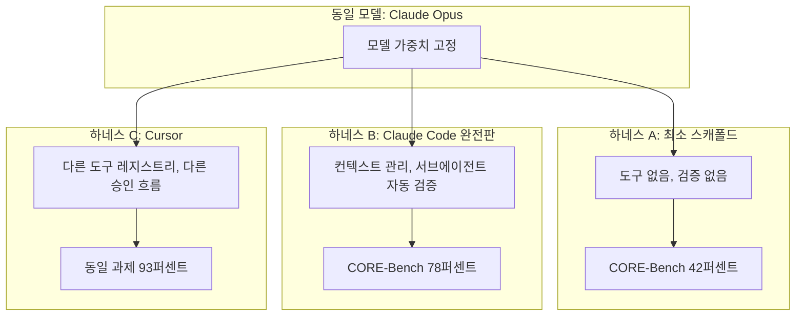

## 관련글

[**Claude Code vs Codex(GPT-5.6 Sol) 논쟁과 Claude Fable 5 종량제 전환 — 2026년 7월 AI 코딩 도구 지형 심층 분석**](https://k82022603.github.io/posts/claude-code-vs-codex(gpt-5.6-sol)-%EB%85%BC%EC%9F%81%EA%B3%BC-claude-fable-5-%EC%A2%85%EB%9F%89%EC%A0%9C-%EC%A0%84%ED%99%98-2026%EB%85%84-7%EC%9B%94-ai-%EC%BD%94%EB%94%A9-%EB%8F%84%EA%B5%AC-%EC%A7%80%ED%98%95-%EC%8B%AC%EC%B8%B5-%EB%B6%84%EC%84%9D/)

---

## 목차
1. 문제 제기 — 벤치마크는 근소한데 왜 체감 격차는 큰가
2. 하네스란 무엇인가 — 네 가지 구성 요소
3. 같은 모델, 다른 하네스 — 숫자로 확인되는 "하네스 효과"
4. Claude Code와 Codex, 설계 철학은 어떻게 다른가
5. "만족도"와 "품질"은 서로 다른 축이다
6. 이전 논쟁을 다시 읽는다 — 페이스북 게시물 재해석
7. 실무 시사점 — 모델과 하네스를 분리해서 검증하는 법
8. 종합 정리
9. 참고 자료

---

## 1. 문제 제기 — 벤치마크는 근소한데 왜 체감 격차는 큰가

앞서 다룬 페이스북 게시물 분석에서 확인했듯, GPT-5.6 Sol과 Claude Fable 5의 공개 벤치마크 격차는 생각보다 크지 않았습니다. Artificial Analysis Coding Agent Index 기준 100점 만점에 2.8점, Intelligence Index 기준으로는 1점 이내였습니다. 그런데도 실제 사용자들의 체감은 "훨씬 낫다"거나 "심각하게 문제가 많다"처럼 훨씬 극단적으로 갈리는 경우가 많습니다.

이 괴리를 설명할 수 있는 가장 유력한 가설이 바로 질문 주신 내용, 즉 "모델 자체의 지능 차이가 아니라 그 모델을 감싸고 있는 하네스(harness)의 설계 차이가 체감 품질과 만족도를 만든다"는 것입니다. 결론부터 말하면, 이 가설을 뒷받침하는 상당히 구체적이고 재현 가능한 데이터가 이미 존재합니다. 이번 문서에서는 그 근거들을 하나씩 짚어보겠습니다.

---

## 2. 하네스란 무엇인가 — 네 가지 구성 요소

하네스는 사용자와 모델 사이에 놓인 모든 도구화 계층을 가리킵니다. 모델이 순수한 "두뇌"라면, 하네스는 그 두뇌가 실제로 파일을 읽고, 명령을 실행하고, 스스로의 작업을 검증하고, 대화가 길어졌을 때 무엇을 기억하고 무엇을 버릴지 결정하는 몸통과 신경계에 해당합니다.

개발자 Jonathan Fulton는 Claude Code와 Codex의 내부 구조를 분석하면서 하네스를 네 가지 구성 요소로 정리했습니다.

- **루프(loop)**: 모델을 언제 다시 호출할지 결정하는 실행 순환 구조
- **컨텍스트 매니저(context manager)**: 압축(compaction)과 기억 관리를 담당하는 계층
- **도구 레지스트리(tool registry)**: 어떤 도구를, 어떤 설명과 스키마로 모델에게 제공할지 정의하는 계층
- **승인 시스템(approval system)**: 도구 호출을 가로채서 사용자 승인을 받거나 자동 실행할지 결정하는 계층

흥미로운 점은, Codex와 Claude Code가 이 네 가지 구성 요소의 큰 틀 자체는 상당히 수렴된 형태를 취하고 있다는 것입니다. 진짜 차이를 만드는 것은 이 틀 안에서의 미세한 설계 선택들, 즉 컨텍스트를 얼마나 공격적으로 요약하는지, 서브에이전트를 몇 개까지 병렬로 운용하는지, 도구 설명을 어떻게 작성하는지, 시스템 프롬프트를 어떻게 구조화하는지와 같은 세부 사항입니다.

---

## 3. 같은 모델, 다른 하네스 — 숫자로 확인되는 "하네스 효과"

이 가설을 가장 강력하게 뒷받침하는 것은 "동일한 모델을 서로 다른 하네스에 넣었을 때 점수가 어떻게 달라지는가"를 직접 측정한 사례들입니다.

개발자 Matt Mayer의 실험에서는 동일한 Claude Opus 모델이 Claude Code 하네스 안에서는 77%, Cursor라는 다른 코딩 도구의 하네스 안에서는 93%를 기록했습니다. 모델 가중치는 전혀 바뀌지 않았는데 하네스만 바꾸었을 뿐인데도 16퍼센트포인트의 점수 차이가 발생한 것입니다.

CORE-Bench에서는 이 효과가 더 극적으로 나타났습니다. 동일한 Claude Opus 모델이 최소한의 스캐폴드(별다른 도구나 검증 장치 없이 모델만 덩그러니 호출하는 구조)에서는 42%를 기록했지만, Claude Code의 완전한 하네스 안에서는 78%를 기록했습니다. 36퍼센트포인트라는 격차가 순전히 하네스, 즉 "래퍼"에서 나온 것이지 모델 가중치에서 나온 것이 아니라는 뜻입니다. 이 결과는 독립적으로 Nate's Newsletter라는 매체의 별도 테스트에서도 동일한 36점 격차로 재확인되었습니다.

이 숫자들을 앞서 살펴본 GPT-5.6 Sol과 Fable 5의 벤치마크 격차(2.8점, 1점 이내)와 나란히 놓고 보면 그림이 뚜렷해집니다. 두 모델 사이의 순수한 지능 격차는 한 자릿수 초반에 불과한 반면, 하네스 설계 하나가 만들어내는 격차는 16점에서 36점까지 벌어질 수 있습니다. 즉 "어떤 모델을 쓰는가"보다 "그 모델을 어떤 하네스로 감싸는가"가 결과물의 품질에 훨씬 더 큰 영향을 미칠 수 있다는 뜻입니다.

이는 지난 문서에서 언급했던 Anthropic의 2026년 3~4월 포스트모템 사례와도 정확히 같은 방향을 가리킵니다. 당시 Claude Code의 API와 모델 가중치 자체는 전혀 바뀌지 않았지만, 컨텍스트 캐싱과 관련된 제품 계층의 버그 세 가지가 겹치면서 사용자들은 품질이 눈에 띄게 나빠졌다고 느꼈습니다. 독립 감사자 Stella Laurenzo가 실제 세션 파일 수천 건을 분석한 결과에서도, 모델이 "리서치 먼저" 하던 행동 패턴에서 "일단 편집부터 하고 보는" 행동 패턴으로 이동했고 추론 깊이도 측정 가능한 수준으로 얕아졌다는 것이 확인되었습니다. 모델은 그대로인데 하네스 계층의 결함 하나로 행동 패턴 자체가 바뀐 실제 사례인 셈입니다.

---

## 4. Claude Code와 Codex, 설계 철학은 어떻게 다른가

그렇다면 Claude Code와 Codex는 구체적으로 어떤 지점에서 다르게 설계되어 있을까요. 여러 실사용 리뷰를 종합하면 다음과 같은 구조적 차이들이 반복적으로 확인됩니다.

**실행 환경.** Codex는 OpenAI가 관리하는 클라우드 컨테이너 안에서 로컬 환경과 분리되어 비동기적으로 작업하고 결과를 diff 형태로 돌려줍니다. 작업을 맡겨두고 노트북을 덮어도 계속 실행됩니다. 반면 Claude Code는 사용자의 터미널 안에서 직접 파일, git 히스토리, 셸에 접근하며 동작합니다. 이 구조적 차이가 이후의 거의 모든 체감 차이의 뿌리가 됩니다.

**검증 방식.** Codex는 자체적으로 브라우저를 띄워 자신이 만든 결과물을 눈으로 확인하고, 스크린샷을 PR에 첨부하는 방식으로 프런트엔드 작업을 스스로 점검합니다. 반면 Claude Code는 별도로 요청하지 않아도 하네스가 스스로 검증용 서브에이전트를 만들어내는 경향이 있다는 것이 여러 실사용자들의 공통된 평가입니다. 한 리뷰어는 이를 "요청하지 않아도 하네스가 검증 서브에이전트를 만들어내는 것"이 Claude Code의 킬러 기능이라고 표현하기도 했습니다. 둘 다 "스스로 확인한다"는 목표는 같지만 확인하는 방식(시각적 자기 검토 vs 별도 에이전트를 통한 교차 검증)이 다릅니다.

**컨텍스트 소비 성향.** Claude Code는 같은 작업에서도 Codex보다 3~4배 많은 토큰을 소비하는 경향이 있는데, 이는 하네스가 컨텍스트를 미리 적재하고, 서브에이전트를 생성하고, 자동으로 검증 패스를 도는 등 "더 많은 일을 하기 때문"이라는 분석이 나옵니다. 실제로 한 통제된 비교 실험에서는 Claude Code가 더 많은 파일을 읽고, 코드를 쓰기 전에 계획을 세우고, 도구를 호출하기 전에 검증하는 성향을 보였고, 그 대가로 12개 컴포넌트로 분해된 아키텍처, 요청하지 않은 스모크 테스트, 그리고 Codex의 MCP 경로 설정 오류로 비어 있던 결과물 대신 실제로 작동하는 결과물을 만들어냈다는 사례가 보고되었습니다.

**작업 지속성과 위임 방식.** Codex는 45분 이상 끊김 없이 지속되는 실행에 강점을 보이며, 사람이 지켜보지 않아도 되는 위임형 작업에 적합하다는 평가를 받습니다. 반면 Claude Code는 90분 이상의 장시간 세션에서도 문제의 맥락(왜 이런 방식을 택했는지)을 다른 도구들보다 더 잘 유지한다는 보고가 있습니다. 실제로 한 실사용 후기에서는, 26시간에 걸친 세션을 컨텍스트 압축으로 요약한 뒤 8시간 후 재개했을 때도 Claude Code가 전날 해결했던 버그의 원인을 다시 설명해낸 사례가 보고되었는데, 이는 압축 이후에도 핵심 판단 근거가 유지되었다는 뜻입니다.

**승인·자동화 스타일.** Codex는 승인 게이트가 있는 지도형(supervised) 작업 흐름을 명시적으로 드러내는 경향이 있어, 각 단계를 눈으로 확인하고 싶은 신중한 작업에 적합하다는 평가를 받습니다. Claude Code는 상대적으로 더 많은 권한을 위임받아 스스로 판단하고 진행하는 방향으로 설계되어 있습니다.

이 차이들을 종합하면, Codex는 "빠르고 저렴하며 명시적인 승인 흐름을 갖춘 실행기" 쪽에, Claude Code는 "느리더라도 더 넓은 컨텍스트를 참고하고 스스로 검증하며 계획하는 사고형 도구" 쪽에 가깝다는 것이 여러 실사용 리뷰의 공통된 결론입니다. 실제로 한 팀은 이 둘을 경쟁시키는 대신, Claude Code를 "설계자(driver)"로 두고 Codex를 "실행자(worker)"로 두어 계층적으로 결합하는 방식을 3주간 운영해본 결과를 공개하기도 했습니다. 이 팀은 단일 도구만 쓸 때보다 약 80% 높은 결과물 품질을 얻었다고 보고했는데, 다만 이 수치는 엄밀한 A/B 테스트가 아니라 실무에서 체감한 값이라는 점을 스스로도 밝히고 있습니다.

---

## 5. "만족도"와 "품질"은 서로 다른 축이다

질문하신 "하네스가 만들어내는 결과물에 대한 사용자 만족도 차이"라는 표현은 정확히 핵심을 짚고 있습니다. 여러 조사에서 반복적으로 확인되는 것은, 코드 품질에 대한 평가와 도구에 대한 전반적 선호도가 서로 다른 결과를 낸다는 점입니다.

500명 이상의 개발자를 대상으로 한 한 설문에서, 일상적으로 어떤 도구를 선호하느냐고 물었을 때는 응답자의 65%가 Codex를 택했습니다. 그러나 결과물만 블라인드로 놓고 코드 품질을 평가했을 때는 응답자의 67%가 Claude Code의 결과물을 더 깔끔하고 관용적이라고 평가했습니다. 즉 "결과물 자체의 완성도"와 "매일 쓰고 싶은 도구인가"라는 두 질문에 대한 답이 정반대로 나온 것입니다.

이 역설은 하네스가 만족도에 영향을 미치는 경로를 잘 보여줍니다. 만족도는 순수한 출력 품질 하나만으로 결정되지 않고, 다음과 같은 하네스 층위의 요소들이 함께 작용해서 만들어집니다.

- **속도와 마찰**: 승인을 몇 번 거쳐야 하는지, 응답이 얼마나 빨리 오는지
- **토큰 비용 체감**: 같은 작업에 얼마를 썼다고 느끼는지, 사용한도가 얼마나 빨리 소진되는지
- **신뢰의 형태**: 결과물을 얼마나 검증 없이 믿고 넘어갈 수 있다고 느끼는지
- **작업 스타일과의 궁합**: 위임형 작업을 선호하는 사용자인지, 단계별 확인을 선호하는 사용자인지

한 리뷰어는 100시간 이상 두 도구를 실사용한 뒤 항목별로 우열을 매겼는데, 최종 점수는 Codex가 3대 2로 근소하게 앞섰습니다. 다만 그 우위는 "코드가 더 정확하다"는 이유가 아니라 브라우저 자기 검토, 헤드리스 모드, 클라우드 위임, 인라인 리뷰 명령처럼 워크플로 마찰을 줄여주는 기능들 때문이었습니다. 반대로 품질과 확장성 면에서는 Claude Code가 우위를 인정받았습니다. 이는 "만족도 차이 = 하네스가 만들어내는 워크플로 경험의 차이"라는 가설과 정확히 부합하는 패턴입니다.

---

## 6. 이전 논쟁을 다시 읽는다 — 페이스북 게시물 재해석

이 관점에서 앞서 다룬 게시물을 다시 읽어보면 몇 가지 대목이 새롭게 보입니다.

작성자는 Claude Code(Opus 4.x, Fable 5)로 만든 결과물을 Codex GPT-5.6-Sol로 재검토하며 결함을 다수 발견했다고 말합니다. 이 경험 자체는 부정할 이유가 없습니다. 다만 그 원인이 반드시 "Fable 5라는 모델의 지능이 낮아서"였다고 단정하기는 어렵습니다. 앞서 확인했듯 Fable 5가 7월 1일 재개된 이후 적용된 신규 보안 분류기가 정상적인 코딩 요청까지 걸러내며 Opus 4.8로 조용히 전환시키는 사례가 보고되었고, 이런 미드세션 모델 전환은 순수한 모델 품질 문제가 아니라 하네스 계층(승인·라우팅 시스템)의 설계 문제에 가깝습니다. 또한 Claude Code 특유의 "더 많이 읽고, 더 많이 계획하고, 더 많이 검증하는" 하네스 성향은 토큰을 많이 쓰는 대신 아키텍처 결정의 일관성을 지키는 방향으로 설계되어 있는데, 이런 설계가 작성자가 겪은 특정 실무 상황(검수되지 않은 결과물이 실제로 치명적이었던 경험)과 어떻게 상호작용했는지는 게시물만으로는 알 수 없습니다.

"토큰을 아끼기 위한 트릭"이라는 표현도 이 관점에서 다시 볼 수 있습니다. 실제로 Anthropic은 컨텍스트 캐싱을 둘러싼 최적화 과정에서 발생한 버그로 품질이 저하된 사례를 공식적으로 인정한 바 있습니다. 이것이 "의도된 전략"이었는지는 확인할 수 없지만, 적어도 "하네스 계층에서의 최적화 시도가 실제로 체감 품질에 영향을 미친 사례가 존재한다"는 점은 분명한 사실입니다. 즉 작성자의 불만이 향하고 있는 지점은 모델 자체라기보다, 모델을 둘러싼 컨텍스트 관리·라우팅·압축 전략일 가능성이 상당히 높습니다.

반대로 Codex가 "더 꼼꼼하다"고 느낀 경험 역시, GPT-5.6 Sol이라는 모델 자체의 우수성보다는 Codex 하네스의 브라우저 자기 검토 기능이나 명시적 승인 흐름이 만들어내는 "검수받은 느낌"에서 비롯되었을 가능성을 배제할 수 없습니다. 앞서 살펴본 벤치마크상 두 모델의 순수 지능 격차가 1~3점 수준에 불과하다는 점을 고려하면, 체감된 격차의 상당 부분은 모델이 아니라 그 모델을 감싼 하네스와, 그 하네스가 특정 실무 워크플로와 얼마나 잘 맞았는지에서 비롯되었다고 보는 것이 더 근거 있는 해석입니다.

---

## 7. 실무 시사점 — 모델과 하네스를 분리해서 검증하는 법

"모델 문제인지 하네스 문제인지"를 실무에서 구분하고 싶다면, 다음과 같은 절차가 도움이 됩니다.

1. **동일 작업을 순수 API로 재현해본다.** Claude Code나 Codex라는 하네스를 거치지 않고, 동일한 프롬프트와 동일한 컨텍스트를 API로 직접 모델에 전달했을 때도 같은 결함이 나오는지 확인합니다. 만약 API 단계에서는 문제가 없는데 하네스를 거치면 문제가 생긴다면, 이는 컨텍스트 압축, 도구 설명, 시스템 프롬프트 등 하네스 계층의 문제일 가능성이 높습니다.
2. **컨텍스트 압축이 개입했는지 확인한다.** `/context` 같은 명령으로 세션 내 컨텍스트 사용량을 확인하고, 문제가 발생한 시점이 자동 압축이 일어난 직후인지 대조합니다.
3. **미드세션 모델 전환 여부를 확인한다.** Fable 5처럼 안전 분류기에 의해 조용히 다른 모델로 폴백되는 경우, 로그나 응답 메타데이터에서 실제로 어떤 모델이 응답했는지 확인할 필요가 있습니다.
4. **동일 모델을 다른 하네스에 넣어 비교한다.** 여건이 된다면 같은 모델을 Claude Code, Cursor, 순수 API 스크립트 등 서로 다른 하네스에 넣어 같은 과제를 수행시켜 보는 것이 가장 직접적인 검증 방법입니다. 앞서 소개한 Matt Mayer와 CORE-Bench의 실험이 바로 이 방법론을 사용한 사례입니다.
5. **"검증 서브에이전트가 자동으로 도는가"를 하네스 선택 기준에 넣는다.** 검수 없이는 신뢰하지 않는다는 원칙을 이미 세우셨다면, 하네스 자체가 자동으로 검증 단계를 밟아주는지 여부가 모델의 원시 지능보다 실무적으로 더 중요한 선택 기준이 될 수 있습니다.

---

## 8. 종합 정리

질문하신 가설, 즉 "모델 성능 차이라기보다 하네스 차이가 사용자 만족도 차이를 만든다"는 관점은 다음의 근거들로 상당히 뒷받침됩니다.

- 동일 모델이라도 하네스에 따라 16~36퍼센트포인트에 달하는 벤치마크 점수 차이가 실제로 관측되었습니다.
- Anthropic 스스로도 모델은 그대로 둔 채 하네스 계층의 버그만으로 품질이 체감될 만큼 저하된 사례를 공식적으로 인정한 바 있습니다.
- Claude Code와 Codex는 검증 방식(서브에이전트 자동 생성 vs 브라우저 자기 검토), 실행 환경(로컬 vs 클라우드 샌드박스), 컨텍스트 소비 성향(계획 우선 vs 실행 우선)에서 뚜렷하게 다른 설계 철학을 갖고 있습니다.
- 일상적 선호도(65% Codex)와 블라인드 품질 평가(67% Claude Code)가 정반대로 나타난 사례는, 만족도와 품질이 서로 다른 축이며 만족도 쪽이 하네스가 만드는 워크플로 경험에 더 크게 좌우된다는 것을 보여줍니다.

반면 두 모델(Fable 5, GPT-5.6 Sol) 자체의 공개된 순수 지능 격차는 벤치마크 기준 1~3점 수준으로 크지 않았습니다. 이 두 가지를 함께 놓고 보면, 지난 페이스북 게시물에서 느껴진 강렬한 체감 격차는 모델의 지능 차이보다 하네스의 설계 차이, 그리고 그 하네스가 특정 실무 워크플로와 얼마나 잘 맞았는지에서 비롯되었을 가능성이 실제로 더 높다고 판단됩니다. 다만 이는 여러 간접 증거를 종합한 추정이며, 이번 특정 사례(작성자가 겪은 구체적인 결함들)를 직접 검증한 자료는 아니라는 점은 분명히 해둘 필요가 있습니다.

---

## 9. 참고 자료

- Fountain City, "Codex 5.5 vs Claude Code 4.7: 3 Weeks of Head-to-Head Testing in Production" (2026-04-30, 2026-07-07 갱신) — Matt Mayer 실험(77% vs 93%), CORE-Bench(42% vs 78%), Jonathan Fulton 하네스 4대 구성요소 분류 인용
- Nate's Newsletter, "Same model, 78% vs 42%: the harness made the difference"
- Medium(Jonathan Fulton), "Inside the Agent Harness: How Codex and Claude Code Actually Work"
- Composio, "Claude Code vs Codex: What I Learned After 100+ Hours With Both" (2026)
- Superblocks, "Codex vs Claude Code: Which Is Better in 2026?" — 67% 블라인드 품질 우위 데이터
- CatDoes, "Claude Code vs OpenAI Codex 2026: Pricing & Speed" — 65% 일상 선호도, 67% 블라인드 품질 데이터
- Firecrawl, "Claude Code vs Codex: Which AI Coding Agent Should You Use in 2026?"
- Nimbalyst, "Codex vs Claude Code: Which Workflow Harness Wins"
- AIMultiple, "Top Agent Harnesses: Claude Code vs Codex"
- InfoQ, "Anthropic Traces Six Weeks of Claude Code Quality Complaints to Three Overlapping Product Changes" (2026-05-14)
- 이전 문서: "Claude Code vs Codex(GPT-5.6 Sol) 논쟁과 Claude Fable 5 종량제 전환" (본 시리즈 1편)

---

작성일자: 2026-07-11
