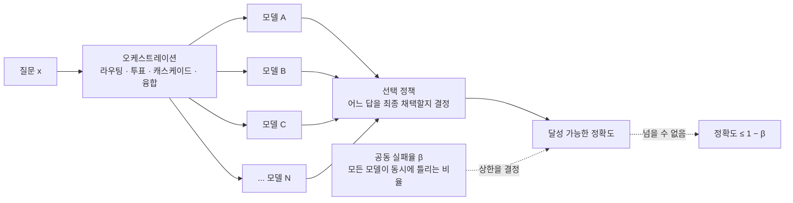
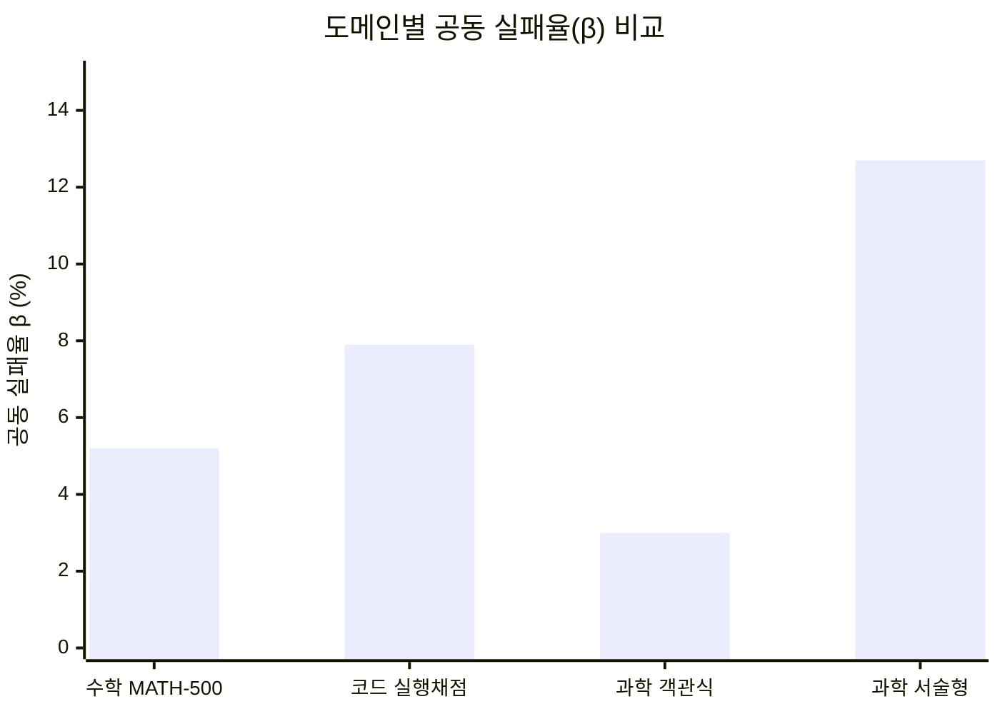

## 목차

1. 왜 이 연구가 지금 중요한가
2. 연구의 출처와 저자
3. 핵심 개념 잡기: 공동 실패율(β)이란 무엇인가
4. 왜 업계 표준 지표인 '쌍별 오류 상관관계(ρ)'는 틀렸나
5. 실험 설계: 67개 모델, 21개 provider, 세 개의 도메인
6. 실증 결과 ① — 수학과 코드: 상한이 실제로 발목을 잡는다
7. 실증 결과 ② — 과학 문제: 같은 내용, 다른 형식이 결과를 뒤집다
8. 다수결과 셀프 MoA는 왜 기대만큼 작동하지 않았나
9. 라우터를 학습시켜도 소용없었던 이유
10. 클로퍼-피어슨 경계: 배포 전에 무료로 한계를 확인하는 법
11. 실무자와 교육자를 위한 시사점
12. 연구의 한계와 남은 질문
13. 정리

---

## 1. 왜 이 연구가 지금 중요한가

여러 개의 대형언어모델을 동시에 활용해서 서로의 약점을 보완하면 단일 모델보다 더 정확한 답을 얻을 수 있다는 생각은 지금 업계 전반에 퍼져 있는 통념이다. 라우팅, 투표, 캐스케이드, 믹스처 오브 에이전트(MoA)처럼 이름은 다양하지만 기본 발상은 같다. 여러 모델에게 같은 질문을 던지고, 그 중 가장 그럴듯한 답을 골라내거나 합쳐내면 어느 한 모델의 실수를 다른 모델이 메워줄 것이라는 기대다.

2026년 6월 25일 아카이브에 공개된 논문 "When Does Combining Language Models Help? A Co-Failure Ceiling on Routing, Voting, and Mixture-of-Agents Across 67 Frontier Models"[1][2]는 바로 이 통념에 수학적으로, 그리고 실측 데이터로 제동을 걸었다. 결론부터 말하면, 여러 모델을 아무리 정교하게 조합하더라도 넘을 수 없는 정확도의 상한선이 존재하고, 지금까지 업계가 오케스트레이션 여부를 판단할 때 써온 지표는 바로 그 상한선을 제대로 보지 못한다는 것이다.

이 연구가 특별히 흥미로운 지점은, 결론이 추상적인 이론에 그치지 않고 GPT-5.5, 클로드 오퍼스 4.8, 제미나이 3.1 프로, 그록 4.3, GLM-5.2, Qwen3.7-Max, 딥시크 V4, Kimi K2.7을 포함한 21개 제공사 67개 모델을 실제로 동원해 수학, 코드, 과학 세 영역에서 검증했다는 데 있다. 여러 모델을 함께 쓰는 하니스(harness)를 직접 설계하고 운영해본 사람이라면, "왜 모델을 더 추가해도 체감 성능이 크게 오르지 않는가"라는 질문에 대해 이 논문이 상당히 구체적인 답을 제공한다는 것을 알 수 있을 것이다.

## 2. 연구의 출처와 저자

이 논문의 저자는 요제프 첸(Josef Chen) 한 사람이며, 소속은 카이카쿠(KAIKAKU)로 표기되어 있다[1]. 카이카쿠는 흔히 알려진 것과 달리 AI 연구소가 아니라 런던에 본사를 둔 레스토랑 자동화·로보틱스 스타트업으로, 2023년에 설립되어 조리 로봇과 관련 소프트웨어를 개발해 온 회사다[3][4]. 요제프 첸은 이 회사의 창업자 겸 CEO로, 논문 자체는 그의 개인 연구로 게재된 것으로 보인다. 일부 국내 매체는 이를 "카이카쿠를 비롯한 공동 연구진"이라고 소개했으나, 아카이브에 게시된 논문 원문에는 저자가 요제프 첸 단독으로 표기되어 있다는 점은 분명히 해둘 필요가 있다.

논문은 실험에 들어간 실제 비용도 투명하게 공개했다. 핵심 결과를 낸 실험들의 API 비용 합계는 약 270달러, 탐색적으로 시도했다가 폐기된 실험까지 포함한 전체 계정 사용액은 약 560달러 수준이었다고 밝히고 있다[2]. 대규모 연구소의 자원이 아니라 개인이 오픈라우터(OpenRouter) 같은 애그리게이터를 통해 충분히 재현 가능한 방식으로 이런 결론에 도달했다는 점도 눈여겨볼 만하다.

## 3. 핵심 개념 잡기: 공동 실패율(β)이란 무엇인가

논문의 핵심 주장을 이해하려면 딱 하나의 개념만 붙잡으면 된다. 바로 공동 실패율, 그리스 문자로 베타(β)라고 표기되는 값이다. 정의는 단순하다. 특정 질문에 대해 풀(pool)에 속한 모든 모델이 동시에 틀릴 확률이다.

라우터든, 다수결 투표든, 캐스케이드든, 여러 모델의 답 중 하나를 최종 답으로 채택하는 방식이라면 어떤 정교한 방법을 쓰더라도 정확도는 1에서 β를 뺀 값(1−β)을 절대 넘을 수 없다[2]. 이유는 직관적이다. 모든 모델이 동시에 틀린 질문에서는 애초에 정답을 담고 있는 모델 자체가 존재하지 않으므로, 아무리 똑똑한 선택 규칙을 써도 정답을 고를 수가 없다. 논문은 이를 '오라클(Oracle)'이라는 이상적인 결합기 개념으로 설명한다. 오라클은 풀에 속한 모델 중 단 하나라도 정답을 맞혔다면 반드시 그 정답을 골라내는, 현실에는 존재할 수 없는 완벽한 선택기다. 이 오라클조차도 정확도가 1−β를 넘지 못한다는 것이 증명의 핵심이다[2].

여기서 중요한 부분이 하나 더 있다. 논문은 오케스트레이션으로 얻을 수 있는 최대 이득(오라클 이득, G)을 다음과 같이 분해한다. 이 이득은 전적으로 '해결 가능한 영역', 즉 모델들의 답이 갈리는데 그 중 최고 성능 단일 모델이 틀린 경우에서만 나온다. 반대로 모든 모델이 동시에 틀리는 공동 실패 영역은 이 이득에 전혀 기여하지 못한다[2]. 다시 말해 β가 작다고 해서 저절로 오케스트레이션이 도움이 된다는 뜻은 아니며, 단지 이론적 상한이 높아질 뿐이다. 실제로 그 상한까지 도달할 수 있느냐는 완전히 다른 문제이고, 이는 뒤에서 다룰 라우터 실험 결과와 직결된다.

## 4. 왜 업계 표준 지표인 '쌍별 오류 상관관계(ρ)'는 틀렸나

지금까지 업계에서 여러 모델을 조합할지 말지 판단할 때 가장 널리 쓰인 지표는 쌍별 오류 상관관계, 즉 로(ρ)였다. 두 모델을 짝지어 놓고 한쪽이 틀렸을 때 다른 쪽도 함께 틀리는 정도를 재는 값으로, 이 값이 낮으면 "두 모델이 서로 다른 문제에서 실수하니 섞어 쓸 가치가 있다"고 해석해 왔다.

논문은 이 진단법 자체가 근본적으로 잘못된 질문에 답하고 있다고 지적한다[2]. 핵심 증명은, 주변 분포(각 모델의 개별 정답률)와 모든 쌍별 상관관계가 완전히 동일한 두 개의 서로 다른 오류 확률 구조를 만들 수 있는데, 이 둘의 공동 실패율 β는 서로 다를 수 있다는 것이다[2]. 즉 ρ만 봐서는 β를 절대 역산해낼 수 없다는 뜻이며, 모델이 3개 이상일 때 이 비식별성(non-identification)이 수학적으로 성립한다.

실제 측정에서는 이 괴리가 상당히 크게 나타났다. 논문은 이진 정답/오답 지표에 그대로 피어슨 상관계수를 적용하는 '순진한(naive)' 방식이 아니라, 잠재적인 능력 차이를 반영하는 테트라코릭(tetrachoric) 상관계수로 보정한 뒤 단일 요인 가우시안 코퓰러(single-factor Gaussian copula) 모형으로 β를 예측했다. 그렇게 정교하게 보정한 모형조차도 실제 관측된 공동 실패율을 과소평가했다. 개방형 수학 문제(MATH-500)에서 이 방식으로 예측한 β는 0.021이었지만 실제 관측치는 0.052로, 약 2.5배의 차이가 났다(90% 신뢰구간 1.7배~3.4배)[1][2]. 67개 모델 전체의 쌍별 테트라코릭 상관행렬을 통째로 반영한 더 정교한 코퓰러 모형으로 계산해도 예측치는 0.023에 그쳐, 여전히 실제값의 2.25배 수준을 밑돌았다[2]. 국내 보도에서 언급된 "기존 방식이 실제보다 2.25배 낮게 계산했다"는 수치는 바로 이 후자의 비교에서 나온 것이다[5].

논문은 이 괴리가 단일 요인 모형의 한계 때문만은 아니라고 강조한다. 가우시안 코퓰러 계열 모형은 태생적으로 '하한 꼬리 의존성(lower tail dependence)'이 0이기 때문에, 극단적으로 어려운 질문에서 모든 모델이 한꺼번에 무너지는 현상을 구조적으로 포착하지 못한다[2]. 논문은 이를 금융공학에서 다수의 채권이 동시에 부도날 위험을 다루는 포트폴리오 신용파생상품(CDO) 모형이 겪는 '베이스 상관관계 스마일(base-correlation smile)' 문제와 같은 종류의 현상으로 비유한다. 요컨대 쌍별로 보면 서로 다른 문제에서 실패하는 것처럼 보이는 모델들도, 정말 어려운 소수의 질문 앞에서는 마치 약속이라도 한 듯 동시에 무너지는 '공통 모드(common-mode)' 실패가 존재하며, 이것이 ρ라는 렌즈로는 보이지 않는다는 것이다.

## 5. 실험 설계: 67개 모델, 21개 provider, 세 개의 도메인

논문은 두 층위의 실험을 병행했다. 먼저 15개 모델로 구성된 상대적으로 작은 풀에서 라우터를 실제로 학습시키고 검증하는 실험을 진행했다. 이 풀은 프런티어 등급(클로드 오퍼스 4.8, GPT-5.1, 제미나이 3.1 프로, Kimi K2.7), 중간 등급(클로드 소네트 4.6, GPT-5-mini, 제미나이 3.5 플래시, Qwen3-235B, 미스트랄 라지, MiniMax M2.7, 딥시크 V3.2), 저가 등급(클로드 하이쿠 4.5, GPT-5-nano, 제미나이 3.1 플래시-라이트, 라마-4-Maverick)으로 구성되었다[2].

여기서 한 단계 더 확장해, 시장 규모의 β를 측정하기 위해 오픈라우터에 실시간으로 등록된 67개 모델, 21개 제공사 전체로 풀을 넓혔다. GLM, Qwen, 딥시크, MiniMax, Nemotron, 라마-3.x, 미스트랄, 젬마, Phi, 그래나이트 등 소형 오픈웨이트 모델까지 포함한 실제 시장의 단면을 그대로 가져온 것이다[2]. 채점은 사람이나 LLM 심사위원이 아니라 프로그램에 의한 정답 대조 방식(정확 일치, 객관식/박스 답안 추출)을 기본으로 삼아 주관성을 최소화했다.

세 개의 도메인이 다뤄졌다. 첫째는 개방형 수학 경시 문제(MATH-500, 그리고 더 어려운 MATH-Hard Level-5, AIME 2024/2025), 둘째는 실행 결과로 채점하는 코드 생성 과제, 셋째는 대학원 수준 과학 문제(GPQA-Diamond, 물리·화학·생물)였다. 특히 GPQA-Diamond는 원래 객관식 문제였는데, 같은 문제를 서술형으로 바꿔 다시 풀게 하는 '내용 통제(content-controlled)' 실험도 별도로 진행했다. 서술형 채점에는 5명의 LLM 심사위원 패널을 동원했고, 심사위원 간 일치도(카파 계수)는 0.73에서 0.92 사이로 나타나 채점 신뢰도 자체는 양호했다고 밝히고 있다[2].

## 6. 실증 결과 ① — 수학과 코드: 상한이 실제로 발목을 잡는다

67개 모델 전체를 동원한 MATH-500 실험에서, 330개의 완전히 커버된 질문 중 17개는 67개 모델 전원이 동시에 틀렸다. 이는 공동 실패율 β=0.052(95% 클로퍼-피어슨 신뢰구간 0.030~0.081)에 해당한다[2]. 이 수치가 작아 보일 수 있지만, 이미 단일 최고 성능 모델의 정확도가 0.836에 달하는 상황에서 이론적 상한(1−β)과 단일 최고 모델 성능의 격차, 즉 오케스트레이션으로 얻을 수 있는 최대 개선폭은 0.112에 불과했다[3][2]. 실행 결과로 채점하는 코드 생성 과제(code_contests)에서는 18개 모델, 63개 질문 중 5개 질문에서 전 모델이 동시에 틀려 β=0.079를 기록했으며, 오라클 이득은 0.096이었다[3]. 두 도메인 모두 논문은 이를 '상한 구속(ceiling-bound)' 체제로 분류한다. 즉 아무리 라우팅을 잘해도 공동 실패라는 벽 자체가 이미 개선 여지를 좁혀놓은 상황이라는 뜻이다.

## 7. 실증 결과 ② — 과학 문제: 같은 내용, 다른 형식이 결과를 뒤집다

가장 흥미로운 대조는 GPQA-Diamond에서 나왔다. 객관식 형태로 물었을 때는 52개 모델, 130개 질문 중 전원이 동시에 틀린 사례가 단 하나도 없었다(β<0.03). 이 경우 단일 최고 모델 정확도는 0.846이었지만, 문제별 오라클 정확도는 1.000에 도달해 오라클 이득이 0.154로 세 도메인 중 가장 컸다[3]. 논문은 이 상태를 '실현 가능성 구속(realizability-bound)' 체제라고 부른다. 상한 자체는 열려 있어 이론적으로는 큰 개선 여지가 있지만, 그 여지를 실제로 거둬들이려면 어떤 모델이 어떤 질문에서 옳을지를 정확히 골라내는 강력한 라우팅 신호가 필요하다는 뜻이다[2].

그런데 똑같은 GPQA-Diamond 문제를 객관식 선택지 없이 서술형으로 다시 물었더니 상황이 완전히 뒤집혔다. 공동 실패율이 β=0.127까지 치솟은 것이다[1][2]. 논문은 문제의 '내용'은 전혀 바꾸지 않고 '형식'만 바꿨다는 점을 강조한다. 즉 공동 실패를 좌우하는 것은 주제의 난이도가 아니라 답변을 요구하는 방식 자체라는 결론이다[2]. 객관식은 몇 개의 선택지 중 하나를 찍으면 되기 때문에 우연히 정답을 맞힐 '추측 바닥(guess floor)'이 존재해 전원이 동시에 틀리는 사건 자체가 구조적으로 드물어지지만, 서술형에서는 이 안전판이 사라지면서 모델들이 공유하는 맹점이 고스란히 드러난다는 것이다.

세 도메인을 관통하는 패턴은 이렇다. 열린 형식의 과제(수학, 서술형 과학, 실행 채점 코드)에서는 공동 실패가 상한 자체를 갉아먹고, 닫힌 형식의 과제(객관식)에서는 공동 실패가 드물어지는 대신 정답 모델을 정확히 골라내지 못하는 라우팅 실패가 병목이 된다. 기존에 널리 쓰이던 쌍별 오류 상관관계는 이 두 가지 서로 다른 제약 상황을 구분해내지 못하기 때문에, 멀티 모델 시스템의 잠재적 효과를 체계적으로 과대평가하게 된다는 것이 논문의 결론이다[3][2].

## 8. 다수결과 셀프 MoA는 왜 기대만큼 작동하지 않았나

논문은 실용적으로도 시사점이 큰 두 가지 발견을 추가로 제시한다. 첫째, 성능 수준이 서로 다른 모델들을 단순 다수결로 묶으면 오히려 정확도가 떨어질 수 있다는 것이다. 성능이 낮은 모델들이 머릿수로 뛰어난 모델의 정답을 뒤집어버리는 현상이 실제로 관측되었으며, 국내 보도에 따르면 성능 격차가 있는 모델들을 단순 다수결로 묶었을 때 평균 정확도가 약 10퍼센트포인트 하락했다고 전해진다[3]. 이는 다수결 앙상블을 설계할 때 참여 모델들의 성능 수준을 먼저 맞춰야 한다는 실무적 함의로 이어진다.

둘째, 성능이 비슷한 여러 모델을 골고루 섞은 '다양하지만 낮은 상관관계'의 앙상블은, 동일한 하나의 모델을 여러 번 호출해서 답을 합치는 셀프 MoA(Self-Mixture of Agents) 방식보다 나은 성능을 보였다[1]. 이는 선행 연구인 리(Li) 등의 '이질적 혼합보다 최고 단일 모델을 여러 번 샘플링하는 편이 낫다'는 주장[2]과 대비되는 지점으로, 논문은 이 결론이 성립하는 조건이 '품질이 서로 비슷한 모델들을 매칭했을 때'로 제한된다고 명시한다. 다만 이 이점 역시 절대적이지 않다. 어떤 모델이 어떤 질문에 가장 적합한지 정확히 짚어낼 강력한 라우팅 신호가 없다면, 여러 모델을 조합한 시스템이 단일 최고 성능 모델의 정확도를 안정적으로 뛰어넘기는 쉽지 않다고 논문은 결론짓는다[1].

## 9. 라우터를 학습시켜도 소용없었던 이유

논문에서 가장 실무적으로 뼈아픈 대목은 15개 모델 풀에서 실제로 라우터 네 종류를 학습시켜 검증한 실험이다. 이론적으로 존재하는 오라클 이득(G)은 포화된 다중 도메인 혼합 벤치마크에서 0.044, 더 어려운 MMLU-Pro 단일 도메인에서는 0.120에 달했다[2]. 문제는 이 이득 중 실제로 회수할 수 있는 비율이었다.

TF-IDF와 도메인 정보를 결합한 로지스틱 회귀 라우터는 정확도 0.906을 기록해 단일 최고 모델의 0.901을 근소하게 앞섰지만, 이는 오라클 이득의 9퍼센트만 회수한 것이었고 신뢰구간은 0을 포함해 통계적으로 유의미하다고 보기 어려웠다[2]. 더 강력한 그래디언트 부스팅 기반 라우터는 오히려 오라클 이득의 −0.09, 즉 성능을 깎아먹는 결과를 낳았다. 가장 흥미로운 실험은 실제 배포 환경에 가까운 'LLM을 라우터로 쓰는' 방식이었다. GPT-5-mini에게 각 질문과 모든 참여 모델의 강점 요약을 보여주고 어떤 모델이 가장 적합할지 고르게 했더니, 100퍼센트의 질문에서 단일 최고 모델을 그대로 선택했고 오라클 이득은 정확히 0을 회수하는 데 그쳤다[2].

논문은 이 결과가 라우터 설계가 미흡해서가 아니라, 프런티어 모델들이 서로 의견이 갈리는 지점에서 그 중 누가 맞을지에 대한 신호 자체가 질문 텍스트 안에 거의 담겨 있지 않기 때문이라고 해석한다[2]. 다시 말해 이론상의 작은 오라클 이득조차 대부분 실현 불가능한 상한에 가깝다는 것이다. 다만 이 라우터 실험은 프롬프트 전체를 로깅해둔 15개 모델 풀에서만 수행되었고, 67개 모델 규모의 시장 스케일 실험은 결과값만 저장되고 프롬프트는 저장되지 않아 별도의 라우터가 학습되지 않았다는 점, 즉 시장 스케일에서의 라우팅 주장은 실제 엔드투엔드 라우팅 실험이 아니라 뒤에 설명할 통계적 인증서(certificate)에 근거한다는 점을 논문은 스스로 명시하고 있다[2].

## 10. 클로퍼-피어슨 경계: 배포 전에 무료로 한계를 확인하는 법

이 논문이 순수 이론에 그치지 않고 실무자에게 곧바로 쓸모 있는 이유는, β를 신뢰구간 형태로 추정해 '오케스트레이션 투자가 손익분기점을 넘을 수 있는지'를 사전에 검증하는 도구를 함께 제시했기 때문이다. 방법은 다음과 같다. 이미 보유하고 있는 채점된 평가 로그에서 n개의 질문 중 몇 개(K개)에서 모든 후보 모델이 동시에 틀렸는지만 세면 된다. 이 K와 n으로부터 클로퍼-피어슨(Clopper-Pearson) 방법을 이용해 β의 하한 신뢰구간을 구하면, 어떤 선택 정책을 쓰더라도 넘을 수 없는 정확도의 상한을 확률 1−δ 이상의 신뢰수준으로 산출할 수 있다[2]. 만약 이렇게 인증된 상한이 오케스트레이션을 구축·운영하는 데 드는 오버헤드보다 낮다면, 그 어떤 정교한 라우터·투표·캐스케이드 정책도 투자 대비 이득을 낼 수 없다는 것을 별도의 라우터 학습이나 추가 실험 없이 확인할 수 있다는 것이다[2][3].

논문은 이 계산이 기존 평가 로그에서 전원 오답 사례의 개수를 세는 수준의 매우 단순한 작업이기 때문에, 기업들이 이미 운영 중인 지속적 통합(CI) 파이프라인에 손쉽게 자동화해 넣을 수 있다고 설명한다[3]. 모델이 교체되거나 업무 성격이 바뀔 때마다 이 지표를 다시 계산해보면, 지금 구성하려는 멀티 모델 시스템이 애초에 투자할 가치가 있는지를 배포 전에, 그것도 사실상 비용 없이 미리 점검할 수 있다.

## 11. 실무자와 교육자를 위한 시사점

이 연구가 던지는 메시지는 "멀티 모델을 쓰지 말라"가 아니라 "무엇을 재고 나서 오케스트레이션을 설계하라"는 쪽에 가깝다. 몇 가지로 정리해볼 수 있다.

먼저, SQL이나 JSON 생성, 문서에서 특정 정보를 추출하는 것처럼 정답이 명확히 검증 가능한 작업에서는 저가 모델 여러 개를 조합하는 것보다 성능이 가장 좋은 단일 모델 하나를 쓰는 편이 대체로 더 효율적이라는 것이 논문의 결론이다[3]. 반대로 마케팅 문안 작성처럼 정답이 정해져 있지 않은 개방형 생성 작업에서도 같은 결론이 성립하는지는 이 논문이 다루지 않은 영역이며, 저자 스스로도 추가 연구가 필요하다고 밝히고 있다[3].

둘째, 오케스트레이션 시스템을 설계할 때 참여 모델들의 성능 수준을 비슷하게 맞추는 것이 단순히 많은 모델을 모으는 것보다 중요하다. 성능 격차가 큰 모델을 다수결에 섞으면 오히려 정확도가 떨어질 수 있다는 결과는, 하위 등급 모델을 상위 등급 모델의 검증자나 투표권자로 배치하는 설계를 신중하게 재검토할 필요가 있음을 시사한다. 검증(verification)이나 심사(judging) 역할은 상대적으로 강한 모델에 맡기고, 실행(execution) 역할을 하위 등급 모델에 맡기는 식으로 역할을 분리하는 아키텍처가, 모든 모델을 동등한 투표권자로 취급하는 설계보다 이 연구의 결과와 더 잘 부합한다고 볼 수 있다.

셋째, 작업의 형식이 답의 신뢰도에 큰 영향을 준다는 발견은 실무적으로 유용하다. 같은 내용이라도 객관식·정형 출력처럼 답의 공간이 좁혀진 형식으로 질문을 구조화할수록 여러 모델이 동시에 틀릴 확률이 줄어드는 경향이 있었다. 반대로 완전히 열린 서술형으로 답을 요구할수록 공동 실패의 위험이 커진다. 에이전트 하니스나 검증 루프를 설계할 때, 가능한 한 검증 가능한 형식으로 중간 산출물을 강제하는 것이 단순히 가독성이나 파싱 편의성 때문만이 아니라 공동 실패를 줄이는 방향으로도 작동할 수 있다는 뜻이다.

넷째, 그리고 아마 가장 실무적인 조언은 이것이다. 새로운 멀티 모델 하니스나 오케스트레이션 레이어를 본격적으로 구축하기 전에, 이미 가지고 있는 평가 데이터로 클로퍼-피어슨 경계부터 계산해보라는 것이다. 복잡한 라우팅 로직을 설계하고 운영 비용을 들이기 전에, 애초에 그 노력이 성능 상한을 얼마나 끌어올릴 수 있는지부터 값싸게 가늠해보는 습관은, 여러 모델을 함께 쓰는 워크플로우를 다루는 모든 실무자와 교육자에게 도움이 되는 태도라 할 수 있다.

## 12. 연구의 한계와 남은 질문

논문 스스로도 몇 가지 한계를 분명히 밝히고 있다. 우선 공동 실패 사건 자체가 드물게 관측되는 현상이기 때문에, β 추정치의 신뢰구간이 넓다. 예를 들어 MATH-500에서 β=0.052라는 값은 겨우 17건의 전원 오답 사례에 기반한 것으로, 95% 신뢰구간이 0.030에서 0.081까지 벌어진다[2]. GPQA-Diamond 객관식에서 관측된 β<0.03이라는 값도 130개 질문 중 전원 오답 사례가 단 한 건도 없었다는 사실에서 나온 상한 추정치일 뿐이라, 표본이 더 컸다면 다른 값이 나왔을 가능성을 배제할 수 없다.

또한 앞서 언급했듯 67개 모델 규모의 시장 스케일 실험에서는 실제로 라우터를 학습시켜 검증하지는 못했다. 프롬프트 자체가 저장되지 않았기 때문에, 시장 스케일에서의 라우팅 관련 주장은 실제 엔드투엔드 실험이 아니라 인증서 방식의 통계적 상한 추정에 근거한다는 점을 논문이 명시적으로 인정하고 있다[2]. 아울러 채점 방식이 프로그램적 정답 대조에 크게 의존하고 있어, 서술형 과학 문제처럼 LLM 심사위원 패널을 쓴 경우를 제외하면 자유 형식의 창작적·주관적 과업에 이 결론이 얼마나 일반화되는지는 별도의 검증이 필요하다.

마지막으로, 이 연구가 다룬 모델들과 벤치마크는 논문이 작성된 2026년 6월 시점의 스냅샷이다. 모델의 성능과 서로 간의 상관구조는 새로운 모델이 등장하고 기존 모델이 갱신될 때마다 계속 바뀔 수 있는 값이므로, 오늘 측정한 β가 몇 달 뒤에도 그대로 유지된다는 보장은 없다. 논문이 제시한 방법론 자체는 재사용 가능하지만, 특정 시점에 측정된 숫자를 고정된 진리처럼 받아들이기보다는 자신이 실제로 쓰는 모델 조합에 대해 주기적으로 다시 측정해야 하는 값으로 이해하는 편이 안전하다.

## 13. 정리

이 논문이 보여주는 그림을 한 문장으로 요약하면 이렇다. 여러 모델을 섞어 쓸 때 정말로 중요한 것은 모델들이 서로 얼마나 다르게 틀리는가(쌍별 상관관계)가 아니라, 얼마나 자주 다 함께 틀리는가(공동 실패율)이며, 지금까지 업계가 전자를 근거로 오케스트레이션의 효용을 판단해온 관행은 후자를 체계적으로 과소평가해왔다는 것이다. 어려운 개방형 문제일수록 최신 프런티어 모델들은 놀랍도록 비슷한 지점에서 함께 무너지는 경향을 보이며, 이 공통의 맹점은 모델 숫자를 늘리는 것만으로는 해소되지 않는다. 반대로 답의 형식이 닫혀 있어 공동 실패가 드문 영역에서는, 병목이 상한 자체가 아니라 어떤 모델이 옳은지 짚어내는 라우팅 신호의 부재로 옮겨간다.

결국 이 연구가 제안하는 실천적 태도는 단순하다. 멀티 모델 시스템을 구축하기 전에, 먼저 가진 데이터로 공동 실패율부터 값싸게 측정해보고, 그 상한이 들이려는 노력과 비용을 정당화할 만큼 넉넉한지를 확인한 다음에 오케스트레이션 설계에 들어가라는 것이다. 화려한 라우팅 알고리즘보다, 지금 손에 쥔 모델 풀이 애초에 얼마나 서로 다르게 실패하는지를 정직하게 재보는 습관이 먼저라는 이야기다.

---

## 참고 자료

[1] Josef Chen, "When Does Combining Language Models Help? A Co-Failure Ceiling on Routing, Voting, and Mixture-of-Agents Across 67 Frontier Models", arXiv:2606.27288, 2026년 6월 25일 게재. https://arxiv.org/abs/2606.27288

[2] 위 논문 HTML 전문. https://arxiv.org/html/2606.27288v1

[3] 박찬 기자, "'여러 모델 섞어 써도 한계 명확'…통념 깨진 '오케스트레이션' 효과", AI타임스. https://www.aitimes.com/news/articleView.html?idxno=212625

[4] KAIKAKU 기업 소개 및 창업자 요제프 첸 관련 보도(Crunchbase, Onshape 블로그, Anglofuturism 인터뷰 등 공개 자료 종합).
