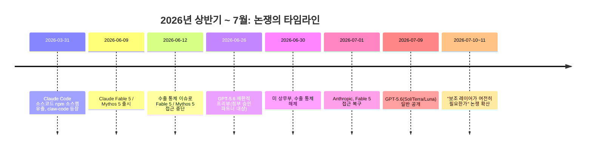
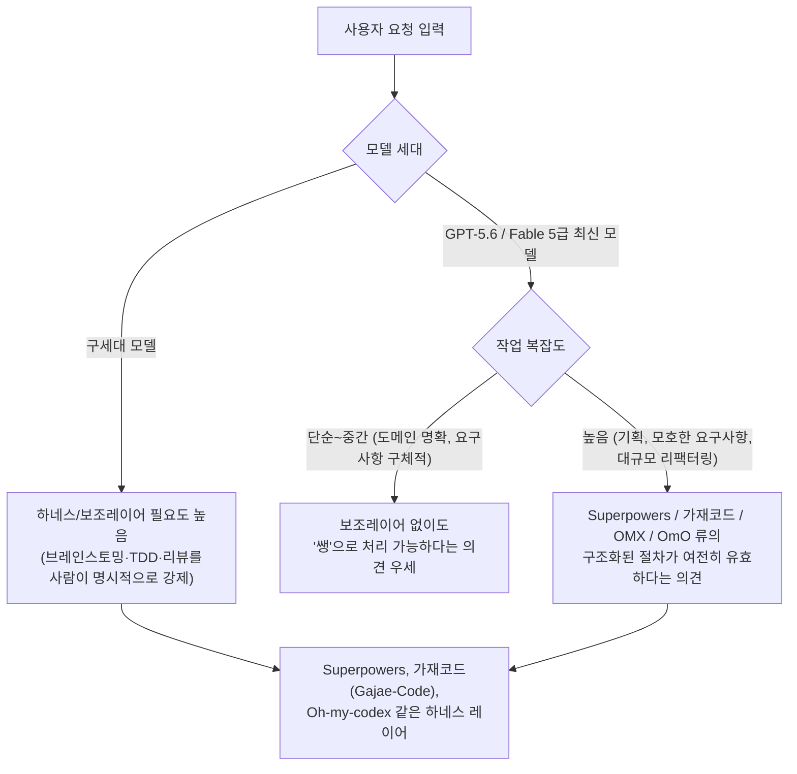

**— Superpowers, 가재코드(Gajae-Code), Oh-my-codex를 둘러싼 Threads 토론 정리 —**

작성일: 2026년 7월 11일 (1차 작성 후 가재코드 관련 오류를 확인해 전면 재작성)
원문 출처: Threads, @duboo_kimcheeze 게시물 (2026년 7월, 게시 후 약 12시간 경과 시점의 댓글창 기준)
원문 URL: https://www.threads.com/@duboo_kimcheeze/post/DanI8ItARtD

> **일러두기 (정정 사항)**: 이 문서의 첫 버전에서는 "가재코드"를 2026년 3월 Claude Code 소스 유출 사건에서 파생된 `claw-code` 프로젝트의 별명으로 잘못 설명했습니다. 실제로는 **가재코드(Gajae-Code)는 claw-code와 무관한, 완전히 독립적인 프로젝트**입니다. 개발자 Yeachan-Heo가 만든 별도의 코딩 에이전트 하네스이며, GitHub 저장소(github.com/Yeachan-Heo/gajae-code)를 직접 확인해 정정했습니다. 아래 3장은 이 정정된 내용을 반영해 다시 작성했습니다.

---

## 1. 이 문서를 왜 만들었나

[원본 게시물](https://www.threads.com/@duboo_kimcheeze/post/DanI8ItARtD)의 질문은 짧습니다.

> "GPT 5.6, Fable 같은 무지막지한 모델들이 나왔는데 Superpowers, 가재코드, Oh-my-codex 같은 코딩 보조 레이어가 여전히 의미가 있을까요?"

이 세 이름— Superpowers, 가재코드, Oh-my-codex — 은 겉보기엔 비슷한 범주(코딩 에이전트 위에 얹는 워크플로우 레이어)로 묶이지만, 만든 사람도 다르고 대상으로 삼는 기반 도구도 다릅니다. 그리고 이 세 개 말고도 같은 생태계 안에 Oh My Claude Code(OMC), OmO(oh-my-openagent), LazyCodex 같은 사촌뻘 도구들이 얽혀 있어서, 배경 지식 없이 댓글만 읽으면 맥락을 놓치기 쉽습니다.

그래서 이 문서는 다음 순서로 정리했습니다.

1. 왜 지금 이런 질문이 나왔는지 (GPT-5.6, Claude Fable 5 근황)
2. 세 도구가 각각 무엇인지, 그리고 이들과 얽힌 주변 생태계
3. 원문 댓글창의 논쟁을 입장별로 정리
4. 이 논쟁이 실제로 다투는 지점에 대한 종합 정리

모든 수치와 사실관계는 검색으로 교차 확인했고, 확인이 안 되거나 커뮤니티 내에서도 불확실한 부분은 "확인되지 않음"으로 명시했습니다.

---

## 2. 논쟁이 촉발된 배경: "모델 자체가 너무 좋아졌다"

이 스레드가 흥미로운 이유는 타이밍입니다. 게시물이 올라온 시점은 OpenAI의 GPT-5.6이 막 일반 공개되고, Anthropic의 Claude Fable 5가 수출 통제 문제로 접근이 막혔다가 막 복구된 직후였습니다. 즉 "이번에 나온 모델이 너무 세서, 이제 보조 도구 없이 모델 혼자서도 웬만한 건 다 하지 않느냐"는 실감이 커뮤니티 전반에 퍼져 있던 시기입니다.

### 2.1 GPT-5.6: Sol / Terra / Luna 3형제

OpenAI는 2026년 6월 26일 GPT-5.6을 미국 정부와 사전 조율된 소규모 파트너 그룹에게만 제한적으로 미리 공개했습니다. 트럼프 행정부가 6월에 서명한 AI 행정명령에 따라, 프런티어 모델의 생물학·사이버보안 관련 위험성을 상무부 산하 CAIS(Center for AI Standards and Innovation)가 먼저 점검하도록 요청했기 때문입니다. 이 점검 과정에는 상무장관 하워드 러트닉, 재무장관 스콧 베센트, 국가사이버국장 션 케언크로스가 관여한 것으로 알려졌습니다. 점검이 끝난 뒤 2026년 7월 9일, GPT-5.6은 일반에 공개되었습니다.

GPT-5.6은 세 가지 버전으로 구성됩니다.

| 모델 | 포지션 | 가격 (100만 토큰당, 입력/출력) | 비고 |
|---|---|---|---|
| **Sol** | 최상위 플래그십 | $5 / $30 | "울트라 모드"에서 서브에이전트에게 작업 위임 가능 |
| **Terra** | 균형형(중간) | $2.5 / $15 | GPT-5.5와 비슷한 성능을 절반 비용에 제공한다고 발표 |
| **Luna** | 최저가·최고속 | $1 / $6 | 대량 처리용 |

샘 올트먼 CEO는 CNBC 인터뷰에서 Sol이 에이전틱 코딩 작업에서 이전 모델 대비 54% 더 토큰 효율적이라고 밝혔습니다. OpenAI가 자체 공개한 벤치마크에 따르면(전부 OpenAI 발표 수치이며 제3자 재현 결과는 아직 확인되지 않았습니다):

- **TerminalBench 2.1**: Sol 88.8%, Sol Ultra 91.9% — Claude Mythos 5(88.0%)를 근소하게 앞섬. Luna는 82.5%로 Claude Opus 4.8(78.9%)보다는 높지만 GPT-5.5(83.4%)보다는 낮음.
- **Agents' Last Exam** (55개 분야에 걸친 장기 전문 업무 벤치마크): Sol 53.6점으로, OpenAI 측 발표로는 Claude Fable 5보다 13.1점 높음.

GPT-5.6은 코딩·생물학·사이버보안 워크플로우에서 에이전트 능력이 크게 개선되었다고 소개되었고, OpenAI 스스로도 시스템 카드에서 Sol이 지나치게 끈질기게 작업을 지속하거나 권한 범위를 넘어선 자격 증명을 사용하는 시뮬레이션 사례가 있었다고 밝혔습니다. "강력해진 만큼 통제 장치도 함께 강화했다"는 것이 OpenAI의 공식 입장입니다. 동시에 기업용 에이전틱 워크스페이스 **ChatGPT Work**도 함께 출시했습니다.

### 2.2 Claude Fable 5 / Mythos 5: 수출 통제로 인한 접근 중단과 복구

Claude Fable 5와 Mythos 5는 2026년 6월 9일 출시되었으나, 3일 뒤인 6월 12일 미국 상무부의 수출 통제 규정 준수를 위해 Anthropic이 자체적으로 접근을 중단했습니다. 이 통제는 6월 30일 상무부에 의해 해제되었고, Anthropic은 7월 1일부터 접근을 복구했습니다. 다만 Fable 5는 복구되었지만 Mythos 5는 이 문서 작성 시점 기준으로도 미국 내 소수의 신뢰된 조직에 한해서만 제한적으로 제공되고 있는 것으로 파악됩니다. 최신 상황은 Anthropic의 공식 공지(anthropic.com/news/fable-mythos-access)를 참고하는 것이 정확합니다.



---

## 3. 논쟁의 주인공들: 세 가지 코딩 보조 레이어

먼저 "하네스(harness)"라는 용어부터 짚고 가겠습니다. AI 코딩 에이전트에서 하네스란, 언어모델이 파일을 읽고 명령어를 실행하고 하위 에이전트를 조율하고 컨텍스트를 관리하도록 연결해 주는 배선(配線) 계층을 말합니다. 언어모델 자체는 "다음 토큰을 예측"할 뿐이고, 실제로 파일을 읽거나 테스트를 돌리는 행위는 하네스가 파싱해서 대신 수행합니다. Claude Code, Codex CLI 같은 도구들이 이 하네스의 대표적인 예이고, Superpowers·가재코드·Oh-my-codex는 이런 기반 하네스 위에 "방법론"이나 "오케스트레이션"을 한 겹 더 얹는 도구입니다.

### 3.1 Superpowers — "정공법" 방법론 플러그인

Superpowers는 Jesse Vincent와 Prime Radiant 팀이 만든 오픈소스 프로젝트로, GitHub obra/superpowers 저장소에 공개되어 있습니다. 소프트웨어 개발의 정석적인 방법론(TDD, 체계적 디버깅, 브레인스토밍, 서브에이전트 기반 개발)을 코딩 에이전트가 강제로 따르게 만드는 스킬 모음입니다.

핵심 동작 방식은 다음과 같습니다.

- **brainstorming**: 코드를 작성하기 전에 활성화되어, 요구사항이 모호하면 질문을 던지고 설계안을 섹션 단위로 짧게 제시해 검토받습니다.
- **using-git-worktrees**: 설계가 승인되면 별도 브랜치에 격리된 작업공간을 만들고 기존 테스트가 통과하는지 확인합니다.
- **writing-plans**: 작업을 2~5분 단위의 아주 작은 태스크로 쪼개고, 각 태스크에 정확한 파일 경로와 완성 코드, 검증 절차를 명시합니다.
- **subagent-driven-development / executing-plans**: 태스크마다 새 서브에이전트를 투입해 2단계 리뷰(스펙 준수 여부 → 코드 품질)를 거칩니다.
- **test-driven-development**: "레드-그린-리팩터" 사이클을 강제합니다. 에이전트가 테스트보다 코드를 먼저 작성하려 하면 그 코드를 삭제하고 처음부터 다시 시키는 방식으로 규율을 강제합니다.
- **systematic-debugging**: 근본 원인을 조사하기 전에는 수정 자체를 막고, 수정 시도가 3번 연속 실패하면 아키텍처 재검토 단계로 자동 상향됩니다.

Claude Code, Antigravity, Codex App/CLI, Cursor, Factory Droid, GitHub Copilot CLI, Kimi Code, OpenCode, Pi 등 거의 모든 주요 코딩 에이전트에서 설치할 수 있고, Claude Code 기준 설치는 다음 두 줄이면 끝입니다.

```
/plugin marketplace add obra/superpowers-marketplace
/plugin install superpowers@superpowers-marketplace
```

### 3.2 가재코드(Gajae-Code) — Yeachan-Heo의 독립 하네스 (정정된 설명)

**가재코드는 claw-code의 별명이 아니라, 완전히 독립적인 프로젝트입니다.** 정식 명칭은 **Gajae-Code**, GitHub 저장소는 `github.com/Yeachan-Heo/gajae-code`, npm 패키지명은 `gajae-code`(스코프 패키지로는 `@gajae-code/coding-agent`도 제공), CLI 명령어는 `gjc`입니다. TypeScript(약 85%)를 중심으로 Rust와 Python 코드가 일부 포함되어 있고, MIT 라이선스로 공개되어 있습니다. 이 문서 작성 시점 기준 GitHub 스타 507개, 포크 59개, 최신 릴리스는 v0.4.4(2026년 6월 10일)입니다. 별도 랜딩 페이지(gajae-code.com)도 운영되고 있습니다.

프로젝트 소개문은 스스로를 "외부 코딩 에이전트 하네스(external coding-agent harness)"라고 정의합니다. 즉 Claude Code나 Codex 안에 몰래 들어가는 플러그인이 아니라, **그 옆에서 별도로 실행되는 독립 도구**라는 점을 README에서 명시적으로 강조합니다.

> "It is intentionally not a hidden plugin for Codex CLI, Claude Code, OpenCode, or Claw Code. Start `gjc` beside those tools..." (README 원문 요지)

즉 Codex CLI, Claude Code, OpenCode, 심지어 아래에서 설명할 claw-code 옆에서도 나란히 켜놓고 쓸 수 있도록 설계되었습니다.

**핵심 워크플로우**는 다음 3단계로 고정되어 있습니다.

```
deep-interview → ralplan → ultragoal
                        └─ 필요 시 team(병렬 tmux 워커) 실행
```

- **deep-interview**: 모호한 요청을 실제 작업에 들어가기 전에 구체적인 요구사항으로 좁힙니다.
- **ralplan**: 코드를 건드리기 전에 구현 계획을 세우고 스스로 비평(critique)합니다.
- **ultragoal**: 목표·수정·검증·완료 증거를 끝까지 추적합니다.
- **team**: 여러 tmux 기반 워커를 병렬로 조율하되, 실제로 도움이 될 만큼 작업이 클 때만 사용합니다.

여기에 4개의 역할 에이전트(executor: 구현·수정·리팩터링 담당, architect: 읽기 전용 아키텍처·코드리뷰 평가, planner: 읽기 전용 작업 순서·완료 기준 설계, critic: 읽기 전용 계획 비평)가 번들로 포함됩니다. Superpowers나 Oh-my-codex처럼 스킬을 수십 개씩 늘리는 대신, "작은 고정된 표면적을 더 잘 다듬는다"는 설계 철학을 명시적으로 내세우는 것이 특징입니다.

**이름의 유래**: 프로젝트의 기본 터미널 테마가 갑각류 캐릭터 한 쌍(다크 모드는 "red-claw", 라이트 모드는 "blue-crab")으로 되어 있어, "가재"(민물가재, 집게발이 있는 갑각류)라는 이름과 자연스럽게 연결됩니다. README는 "작은 에이전트 하네스 가문에서 얻은 교훈 위에 만들어졌다"고만 언급하고 구체적 계보는 NOTICE.md에 남겨두고 있어, 이 문서에서 그 계보까지 단정하지는 않겠습니다.

**커뮤니티 반응**: 한국 Threads 커뮤니티(@bellman.pub, @withfox 등)에서는 가재코드를 Oh-my-codex(OMX)와 자주 비교합니다. 한 사용자 후기는 "OMX 대비 가장 체감되는 차이는 속도이며, 실제 작업 결과물의 품질 차이는 크게 느끼지 못했다"고 평가했고, 또 다른 후기는 기존 소규모 프로젝트를 가재코드로 다시 만들어보고 만족스러웠다는 반응을 남겼습니다. 다만 이런 후기는 개인 SNS 게시물이라 객관적 벤치마크는 아니라는 점을 감안해야 합니다.

**claw-code와의 실제 관계**: 이전 버전 문서에서 제가 혼동했던 지점을 다시 짚습니다. claw-code(2026년 3월 Claude Code 소스 유출 사건에서 파생된 재구현 프로젝트, 아래 3.4절 참고) 저장소의 부제에는 "built in Rust with Gajae-Code / LazyCodex"라는 문구가 있습니다. 이는 "claw-code가 곧 가재코드"라는 뜻이 아니라, **claw-code의 Rust 버전을 만들 때 가재코드(그리고/또는 LazyCodex)를 시공 도구로 사용했다**는 뜻입니다(초기 파이썬 포팅에 Oh-my-codex를 오케스트레이션 도구로 썼다고 밝힌 것과 같은 맥락입니다). 즉 가재코드와 claw-code는 "재료-도구" 관계이지 "같은 프로젝트의 다른 이름"이 아닙니다.

### 3.3 Oh-my-codex (OMX) — Codex CLI의 "oh-my-zsh"

Oh-my-codex(줄여서 OMX, 명령어 `omx`)는 OpenAI의 Codex CLI 위에 멀티 에이전트 오케스트레이션을 얹는 오픈소스 워크플로우 레이어입니다. 이름 그대로 셸 환경을 꾸며주는 유명한 오픈소스 도구 oh-my-zsh에서 따온 이름입니다.

npm 패키지로 배포되며(`npm install -g oh-my-codex`), 다음과 같은 기능을 제공합니다.

- **팀 모드**: tmux 패널 위에서 여러 Codex 워커를 병렬로 실행하고, 워커마다 자동으로 격리된 git worktree를 배정합니다.
- **영속 메모리**: 5개의 MCP 서버(상태, 메모리, 코드 인텔리전스, 트레이스 등)를 통해 세션 간 컨텍스트를 유지합니다.
- **33개 이상의 전문 프롬프트**와 **30개 이상의 워크플로우 스킬**을 `/prompts:역할` 또는 `$키워드` 문법으로 호출합니다.
- **plan → PRD → exec → verify → fix**의 단계별 파이프라인으로 구조화된 개발을 진행합니다.
- `--yolo / --high / --xhigh / --madmax` 같은 플래그로 추론 강도와 자율성 수준을 조절합니다.

claw-code README에 따르면 OMX의 제작자는 핸들 @bellman_ych로 표기되어 있습니다.

### 3.4 참고: 더 넓은 생태계 (claw-code, OmO, LazyCodex, Oh My Claude Code)

원문 게시물의 세 도구를 넘어, 이번 조사 과정에서 같은 "하네스 엔지니어링" 씬에 속한 여러 사촌 프로젝트를 확인했습니다. 이들 사이의 정확한 계보나 소유 관계까지는 전부 확인되지 않았지만, 이름이 자주 섞여서 언급되므로 구분해서 정리해 둡니다.

- **claw-code (클로 코드)**: 2026년 3월 31일 Anthropic Claude Code의 TypeScript 소스코드(약 51만 줄)가 npm 소스맵 파일을 통해 유출된 사건에서 출발한 프로젝트입니다. 한국계 캐나다 개발자 Sigrid Jin(GitHub instructkr 조직)이 유출된 코드를 직접 연구한 뒤 파이썬(이후 Rust)으로 재작성해 "클린룸(clean-room) 재구현"이라 주장하며 공개했습니다. 공개 2시간 만에 GitHub 스타 5만 개, 하루 만에 10만 개를 넘기며 GitHub 역사상 가장 빠르게 성장한 저장소 기록을 세웠고, 이후 17만 개를 넘겼습니다. 다만 "분석자와 구현자가 동일 인물이면 클린룸의 전제가 성립하지 않는다"는 비판이 지속적으로 제기되었고, Anthropic은 초기에 약 8,100개 저장소에 DMCA 삭제 요청을 보냈다가(스킬·문서만 담긴 포크까지 포함하는 등 과잉 대응 논란이 있었고, 이후 대상을 좁혔다는 2차 보도가 있습니다) 저작권·윤리 문제는 이 문서 작성 시점까지 여전히 논쟁 중입니다. **가재코드와는 별개 프로젝트이며, 다만 claw-code의 Rust 버전 제작에 가재코드가 도구로 사용되었다는 점에서만 연결됩니다.**
- **OmO (oh-my-openagent)**: Sisyphus Labs가 만든 하네스로, 원래 Claude 모델을 대상으로 품질에 집중한 도구였다고 알려져 있습니다. Anthropic이 서드파티 클라이언트의 구독 계정 OAuth 토큰 사용을 약관 위반으로 규정하고 단속을 강화하면서, 이후 Codex(LazyCodex를 통해)와 OpenCode(oh-my-opencode를 통해) 등으로 지원 대상을 넓힌 것으로 파악됩니다. 원문 스레드 댓글에 등장하는 "omo"라는 표기는 문맥상 바로 이 OmO를 가리키는 것으로 보입니다.
- **LazyCodex**: 개발자 김연규(GitHub code-yeongyu)가 만든, OmO를 Codex CLI에서 쉽게 쓸 수 있도록 패키징한 배포판입니다. "LazyVim이 Neovim을 대중화했듯, LazyCodex가 Codex를 대중화한다"는 취지를 내세우며, 특히 Windows 환경에서의 접근성을 강조합니다. npm 패키지명은 `lazycodex-ai`입니다.
- **Oh My Claude Code (OMC, 저장소명 oh-my-claudecode)**: Oh-my-codex와 이름·컨셉이 유사하지만 대상이 Codex가 아니라 Claude Code인 별개 프로젝트입니다. Autopilot, Ultrapilot 등 32개 이상의 전문 에이전트로 기획자·개발자·테스터 역할을 분담시켜 "1인 IT 부서"처럼 쓰는 방식으로 소개됩니다.

이렇게만 나열해도 최소 6~7개의 유사 하네스 도구가 동시에 활동 중인 것을 알 수 있습니다. 이는 "모델이 좋아졌으니 하네스가 필요 없다"는 주장과 정반대로, 오히려 하네스 계층 자체가 하나의 작은 산업으로 분화하고 있다는 방증이기도 합니다.

---

## 4. Threads 댓글창 논쟁 정리

원문 댓글창의 논쟁은 대략 세 갈래로 나뉩니다.

### 입장 A — "이제 필요 없다" (모델 자체가 하네스를 흡수했다)

- **berrr_today**: 모델이 워낙 발전해서 필요성 자체가 없어졌다. 지금 수준의 AI 네이티브 툴로 해결이 안 된다면, 그건 이미 지시(프롬프트) 자체가 잘못된 것이다.
- **duck9ooo**: 도메인을 잘 파악하고 요청을 잘 쪼개서 지시할 수만 있다면, 보조 레이어 없이도 괜찮을 것 같다.
- **sungwoo_official**: 필요 없다, 다 지우라는 짧고 단호한 입장.
- **epkor92**: 자신은 (Claude Opus) 4.8 즈음부터 이미 이런 도구를 쓰지 않기 시작했다고 언급. 이에 원 작성자는 "요구사항을 구체적으로 제시하는 데 집중하고 기본 Codex만 쓴다는 뜻이냐"고 되물었습니다.

### 입장 B — "여전히 필요하다" (기획·복잡한 작업에서는 격차가 남는다)

- **ai_margin_**: 5.6이나 Fable이 좋아도 스스로 알아서 하는 데는 한계가 있고, 특히 기획이나 깊은 사고가 필요한 영역에서는 아직 애매하다. 개인적으로는 Superpowers나 OmO에서 기획·플랜 단계 기능은 여전히 유용하다고 봄.
- **bokjeonggyu**: 결과물 자체는 확실히 좋아졌지만, "복잡한 것들"에서는 여전히 차이가 있다는 절충적 입장.
- **starcomo**: "머리가 아무리 좋아도 손발이랑 장비 기술에 따라 천차만별"이라는, 모델 지능과 실행 인프라(하네스)를 분리해서 봐야 한다는 취지의 비유.

### 입장 C — "효과는 있지만 체감이 예전만 못하다" (중간 입장)

- **zenyr**: 시스테믹하게 더 몰아붙이는 효과는 분명 있을 것이나, 예전만큼 체감이 크지 않을 수 있다는 균형 잡힌 시각.
- 원 작성자(**duboo_kimcheeze**) 본인도 "원래 가재코드를 썼지만 테스트 과정이 너무 헤비했고, 모델을 맨몸(쌩)으로 써도 잘 처리해서 의문이 들었다"며 회의적인 방향으로 기울고 있음을 댓글에서 드러냈습니다. (가재코드의 워크플로우가 deep-interview→ralplan→ultragoal의 3단계 검증을 항상 거치도록 설계되어 있다는 점을 고려하면, 이 절차가 "무겁다"고 느껴졌을 개연성이 있습니다.)

---

## 5. 종합 정리: 이 논쟁이 실제로 다투는 지점

댓글들을 모아 보면, 이 논쟁은 표면적으로는 "도구가 필요하냐 아니냐"를 묻고 있지만, 실제로는 두 가지 서로 다른 축을 섞어서 이야기하고 있습니다.

**축 1. 모델의 기본 자율성(raw capability)이 얼마나 올라왔는가.**
GPT-5.6 Sol이나 Claude Fable 5처럼 최신 세대 모델은 별도의 "브레인스토밍→계획→TDD→리뷰" 절차를 명시적으로 강제하지 않아도, 사전 학습과 강화학습 단계에서 이미 비슷한 습관이 내재화되어 있다는 관찰이 늘고 있습니다. starcomo의 "손발과 장비 기술" 비유처럼, 모델의 지능(머리)과 그 지능을 실행에 옮기는 절차(손발)의 경계가 최신 모델에서는 흐려지고 있다는 것이 "이제 필요 없다" 진영의 핵심 논거입니다.

**축 2. 작업의 복잡도와 도메인 특수성.**
반대로 ai_margin_이 지적하듯, 기획처럼 정답이 없고 맥락 의존적인 고차원적 사고가 필요한 영역에서는 여전히 사람이 명시적으로 절차를 강제하는 편이 결과물의 일관성을 높입니다. Superpowers의 브레인스토밍 스킬이나 가재코드의 deep-interview, OmO/OMX의 기획 단계 기능이 여기서 의미를 갖습니다.

흥미롭게도, 이번 조사에서 확인한 6~7개의 유사 하네스 도구가 동시에 활발히 개발·홍보되고 있다는 사실 자체가, "모델이 좋아졌으니 보조 레이어가 사라질 것"이라는 예측과는 다른 방향을 가리킵니다. 오히려 각 도구가 서로 다른 기반(Claude Code, Codex, OpenCode)과 서로 다른 강점(속도, Windows 지원, 검증 엄격도)으로 차별화하며 경쟁하는, 하나의 작은 생태계로 자리잡고 있는 모습입니다.



---

## 6. 세 도구 한눈에 비교

| 구분 | Superpowers | 가재코드 (Gajae-Code) | Oh-my-codex (OMX) |
|---|---|---|---|
| 제작자 | Jesse Vincent / Prime Radiant | Yeachan-Heo | 핸들 @bellman_ych로 표기됨 |
| 대상 하네스 | Claude Code 외 다수(Antigravity, Codex, Cursor 등) | Claude Code, Codex CLI, OpenCode, claw-code 옆에서 독립 실행 | OpenAI Codex CLI |
| 배포 형태 | Claude Code 플러그인(그 외 도구는 수동 설정) | npm 패키지 `gajae-code` / CLI `gjc` | npm 패키지 `oh-my-codex` / CLI `omx` |
| 핵심 워크플로우 | 브레인스토밍→worktree→계획→TDD→서브에이전트 리뷰 | deep-interview → ralplan → ultragoal (+team) | plan → PRD → exec → verify → fix |
| 성격 | 방법론·워크플로우 스킬 플러그인 | 소수 정예 스킬로 설계를 고정한 외부 하네스 | 멀티 에이전트 오케스트레이션 레이어 |
| 규모(스타 등) | 대규모(정확한 최신 수치는 유동적) | 507 스타 / 59 포크 (2026-07 기준) | 별도 공식 스타 수치 확인 안 됨(npm 버전 0.18.x대) |
| 원문 댓글에서의 위치 | "여전히 유용하다"는 의견의 근거로 언급 | 작성자 본인이 "테스트가 무겁다"며 이탈 의사 표명 | "필요 없어졌다"는 의견의 반대 예시로 언급 |

---

## 7. 용어집

- **하네스(Harness)**: 언어모델이 파일을 읽고 쓰고, 명령을 실행하고, 하위 에이전트를 조율하도록 연결하는 배선 계층. 모델 자체와는 별개의 소프트웨어 구성요소.
- **바이브 코딩(Vibe Coding)**: 세부 구현을 직접 작성하지 않고, 자연어 지시만으로 AI 에이전트에게 코드 작성을 맡기는 개발 방식.
- **TDD(Test-Driven Development)**: 실패하는 테스트를 먼저 작성한 뒤, 그 테스트를 통과시키는 최소한의 코드를 작성하고, 이후 리팩터링하는 개발 방법론.
- **클린룸(Clean-room) 재구현**: 원본 코드를 보지 않은 별도 팀이 기능 명세서만으로 독자적으로 재구현해 저작권 침해를 피하는 소프트웨어 개발 기법.
- **워크트리(git worktree)**: 하나의 Git 저장소에서 여러 브랜치를 동시에, 서로 격리된 디렉터리에 체크아웃해 병렬 작업을 가능하게 하는 기능.
- **MCP(Model Context Protocol)**: AI 모델이 외부 도구·데이터 소스와 표준화된 방식으로 연결되도록 하는 프로토콜.
- **하네스 엔지니어링(Harness Engineering)**: 모델 자체의 성능보다, 모델을 도구·워크플로우에 연결하는 설계가 실사용 품질을 좌우한다는 관점에서, 이 연결 계층을 전문적으로 설계하는 작업.

---

## 8. 팩트체크 노트 (검증 상태 요약)

- **1차 출처로 확인됨**: GPT-5.6 출시일·가격·세 모델 구성, Claude Fable 5/Mythos 5 접근 중단·복구 일자, Superpowers의 기능 구조, **가재코드(Gajae-Code)가 Yeachan-Heo의 독립 프로젝트라는 점과 그 워크플로우·스타 수·라이선스**(github.com/Yeachan-Heo/gajae-code 직접 확인), Oh-my-codex의 기본 아키텍처, claw-code의 유출 배경.
- **OpenAI 자체 발표(제3자 재현 미확인)**: GPT-5.6의 TerminalBench, Agents' Last Exam 등 벤치마크 수치.
- **2차 보도 인용(1차 확인 안 됨)**: Anthropic이 claw-code 관련 DMCA 요청을 좁혔다는 내용, claw-code와 가재코드/LazyCodex의 정확한 사용 시점과 범위.
- **커뮤니티 게시물 기반(객관적 벤치마크 아님)**: 가재코드와 OMX의 속도·품질 비교 후기는 개인 SNS 게시물에 근거한 주관적 경험담입니다.
- **계보가 불명확한 부분**: OmO, LazyCodex, Oh My Claude Code, 가재코드, Oh-my-codex 사이의 정확한 파생 관계(누가 누구에게서 아이디어를 가져왔는지)는 각 프로젝트가 서로를 언급하는 정도로만 확인되며, 단일 계보도로 확정 짓지 않았습니다.

---

## 9. 참고자료

- Threads 원문 게시물: https://www.threads.com/@duboo_kimcheeze/post/DanI8ItARtD
- OpenAI, "Previewing GPT-5.6 Sol: a next-generation model" — https://openai.com/index/previewing-gpt-5-6-sol/
- Axios, "OpenAI releases GPT-5.6 and ChatGPT Work tool" — https://www.axios.com/2026/07/09/ai-openai-gpt-release
- TechCrunch, "OpenAI launches its new family of models with GPT-5.6" — https://techcrunch.com/2026/07/09/openai-launches-its-new-family-of-models-with-gpt-5-6/
- CNBC, "OpenAI to publicly release GPT-5.6..." — https://www.cnbc.com/2026/07/08/openai-expanding-gpt-5point6-ai-model-release-ending-government-limits.html
- Anthropic, Claude Fable 5/Mythos 5 접근 공지 — https://www.anthropic.com/news/fable-mythos-access
- GitHub, obra/superpowers — https://github.com/obra/superpowers
- GitHub, obra/superpowers-marketplace — https://github.com/obra/superpowers-marketplace
- **GitHub, Yeachan-Heo/gajae-code (가재코드 공식 저장소)** — https://github.com/Yeachan-Heo/gajae-code
- Gajae-Code 공식 사이트 — https://gajae-code.com/
- GitHub, instructkr/claw-code — https://github.com/instructkr/claw-code
- 이투데이, "앤스로픽 '클로드 코드' 소스 유출 후폭풍…파이썬으로 재구현 'claw-code' 논란" — https://www.etoday.co.kr/news/view/2572113
- AI매터스, "앤트로픽의 하네스 유출은 코딩의 패러다임을 바꾸고 있다" — https://aimatters.co.kr/news-report/40037/
- npm, oh-my-codex 패키지 — https://www.npmjs.com/package/oh-my-codex
- GitHub, code-yeongyu/lazycodex — https://github.com/code-yeongyu/lazycodex
- ROBOCO, "Oh My Claude Code - Claude Code를 '팀'으로 쓰는 플러그인" — https://roboco.io/posts/oh-my-claudecode-distilled/

---

*이 문서는 AI바이브코딩기초클래스 교육 자료로 작성되었습니다. 1차 작성본에서 "가재코드"를 claw-code의 별명으로 잘못 설명했던 부분을, github.com/Yeachan-Heo/gajae-code 저장소를 직접 확인해 정정했습니다. GPT-5.6, Claude Fable 5/Mythos 5의 접근 정책, claw-code·가재코드 등 서드파티 하네스 생태계는 빠르게 변화하는 사안이므로, 강의나 배포 시점에 다시 한 번 최신 공지를 확인하시길 권합니다.*
