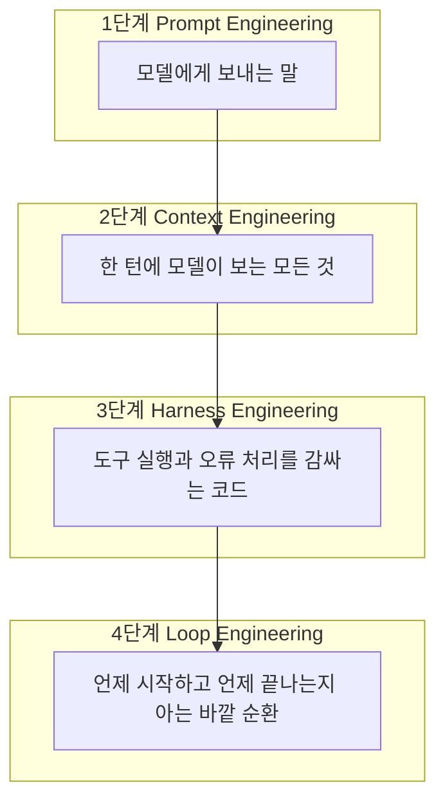
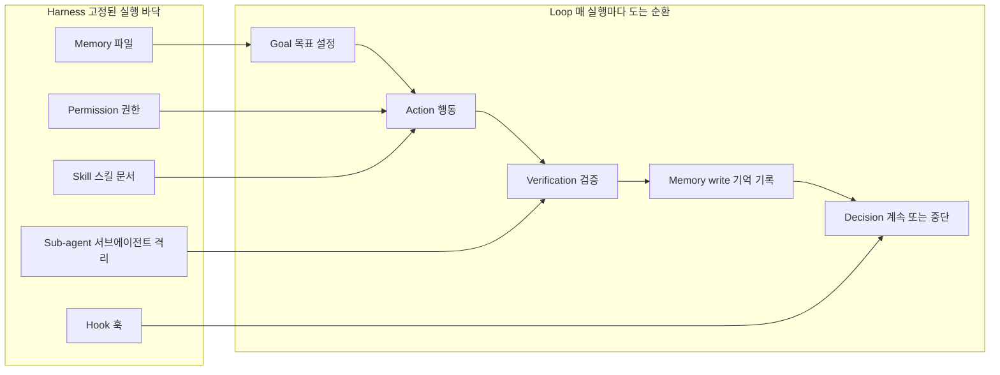
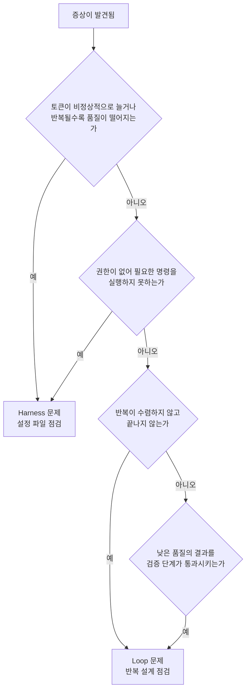

## 들어가며

에이전트를 다루는 사람들 사이에서 "내 에이전트 설정"이라는 말은 실제로는 서로 다른 두 개의 시스템을 뭉뚱그려 가리키는 경우가 많다. 하나는 프로젝트가 반복해서 쓰는 실행 바닥이고, 다른 하나는 그 바닥 위에서 매번 새로 도는 순환이다. 앞의 것을 Harness, 뒤의 것을 Loop라고 부른다. 이 문서는 두 레이어를 구분해야 하는 이유와, 각 레이어가 실제로 무엇으로 구성되는지, 그리고 왜 순서상 Harness가 먼저이고 Loop가 그다음이어야 하는지를 최근 자료를 근거로 정리한다.

이 구분은 특정 개인의 직관만은 아니다. 2026년 상반기 들어 하네스 엔지니어링과 루프 엔지니어링이라는 용어가 별도의 실무 담론으로 분리되어 정착되는 흐름이 관측된다. Claude Code를 이끄는 Anthropic의 Boris Cherny는 더 이상 Claude에게 직접 프롬프트를 입력하지 않고, Claude에게 무엇을 할지 지시하는 루프를 짜는 것이 자신의 일이 되었다고 밝힌 바 있다. 비슷한 시기에 개발자 Peter Steinberger도 코딩 에이전트에게 더 이상 직접 프롬프트를 입력할 게 아니라 에이전트에게 프롬프트를 넣어주는 루프를 설계해야 한다는 취지의 발언을 했다. 이 두 발언은 엔지니어링 블로거 Addy Osmani가 2026년 6월 7일에 쓴 "Loop Engineering" 글에서 인용되었고, 이 문서에서도 그 출처를 명시해 인용한다.

---

## 1. Harness란 무엇인가 — 바뀌지 않는 실행 바닥

Harness는 모델 자체를 뺀 나머지 전부를 가리킨다. 이 정의를 처음 명료하게 정리한 사람은 Harness Engineering이라는 용어를 만든 것으로 알려진 Viv Trivedy다. 그는 "에이전트 = 모델 + 하네스. 당신이 모델이 아니라면, 당신이 하네스다"라는 한 줄로 이 개념을 요약했다. 원시 모델 자체는 에이전트가 아니다. 모델에게 상태, 도구 실행 능력, 피드백 루프, 강제 가능한 제약을 부여하는 순간 비로소 에이전트가 된다는 것이 이 정의의 핵심이다.

구체적으로 Harness에 포함되는 것들은 다음과 같다. 시스템 프롬프트와 CLAUDE.md, AGENTS.md 같은 규칙 파일, 도구와 스킬과 MCP 서버 정의, 파일시스템·샌드박스·브라우저 같은 번들 인프라, 서브에이전트 소환과 모델 라우팅 같은 오케스트레이션 로직, 결정론적 실행을 위한 훅과 미들웨어, 그리고 로그·트레이스·비용 계측 같은 관찰 가능성 체계다. 이 모든 것은 실행할 때마다 새로 만들어지는 것이 아니라, 프로젝트가 반복해서 쓰는 기준과 경계로서 미리 깔려 있다.

Claude Code라는 구체적인 제품을 놓고 보면 Harness는 통상 다섯 개 층으로 나뉜다. 개발자 커뮤니티에서 이 분해를 가장 체계적으로 정리한 자료 중 하나가 ShipWithAI의 하네스 엔지니어링 가이드다.

| 레이어 | 역할 | Claude Code에서의 실체 |
|---|---|---|
| Memory | 에이전트가 항상 알고 있는 것 | CLAUDE.md, MEMORY.md |
| Tools | 에이전트가 닿을 수 있는 것 | MCP 서버, 내장 도구 |
| Permissions | 허용된 행동의 범위 | settings.json의 permissions 블록 |
| Hooks | 런타임에 강제되는 것 | PreToolUse, PostToolUse 등 이벤트 훅 |
| Observability | 사후에 확인할 수 있는 것 | 세션 로그, 비용 추적 |

이 다섯 층 가운데 가장 강력한 것은 Hooks다. 공식 문서와 여러 실무 가이드가 공통으로 지적하는 사실은, CLAUDE.md에 적어둔 지시는 결국 모델의 판단에 따라 우회될 수 있는 반면, PreToolUse 훅이 종료 코드 2를 반환하면 해당 도구 호출은 조건 없이 차단된다는 점이다. 이는 요청이 아니라 강제다. 프롬프트로 "이 명령은 절대 실행하지 마"라고 적어두는 것과, 훅이 물리적으로 그 실행을 막는 것은 신뢰 수준이 다르다.

이 구분이 왜 중요한지는 실증 데이터로도 뒷받침된다. LangChain은 2026년 2월 블로그에서, 동일한 모델을 그대로 둔 채 하네스만 바꿔서 Terminal Bench 2.0 점수를 52.8%에서 66.5%로, 즉 13.7포인트를 끌어올렸다고 밝혔다. 모델은 그대로였고 순수하게 구조 변경만으로 얻은 상승폭이었다. 이 개선의 상당 부분은 에이전트가 자기 작업을 완료로 표시하기 전에 스스로 점검하게 만드는 검증 미들웨어에서 나왔다고 한다. 비슷한 맥락에서 Addy Osmani는 2026년 4월 19일 자 글에서, Viv Trivedy의 팀이 하네스만 교체해 코딩 에이전트를 Terminal Bench 순위 30위권에서 5위권으로 끌어올린 사례를 소개했다. 같은 Claude Opus 4.6 모델이라도 Claude Code 안에서 도는 것과 커스텀 하네스 안에서 도는 것 사이에 점수 차이가 크게 벌어졌다는 것이 그 요지다.

이런 사례들이 공통으로 말하는 것은 하나다. 모델을 바꾸기 전에 하네스부터 점검하라는 것이다. AI 인프라 스타트업 HumanLayer는 이를 "모델 문제가 아니라 설정 문제"라는 말로 압축했다. 에이전트가 이상한 행동을 하면 그 실패는 대개 다음 방식으로 구체적으로 짚을 수 있다. 에이전트가 어떤 프로젝트 관례를 몰랐다면 AGENTS.md에 추가한다. 에이전트가 파괴적인 명령을 실행했다면 이를 막는 훅을 추가한다. 에이전트가 40단계짜리 작업 중간에 길을 잃었다면 계획자와 실행자로 역할을 쪼갠다. 에이전트가 깨진 코드를 완료라고 우기면 타입체크 결과를 루프에 되먹임하는 장치를 넣는다. 이렇게 한 번 겪은 실패를 영구적인 규칙으로 바꿔 나가는 습관을, Osmani는 "래칫(ratchet)"이라고 부른다. 좋은 AGENTS.md의 모든 줄은 과거에 실제로 벌어진 특정 실패로 거슬러 올라갈 수 있어야 한다는 것이다.

---

## 2. Loop란 무엇인가 — 매번 새로 도는 반복

Harness가 바뀌지 않는 바닥이라면, Loop는 그 바닥 위에서 실행될 때마다 도는 순환이다. 목표(Goal)를 세우고, 행동(Action)을 하고, 검증(Verification)을 거치고, 기억을 남기고(Memory write), 계속할지 멈출지 판단(Decision)하는 다섯 단계가 한 바퀴를 이룬다.

Loop Engineering을 하나의 독립된 실천 영역으로 명명하고 다섯 가지 구성요소로 정리한 것 역시 Addy Osmani다. 그의 분해에 따르면 루프는 다섯 개의 조각과, 그 모든 것을 하나로 묶는 기억 장치 하나로 이루어진다.

| 구성요소 | 루프에서의 역할 | Claude Code에서의 실체 |
|---|---|---|
| Automations | 정해진 주기로 발견과 선별을 스스로 수행 | 스케줄된 작업, cron, `/loop`, 훅, GitHub Actions |
| Worktrees | 병렬로 도는 에이전트끼리 충돌 방지 | `git worktree`, `--worktree`, 서브에이전트의 `isolation: worktree` 설정 |
| Skills | 매번 다시 설명하지 않아도 되는 프로젝트 지식 | `.claude/skills/`의 `SKILL.md` |
| Plugins / Connectors | 실제로 쓰는 도구와의 연결 | MCP 서버, 플러그인 |
| Sub-agents | 만든 쪽과 확인하는 쪽을 분리 | `.claude/agents/`의 서브에이전트, 에이전트 팀 |
| State (여섯 번째, 척추) | 무엇이 끝났고 무엇이 남았는지 기록 | 마크다운 진행 파일, 연동된 이슈 트래커 |

이 여섯 번째 요소, 즉 상태 기록이 왜 중요한지를 Osmani는 이렇게 설명한다. 모델은 실행이 끝나면 그 사이에 있었던 일을 전부 잊는다. 그래서 기억은 대화창 안이 아니라 디스크 위에 있어야 한다는 것이다. 에이전트는 잊어도 저장소는 잊지 않는다.

Claude Code는 이 루프 개념을 두 가지 서로 다른 슬래시 명령으로 구현하고 있다. `/loop`는 정해진 시간 간격으로 프롬프트를 재실행하는 방식이고, `/goal`은 사용자가 적어둔 조건이 실제로 참이 될 때까지 계속 실행되는 방식이다. `/goal`에서 특히 눈여겨볼 지점은, 작업을 마쳤는지 판정하는 역할을 코드를 작성한 그 모델이 아니라 매 턴마다 별도로 호출되는 작은 모델이 맡는다는 점이다. 자기 숙제를 자기가 채점하지 않도록 설계되어 있다는 뜻이다. 이 원칙은 서브에이전트를 만드는 쪽과 검증하는 쪽으로 나누는 관행과 정확히 같은 논리를 공유한다. 코드를 작성한 모델은 자기 작업에 대해 지나치게 관대한 평가를 내리는 경향이 있기 때문에, 다른 지시사항을 가진, 때로는 다른 모델을 쓰는 두 번째 에이전트가 첫 번째 에이전트가 스스로를 설득해 넘어간 문제를 잡아낸다.

---

## 3. 두 레이어의 관계 — 왜 순서가 중요한가

주방과 레시피 비유는 단순한 수사가 아니라 실제 의존관계를 설명한다. 주방에 칼과 도마와 오븐이 없으면 아무리 정교한 레시피를 짜도 요리는 나오지 않는다. 반대로 주방이 완벽하게 갖춰져 있어도 레시피가 없으면 재료만 쌓여 있을 뿐 아무 일도 일어나지 않는다. 그런데 이 비유에서 놓치기 쉬운 지점이 하나 있다. 레시피를 짜는 사람은 주방에 무엇이 있는지 먼저 알아야 한다는 것이다. 오븐이 없는 주방을 상정하고 오븐 요리 레시피를 짜면, 요리사는 실제로 존재하지 않는 오븐을 상상해서 채워 넣는다.

Loop 안의 다섯 단계 각각은 Harness가 미리 정해둔 경계 안에서만 의미를 가진다. 권한(Permission)이 루프가 디스크에 실제로 쓸 수 있는지를 결정한다. 서브에이전트가 깨끗한 맥락에서 검증을 수행할 수 있는지는 Harness의 서브에이전트 격리 설정에 달려 있다. 스킬이 특정 작업에 맞게 루프를 전문화할 수 있는지는 Harness에 어떤 SKILL.md가 준비되어 있는지에 달려 있다. 훅이 루프가 원하는 시점에 실제로 발화되는지는 Harness의 훅 설정에 달려 있다.

이 결정들이 미리 잠겨 있지 않으면 Loop는 추측한다. 존재하지 않는 파일 경로를 가정하고, 등록되지 않은 명령을 호출하려 하고, 아무것도 검증하지 않는 통과 테스트를 스스로 만들어낸다. 이런 현상은 실제로 오픈소스 프로젝트에서도 경계 대상으로 명시되어 있다. Claude Code용 루프 엔지니어링 스킬 팩을 공개한 GitHub 저장소 dlmastery/loop_engineer는 저장소 최상단 원칙으로 "하네스를 먼저 준비하라, 준비되지 않은 저장소 위에서 도는 루프는 유령 문제를 '고친다'"는 문장을 명시하고 있다. 같은 저장소는 검증자가 곧 제작자여서는 안 된다는 원칙과, 모든 루프에는 비용 상한선과 강제 종료 스위치가 있어야 한다는 원칙도 함께 못박아 둔다.

독일 IT 컨설팅사 codecentric이 정리한 세 층위 진단 기준도 같은 결론에 도달한다. 에이전트가 단일 작업 하나를 안정적으로 끝내지 못한다면 문제는 Context Engineering, 즉 프롬프트와 입력 구조화에 있다. 에이전트가 작업은 끝내지만 프로젝트 고유의 품질 기준을 놓치거나 자기 실수를 스스로 알아채지 못한다면 Harness Engineering을 확장해야 한다. 가이드가 방향을 잡아주고(CLAUDE.md, 스펙, 템플릿), 센서가 결과를 점검해 자가 교정을 유도한다(린터, 아키텍처 테스트, 리뷰 에이전트). 그리고 에이전트가 몇 시간, 며칠 동안 사람이 매 단계 트리거하지 않아도 자율적으로 돌아야 한다면 그때 비로소 Loop Engineering을 도입한다. 이 세 층위는 서로를 대체하지 않고 서로 위에 쌓인다. 깨끗한 맥락이 없으면 아무리 좋은 하네스도 소용없고, 하네스가 없으면 어떤 루프도 돌지 않는다.

아래 다이어그램은 프롬프트 엔지니어링에서 시작해 루프 엔지니어링까지 네 층이 어떻게 순서대로 쌓이는지를 보여준다. 이 네 단계 구분과 "매년 하나씩 화두가 바뀌었다"는 서술은 codecentric의 정리를 따른 것이다.

다음 다이어그램은 Harness의 다섯 구성요소가 Loop의 다섯 단계 각각을 어떻게 가능하게 만드는지를 보여준다.

---

## 4. 진단표 — 어느 레이어의 문제인가

원문이 던진 핵심 통찰은 실패의 레이어에 이름을 붙이면 진단이 쉬워진다는 것이다. 진짜 버그가 권한 누락인데 프롬프트만 계속 고치는 낭비를 막을 수 있다. 이를 실무에서 바로 쓸 수 있는 체크리스트 형태로 정리하면 다음과 같다.

| 증상 | 원인이 있는 레이어 | 점검할 지점 |
|---|---|---|
| 토큰이 예상보다 크게 늘어난다 | Harness | Skill의 사전 로딩 범위, 컨텍스트 압축(compaction) 설정 |
| 프롬프트가 반복될수록 결과 품질이 떨어진다 | Harness | 컨텍스트 오염(context rot), 오래된 도구 출력의 오프로딩 여부 |
| 필요한 명령을 권한이 없어 실행하지 못한다 | Harness | settings.json의 permissions 블록 |
| 위험한 명령을 막아야 하는데 막지 못한다 | Harness | PreToolUse 훅과 종료 코드 2 설정 여부 |
| 반복이 수렴하지 않고 끝나지 않는다 | Loop | `/goal`의 종료 조건 서술, Decision 단계의 판단 기준 |
| 품질이 낮은 결과를 검증이 통과시킨다 | Loop | 제작자와 검증자가 같은 모델·같은 맥락을 쓰고 있는지 |
| 예약 실행이 시간이 지나며 목표를 벗어난다 | Loop | State 파일이 실제로 갱신되고 있는지, Goal 재확인 주기 |

이 표에서 강조할 점은, Harness 쪽 증상은 대체로 '무엇을 할 수 있는가'의 문제이고 Loop 쪽 증상은 '무엇을 언제까지 하는가'의 문제라는 것이다. 권한과 훅은 능력의 경계를 긋고, 목표와 검증과 판단은 그 능력을 얼마나 오래, 어떤 조건으로 반복할지를 결정한다.

아래는 이 진단 절차를 순서도로 정리한 것이다.

---

## 5. 실무 적용 순서

정리하면 실무에서 취해야 할 순서는 명확하다. Harness를 먼저 준비하고, Loop는 그다음에 설계한다.

Harness 준비 단계에서 확인해야 할 것은 다음과 같다. CLAUDE.md에 프로젝트 관례와 경계가 적혀 있는가. 권한 설정이 루프가 필요로 할 모든 쓰기 작업을 실제로 허용하는가. 파괴적인 명령을 막는 PreToolUse 훅이 최소 하나는 걸려 있는가. 서브에이전트를 격리된 맥락에서 실행할 수 있는 구조가 있는가. 검증에 쓸 스킬이나 테스트 도구가 실제로 등록되어 있는가.

이 바닥이 갖춰진 다음에야 Loop를 설계한다. 목표를 사람이 읽어도 판정 가능한 조건으로 적는다. 행동을 어떤 스킬과 도구로 수행할지 정한다. 검증을 제작자와 다른 주체가 맡도록 분리한다. 기억을 대화창이 아니라 디스크의 상태 파일에 남긴다. 그리고 계속할지 멈출지를 판단하는 기준과 최대 실행 횟수 또는 비용 상한을 명시적으로 정해 둔다.

이 순서를 거꾸로 하면, 즉 Loop부터 설계하고 나서 필요한 Harness 파일을 나중에 채워 넣으려 하면, 루프가 실행되는 동안 존재하지 않는 것을 계속 가정하게 되고 그 가정이 만들어내는 오류를 사후에 하나씩 땜질하게 된다. Harness가 먼저 정해져 있으면 Loop는 추측할 필요가 없어진다.

---

## 요약

Harness는 실행마다 바뀌지 않는 바닥이며, 권한·도구·훅·기억 파일·관찰 가능성으로 이루어져 에이전트가 무엇을 할 수 있고 없는지를 정한다. Loop는 그 바닥 위에서 매번 새로 도는 순환이며, 목표·행동·검증·기억 기록·판단의 다섯 단계로 이루어져 에이전트가 언제까지, 어떤 조건으로 반복할지를 정한다. 두 레이어를 분리해서 이름 붙이는 것은 취향의 문제가 아니라 진단 효율의 문제다. 실패가 능력의 경계에서 나는지 반복의 설계에서 나는지를 구분할 수 있어야, 프롬프트만 계속 고치다가 진짜 원인을 놓치는 일을 막을 수 있다. 그리고 그 설계 순서는 Harness가 먼저이고 Loop가 그다음이다.

---

## 참고 출처

- Addy Osmani, "Loop Engineering", 2026년 6월 7일, https://addyosmani.com/blog/loop-engineering/
- Addy Osmani, "Agent Harness Engineering", 2026년 4월 19일, https://addyosmani.com/blog/agent-harness-engineering/
- ShipWithAI, "Claude Code Harness Engineering: The Complete Guide", https://shipwithai.io/blog/claude-code-harness-engineering-guide/
- codecentric, "Loop, Harness, Context Engineering: The Terms Explained", https://www.codecentric.de/en/knowledge-hub/blog/loop-harness-context-engineering-explained
- GitHub, dlmastery/loop_engineer, https://github.com/dlmastery/loop_engineer
- GitHub, shareAI-lab/learn-claude-code, https://github.com/shareAI-lab/learn-claude-code
- Fareed Khan, "Building Claude Code with Harness Engineering", Level Up Coding, https://levelup.gitconnected.com/building-claude-code-with-harness-engineering-d2e8c0da85f0
- Claude Code 공식 문서, "Automate actions with hooks", https://code.claude.com/docs/en/hooks-guide

※ Claude Code의 $10억 연매출 관련 서술 등 일부 매체 보도는 Anthropic의 공식 발표가 아니라 제3자 매체의 추정치이므로 이 문서에서는 인용하지 않았다. 본문에 인용된 수치(Terminal Bench 2.0의 52.8%→66.5% 등)는 위 출처에 명시된 것을 그대로 옮긴 것이다.

작성일자: 2026-07-12
                                                                                                                                                                             