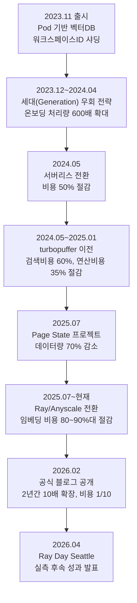
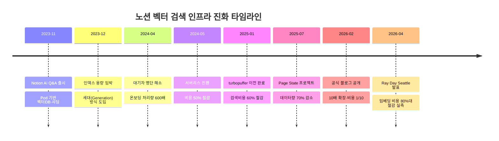

## 관련글

[**[주말잡상 : AI데이터 깎는 청년, 노션]**](https://www.facebook.com/share/p/1Cy7kHFsTk/)

## 문서 개요

이 문서는 노션(Notion)이 2026년 2월 19일 공식 엔지니어링 블로그에 게재한 "Two years of vector search at Notion: 10x scale, 1/10th cost"(작성자: Preeti Gondi, Mickey Liu, Nathan Louie, Calder Lund, Jacob Sager)를 원문 기준으로 검증하고, 이후 2026년 4월 앤스케일(Anyscale)이 주최한 "Ray Day Seattle" 행사에서 노션 엔지니어가 공개한 후속 발표 내용까지 추가로 확인해 정리한 것이다. 노션 AI Q&A 기능을 지탱하는 벡터 검색 시스템이 출시 이후 2년여 동안 어떤 문제에 부딪혔고, 어떤 순서로 구조를 바꿔가며 처리량은 10배로 키우면서 비용은 90%나 낮췄는지를 시간 순으로 서술한다.

## 1. 노션 AI 검색이 벡터 검색을 쓰는 이유

노션 AI의 질의응답 기능은 사용자가 자연어로 질문을 던지면 워크스페이스 안의 문서는 물론 슬랙이나 구글 드라이브처럼 연동된 외부 도구의 내용까지 찾아서 답을 만들어준다. 일반적인 키워드 검색은 "팀 회의록"이라고 입력했을 때 제목이 "스탠드업 요약"으로 되어 있는 문서를 놓치기 쉽다. 두 표현이 의미상 같은 내용을 가리키더라도 글자가 다르면 매칭이 안 되기 때문이다.

벡터 검색은 이 문제를 텍스트를 고차원 공간의 좌표(임베딩)로 바꾸는 방식으로 해결한다. 의미가 비슷한 문장은 이 공간에서 서로 가까운 위치에 놓이므로, 정확한 단어가 아니라 의미를 기준으로 관련 문서를 찾아낼 수 있다. 노션 AI가 워크스페이스 전체를 대상으로 자연어 질문에 답하려면 이 벡터 검색이 필수적인 하부 구조가 된다.

## 2. 1부 — 폭발적 성장의 시작 (2023년 11월 ~ 2024년 4월)

### 2.1 이원화된 색인 파이프라인으로 출발

노션은 2023년 11월 AI Q&A 기능을 출시하면서 두 갈래의 색인 파이프라인을 함께 운영했다. 하나는 아파치 스파크(Apache Spark) 기반의 오프라인 배치 작업으로, 기존에 쌓여 있던 문서를 통째로 잘게 나누고(청킹) 임베딩을 생성해 벡터 데이터베이스에 대량으로 적재하는 역할을 맡았다. 다른 하나는 카프카(Kafka) 컨슈머를 이용한 실시간 경로로, 사용자가 페이지를 수정할 때마다 그 변경 사항을 즉시 반영해 색인이 1분 이내의 지연으로 최신 상태를 유지하도록 했다. 이 두 경로를 함께 쓴 덕분에 대형 워크스페이스를 한꺼번에 온보딩하면서도, 이미 활성화된 워크스페이스는 실시간으로 갱신할 수 있었다.

당시 벡터 데이터베이스는 저장소와 연산 자원이 하나로 묶인 전용 "포드(pod)" 클러스터 위에서 돌아갔다. 노션은 기존에 포스트그레스(Postgres)에 적용했던 것과 비슷한 방식으로, 워크스페이스 ID를 기준으로 범위 기반 파티셔닝을 적용해 여러 개의 샤드(shard)로 데이터를 나누어 저장했고, 어느 샤드가 어느 워크스페이스를 담당하는지는 하나의 설정 파일이 총괄해서 관리했다.

### 2.2 한 달 만에 닥친 용량 위기

출시 이후 수요는 예상을 뛰어넘었다. 수백만 개의 워크스페이스가 대기자 명단에 올라 AI Q&A 기능이 열리기를 기다렸고, 노션은 품질과 성능을 유지하면서도 이들을 최대한 빠르게 받아들여야 하는 상황에 놓였다.

문제는 출시 한 달 만에 찾아왔다. 기존에 만들어둔 인덱스가 용량 한계에 근접한 것이다. 이대로 공간이 다 차면 신규 온보딩을 중단할 수밖에 없었고, 이는 곧 AI 기능 확산이 지연되고 신규 사용자가 가치를 체감하는 시점이 늦어진다는 뜻이었다. 노션 앞에는 두 가지 선택지가 있었다. 하나는 인덱스를 점진적으로 재샤딩하는 방법으로, 데이터를 새 인덱스에 복제한 뒤 절반을 지우는 작업을 2주마다 반복하며 신규 고객을 받는 방식이었다. 다른 하나는 아예 최종 예상 규모에 맞춰 한 번에 재샤딩하는 방법이었는데, 당시 이용하던 벡터 데이터베이스 제공업체가 가동 시간 자체에 과금하는 구조였기 때문에 미리 넉넉하게 용량을 확보해두는 것은 비용 부담이 지나치게 컸다.

노션은 이 두 방법 대신 제3의 길을 택했다. 기존 포스트그레스 샤딩 방식과는 다르게, 한 인덱스 묶음이 용량 한계에 가까워지면 그때마다 새로운 인덱스 묶음을 증설하고 이후의 신규 온보딩은 모두 그쪽으로 보내는 방식이었다. 각 인덱스 묶음에는 "세대(generation)" ID를 부여해 읽기와 쓰기가 어느 세대로 향할지를 결정하게 했다. 이 방법 덕분에 재샤딩 작업으로 서비스를 멈추지 않고도 계속 온보딩을 이어갈 수 있었다.

### 2.3 처리 속도를 600배로 끌어올리다

출시 초기에는 하루에 겨우 수백 개의 워크스페이스만 온보딩할 수 있었다. 이 속도로는 수백만 명에 달하는 대기자를 다 받아들이는 데 수십 년이 걸릴 계산이었다. 노션은 에어플로(Airflow)로 작업 스케줄링을 조정하고, 처리량을 극대화하도록 파이프라인을 재구성했으며, 스파크 작업 자체도 세밀하게 튜닝했다.

그 결과 하루 온보딩 처리 능력은 600배로 늘었고, 활성 워크스페이스 수는 15배 증가했으며, 벡터 데이터베이스의 수용 규모는 8배로 확장되었다. 이런 개선이 이어진 끝에 노션은 2024년 4월 마침내 AI Q&A 대기자 명단을 모두 소진할 수 있었다. 다만 여러 세대의 데이터베이스를 동시에 운영하는 방식은 초고속 성장기를 버텨내는 데는 유효했지만, 운영 복잡도와 비용 부담이 점점 커지는 부작용을 남겼다. 노션은 다음 단계로 더 근본적인 구조 개편에 나서야 했다.

## 3. 2부 — 비용 절감의 여정 (2024년 5월 ~ 현재)

### 3.1 서버리스 전환으로 첫 단추를 끼우다 (2024년 5월)

2024년 5월, 노션은 저장소와 연산이 결합된 기존의 전용 "포드" 구조 전체를 저장소와 연산을 분리하고 사용한 만큼만 과금하는 서버리스 아키텍처로 옮겼다. 이 전환의 효과는 곧바로 나타났다. 최대 사용량 대비 비용이 50% 줄었고, 이는 연간 수백만 달러 규모의 비용 절감으로 이어졌다. 부수적인 효과도 컸는데, 그동안 확장의 발목을 잡던 저장 용량 제약이 사라졌고, 수요를 예측해 미리 용량을 준비해둘 필요가 없어지면서 운영도 한결 단순해졌다.

다만 이렇게 절감하고 나서도 벡터 데이터베이스에만 연간 수백만 달러 규모의 비용이 여전히 들어가고 있었다. 노션은 여기서 더 최적화할 여지가 있다고 판단했다.

### 3.2 turbopuffer로의 이전 (2024년 5월 ~ 2025년 1월)

서버리스 전환으로 비용을 줄이는 작업과 병행해, 노션은 대안이 될 만한 검색 엔진들을 폭넓게 검토했다. 그 결과 turbopuffer라는, 당시로서는 비교적 신생 업체였던 검색 엔진이 유력한 후보로 떠올랐다. turbopuffer는 처음 설계 단계부터 오브젝트 스토리지(예: 아마존 S3와 같은 저비용 대용량 저장소) 위에서 동작하도록 만들어져 있어 성능과 비용 효율을 동시에 노릴 수 있는 구조였다. 완전관리형 서비스와 자체 클라우드에 직접 운영하는 방식(BYOC)을 모두 지원했고, 저장된 벡터 데이터를 대량으로 수정하기에도 용이한 아키텍처였다. 평가를 마친 노션은 2024년 하반기, 수십억 개에 달하는 전체 벡터 워크로드를 turbopuffer로 옮기기로 결정했다.

제공업체를 통째로 바꾸는 김에 노션은 전체 아키텍처도 함께 손봤다. 오프라인 색인 파이프라인의 쓰기 처리량을 늘려 전체 데이터를 turbopuffer 위에 새로 색인했고, 이 기회에 임베딩 모델도 더 성능이 좋은 최신 모델로 교체했다. 구조적으로도 turbopuffer는 각 네임스페이스를 독립된 인덱스로 다루기 때문에, 기존처럼 샤딩이나 세대 라우팅을 신경 쓸 필요가 없어져 아키텍처 자체가 단순해졌다. 전환은 한 번에 밀어붙이지 않고 세대별로 하나씩 순차적으로 이전하면서, 매 단계마다 정합성을 검증한 뒤 다음 세대로 넘어가는 방식으로 신중하게 진행됐다.

이 이전 작업의 결과 검색 엔진에 들어가는 비용은 60% 줄었고, AWS EMR 연산 비용은 35% 감소했다. 흥미로운 점은 비용이 줄어드는 동시에 검색 속도도 개선됐다는 것이다. p50 기준 운영 쿼리 지연 시간이 기존 70~100밀리초에서 50~70밀리초로 단축됐다.

### 3.3 Page State 프로젝트 — 바뀐 부분만 다시 계산하기 (2025년 7월)

다음으로 노션이 파고든 문제는 색인 파이프라인 안에 숨어 있던 근본적인 비효율이었다. 노션 페이지는 길이가 긴 경우가 많아서, 각 페이지를 여러 개의 조각(span)으로 나눈 뒤 조각마다 임베딩을 만들고 작성자·권한 같은 메타데이터와 함께 벡터 데이터베이스에 적재하는 구조였다. 그런데 기존 구현에서는 페이지나 그 속성이 조금이라도 바뀌면, 단 한 글자만 수정되었더라도 그 페이지에 속한 모든 조각을 처음부터 다시 청킹하고 다시 임베딩해서 통째로 재업로드했다. 어떤 부분이 실제로 바뀌었고 어디까지만 다시 처리하면 되는지를 빠르게 판별하는 것이 관건이었다.

노션이 실제로 신경 써야 했던 변화는 두 가지였다. 하나는 페이지 텍스트 자체의 변화로, 이 경우에는 임베딩을 다시 만들어야 한다. 다른 하나는 페이지나 텍스트에 딸린 메타데이터의 변화로, 이 경우에는 메타데이터만 갱신하면 된다. 이를 구분하기 위해 노션은 조각마다 두 개의 해시값, 즉 텍스트에 대한 해시와 메타데이터 전체에 대한 해시를 따로 계산해 관리하기 시작했다. 해시 알고리즘으로는 사용 편의성과 처리 속도, 충돌 가능성, 저장 용량 사이의 균형이 좋은 64비트 xxHash를 선택했고, 이 해시값들은 빠른 입력·조회 성능을 갖춘 다이나모DB(DynamoDB)에 페이지 단위 레코드로 저장했다.

텍스트가 바뀌는 경우를 예로 들면, 페이지를 다시 청킹한 뒤 다이나모DB에 저장돼 있던 직전 상태와 텍스트 해시값을 비교해 정확히 어느 조각이 바뀌었는지만 찾아내고, 그 조각만 다시 임베딩해서 다시 적재한다. 반대로 권한 설정처럼 메타데이터만 바뀌고 본문 텍스트는 그대로인 경우에는, 텍스트 해시는 모두 동일하고 메타데이터 해시만 달라진 것이 확인되므로 임베딩 자체를 건너뛰고 벡터 데이터베이스에 PATCH 명령만 보내 메타데이터만 갱신한다. 이는 임베딩을 새로 만드는 것보다 훨씬 저렴한 작업이다.

이 두 가지 개선을 통해 노션은 처리해야 하는 데이터량을 70% 줄였고, 이는 임베딩 API 호출 비용과 벡터 데이터베이스 쓰기 비용을 동시에 낮추는 효과로 이어졌다.

### 3.4 임베딩 인프라를 Ray·Anyscale로 내재화하다 (2025년 7월 ~ 현재)

2025년 7월, 노션은 실시간에 가까운 임베딩 파이프라인 자체를 오픈소스 분산 컴퓨팅 프레임워크인 Ray로, 그것도 Ray를 만든 원년 팀이 운영하는 매니지드 서비스인 앤스케일(Anyscale) 위에서 옮기는 작업에 착수했다. 노션에는 별도의 전담 ML 인프라 조직이 없었기 때문에, 앤스케일이 제공하는 관리형 플랫폼을 활용하는 쪽을 택한 것이다.

이 전환은 여러 문제를 한꺼번에 해결하기 위한 결정이었다. 먼저 "이중 연산" 문제가 있었다. 전처리(청킹, 변환, API 호출 조율)는 EMR 위에서 스파크로 처리하면서, 임베딩 자체는 외부 API 제공업체에 토큰 단위로 별도 비용을 내며 맡기고 있었던 것이다. 또한 외부 임베딩 API의 안정성에 검색 색인의 최신성 자체가 종속돼 있다는 신뢰성 문제도 있었다. 여기에 더해 외부 API의 요청 제한(rate limit)을 피하려고 온라인 색인용 스파크 작업을 여러 개로 쪼개 S3를 거쳐 배치 데이터를 주고받는 자체 파이프라이닝 체계를 별도로 구축해 운영해야 했는데, 이 구조 자체가 다루기 번거로웠다.

Ray와 앤스케일을 선택한 이유는 다음과 같다. 우선 외부 제공업체에 얽매이지 않고 오픈소스 임베딩 모델을 직접 돌릴 수 있어 새로운 모델이 나올 때마다 빠르게 실험하고 도입할 수 있는 유연성이 생긴다. 전처리와 추론을 하나의 연산 계층으로 통합함으로써 이중 연산 문제 자체가 사라진다. Ray는 GPU 중심의 추론 작업과 CPU 중심의 전처리 작업을 같은 노드 안에서 파이프라이닝하는 기능을 기본으로 지원해 자원 활용률을 높게 유지할 수 있다. 앤스케일이 제공하는 통합 워크스페이스 덕분에 엔지니어들이 커서(Cursor)나 VS코드 같은 익숙한 도구에서 별도 인프라 프로비저닝 없이 바로 데이터 파이프라인을 작성하고 테스트할 수 있다는 개발 생산성 측면의 장점도 있었다. 마지막으로 임베딩을 자체 호스팅함으로써 사용자 검색의 임계 경로에서 외부 API를 거치는 구간 자체가 사라져 지연 시간도 눈에 띄게 줄었다.

2026년 2월 공개된 블로그 원문에서 노션은 스파크에서 Ray로 임베딩 생성 파이프라인을 옮기면 임베딩 인프라 비용을 90% 이상 줄일 수 있을 것으로 내다봤다. 다만 이 수치는 당시 아직 전면 전환이 진행 중인 상태에서 나온 전망치였고, 블로그는 초기 결과가 고무적이라는 정도로만 언급했다.

이후 2026년 4월 앤스케일이 시애틀에서 주최한 "Ray Day Seattle" 행사에서 노션의 리드 엔지니어 미키 리우(Mickey Liu)가 이 전환 작업을 직접 발표하며 좀 더 구체적인 실측 결과를 공유했다. 기존에는 EMR 위에서 3단계로 나뉜 스파크 파이프라인을 운영했지만, 이를 앤스케일 위에서 도는 단일 Ray 작업으로 통합했다는 것이다. 기존 구조는 스파크가 데이터 청킹과 벡터 스토어 기록을 담당하고 임베딩 생성은 제3자 API가 맡는 방식이어서 이중 연산 비용, 외부 API의 요청 제한, 그리고 YARN 환경에서 드라이버·익스큐터 로그가 남지 않아 여러 도구에 걸친 장애를 디버깅하기 어려운 문제 등을 안고 있었다고 설명했다. 새 파이프라인은 카프카 스트림을 Ray 클러스터로 직접 흘려보내 CPU 기반 청킹, GPU 기반 임베딩 생성, 벡터 스토어 기록까지 하나의 엔진 안에서 S3를 거치는 중간 단계 없이 전부 처리한다. 이 발표에서 공개된 실제 성과는 임베딩 비용 80% 이상 절감, 쿼리 지연 시간 10배 개선, 그리고 지역별로 3개씩 돌아가던 작업을 1개로 통합한 것이었다. 이는 2월 블로그의 "90% 이상 절감 전망"과는 약간 다른 수치이지만, 실제 운영에서 확인된 수치라는 점에서 더 구체적인 후속 데이터로 볼 수 있다.

### 3.5 실시간 쿼리 임베딩 — Ray Serve

사용자나 에이전트가 검색어를 입력하면 노션은 그 질의 자체도 즉석에서 임베딩으로 바꿔야 한다. 이 연산이 끝나야 비로소 벡터 데이터베이스에서 검색이 가능하기 때문에, 이 구간은 특히 지연 시간에 민감하다. 그런데 허깅페이스(Hugging Face)에 올라와 있는 것과 같은 대형 임베딩 모델을 서빙 인프라로 직접 운영하는 일은 까다롭다. GPU를 효율적으로 배분하는 문제부터 트래픽 라우팅, 복제, 오토스케일링까지 신경 쓸 요소가 많기 때문이다. 노션은 이 대부분을 기본 제공하는 Ray Serve를 채택해, 오픈소스 임베딩 모델을 GPU에 상시 적재된 상태로 유지하는 영속적인 배포 형태로 감싸고, 요청을 모아서 처리하는 동적 배치나 복제본 수 같은 설정을 일반 파이썬 코드와 YAML 설정만으로 관리하고 있다.

## 4. 앞으로의 계획

노션은 블로그 말미에서 향후 방향도 밝혔다. 슬랙, 구글 드라이브 외에 더 많은 외부 도구를 연동해 답변의 커버리지를 넓히는 작업, 빠르게 발전하는 임베딩 모델 생태계를 Ray의 유연성을 활용해 계속 따라잡는 작업, 그리고 인프라에는 완성이라는 게 없다는 전제 아래 속도·비용·안정성을 지속적으로 개선하는 작업을 언급했다. 특히 아직 정식 출시 전인 "커스텀 에이전트(Custom Agents)" 기능은 이 벡터 검색 인프라를 활용해 워크스페이스와 연동된 앱 전반에서 맥락을 파악하고, 동료와 같은 수준의 이해를 바탕으로 업무를 자율적으로 수행하는 것을 목표로 한다고 소개했다.

## 5. 단계별 변화 한눈에 보기

| 시기 | 핵심 조치 | 주요 성과 |
|---|---|---|
| 2023년 11월 | AI Q&A 출시, Pod 기반 벡터DB + 워크스페이스 ID 샤딩 | 이원화 파이프라인(스파크 배치 + 카프카 실시간) 구축 |
| 2023년 12월 ~ 2024년 4월 | 세대(Generation) 방식 도입, 에어플로·스파크 튜닝 | 온보딩 처리량 600배, 활성 워크스페이스 15배, DB 용량 8배, 대기자 명단 완전 해소 |
| 2024년 5월 | 서버리스 아키텍처 전환 | 비용 50% 절감(연간 수백만 달러 규모), 용량 제약 해소 |
| 2024년 5월 ~ 2025년 1월 | turbopuffer로 전면 이전, 임베딩 모델 교체 | 검색엔진 비용 60% 절감, EMR 연산비용 35% 절감, p50 지연 70~100ms → 50~70ms |
| 2025년 7월 | Page State 프로젝트(텍스트·메타데이터 해시 분리 추적) | 처리 데이터량 70% 감소, 임베딩·쓰기 비용 동반 절감 |
| 2025년 7월 ~ 현재 | 임베딩 생성·서빙을 Ray/Anyscale로 이전 | (전망치) 임베딩 인프라 비용 90%대 절감 |
| 2026년 4월(후속 발표) | Ray Day Seattle에서 실측 결과 공개 | 임베딩 비용 80% 이상 절감, 쿼리 지연 10배 개선, 지역별 작업 3개 → 1개 통합 |

## 6. 전체 아키텍처 진화 흐름

## 7. 시간 흐름표

## 8. 이 사례가 보여주는 것

이 사례는 대규모 RAG(검색 증강 생성) 시스템을 실제 서비스로 운영할 때 비용이 어디에 숨어 있는지를 잘 보여준다. 벡터 데이터베이스 자체의 청구서만 눈에 보이지만, 실제로는 수집 파이프라인, 임베딩 생성 비용, 사소한 수정 하나에도 전체를 다시 처리하는 데서 오는 낭비, 그리고 수백만 테넌트에 걸쳐 색인을 최신 상태로 유지하는 운영 부담까지 전부가 비용으로 쌓인다. 노션의 2년은 이 네 가지를 하나씩 걷어낸 과정으로 요약할 수 있다. 저장소와 연산을 분리해 유휴 비용을 없애고, 오브젝트 스토리지 기반 벡터 검색 엔진으로 옮겨 저장 비용 구조 자체를 바꾸고, 변경분만 다시 계산하는 해시 기반 캐싱으로 반복 작업을 줄이고, 마지막으로 외부 임베딩 API 의존을 자체 호스팅으로 전환해 이중 연산 비용을 없앤 것이다.

다만 이 발표는 노션이 스스로 작성한 1인칭 기술 사례라는 점도 함께 고려할 필요가 있다. 성과를 강조하는 방향으로 서술되는 것이 자연스러우며, "10배 확장·비용 1/10"이라는 수치도 초고속 성장기에 속도를 위해 효율을 희생했던 상태에서 이후 정상 궤도에 올라 최적화를 진행한 결과로 이해하는 편이 정확하다. 즉 이번에 적용된 최적화 기법들, 이를테면 불필요한 재임베딩을 피하거나 적합한 인프라를 고르는 것과 같은 조치들은 처음부터 적용할 수 있었을 법한 것들이지만, 폭발적 성장기에는 속도가 우선순위였기 때문에 뒤로 미뤄졌던 성격이 크다.

그럼에도 이 사례에서 실무적으로 참고할 만한 지점은 분명하다. 배치 처리와 실시간 처리를 병행하는 이원화 수집 구조는 대량 온보딩과 실시간 최신성을 동시에 요구하는 시스템에 두루 적용할 수 있는 패턴이다. 해시 기반의 변경분 감지와 부분 갱신은 재임베딩 자체를 피하는 것이 가장 저렴한 최적화라는 점을 보여준다. 그리고 외부 임베딩 API에서 자체 호스팅 인프라로 옮겨가는 흐름은, 일정 규모를 넘어서면 내재화가 경제적으로 유리해지는 임계점이 존재한다는 것을 시사한다. 다만 그 임계점이 어느 조직에나 동일하게 적용되지는 않는다는 점은 유의해야 한다.

## 9. 확인이 필요한 부분

몇 가지는 원문에서도 구체적인 금액이나 수치가 공개되지 않았다는 점을 밝혀둔다. 서버리스 전환과 벡터DB 비용 절감 효과는 "연간 수백만 달러 규모"로만 언급되었을 뿐 정확한 금액은 공개되지 않았다. 임베딩 인프라 비용의 90% 이상 절감은 2026년 2월 블로그 시점에는 아직 완전히 마무리되지 않은 전환 작업에 대한 전망치였으며, 이후 2026년 4월 발표에서 실측치로 제시된 수치는 80% 이상으로 다소 차이가 있다. 두 수치 모두 노션 측이 공개한 것이지만, 시점과 성격(전망 대 실측)이 다르다는 점을 구분해서 볼 필요가 있다.

## 출처

- 노션 공식 엔지니어링 블로그, "Two years of vector search at Notion: 10x scale, 1/10th cost", 2026년 2월 19일 (작성: Preeti Gondi, Mickey Liu, Nathan Louie, Calder Lund, Jacob Sager)
- 앤스케일(Anyscale) 공식 블로그, "How Notion cut embedding costs by 80% and other stories on scaling AI with Ray from Salesforce, Uber, and more…", Ray Day Seattle 발표 정리, 2026년 4월

---

작성일: 2026.07.12
