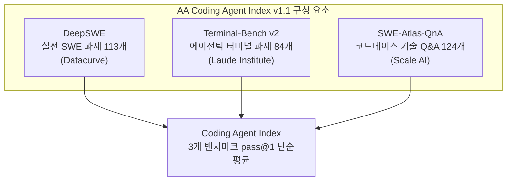
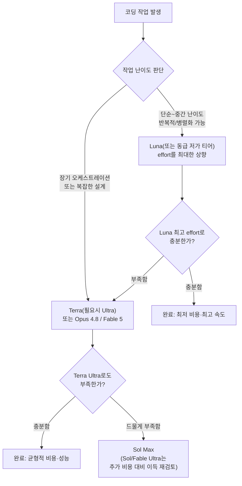

> 
> 이게 사실이라면 Luna Max 의 가성비가 심하게 높네요. 특히나 다른 모델 대비 (심지어 동종 상위모델인 Terra, Sol 보다도) effort 를 올리면서 발생하는 가성비 손실이 (차트의 우상향 기울기가 꺾이는 모양새) 가장 적습니다. 저런 모양새라면 Max 이상의 effort 설정도 의미 있지 않나 싶을 정도... 
> 
> Luna Max 의 토큰 출력 속도가 어떨지 궁금. 만약 이 effort Max 에서도 출력속도가 다른 모델 대비 경쟁력이 있다면 대부분의 일들을 Luna Max 로 하고, 일부 복잡한 설계 및 오케스트레이션만 Terra Max 로 하는게 맞는 구도입니다.
> 
> 역시 달은 신비로운 존재~~
> 
> 더불어 최근 출시된 Grok4.5 도 상당하네요. 예상했지만 Fable 이나 Opus 는 저세상 가성비이고;;
> 
> 이 상태로는 Fable 5 를 구독제에서 제외시키기 매우 어려울거 같은데, Anthropic 이 조만간 어떤 결정을 내릴지 매우 궁금합니다.
> 
> 유명한 SWE 벤치 3종 셋트의 평점을 베이스로 한 차트이긴 한데, 이 벤치마킹이 무시못할 레퍼런스이기도 하고, 무엇보다도 이 차트를 올린 사람이 이 바닥의 네임드(AI/ML 전문 연구자이자 통계학 교수에 분야의 유명 저자)이다보니... (X ID : @rasbt Sebastian Raschka)
> 
> #ai #agent #gpt #claude #grok #muse #swe #benchmark #chart #gonnector #고넥터
> 
> https://www.facebook.com/share/1DKk98Pjf9/
> 

## 1. 이 차트는 어디서 왔는가

먼저 출처부터 명확히 해두는 편이 좋겠다. 공유해주신 차트는 실제로 Sebastian Raschka(@rasbt)가 2026년 7월 9일 자신의 블로그에 올린 글, "GPT 5.6 Has 72 Possible Configurations. What's A Good Default?"에 실린 두 번째 그림이다. Raschka는 스탯퀘스트 수준으로 유명한 머신러닝 저자는 아니지만, "Build a Large Language Model From Scratch"와 후속작 "Build a Reasoning Model From Scratch"의 저자이자 전직 위스콘신-매디슨대 통계학과 교수 출신 AI 연구자로, LLM 아키텍처와 추론 모델 분야에서 신뢰도가 높은 인물로 통합니다. 말씀하신 "이 바닥의 네임드"라는 평가는 근거가 있는 서술입니다.

다만 한 가지 짚어야 할 부분이 있습니다. 이 차트 자체는 Raschka가 처음부터 새로 만든 원자료가 아니라, OpenAI가 GPT-5.6 출시 발표(X 게시물)에서 공개한 Artificial Analysis Coding Agent Index v1.1 그래프를 가져와 재구성한 것입니다. Raschka 본인도 그림 설명에 "OpenAI의 GPT-5.6 출시 게시물을 기반으로 함"이라고 명시하고 있습니다. 즉 데이터의 최초 출처는 독립 벤치마크 기관인 Artificial Analysis(AA)이고, Raschka는 이를 인용해 "72가지 설정 중 무엇을 기본값으로 삼아야 하는가"라는 자신의 논지를 뒷받침하는 데 사용한 것입니다. 이 구도를 알아두면 이후 숫자들을 더 정확히 해석할 수 있습니다.

같은 날 Raschka는 X에 별도로 이 차트를 근거로 한 실전 요약도 올렸는데, 대략 이런 내용이었습니다. Terra Ultra 수준의 성능이 필요한 경우가 아니라면 언제나 effort를 높인 Luna 쪽이 동일 비용에서 더 낫거나 더 저렴하고, Sol High 이하는 사실상 고려할 필요가 없으며 그 구간은 Luna의 상위 effort로 대체 가능하고, Sol Extra High 대신에는 Terra Ultra를 쓰는 편이 낫고, Sol Ultra의 추가 비용은 Sol Max 대비 정당화되기 어렵다는 취지였습니다. 말씀하신 직관, 즉 "Luna Max의 가성비가 특히 높고 effort를 올릴 때 발생하는 손실이 가장 적다"는 관찰은 이 차트를 처음 공개하고 분석한 전문가 본인의 결론과 정확히 일치합니다.

## 2. Artificial Analysis Coding Agent Index v1.1이란 무엇인가

정확한 이해를 위해 방법론을 먼저 정리하겠습니다. 이 지수는 흔히 "SWE 벤치 3종 세트"로 불릴 만한 구성이지만, 엄밀히는 SWE-bench 계열 벤치마크 하나만을 가리키는 것은 아닙니다. v1.1 기준으로 지수는 아래 세 벤치마크의 pass@1 점수를 단순 평균한 값입니다.

- DeepSWE: Datacurve가 만든 실전 소프트웨어 엔지니어링 과제 113개. v1.1에서 새로 편입되었습니다.
- Terminal-Bench v2: Laude Institute가 만든 에이전틱 터미널 조작 과제로, 원래 89개 과제 중 환경 호환성 문제가 있는 5개를 제외한 84개가 사용됩니다.
- SWE-Atlas-QnA: Scale AI가 만든 기술 Q&A 과제 124개로, 코드베이스를 탐색해 근본 원인이나 동작 방식을 설명하는 능력을 측정합니다.

v1.0 시점에는 세 번째 축이 SWE-Bench-Pro-Hard-AA(Scale AI, 150개 과제)였는데, v1.1로 개정되면서 DeepSWE로 교체되었습니다. 즉 지금 보고 계신 차트의 v1.1이라는 라벨은 단순한 버전 표기가 아니라 실제로 벤치마크 구성 자체가 한 차례 바뀌었다는 의미입니다. 이 지수가 측정하는 것은 모델 단독의 능력이 아니라 "모델 + 에이전트 하네스" 조합의 성능이라는 점도 중요합니다. 같은 모델이라도 어떤 하네스(Codex, Claude Code, Grok Build, Opencode, Gemini CLI 등)에 태워지느냐에 따라 점수가 달라집니다.

## 3. 등장인물 정리: 모델, 하네스, 가격

차트에 등장하는 모델들을 정리하면 아래와 같습니다. 가격은 모두 API 기준 100만 토큰당 달러(입력/출력)이며, 2026년 7월 확인 시점 기준입니다.

| 모델 | 하네스 | 개발사 | 입력가 | 출력가 | 비고 |
|---|---|---|---|---|---|
| GPT-5.6 Sol | Codex | OpenAI | $5.00 | $30.00 | 플래그십, max·ultra 모드 보유 |
| GPT-5.6 Terra | Codex | OpenAI | $2.50 | $15.00 | 균형형, Sol 대비 약 절반 가격 |
| GPT-5.6 Luna | Codex | OpenAI | $1.00 | $6.00 | 최저가·최고속 티어 |
| Claude Opus 4.8 | Claude Code | Anthropic | $5.00 | $25.00 | 기존 주력 모델 |
| Claude Fable 5 | Claude Code | Anthropic | $10.00 | $50.00 | Mythos급, 어댑티브 추론 |
| Grok 4.5 | Grok Build | SpaceXAI(구 xAI) | $2.00 | $6.00 | 2026.7.8 출시, Cursor와 공동 학습 |
| Muse Spark 1.1 | Opencode | Meta Superintelligence Labs | $1.25 | $4.25 | 2026.7.9 출시 |
| Gemini 3.1 Pro Preview | Gemini CLI | Google | $2.00 | $12.00 | 2026.2.19 출시 |

지수 점수 쪽에서 여러 매체와 AA 아티클을 교차 확인한 결과, 확실히 확인되는 앵커 포인트는 다음과 같습니다. GPT-5.6 Sol이 max reasoning 기준으로 80점을 기록해 v1.1 지수 전체 1위를 차지했고, GPT-5.6 Terra는 max 기준 약 77점 내외, Claude Fable 5도 Claude Code에서 약 77점 내외로 Terra와 사실상 동률권에 있습니다. Grok 4.5는 Grok Build에서 76점, Meta Muse Spark 1.1은 Opencode에서 69점입니다. GPT-5.6 Luna는 매체별로 74.6~75점 사이로 보도되어 소폭의 차이가 있으나, 공통적으로 "Terra보다 근소하게 낮고 Muse Spark보다는 훨씬 높다"는 위치입니다. Claude Opus 4.8과 Gemini 3.1 Pro Preview는 공개된 2차 보도마다 인용하는 버전(v1.0 vs v1.1)이 섞여 있어 소수점 단위까지 확정하기는 어렵지만, 차트 상에서 Opus 4.8은 Terra·Fable보다 뚜렷이 아래, Luna보다도 아래에 위치해 있고, Gemini 3.1 Pro Preview는 전체 모델군 중 가장 낮은 구간에 자리합니다. AA는 과거 v1.0 발표 당시 이미 "Gemini 3.1 Pro가 Gemini CLI에서 유독 약하다"는 점을 별도로 지적한 바 있어, Google의 자체 모델 성능과 Gemini CLI 하네스 성능 사이에 괴리가 있다는 진단이 일관되게 나오고 있습니다.

한 가지 구조적인 차이도 짚을 필요가 있습니다. GPT-5.6과 Claude Opus 4.8은 차트에서 여러 effort 단계(Low/Medium/High/XHigh/Max 등)가 선으로 이어진 "곡선"으로 표시되는 반면, Claude Fable 5와 Grok 4.5는 점 하나로만 표시됩니다. 이는 Fable 5가 사용자가 직접 조절하는 이산적 effort 슬라이더 대신 상황에 맞춰 스스로 추론량을 조절하는 "어댑티브 추론" 방식을 쓰고, Grok 4.5 역시 API 차원에서 GPT-5.6처럼 세분화된 reasoning effort 파라미터를 노출하지 않기 때문입니다. 그래서 이 두 모델은 개별 effort별 가성비 곡선을 그릴 수 없고, 단일 설정에서 얻은 점 하나로만 비교가 가능합니다.

## 4. "달은 신비로운 존재" — Luna Max 가성비의 실체

관찰하신 대로 GPT-5.6 Luna는 이번 세대에서 가장 이례적인 결과를 낸 모델입니다. OpenAI 스스로도 발표문에서 Luna가 effort를 높이면 Opus 4.8을 앞선다고 명시했고, Artificial Analysis는 인텔리전스 지수 기준으로 Luna(max)가 GLM-5.2(max)나 Gemini 3.5 Flash와 동등하거나 더 나은 지능을 더 낮은 비용에 낸다고 정리했습니다. 코딩 에이전트 지수만 놓고 보면 Luna(max)는 74~75점대로 Sol의 80점에는 못 미치지만, Sol 대비 5분의 1 가격에서 그 정도 점수를 낸다는 점이 핵심입니다. DeepSWE 단일 벤치마크 기준으로는 아예 "달러당 벤치마크 점수"로 Luna가 Opus 4.8의 약 5배, Fable 5의 약 7~8배에 달한다는 분석(Trilogy AI 집계)도 나와 있습니다.

Sebastian Raschka가 7월 10~11일 X에서 정리한 실전 가이드라인도 같은 결론을 가리킵니다. Terra Ultra급 성능이 반드시 필요한 경우가 아니라면 언제나 effort를 높인 Luna를 쓰는 편이 동일 비용에 더 나은 성능을 내거나 더 저렴하며, Sol High 이하 구간은 사실상 Luna 상위 effort로 대체 가능하고, Sol Extra High 대신 Terra Ultra를, Sol Ultra의 추가 지출은 Sol Max 대비 정당화하기 어렵다는 취지였습니다. 이는 말씀하신 "Max 이상의 effort 설정도 의미 있지 않을까"라는 직관과도 통하는데, 다만 Raschka의 결론은 정확히는 "Max보다 더 위인 Ultra"가 아니라 "같은 Max 구간이라면 상위 모델(Sol/Terra)의 낮은 effort보다 하위 모델(Luna/Terra)의 높은 effort가 더 합리적"이라는 방향입니다. 즉 모델 크기(훈련 연산량 축)보다 추론 시점 연산량(effort 축)을 먼저 끌어올리는 쪽이 이번 세대에서는 파레토 효율적이라는 뜻이고, Luna가 그 축의 최전선에 서 있는 모델이라는 해석이 정확합니다.

다만 여기서 한 가지 경계할 지점이 있습니다. Luna가 강점을 보이는 영역은 "코딩 에이전트 지수"처럼 비교적 구조화되고 반복 가능한 과제군입니다. 실사용 리뷰들은 공통적으로 Luna를 "좁고 반복적이며 병렬화 가능한 고볼륨 작업"에 최적화된 모델로 묘사하고, 장기 계획·아키텍처 설계·모호한 디버깅처럼 지속적 판단이 필요한 영역에서는 플래그십(Sol) 대비 뒤처진다고 평가합니다. CodeRabbit의 실측 테스트에서도 Sol이 100개 이상의 장기 코딩 과제에서 63.7%를 통과한 반면, 같은 조건에서 저가형 모델은 통과율이 크게 낮았습니다. 즉 벤치마크 지수상의 가성비와 "장기 자율 에이전트 운용의 신뢰도"는 서로 다른 축이라는 점은 구분해서 볼 필요가 있습니다.

## 5. Luna는 실제로 빠른가 — 토큰 출력 속도 실측

질문하신 부분, 즉 "Luna Max에서도 출력 속도가 경쟁력이 있는가"는 실측 데이터로 답이 나와 있습니다. Artificial Analysis의 자체 벤치마크 기준으로 GPT-5.6 Luna는 effort 설정에 따라 초당 약 195~216 토큰의 출력 속도를 보입니다(medium 기준 약 195.6 t/s, max 기준 약 216 t/s). 반면 GPT-5.6 Sol은 reasoning effort를 xhigh로 높이면 오히려 초당 약 69토큰까지 떨어져, "평균보다 느린" 모델로 분류됩니다. 즉 Luna는 max effort를 걸어도 Sol의 3배 이상 빠른 속도를 유지합니다. 이는 Luna가 단순히 추론량이 적어서 빠른 것이 아니라, 모델 자체의 아키텍처가 처리량(throughput) 지향으로 설계되어 있다는 뜻으로 해석할 수 있습니다.

비교 대상을 넓혀 봐도 이 결론은 유지됩니다. Grok 4.5는 SpaceXAI 발표 기준 초당 약 80토큰(독립 측정치는 약 88토큰), Gemini 3.1 Pro Preview는 초당 약 128토큰, Meta Muse Spark 1.1은 초당 약 114토큰입니다. Claude 계열은 Artificial Analysis가 개별 effort별 t/s를 지속 갱신하고 있어 이 문서에서 단정적인 숫자를 제시하지는 않겠으나, 여러 3자 비교 글들이 공통적으로 "Sol/Fable 5급 플래그십은 추론 시간이 늘어날수록 체감 지연이 커진다"고 서술하고 있어, Luna가 최상위권 처리 속도를 보인다는 방향성 자체는 여러 출처에서 일관되게 확인됩니다.

말씀하신 전략, 즉 "대부분의 작업은 Luna Max로 처리하고 복잡한 설계·오케스트레이션만 Terra Max로 넘긴다"는 구도는 실측 속도 데이터로도 뒷받침됩니다. Luna는 점수(74~75점)와 속도(200 t/s대) 양쪽에서 Sol에 크게 밀리지 않으면서 비용은 5분의 1 수준이라, 고빈도·반복적 코딩 작업의 1차 실행 레인으로 배치하고, 계획 수립이나 장기 일관성이 중요한 구간만 상위 모델로 에스컬레이션하는 라우팅이 여러 실무 가이드(CodeRabbit, Vellum 등)에서 공통적으로 권장되고 있습니다.

## 6. Grok 4.5(SpaceXAI)는 실제로 강력한가

Grok 4.5는 2026년 7월 8일 공개되었습니다. 한 가지 배경 정보를 짚자면, xAI는 SpaceX에 인수·합병되어 이제 "SpaceXAI"라는 사명으로 활동하고 있고(2026년 7월 6일 리브랜딩), 같은 시기 AI 코딩 에디터 Cursor를 약 600억 달러 규모로 인수하는 계약도 체결했습니다(종결은 2026년 3분기 예정). Grok 4.5는 바로 이 Cursor의 실제 개발자 세션 데이터를 보충 학습에 활용해 만들어진 모델이라는 점이 특징입니다.

성능 면에서는 벤치마크마다 결과가 엇갈립니다. 각 회사가 자사 하네스로 돌린 결과(DeepSWE 1.0)에서는 Grok 4.5가 Opus 4.8보다 앞서지만, 중립적인 mini-swe-agent 하네스로 통일해 돌린 DeepSWE 1.1에서는 Fable 5 70%, GPT-5.5 67%, Opus 4.8 59%, Grok 4.5 53% 순으로 Grok이 오히려 하위권입니다. SWE-Bench Pro에서도 Fable 5(80.4%), Opus 4.8(69.2%), Grok 4.5(64.7%), GPT-5.5(58.6%) 순으로 Grok은 3위입니다. 반면 Terminal-Bench 2.1에서는 Fable 5(84.3%), GPT-5.5(83.4%), Grok 4.5(83.3%)로 거의 동률권이고, SWE Marathon(장기 과제 해결률)에서는 Grok 4.5가 29.0%로 오히려 1위를 기록했습니다. Artificial Analysis의 Coding Agent Index(v1.1)에서는 Grok 4.5가 Grok Build 하네스에서 76점을 받아, GPT-5.5(Codex)와 동률 수준이며 Fable 5(Claude Code)에 근소하게 못 미치는 3위권으로 정리됩니다.

Grok 4.5가 진짜로 두드러지는 지점은 원점수보다 효율입니다. SWE-Bench Pro 과제에서 Opus 4.8(max)이 평균 약 67,020개의 출력 토큰을 쓰는 반면 Grok 4.5는 약 15,954~16,000개만 사용해, 토큰 효율이 약 4.2배 높습니다. Artificial Analysis 실측으로 코딩 에이전트 과제 1건당 비용은 Grok 4.5 약 2.49달러, GPT-5.5(Codex) 약 5.07달러, Fable 5(Claude Code) 약 11.80달러로, Grok이 Fable 5의 5분의 1 이하 비용으로 근접한 점수를 낸다는 계산이 나옵니다. 일론 머스크 본인은 Grok 4.5를 "빠르고 토큰 효율적이며 저렴한 Opus급 모델"이라 설명했고, 이후 정정하듯 "정확히는 Opus 4.7과 비슷한 수준이되 훨씬 빠르다"고 부연했는데, 독립 데이터도 대체로 이 발언과 부합합니다. 다만 hallucination(환각) 측정에서는 Grok 4.5의 환각률이 전작 대비 크게 높아졌다는 보도도 있어(AA-Omniscience 기준), 사실관계가 중요한 작업에는 별도의 검증 절차가 필요하다는 점도 함께 기록해 둡니다.

## 7. Fable 5와 Opus 4.8이 "저세상 가성비"인 이유

수치로 보면 이 표현은 과장이 아닙니다. Artificial Analysis의 실측 비용 기준으로 코딩 에이전트 과제 1건당 Fable 5(Claude Code)는 약 11.80달러가 드는데, 이는 GPT-5.6 Sol(약 1.04달러, 다만 이 수치는 인텔리전스 지수 과제 기준)이나 Grok 4.5(약 2.49달러)와 비교하면 자릿수가 다른 수준입니다. API 가격표 자체도 이를 뒷받침합니다. Fable 5는 100만 토큰당 입력 10달러·출력 50달러로, Anthropic이 일반 공개 모델에 매긴 가격 중 역대 최고가이며 Opus 4.8(5달러/25달러)의 정확히 2배입니다. GPT-5.6 Luna(1달러/6달러)와 비교하면 입력은 10배, 출력은 8.3배 차이가 납니다.

이유는 단순히 "비싸게 책정했다"는 가격 정책 문제만은 아닙니다. Fable 5는 SWE-Bench Pro(80.4%), Terminal-Bench 2.1(84.3%) 등 원점수 자체는 여전히 최상위권이라, 절대 성능과 비용 효율이 반비례하는 구조적 트레이드오프가 뚜렷하게 나타나는 사례로 보는 편이 정확합니다. GPT-5.6 Sol이 코딩 에이전트 지수에서 Fable 5를 근소하게(2.8점) 앞서면서도 출력 토큰은 절반 이하, 소요 시간도 절반 이하, 비용은 약 3분의 1 수준이라는 OpenAI 측 발표는, 뒤집어 말하면 Fable 5가 "정답을 찾는 능력"에서는 여전히 최상위권이지만 "토큰과 시간을 아끼며 그 정답에 도달하는 효율"에서는 이번 세대 경쟁 모델들에 확실히 뒤처졌다는 뜻이기도 합니다. Opus 4.8 역시 SWE-Bench Pro 같은 원점수 기준으로는 2위권(69.2%)을 유지하지만, 코딩 에이전트 지수에서는 차트에 나타난 것처럼 GPT-5.6 Terra·Luna, 심지어 Grok 4.5보다도 아래에 위치해 있습니다.

## 8. Anthropic은 Fable 5 구독 문제에 대해 실제로 어떤 결정을 내렸는가

이 부분은 추측이 필요 없는 영역입니다. 오늘(2026년 7월 13일) 기준으로 이미 결론이 나 있기 때문입니다. 타임라인을 정리하면 다음과 같습니다.

Fable 5와 Mythos 5는 2026년 6월 9일 처음 출시되었고, Pro·Max·Team·일부 Enterprise 구독 플랜에서는 6월 22일까지 무료로 포함될 예정이었습니다. 그런데 6월 12일, 미국 상무부가 수출통제 지침을 근거로 두 모델에 대한 접근을 일시 중단시켰고, 이 조치는 6월 30일 해제되어 7월 1일 전 세계 서비스가 재개되었습니다(이 사건은 이 대화의 시스템 안내에도 명시된 사실이며, 자세한 내용은 Anthropic의 공식 발표 페이지에서 확인할 수 있습니다). 재개 시점에 Anthropic은 구독 플랜 사용자에게 주간 사용한도의 최대 50%까지 Fable 5를 추가 비용 없이 포함하되, 이 포함 기간을 7월 7일까지로 제한한다고 공지했습니다.

이 마감이 다가오자 사용자들의 반발이 상당했던 것으로 보이며, Anthropic은 마감 시각 몇 시간 전인 7월 7일 밤 이 기한을 7월 12일 오후 11시 59분 59초(태평양시)까지로 닷새 연장했습니다. 그리고 바로 오늘, 그 연장된 기한이 종료되는 날짜가 7월 13일입니다. 즉 이 문서를 작성하는 시점 기준으로, Fable 5는 구독 플랜의 기본 사용한도에서 이미 빠져나갔거나 막 빠져나가는 시점에 있으며, 이후로는 계속 사용하려면 별도의 사용 크레딧(usage credits)을 100만 토큰당 입력 10달러·출력 50달러로 구매해 충전해야 합니다. 크레딧을 켜두지 않으면 Fable 5는 유예 없이 바로 이용이 중단됩니다. Opus 4.8, Sonnet, Haiku 등 다른 모델은 이 변경의 영향을 받지 않고 기존 구독 한도 안에서 그대로 이용할 수 있습니다.

Anthropic이 이런 결정을 내린 이유로 공식적으로 밝힌 것은 "용량(capacity)" 문제입니다. Claude Code 리드 엔지니어인 Thariq Shihipar는 7월 초 "용량이 허락하는 대로 Fable을 표준 구독 혜택으로 복귀시키는 것이 목표"라고 언급했는데, 이는 6월 9일 최초 출시 공지에서부터 이미 예고되어 있던 문구와 동일한 톤으로, 새로운 약속이라기보다는 기존 입장의 재확인에 가깝습니다. 복귀 시점에 대한 구체적인 일정은 이 시점까지 공개되지 않았습니다.

정리하면, 말씀하신 "Fable 5를 구독제에서 빼기 어려울 것 같다"는 예상과 "Anthropic이 조만간 어떤 결정을 내릴지 궁금하다"는 질문에 대한 답은 이미 나와 있습니다. Anthropic은 실제로 구독제에서 Fable 5를 뺐습니다(정확히는 무료 포함 한도에서 제외하고 유료 크레딧 체제로 전환). 다만 완전히 접근을 차단한 것은 아니고, 유료 크레딧이나 API로는 계속 쓸 수 있게 열어 두었으며, 수요가 매우 높고 예측하기 어렵다는 이유로 단계적으로 용량을 확보하며 재편입하겠다는 입장입니다. 이번이 정확히는 벌써 두 번째 "포함 → 유료 전환" 사이클이기도 합니다. 6월 9일 출시 직후 6월 23일에 한 차례 유료 전환이 있었으나 그 직후 수출통제로 서비스 자체가 중단되면서 사실상 무효화되었고, 7월 1일 재개 이후 7월 7일(연장 후 7월 12일)에 두 번째 유료 전환이 이루어진 것이 지금의 상황입니다. 이 흐름을 볼 때, 말씀하신 우려처럼 고성능 모델을 무제한 구독 안에 계속 묶어두는 것이 Anthropic에도 실제로 비용·용량 부담이 크다는 점이 이번 사이클을 통해 반복적으로 드러난 셈입니다.

## 9. 종합: 실무 라우팅 전략

지금까지의 데이터를 종합하면, 실무에서 모델을 고를 때의 논리는 대략 다음과 같이 정리됩니다. 코딩 작업의 난이도가 낮거나 중간이라면 Luna 계열의 effort를 최대한 끌어올려 쓰는 편이 동일하거나 더 나은 성능을 훨씬 낮은 비용과 훨씬 빠른 속도로 얻는 길입니다. Luna의 상위 effort로도 부족하다고 판단되는 고난도·장기 오케스트레이션 작업에서만 Terra(필요하다면 Ultra)로 에스컬레이션하고, Sol Max 이상(특히 Sol Ultra)은 정말로 최후의 보루로 남겨두는 편이 비용 대비 합리적이라는 것이 Raschka와 여러 실무 가이드가 공통적으로 도달한 결론입니다. Anthropic 생태계 안에서는 Opus 4.8이 일상적인 작업의 기본값 역할을 하고, Fable 5는 아키텍처 설계나 고난도 계획 수립처럼 실제로 그 값어치를 하는 작업에만 선택적으로 투입하는 편이 비용 구조상 합리적입니다. Grok 4.5는 Cursor 생태계에 있거나 토큰 효율과 속도가 중요한 고빈도 작업에 유효한 대안으로 떠올랐지만, 환각률 이슈가 보고된 만큼 사실관계 검증이 중요한 작업에는 별도 확인 절차를 두는 편이 안전합니다.

## 10. 팩트체크 요약

이 문서에서 다룬 핵심 사실관계를 다시 한번 정리합니다. 첫째, 차트의 원출처는 Artificial Analysis Coding Agent Index v1.1이며, Sebastian Raschka는 이를 인용해 자신의 블로그와 X 계정에 재구성해 게시한 것입니다(2026년 7월 9~11일). 둘째, GPT-5.6은 Sol·Terra·Luna 3개 모델과 최대 6단계의 reasoning effort(추가로 Ultra 모드)를 조합해 2×3×6×2=72가지 설정이 가능하도록 설계되었고, 2026년 7월 9일 정식 출시되었습니다. 셋째, Luna는 max effort에서도 초당 약 216토큰의 처리 속도를 유지해 Sol(xhigh 기준 약 69토큰)보다 3배 이상 빠르며, 이는 말씀하신 "Luna Max 위주 운용 + 복잡한 작업만 Terra Max로" 전략이 데이터로 뒷받침된다는 뜻입니다. 넷째, Grok 4.5는 SpaceX에 인수된 xAI(현 SpaceXAI)가 2026년 7월 8일 출시했으며, Coding Agent Index 76점으로 Fable 5(약 77점)에 근접하면서 비용은 약 5분의 1 수준입니다. 다섯째, Fable 5는 100만 토큰당 10달러·50달러라는 Anthropic 역대 최고가로 책정되어 있고, 실측 과제당 비용도 11.80달러 수준으로 경쟁 모델 대비 압도적으로 높습니다. 여섯째, 가장 시의성 있는 사실로, Anthropic은 Fable 5의 구독 포함 무료 사용 기간을 두 차례(6월 22일→7월 7일 유료 전환, 이후 반발로 7월 12일까지 재연장) 조정했고, 오늘 2026년 7월 13일부로 Fable 5는 구독 한도에서 빠져 유료 사용 크레딧 체제로 전환되는 것이 확인된 사실입니다. Anthropic은 "용량이 허락하는 대로" 재편입하겠다는 입장을 유지하고 있으나 구체적 일정은 미공개 상태입니다.

다만 코딩 에이전트 지수의 개별 effort 단계별 정확한 점수(특히 Claude Opus 4.8과 Gemini 3.1 Pro Preview의 v1.1 세부 수치)는 매체마다 인용하는 버전이 v1.0과 v1.1로 엇갈려 있어, 이 문서에서는 소수점 단위까지 단정하지 않고 상대적 순위와 구간으로만 서술했습니다. 정확한 최신 수치가 필요하다면 Artificial Analysis의 코딩 에이전트 대시보드(artificialanalysis.ai/agents/coding-agents)에서 실시간 값을 직접 확인하시는 것을 권합니다. 이 페이지는 자바스크립트로 차트를 렌더링하기 때문에 정적 크롤링으로는 표 형태의 원자료를 그대로 가져오기 어렵다는 점도 참고해 주시기 바랍니다.

---

**참고 출처**
- Sebastian Raschka, "GPT 5.6 Has 72 Possible Configurations. What's A Good Default?" (2026.7.9), sebastianraschka.com
- Sebastian Raschka, X 게시물(@rasbt), 2026.7.10
- Artificial Analysis, "AI Coding Agent Benchmarks & Leaderboard", artificialanalysis.ai/agents/coding-agents
- Artificial Analysis, "GPT-5.6 has landed" 아티클, artificialanalysis.ai/articles/gpt-5-6-has-landed
- Artificial Analysis, "Grok 4.5 brings SpaceXAI to the intelligence frontier"
- OpenAI, "GPT-5.6: Frontier intelligence that scales with your ambition", openai.com/index/gpt-5-6
- OpenAI, "Previewing GPT-5.6 Sol", openai.com/index/previewing-gpt-5-6-sol
- SpaceXAI(xAI), "Introducing Grok 4.5", x.ai/news/grok-4-5
- MarkTechPost, "OpenAI Releases GPT-5.6 (Sol, Terra, Luna)" (2026.7.9)
- MarkTechPost, "Meta Superintelligence Labs Releases Muse Spark 1.1" (2026.7.9)
- TechCrunch, Axios, TechTimes 등 Grok 4.5 및 Fable 5 관련 보도(2026.7)
- Forbes, Android Authority, Digital Applied 등 Claude Fable 5 구독 정책 변경 관련 보도(2026.7)

작성일자: 2026-07-13
